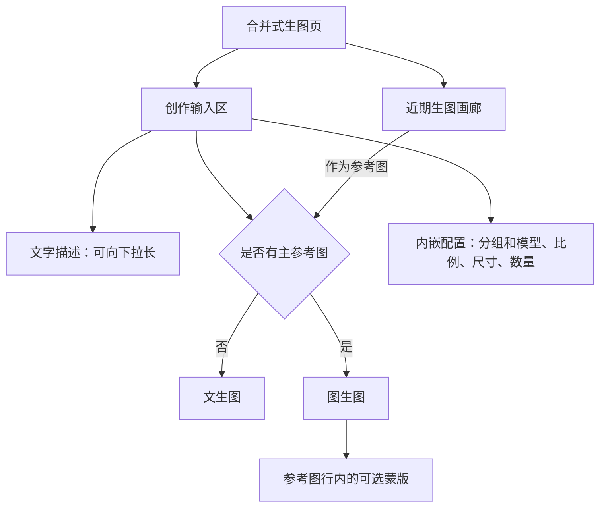
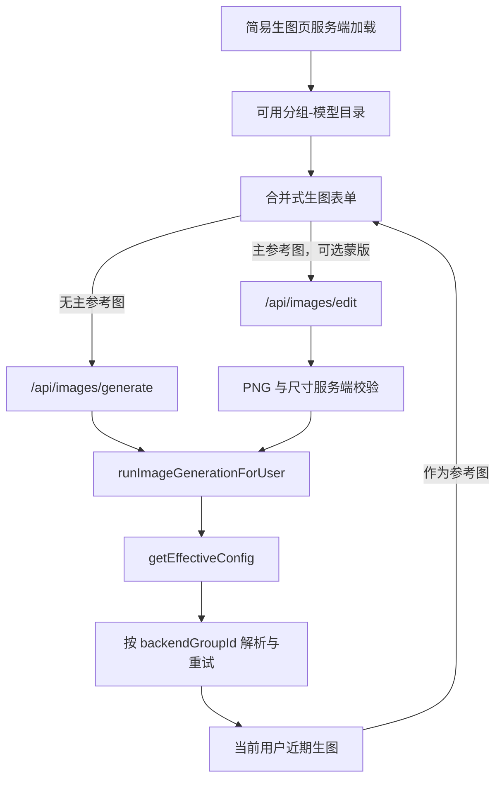
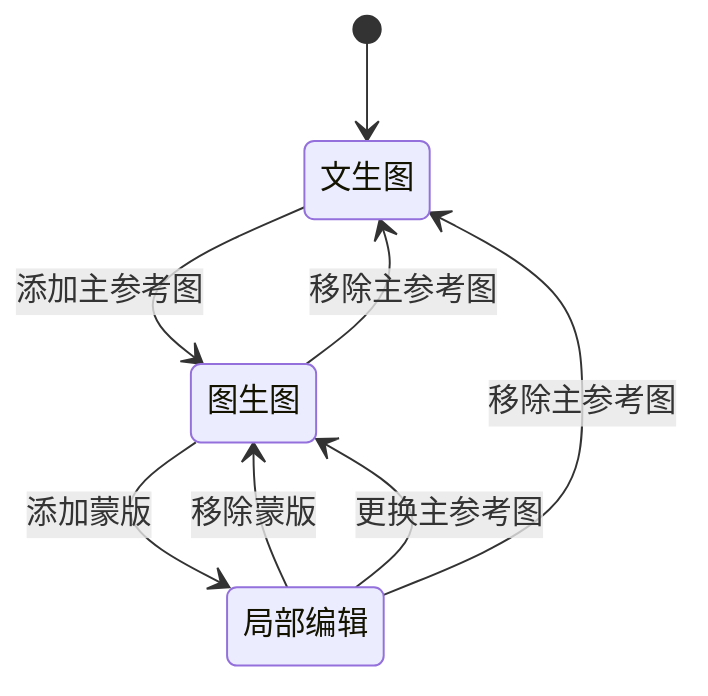

# 合并式生图页 - Plan

## Goal Capsule

- **Objective:** 新增独立的简易生图页，让文字描述与可选主参考图共用一张创作表单，并用近期生图替代独立的本次结果区。
- **Product authority:** 本文固定 `/dashboard/generate` 简易生图页的信息架构、文生图与图生图状态、内嵌配置、按授权分组的模型选择、近期图片复用和蒙版关联；旧 `/dashboard/create` 保持没有菜单入口，Chat、Agent、瀑布流、视频创作不属于本计划。
- **Open blockers:** 无；首版固定为一张主参考图和一张与其绑定的可选蒙版。

---

## Product Contract

### Summary

FluxMedia 新增 `/dashboard/generate`，作为无 Tab 的单一创作表单。
用户填写“文字描述”即可文生图，添加一张主参考图后在原位进入图生图；设置置于输入区下方，页面底部展示可复用的近期生图而非本次结果。

### Problem Frame

当前创作页把文生图与改图分为不同模式，用户需要先判断入口再开始创作；新的简易生图入口应直接进入统一工作区。
模型候选也以静态列表呈现，无法直观表达当前用户可使用的后端分组与模型归属。

### Key Decisions

- **以参考图驱动模式。** (session-settled: user-approved — chosen over separate text-to-image and image-to-image tabs: a single form makes the optional image condition easy to understand.) 无参考图即文生图，有主参考图即图生图；Governs R1-R4。
- **配置嵌入创作输入区。** (session-settled: user-directed — chosen over a separate generation-settings area: prompt, image condition, and generation choices should be adjusted together.) 模型、比例、尺寸和数量紧贴文字描述与附件；Governs R5-R6。
- **按授权分组选择模型。** (session-settled: user-directed — chosen over one flat static model list: users need to see every permitted group and the models that belong to it.) 选择模型同时确定本次请求所属分组；Governs R7-R8。
- **近期生图是下方主内容。** (session-settled: user-directed — chosen over a dedicated current-result panel: generated images should become an immediately reusable reference source.) 新图片置于最左侧，悬停即可选作参考图；Governs R13-R15。
- **蒙版绑定主参考图。** (session-settled: user-approved — chosen over a standalone mask row: the one-to-one relationship must stay visible where the source image is managed.) 蒙版入口、缩略图和编辑操作均位于主参考图行；Governs R9-R12。

### Layout Map

### Actors

- A1. **已登录用户：** 描述画面、选择授权模型、添加或移除参考图与蒙版，并从近期生图复用图片。
- A2. **简易生图页：** 根据主参考图状态呈现文生图、图生图或局部编辑，并维持输入、配置与附件的一致性。
- A3. **生图能力与历史图片服务：** 只提供当前用户可调用的分组与模型，以及该用户可复用的近期生图。

### Requirements

**单一创作流**

- R1. 页面生图只能呈现一张无 Tab 的创作表单，主输入名称为“文字描述”，不得要求用户在文生图与图生图之间预先切换页面或模式。
- R2. 未添加主参考图时，表单按文生图提交；添加主参考图后，同一表单按图生图提交，文字描述、已选配置和页面位置不得跳变。
- R3. 文字描述输入区必须支持用户向下拖拽增高，且增高后仍能清晰访问附件行、配置行和生成操作。
- R4. “添加参考图”必须作为输入区内清晰可发现的附件操作，支持本地上传或从近期生图选择；首版一次只保留一张主参考图，并在同一行提供缩略图、更换和移除操作。
- R5. 本次生图的核心配置必须直接置于文字描述与参考图行下方，不再以独立的生成设置区域承载；至少包括分组与模型、画面比例、尺寸和数量。
- R6. 每个可选画面比例必须同时展示文字比例和对应宽高形状的预览模具，使用户无需仅凭比例文本判断横竖构图。

**授权分组与模型**

- R7. 模型选择器必须列出当前用户获准使用的全部生图分组，并在每个分组下只展示该分组可请求的模型；选中一个模型时，页面必须同时绑定其所属分组和模型。
- R8. 没有可用分组或模型时，页面不得以静态候选假装可生成，必须显示可理解的不可用状态并阻止提交；未声明模型清单的兼容分组不得因缺少声明而被静默移除。

**主参考图与蒙版**

- R9. 仅在存在主参考图时，参考图行显示“添加蒙版”入口；文生图状态不显示蒙版入口、缩略图或编辑器。
- R10. 首版的蒙版与主参考图是一对一关系。添加后，参考图行必须显示蒙版已添加状态、缩略图、编辑和移除操作；更换或移除主参考图时，必须同时清除其蒙版。
- R11. 用户必须能在同页绘制蒙版或上传 PNG 蒙版。蒙版尺寸必须与主参考图一致，透明区域的编辑语义必须被说明；尺寸或文件格式不符合时必须拒绝提交并给出可理解的反馈。
- R12. 当所选分组或模型不支持图生图或蒙版编辑时，页面不得把不适用的能力伪装为可用，并必须在提交前阻止不兼容组合。

**近期生图复用**

- R13. 创作区下方必须展示当前用户的近期可用生图图片，不再展示独立的“本次结果”区域。
- R14. 新生成的图片必须按最新优先插入近期生图画廊最左侧；一次生成产生多张图片时，全部新图片均排在既有图片之前。
- R15. 鼠标移至近期图片时必须显示“作为参考图”操作；选择后，该图成为主参考图并就地进入图生图状态，不跳转到其他页面。该操作也必须可通过键盘完成。

**一致性与保护**

- R16. 合并后的界面不得改变既有图像生成、用户归属、内容审核、积分扣费或后端路由的业务语义；分组与模型选择只能通过当前用户被授权的图像生成能力生效。
- R17. 上传、模型不兼容、蒙版校验失败、生成中和生成失败必须各自提供可理解的页面反馈，且不得暴露上游响应、内部路径、凭据或其他用户的图片。

### Key Flows

- F1. **文生图**
  - **Trigger:** A1 填写文字描述并保留空的主参考图。
  - **Actors:** A1、A2、A3。
  - **Steps:** A1 调整内嵌配置并提交；A2 以文生图状态组织请求；A3 按获准分组与模型执行生成。
  - **Outcome:** 新图片出现在近期生图画廊最左侧，页面不出现独立本次结果区。
  - **Covered by:** R1-R8、R13-R17。
- F2. **从近期生图进入图生图**
  - **Trigger:** A1 悬停或用键盘聚焦一张近期图片并选择“作为参考图”。
  - **Actors:** A1、A2、A3。
  - **Steps:** A2 将图片填入主参考图行，保留文字描述与内嵌配置；A1 修改描述或配置后提交。
  - **Outcome:** 用户无需切换 Tab 或离开页面即可基于自己的近期图片创作。
  - **Covered by:** R2-R7、R13-R16。
- F3. **局部编辑**
  - **Trigger:** A1 在已有主参考图的行内选择“添加蒙版”。
  - **Actors:** A1、A2、A3。
  - **Steps:** A1 绘制或上传与主参考图匹配的 PNG 蒙版；A2 展示已绑定状态并在更换或移除主参考图时同步清理；A1 提交局部编辑。
  - **Outcome:** 生成只带一张主参考图及其对应的可选蒙版，不会遗留或误用旧蒙版。
  - **Covered by:** R9-R12、R16-R17。

### Acceptance Examples

- AE1. **Covers R1-R6.** Given 用户打开页面且未添加参考图，when 输入“文字描述”、向下拉长输入区、选择带比例预览的 16:9 并提交，then 页面按文生图生成，配置仍位于输入区下方，页面上没有文生图或图生图 Tab。
- AE2. **Covers R4、R13-R15.** Given 近期生图画廊已有可用图片，when 用户悬停或用键盘选择其中一张“作为参考图”，then 该图出现在主参考图行，文字描述和配置保持不变，页面就地进入图生图状态。
- AE3. **Covers R7-R8、R16.** Given 用户可使用多个生图分组，when 打开模型选择器并选择某分组中的模型，then 所有允许分组按分组显示，模型不跨组混列，提交使用所选分组和模型；没有可用选项时无法提交。
- AE4. **Covers R9-R12.** Given 用户已添加一张主参考图，when 在该行添加尺寸一致的 PNG 蒙版，then 页面显示该蒙版已绑定且可编辑或移除；when 用户改换或移除主参考图，then 蒙版同步消失；when 上传尺寸不符或格式不符的文件，then 页面拒绝该蒙版并说明原因。
- AE5. **Covers R13-R15.** Given 用户刚完成一轮生成，when 生成图片返回，then 新图片位于近期生图画廊最左侧，既有图片依次右移，且页面没有独立“本次结果”面板。

### Scope Boundaries

- 本次新增 `/dashboard/generate` 作为唯一菜单入口；旧 `/dashboard/create` 继续保留但不在菜单中展示。
- 本次不改造 Chat、Agent、瀑布流或视频创作的交互与模型选择。
- 首版不支持多张参考图、多张蒙版、参考图与蒙版的多对多关联或完整图片编辑器。
- 本次不改变现有生成 API、积分、审核、存储、用户归属和后端路由的业务规则。
- 本次不保留独立“本次结果”区域；生成产物通过近期生图画廊承接。

### Dependencies / Assumptions

- 用户可使用的后端分组及其模型能力必须成为模型选择器的唯一授权来源，不能继续由前端静态候选独立决定。
- 近期生图只复用当前用户有权访问的生成图片，并保持最新优先的有限历史展示。
- 蒙版的文件格式、尺寸和主参考图关联必须在所有可提交路径中保持有效，不能仅依赖视觉状态。

### Sources / Research

- `apps/web/src/app/[locale]/(dashboard)/dashboard/create/page.tsx`
- `apps/web/src/app/[locale]/(dashboard)/dashboard/generate/page.tsx`
- `apps/web/src/features/image-generation/components/create-page-client.tsx`
- `apps/web/src/features/image-generation/queries.ts`
- `apps/web/src/features/image-backend-pool/service.ts`
- `packages/shared/src/image-backend/supported-models.ts`
- `apps/web/src/app/api/images/edit/route.ts`

---

## Planning Contract

### Product Contract preservation

Product Contract preservation: unchanged.

本计划保留 R1-R17、F1-F3 与 AE1-AE5 的含义和稳定 ID。
技术设计不得把“按用户允许分组选择模型”降级为前端静态筛选，也不得新建绕开 `runImageGenerationForUser` 的生图路径。

### Key Technical Decisions

- KTD1. **以服务端可用目录驱动分组与模型选择。** 页面加载时返回当前用户可实际选择的 `{ groupId, modelId, capabilities }` 目录，而不是把静态下拉列表当作授权来源。目录合并有效默认分组与当前套餐允许选择的分组，按分组保持排序；成员未声明 `supportedModelIds` 时保留该组的“默认模型/未声明完整模型清单”兼容状态，不能虚构完整模型列表或静默排除该分组。目录从实际成员和适配器能力给出文生图、图生图和蒙版可用性；当前不会透传蒙版的 Adobe 适配路径必须标为不支持蒙版。Governs R7-R8、R12、R16。
- KTD2. **本次选择的分组通过单一生图管线传到调度器。** `backendGroupId` 是一次请求的显式路由条件，服务端在解析前重新校验分组启用状态、套餐能力与可选择资格；外部 API Key 绑定的分组仍优先。调度重试必须带回同一显式分组；未显式选择时也必须固定首次解析的隐式默认分组，不能在同一次请求中因默认组变更跨组路由或错价。Governs R7-R8、R16-R17。
- KTD3. **复用已有 UOL 生成操作，但不将未覆盖上传编辑的操作伪装成通用入口。** 现有 `image.generate` 的 `backendGroupId` 契约需下传到既有生成调用；页面的 JSON 与 FormData 路由继续作为受保护的薄适配层，并最终汇入 `runImageGenerationForUser`。在为编辑图片和蒙版建立严格的 UOL 输入契约前，不用不透明 `extra` 绕过 schema，也不新增平行执行器。Governs R7、R11、R16。
- KTD4. **合并表单以“主参考图”为状态根。** 页面生图使用 `无主图`、`主图`、`主图加蒙版` 三个显式状态；主参考图只能是一张，替换或移除它时同步撤销预览 URL、清空蒙版和绘制数据。近期图复用沿用当前受控下载为 `File` 的路径，保留现有 `sendRef` 交接语义，但将旧 `image` 模式归一到合并表单。Governs R1-R4、R9-R11、R13-R15。
- KTD5. **蒙版在客户端提示、服务端强制验证。** 客户端在选择或绘制时显示 PNG、同尺寸和透明区域为编辑区域的说明；`/api/images/edit` 在上传临时对象前读取源图与蒙版的真实像素尺寸并拒绝不匹配的请求。服务端验证是最终边界，客户端校验只改善反馈。Governs R9-R12、R17。
- KTD7. **面向用户的失败反馈使用稳定安全文案。** 路由与页面将已识别的授权、上传、兼容性、审核和积分错误映射为可理解反馈；原始上游报错仅记录到服务端日志，不回显给用户。Governs R17。

### High-Level Technical Design

### Assumptions and constraints

- 现有“允许使用”以套餐能力、启用状态、`isUserSelectable` 和有效默认分组为权威；仓库目前没有独立的逐用户分组白名单数据模型。
- 有效默认分组即使不可手动选择，也必须作为可生成的回退项出现在目录中；只有在用户具备 `backendGroups.select` 能力时，才加入可显式选择的其他分组。
- 分组成员对模型的显式限制来自现有 API 和 Adobe 成员配置。成员未声明模型清单时，页面只能提供默认模型并说明兼容状态；没有足够能力数据时，目录不得把图生图或蒙版显示为可用。
- 首版不改变外部 API Key、Chat、Agent、瀑布流和视频的路由语义。
- 最近图片继续由服务端按当前用户、完成态、创建时间倒序和有限数量读取，页面只使用短时签名 URL。

### Implementation sequence

1. 先建立服务端目录和显式分组调度链路，令页面选择可被真实授权、计费和重试使用。
2. 再补齐蒙版真实尺寸校验，确保图生图请求的输入边界可验证。
3. 随后将页面图像区域收敛为合并式状态和展示组件，保留其他创作模式。
4. 最后执行特征测试、浏览器交互验证和全仓质量门。

### System-Wide Impact

- **授权与路由：** 页面选择不再只是视觉状态；每次平台请求都必须在服务端重新授权并固定到对应分组，API Key 绑定的分组优先级不可改变。
- **积分与审核：** 继续由 `runImageGenerationForUser` 承担审核、扣费、退款、存储和队列；不同分组的价格覆盖仍用于页面预估和最终扣费。
- **输入安全：** 图片与蒙版仍走现有上传限制，新增真实像素尺寸对比，避免伪造 MIME 或绕过客户端校验。
- **可访问性：** 近期图的“作为参考图”、添加或移除主参考图、添加或移除蒙版均须可聚焦、可通过键盘触发并有可感知名称；蒙版画布至少提供等价的上传路径和说明。
- **兼容性：** 旧的 `image` 活动模式及其 localStorage 值在挂载后归一到合并表单，保留从图库或历史图片传入的参考图交接，避免 hydration 或状态丢失。

### Risks and mitigations

| 风险 | 缓解措施 |
| --- | --- |
| 前端选择与实际调度分组不一致 | 在 resolver、首次调度和重试均传递并验证 `backendGroupId`，对伪造或失效组合 fail-closed。 |
| 空模型白名单被误解释为无可用模型 | 将空列表按历史“不限”语义映射为已知目录，而不是从页面隐藏该组。 |
| 替换参考图后遗留蒙版 | 状态转换集中清除蒙版文件、绘制点和预览 URL，并以纯状态测试覆盖。 |
| 客户端尺寸检查被绕过 | 在临时上传前由服务端读取图片元数据并拒绝不匹配的 PNG 蒙版。 |
| 超大组件重构引入无关回归 | 仅提取图像表单、配置、参考图和近期画廊的清晰边界；保留 Chat、Agent、瀑布流和视频行为。 |

---

## Implementation Units

### U1. 建立授权分组与模型目录

- **Goal:** 让页面获得按当前用户套餐、有效默认分组和可选择分组组织的模型目录，并为每个组合返回可展示的能力。
- **Requirements:** R5-R8、R12、R16；Covers AE3。
- **Dependencies:** 无。
- **Files:** `apps/web/src/features/image-backend-pool/service.ts`、`apps/web/src/features/image-backend-pool/types.ts`、`apps/web/src/features/image-generation/components/create-page-client.tsx`、`apps/web/src/app/[locale]/(dashboard)/dashboard/create/page.tsx`、`apps/web/src/app/[locale]/(dashboard)/dashboard/generate/page.tsx`、`apps/web/src/features/image-backend-pool/scheduler-selection.test.ts`、`packages/shared/src/image-backend/supported-models.test.ts`。
- **Approach:**
  1. 在后端池服务中定义面向页面的安全目录查询，联合有效默认分组与可选分组，去重并保持现有优先级。
  2. 从组成员的健康状态、声明模型和实际请求适配器推导模型项与生成、编辑、蒙版能力；空声明按 KTD1 保留默认模型和兼容状态，不伪造完整枚举。
  3. 页面服务端一次性加载目录和当前默认选择，客户端只按组渲染该数据，不自行扩展模型候选。
  4. 当目录没有可生成组合时，返回可解释状态而不是静态回退列表。
- **Patterns to follow:** `getEffectiveDefaultImageBackendGroup`、`getImageGenerationModelCatalogForPlan`、`collectAdvertisedModelIds`、`canAdobeBackendServeModel`。
- **Test scenarios:**
  - Covers AE3. 当前套餐可选多个分组时，目录按组返回且模型不跨组混列。
  - 有效默认组不可手动选择时，该组仍是可生成回退而不是被目录遗漏。
  - 未声明 `supportedModelIds` 的兼容成员保留默认模型和“未声明完整模型清单”状态，不被当作空组或伪装为完整枚举。
  - Adobe 适配成员因当前不会传递蒙版而不能把蒙版标为可用。
  - 组或模型无可执行能力时，目录不将其标为可提交。
  - 较低套餐或无 `backendGroups.select` 能力时，不能借目录取得其他分组。
- **Verification:** 目录只包含服务端授权的组合，所有现有分组选择与模型支持测试继续通过。

### U2. 将显式分组贯通请求、UOL 和调度重试

- **Goal:** 让页面选中的 `{ groupId, modelId }` 在服务端重新授权后驱动该次生成与失败重试。
- **Requirements:** R7-R8、R12、R16-R17；Covers F1、F2、AE3。
- **Dependencies:** U1。
- **Files:** `apps/web/src/app/api/images/generate/route.ts`、`apps/web/src/app/api/images/edit/route.ts`、`apps/web/src/features/image-generation/operations.ts`、`apps/web/src/features/image-generation/service.ts`、`apps/web/src/features/image-backend-pool/service.ts`、`apps/web/src/server/uol-bindings.ts`、`packages/shared/src/uol/operations/image-generation.ts`、`apps/web/src/features/image-backend-pool/scheduler-selection.test.ts`、`apps/web/src/features/image-generation/service-web-fallback.test.ts`、`packages/shared/src/uol/operations/image-generation-principal.test.ts`。
- **Approach:**
  1. 为现有请求输入、单一生成操作、有效配置解析和池 resolver 增加请求级分组字段，保持未提供字段时的平台默认分组行为。
  2. 在 resolver 中先保持外部 API Key 分组优先级，再对页面显式分组进行启用、套餐、选择能力、成员模型和实际请求能力校验；无效请求返回用户可理解的拒绝，不静默换组或丢弃蒙版。
  3. 把经验证的分组意图保留到换号与重试路径，确保第一次和重试都在同一选中分组内完成。
  4. 让既有 `image.generate` UOL schema/binding 正确下传 `backendGroupId`，但不以未建模的 `extra` 接收编辑图片或蒙版；两个页面路由仍作为薄适配层汇入既有单一管线。
- **Patterns to follow:** `resolveRequestedGroup`、`getEffectiveConfig`、`runImageGenerationForUser`、`image.generate` operation、`runBatchImageGeneration`。
- **Test scenarios:**
  - Covers AE3. 合法的显式分组和模型在首次调度与可重试失败后都保持同一组。
  - 伪造、禁用、不可选择或当前套餐无权的分组被服务端拒绝。
  - 外部 API Key 已绑定分组时，该绑定优先于页面字段。
  - 含蒙版的请求不会被调度到不传递蒙版的成员或适配器。
  - UOL 主体校验仍拒绝不匹配用户身份，且合法 `backendGroupId` 可传到既有生成执行器。
- **Verification:** 文生图与图生图请求都能在服务端看到并使用选中分组；无显式分组的其他入口继续走原有调度结果。

### U3. 强化主参考图与蒙版的服务端完整性

- **Goal:** 在保留现有上传限制的前提下，保证一张主参考图与一张 PNG 蒙版的真实尺寸关系不可被客户端绕过。
- **Requirements:** R9-R12、R16-R17；Covers F3、AE4。
- **Dependencies:** U2。
- **Files:** `apps/web/src/app/api/images/edit/route.ts`、`apps/web/src/features/image-generation/request-utils.ts`、`apps/web/src/features/image-generation/request-utils.test.ts`、`apps/web/src/features/image-generation/masked-outpaint.test.ts`。
- **Approach:**
  1. 将图片元数据读取和尺寸比较收敛为可单测的请求工具，复用项目现有图像处理依赖，不信任 MIME 或客户端声明的尺寸。
  2. 在 `/api/images/edit` 校验源图、蒙版 PNG 格式、总字节数和同宽高后，才上传临时对象并进入生成管线。
  3. 保持多图编辑旧 API 的现有边界；合并式页面只提交一张主参考图，蒙版只与该主图比较。
- **Patterns to follow:** `validateImageFile`、`getTotalUploadSize`、`filesToImageInputs`、现有 masked outpaint 覆盖。
- **Test scenarios:**
  - Covers AE4. 同尺寸 PNG 蒙版通过验证并保持原有编辑请求形状。
  - PNG 以外的蒙版、损坏图片元数据、尺寸不匹配和超出上传限制均在临时上传前失败。
  - 没有蒙版的图生图不受新校验影响。
  - 多个源图的旧编辑调用仍按既有首图规则验证蒙版，不改变其最大数量限制。
- **Verification:** 所有可提交路径在服务端拒绝不匹配蒙版，且既有蒙版与扩图测试通过。

### U4. 提取合并式页面生图状态与交互边界

- **Goal:** 用可测试的主参考图状态替换页面生图的多图、双 Tab 状态，并让旧参考图交接安全地落入合并表单。
- **Requirements:** R1-R4、R9-R11、R13-R15、R17；Covers F1-F3、AE1、AE2、AE4、AE5。
- **Dependencies:** U1、U2、U3。
- **Files:** `apps/web/src/features/image-generation/components/create-page-client.tsx`、`apps/web/src/features/image-generation/components/unified-image-generation-form.tsx`、`apps/web/src/features/image-generation/components/reference-image-row.tsx`、`apps/web/src/features/image-generation/unified-image-generation-state.ts`、`apps/web/src/features/image-generation/unified-image-generation-state.test.ts`、`apps/web/src/features/image-generation/reference-handoff.ts`。
- **Approach:**
  1. 从近万行的页面客户端中提取“无主图、主图、主图加蒙版”的纯状态转换和专用表现组件，页面客户端继续持有现有流式请求、积分同步和非图像模式编排。
  2. 移除图像区域中“文生图/图生图”两个 Tab 的选择要求；无主图提交生成请求，有主图提交编辑请求，文字描述和内嵌配置保持同一位置。
  3. 以单一主参考图替代该页面生图的多图集合；上传、近期图和 `sendRef` 均通过同一设置主图动作进入，替换或移除时统一清蒙版和释放预览资源。
  4. 旧 `image` 模式的 URL 或 localStorage 恢复在挂载后归一到合并表单，不能再次显示废弃 Tab 或造成 hydration 不一致。
  5. 让画布具备可访问名称和等价上传路径；近期图和参考图动作使用真实按钮、焦点样式与键盘触发。
- **Patterns to follow:** `useCreateRuntimeState`、`urlToEditImageFile`、`consumePendingReferenceHandoff`、`clearEditImages`、`setMask`。
- **Test scenarios:**
  - Covers AE1. 空主图时只构造文生图请求，文字描述 textarea 可垂直 resize，且页面没有图像模式 Tab。
  - Covers AE2. 从近期图或 `sendRef` 设置主参考图后，提示词和配置不被重置并转为图生图请求。
  - Covers AE4. 替换、移除主参考图或删除已选历史图时，蒙版文件、绘制点和预览资源全部清除。
  - 有主参考图但当前模型或分组不支持编辑、蒙版时，相关动作不可提交且提供原因。
  - 键盘聚焦近期图和蒙版相关操作时可发现、可执行且不依赖画布指针操作。
- **Verification:** 图像表单只存在一份提交表面，其他创作模式的状态和入口未被重构改写。

### U5. 布局内嵌配置与近期图片画廊

- **Goal:** 将设置收进文字描述下方，将生成结果统一沉淀到可复用的近期图片画廊。
- **Requirements:** R3-R8、R13-R15、R17；Covers F1、F2、AE1、AE2、AE3、AE5。
- **Dependencies:** U1、U2、U4。
- **Files:** `apps/web/src/features/image-generation/components/unified-image-generation-form.tsx`、`apps/web/src/features/image-generation/components/image-generation-config-bar.tsx`、`apps/web/src/features/image-generation/components/recent-image-gallery.tsx`、`apps/web/src/features/image-generation/components/create-page-client.tsx`、`apps/web/src/app/[locale]/(dashboard)/dashboard/create/page.tsx`、`apps/web/src/app/[locale]/(dashboard)/dashboard/generate/page.tsx`、`packages/shared/src/config/nav.ts`。
- **Approach:**
  1. 在可向下拉长的“文字描述”输入区内提供样式清晰的“添加参考图”附件入口和主参考图行。
  2. 将按组模型选择、画面比例、尺寸和数量放在输入区下方；比例选项使用文字和对应横竖比例模具，选中模型同时更新本次请求分组。
  3. 用按组标签的模型选择器消费 U1 目录，并在无可用组合或模型不兼容时显示不可提交状态。
  4. 移除合并表单的独立本次结果展示；成功批次按返回顺序整体前插近期状态，最近图片始终位于左侧并受已有有限条数约束。
  5. 近期画廊悬停和键盘聚焦时显示“作为参考图”，点击仅设置主参考图而不打开独立预览；保留其他模式需要的预览行为在其边界内。
- **Patterns to follow:** `SizeRatioIcon`、`addSuccessfulResults`、`getUserRecentGenerations`、`buildSignedStorageImageUrl`、`@repo/ui` 表单与按钮组件。
- **Test scenarios:**
  - Covers AE1. 每个比例项同时显示比例文本和对应形状，输入框增高后配置和提交仍可访问。
  - Covers AE3. 选择一个分组中的模型会随请求提交其分组，空目录不会显示静态候选或启用按钮。
  - Covers AE5. 一次返回多张成功图片时，它们按生成批次顺序插到已有近期图片左侧，且没有本次结果面板。
  - Covers AE2. 鼠标和键盘都可将近期图片设置为主参考图，且不跳转页面。
  - 生成中、上传失败、模型不兼容和服务端拒绝均显示安全、可理解的反馈。
- **Verification:** 浏览器中合并表单、比例预览、分组模型目录、参考图、蒙版和近期画廊的关键状态可端到端操作。

### U6. 收敛失败反馈并验证可访问流程

- **Goal:** 让合并表单在安全失败、生成中和键盘操作时给出一致、可感知的反馈，而不暴露上游细节。
- **Requirements:** R12、R15、R17；Covers AE2、AE3、AE4。
- **Dependencies:** U2、U3、U4、U5。
- **Files:** `apps/web/src/features/image-generation/error-sanitize.ts`、`apps/web/src/features/image-generation/error-sanitize.test.ts`、`apps/web/src/app/api/images/generate/route.ts`、`apps/web/src/app/api/images/edit/route.ts`、`apps/web/src/features/image-generation/components/unified-image-generation-form.tsx`、`apps/web/src/features/image-generation/components/recent-image-gallery.tsx`。
- **Approach:**
  1. 将分组授权、模型能力、蒙版格式或尺寸、上传限制、积分和已知审核失败映射到稳定的用户文案。
  2. 保留上游原始错误用于受控服务端日志和调度诊断，禁止由 JSON、SSE 或 toast 直接回显。
  3. 为生成中状态、上传失败和不兼容状态补充可访问名称或状态播报，并验证 Enter 与 Space 能执行近期图复用。
- **Patterns to follow:** `error-sanitize.ts`、`showGenerationError`、现有近期图片按钮与 `focus-visible` 样式。
- **Test scenarios:**
  - 伪造的上游错误文本不会出现在用户响应或 toast 文案中。
  - 权限、兼容、上传和蒙版失败均有不含内部路径或凭据的稳定提示。
  - Covers AE2. 近期图卡片通过 Enter 或 Space 设置主参考图，生成中状态可被辅助技术感知。
- **Verification:** 页面错误反馈不泄漏上游细节，键盘和鼠标走同一参考图操作。

---

## Verification Contract

| 范围 | 证明方式 | 完成信号 |
| --- | --- | --- |
| 分组、模型与调度 | 扩展后端池目录、显式分组、API Key 优先与重试保持分组的单元测试 | 伪造请求被拒绝，合法选择在整个调度周期保持同组。 |
| UOL 兼容 | 覆盖 `image.generate` 的主体校验和 `backendGroupId` 下传 | 既有 operation 不丢失身份约束，字段能到达单一管线。 |
| 蒙版输入边界 | 扩展请求工具和 masked outpaint 测试 | 格式、像素尺寸、损坏文件和无蒙版路径都得到预期结果。 |
| 合并表单状态 | 新增纯状态测试，覆盖主参考图、蒙版清理和旧 handoff 归一 | 三态转换不遗留蒙版或 blob URL。 |
| 浏览器交互 | 运行简易生图页浏览器验证 | 无 Tab 合并表单、键盘参考图、比例模具、分组模型和近期图片前插可见且可操作。 |
| 错误与可访问性 | 扩展错误脱敏与交互测试 | 原始上游错误不回显，键盘操作和生成中状态可感知。 |
| 质量门 | `turbo typecheck`、`turbo lint`、`turbo test` | 受影响测试和全仓质量门通过；已有环境性失败若出现需独立记录并保留新增测试结果。 |

---

## Definition of Done

- U1 完成：页面只接收服务端权威的分组模型目录，空白名单和默认分组兼容语义已测试。
- U2 完成：页面选定分组经服务端授权、首次调度和重试均保持一致，API Key 绑定分组的优先级未变。
- U3 完成：任何提交路径都无法用错误格式、错误尺寸或损坏的蒙版绕过校验。
- U4 完成：页面生图没有文生图/图生图双 Tab，且主参考图变化必清蒙版；其他创作模式未被改变。
- U5 完成：配置位于文字描述下方，比例有视觉预览，近期图片是页面下方唯一的生成结果承接区，新批次在最左侧且可键盘设为参考图。
- U6 完成：用户反馈不包含上游原始错误、内部路径或凭据，键盘与鼠标参考图操作保持一致。
- 产品合同的 R1-R17、F1-F3 与 AE1-AE5 均在至少一个实现单元或验证项中得到覆盖。
- 所有新增或修改文件含职责明确的文件级注释和组件或函数注释；没有遗留死代码、注释掉的代码或未完成标记。
- 已移除实现过程中产生的废弃尝试、不可达状态和过期的本次结果 UI，不把临时兼容逻辑留在最终差异中。
