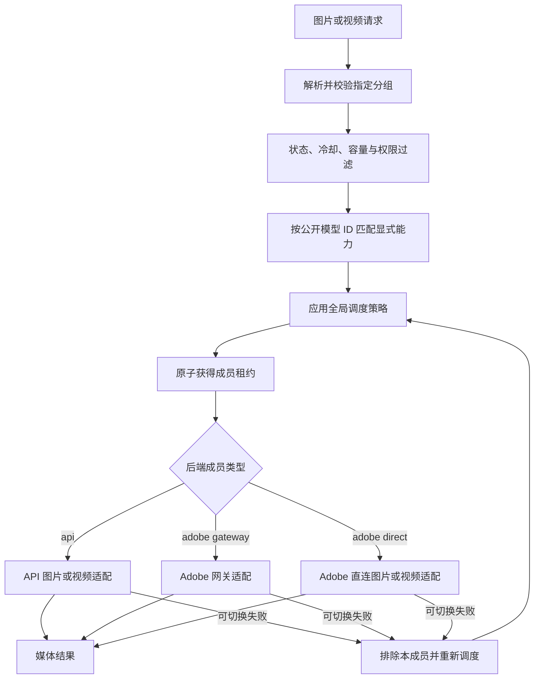
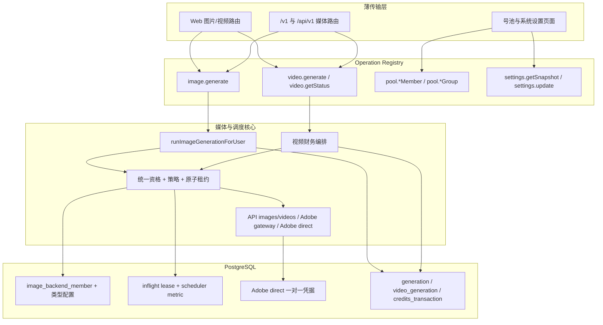
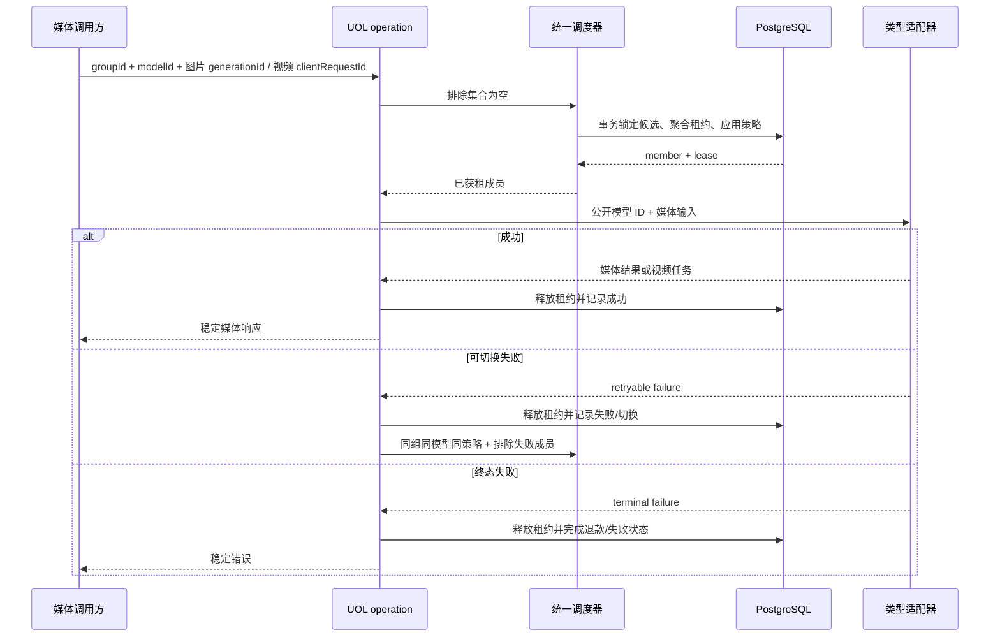
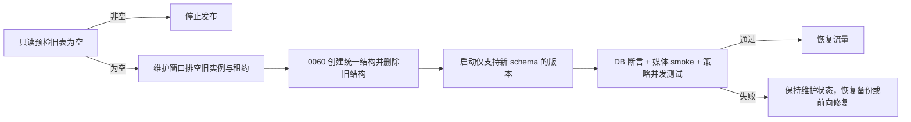
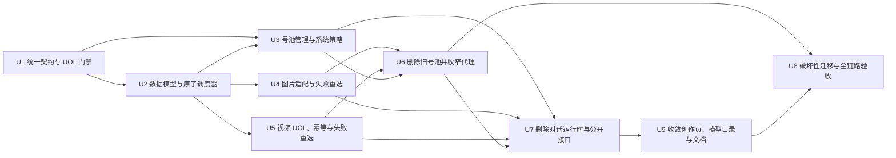

# 媒体后端统一号池重构 - Plan

## Goal Capsule

- **Objective:** 将 FluxMedia 收敛为只承载图片生成、图片编辑和视频生成的媒体平台，并以单一后端号池统一 API 与 Adobe 成员的管理和调度。
- **Product authority:** 本文固定媒体能力边界、统一号池语义、模型能力筛选、全局调度策略及旧链路的彻底退场；统一接口层、单一生图管线和财务不变量继续作为项目级约束。
- **Open blockers:** 无设计阻塞；模型广场分支已经合并。发布时仍须原子迁移现存
  API/Adobe 号池及 Adobe 直连账号凭据，旧 Web 账号无数据且无需运行时兼容期。
- **Execution profile:** Deep；跨数据库、UOL、调度器、图片与视频编排、管理后台、部署资产和公开 API 的单次破坏性切换。
- **Stop conditions:** 旧 Web 数据或运行中旧状态未排空、API/Adobe 数据无法无损映射、统一租约无法提供跨副本一致性、删除链路会破坏媒体账本或保留能力时立即停止，不以兼容分支绕过。
- **Tail ownership:** U8 负责维护窗口、迁移、全仓门禁、浏览器验收和发布后 smoke；前序单元不得单独部署到旧 schema。

---

## Product Contract

### Summary

FluxMedia 将只保留图片生成、图生图、蒙版编辑和视频生成能力，并用一个统一号池管理 `api` 与 `adobe` 两种后端成员。
请求先在指定分组内按显式模型能力筛选候选，再由可动态配置的全局策略完成跨类型调度。

### Problem Frame

当前后端池以 Web 账号、通用 API 和 Adobe 三套成员模型表达相近的分组、健康、并发和调度概念，同时还保留注册机、Sub2API、Codex、Responses 与 Agent 等不符合当前媒体业务的链路。
Adobe 身份也由独立 Adobe 成员和 API 成员上的 `adobeSourced` 标记重复表达，模型前缀进一步参与候选预分流，使模型能力、成员类型和上游协议互相耦合。
这些分支让后台管理、统一接口、定时任务和故障切换持续承担不再需要的复杂度。

### Key Decisions

- **采用真正统一的后端成员模型。** (session-settled: user-approved — chosen over 仅统一调度投影: API/Adobe 存量可迁入单一模型，继续保留两套内部模型只会隐藏重复职责。) Governs R5-R8。
- **旧 Web 号池能力一次性彻底退场。** (session-settled: user-directed — chosen over 停用保留或先导出: 线上只有旧 Web 账号确认无数据；API/Adobe 数据必须迁移，不需要为 Web 保留兼容层或回滚读取路径。) Governs R1-R3。
- **Adobe 身份只由成员类型表达。** (session-settled: user-directed — chosen over `api` 类型叠加 Adobe 来源标记: 单一身份来源可消除调度分支，同时保留 Adobe 网关与直连能力。) Governs R5-R7、R10-R11。
- **Adobe direct 账号提升为顶层成员。** (session-settled: user-directed — chosen over 在 Adobe 成员内部继续维护账号/token 子池: 统一调度器应直接调度每个账号，避免成员内外两级切换和重复状态。) Governs R5-R8、R19。
- **模型能力而非类型或前缀决定候选。** (session-settled: user-directed — chosen over 组内盲试或按模型前缀分流: 账号显式声明支持模型可以跨类型公平调度并避免无效调用。) Governs R9-R13。
- **调度策略使用全局动态配置。** (session-settled: user-directed — chosen over 分组覆盖或仅分组配置: 当前业务只需要一个可运行时切换的系统级策略。) Governs R14-R19。
- **平台只保留媒体任务。** (session-settled: user-directed — chosen over 保留内部 Responses 生图适配或隐藏对话实现: 对话、Agent、Codex 和 Responses 均不属于目标业务。) Governs R1-R4、R12-R13。
- **沿用现有公开模型 ID，但取消名称语义。** (session-settled: user-directed — chosen over 新建供应商无关别名或直接暴露上游 ID: 现有 ID 可继续作为稳定能力键，无需承担调度职责。) Governs R9-R13。
- **统一接口层继续作为唯一能力入口。** 所有保留或改造后的媒体与号池能力先注册为 operation，传输层只负责解析、Principal 构造和响应编码；Governs R4、R20。

### Target Dispatch Shape

### Actors

- A1. **平台管理员：** 在单一号池页面管理分组、后端成员、模型能力和类型专属配置，并在系统配置页切换全局调度策略。
- A2. **媒体调用方：** 通过站内创作界面或外部 API 提交图片生成、图片编辑和视频任务，不接触成员类型或上游协议。
- A3. **统一调度网关：** 校验分组与模型能力，应用全局策略，获得并释放租约，并在可切换失败后选择下一候选。
- A4. **媒体后端：** 以 `api` 或 `adobe` 成员身份执行图片或视频请求；Adobe 成员可使用网关或直连模式。

### Requirements

**平台边界与退场**

- R1. 平台必须保留文生图、图生图、蒙版编辑、视频生成与视频结果查询，并继续保留对应的媒体历史、存储和使用记录。
- R2. 平台必须彻底删除站内 Chat、Agent、waterfall、多轮对话、文本响应和对话式 PPT/PSD，以及外部 Responses、Chat Completions、Agent 与 editable-file API；不得保留隐藏入口、关闭开关或未接线兼容实现。
- R3. 平台必须彻底删除 Web/Codex 账号池、注册机、Sub2API 及其导入、同步、自动补号、系统设置、定时任务、统一接口、部署资产、测试和文档；Adobe direct 仍需的 TLS 转发能力必须移出 ChatGPT 命名和行为，旧数据结构无需保留或迁移。
- R4. 保留媒体链路不得改变单一生图管线、内容审核、对象存储、用户归属和积分账本不变量；视频生成、查询、扣费与退款必须纳入统一接口层后继续保持幂等财务闭环。

**统一号池与后台管理**

- R5. 系统必须只有一个顶层后端成员模型，并以 `api | adobe` 作为互斥的成员类型；分组关系、模型能力、启停、健康、冷却、优先级、并发、获租计数和调度指标使用统一语义。
- R6. `adobe` 类型必须保留 `gateway | direct` 两种模式；每个 direct 顶层成员必须恰好保存一个 Adobe 账号的 Cookie、短期 token、刷新状态和余额，不得再有内部账号/token 子池；gateway 模式继续支持外部 Adobe 兼容网关。
- R7. API 后端原有 `adobeSourced` 身份开关必须删除，其承载的 Adobe 网关能力归入 `adobe` 类型；不得同时用成员类型和布尔标记表达 Adobe 身份。
- R8. 管理后台必须提供一个号池页面和一个新增入口，统一展示公共状态与调度字段，并按所选成员类型展示和校验专属配置；管理员可手动清除成员的暂态健康降级、失败冷却和最近错误，但不得借此伪造凭据有效或修改累计指标、租约和启用状态。

**模型与协议**

- R9. 每个后端成员必须显式声明其支持的公开模型 ID，候选资格必须由请求模型与该声明匹配决定；未声明能力的成员不得被当作支持所有模型。
- R10. 账号类型不得作为模型候选的预分流条件；同一分组内的 `api` 与 `adobe` 成员只要声明支持请求模型并通过通用资格过滤，就必须进入同一候选集合。
- R11. 图片与视频的真实模型 ID 只作为普通能力键；视频时长、比例和分辨率必须作为独立参数，不得编码进 `firefly-<family>-<dur>s-<ratio>[-<res>]` 等复合模型 ID。调度器不得根据前缀、家族名称或 Adobe 来源标记缩窄成员类型。
- R12. `api` 类型保留 Images 与 Videos 兼容协议，不得保留 Responses、Mixed、Chat Completions 或 Images-to-Responses 上游模式；视频提交使用真实模型 ID、独立参数和稳定客户端请求键。
- R13. 视频模型由显式能力声明参与统一筛选；API 与 Adobe Direct 可以声明并承接视频模型，Adobe Gateway 不得保存或执行视频模型。

**全局调度策略**

- R14. 系统配置页必须提供 `按优先级 | 按最少调用 | 按最小负载` 三种全局策略，默认值为按优先级；合法配置变更必须无需重启并只影响变更后的新获租请求。
- R15. 所有策略必须先应用启用状态、终态错误、冷却、并发容量、分组权限、内容安全和 R9 的模型能力过滤，再对剩余候选排序；策略不得绕过这些资格条件。
- R16. 按优先级必须保持数值越小优先级越高；同优先级候选先偏好健康成员，再以最久未获租、最久未使用和稳定顺序打破平局。
- R17. 按最少调用必须比较成员累计成功获租次数，成员一旦获得租约即计数，无论后续调用成功或失败；相同计数使用优先级、健康度和最久未获租顺序打破平局。
- R18. 按最小负载必须比较 `当前有效在飞数 ÷ 成员并发上限`，使用可跨应用副本一致观察的租约口径；相同占用率使用优先级、健康度、累计获租次数和最久未获租顺序打破平局。
- R19. 普通图片与视频任务不得保留会话粘性；成员发生可切换失败时，调度器必须排除本轮已失败成员，并以同一全局策略在剩余合格候选中重新选择。视频仅在上游尚未确认接受任务时允许切换；一旦获得上游任务标识，轮询与下载失败必须在原任务上恢复，避免重复提交。

**统一接口与可观测性**

- R20. 号池 CRUD、分组管理、调度策略读写、图片生成与编辑、视频生成与查询必须通过统一接口层 operation 暴露；被删除能力的 operation、binding、能力位和审计入口必须同步移除。
- R21. 调度记录必须能区分策略、成员类型、成员 ID、分组、获租、切换、容量拒绝和失败结果，使管理员能验证三种策略的实际行为，而不得记录凭据或用户媒体内容。
- R22. 系统设置缺失、非法或暂时不可读时，调度必须安全回退到按优先级；可选的观测服务不可用时不得阻断媒体生成。

### Key Flows

- F1. **管理员配置统一号池**
  - **Trigger:** A1 打开号池页面并新增或编辑成员。
  - **Actors:** A1、A4。
  - **Steps:** A1 选择 `api` 或 `adobe`，填写公共配置和类型专属配置，选择分组并声明模型能力；系统按类型校验后保存为统一成员。
  - **Outcome:** 单一列表展示该成员的类型、模式、能力、状态和调度数据，不再出现 API 与 Adobe 分离页签或 Adobe 来源开关。
  - **Covered by:** R5-R13。
- F2. **媒体请求获得成员**
  - **Trigger:** A2 以公开模型 ID 向一个可用分组提交图片或视频请求。
  - **Actors:** A2、A3、A4。
  - **Steps:** A3 校验分组与权限，应用通用资格和模型能力过滤，按当前全局策略排序并原子获租，再按命中成员的类型与模式调用适配器。
  - **Outcome:** 请求由声明支持该模型的合格成员执行，候选过程不解析模型前缀决定账号类型。
  - **Covered by:** R9-R19、R21-R22。
- F3. **失败后切换成员**
  - **Trigger:** A4 返回可切换错误或成员在获租时已无容量。
  - **Actors:** A3、A4。
  - **Steps:** A3 上报结果并释放租约，将已失败成员加入本轮排除集合，再用原分组、原模型和原策略选择下一候选。
  - **Outcome:** 请求不会回到本轮失败成员、漂移到其他分组或调用不支持该模型的成员。
  - **Covered by:** R15-R19、R21-R22。
- F4. **动态切换调度策略**
  - **Trigger:** A1 在系统配置页选择另一种全局策略。
  - **Actors:** A1、A3。
  - **Steps:** 系统校验并发布新设置；已获租请求继续运行，新请求使用新策略；非法设置回退到按优先级并留下可定位记录。
  - **Outcome:** 管理员无需重启服务即可观察后续请求采用新策略。
  - **Covered by:** R14-R18、R21-R22。

### Acceptance Examples

- AE1. **Covers R5-R11、R15-R16.** Given 同一分组有一个 `api` 和一个 `adobe` 成员且都声明支持同一图片模型，when 当前策略为按优先级并提交该模型，then 两者都进入候选，数值更小的优先级先获租，模型名称是否含 `firefly-` 不改变成员类型范围。
- AE2. **Covers R9-R13.** Given 分组中的 API 与 Adobe Direct 成员都声明支持 `seedance2`，when 提交独立时长、比例和分辨率的视频请求，then 两者都可按统一策略进入候选，上游模型字段始终为 `seedance2`；Adobe Gateway 即使收到脏配置也不能执行视频。
- AE3. **Covers R14、R17.** Given 三个合格成员的累计获租次数分别为 8、3、3，when 策略切换为按最少调用并提交新请求，then 次数为 3 的成员优先，并按规定平局顺序确定其中一个；命中后其计数立即增加，即使上游随后失败。
- AE4. **Covers R14、R18.** Given 两个合格成员的在飞数和并发上限分别为 `2/10` 与 `1/2`，when 策略为按最小负载，then 系统选择占用率 20% 的前者，而不是选择绝对在飞数较小的后者。
- AE5. **Covers R14、R19、R21-R22.** Given 管理员动态切换策略且已有请求持有租约，when 新请求到达，then 旧请求不被迁移，新请求使用新策略；when 设置值非法，then 新请求按优先级调度并产生不含凭据的诊断记录。
- AE6. **Covers R2-R4、R20.** Given 重构已交付，when 用户或外部客户端查找对话、Agent、waterfall、Responses、Codex、Web 账号、注册机、Sub2API、对话式 PPT/PSD 或 editable-file 能力，then 页面、API、operation、设置、任务和文档均不存在，而图片生成、图片编辑与视频财务闭环继续可用。
- AE7. **Covers R15、R19.** Given 首个成员返回可切换失败，when 同组仍有支持相同模型的合格成员，then 调度器释放首个租约并按当前策略选择剩余成员；若没有剩余成员，则返回可定位的无可用后端错误且不跨组调用。

### Scope Boundaries

- 本次包含所有对话、waterfall、对话式 PPT/PSD、editable-file 与旧号池能力的代码、数据结构、配置、定时任务、部署资产、统一接口、能力位、测试和文档清理；不保留 dormant compatibility code。
- 本次保留媒体产物历史、图库、使用统计、审核、存储和积分账本，不删除与图片或视频结果有关的数据能力。
- 图片结果派生的 PSD 导出不是目标媒体链路，随相关能力位与 UOL operation 一并退场；图像管线仍使用的背景移除纯函数迁入图片领域后保留。
- API 视频兼容协议仅覆盖 `/videos/generations` 提交、上游状态 URL 或 `/videos/{taskId}` 回退轮询及产物下载；不扩展为任意供应商私有协议。
- 本次不创建新的供应商无关模型别名，也不重命名现有公开模型 ID。
- 本次不增加分组级调度策略覆盖、加权随机、延迟感知、失败率加权或自动策略切换。
- 本次不新增第三种后端成员类型；旧 Adobe direct 子池中的每个账号提升为一个 `adobe` 顶层成员，账号间切换只由统一调度器负责。

### Dependencies / Assumptions

- 目标环境没有需要保留的 Web/Codex、Sub2API 或注册机数据，因此这些结构可以一次性删除；旧 API/Adobe 号池存在数据，必须在同一事务内保留并转换，执行前以只读 preflight 验证可迁移性。
- 生图继续汇入 `runImageGenerationForUser`，不得新建平行图片管线。
- 财务真相继续位于 `credits_transaction`；视频扣费和退款继续使用同一服务端 operation context 与幂等 `sourceRef`。
- 调度容量以现有租约机制为并发事实来源；规划必须保证最小负载在多副本环境下使用一致口径。
- 模型能力、成员类型和类型专属配置均属于不可信配置输入，保存与调用边界必须严格校验并 fail-closed。

### Sources / Research

- `packages/database/src/schema.ts`
- `apps/web/src/features/image-backend-pool/service.ts`
- `apps/web/src/features/image-backend-pool/admin-panel.tsx`
- `apps/web/src/features/image-generation/operations.ts`
- `apps/web/src/features/image-generation/video-operations.ts`
- `apps/web/src/features/image-generation/adobe-sourced-firefly.ts`
- `apps/web/src/features/external-api/handlers/responses.ts`
- `apps/web/src/features/external-api/handlers/video-generations.ts`
- `packages/shared/src/uol/operations/image-backend-pool.ts`
- `packages/shared/src/uol/operations/image-generation.ts`
- `packages/shared/src/system-settings/definitions.ts`
- `packages/shared/src/subscription/services/plan-capabilities.ts`
- `apps/web/src/server/internal-job-scheduler.ts`
- `apps/web/src/features/image-generation/components/create-page-client.tsx`
- `apps/web/src/features/external-api/handlers/editable-file-generations.ts`
- `services/chatgpt-web-proxy/main.go`
- `docker-compose.yml`
- `docs/image-backend-pool-scheduling.md`

---

## Planning Contract

### Product Contract preservation

本规划保留 requirements-only Product Contract 的 R1-R22、F1-F4 和 AE1-AE7 语义及稳定 ID。
代码取证确认对话式 PPT/PSD、editable-file API 和图片结果 PSD 导出不属于 R1 的保留媒体能力，因此将它们并入 R2 的删除范围。
代码取证还确认 Adobe direct 复用 `chatgpt-web-proxy` 的 TLS 客户端；R3 的彻底退场通过收窄并重命名该代理实现，不删除 Adobe direct 必需的转发能力。
除此之外，Product Contract unchanged。

### Key Technical Decisions

- KTD1. **一个顶层成员表承载所有调度事实。** (session-settled: user-approved — chosen over 仅统一调度投影: API/Adobe 存量可保持原 ID 迁入统一模型，两套顶层模型和 Adobe 内部子池只会继续制造身份与调度分支。) 建立 `image_backend_member` 与统一成员-分组关系，公共状态、能力、计数和健康字段只存在一份；API 与 Adobe gateway 使用一对一协议配置，Adobe direct 的 Cookie、短期 token、刷新状态和余额直接保存在该成员的一对一配置中。Covers R5-R8。
- KTD2. **`supportedModelIds` 是唯一候选能力权威。** (session-settled: user-directed — chosen over 空列表代表全支持或按前缀推断: 显式能力才能让不同类型成员在同一集合中安全调度。) 统一成员保存时要求至少一个公开模型 ID，API、Adobe gateway 和 Adobe direct 使用同一字段；0060 将 Adobe 图片家族的旧 `firefly-*` 标识规范为与 API 相同的公开 ID，原始列表只保留在迁移元数据。旧 `enabledModels`、`supportsVideo`、`adobeSourced` 与空列表全支持语义全部删除。Covers R7、R9-R13。
- KTD3. **策略排序与获租在同一 PostgreSQL 事务内完成。** 三种策略共享一次资格查询，事务以稳定顺序锁定候选成员、清理过期租约、聚合有效在飞数、重新排序、插入租约，并原子更新 `leaseAcquiredCount` 与 `lastAcquiredAt`；生产环境不得退回进程内租约 Map。Covers R14-R19、R22。
- KTD4. **调度策略复用系统设置 UOL，获租事务读取数据库快照。** (session-settled: user-directed — chosen over 分组配置或静态代码常量: 当前业务只需要全局运行时策略。) 新键 `IMAGE_BACKEND_SCHEDULING_STRATEGY` 使用 `priority | least_acquired | least_load` 严格枚举和 `priority` 默认值；系统设置 Server Action 调用补齐面板语义的 `settings.getSnapshot` / `settings.update` operation。每次获租事务直接读取并归一化数据库设置，保证保存返回后的新请求不受其他副本本地缓存滞后影响。Covers R14、R22。
- KTD5. **调度器只选成员，类型适配器只翻译协议。** 调度器不解析 `firefly-*`、Veo、Kling 或供应商家族；命中后由 API Images/Videos、Adobe Gateway 或 Adobe Direct 适配器使用同一个真实模型 ID 构造上游请求。旧 API 即使带有 `adobeSourced` 也按 API 协议迁移，只删除该供应商提示标记；真正 Adobe Gateway 仅来自旧 Adobe 顶层成员。API 适配器不再包含 Responses/Mixed 模式，但保留 Images 的 `useStream` 与图片/视频参数映射能力。Covers R7、R9-R13。
- KTD6. **图片和视频共享无粘性的失败排除协议，视频按阶段判定是否可切换。** (session-settled: user-directed — chosen over 保留 Responses 会话粘性或按旧成员类型限制重试: 普通媒体任务不需要会话状态。) 每次编排维护请求局部的成员 ID 排除集合；确认上游未接受请求的可切换失败释放租约并以原分组、原模型、原策略重选，终态用户错误和审核拒绝不切换。视频一旦取得上游任务标识，只在同一任务上恢复轮询和下载；提交结果不确定且上游无幂等键时不得自动重投。删除 `image_backend_sticky_binding` 及 previous-response/session-hash 路径。Covers R15、R19、R21。
- KTD7. **保留媒体传输全部收敛到 UOL。** 扩展 `image.generate` 的严格输入以承载 generate/edit/mask 变体并继续唯一委托 `runImageGenerationForUser`；新增 `video.generate` 与 `video.getStatus`，Web 与两棵 v1 路由只负责解析、构造 Principal、调用 `invokeOperation` 和编码响应。网关补齐 operation capability 执行，资源归属由视频查询 binding 校验。Covers R1、R4、R20。
- KTD8. **视频请求键以 Principal 所有者为幂等权威。** `video.generate` 必须接收 `clientRequestId`；session 使用用户作用域，外部调用使用 `(userId, apiKeyId, clientRequestId)`，并由该作用域稳定派生任务和扣费 `sourceRef`。重放再次校验所存所有者后返回既有任务，不跨 API Key 命中，也不重复派发、扣费或退款。视频失败重选发生在同一任务和同一财务 operation context 内。Covers R4、R19-R20。
- KTD9. **旧产品面一次性从类型到部署资产删除。** (session-settled: user-directed — chosen over 停用开关或兼容路由: 旧 Web 账号无存量，隐藏实现仍会继续污染调度和产品边界；API/Adobe 存量由 0060 迁移而非删除。) 删除 account/Sub2API/register、Chat/Agent/waterfall/Responses、editable-file/PSD export 的路由、operation、能力位、设置、任务、UI、模型目录和测试；账本读取仍可保留不可调用的历史 operation label。Covers R1-R4、R12、R20。
- KTD10. **TLS sidecar 收窄为 Adobe allowlist 代理。** 将 `services/chatgpt-web-proxy`、Dockerfile、Compose 服务和环境变量重命名为 Adobe direct 语义，删除 chatgpt.com 默认目标、Cloudflare clearance、ChatGPT cookie/session 行为，只允许 Adobe HTTPS 主机并保持 secret 鉴权、请求体上限和超时。Covers R3、R6。
- KTD11. **0060 使用维护窗口执行原子数据切换。** 手写 `0060_unified_media_backend_pool.sql` 并登记 `_journal.json`；SQL 首段只阻断旧 Web 数据、有效租约/粘性绑定、无法恢复的运行中视频、成员 ID 冲突、Responses 型 API 和非法配置。随后以原 ID 迁移 API/Adobe 顶层成员；direct 父成员的首个账号沿用父 ID，其余账号提升为继承分组和调度配置的新顶层成员，并把账号/token 状态折叠到一对一 Adobe 配置。API/Adobe 关系 ID 增加类型前缀后合并，Images `use_stream` 原样保留；最后删除 `adobe_account`、`adobe_token` 及其他旧表。旧实例必须先排空，迁移后禁止自动回滚旧镜像。Covers R1-R7、R14、R19-R20。
- KTD12. **调度观测记录策略和结果，不记录业务载荷。** 聚合指标增加 `strategy` 与 `outcome`，区分获租、容量拒绝、切换、终态失败和无候选；保留成员类型快照、成员 ID、分组和候选数，不存 prompt、媒体、Cookie、token 或 API key。Covers R21-R22。

### High-Level Technical Design

### System-Wide Impact

- **Data lifecycle:** 三套成员模型收敛为一个顶层成员模型；视频历史外键迁到统一成员，成员删除仍 `SET NULL`，图片/视频产物与账本不被删除。
- **Concurrency:** 获租计数、在飞数和容量判断以 PostgreSQL 租约为唯一事实，应用副本和 Redis 故障不再产生进程内第二口径。
- **Authorization:** 管理员 CRUD、系统设置、Web 与外部媒体请求都从传输直调 service 改为 UOL；API Key 和 session Principal 的套餐能力在网关统一执行。
- **External API:** 保留 images generations、images edits、image task、videos generations、video task、models、credits 与 API key 相关接口；删除 Chat、Responses、Agent、PPT、PSD 和 editable-file 接口的两棵别名路由。
- **Financial behavior:** 图片继续使用单一管线；视频以稳定请求键重放同一任务，切换成员不得建立第二次扣费，历史财务 label 仅供账本读取。
- **Operations:** Docker release 减少 register 镜像，ChatGPT TLS 镜像改为 Adobe 专用镜像；维护窗口后旧应用无法读取新 schema。
- **Agent/tool parity:** 删除旧 operation 后它们不再出现在 registry、Admin MCP 或 User MCP；保留的媒体 operation 共享同一权限、能力、幂等与审计装饰。
- **Documentation:** README、系统文档、环境样例、调度说明、功能接口盘点、CI/CD 镜像清单和 MEMORY/TODO 与媒体-only 产品面同步。

### Assumptions

- 线上旧 Web 账号为空；API/Adobe 成员、关系、Adobe direct 账号凭据和历史指标可能存在且必须迁移。0060 仍以 SQL 断言不可迁移状态，而不是会话结论作为执行门。
- 当前不要求多版本滚动兼容；迁移、应用和 Adobe 专用代理在同一维护窗口切换。
- API 参数映射模板同时服务保留的图片与视频 API 成员，因此保留模板 CRUD，但模板不得再表达 Responses 或 Chat 协议。
- `generation`、`video_generation`、`credits_transaction` 与用量读模型中的历史分类是审计数据，不因运行时能力退场而删除。
- API 与 Adobe Direct 可承接图片与视频，Adobe Gateway 仅承接图片；保存校验据公开模型目录限制可声明的真实模型 ID 集合。
- 外部视频查询继续保留，站内增加同一 operation 的查询适配；两者都以 Principal 归属校验为硬边界。

### Sequencing and Tail Ownership

- U1 先建立 operation 与共享输入契约；后续 Server Action、路由、scheduler 和 UI 不得定义平行 schema。
- U2 在代码中引入统一表与 scheduler，同时暂留旧 schema 导出供未迁移调用点编译；U6-U7 清零消费者后，U8 删除旧导出并完成 0060。
- U4 与 U5 可在 U2 后并行，但都必须使用统一成员 ID、请求局部排除集合和数据库租约。
- U6 先确认图片和视频都已切到新适配器，再删除 Web/Codex/Sub2API/register，避免删除共享文件时误伤媒体链路。
- U7 拥有对话/Agent/editable-file 的运行时和公开接口删除；U9 拥有创作页、模型目录、套餐、PSD export 与文档收敛；U8 拥有最终 schema、部署、迁移、浏览器、API smoke 和全仓质量门。

### Risks and Mitigations

| 风险 | 影响 | 缓解 |
|---|---|---|
| 空模型能力沿用旧“支持全部”语义 | 未授权模型被随机发给成员 | 共享 schema `min(1)`、DB 非空 CHECK、目录和 scheduler fail-closed 测试 |
| 最小负载先选后锁 | 多副本同时命中同一成员，策略失真 | 候选锁、有效租约聚合、排序与插入在单事务内，真实 PostgreSQL 并发测试 |
| 租约表异常回退进程内 Map | 副本间在飞数分叉并超卖 | 删除生产降级；数据库不可用时显式失败并记录可定位错误 |
| 复用 `successCount` 作为最少调用 | 上游失败不计数，违背产品口径 | 独立 `leaseAcquiredCount` 在获租事务立即自增 |
| 图片或视频重试仍按旧成员类型 break | Adobe 成员失败时无法跨类型重选 | 排除集合只用统一 member ID；适配器资格由能力和协议校验决定 |
| 视频重投生成新任务 | 重复派发和重复扣费 | `clientRequestId` 按 Principal 所有者唯一；上游接受前才切换，接受后由持久 worker 恢复原任务 |
| 长视频进程退出后租约过期 | 最小负载低估并发并继续向同一成员提交 | worker 在 TTL 前续租，接管使用 owner token，成员有非终态任务时禁止删除 |
| 删除 ChatGPT proxy 误伤 Adobe direct | 保留视频和直连图片全部失败 | 先增加并验证 Adobe 专用 allowlist 代理，再删除 ChatGPT 默认和 clearance 逻辑 |
| 旧 setting、能力位或模型目录仍暴露入口 | 页面删除但隐藏 API/MCP 仍可调用 | operation/route/setting/capability/model ID 全仓零命中门禁与 HTTP 404 smoke |
| 破坏性迁移时旧实例仍写入 | 新旧结构分叉或启动失败 | 维护窗口排空实例、迁移后禁止旧镜像自动恢复、备份与前向修复流程 |
| 调度指标记录 prompt 或凭据 | 敏感数据泄露 | 指标 schema 只接受枚举、ID、计数和延迟，日志测试检查敏感字段缺失 |
| 大文件清理留下对话死代码 | 复杂度和包体未真正下降 | 删除专用文件，拆分保留媒体逻辑，禁止注释墓碑和 TODO 假完成，`rg` 清零 |

---

## Implementation Units

### U1. 建立统一成员、调度策略和媒体 UOL 契约

- **Goal:** 先定义所有后续层共享的严格类型、operation 与套餐能力门禁，避免迁移期间继续复制旧账号/API/Adobe schema。
- **Requirements:** R1-R14、R20、R22；F1-F4；AE1-AE7。
- **Dependencies:** 无。
- **Files:**
  - `packages/shared/src/image-backend/member-contract.ts`（新增）
  - `packages/shared/src/image-backend/member-contract.test.ts`（新增）
  - `packages/shared/src/image-backend/scheduling-policy.ts`（新增）
  - `packages/shared/src/image-backend/scheduling-policy.test.ts`（新增）
  - `packages/shared/src/uol/operations/image-backend-pool.ts`
  - `packages/shared/src/uol/operations/image-generation.ts`
  - `packages/shared/src/uol/operations/video-generation.ts`（新增）
  - `packages/shared/src/uol/operations/video-generation.test.ts`（新增）
  - `packages/shared/src/uol/operations/index.ts`
  - `packages/shared/src/uol/invoke.ts`
  - `packages/shared/src/uol/types.ts`
  - `packages/shared/src/uol/tests/invoke-capabilities.test.ts`（新增）
  - `apps/web/src/features/image-backend-pool/outbound-url-security.ts`（新增）
  - `apps/web/src/features/image-backend-pool/outbound-url-security.test.ts`（新增）
  - `packages/shared/src/subscription/services/plan-capabilities.ts`
  - `packages/shared/src/system-settings/definitions.ts`
  - `packages/shared/src/system-settings/components/system-settings-panel.tsx`
- **Approach:**
  1. 定义 `BackendMemberType`、API/Adobe 配置的 discriminated union、非空 `supportedModelIds`、公共调度字段和三种策略枚举；任何未知字段、非法类型组合、gateway 视频模型或空能力都拒绝。
  2. 将池管理 operation 收敛为 group、member 和 API 参数模板三组真实能力；新增 `pool.saveMember`，让 `pool.deleteMember` 只接收统一 ID，删除 Adobe 子账号、旧 account、Sub2API 和 cron 等 operation 定义。
  3. 扩展 `image.generate` 为 generate/edit/mask 严格联合输入，保留 `generationId` per-user 幂等；图片与蒙版使用 JSON-safe 的 `data | storage | remote` 媒体引用联合类型，限制 MIME、数量、单项和总字节。multipart 传输只负责归一化为该 DTO，远程抓取、SSRF 防护和媒体校验仍在 operation 内完成，使 MCP JSON Schema 与 Web/v1 共享同一契约。
  4. 新增 `video.generate` 与 `video.getStatus`，前者要求 `clientRequestId`；session 与 API Key 分别使用用户和 API Key 所有者作用域。
  5. 在 `invokeOperation` 实际执行可读取已校验 input 与 Principal 的 `capabilities` 声明：API Key 使用 Principal plan，session user 读取服务端 plan，并分别映射站内与外部 images generate/edit/mask、stream、batch 和 video 能力；失败统一为 `capability_required`，system 仅在 operation 明确允许时绕过。
  6. 为 API 与 Adobe gateway 定义共用出站 URL 策略：默认只允许公开 HTTPS，拒绝用户信息、环回、私网、链路本地、保留地址和云元数据目标，DNS 解析后复验全部 IPv4/IPv6，并禁止或逐跳复验跨主机重定向。确需私网网关时只能由部署环境配置精确主机/CIDR allowlist，不能由管理员表单自授权；保存与每次外呼都必须执行，防止 DNS 重绑定和存量非法配置绕过。
  7. 从能力矩阵删除 Chat、Agent、waterfall、Responses、editable-file、PPT/PSD 和聊天计费/限制字段，保留 images generate/edit、batch、models、API key 和视频所需能力；同步默认示例与面板 FEATURE_ROWS。
  8. 新增 `IMAGE_BACKEND_SCHEDULING_STRATEGY` 设置定义和三项选项，非法运行时值由纯函数归一为 `priority`。
- **Test Scenarios:**
  - API 与 Adobe 合法配置分别解析，混合专属字段、空模型列表、未知字段和 gateway 视频能力全部失败。
  - 三种策略值解析成功，缺失、非法和非字符串值回退 `priority`。
  - `image.generate` 的 generate、edit、mask 输入分别通过，旧 chat/agent/Responses 字段被 strict schema 拒绝。
  - 图片/蒙版 DTO 的 data、storage、remote 形态可生成 JSON Schema；非法 MIME、超限字节、未知字段和不安全远程 URL 均在执行前拒绝。
  - `video.generate` 缺少或空 `clientRequestId` 在网关执行前失败。
  - 免费 session 与低于 Starter 的 API Key 分别使用站内和外部能力规则；能力不足都在 execute 前被拒绝，允许能力时 execute 只调用一次。
  - 直接私网 IP、解析到私网的域名、DNS 重绑定和重定向到私网均被出站策略拒绝，合法公开 HTTPS 上游通过。
  - registry 不再包含 account、Sub2API、Responses、Agent、editable-file 和 PSD export operation。
- **Verification:**
  - `pnpm --filter @repo/shared exec vitest run --config vitest.config.ts src/image-backend/member-contract.test.ts src/image-backend/scheduling-policy.test.ts src/uol/tests/invoke-capabilities.test.ts src/uol/operations/image-backend-pool.test.ts src/uol/operations/image-generation-principal.test.ts src/uol/operations/video-generation.test.ts src/subscription/services/plan-capabilities.test.ts src/system-settings/defaults.test.ts`
  - `pnpm --filter @repo/web exec vitest run src/features/image-backend-pool/outbound-url-security.test.ts`
  - `pnpm --filter @repo/shared typecheck`

### U2. 建立统一数据模型和跨副本原子调度器

- **Goal:** 用单一成员事实、数据库租约和可测试排序器实现三种策略，为图片和视频提供相同的获租协议。
- **Requirements:** R5-R19、R21-R22；F2-F4；AE1-AE5、AE7。
- **Dependencies:** U1。
- **Files:**
  - `packages/database/src/schema.ts`
  - `apps/web/src/features/image-backend-pool/repository.ts`（新增）
  - `apps/web/src/features/image-backend-pool/repository.test.ts`（新增）
  - `apps/web/src/features/image-backend-pool/scheduler-error.ts`（新增）
  - `apps/web/src/features/image-backend-pool/service.ts`
  - `apps/web/src/features/image-backend-pool/scheduler-selection.test.ts`
  - `packages/integration-tests/src/image-backend-pool-scheduler.test.ts`（新增）
  - `packages/integration-tests/package.json`
- **Approach:**
  1. 增加统一成员、API 配置、Adobe 配置和成员-分组表；公共表保存能力、状态、冷却、优先级、并发、成功/失败数、`leaseAcquiredCount`、健康与使用时间，类型配置表只保存协议和凭据。
  2. 将每个 Adobe direct 账号提升为统一成员并把凭据状态折叠到一对一 Adobe 配置；`video_generation` 只保留统一 member ID，lease 表移除 memberType，sticky 表标记为最终删除，metric 增加 strategy/outcome。
  3. 抽出 DB-free 排序器：priority 使用优先级、健康桶、最久未获租、最久未使用、稳定 ID；least-acquired 以累计获租数开头；least-load 用交叉相乘比较有效在飞数/并发上限，避免浮点漂移。
  4. repository 在单事务直接读取并归一化当前策略，再锁定合格成员、删除过期租约、聚合每个成员有效租约、再次检查排除集合和容量、应用该策略快照、插入租约并原子自增获租计数；调度正确性不依赖进程 L1 或 Redis 设置缓存。
  5. 租约支持以 lease ID 与 owner token 条件续期，供长视频任务在 worker 交接时保持并发占用；续期、接管和释放均在数据库中校验，旧 worker 不能释放新 owner 的租约。
  6. 删除生产进程内租约降级；PostgreSQL 不可达、表缺失或事务不可用时返回稳定调度错误，可选指标失败只记日志不阻断获租。
  7. 结果上报继续维护成功/失败、健康 EWMA、冷却和终态错误；释放使用 lease ID 与 owner token 条件删除，重复释放天然幂等。
- **Test Scenarios:**
  - priority、least-acquired、least-load 的主排序和全部平局顺序稳定，R18 的 `2/10` 优于 `1/2`。
  - 同一成员获租后计数立即加一，上游随后失败不回滚计数。
  - 多连接并发最小负载选择不超并发上限，第二事务能看到第一事务租约。
  - 过期租约不计负载并被清理；有效租约在所有副本可见。
  - 视频 worker 在 TTL 前续租，进程退出后的新 owner 可接管续租，旧 owner 的迟到释放不影响新租约。
  - 排除成员不会再次被选；组外成员、无能力成员、冷却成员和终态错误成员均不可获租。
  - 两个应用副本分别预热旧策略缓存后保存新策略，保存返回后的两边下一次获租都读取数据库新值。
  - 数据库事务不可用时不创建本地租约，不调用上游。
- **Verification:**
  - `pnpm --filter @repo/shared exec vitest run --config vitest.config.ts src/image-backend/scheduling-policy.test.ts`
  - `pnpm --filter @repo/web exec vitest run src/features/image-backend-pool/repository.test.ts src/features/image-backend-pool/scheduler-selection.test.ts`
  - `pnpm --filter @repo/integration-tests test:image-backend-pool`
  - `pnpm --filter @repo/web typecheck`

### U3. 通过 UOL 重做统一号池管理和动态策略设置

- **Goal:** 让管理员在一个列表、一个新增入口和系统设置页完成统一成员及全局调度策略管理。
- **Requirements:** R5-R8、R14、R20-R22；F1、F4；AE1、AE5-AE6。
- **Dependencies:** U1、U2。
- **Files:**
  - `apps/web/src/features/image-backend-pool/actions.ts`
  - `apps/web/src/features/image-backend-pool/admin-panel.tsx`
  - `apps/web/src/features/image-backend-pool/components/member-list.tsx`（新增）
  - `apps/web/src/features/image-backend-pool/components/member-form.tsx`（新增）
  - `apps/web/src/features/image-backend-pool/components/group-form.tsx`（新增）
  - `apps/web/src/features/image-backend-pool/member-service.ts`（新增）
  - `apps/web/src/features/image-backend-pool/member-service.test.ts`（新增）
  - `apps/web/src/server/uol-bindings.ts`
  - `packages/shared/src/system-settings/actions/index.ts`
  - `packages/shared/src/system-settings/components/system-settings-panel.tsx`
  - `packages/shared/src/uol/operations/system-settings.ts`
  - `packages/shared/src/uol/operations/system-settings.test.ts`（新增）
  - `packages/shared/src/uol/operations/image-backend-pool.test.ts`
- **Approach:**
  1. member service 以事务保存公共成员行、恰好一个类型配置行和全部分组关系；更新时禁止原地跨类型，要求删除重建，避免遗留另一类型凭据。成员存在有效租约或非终态视频任务时只允许停用以阻止新获租，不允许删除凭据；所有任务终态后才允许删除并让历史引用 `SET NULL`。
  2. API 表单只保留 images base URL、API key、stream 和参数映射；Adobe 表单按 gateway/direct 展示对应字段，direct 配置直接填写该成员唯一的 Cookie 与可选 IMS scope。新增态可选类型；编辑态锁定顶层类型并解释“删除后重建”的转换路径，避免用户填完凭据才收到拒绝。
  3. 管理列表统一显示类型、Adobe mode、分组、显式模型能力、健康、优先级、并发、有效在飞、累计获租和最近错误；管理员可通过 `pool.resetMemberStatus` 清除暂态运行故障并恢复调度资格，凭据、累计指标、有效租约和启用状态保持原样；所有 secret 只在写入出现，不回显。
  4. Actions 仅以真实会话构造 Principal 并调用 pool operations；observer 只读，admin/super_admin 可管成员，策略设置继续只允许 super_admin。
  5. 先升级设置 operation：`settings.update` 接受严格的 `{ key, value?, clear? }[]`，`settings.getSnapshot` 返回面板需要的 category、options、secret 状态、默认/环境/数据库来源等完整脱敏定义；再让两个 Actions 调用 operation，保留值归一、清空回退默认、secret 留空保持旧值和缓存失效。
  6. 系统设置页将策略渲染为下拉框；非法持久值显示“已回退 priority”的原因和诊断标识并提供保存 priority 动作，暂时不可读时提供重新读取动作，恢复后清除警告。
  7. 将原 5000 行 admin panel 拆成容器、成员列表、成员表单和分组表单；删除账号/API/Adobe 分页、Sub2API 同步和注册机 Tab。空号池提供新增成员入口；无分组时先引导创建分组，保存后自动回到并继续成员创建。
- **Test Scenarios:**
  - 新增 API、Adobe gateway、Adobe direct 都只创建一个顶层成员；跨类型更新被拒绝且旧配置不变。
  - 编辑成员时类型只读并展示删除重建说明；新增时仍可选择三种合法配置形态。
  - direct 新建必须校验 Cookie 并保存唯一凭据；编辑留空沿用原凭据，gateway 与 API 不接受 direct 凭据字段。
  - 有有效租约或非终态视频的成员删除返回 conflict，停用成功且不影响原任务恢复；任务终态后删除成功并保留历史。
  - observer 看不到保存、启停、删除和 secret 控件；admin 不能修改全局策略。
  - 新建 secret 必填，编辑留空保持旧 secret，列表和 UOL output 永不返回 secret。
  - 设置 operation 的清空、默认回退、secret 留空、完整脱敏快照和专用设置拒写均有契约测试。
  - 策略保存后下一次 scheduler 读取数据库新值，既有 lease 不迁移；非法值和暂时不可读状态显示不同恢复动作并产生日志。
  - 空数据库首次进入时可创建分组并自动续接成员创建，不出现无分组死路。
  - 375px 与 1440px 的列表、表单和模型多选无横向滚动。
- **Verification:**
  - `pnpm --filter @repo/web exec vitest run src/features/image-backend-pool/member-service.test.ts`
  - `pnpm --filter @repo/shared exec vitest run --config vitest.config.ts src/uol/operations/image-backend-pool.test.ts src/uol/operations/system-settings.test.ts src/system-settings/index.test.ts`
  - `pnpm --filter @repo/web typecheck`

### U4. 将图片生成与编辑切到统一能力调度和类型适配器

- **Goal:** 在不改变单一生图、审核、存储和积分闭环的前提下，取消模型前缀与成员类型预分流并统一失败重选。
- **Requirements:** R1、R4、R9-R19、R20-R22；F2-F3；AE1-AE2、AE5、AE7。
- **Dependencies:** U1、U2。
- **Files:**
  - `apps/web/src/features/image-generation/operations.ts`
  - `apps/web/src/features/image-generation/service.ts`
  - `apps/web/src/features/image-generation/adapters/api-images.ts`（新增）
  - `apps/web/src/features/image-generation/adapters/adobe-gateway.ts`（新增）
  - `apps/web/src/features/image-generation/adapters/adobe-direct.ts`（新增）
  - `apps/web/src/features/image-generation/adobe-sourced-firefly.ts`
  - `apps/web/src/features/image-generation/responses-image.ts`
  - `apps/web/src/features/image-generation/responses-streaming.ts`
  - `apps/web/src/features/image-generation/request-security.ts`
  - `apps/web/src/features/image-generation/request-security.test.ts`
  - `apps/web/src/app/api/images/generate/route.ts`
  - `apps/web/src/app/api/images/edit/route.ts`
  - `apps/web/src/features/external-api/handlers/image-generations.ts`
  - `apps/web/src/features/external-api/handlers/image-edits.ts`
  - `apps/web/src/features/external-api/handlers/image-tasks.ts`
  - `apps/web/src/features/image-generation/service-web-fallback.test.ts`
  - `apps/web/src/features/external-api/images.test.ts`
- **Approach:**
  1. `runImageGenerationForUser` 继续拥有审核、排队、积分、存储、用量和退款；只把“选成员+执行上游+分类结果”替换为统一 scheduler 与适配器接口。
  2. scheduler 输入只含授权分组、公开模型 ID、请求种类、内容安全要求和排除 ID；删除 `fireflyOnly`、`forceFirefly`、accountBackend、interfaceMode 与 Adobe 来源分支。
  3. API images 适配器复用现有 `/images/generations` 与 edit 能力、参数映射和响应解码；每次外呼复验 U1 的出站 URL 安全策略，删除 `/responses`/mixed/images-to-responses 发送逻辑。
  4. Adobe gateway 适配器吸收 `firefly-* -> GPT` 等旧 `adobeSourced` 转换；Adobe direct 适配器保留 Firefly 图片执行，但调度前不参与名称分流。
  5. 图片失败编排对所有统一成员使用同一排除集合和错误分类，删除 `pool-adobe` 直接 break；每次切换复用原财务 operation context 和 generationId。
  6. Web generate/edit 与外部 generation/edit handlers 改为 `invokeOperation("image.generate")`，流式 callback 通过 OperationContext 传入，不再直调管线。Cookie session 路由在解析业务输入和构造 Principal 前继续 fail-closed 校验受信 Origin；Bearer v1 路由继续独立使用 API Key 鉴权。
  7. 统一用户错误状态：成功的自动成员切换不打断用户；无候选提示检查分组/模型配置，容量满提示稍后重试，全部成员失败和数据库/代理不可用提示稍后重试并携带不含后端细节的诊断标识。
- **Test Scenarios:**
  - 同组 API 与 Adobe 都声明相同 `firefly-*` 模型时，两者都进入候选，策略而非前缀决定获租。
  - 裸 Veo/Kling 名称不会让图片 selector 预选 Adobe；协议不支持时由保存校验或适配器稳定拒绝。
  - API 空能力不再兜底全模型，Responses-only 配置无法保存或调用。
  - API、Adobe gateway、Adobe direct 首个成员分别返回可切换错误时可选择剩余成员；终态用户错误不切换。
  - generate、image-to-image、mask 三条路径的审核、扣费、退款、存储和 generationId 幂等无回归。
  - Cookie 路由只接受受信 Origin，跨站、`null` 和缺失 Origin 均在构造 Principal 前拒绝；Bearer v1 路由不复用 Cookie 来源校验。
  - 无候选、容量满、全部成员失败和基础设施不可用返回各自稳定错误码、用户动作与安全诊断标识；成功切换不显示错误。
  - Web 与 v1 handler 只调用 UOL，旧 Responses adapter 文件和 import 清零。
- **Verification:**
  - `pnpm --filter @repo/web exec vitest run src/features/image-backend-pool/scheduler-selection.test.ts src/features/image-generation/service-web-fallback.test.ts src/features/image-generation/adobe-sourced-firefly.test.ts src/features/external-api/images.test.ts src/app/api/images/edit/route.test.ts`
  - `pnpm --filter @repo/web typecheck`

### U5. 将视频生成和查询纳入 UOL、幂等与统一失败重选

- **Goal:** 让 API 与 Adobe Direct 视频共享统一候选、稳定请求键、资源归属和多成员失败切换，同时保持各自协议恢复边界。
- **Requirements:** R1、R4、R9-R15、R17-R22；F2-F3；AE2-AE5、AE7。
- **Dependencies:** U1、U2。
- **Files:**
  - `packages/shared/src/uol/operations/video-generation.ts`
  - `packages/shared/src/uol/operations/video-generation.test.ts`
  - `apps/web/src/features/image-generation/video-operations.ts`
  - `apps/web/src/features/image-generation/video-operations.test.ts`（新增）
  - `apps/web/src/features/image-generation/api-video.ts`（新增）
  - `apps/web/src/features/image-generation/api-video-error.ts`（新增）
  - `apps/web/src/features/image-generation/api-video.test.ts`（新增）
  - `apps/web/src/features/external-api/handlers/video-generations.ts`
  - `apps/web/src/features/external-api/handlers/video-tasks.ts`
  - `apps/web/src/app/api/videos/generate/route.ts`
  - `apps/web/src/app/api/videos/[taskId]/route.ts`（新增）
  - `apps/web/src/app/v1/videos/generations/route.ts`
  - `apps/web/src/app/v1/videos/[taskId]/route.ts`
  - `apps/web/src/server/uol-bindings.ts`
  - `apps/web/src/server/scheduled-jobs.ts`
  - `apps/web/src/server/internal-job-scheduler.ts`
  - `apps/web/src/server/internal-job-scheduler.test.ts`
  - `packages/database/src/schema.ts`
  - `packages/integration-tests/src/video-generation-recovery.test.ts`（新增）
  - `packages/integration-tests/package.json`
- **Approach:**
  1. `video.generate` 从 Principal 取得所有者作用域：session 使用 userId，外部调用使用 userId + apiKeyId；按该作用域与 `clientRequestId` 查询或创建唯一任务，并把同一键用于扣费、外部额度保留和退款 sourceRef。重放命中后再次校验持久所有者。
  2. 视频 scheduler 使用指定分组、真实模型 ID 和统一策略；member contract 允许 API 与 Adobe Direct 声明当前视频模型，拒绝 Adobe Gateway 和旧复合视频 ID，scheduler 本身不写模型前缀分流。
  3. 将 API 与 Adobe Direct 调用都拆成 submit、poll、download 阶段。API 提交到 `{baseUrl}/videos/generations`，发送 `client_request_id`、真实 `model`、独立 `duration`、`aspect_ratio`、`resolution`、首尾帧、参考图、声音与负向提示，并复用账号参数映射；状态优先使用上游 `poll_url/status_url`，缺失时回退 `{baseUrl}/videos/{taskId}`。
  4. 只有上游明确未接受提交的可切换错误才能释放租约、排除账号并重选；取得 `upstreamJobId/pollUrl` 后持久绑定原账号、协议和提交时 Base URL 源。API 只接受 HTTP(S) 恢复地址；仅提交时可信源同源地址继承管理员私网上游信任，账号 Base URL 改动不得扩大旧任务信任，跨源轮询、下载与每一跳重定向必须通过公网 DNS pin 且不携带账号 API Key。Adobe 继续只接受 allowlist 内的 HTTPS 地址。轮询、下载和暂时错误只在原任务上恢复；提交响应丢失时标记结果不确定并等待人工核对，不自动向第二账号重投。
  5. 建立可恢复的持久状态机，原子保存上游任务标识、轮询 URL、账号、协议、状态版本、下次轮询时间和 claim lease；internal scheduler 通过幂等 claim/poll/finalize worker 恢复跨进程任务，持续续期原账号的调度租约直到终态，重复 worker 不能重复存储、结算或退款。
  6. `video.getStatus` 直接读取持久状态，并用 Principal userId/apiKeyId 校验归属；进程内状态仅可作非权威缓存，Web 与外部查询共用同一状态映射。
  7. 视频任务保存统一 `backendMemberId`，删除成员时历史引用 `SET NULL`；成功产物、对象存储、用量事件和财务账本保持现有行为。
  8. Web 和 v1 handlers 退化为 UOL 适配器；Cookie session 写路由沿用 fail-closed Origin 校验，Bearer v1 使用 API Key。callback URL 与 SSE 只从受信 OperationContext callback 传入，不进入领域输入的可持久化敏感数据。
  9. 与图片共用稳定用户错误矩阵；后台轮询的暂时错误不向用户宣告任务失败，上游正文、URL 与凭据不进入持久错误或用户反馈。API 内联图像请求在 base64 分配前执行独立正文预算，参考图数量仍由模型配置决定；只有状态机进入终态才展示可重试动作和安全诊断标识。
- **Test Scenarios:**
  - 同一 Principal 所有者相同 clientRequestId 并发或重放只创建一个任务、一次上游派发和一次扣费；同一用户的 API Key A 与 B 使用相同请求键时互不命中。
  - API Key A 不能查询 API Key B 或站内用户的任务，用户不能查询他人任务。
  - 首个 API 或 Direct 账号在上游明确拒绝提交后选择第二账号；取得上游任务标识后的轮询 5xx、401 或 403 只重试原任务，不向其他账号重复提交。
  - 进程分别在扣费后、上游提交后、轮询中和存储前退出，scheduler 均能认领并恢复到唯一终态，且只结算或退款一次。
  - 提交结果不确定且无上游幂等键时不会自动切换成员，诊断状态可被后续核对任务恢复。
  - API 的非 HTTP(S) pollUrl 被拒绝，跨源状态、产物与重定向 URL 不携带账号 API Key 且解析到私网/保留地址时被拒绝；非 Adobe allowlist 的 pollUrl、重定向目标和协议在持久化与每次轮询前都被拒绝，合法 Adobe 地址继续走带 secret 的专用代理。
  - 长视频运行期间持续占用成员并发，跨 worker 接管不会产生容量空窗或双重释放。
  - API 与 Direct 可以保存并执行真实视频模型 ID；Gateway 与旧复合视频 ID 即使来自脏数据也无法执行。
  - running 任务在进程重启后由持久 worker 继续轮询并完成，completed URL 仍来自本站 storage。
  - 策略切换不迁移正在执行的任务，新任务使用新策略。
- **Verification:**
  - `pnpm --filter @repo/shared exec vitest run --config vitest.config.ts src/uol/operations/video-generation.test.ts`
  - `pnpm --filter @repo/web exec vitest run src/features/image-generation/api-video.test.ts src/features/image-generation/video-operations.test.ts src/features/external-api/handlers/video-generations.test.ts src/features/external-api/handlers/video-tasks.test.ts src/server/internal-job-scheduler.test.ts`
  - `pnpm --filter @repo/integration-tests test:video-generation-recovery`
  - `pnpm --filter @repo/web typecheck`

### U6. 删除 Web/Codex、Sub2API、注册机并收窄 Adobe 代理

- **Goal:** 在保留图片和视频已切换统一成员后，彻底移除旧号池的导入、同步、补号、凭据和部署面。
- **Requirements:** R2-R7、R12、R19-R22；F1-F3；AE1、AE6-AE7。
- **Dependencies:** U3、U4、U5。
- **Files:**
  - `apps/web/src/features/image-backend-pool/service.ts`
  - `apps/web/src/features/image-backend-pool/actions.ts`
  - `apps/web/src/features/image-backend-pool/chatgpt-register-runner.ts`（删除）
  - `apps/web/src/features/image-backend-pool/chatgpt-register-tab.tsx`（删除）
  - `apps/web/src/features/image-backend-pool/import-token-parser.ts`（删除）
  - `apps/web/src/server/scheduled-jobs.ts`
  - `apps/web/src/server/internal-job-scheduler.ts`
  - `apps/web/src/app/api/admin/chatgpt-register/route.ts`（删除）
  - `apps/web/src/app/api/jobs/image-backend/sub2api/sync/route.ts`（删除）
  - `apps/web/src/app/api/jobs/image-backend/web-accounts/refresh/route.ts`（删除）
  - `apps/web/src/features/image-generation/adobe-direct.ts`
  - `services/media-upstream-proxy/`（由 `services/chatgpt-web-proxy/` 收窄并重命名）
  - `Dockerfile.media-upstream-proxy`（由 `Dockerfile.chatgpt-web-proxy` 重命名）
  - `Dockerfile.chatgpt-register`（删除）
  - `services/chatgpt-register/`（删除）
  - `docker-compose.yml`
  - `docker-compose.build.yml`
  - `.github/workflows/docker-release.yml`
  - `.env.example`
  - `.env.docker.example`
- **Approach:**
  1. 从池 service 删除 Web/Responses account CRUD、OAuth/Codex 请求、Sub2API 数据库连接与同步任务、补号/刷新/批量导入及所有进程状态；删除对应 actions、UOL binding、设置键和测试。
  2. 内置 scheduler 删除 web-account-refresh、sub2api-sync、web-account-replenish 任务及 interval setting，保留视频恢复 worker 与其他现行任务。
  3. 删除注册 sidecar、镜像、Compose dependency、生产 release matrix 和环境变量；Web 容器不再等待 register。
  4. 将 TLS proxy 重命名为 media-upstream-proxy，删除 ChatGPT 默认 URL、cookie jar clearance 刷新和 chatgpt.com allowlist，只允许经验证的 Adobe 主机与绝对 HTTPS URL。
  5. `adobe-direct.ts` 改读 `ADOBE_DIRECT_PROXY_URL/SECRET`；Compose、settings definitions 和 env 样例同步新名称，不读取旧 ChatGPT key 作为回退。生产环境 secret 缺失或为空时 Web 与 sidecar 都必须启动失败，健康检查验证双方配置一致但不得输出 secret。
  6. 删除旧账号表导出消费者后保留统一 service facade；任何旧 memberType/accountBackend 值在 strict schema 和编译期都不可表达。
- **Test Scenarios:**
  - registry、actions、scheduler job registry 和管理 UI 均无 account/Sub2API/register 能力。
  - Docker Compose config 中无 register 服务，Web 依赖 Adobe proxy 而非 ChatGPT 服务。
  - Adobe allowlist URL 可转发，chatgpt.com、HTTP、用户信息主机欺骗和未知 Adobe 相似域被拒绝。
  - proxy secret、body 上限、timeout 和响应体限制继续生效，日志不输出 headers/body/secret。
  - 生产环境任一侧 secret 缺失、为空或不匹配时服务不能进入 ready，健康与错误输出不包含 secret。
  - Adobe direct 图片与视频通过新代理成功构造请求，旧 env key 单独存在时不会启用旧行为。
- **Verification:**
  - `pnpm --filter @repo/web exec vitest run src/server/internal-job-scheduler.test.ts src/features/image-generation/adobe-cookie-parser.test.ts`
  - `(cd services/media-upstream-proxy && go test ./...)`
  - `docker compose config`
  - `pnpm --filter @repo/web typecheck`

### U7. 删除对话/Agent/Responses/editable-file 运行时与公开接口

- **Goal:** 从路由、handler、UOL 和单一图片管线删除所有非媒体运行时，使旧入口真实不存在。
- **Requirements:** R1-R4、R12、R19-R22；F2-F3；AE6-AE7。
- **Dependencies:** U1、U4-U6。
- **Files:**
  - `apps/web/src/app/api/images/chat/`（删除）
  - `apps/web/src/app/api/editable-file/`（删除）
  - `apps/web/src/app/v1/chat/`、`apps/web/src/app/v1/responses/`、`apps/web/src/app/v1/agents/`（删除）
  - `apps/web/src/app/api/v1/chat/`、`apps/web/src/app/api/v1/responses/`、`apps/web/src/app/api/v1/agents/`（删除）
  - `apps/web/src/app/v1/ppts/`、`apps/web/src/app/v1/psds/`、`apps/web/src/app/v1/editable-file-tasks/`（删除）
  - `apps/web/src/app/api/v1/ppts/`、`apps/web/src/app/api/v1/psds/`、`apps/web/src/app/api/v1/editable-file-tasks/`（删除）
  - `apps/web/src/features/external-api/handlers/chat-completions.ts`（删除）
  - `apps/web/src/features/external-api/handlers/responses.ts`（删除）
  - `apps/web/src/features/external-api/handlers/agent-images.ts`（删除）
  - `apps/web/src/features/external-api/handlers/editable-file-generations.ts`（删除）
  - `apps/web/src/features/external-api/handlers/editable-file-tasks.ts`（删除）
  - `apps/web/src/features/image-generation/chatgpt-web.ts`（删除）
  - `apps/web/src/features/image-generation/agent-tools.ts`（删除）
  - `apps/web/src/features/image-generation/agent-round-cards.ts`（删除）
  - `apps/web/src/features/image-generation/responses-native-state.ts`（删除）
  - `apps/web/src/features/image-generation/editable-file-operations.ts`（删除）
  - `apps/web/src/features/image-generation/service.ts`
  - `apps/web/src/features/image-generation/operations.ts`
  - `packages/shared/src/uol/operations/external-api.ts`
  - `packages/shared/src/uol/operations/editable-file.ts`（删除）
- **Approach:**
  1. 删除两棵 Chat Completions、Responses、Agent、PPT、PSD、editable-file route/handler 与站内 chat/editable route；不存在 410、feature flag 或成功 no-op。
  2. 从 `runImageGenerationForUser` 及其 service 删除 chat/agent/waterfall 模式、Responses native state、text delta、Agent tools、Codex 文件 API 和会话续承字段，只保留 generate/edit/mask/batch 媒体回调。
  3. 删除外部 API 与 editable-file operation 定义、binding、async task 分支、能力守卫和 callback 处理；保留的 images/video handlers 继续只调用 UOL。
  4. 删除 `chat_no_image_state` 和 sticky 的运行时读写；财务历史 reader 仅保留不可调用的旧 operation label，代码注释说明其审计用途。
  5. 每批删除后先跑 package typecheck，再移除被证明无消费者的 helper 和测试，避免把共享媒体解析器随大文件误删。
- **Test Scenarios:**
  - 所有已删除站内、`/v1` 和 `/api/v1` 路径返回真实 404，registry/MCP tools/list 无同名 operation。
  - 图片 generate/edit/mask/batch 的输入、回调、审核、扣费和退款在对话字段删除后继续通过。
  - async image/video 任务不再接受或返回 ppt/psd kind，旧 taskId 查询为 404/not_found。
  - `chat_no_image_state`、previous_response、session_hash 和 sticky binding 没有运行时 import 或 SQL。
  - 全仓旧 operation label 命中只限账本/用量历史读取，每个例外不可写入新记录。
- **Verification:**
  - `pnpm --filter @repo/web exec vitest run src/features/external-api/async-image-tasks.test.ts src/features/external-api/images.test.ts src/features/image-generation/streaming.test.ts src/features/image-generation/service-web-fallback.test.ts`
  - `pnpm --filter @repo/shared exec vitest run --config vitest.config.ts src/mcp/tool-factory.test.ts src/uol/operations/image-generation-principal.test.ts`
  - `pnpm --filter @repo/web typecheck`

### U9. 收敛创作页、模型目录、套餐和文档

- **Goal:** 让用户可见产品面、模型发现、套餐承诺和现行文档只呈现图片与视频能力。
- **Requirements:** R1-R4、R9-R13、R20-R22；F1-F2；AE1-AE2、AE6。
- **Dependencies:** U3-U7。
- **Files:**
  - `apps/web/src/features/image-generation/components/create-page-client.tsx`
  - `apps/web/src/features/image-generation/components/image-create-panel.tsx`（新增）
  - `apps/web/src/features/image-generation/components/video-create-panel.tsx`
  - `apps/web/src/features/psd-export/`
  - `apps/web/src/features/external-api/platform-model-catalog.ts`
  - `apps/web/src/features/external-api/models.ts`
  - `packages/shared/src/config/subscription-plan.ts`
  - `packages/shared/src/subscription/services/plan-capabilities.ts`
  - `packages/shared/src/system-settings/definitions.ts`
  - `packages/shared/src/system-settings/components/system-settings-panel.tsx`
  - `apps/web/src/features/docs/system-docs.tsx`
  - `README.md`
  - `docs/plan/2026-05-31-feature-interface-inventory.md`
- **Approach:**
  1. 创作页删除 Chat、Agent、waterfall、PPT/PSD 标签、本地会话存储和附件上下文，只保留图片生成/编辑与视频面板；把保留图片区抽成独立组件，避免删除后继续维护万行单体。
  2. 删除 PSD export action/UOL/UI/依赖；若透明背景回退仍使用 `matte.ts`，将纯背景移除实现迁到图片领域并保持其单测。
  3. 模型目录删除 GPT/Codex 对话模型和 Responses 可见性规则，只从公开媒体目录与当前分组显式 member capabilities 生成 images/video 列表。
  4. 删除旧设置键、套餐 feature/limit/billing 节点，并由 U8 迁移清理已有 `PLAN_CAPABILITY_MATRIX` JSON；钱包/用量读取可保留历史财务分类但不得生成新 editable/chat operation。
  5. 更新 README、系统文档和接口盘点，只文档化保留媒体 API、统一号池、三种策略和明确模型能力；历史计划加 superseded 指向而不当作现行说明。
- **Test Scenarios:**
  - 创作页不含 Chat、Agent、waterfall、PPT/PSD 控件或 localStorage key，图片与视频提交仍可用。
  - `/v1/models` 不列 GPT/Codex 对话模型，只列调用方可用且至少一个组内成员显式声明的媒体模型。
  - `PLAN_CAPABILITY_MATRIX` 默认值不含旧 features、chat limits 或 chat/agent billing，面板无旧 FEATURE_ROWS。
  - 透明背景与蒙版编辑在 PSD export 删除后继续通过测试，包内无跨目录死 import。
  - README、系统文档和接口盘点不再宣称旧 URL、账号池或能力可用。
- **Verification:**
  - `pnpm --filter @repo/web exec vitest run src/features/external-api/handlers/models.test.ts src/features/external-api/platform-model-catalog.test.ts src/features/image-backend-pool/image-generation-model-catalog.test.ts src/features/image-generation/transparent-fallback.test.ts src/features/image-generation/masked-outpaint.test.ts`
  - `pnpm --filter @repo/shared exec vitest run --config vitest.config.ts src/subscription/services/plan-capabilities.test.ts src/system-settings/defaults.test.ts`
  - `pnpm --filter @repo/web typecheck`

### U8. 完成破坏性迁移、发布预检和全链路验收

- **Goal:** 在维护窗口把最终代码与数据库同时切到媒体-only 统一号池，并用数据库、API、浏览器和全仓门禁证明没有残留。
- **Requirements:** R1-R22；F1-F4；AE1-AE7。
- **Dependencies:** U2-U7、U9。
- **Files:**
  - `packages/database/src/schema.ts`
  - `packages/database/drizzle/0060_unified_media_backend_pool.sql`（新增）
  - `packages/database/drizzle/meta/_journal.json`
  - `packages/integration-tests/src/image-backend-pool-scheduler.test.ts`
  - `packages/integration-tests/src/media-backend-pool-migration.test.ts`（新增）
  - `packages/integration-tests/package.json`
  - `.github/workflows/deploy-production.yml`
  - `.github/workflows/docker-release.yml`
  - `docs/CI-CD.md`
  - `docs/image-backend-pool-scheduling.md`
  - `docs/plan/2026-05-31-feature-interface-inventory.md`
  - `docs/MEMORY.md`
  - `docs/TODO.md`
- **Approach:**
  1. 0060 第一段断言旧 Web account、有效租约/sticky、无法恢复的运行中视频、成员 ID 冲突、Responses 型 API 和非法模型/Adobe 配置均为空；任一不满足即抛异常并完整回滚。
  2. 在同一事务创建统一约束/索引，以原 ID 复制 API/Adobe 顶层成员并保留 Images `use_stream`，给两类旧关系 ID 增加类型前缀后合并；每个旧 direct 账号形成一个顶层成员并继承父成员分组，凭据和余额迁入一对一 Adobe 配置。迁移过期租约、历史指标和终态视频成员引用后，清理旧设置与能力节点，再删除 `adobe_account`、`adobe_token`、其他旧表、旧视频外键列、enum-like 字段与 sticky 表。
  3. 手动登记 journal idx 60，不运行 `drizzle-kit generate`；在空白数据库和从 0059 升级的专用数据库验证 schema、SQL、journal 和 Drizzle 类型一致。
  4. 部署工作流进入维护状态、停止旧 Web/worker、确认连接与租约排空、创建受控数据库备份、执行 0060、启动新 Web 与 Adobe proxy，并禁止失败时自动拉起旧镜像。
  5. 运行三种策略的真实并发测试、图片 generate/edit/mask、视频 generate/query/replay/failover、积分/退款/存储/用量 smoke，以及删除路径的 404 检查。
  6. 以 observer、admin、super_admin、普通 session、外部 API Key、User MCP 和 system Principal 执行权限矩阵；确认 secret 不出现在 UOL、日志、指标或浏览器响应。
  7. 在 375px 与 1440px 验收创作页、统一号池和系统策略页；运行全仓门禁、Web build、Go test、Compose config 和 Docker 目标构建。
  8. 更新现行文档、MEMORY 和 TODO；发布后观察无候选、容量拒绝、策略回退、切换、财务退款和 Adobe proxy 指标，确认无旧 job 或 endpoint 流量。
- **Test Scenarios:**
  - 旧 Web 表有数据、任一有效旧租约/sticky、运行中旧 Adobe 视频、成员 ID 冲突、Responses 型 API 或非法配置存在时，0060 在写入前失败且 schema 未部分改变。
  - 空白库和含 API/Adobe、关系、账号/token、过期租约、指标及终态视频的 0059 升级库迁移成功，业务数据保持、旧表/设置/能力位不存在，统一约束和索引齐全。
  - 两个应用连接并发使用 least-load/least-acquired 时排序、容量和计数符合 R17-R18。
  - 图片三路径和视频生成/查询在成员切换时各只产生一次业务任务和一次净扣费。
  - 所有旧 URL 为 404、旧 operation 为 not_found、旧设置无法读取或写入、旧 Docker 服务不存在。
  - 管理页面不回显 secret，指标/日志样本不含 prompt、媒体 URL、Cookie、token、Authorization 或 API key。
  - 新版本启动或 smoke 失败时保持维护状态，不自动运行旧 schema 镜像。
- **Verification:**
  - `pnpm --filter @repo/integration-tests test:image-backend-pool`
  - `pnpm --filter @repo/integration-tests test:video-generation-recovery`
  - `pnpm --filter @repo/integration-tests test:media-backend-pool-migration`
  - `pnpm turbo typecheck`
  - `pnpm turbo lint`
  - `pnpm turbo test`
  - `pnpm --filter @repo/web build`
  - `(cd services/media-upstream-proxy && go test ./...)`
  - `docker compose config`

---

## Verification Contract

### Requirement Traceability

| Requirement | Primary units | Primary evidence |
|---|---|---|
| R1-R4 | U1、U4-U5、U7-U9、U8 | 图片/视频 UOL、财务幂等、媒体-only 创作页、旧入口 404 |
| R5-R8 | U1-U3、U6、U8 | 统一 schema、成员 CRUD、单页后台、旧表预检与删除 |
| R9-R13 | U1-U2、U4-U5、U7、U9、U8 | 非空能力 schema、无前缀候选测试、适配器协议校验、媒体模型目录 |
| R14-R19 | U1-U5、U8 | 设置动态切换、纯排序器、真实 PostgreSQL 并发、图片/视频故障切换 |
| R20 | U1、U3-U5、U7-U9、U8 | registry、UOL binding、传输薄适配、旧 operation not_found |
| R21-R22 | U2-U9、U8 | strategy/outcome 指标、敏感字段检查、非法设置和可选观测降级 |

### Automated Gates

- **Focused shared:** `pnpm --filter @repo/shared exec vitest run --config vitest.config.ts src/image-backend/member-contract.test.ts src/image-backend/scheduling-policy.test.ts src/uol/tests/invoke-capabilities.test.ts src/uol/operations/image-backend-pool.test.ts src/uol/operations/image-generation-principal.test.ts src/uol/operations/video-generation.test.ts src/uol/operations/system-settings.test.ts src/subscription/services/plan-capabilities.test.ts src/system-settings/defaults.test.ts src/mcp/tool-factory.test.ts`
- **Focused web:** `pnpm --filter @repo/web exec vitest run src/features/image-backend-pool/repository.test.ts src/features/image-backend-pool/scheduler-selection.test.ts src/features/image-backend-pool/member-service.test.ts src/features/image-backend-pool/outbound-url-security.test.ts src/features/image-backend-pool/image-generation-model-catalog.test.ts src/features/image-generation/request-security.test.ts src/features/image-generation/video-operations.test.ts src/features/image-generation/transparent-fallback.test.ts src/features/image-generation/masked-outpaint.test.ts src/features/external-api/images.test.ts src/features/external-api/handlers/models.test.ts src/features/external-api/platform-model-catalog.test.ts src/server/internal-job-scheduler.test.ts`
- **PostgreSQL integration:** `pnpm --filter @repo/integration-tests test:image-backend-pool`、`pnpm --filter @repo/integration-tests test:video-generation-recovery` and `pnpm --filter @repo/integration-tests test:media-backend-pool-migration`。
- **Full repository:** `pnpm turbo typecheck`、`pnpm turbo lint`、`pnpm turbo test`、`pnpm --filter @repo/web build`。
- **Sidecar/deploy:** `(cd services/media-upstream-proxy && go test ./...)` and `docker compose config`。
- 不允许 skip、弱化断言、注释失败场景、进程内租约替代或 `--no-verify` 制造通过。

### Database and Migration Gates

- 维护窗口前以只读 SQL 分别记录旧三类成员、全部关系、Adobe direct 账号/token 形状、有效租约、sticky、metric 和非空 `video_generation.adobe_id` 数量；任何不可迁移形状或非预期状态存在即取消发布。
- 0060 必须在一个 PostgreSQL 事务内失败回滚，手写 SQL 与 `_journal.json` idx 60 同步，不生成新 snapshot。
- 空白数据库与 0059 升级数据库都验证：统一成员/配置/关系约束、能力非空、计数非负、租约 FK/索引、视频历史 `SET NULL`、sticky/旧表不存在、旧设置和能力 JSON 清理。
- 真实并发测试至少使用两个连接，覆盖稳定锁顺序、最小负载、最少调用、容量上限、过期租约清理、排除集合和重复释放。
- 数据库不可用故障注入必须让媒体请求在外呼和扣费前失败，不得创建本地租约或继续调用后端。

### Security and UOL Gates

- observer 只读号池；admin/super_admin 可管理成员；只有 super_admin 可修改全局策略；API Key、cron、proxy 和普通 user 不可调用池管理 operation。
- session 与 API Key 的 images/video capability 在 `invokeOperation` 单点执行；transport 不重复做会漂移的套餐判断。
- capability 解析同时读取已校验 input 与 Principal，站内 session 和外部 API Key 使用各自套餐门槛；视频幂等键以同一 Principal 所有者作用域查重和校验。
- image/video 输入对象 strict，拒绝 memberType、accountBackend、adobeSourced、forceFirefly、Responses previous-response、Agent 和 editable-file 字段。
- multipart、JSON 与 MCP 的图片/蒙版都归一为同一 JSON-safe 媒体引用；远程 URL 在 operation 内执行 HTTPS、DNS、私网/元数据和重定向复验。
- Cookie session 图片/视频写路由必须在解析业务输入、构造 Principal 和调用 UOL 前 fail-closed 校验受信 Origin；Bearer v1 路由继续使用独立 API Key 鉴权。
- 视频查询以 Principal 校验 userId/apiKeyId 归属，直接猜测 taskId 返回 not_found/ownership error 而不泄露状态。
- Admin/User MCP 的 `tools/list` 不包含旧 operation；伪造 `tools/call` 返回 not_found 且无副作用。
- 统一成员 DTO、scheduler metric、Pino/Sentry 和 HTTP 错误不得包含 API key、Adobe cookie/token、Authorization、prompt、输入图或媒体二进制。

### Removal Gates

- `rg -n 'adobeSourced|adobe_sourced|fireflyOnly|image_backend_account|image_backend_api|image_backend_adobe|image_backend_sticky_binding' apps/web/src packages/shared/src packages/database/src` 的运行时代码命中为 0；迁移 SQL中的旧名仅用于预检和 DROP。
- `rg -n 'SUB2API_|CHATGPT_REGISTER_|PLATFORM_RESPONSES_MODEL|PLATFORM_CHAT_MODEL|IMAGE_AGENT_|IMAGE_RESPONSES_|EDITABLE_FILE_' apps/web/src packages/shared/src .env.example .env.docker.example docker-compose*.yml` 命中为 0。
- `rg -n 'externalApi\.responses|externalApi\.agent|externalApi\.chat\.completions|imageGeneration\.chat|imageGeneration\.agent|imageGeneration\.waterfall|export\.ppt|export\.psd' apps/web/src packages/shared/src` 的现行能力命中为 0。
- `/v1` 与 `/api/v1` 的 responses、chat/completions、agents/images、ppts、psds、editable-file-tasks，以及站内 images/chat、editable-file 路径均通过 HTTP 404 smoke。
- `cmp -s CLAUDE.md AGENTS.md` 保持通过；若任一项目约束修改，两个文件必须逐字同步。

### Browser Acceptance

- **统一号池，375px/1440px:** 单列表与单新增入口；空库先建分组后自动续接成员创建；API、Adobe gateway、Adobe direct 表单切换；编辑态类型锁定；分组和模型能力；启停、删除、健康、优先级、并发、在飞与累计获租；secret 不回显；observer 只读。
- **系统设置:** super_admin 可选择三种全局策略并保存，admin/observer 无写入口；保存后新请求命中策略变化，既有任务不迁移；非法值显示保存 priority，暂时不可读显示重新读取，恢复后警告消失。
- **创作页，375px/1440px:** 只显示图片生成/编辑和视频；Chat、Agent、waterfall、PPT/PSD 不存在；文生图、图生图、蒙版和视频生成/查询各完成一次。
- **失败终态:** 无候选、容量满、首成员可切换失败、全部成员失败、数据库不可用和 Adobe proxy 不可用都有不同提示、允许动作、重试条件和安全诊断标识，页面不泄露后端 secret；成功切换不打断用户。
- **Accessibility:** 类型切换、模型多选、表单错误、对话框和操作按钮使用现有 shadcn 语义，键盘完成新增、编辑、删除和策略保存，无横向滚动。

### Failure Injection

- 三种策略读取缺失、非法值和缓存短暂不可用：新请求回退 priority，媒体执行不因可选 Redis/观测服务失败。
- 获租事务在 lease insert 或计数 update 时失败：事务整体回滚，不出现只有租约或只有计数的部分状态。
- 两副本并发选择同组成员：容量不超卖，least-load 看见对方有效租约，least-acquired 计数连续。
- 图片和视频在上游接受请求前分别返回 429、502、终态鉴权错误和审核拒绝：只对可切换类重选，排除集合不回环；视频取得上游任务标识后的轮询/下载错误只恢复原任务。
- 视频在任务创建后、扣费后、上游提交后、轮询中、存储前和退款时分别中断：请求重放或 worker 恢复后最终只有一个本地任务、一个上游任务和一笔净账。
- Adobe proxy 拒绝域名、secret 错误、超时或返回超大 body：成员按错误分类处理，日志不包含 payload。
- 0060 预检或中间 DDL 人为失败：完整回滚，旧 schema 和数据仍可由维护状态下的旧版本读取。

---

## Definition of Done

### Global

- R1-R22、F1-F4 和 AE1-AE7 均有自动化、数据库、API 或浏览器证据，Requirement Traceability 无空项。
- 数据库只有一个顶层后端成员模型，API/Adobe 类型、公共调度字段、显式模型能力和成员-分组关系只有一个权威来源。
- priority、least-acquired、least-load 可在系统设置页动态切换，跨副本租约、计数、容量和失败重选符合 R14-R19。
- 所有图片生成/编辑继续汇入 `runImageGenerationForUser`；视频生成/查询通过 UOL 保持单任务幂等扣费、退款、存储和归属校验。
- Web/Codex、Sub2API、注册机、Chat、Agent、waterfall、Responses、editable-file、PPT/PSD 与 PSD export 的运行时入口、operation、设置、能力位、任务和部署资产全部移除。
- Adobe direct 使用收窄后的 Adobe allowlist proxy，代码和部署不再包含 ChatGPT 默认目标、clearance 或旧环境变量。
- 全仓 typecheck、lint、test、Web build、PostgreSQL 集成测试、Go test、Compose config、两种 viewport 浏览器验收和 retained/removed API smoke 全绿。
- 未留下死代码、注释墓碑、兼容 feature flag、进程内租约降级、TODO 假完成、无法解释的旧标识或未拆分的新增超大文件。

### Per Unit

- **U1:** 共享成员/策略 schema、JSON-safe 媒体 DTO、出站 URL 策略、图片/视频/池 operation 和 Principal 感知的 capability enforcement 有严格输入与 registry 测试。
- **U2:** 统一 schema、事务内数据库策略快照、三策略纯排序器、跨副本事务租约、累计获租计数、指标和真实 PostgreSQL 并发证据齐全。
- **U3:** 空库首次配置、编辑态类型锁定、单页号池、统一 CRUD、Adobe direct 一对一凭据、完整设置 UOL、动态策略恢复动作和角色权限均通过验收。
- **U4:** generate/edit/mask 不按模型前缀或成员类型预分流，三个适配器、Cookie Origin 校验、出站 SSRF 复验和失败排除协议不破坏图片财务闭环。
- **U5:** 视频任务以 Principal 所有者作用域的 clientRequestId 幂等，提交前失败可切换、接受后原任务可跨进程恢复，查询归属、退款和存储只有一个终态。
- **U6:** Web/Codex/Sub2API/register 已从应用、jobs、settings、env、Compose、镜像和 release workflow 删除，Adobe proxy 只允许目标域且 secret 缺失或不匹配时不能 ready。
- **U7:** 对话、Agent、Responses、editable-file 的运行时、公开 API 和 operation 真实不存在，保留图片路径无回归。
- **U9:** 创作页、模型目录、套餐矩阵和现行文档只呈现图片与视频能力，PSD export 已删除且透明背景与蒙版链路无回归。
- **U8:** 0060 预检与破坏性迁移、维护窗口、备份/恢复、全链路 smoke、浏览器验收和发布观测完成。

### Release and Rollback

- 发布前记录旧表只读计数、当前提交/镜像、数据库备份 artifact ID、校验结果和操作者；不记录数据内容或连接凭据，预检非零立即取消。
- 维护窗口停止旧 Web、internal scheduler 和旧 sidecar，确认写入与有效租约排空后执行 0060；迁移成功后只启动新 Web 与 media-upstream-proxy。
- 恢复流量前必须通过图片 generate/edit/mask、视频 generate/query/replay、三策略并发、统一号池 CRUD、策略保存和删除路径 404 smoke。
- 迁移后部署工作流禁止自动回滚旧镜像。失败时保持维护状态，恢复迁移前数据库备份与旧镜像，或在新 schema 上前向修复；不得让旧二进制连接新 schema。
- 回滚窗口结束后按 `docs/CI-CD.md` 删除临时备份并验证删除，只保留 artifact ID 与不含业务数据的审计证据。
