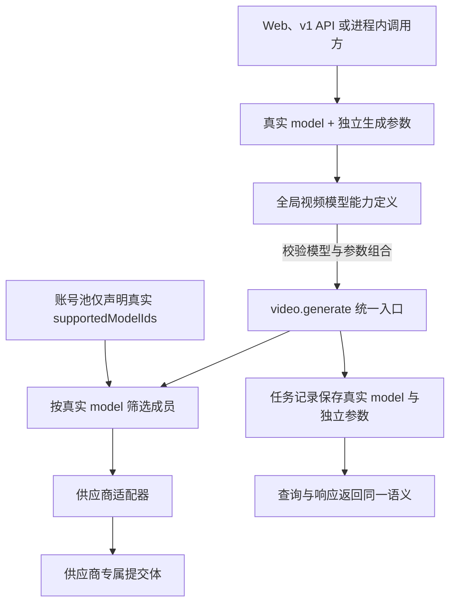
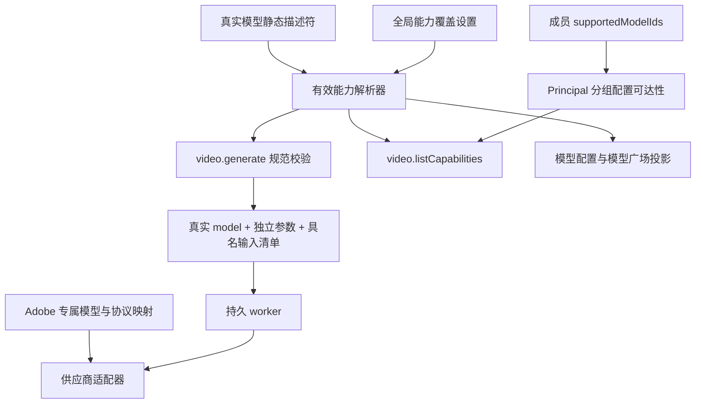
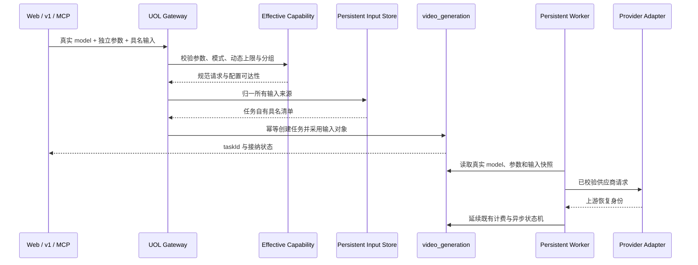
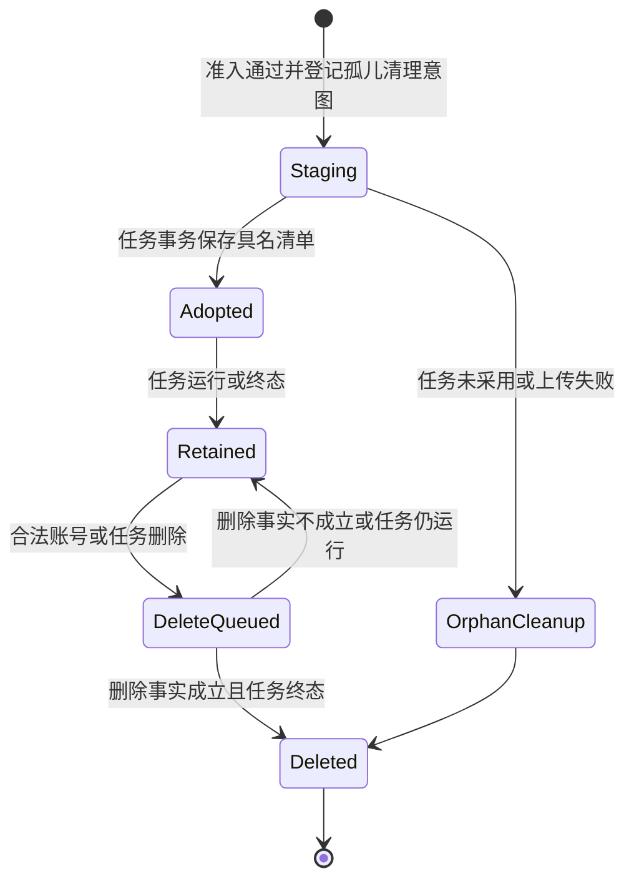

# 视频生成真实模型请求契约 - Plan

## Goal Capsule

- **Objective:** 将视频生成端到端改为“真实模型 ID + 独立生成参数”，彻底移除以 `firefly-<family>-<dur>s-<ratio>[-<res>]` 或裸复合 ID 表达请求能力的方式。
- **Product authority:** 本文固定视频请求、模型能力、账号池支持项、调度、记录、响应和存量迁移中的模型身份及参数边界；图像生成模型 ID 不属于本次范围。
- **Open blockers:** 无产品范围阻塞；规划阶段需把本文与现有统一媒体后端号池计划的复合视频能力键设计对齐。
- **Execution profile:** Deep；跨公开 API、UOL、MCP、模型配置、账号池、持久媒体、供应商协议、异步恢复和阻断式数据库迁移的一次性切换。
- **Stop conditions:** 任一存量任务或成员能力无法唯一映射、Seedance 新输入模式缺少可验证的供应商载荷、迁移会改变既有扣费或恢复身份、持久输入对象无法保证归属与删除闭环时停止，不增加兼容解析或默认值绕过。
- **Tail ownership:** U8 负责维护窗口、迁移、全仓门禁、浏览器验收和发布后 smoke；前序单元不得独立部署到旧 schema。

---

## Product Contract

### Summary

实施将把视频生成收敛到一个真实模型能力注册表和一个规范 UOL 请求，Web、v1、MCP、账号池、模型广场、任务恢复与供应商适配都消费同一模型身份和参数事实。
Seedance 的参考图上限由全局模型配置覆盖，具名输入持久托管，旧复合 ID 只允许被阻断式迁移读取。

### Problem Frame

当前视频目录把模型族、时长、宽高比和部分分辨率展开为数百个复合 ID，并允许入口继续接受 `firefly-` 前缀。
同一复合字符串随后承担请求校验、账号池能力、调度匹配、任务记录和响应身份，导致“模型是什么”与“本次怎样生成”无法独立变化。

现有上游提交体已经分别接收时长、比例、分辨率和输入图，但适配器仍先解析复合 ID 才能得到这些值。
账号池也必须枚举同一真实模型的所有参数组合，使能力配置数量膨胀，并可能在目录、调度和供应商协议之间产生漂移。

### Key Decisions

- **采用破坏性切换。** (session-settled: user-directed — chosen over 短期兼容旧复合 ID: 继续解析旧格式会保留双重请求契约和隐藏的模型语义。) Governs R1, R12。
- **真实模型 ID 贯穿所有视频链路。** (session-settled: user-directed — chosen over 只拆分入口后在内部重新拼回复合 ID: 请求、能力、记录和响应必须共享同一模型身份。) Governs R1, R6-R11。
- **核心生成参数全部显式必填。** (session-settled: user-directed — chosen over 按模型补唯一值或默认组合: 调用方必须明确本次生成意图。) Governs R2, R5。
- **输入图使用具名语义。** (session-settled: user-directed — chosen over 带角色的数组或 `inputImages` 加 `inputImageRole`: 首尾帧和参考图不应依赖数组顺序或额外模式字段解释。) Governs R3-R5。
- **模型能力定义是参数合法性的唯一来源。** 账号池只声明真实模型 ID，参数组合与输入能力不形成成员级配置；Governs R4, R6-R8, R13-R14, R16。
- **视频输入永久托管并直接向授权历史查看者展示。** (session-settled: user-directed — chosen over 任务终态后清理输入或管理员只看摘要: 输入必须与任务同生命周期，授权查看与回调披露采用不同边界。) Governs R10-R11, R15。
- **Seedance 参考图上限由管理员按真实模型配置。** (session-settled: user-directed — chosen over 固定上限或账号池成员覆盖: 平台需要在不展开模型 ID 的前提下调整 Seedance 输入能力。) Governs R14, R16。



### Actors

- A1. **视频调用方：** 通过站内创作界面、公开 v1 API 或进程内 operation 提交真实模型 ID 和本次生成参数。
- A2. **平台管理员：** 在账号池中只选择成员支持的真实视频模型，不维护时长、比例或分辨率组合。
- A3. **统一操作与调度网关：** 校验模型能力和输入语义，按真实模型 ID 筛选成员，并保持幂等、权限和财务边界。
- A4. **供应商适配器：** 把统一请求语义映射为各供应商的模型版本、尺寸、参考帧和参考图字段。

### Requirements

**模型身份与请求契约**

- R1. 所有视频生成入口必须只接受全局目录中存在的真实模型 ID，并拒绝 `firefly-` 前缀、时长/比例/分辨率复合 ID 及其历史别名。
- R2. 每次视频生成请求必须显式提供数值秒数 `duration`、规范宽高比 `aspectRatio` 和输出档位 `resolution`，即使目标模型对其中某项只有一个合法值也不得省略。
- R3. 视频输入图必须分别以可选的 `firstFrame`、`lastFrame` 和 `referenceImages` 表达，不得继续使用图片数组位置或 `inputImageRole` 推断首尾帧与参考图语义。
- R4. 模型能力定义必须校验模型支持的时长、比例、分辨率、音频、首尾帧、参考图数量和输入模式；当前模型未声明支持的组合必须在统一入口拒绝。
- R5. `lastFrame` 不得脱离 `firstFrame` 单独出现；所有视频模型的首尾帧模式与 `referenceImages` 模式一律互斥，其他模型专属参数继续按 R4 独立校验。

**能力来源与账号池**

- R6. 全局视频模型能力定义必须以真实模型 ID 为唯一键，并为每个模型声明合法参数值、音频能力、帧能力和参考图上限。
- R7. 账号池的 `supportedModelIds` 必须只允许选择真实模型 ID，不得保存或展示由生成参数展开出的组合 ID。
- R8. 账号池成员声明支持某个真实模型后，必须能够承接该模型全部全局合法参数组合，不得再配置成员级时长、比例、分辨率或输入图变体。
- R9. 调度器必须只按真实请求模型与成员 `supportedModelIds` 匹配候选，不得解析生成参数、模型前缀或供应商名称来改变成员资格。

**记录、响应与迁移**

- R10. 视频任务必须把真实模型 ID 与时长、比例、分辨率和具名输入图语义分别保存，计费、恢复、查询和供应商适配不得再从模型字符串反向推导这些值。
- R11. 面向调用方和管理员的视频任务响应、历史记录及模型目录必须返回真实模型 ID，并在需要描述本次生成时返回对应的独立参数。
- R12. 现有账号池视频能力和历史视频任务必须迁移到真实模型 ID；无法从已有独立字段证明参数组合或模型归属的数据必须阻断迁移并给出可定位原因，不得补默认值或保留兼容别名。

**能力发现、模型广场与持久输入**

- R13. 系统必须通过 Principal 感知的只读 UOL operation 提供视频能力查询，并向 Web、v1 和 User MCP 暴露；结果必须区分全局合法能力与当前分组已配置可达性，不得泄露成员、凭据、实时容量或供应商内部版本。
- R14. 模型广场的视频卡片必须展示输入与声音能力摘要，详情必须展示合法时长、比例、分辨率、首尾帧、参考图数量、输入模式互斥、声音默认值和当前可达性；展示与生成校验必须使用同一能力事实。
- R15. 首帧、尾帧和参考图必须在任务创建时归一为平台托管的持久对象，并与任务记录同生命周期；任务所有者和具备现有管理历史权限的管理员可通过短期签名 URL 查看，回调只返回输入模式和数量，合法删除任务或账号时必须清理对象。
- R16. `seedance2` 与 `seedance2-fast` 必须同时支持首尾帧模式和参考图模式；参考图上限默认 10，由管理员在全局模型配置页保存任意正安全整数且不设置业务数量硬上限，账号池成员不得覆盖该值，基础设施媒体数量、总字节、超时和并发保护继续独立生效。
- R17. Web、UOL 和 MCP 只接受 camelCase 字段；v1 同时接受 camelCase 与 snake_case，其中 `duration` 对应 `duration_seconds`，其他具名字段按同名规则映射；同一语义的两种别名同时出现时必须完全一致，旧 `image`、`inputImages`、`inputImageRole` 和 `input_image_role` 一律拒绝。

### Video Capability Matrix

下表固定 R4、R6 和 R16 的输入与声音能力；所有“首帧 + 可选尾帧”模式都受 R5 约束，不能与参考图同时出现。

| 真实模型 ID | 首尾帧模式 | 参考图模式 | 声音能力 | 默认声音 |
|---|---|---|---|---|
| `sora2`, `sora2-pro` | 仅首帧 | 不支持 | 不支持 | 关闭 |
| `veo31`, `veo31-fast` | 首帧 + 可选尾帧 | 不支持 | 不支持 | 关闭 |
| `veo31-ref` | 不支持 | 最多 3 张 | 不支持 | 关闭 |
| `kling-o3`, `kling3` | 首帧 + 可选尾帧 | 不支持 | 仅 `kling3` 支持 | `kling3` 开启，其他关闭 |
| `kling3-omni` | 首帧 + 可选尾帧 | 最多 3 张 | 支持 | 关闭 |
| `runway-gen45`, `ray314`, `ray314-hdr` | 不支持 | 不支持 | 不支持 | 关闭 |
| `seedance2`, `seedance2-fast` | 首帧 + 可选尾帧 | 默认最多 10 张，按模型动态配置 | 支持 | 关闭 |

### Key Flows

- F1. **提交视频生成请求**
  - **Trigger:** A1 选择真实模型并提交生成。
  - **Actors:** A1, A3, A4
  - **Steps:** A1 显式提供 R2 的核心参数和可选具名输入图；A3 按 R4 校验后按真实模型筛选成员；A4 把已校验语义映射为供应商请求。
  - **Outcome:** 任务、调度和上游调用共享一个真实模型身份，生成参数不再编码进模型 ID。
  - **Covered by:** R1-R6, R9-R11
- F2. **配置视频后端能力**
  - **Trigger:** A2 新增或编辑账号池成员支持的模型。
  - **Actors:** A2, A3
  - **Steps:** A2 从真实模型目录选择支持项；系统拒绝复合 ID 和成员级参数变体；A3 后续只用真实模型 ID 判断候选资格。
  - **Outcome:** 一个模型在每个成员上最多出现一次，不随参数组合数量膨胀。
  - **Covered by:** R6-R9
- F3. **迁移存量视频身份**
  - **Trigger:** 新契约部署前执行存量迁移。
  - **Actors:** A2, A3
  - **Steps:** 系统把账号池复合能力折叠并去重为真实模型 ID；用历史任务已有的独立参数验证并改写模型身份；发现无法证明的记录时停止切换。
  - **Outcome:** 切换后运行时、管理端和历史记录中不存在仍可调用的复合视频模型 ID。
  - **Covered by:** R7, R10-R12
- F4. **发现并选择视频能力**
  - **Trigger:** A1 或其 Agent 在提交前查询可用视频模型，或打开模型广场详情。
  - **Actors:** A1, A3
  - **Steps:** A3 从同一全局能力定义返回真实模型、合法参数、输入与声音能力，并将当前 Principal 可达分组中的账号池支持事实单独标记；A1 据此构造显式请求。
  - **Outcome:** 人类与 Agent 无需解析模型 ID 或猜测供应商能力即可提交可验证请求。
  - **Covered by:** R1-R6, R9, R13-R14, R16
- F5. **持久保存并查看视频输入**
  - **Trigger:** A1 提交具名输入图，或任务所有者与有权限管理员查看历史任务。
  - **Actors:** A1, A2, A3
  - **Steps:** A3 将所有来源归一为任务隔离的持久对象并保存具名引用；授权读取只签发短期 URL；任务或账号被合法删除时先登记清理意图再删除对象。
  - **Outcome:** 历史输入可查看和复用，同时不暴露存储身份或产生孤儿对象。
  - **Covered by:** R3-R5, R10-R11, R15-R16

### Acceptance Examples

- AE1. **Covers R1-R2, R4, R9-R11.** Given 成员支持 `seedance2`，when 调用方提交 `model=seedance2` 以及合法的时长、比例和分辨率，then 请求按 `seedance2` 获得候选，任务与响应保留真实 ID 和独立参数。
- AE2. **Covers R1, R12.** Given 调用方提交 `firefly-seedance2-15s-9x16-480p` 或 `seedance2-15s-9x16-480p`，when 请求进入任一视频生成入口，then 系统拒绝该请求且不解析为兼容调用。
- AE3. **Covers R2, R4.** Given `sora2` 当前只有一个合法分辨率，when 请求省略 `resolution`，then 系统仍拒绝请求；when 三个核心参数齐全但组合不受该模型支持，then 系统按模型能力返回参数错误。
- AE4. **Covers R3-R5.** Given 模型支持首尾帧，when 请求提供 `firstFrame` 和 `lastFrame`，then 供应商收到顺序明确的首尾帧；when 只提供 `lastFrame`，then 统一入口拒绝请求。
- AE5. **Covers R3-R6.** Given 模型支持至多三张参考图但不支持首尾帧与参考图混用，when 请求提供三张 `referenceImages`，then 请求通过输入能力校验；when 再增加一张或同时提供 `firstFrame`，then 请求在供应商调用前被拒绝。
- AE6. **Covers R7-R9.** Given 管理员编辑成员能力，when 选择 `seedance2`，then 成员只保存一个真实模型支持项并可承接其全部全局合法组合；when 尝试保存复合 ID，then 配置被拒绝。
- AE7. **Covers R10-R12.** Given 历史任务的复合模型 ID 与独立时长、比例、分辨率一致，when 执行迁移，then 任务模型改为真实 ID 且独立字段保持不变；when 两者冲突或无法映射，then 迁移停止并报告具体记录。
- AE8. **Covers R13-R14.** Given 当前 Principal 的可达分组只有成员声明 `seedance2`，when Web、v1 或 MCP 查询视频能力并打开模型广场，then 结果以真实 ID 返回全局参数和当前 Seedance 输入上限，并把其他全局模型标记为当前不可达而不泄露成员详情。
- AE9. **Covers R4-R6, R16.** Given Seedance 参考图上限未配置，when 请求提交 10 张参考图，then 请求按默认上限通过；when 管理员将上限改为 20，then 新能力查询、模型广场和新请求同步使用 20，账号池配置不增加参数变体。
- AE10. **Covers R3-R5, R15-R16.** Given Seedance 请求使用 `firstFrame` 和 `lastFrame`，when 同时增加任一 `referenceImages`，then 请求在持久化与供应商调用前被拒绝；when 只使用其中一种模式，then 任务保存相同具名语义并可在恢复后重建同一载荷。
- AE11. **Covers R11, R14-R15.** Given 带输入图的视频任务已终态，when 任务所有者或有权限管理员查看历史，then 页面通过短期签名 URL 展示持久输入；when callback 送达，then payload 只有输入模式和数量而没有 storage key、bucket、供应商素材 ID或图片 URL。
- AE12. **Covers R2-R3, R17.** Given v1 请求同时提供 `duration=10` 与 `duration_seconds=10`，when 其他参数和具名输入合法，then 适配器只向 UOL 传一个规范值；when 两者不同、使用旧输入字段或通过 Web/MCP 发送 snake_case，then 请求在统一操作执行前失败。

### Scope Boundaries

- 本次只改造视频生成的模型身份、生成参数、输入图语义、账号池能力和相关存量数据，不调整图像生成的复合模型 ID。
- 本次不保留旧复合视频 ID、`firefly-` 前缀或无分辨率历史别名的兼容窗口。
- 本次不增加账号池成员级参数子能力，也不允许成员以组合 ID 表达部分参数支持。
- 本次不新增视频模型族；除 R16 的 Seedance 首尾帧、动态参考图上限及其供应商载荷外，不扩展其他模型的参数集合或协议能力。
- 本次不新增批量视频、取消、暂停、流式进度、Agent 自动选模策略或一体化生成工作流。
- 视频计费继续按真实模型与输出分辨率确定每秒价格，本次不改变价格数值、扣费时点或退款语义。

<!-- ce-section: work-relationships -->
### How This Work Fits Together

本文只负责视频生成请求与模型身份规范，是统一媒体后端号池重构中的独立契约修正；下列关系是当前理解，不构成额外路线图。

- **Depends on:** `docs/plans/2026-07-25-001-refactor-media-backend-pool-plan.md` 提供统一账号池、UOL 和调度基础；本文取代其中把复合视频 ID 写入 `supportedModelIds` 并用于视频调度的要求。
- **Shares:** `docs/plan/2026-07-28-video-resolution-pricing.md` 已按真实模型族与分辨率表达视频价格，本文继续沿用该计费维度。
- **Can proceed independently of:** 图像请求模型 ID 的后续规范化；图像链路保持现状。

### Dependencies / Assumptions

- 现有视频任务已分别保存时长、比例和分辨率，因此存量模型身份可以在不猜测默认值的前提下校验迁移。
- 现有供应商客户端已以独立字段构造最终视频提交体，但当前适配器仍从复合 ID 取得这些值，规划必须消除该反向依赖。
- 现有模型广场已经按真实视频模型族聚合展示，新的全局能力定义可以继续作为其事实来源。
- 内容审核、对象存储、任务幂等、积分扣费与退款不变量保持不变。
- Seedance 新输入模式的产品范围已确认；实施必须以供应商请求样本、官方协议或可重复的契约夹具证明具体载荷，不能把现有 style reference 机械改名为 frame。

### Sources / Research

- `packages/shared/src/adobe/firefly-direct/video-catalog.ts`
- `packages/shared/src/adobe/firefly-direct/payloads.ts`
- `packages/shared/src/adobe/firefly-direct/client.ts`
- `packages/shared/src/uol/operations/video-generation.ts`
- `packages/shared/src/image-backend/supported-models.ts`
- `packages/shared/src/model-marketplace/contracts.ts`
- `packages/shared/src/system-settings/cache.ts`
- `packages/shared/src/system-settings/definitions.ts`
- `packages/shared/src/mcp/user-tool-factory.ts`
- `apps/web/src/features/image-generation/components/video-create-panel.tsx`
- `apps/web/src/features/image-generation/video-operations.ts`
- `apps/web/src/features/image-generation/adobe-direct.ts`
- `apps/web/src/features/external-api/handlers/video-generations.ts`
- `apps/web/src/server/uol-bindings.ts`
- `apps/web/src/features/image-generation/video-input-storage.ts`
- `apps/web/src/features/image-generation/video-input-cleanup-queue.ts`
- `apps/web/src/features/image-generation/video-task-identity.ts`
- `apps/web/src/features/settings/actions/delete-account.ts`
- `apps/web/src/features/image-backend-pool/member-model-options.ts`
- `apps/web/src/features/model-marketplace/model-detail-dialog.tsx`
- `apps/web/src/features/model-configuration/service-core.ts`
- `packages/database/src/schema.ts`
- `packages/database/drizzle/0060_unified_media_backend_pool.sql`
- `packages/database/drizzle/0073_remove_firefly_model_prefix.sql`
- `packages/database/scripts/release-governance-gate.mjs`
- `packages/integration-tests/src/media-backend-pool-migration.test.ts`
- `packages/integration-tests/src/release-governance-gate.test.ts`
- `docs/plans/2026-07-25-001-refactor-media-backend-pool-plan.md`
- `docs/plan/2026-07-28-video-resolution-pricing.md`

---

## Planning Contract

### Product Contract Preservation

Product Contract restructured, no scope change: R17、能力矩阵和 AE12 把会话中已确认但初稿未完整落盘的传输别名与模型能力显式化，R1-R16 的含义保持不变。

### Key Technical Decisions

- KTD1. **用真实模型描述符替代复合 ID 目录。** (session-settled: user-directed — chosen over 在入口拆参后由内部重新拼接复合 ID: 运行时任何层都不能继续依赖字符串编码能力。) 新的 DB-free 注册表以真实 ID 为键，只持有参数集合、输入模式、声音默认值和计费 family；Adobe 上游模型、版本、引擎、鉴权 Profile 与尺寸映射留在供应商适配层。Covers R1, R4, R6-R11, R13-R14。
- KTD2. **规范请求只构造一次。** (session-settled: user-directed — chosen over 各传输层自行解析参数或输入角色: Web、v1 与 MCP 必须得到同一接受集。) UOL 校验真实 `model`、三个必填参数和具名输入，解析声音默认值并生成规范请求；v1 只负责 R17 的别名合并，其他入口不做兼容转换。Covers R1-R5, R10-R11, R17。
- KTD3. **动态能力覆盖与展示配置分离持久化。** 新增受版本控制的 `VIDEO_MODEL_CAPABILITY_OVERRIDES` 全局设置，以真实模型 ID 保存可配置参考图上限；模型配置保存事务按固定锁顺序同时更新展示配置、视频价格和能力覆盖，并在提交后失效运行时缓存。缺项使用 10，脏值返回 `not_ready`，不静默回退；正安全整数的表示边界不是业务上限。Covers R4, R6, R14, R16。
- KTD4. **任务拥有具名持久输入清单。** (session-settled: user-directed — chosen over 用临时数组在终态清理: 历史查看、恢复和删除闭环需要稳定语义。) data、storage 与 remote 来源都复制到当前用户和任务隔离的对象 key；任务事务采用对象后移除孤儿清理意图，终态不删除。账号删除先登记带原因的持久清理意图，worker 仅在删除事实成立且任务终态后删除对象；没有新增用户删除任务功能。Covers R3-R5, R10-R11, R15-R16。
- KTD5. **能力查询返回全局事实与配置可达性。** 新增 `video.listCapabilities` 只读 operation，使用与生成相同的 Principal 能力要求和可信分组选择规则；每个全局真实模型返回静态能力、动态覆盖与 `configuredReachable`，但不返回成员、凭据、健康状态、冷却、并发或实时容量。Web、v1 与 User MCP 复用该 operation。Covers R6-R9, R13-R14, R16。
- KTD6. **数据库不保存重复 family。** `video_generation.model` 改为真实模型 ID，现有时长、比例和分辨率列继续作为请求事实；删除与 `model` 重复且可漂移的 `family`，以具名 `input_manifest` 取代 `input_image_refs` 和 metadata 中的角色。声音有效值、能力覆盖修订和创建时参考图上限作为任务快照保存，worker 不因后续管理员降限而使已接纳任务失败。Covers R2-R6, R10-R12, R15-R16。
- KTD7. **供应商只消费已校验参数，不反解模型。** Adobe direct 适配器按真实 ID 查供应商映射，再使用任务列和具名输入构造载荷；每种输入模式都有契约夹具。Seedance 首尾帧和多参考图必须由脱敏请求样本、官方协议或可重复夹具证明具体字段、角色和顺序，否则停止发布，不把现有单图 `style` 载荷改名冒充。Covers R3-R6, R9-R10, R16。
- KTD8. **幂等指纹只覆盖调用者的规范意图。** 新请求指纹包含真实模型、显式参数、解析后的声音布尔值和有序具名引用，不包含当前能力覆盖修订；相同 `clientRequestId` 在管理员改限后仍命中原任务。历史指纹不重算，旧任务键以新请求体重放时按现有规则返回 `idempotency_conflict`。Covers R2-R5, R10, R16-R17。
- KTD9. **迁移采用停机、资产收编、审计、事务切换四段门禁。** 新版本部署前停止旧 Web 与 worker，先用幂等维护程序把历史非任务自有输入复制为任务对象，再由只读门禁证明每个成员能力和任务都可唯一映射；手写 `0074_*` 在单事务内切换身份与 schema，任一异常使整次迁移回滚。Covers R7, R10-R12, R15。
- KTD10. **输入查看不扩大通用存储权限。** 任务所有者沿用严格 Principal 归属，管理员沿用现有全局历史角色；服务只为任务清单中的白名单对象签发短期读取 URL。历史详情可以加载实际输入图，列表和 callback 只携带具名模式与数量，任何接口都不返回 bucket、key、供应商素材 ID 或长期 URL。Covers R11, R15。

### High-Level Technical Design

#### Capability and Adapter Topology



静态描述符与动态覆盖共同决定新请求的有效能力；供应商映射不进入公开能力或调度资格。

#### Generation Sequence



#### Persistent Input Lifecycle



任务进入 `completed` 或 `failed` 不再触发输入删除；清理队列必须区分孤儿回收与生命周期删除原因。

### Output Structure

新的中立视频能力模块预期采用以下目录；Adobe 协议文件继续留在既有适配器目录。

```text
packages/shared/src/video-generation/
|-- capability-catalog.ts
|-- capability-catalog.test.ts
|-- capability-overrides.ts
|-- capability-overrides.test.ts
|-- contracts.ts
|-- contracts.test.ts
`-- index.ts
```

### System-Wide Impact

| 影响面 | 计划内变化 | 保持不变的不变量 |
|---|---|---|
| Web、v1、MCP | 统一改为真实 ID、显式参数、具名输入和能力查询 | Principal、套餐能力与错误网关继续由 UOL 单点执行 |
| 账号池与调度 | 成员只声明真实模型，配置可达性与候选匹配只看精确 ID | 策略、租约、冷却、并发和失败切换不因模型参数改变 |
| 数据与恢复 | 任务保存真实 ID、独立参数、声音与输入快照 | stage、CAS、`submit_uncertain` 和原成员恢复身份不变 |
| 财务 | 计费从任务真实模型对应的 billing family 和任务分辨率取价 | 价格数值、扣费时点、sourceRef、退款和双重记账不变 |
| 存储与隐私 | 输入永久托管、授权签名读取、删除队列闭环 | 总媒体 200 MB、数量 256、SSRF、MIME 与归属校验继续生效 |
| 管理与展示 | 模型配置可调 Seedance 上限，模型广场展示能力与可达性 | 账号池成员不能覆盖全局能力，展示配置不成为生成事实源 |

### Dependencies and Assumptions

- `docs/plans/2026-07-25-001-refactor-media-backend-pool-plan.md` 的统一成员、分组选择、租约和 UOL 基础已经存在；本文只替换其视频复合能力键。
- `VIDEO_MODEL_CAPABILITY_OVERRIDES` 使用 system_setting 与最新运行时缓存模式，不新增环境变量；管理员保存成功后必须在本进程和后续读取中看到同一修订。
- 动态 Seedance 上限可以高于 256，但模型能力值与当前共享媒体基础设施限制必须分别展示；请求仍受 `MAX_MEDIA_INPUT_COUNT=256` 和 200 MB 总量保护。
- Seedance 供应商载荷证据是发布阻塞项，不是允许实现阶段猜测字段的开放产品问题。
- 历史输入资产收编程序必须在旧应用停止后运行；它只复制并校验对象，在数据库切换成功前不删除源对象。

### Alternative Approaches Considered

| 方案 | 未采用原因 |
|---|---|
| 入口拆参、内部继续拼复合 ID | 保留双重身份并让 worker、调度和任务记录继续解析字符串 |
| 复合 ID 与真实 ID 并行兼容一个版本 | 无法证明所有入口、MCP 缓存和旧 worker 使用同一契约，也削弱阻断式迁移 |
| 把 Seedance 上限写入 `MODEL_MARKETPLACE_CONFIG` | 使运行时生成能力依赖营销展示配置，并扩大脏配置的故障半径 |
| 让账号池成员保存参数子能力 | 重新制造组合爆炸，违背成员支持真实模型全部合法组合的产品决策 |
| 任务终态后删除输入，只保留摘要 | 不能满足所有者和管理员历史查看，也无法保证恢复和复用语义 |
| 在查询或 worker 中继续解析历史复合 ID | 把迁移失败隐藏到运行时，可能改变扣费、上游身份和退款路径 |

### Risk Analysis and Mitigation

| 风险 | 影响 | 缓解与停止条件 |
|---|---|---|
| Seedance 多图协议与现有单图 style 语义不同 | 上游静默接受错误载荷或生成错误内容 | U5 必须取得脱敏样本、官方协议或可重复夹具；缺证据停止发布 |
| 动态上限大于共享媒体限制 | 管理员配置与实际可提交数量不一致 | 能力 DTO 同时表达模型上限和基础设施限制，入口按两层错误分别拒绝 |
| 迁移映射或历史字段冲突 | 旧任务不可恢复、错误计费或成员错误可达 | 预检报告非敏感计数和记录 ID，任何一条不唯一即整体阻断 |
| 永久输入扩大隐私与存储成本 | 数据泄漏、孤儿对象和不可控费用 | 任务隔离 key、白名单签名、任务摘要、持久清理原因和账号删除集成测试 |
| 配置缓存跨实例短暂漂移 | 能力查询与生成接受集不一致 | 保存后使用现有失效机制，运行时读取严格修订；跨实例未刷新时 fail closed 而非默认 |
| worker 重新校验最新能力 | 管理员降限导致已扣费任务失败 | 任务保存创建时有效值和能力修订，worker 只验证不可变供应商协议边界 |
| 大量参考图放大 I/O 和超时 | 准入占用、内存或上游上传时间过高 | 保留双层准入、总字节、统一 deadline 和逐对象清理意图，补 10、20、256 边界测试 |

---

## Implementation Units

### U1. Establish the Real Video Capability Registry

- **Goal:** 建立真实模型 ID、静态能力和 Seedance 动态覆盖的共享事实源。
- **Requirements:** R1, R4, R6, R14, R16；F4；AE3, AE5, AE8-AE9。
- **Dependencies:** 无。
- **Files:**
  - `packages/shared/src/video-generation/capability-catalog.ts`
  - `packages/shared/src/video-generation/capability-catalog.test.ts`
  - `packages/shared/src/video-generation/capability-overrides.ts`
  - `packages/shared/src/video-generation/capability-overrides.test.ts`
  - `packages/shared/src/video-generation/contracts.ts`
  - `packages/shared/src/video-generation/contracts.test.ts`
  - `packages/shared/src/video-generation/index.ts`
  - `packages/shared/package.json`
  - `packages/shared/src/adobe/video-pricing.ts`
  - `packages/shared/src/adobe/video-pricing.test.ts`
  - `packages/shared/src/system-settings/definitions.ts`
  - `packages/shared/src/system-settings/defaults.test.ts`
  - `packages/shared/src/system-settings/cache.test.ts`
- **Approach:**
  1. 以 KTD1 建立 13 个真实模型描述符，参数使用规范 `aspectRatio` 与小写分辨率字面量，输入和声音能力遵循 Product Contract 矩阵。
  2. 将 billing family 和分辨率价格支持改为消费真实描述符，不复制模型清单或改变价格。
  3. 按 KTD3 定义能力覆盖 schema、默认工厂和有效能力解析器；只有描述符声明可配置的模型接受覆盖。
  4. 在系统设置定义中登记专用管理键和默认值，标记只能由模型配置 operation 修改。
  5. 删除运行时所需的复合目录生成、前缀规范化和历史别名导出；旧映射只保留在 U7 的冻结迁移资料中。
- **Execution note:** 先以失败测试锁定真实 ID 列表、能力矩阵和非法复合 ID，再替换目录实现。
- **Patterns to follow:** `packages/shared/src/image-generation/model-contract.ts` 的 DB-free 严格模型契约；`packages/shared/src/system-settings/cache.ts` 的最新运行时缓存和失效模式。
- **Test scenarios:**
  1. 真实 ID `seedance2` 能解析全部合法参数，`seedance2-15s-9x16-480p`、`firefly-*` 和 Kling 历史别名都不能作为模型 ID 解析。
  2. 每个描述符的时长、比例、分辨率、声音默认和输入模式与 Product Contract 矩阵一致，未知组合返回结构化能力错误。
  3. Seedance 缺少覆盖时解析为 10；分别保存 1、20 和大于 256 的正安全整数时模型上限原样保留。
  4. 0、负数、小数、超出安全整数、未知模型覆盖和为不可配置模型设置上限均失败。
  5. 设置缺行使用默认工厂，设置存在但结构损坏时读取失败而不回退为 10。
  6. 视频价格解析继续为每个真实模型和分辨率返回改造前相同的每秒积分。
- **Verification:** 共享模块不依赖数据库或 Web；目录测试不再断言 573 个复合键，系统设置缓存测试证明更新后读取新修订。

### U2. Define Canonical UOL, Discovery, MCP, and Idempotency Contracts

- **Goal:** 让生成、状态、输入查看和能力发现都先成为严格 UOL operation，并建立唯一规范请求与指纹。
- **Requirements:** R1-R6, R10-R11, R13, R15-R17；F1, F4-F5；AE1-AE5, AE8-AE12。
- **Dependencies:** U1。
- **Files:**
  - `packages/shared/src/uol/operations/video-generation.ts`
  - `packages/shared/src/uol/operations/video-generation.test.ts`
  - `packages/shared/src/uol/operations/index.ts`
  - `packages/shared/src/mcp/user-tool-factory.ts`
  - `packages/shared/src/mcp/user-tool-arguments.ts`
  - `packages/shared/src/mcp/tool-factory.test.ts`
  - `apps/web/src/server/uol-bindings.ts`
  - `apps/web/src/server/uol-bindings/video-generation.ts`
  - `apps/web/src/server/uol-bindings/video-generation.test.ts`
  - `apps/web/src/features/image-generation/video-task-identity.ts`
  - `apps/web/src/features/image-generation/video-task-identity.test.ts`
- **Approach:**
  1. 按 KTD2 将 `video.generate` 改为真实 `model`、三个必填参数、可选 `firstFrame`、`lastFrame`、`referenceImages` 和声音字段；静态 schema 负责形状，全局有效能力在 operation 执行边界负责动态数量。
  2. 增加 `video.listCapabilities`，并增加 human-only 的任务输入读取与账号删除清理意图 operation 契约；所有资源访问声明权限、只读或破坏性、审计和幂等语义。
  3. 将视频 binding 从大文件提取为单一职责模块，通过注入端口取得有效能力、配置可达性、存储与任务仓储。
  4. 按 KTD8 构造规范请求指纹；referenceImages 顺序是请求语义的一部分，first/last 使用固定命名顺序。
  5. 将能力查询加入 User MCP，更新工具描述和 JSON Schema；动态上限通过查询结果表达，不伪装成静态 MCP 数组长度。
- **Execution note:** 从 `video.generate`、`video.listCapabilities` 和 MCP schema 的失败契约开始，再接 Web binding。
- **Patterns to follow:** 现有 `defineOperation()` 注册、`invokeOperation` 单点能力校验、`createVideoTaskId` Principal 作用域和 `modelMarketplace.listPublicModels` 的只读输出校验。
- **Test scenarios:**
  1. Covers AE1-AE3. 真实 ID 与三个合法参数通过；缺少任一参数、复合 ID、前缀 ID、非法组合或未知 ID 在副作用前失败。
  2. Covers AE4-AE5. firstFrame 单独可用，lastFrame 单独失败，首尾帧与任意参考图共存失败，模型不支持的模式和超量参考图失败。
  3. Covers AE9-AE10. Seedance 默认 10 张通过、11 张失败；覆盖为 20 后 20 张通过，帧与参考图仍互斥。
  4. 能力查询对同一全局目录返回稳定顺序；不同 Principal 或分组只改变 `configuredReachable`，输出不含成员 ID、状态、并发、Cookie、Token 或容量。
  5. API Key 不能覆盖绑定分组，站内用户只有具备现有分组选择能力时才可查询显式分组。
  6. MCP 暴露生成、状态和能力查询，但不暴露 human-only 输入资产与清理 operation；工具 schema 只含 camelCase 和真实 ID 说明。
  7. 省略声音与显式传模型默认值产生同一新指纹；更改参数、具名位置或参考图顺序产生冲突指纹。
  8. 旧任务 metadata 中的历史指纹不重算，新请求体复用旧 `clientRequestId` 返回幂等冲突且不再次扣费或上传。
- **Verification:** UOL registry、MCP allowlist、operation 输出和 binding 测试共同证明所有 Agent 与人类入口共享同一规范契约。

### U3. Persist Named Inputs and Close the Deletion Lifecycle

- **Goal:** 将所有输入来源归一为任务自有持久对象，并为所有者、管理员、恢复和账号删除提供安全生命周期。
- **Requirements:** R3-R5, R10-R11, R15-R16；F1, F5；AE4-AE5, AE10-AE11。
- **Dependencies:** U1, U2。
- **Files:**
  - `packages/database/src/schema.ts`
  - `packages/shared/src/image-generation/media-contract.ts`
  - `apps/web/src/features/image-generation/video-input-storage.ts`
  - `apps/web/src/features/image-generation/video-input-storage.test.ts`
  - `apps/web/src/features/image-generation/video-input-cleanup-queue.ts`
  - `apps/web/src/features/image-generation/video-input-cleanup-queue.test.ts`
  - `apps/web/src/features/image-generation/video-task-preparation.ts`
  - `apps/web/src/features/image-generation/video-task-preparation.test.ts`
  - `apps/web/src/features/image-generation/video-input-assets.ts`
  - `apps/web/src/features/image-generation/video-input-assets.test.ts`
  - `apps/web/src/features/image-generation/video-operations.ts`
  - `apps/web/src/features/image-generation/video-operations.test.ts`
  - `apps/web/src/features/settings/actions/delete-account.ts`
  - `apps/web/src/features/settings/actions/delete-account.test.ts`
- **Approach:**
  1. 按 KTD4 定义具名任务输入清单，元素只允许平台当前存储 bucket 中、当前用户和任务前缀下的可信对象。
  2. 对 data 解码、storage 读取和 remote 安全抓取执行实际字节复验，再复制到任务对象；保持统一绝对上传 deadline 和双层准入。
  3. 清理队列扩展到共享媒体数量边界并保存 `orphan` 或 `lifecycle_delete` 原因；任务事务采用对象后完成孤儿条目，生命周期条目只有在删除事实与终态门禁成立时可认领。
  4. 删除终态自动清理调用；恢复 worker 始终从具名清单重建输入，不从数组位置或 metadata 角色推断。
  5. 按 KTD10 为 owner 与既有管理员历史角色签发短期 URL；签名服务只消费任务清单，不接受客户端 bucket/key。
  6. 账号删除在用户失效事务前通过 UOL 登记幂等清理意图；若删除未完成，worker 不满足删除事实并保留或撤销意图，若任务仍运行则等待终态。
- **Execution note:** 先为当前“终态即清理”行为写失败回归测试，再修改队列采用和终态逻辑。
- **Patterns to follow:** `video-task-preparation.ts` 的预检后转存、`video-input-cleanup-queue.ts` 的持久 claim/退避、`storage/signed-url.ts` 的短期签名和现有管理历史权限。
- **Test scenarios:**
  1. data、用户 storage 与 remote 输入最终都变为不同任务隔离前缀下的 storage 引用，实际 MIME、字节和归属再次校验。
  2. 上传中断、任务插入竞争失败和进程退出留下的 orphan 条目可重试清理；已被任务采用的对象不会被孤儿 worker 删除。
  3. 任务进入 completed 或 failed 后输入对象和清单仍存在，恢复相同任务不会重复复制或改变具名顺序。
  4. owner 能获取短期输入 URL；其他用户、其他 API Key 和普通用户读取管理员任务均得到 not_found 或 forbidden。
  5. observer_admin、admin、super_admin 沿用现有管理历史权限并能在详情加载实际输入图，返回值不含 bucket、key 或供应商素材 ID。
  6. 账号删除意图在账号仍有效时不删除；账号删除完成且任务终态后最终删除；活动任务先等待，终态后继续同一幂等条目。
  7. 10、20 和 256 张小图不会突破总 200 MB；257 张或总字节超限在对象写入前失败。
  8. callback 输入投影只返回模式和数量，站内历史详情返回短期 URL，两者不会共享含敏感引用的 DTO。
- **Verification:** 对象采用、保留、授权读取和账号删除四条生命周期都有 DB-free 测试；数据库 schema 只保存具名清单与可信清理身份。

### U4. Convert the Pool, Scheduler, Reachability, and Catalog to Real IDs

- **Goal:** 让账号池配置、调度资格、外部模型目录和能力可达性只消费真实模型 ID。
- **Requirements:** R1, R6-R9, R13-R14, R16；F2, F4；AE1, AE6, AE8-AE9。
- **Dependencies:** U1, U2。
- **Files:**
  - `packages/shared/src/image-backend/supported-models.ts`
  - `packages/shared/src/image-backend/supported-models.test.ts`
  - `packages/shared/src/image-backend/member-contract.ts`
  - `packages/shared/src/image-backend/member-contract.test.ts`
  - `packages/shared/src/adobe/enabled-models.ts`
  - `packages/shared/src/adobe/enabled-models.test.ts`
  - `apps/web/src/features/image-backend-pool/member-model-options.ts`
  - `apps/web/src/features/image-backend-pool/member-model-options.test.ts`
  - `apps/web/src/features/image-backend-pool/member-form.tsx`
  - `apps/web/src/features/image-backend-pool/catalog-service.ts`
  - `apps/web/src/features/image-backend-pool/runtime-service.ts`
  - `apps/web/src/features/image-backend-pool/runtime-service.test.ts`
  - `apps/web/src/features/image-generation/adobe-direct.ts`
  - `apps/web/src/features/external-api/platform-model-catalog.ts`
  - `apps/web/src/features/external-api/platform-model-catalog.test.ts`
  - `apps/web/src/features/external-api/platform-model-catalog-service.ts`
  - `apps/web/src/features/external-api/models.ts`
- **Approach:**
  1. 成员模型选项对每个视频描述符只生成一个真实 ID 标签，不展示时长、比例或分辨率变体。
  2. 保存边界拒绝已知复合视频形式、`firefly-` 前缀和目录外视频 ID；通用模型规范化不再移除前缀后假装合法。
  3. Adobe direct 视频成员必须显式列出至少一个真实视频 ID；空能力、旧组合与 existing-member 兼容选项不能进入新保存。
  4. 调度和 `canAdobeBackendServeModel` 只做大小写规范后的精确真实 ID 匹配，不读取本次参数或供应商家族。
  5. 能力可达性复用可信分组选择和成员配置投影，但忽略健康、冷却、租约与容量；现有 `/v1/models` 也只输出真实 ID。
- **Execution note:** 先固定成员保存与候选匹配的拒绝测试，再替换管理选项，避免 UI 掩盖服务端兼容入口。
- **Patterns to follow:** 统一号池计划的显式 `supportedModelIds` 权威、`runtime-group-selection.ts` 的 Principal 分组边界和 DB-free 平台目录构建器。
- **Test scenarios:**
  1. Covers AE6. 选择 `seedance2` 只保存一个 ID，模型全部合法时长、比例、分辨率和两种互斥输入模式均由同一成员承接。
  2. 新增或编辑成员提交复合 ID、前缀 ID、Kling 历史别名、空列表或未知视频 ID均失败，失败不会被 existing-member 选项放行。
  3. 图像真实模型行为保持不变，移除视频兼容解析不会改变图像请求或价格契约。
  4. 同组两个成员只有声明 `seedance2` 的成员进入该请求候选；参数差异不改变成员资格。
  5. 当前分组配置 `seedance2` 时能力查询把它标记可达，其他全局模型保留能力但标记不可达。
  6. 成员处于冷却或有满并发时配置可达性不变化，真实调度仍按现有状态排除该成员。
  7. `/v1/models`、模型配置快照和运行时目录都不再返回任何复合视频 ID。
- **Verification:** 管理端可选项、保存 schema、运行时筛选和目录投影都由同一真实 ID 判定函数驱动，没有参数解析或空列表通配分支。

### U5. Adapt Provider Payloads, Worker Recovery, and Billing Without Re-parsing

- **Goal:** 让供应商提交、计费和全部恢复阶段直接消费任务独立字段与具名输入，同时保持财务和状态机不变量。
- **Requirements:** R2-R6, R9-R12, R16；F1, F3；AE1, AE4-AE5, AE7, AE9-AE10。
- **Dependencies:** U1, U3, U4。
- **Files:**
  - `packages/shared/src/adobe/firefly-direct/video-catalog.ts`
  - `packages/shared/src/adobe/firefly-direct/video-catalog.test.ts`
  - `packages/shared/src/adobe/firefly-direct/payloads.ts`
  - `packages/shared/src/adobe/firefly-direct/video-payload.test.ts`
  - `packages/shared/src/adobe/firefly-direct/client.ts`
  - `packages/shared/src/adobe/firefly-direct/client.test.ts`
  - `packages/shared/src/adobe/firefly-direct/fixtures/seedance2-frame-request.json`
  - `packages/shared/src/adobe/firefly-direct/fixtures/seedance2-reference-request.json`
  - `apps/web/src/features/image-generation/adobe-direct.ts`
  - `apps/web/src/features/image-generation/adobe-video-source.ts`
  - `apps/web/src/features/image-generation/adobe-video-source.test.ts`
  - `apps/web/src/features/image-generation/video-operations.ts`
  - `apps/web/src/features/image-generation/video-operations.test.ts`
  - `apps/web/src/features/image-generation/video-recovery-repository.ts`
  - `apps/web/src/features/image-generation/video-recovery-repository.test.ts`
  - `packages/integration-tests/src/video-generation-recovery.test.ts`
- **Approach:**
  1. 将旧视频 catalog 收缩为 Adobe 专属真实 ID 映射，移除组合注册、解析、前缀和 alias API。
  2. 按 KTD7 让 client 和 payload builder 接收任务参数、有效声音和具名供应商素材 ID；每种模型只处理自己声明的输入模式。
  3. 对 Seedance 先固化脱敏、无凭据和无真实素材 ID 的协议夹具，再实现首尾帧与动态数量参考图；夹具证据与当前单图 style 不一致时以证据为准并停止猜测。
  4. 任务创建从规范请求直接写列和快照；worker、失败重选、轮询与人工核对从行字段恢复，不再次咨询最新动态上限或解析 `row.model`。
  5. 计费继续用描述符的 billing family 加任务 `resolution` 查现有价格，用任务 `durationSeconds` 计算总额；扣费、退款和 API Key 配额代码不改语义。
- **Execution note:** 对每个供应商模式使用契约测试先锁定载荷，再切 worker；Seedance 证据门未通过时停止本单元和发布。
- **Patterns to follow:** 现有 Adobe client 的提交不确定边界、`video-operations.ts` 的 CAS stage 转移和 `video-credit-consumption.ts` 的幂等财务端口。
- **Test scenarios:**
  1. Sora 只映射 firstFrame；普通/fast Veo、Kling O3 与 Kling3 按顺序映射 firstFrame 和可选 lastFrame。
  2. `veo31-ref` 映射 1 至 3 张 referenceImages；`kling3-omni` 分别映射帧模式与最多 3 张参考图，且不会混合字段。
  3. Runway 与 Ray 的输入图在调用 client 前失败；不支持声音的模型不会收到启用声音载荷。
  4. Seedance 两个模型的首尾帧和 10、20 张参考图分别匹配已验证夹具，顺序、角色、模块和上游版本可重复断言。
  5. worker 读取 `model=seedance2`、独立参数和输入清单即可提交，任何代码路径都不生成或解析 `seedance2-<duration>...`。
  6. 任务创建后管理员把上限从 20 降为 10，已接纳 20 图任务仍按创建快照恢复，新任务按 10 拒绝。
  7. 每个分辨率和时长的积分、扣费 sourceRef、API Key 预留和失败退款与改造前相同。
  8. created、charged、submitting、submit_uncertain、polling、downloading、refunding 的恢复测试均保留原成员、poll URL、Profile 和不重复提交保证。
- **Verification:** 供应商夹具、worker 单测和真实 PostgreSQL 恢复测试共同证明没有复合 ID 解析，同时财务与异步终态未变化。

### U6. Cut Over Web, v1, Model Configuration, Marketplace, and History

- **Goal:** 将所有用户与管理员界面切到新契约，并展示模型能力、动态上限、实际输入和配置可达性。
- **Requirements:** R1-R5, R7, R11, R13-R17；F1-F2, F4-F5；AE1-AE6, AE8-AE12。
- **Dependencies:** U1-U5。
- **Files:**
  - `apps/web/src/features/image-generation/components/video-create-panel.tsx`
  - `apps/web/src/features/image-generation/components/video-create-preselection.test.ts`
  - `apps/web/src/app/api/videos/generate/route.ts`
  - `apps/web/src/app/api/videos/generate/route.test.ts`
  - `apps/web/src/features/external-api/handlers/video-generations.ts`
  - `apps/web/src/features/external-api/handlers/video-generations.test.ts`
  - `apps/web/src/features/external-api/handlers/video-tasks.ts`
  - `apps/web/src/features/external-api/handlers/video-tasks.test.ts`
  - `apps/web/src/features/external-api/handlers/video-capabilities.ts`
  - `apps/web/src/features/external-api/handlers/video-capabilities.test.ts`
  - `apps/web/src/app/api/v1/videos/capabilities/route.ts`
  - `apps/web/src/app/v1/videos/capabilities/route.ts`
  - `packages/shared/src/model-marketplace/contracts.ts`
  - `packages/shared/src/model-marketplace/contracts.test.ts`
  - `apps/web/src/features/model-configuration/catalog.ts`
  - `apps/web/src/features/model-configuration/catalog.test.ts`
  - `apps/web/src/features/model-configuration/model-configuration-dialog.tsx`
  - `apps/web/src/features/model-configuration/model-configuration-draft.ts`
  - `apps/web/src/features/model-configuration/model-configuration-draft.test.ts`
  - `apps/web/src/features/model-configuration/repository.ts`
  - `apps/web/src/features/model-configuration/repository.test.ts`
  - `apps/web/src/features/model-configuration/service-core.ts`
  - `apps/web/src/features/model-configuration/service-core.test.ts`
  - `apps/web/src/features/model-marketplace/catalog.ts`
  - `apps/web/src/features/model-marketplace/catalog.test.ts`
  - `apps/web/src/features/model-marketplace/model-card.tsx`
  - `apps/web/src/features/model-marketplace/model-detail-dialog.tsx`
  - `packages/shared/src/image-generation/history-contract.ts`
  - `apps/web/src/features/image-generation/history-service.ts`
  - `apps/web/src/features/image-generation/admin-history-service.ts`
  - `apps/web/src/features/image-generation/components/history-video-dialog.tsx`
  - `apps/web/messages/en.json`
  - `apps/web/messages/zh.json`
- **Approach:**
  1. 视频创作面板直接维护并提交真实 ID、时长、比例、分辨率、声音和具名输入，不再提供 compose/parse helper；输入控件按能力查询切换且全局执行帧/参考图互斥。
  2. 站内路由只接受 camelCase；v1 按 R17 合并 camelCase/snake_case 并为 `firstFrame`、`lastFrame`、`referenceImages` 转换媒体引用，旧字段无法通过 strict schema。
  3. 新增 v1 能力 GET 薄路由，生成与查询响应统一返回真实模型和独立参数；callback 使用单独的输入摘要投影。
  4. 模型配置为 Seedance 视频条目显示正整数参考图上限，按 KTD3 与价格、展示 revision 同事务保存并审计。
  5. 模型广场 DTO 直接投影有效能力；卡片显示参考图、首尾帧和声音摘要，详情显示参数、数量、互斥、声音默认、当前配置可达性与独立基础设施限制。
  6. 用户和管理员历史列表显示真实模型、独立参数及输入模式/数量；打开视频详情时直接加载实际输入图的短期 URL，不让管理员停留在摘要视图。
- **Execution note:** 传输层契约测试先行；随后更新 UI 和 i18n，最后执行浏览器验收以覆盖互斥输入和管理员历史图片。
- **Patterns to follow:** v1 双路由复用同一 handler、模型配置的 revision/幂等/同事务审计、模型广场 DB-free DTO 构建器和历史列表/详情分层。
- **Test scenarios:**
  1. Covers AE1-AE3. Web 提交真实 ID 与独立参数，缺字段或手工复合 ID得到稳定错误；URL 预选仍能选择相同真实模型和参数。
  2. Covers AE12. v1 单独使用 camelCase 或 snake_case 都成功；相同双别名成功，冲突双别名、旧 `image`/`inputImages`/角色字段失败。
  3. v1 能力、生成接纳、状态和 callback 分别返回规定 DTO；状态含真实模型与独立参数，callback 不含输入 URL 或存储身份。
  4. 管理员将两个 Seedance 模型分别从 10 改为 20 时，revision、价格、展示和能力覆盖原子更新；并发旧 revision、重复键不同请求和任一设置写失败全部回滚。
  5. 模型卡片可快速识别“参考图 20、首尾帧、声音”，详情列出完整能力和互斥规则；无输入模型明确显示不支持。
  6. 当前 Principal 只有 Seedance 配置路径时，市场详情和能力查询都标记 Seedance 可达、其他模型不可达，页面不显示成员或容量。
  7. 用户历史详情显示自己的输入，管理员历史详情直接显示任意授权任务输入；未授权用户不能通过复用签名 URL 请求其他对象。
  8. 中英文文案 key 同步，声音、参考图数量、首尾帧、互斥和可达性在窄屏与桌面均可读。
- **Verification:** Web、v1、MCP、管理配置、模型广场和历史的契约测试使用同一共享能力 DTO；浏览器可完成 Seedance 两种模式并查看授权输入。

### U7. Execute the Blocking Data and Asset Migration

- **Goal:** 在停机窗口内把所有成员、任务和历史输入安全转换为新 schema，并让任何不可证明的数据阻断切换。
- **Requirements:** R7, R10-R12, R15；F3, F5；AE2, AE6-AE7, AE11。
- **Dependencies:** U1, U3-U6。
- **Files:**
  - `apps/web/scripts/migrate-video-input-assets.mjs`
  - `apps/web/src/features/image-generation/video-input-migration.ts`
  - `apps/web/src/features/image-generation/video-input-migration.test.ts`
  - `packages/database/drizzle/0074_real_video_request_contract.sql`
  - `packages/database/drizzle/meta/_journal.json`
  - `packages/integration-tests/src/media-backend-pool-migration.test.ts`
  - `packages/database/scripts/release-governance-gate.mjs`
  - `packages/integration-tests/src/release-governance-gate.test.ts`
  - `.github/workflows/deploy-production.yml`
  - `deploy/README.md`
- **Approach:**
  1. 固定 0073 后所有合法复合 ID、真实 ID、参数和已知历史 alias 的迁移映射；迁移资料不从新运行时目录生成，避免未来目录变化改写已发布历史。
  2. 停止旧 Web/worker 后运行幂等资产收编：已是任务自有对象只验证，其他 storage/remote 引用复制到任务前缀并更新旧输入列；源对象在数据库切换前不删除。
  3. 扩展 preflight，逐项验证所有视频成员能力、所有任务模型与独立参数、输入角色、任务对象归属和活动恢复身份；只输出非敏感计数与可定位记录 ID。
  4. 手写幂等 0074 SQL，在一个事务中折叠成员真实 ID、转换任务 model 和具名清单、删除 `family` 与旧输入字段、增加约束并登记 journal。
  5. postcheck 证明复合视频 ID、旧字段、未归一输入和不可解析任务计数为零；旧应用二进制不得在新 schema 上启动。
- **Execution note:** 先在真实 PostgreSQL 与隔离对象存储副本上证明成功、单行阻断和全事务回滚，再修改生产部署顺序。
- **Patterns to follow:** `0073_remove_firefly_model_prefix.sql` 的幂等 SQL风格、`media-backend-pool-migration.test.ts` 的真实 PostgreSQL schema 隔离和 release governance gate 的只读证据输出。
- **Test scenarios:**
  1. 573 个现有复合组合和已知历史 alias 各自唯一映射到真实模型与相同参数；同模型多个组合在成员数组中稳定去重。
  2. 图像真实模型能力保持原顺序和身份，视频复合能力全部消失；未知或貌似视频但不在冻结映射中的成员值阻断整个迁移。
  3. 任务模型与 duration/aspectRatio/resolution 一致时转换成功，任一字段冲突、缺失、未知或多义时抛出包含记录 ID 的错误且事务无部分写入。
  4. 一张和两张 frame 历史输入分别转为 first/first+last，reference 角色保持有序数组；有输入却缺少可证明角色的任务阻断。
  5. storage、remote 和已归一任务对象的资产收编可重复运行；中途失败保留源对象和可重试事实，不把半成品清单标为完成。
  6. 所有非终态 stage 在迁移后保留 backend member、lease、poll URL、upstream job、Profile、扣费和下一次恢复时间。
  7. postcheck 发现一个复合 ID、旧 family/input 列或越权对象时失败；完全切换后输出零阻断计数。
  8. 已执行 0074 的数据库再次运行门禁和迁移不会改写数据，旧应用启动门禁明确拒绝。
- **Verification:** 真实 PostgreSQL 集成测试、资产迁移纯内核测试和部署门禁共同证明“全部成功或不切换”，journal 最新编号为 0074。

### U8. Complete Documentation, Cross-Layer Proof, and Release Smoke

- **Goal:** 更新公开契约与运维资料，执行全仓质量门并在维护窗口验证新旧契约边界。
- **Requirements:** R1-R17；F1-F5；AE1-AE12。
- **Dependencies:** U1-U7。
- **Files:**
  - `apps/web/src/content/docs/index.mdx`
  - `apps/web/src/content/docs/adobe-firefly-routing.mdx`
  - `docs/plan/2026-06-20-adobe-firefly-video-spec.md`
  - `docs/plan/2026-07-28-video-resolution-pricing.md`
  - `docs/image-backend-pool-scheduling.md`
  - `docs/plan/2026-05-31-feature-interface-inventory.md`
  - `.env.example`
  - `.github/workflows/ci.yml`
  - `.github/workflows/deploy-production.yml`
- **Approach:**
  1. 将视频文档示例全部改为真实 ID 和独立参数，记录 v1 双别名、能力查询、具名输入、互斥、声音默认和破坏性拒绝边界。
  2. 更新统一接口盘点、账号池调度和供应商协议文档，明确公共能力与 Adobe 专属映射的所有权；不添加新环境变量。
  3. 将 0074 迁移、恢复和 release gate 测试加入 CI/生产验证，保留全仓 lint、typecheck、test 与 build 门禁。
  4. 在生产维护窗口依次完成旧应用排空、备份、资产收编、preflight、0074、postcheck、新应用启动和 smoke；迁移后回滚必须恢复数据库备份与旧镜像，不能混跑旧 worker。
  5. 通过浏览器验收站内创建、Seedance 两种输入、模型配置、模型广场能力摘要和用户/管理员历史输入。
- **Execution note:** 本单元只在所有前序停止条件清零后进入生产 smoke；任何 P0/P1 契约、财务、迁移或隐私失败都阻止发布。
- **Patterns to follow:** 现有 API 文档页面、CI 媒体 PostgreSQL job、生产 deploy 的 drain/preflight/postcheck 顺序和项目版本发布约束。
- **Test scenarios:**
  1. 文档和仓库搜索中除迁移冻结资料与明确历史说明外，不存在视频复合请求示例、`inputImageRole` 或旧输入字段。
  2. 全仓单元测试证明 Web、v1、UOL、MCP、账号池、适配器、历史和模型广场共享真实模型与能力事实。
  3. 真实 PostgreSQL 套件证明迁移、恢复、release gate 和财务路径；失败夹具不产生部分迁移或重复扣费。
  4. 浏览器从能力发现创建 `seedance2` 首尾帧任务，再创建多参考图任务；互斥和超限在提交前显示可定位错误。
  5. 管理员把 Seedance 上限改为 20 后模型广场和新请求同步，账号池成员表单仍只显示一个 `seedance2`。
  6. 用户与管理员在终态历史详情看到输入图，callback 抓包只看到模式与数量，存储身份未泄漏。
  7. 生产 smoke 证明旧复合请求被拒绝、真实请求接纳、能力查询与 `/v1/models` 只返回真实 ID、worker 能完成或安全进入既有恢复状态。
- **Verification:** 文档、CI、浏览器和生产 smoke 均通过；发布记录包含 0074 preflight/postcheck 的非敏感零阻断证据。

---

## Verification Contract

| Gate | Command or Evidence | Applies to | Done Signal |
|---|---|---|---|
| Shared contracts | `pnpm --filter @repo/shared test` | U1-U2, U4-U6 | 真实目录、UOL、MCP、账号池与市场 DTO 测试全绿 |
| Web behavior | `pnpm --filter @repo/web test` | U2-U6 | 传输、存储、配置、历史、worker 与 UI 纯逻辑测试全绿 |
| Migration rehearsal | `pnpm --filter @repo/integration-tests test:media-backend-pool-migration` | U7 | 成功映射、单行阻断、全回滚和重跑场景全绿 |
| Recovery and finance | `pnpm --filter @repo/integration-tests test:video-generation-recovery` | U5, U7 | 每个可恢复 stage、原成员身份、扣费和退款不变量全绿 |
| Release governance | `pnpm --filter @repo/integration-tests test:release-governance` | U7-U8 | preflight/postcheck 对旧身份、输入归属和 schema 状态正确放行或拒绝 |
| Static quality | `pnpm turbo lint` and `pnpm turbo typecheck` | U1-U8 | Biome 无 error，TypeScript strict 无 error 且无新增 `any` |
| Full regression | `pnpm turbo test` and `pnpm build` | U1-U8 | 全仓 DB-free 测试和 Next.js 生产构建通过 |
| Browser acceptance | 站内创作、模型配置、模型广场、用户历史、管理员历史 | U6, U8 | AE1-AE6、AE8-AE12 的可视流程通过，互斥和错误状态可访问 |
| Provider evidence | 脱敏 Seedance frame/reference 契约夹具与 Adobe submit 捕获比对 | U5 | 两个 Seedance 版本的角色、顺序、模块和数量均有可重复证据 |
| Production smoke | 维护窗口的 drain、asset adoption、preflight、0074、postcheck 与新请求 | U7-U8 | 阻断计数为零，旧契约拒绝，真实请求和恢复链路正常 |

验证顺序先执行最小单元测试，再执行 Web 与共享包全量测试，随后执行真实 PostgreSQL 套件和构建，最后进入浏览器与生产 smoke。
任何财务、迁移、Seedance 协议或输入授权失败都属于发布阻塞，不得通过弱化断言、默认值或兼容解析放行。

---

## Definition of Done

- [ ] `video.generate`、`video.getStatus`、`video.listCapabilities` 及输入读取/清理 operation 已注册并通过 UOL 网关执行，Web、v1 和 MCP 没有传输层业务分叉。
- [ ] 运行时代码、账号池、任务、目录、响应和 UI 只使用真实视频模型 ID；复合 ID、`firefly-` 前缀与历史别名仅存在于冻结迁移资料和历史说明。
- [ ] `duration`、`aspectRatio`、`resolution` 在所有生成入口必填，v1 别名一致性和旧输入字段拒绝均有测试。
- [ ] 全部模型执行 Product Contract 输入/声音能力矩阵，首尾帧与参考图全局互斥，Seedance 默认 10 且管理员可保存任意正安全整数。
- [ ] 模型配置、能力查询、模型广场和新请求使用同一 Seedance 覆盖修订；账号池成员不能保存或覆盖参数能力。
- [ ] 所有新输入来源都成为任务自有持久对象，终态保留；所有者与既有管理员历史角色能通过短期 URL 查看实际输入，callback 只含模式与数量。
- [ ] 账号删除登记的清理意图最终删除终态任务输入，活动任务等待恢复完成；不存在新增用户删除任务功能或绕过归属的通用存储入口。
- [ ] Adobe 适配器和 worker 不解析复合 ID，Seedance 首尾帧与多参考图有供应商证据，全部恢复 stage 保持原成员和提交不确定边界。
- [ ] 计费 family、分辨率单价、时长总价、扣费时点、API Key 配额、sourceRef 和退款结果与改造前一致。
- [ ] 资产收编、0074 迁移、preflight、postcheck 和真实 PostgreSQL 测试证明全部存量成员与任务可转换；任一异常使切换整体停止。
- [ ] 模型广场卡片显示能力摘要，详情显示参数、参考图数量、首尾帧、互斥、声音默认、当前配置可达性和基础设施限制。
- [ ] Verification Contract 全部质量门通过，文档和中英文文案同步，生产 smoke 留下非敏感零阻断证据。
- [ ] 最终 diff 不含废弃 parser、兼容别名、死代码、注释掉的旧实现、临时夹具凭据、调试日志或失败尝试遗留代码。
