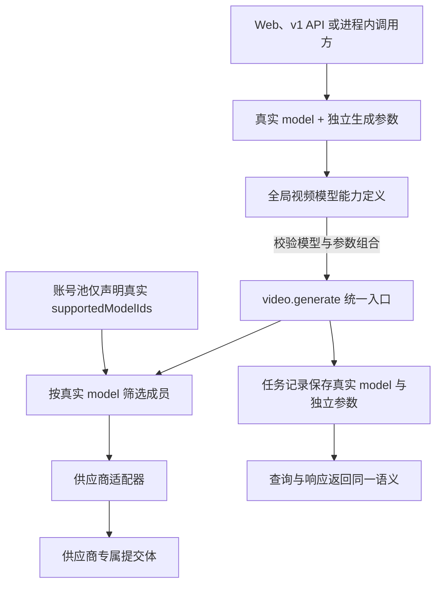

# 视频生成真实模型请求契约 - Plan

## Goal Capsule

- **Objective:** 将视频生成端到端改为“真实模型 ID + 独立生成参数”，彻底移除以 `firefly-<family>-<dur>s-<ratio>[-<res>]` 或裸复合 ID 表达请求能力的方式。
- **Product authority:** 本文固定视频请求、模型能力、账号池支持项、调度、记录、响应和存量迁移中的模型身份及参数边界；图像生成模型 ID 不属于本次范围。
- **Open blockers:** 无产品范围阻塞；规划阶段需把本文与现有统一媒体后端号池计划的复合视频能力键设计对齐。

---

## Product Contract

### Summary

视频生成将只使用 `seedance2`、`seedance2-fast`、`sora2` 等真实模型 ID。
时长、比例、分辨率、首帧、尾帧和参考图作为独立请求语义，由统一模型能力定义校验，并在供应商边界适配为上游协议。

### Problem Frame

当前视频目录把模型族、时长、宽高比和部分分辨率展开为数百个复合 ID，并允许入口继续接受 `firefly-` 前缀。
同一复合字符串随后承担请求校验、账号池能力、调度匹配、任务记录和响应身份，导致“模型是什么”与“本次怎样生成”无法独立变化。

现有上游提交体已经分别接收时长、比例、分辨率和输入图，但适配器仍先解析复合 ID 才能得到这些值。
账号池也必须枚举同一真实模型的所有参数组合，使能力配置数量膨胀，并可能在目录、调度和供应商协议之间产生漂移。

### Key Decisions

- **采用破坏性切换。** (session-settled: user-directed — chosen over 短期兼容旧复合 ID: 继续解析旧格式会保留双重请求契约和隐藏的模型语义。) Governs R1, R12。
- **真实模型 ID 贯穿所有视频链路。** (session-settled: user-directed — chosen over 只拆分入口后在内部重新拼回复合 ID: 请求、能力、记录和响应必须共享同一模型身份。) Governs R1, R6-R11。
- **核心生成参数全部显式必填。** (session-settled: user-directed — chosen over 按模型补唯一值或默认组合: 调用方必须明确本次生成意图。) Governs R2, R5。
- **输入图使用具名语义。** (session-settled: user-directed — chosen over 带角色的数组或 `inputImages` 加 `inputImageRole`: 首尾帧和参考图不应依赖数组顺序或额外模式字段解释。) Governs R3-R5。
- **模型能力定义是参数合法性的唯一来源。** 账号池只声明真实模型 ID，参数组合与输入能力不形成成员级配置；Governs R4, R6-R8。

### Actors

- A1. **视频调用方：** 通过站内创作界面、公开 v1 API 或进程内 operation 提交真实模型 ID 和本次生成参数。
- A2. **平台管理员：** 在账号池中只选择成员支持的真实视频模型，不维护时长、比例或分辨率组合。
- A3. **统一操作与调度网关：** 校验模型能力和输入语义，按真实模型 ID 筛选成员，并保持幂等、权限和财务边界。
- A4. **供应商适配器：** 把统一请求语义映射为各供应商的模型版本、尺寸、参考帧和参考图字段。

### Requirements

**模型身份与请求契约**

- R1. 所有视频生成入口必须只接受全局目录中存在的真实模型 ID，并拒绝 `firefly-` 前缀、时长/比例/分辨率复合 ID 及其历史别名。
- R2. 每次视频生成请求必须显式提供数值秒数 `duration`、规范宽高比 `aspectRatio` 和输出档位 `resolution`，即使目标模型对其中某项只有一个合法值也不得省略。
- R3. 视频输入图必须分别以可选的 `firstFrame`、`lastFrame` 和 `referenceImages` 表达，不得继续使用图片数组位置或 `inputImageRole` 推断首尾帧与参考图语义。
- R4. 模型能力定义必须校验模型支持的时长、比例、分辨率、音频、首尾帧、参考图数量和输入模式；当前模型未声明支持的组合必须在统一入口拒绝。
- R5. `lastFrame` 不得脱离 `firstFrame` 单独出现，首尾帧与 `referenceImages` 在当前支持集内不得混用，其他既有模型专属参数继续按 R4 独立校验。

**能力来源与账号池**

- R6. 全局视频模型能力定义必须以真实模型 ID 为唯一键，并为每个模型声明合法参数值、音频能力、帧能力和参考图上限。
- R7. 账号池的 `supportedModelIds` 必须只允许选择真实模型 ID，不得保存或展示由生成参数展开出的组合 ID。
- R8. 账号池成员声明支持某个真实模型后，必须能够承接该模型全部全局合法参数组合，不得再配置成员级时长、比例、分辨率或输入图变体。
- R9. 调度器必须只按真实请求模型与成员 `supportedModelIds` 匹配候选，不得解析生成参数、模型前缀或供应商名称来改变成员资格。

**记录、响应与迁移**

- R10. 视频任务必须把真实模型 ID 与时长、比例、分辨率和具名输入图语义分别保存，计费、恢复、查询和供应商适配不得再从模型字符串反向推导这些值。
- R11. 面向调用方和管理员的视频任务响应、历史记录及模型目录必须返回真实模型 ID，并在需要描述本次生成时返回对应的独立参数。
- R12. 现有账号池视频能力和历史视频任务必须迁移到真实模型 ID；无法从已有独立字段证明参数组合或模型归属的数据必须阻断迁移并给出可定位原因，不得补默认值或保留兼容别名。

### Key Flows

- F1. **提交视频生成请求**
  - **Trigger:** A1 选择真实模型并提交生成。
  - **Actors:** A1, A3, A4
  - **Steps:** A1 显式提供 R2 的核心参数和可选具名输入图；A3 按 R4 校验后按真实模型筛选成员；A4 把已校验语义映射为供应商请求。
  - **Outcome:** 任务、调度和上游调用共享一个真实模型身份，生成参数不再编码进模型 ID。
  - **Covered by:** R1-R6, R9-R11
- F2. **配置视频后端能力**
  - **Trigger:** A2 新增或编辑账号池成员支持的模型。
  - **Actors:** A2, A3
  - **Steps:** A2 从真实模型目录选择支持项；系统拒绝复合 ID 和成员级参数变体；A3 后续只用真实模型 ID 判断候选资格。
  - **Outcome:** 一个模型在每个成员上最多出现一次，不随参数组合数量膨胀。
  - **Covered by:** R6-R9
- F3. **迁移存量视频身份**
  - **Trigger:** 新契约部署前执行存量迁移。
  - **Actors:** A2, A3
  - **Steps:** 系统把账号池复合能力折叠并去重为真实模型 ID；用历史任务已有的独立参数验证并改写模型身份；发现无法证明的记录时停止切换。
  - **Outcome:** 切换后运行时、管理端和历史记录中不存在仍可调用的复合视频模型 ID。
  - **Covered by:** R7, R10-R12

### Acceptance Examples

- AE1. **Covers R1-R2, R4, R9-R11.** Given 成员支持 `seedance2`，when 调用方提交 `model=seedance2` 以及合法的时长、比例和分辨率，then 请求按 `seedance2` 获得候选，任务与响应保留真实 ID 和独立参数。
- AE2. **Covers R1, R12.** Given 调用方提交 `firefly-seedance2-15s-9x16-480p` 或 `seedance2-15s-9x16-480p`，when 请求进入任一视频生成入口，then 系统拒绝该请求且不解析为兼容调用。
- AE3. **Covers R2, R4.** Given `sora2` 当前只有一个合法分辨率，when 请求省略 `resolution`，then 系统仍拒绝请求；when 三个核心参数齐全但组合不受该模型支持，then 系统按模型能力返回参数错误。
- AE4. **Covers R3-R5.** Given 模型支持首尾帧，when 请求提供 `firstFrame` 和 `lastFrame`，then 供应商收到顺序明确的首尾帧；when 只提供 `lastFrame`，then 统一入口拒绝请求。
- AE5. **Covers R3-R6.** Given 模型支持至多三张参考图但不支持首尾帧与参考图混用，when 请求提供三张 `referenceImages`，then 请求通过输入能力校验；when 再增加一张或同时提供 `firstFrame`，then 请求在供应商调用前被拒绝。
- AE6. **Covers R7-R9.** Given 管理员编辑成员能力，when 选择 `seedance2`，then 成员只保存一个真实模型支持项并可承接其全部全局合法组合；when 尝试保存复合 ID，then 配置被拒绝。
- AE7. **Covers R10-R12.** Given 历史任务的复合模型 ID 与独立时长、比例、分辨率一致，when 执行迁移，then 任务模型改为真实 ID 且独立字段保持不变；when 两者冲突或无法映射，then 迁移停止并报告具体记录。

### Scope Boundaries

- 本次只改造视频生成的模型身份、生成参数、输入图语义、账号池能力和相关存量数据，不调整图像生成的复合模型 ID。
- 本次不保留旧复合视频 ID、`firefly-` 前缀或无分辨率历史别名的兼容窗口。
- 本次不增加账号池成员级参数子能力，也不允许成员以组合 ID 表达部分参数支持。
- 本次不新增视频模型族或供应商协议，不改变现有模型支持的参数集合和输入图上限。
- 视频计费继续按真实模型与输出分辨率确定每秒价格，本次不改变价格数值、扣费时点或退款语义。

<!-- ce-section: work-relationships -->
### How This Work Fits Together

本文只负责视频生成请求与模型身份规范，是统一媒体后端号池重构中的独立契约修正；下列关系是当前理解，不构成额外路线图。

- **Depends on:** `docs/plans/2026-07-25-001-refactor-media-backend-pool-plan.md` 提供统一账号池、UOL 和调度基础；本文取代其中把复合视频 ID 写入 `supportedModelIds` 并用于视频调度的要求。
- **Shares:** `docs/plan/2026-07-28-video-resolution-pricing.md` 已按真实模型族与分辨率表达视频价格，本文继续沿用该计费维度。
- **Can proceed independently of:** 图像请求模型 ID 的后续规范化；图像链路保持现状。

### Dependencies / Assumptions

- 现有视频任务已分别保存时长、比例和分辨率，因此存量模型身份可以在不猜测默认值的前提下校验迁移。
- 现有供应商客户端已以独立字段构造最终视频提交体，但当前适配器仍从复合 ID 取得这些值，规划必须消除该反向依赖。
- 现有模型广场已经按真实视频模型族聚合展示，新的全局能力定义可以继续作为其事实来源。
- 内容审核、对象存储、任务幂等、积分扣费与退款不变量保持不变。

### Sources / Research

- `packages/shared/src/adobe/firefly-direct/video-catalog.ts`
- `packages/shared/src/adobe/firefly-direct/payloads.ts`
- `packages/shared/src/adobe/firefly-direct/client.ts`
- `packages/shared/src/uol/operations/video-generation.ts`
- `packages/shared/src/image-backend/supported-models.ts`
- `apps/web/src/features/image-generation/components/video-create-panel.tsx`
- `apps/web/src/features/image-generation/video-operations.ts`
- `apps/web/src/features/image-generation/adobe-direct.ts`
- `apps/web/src/features/external-api/handlers/video-generations.ts`
- `apps/web/src/server/uol-bindings.ts`
- `packages/database/src/schema.ts`
- `packages/database/drizzle/0060_unified_media_backend_pool.sql`
- `docs/plans/2026-07-25-001-refactor-media-backend-pool-plan.md`
- `docs/plan/2026-07-28-video-resolution-pricing.md`
