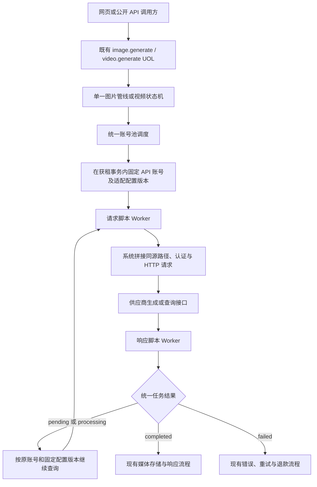
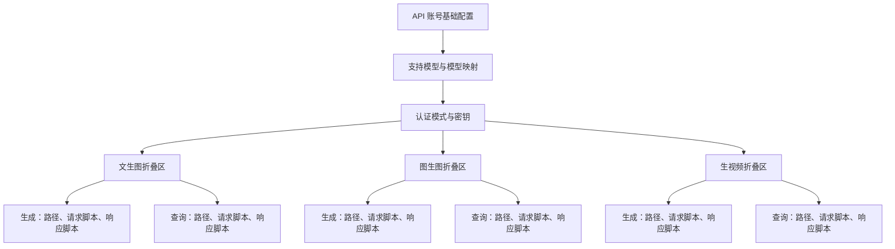
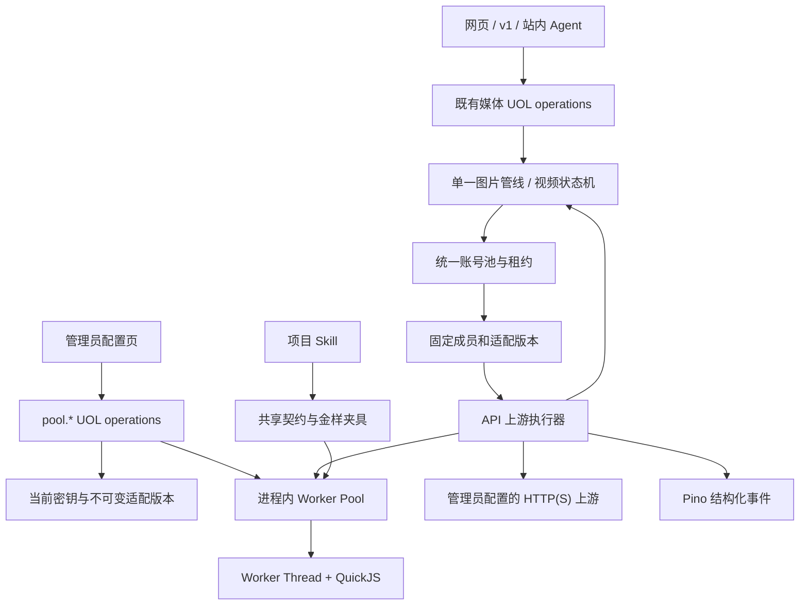
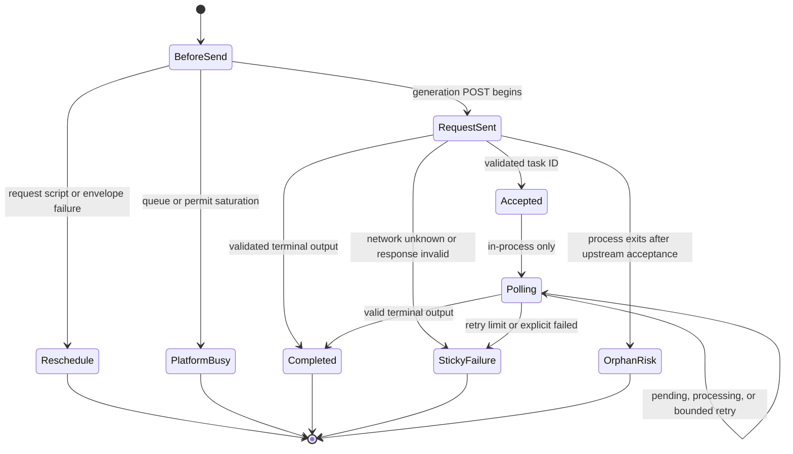
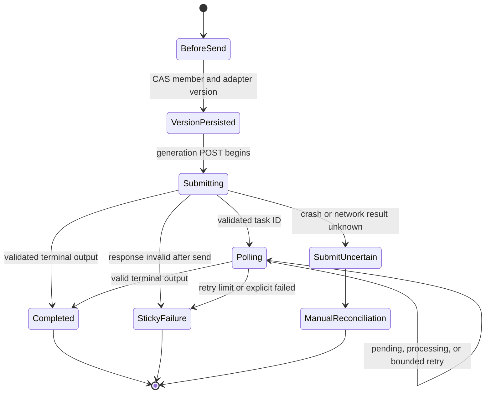
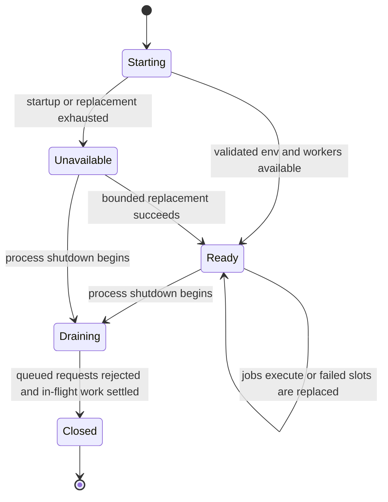
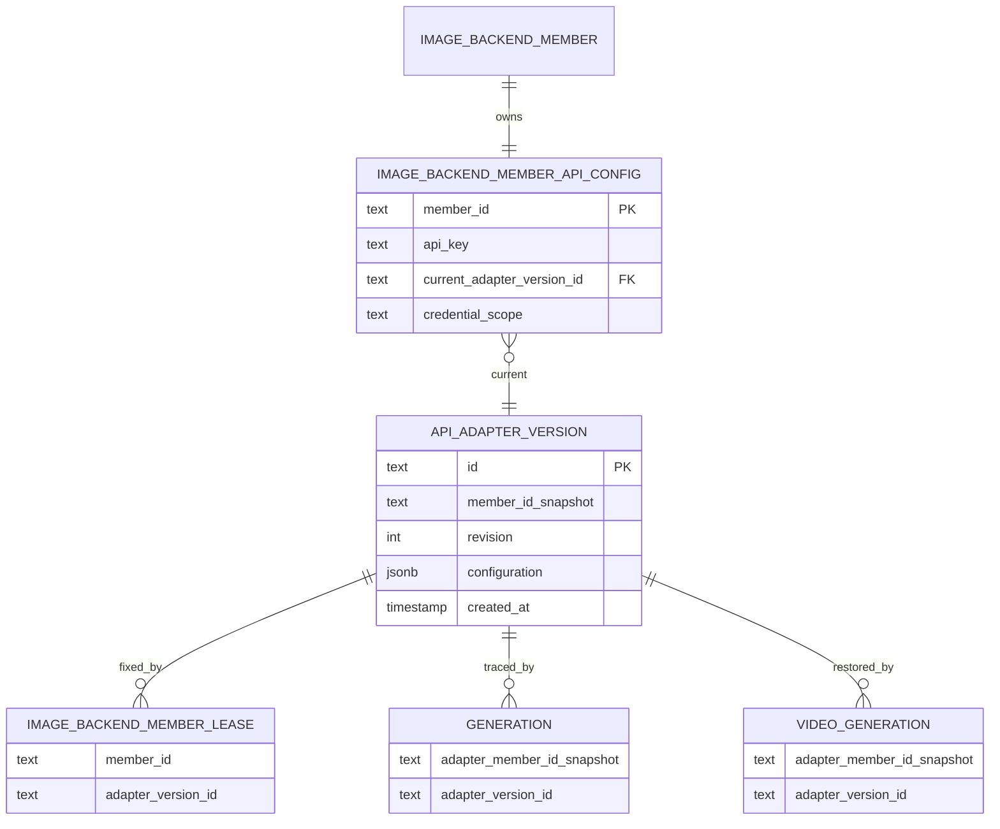
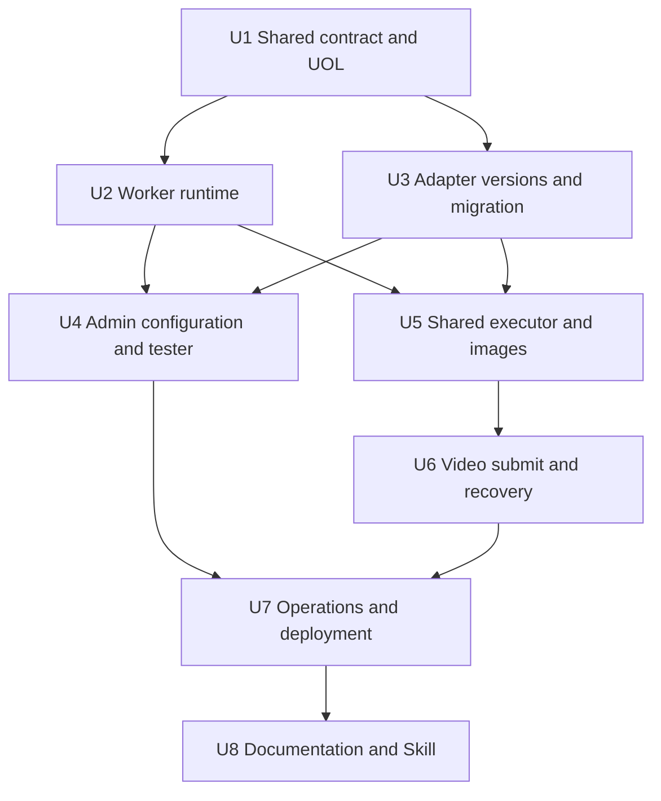

# API Upstream Adapter - Plan

## Goal Capsule

- **Objective:** 为 API 类型供应商账号提供可配置、可测试、可观测的文生图、图生图和视频上游适配器，同时保持平台公开媒体契约、调度、任务恢复与财务不变量不变。
- **Product authority:** 本文固定六个供应商操作的接口与脚本边界、同步和异步响应语义、管理员配置体验、安全沙箱、故障处理、配置版本及配套 Skill；现有真实模型 ID、媒体能力、账号池调度、用户公开 API 和 Adobe Direct 协议继续由既有计划约束。
- **Authority order:** Product Contract 决定产品行为；Planning Contract 决定实现机制；Implementation Units 只能落实两者，不得改写其语义。
- **Execution profile:** Deep；跨共享契约、UOL、QuickJS Worker、数据库迁移、图片与视频恢复、管理端、部署和项目 Skill。
- **Stop conditions:** 迁移无法无损包装旧脚本、非终态 API 视频未排空、备份/PITR 无法支持成对恢复、成员与版本归属无法由数据库约束、Worker 无法进入 standalone 产物、已外呼请求可能被自动重投、或日志与审计会记录脚本及媒体正文时停止实施并回到计划审查。
- **Tail ownership:** 文档、Skill、容器 smoke 和全仓质量门在生产契约稳定后收尾；计划内无发布阻塞型开放问题。

---

## Product Contract

### Summary

实施将扩展现有统一账号池和单一媒体管线，以版本化六操作契约、共享 Worker 执行器和固定任务快照承接供应商差异。
空配置继续使用系统内置兼容协议；网页、公开 API、调度、计费、存储和 Adobe Direct 的既有契约保持不变。

**Product Contract preservation:** restructured, no scope change: R24 明确保留现有同步、SSE 与进程内 `async=true` 图片行为；供应商异步查询只成为内部实现。

### Problem Frame

当前 API 账号只有一份账号级请求脚本，图片生成、图片编辑和视频生成共享该脚本，响应解码与视频查询路径则固化在各自适配器中。
当不同供应商使用不同模型名称、接口路径、认证 Header、任务状态、结果字段或异步查询协议时，管理员无法只靠账号配置完成适配。

把请求、响应和轮询差异继续写入供应商专属代码，会让每次接入都要求发布应用，并使账号配置、运行协议和管理员文档持续漂移。
把脚本执行移入现有 Go 代理又会扩大 Adobe 专用传输代理的主机、凭据和业务职责，因此本轮保持业务适配与传输代理分层。

### Key Decisions

- **六个操作分别配置请求与响应。** (session-settled: user-directed — chosen over 账号级共享脚本或只配置四个接口: 文生图、图生图和视频的生成与查询协议需要独立适配。) Governs R1-R5, R9-R10。
- **请求脚本返回受限信封，响应脚本返回统一任务结果。** (session-settled: user-approved — chosen over 任意 JSON 与系统推断: 明确契约便于校验、测试和稳定下游行为。) Governs R9-R23。
- **传输和凭据由系统控制。** (session-settled: user-directed — chosen over 脚本修改路径、Method 或读取 API Key: 适配能力不能扩大 SSRF 与凭据泄露边界。) Governs R2-R3, R6-R8, R11-R14。
- **图片供应商异步对平台调用方保持同步语义。** (session-settled: user-approved — chosen over 新增公开图片任务 API: 上游协议差异应停留在适配层。) Governs R24-R25。
- **按任务固定适配配置版本。** (session-settled: user-directed — chosen over 运行中任务自动读取最新配置: 异步查询与恢复必须可重复和可定位。) Governs R25-R27。
- **按阶段决定失败切换。** (session-settled: user-directed — chosen over 所有脚本错误都终止或都切换账号: 请求发出前可以安全切换，取得响应或任务 ID 后必须避免重复生成。) Governs R28-R32。
- **QuickJS 运行在 Web Worker Pool。** (session-settled: user-directed — chosen over Node 主线程或现有 Go 代理: Worker 隔离事件循环并保留已验证的脚本语义与代理职责。) Governs R33-R37。
- **管理员同时获得就近帮助、完整文档和无网络测试器。** (session-settled: user-directed — chosen over 只在保存时校验或真实上游试运行: 配置需要可理解和可验证，但不能产生真实任务与费用。) Governs R38-R41。
- **一个项目 Skill 按媒体类型渐进加载。** (session-settled: user-approved — chosen over 三个重复 Skill: 共用运行时和安全契约只维护一份，媒体差异按需读取。) Governs R42。



<!-- ce-section: work-relationships -->
### How This Work Fits Together

本文只负责 API 供应商上游适配器及其管理、运行与文档边界；它扩展既有媒体号池，不重新定义真实模型、媒体能力或财务流程。

- **Depends on:** `docs/plans/2026-07-25-001-refactor-media-backend-pool-plan.md` 提供统一 API 成员、模型映射、调度与按阶段失败切换。
- **Depends on:** `docs/plans/2026-07-29-001-refactor-video-generation-request-contract-plan.md` 提供真实视频模型 ID、独立生成参数、输入能力和持久任务语义。
- **Shares:** `packages/shared/src/uol/` 的统一接口层、现有图片单一管线、视频恢复、内容审核、对象存储和财务幂等不变量。
- **Can proceed independently of:** Adobe Direct 供应商协议扩展；现有 `media-upstream-proxy` 继续只承担受控 Adobe TLS 转发。

### Actors

- A1. **平台管理员：** 配置 API 账号的模型映射、认证、六个接口、脚本及其样例，并查看安全错误和运行日志。
- A2. **媒体调用方：** 通过网页、公开 API 或进程内操作提交图片或视频请求，不感知供应商接口与任务 ID 差异。
- A3. **上游适配网关：** 选择账号与固定配置版本，执行脚本，构造同源请求，规范响应并维持任务和重试不变量。
- A4. **脚本运行时：** 在有界 QuickJS Worker Pool 中执行同步脚本，不接触凭据、网络、文件或宿主媒体值。
- A5. **API 供应商：** 接收生成或查询请求，并返回同步媒体结果、异步任务状态或结构化失败。

### Requirements

**Operation and transport configuration**

- R1. 每个 API 类型账号必须分别配置文生图生成、文生图查询、图生图生成、图生图查询、视频生成和视频查询六个操作，每个操作各有相对路径、请求脚本和响应脚本。
- R2. 所有自定义路径必须相对账号 `baseUrl`，不得接受绝对 URL、协议相对 URL、用户信息、主机覆盖或路径逃逸；查询路径必须包含 `{task_id}` 占位符，响应不得覆盖查询地址。
- R3. 三个生成操作固定使用 `POST`，三个查询操作固定使用 `GET`；管理员和脚本均不得修改 Method，查询脚本不得为 `GET` 增加请求体。
- R4. 空路径必须保留内置行为：文生图生成使用 `/images/generations`、图生图生成使用 `/images/edits`、视频生成使用 `/videos/generations`、视频查询使用 `/videos/{task_id}`，两种图片查询默认不存在。
- R5. 图片生成或编辑响应为异步状态时必须存在对应查询路径，否则按账号配置错误失败；系统不得根据响应内容猜测查询路径。
- R6. 账号模型映射必须继续以平台真实模型 ID 为来源、供应商真实模型 ID 为目标，未配置项同名透传；接口与脚本不得重新引入复合视频模型 ID。
- R7. API 账号认证必须支持 `Bearer`、Raw Authorization、自定义认证 Header 和无认证四种系统模式，六个操作共享同一认证模式，凭据值始终来自账号密钥。
- R8. 系统不得把账号密钥注入 URL 或 Query；脚本不得读取、返回、覆盖或记录账号密钥及系统生成的认证 Header。

**Request script contract**

- R9. 非空请求脚本必须返回一个可省略 `query`、`headers` 和 `body` 的请求信封；省略某部分表示保留系统内置值，返回空对象表示无修改，未返回对象必须失败关闭。
- R10. 空请求脚本必须完全使用系统内置请求构造，不创建或执行无意义的脚本包装。
- R11. 请求脚本只能读取标准请求和脱敏只读上下文；上下文可包含操作、内容类型、平台模型 ID、映射后的供应商模型 ID及查询任务 ID，不得包含账号、用户、凭据、完整 URL 或现有请求 Header。
- R12. `query` 必须只接受字符串、有限数字、布尔值及这些标量的一维数组；数组编码为保序重复参数，`null` 删除同名内置参数，最多 64 个参数值且编码结果最多 16 KiB。
- R13. 脚本业务 Header 最多 32 个，名称必须符合 HTTP token，单值最多 8 KiB 且不得含换行；认证、Cookie、主机、正文编码、逐跳、代理、转发、来源和平台内部 Header 必须被拒绝。
- R14. `body` 必须满足目标操作的 JSON 或 multipart 形状；图生图的单图、多图、蒙版和视频输入媒体必须保留宿主令牌不变量，脚本不得删除、复制、伪造或把 multipart 媒体放入不支持的嵌套位置。
- R15. `client_request_id` 出现时必须保留或移动到供应商等价幂等字段；供应商完全不支持幂等键时，管理员文档和 Skill 必须报告重复提交风险，脚本不得静默删除该语义。

**Response script contract**

- R16. 响应脚本只能读取 HTTP 状态码、安全响应 Header、解析后的 JSON 或文本正文及脱敏上下文；不得读取请求凭据、请求 Header、账号或用户身份、完整目标 URL 和原始二进制正文。
- R17. 空响应脚本必须使用现有内置响应解析；非空响应脚本必须返回 `pending | processing | completed | failed` 四种标准状态之一，不得把任意供应商 JSON 直接交给下游推断。
- R18. 生成响应返回 `pending` 或 `processing` 时必须包含非空 `taskId`；查询响应可以复用上下文任务 ID，`progress` 可选且必须在 `0–100` 范围内。
- R19. `pollAfterSeconds` 必须保持可选；出现时只能用于 `pending` 或 `processing`，必须是 `1–300` 的整数，并作为内部下一次供应商查询的最早时间。
- R20. `pollAfterSeconds` 省略时图片和视频均默认 5 秒；有效 `Retry-After` 与脚本值同时存在时使用更长等待，终态携带轮询间隔必须被拒绝。
- R21. `completed` 必须至少返回一个符合媒体类型的输出；图片支持一个或多个 URL 或 Base64 JSON 输出，视频只支持 URL，单个输出不得同时携带 URL 与 Base64。
- R22. `failed` 必须返回标准错误分类和稳定错误码，可携带仅供授权管理员诊断的受限信息；未经信任的上游正文和消息不得直接展示给用户或写入日志。
- R23. 生成失败可以携带可选 `retryable`，默认 `false`；只有没有取得任务 ID且管理员已确认供应商未创建任务时才允许切换账号，查询响应或已接受任务不得触发重新提交。

**Async tasks and version stability**

- R24. 供应商异步文生图和图生图必须在图片管线内部轮询；网页、同步图片 API 和 SSE 继续返回最终图片，现有 `async=true`、任务查询及一次性回调保持进程内尽力型语义，本次不新增跨重启持久图片任务契约。
- R25. 异步查询必须固定在提交生成的原供应商账号，使用配置路径而不是响应 URL；查询失败不得切换账号，视频继续使用现有持久恢复，图片继续使用现有总时限和幂等退款。
- R26. 每个异步任务必须固定提交时的适配配置版本；管理员保存新配置只影响新任务，运行中任务继续使用原查询路径和脚本。同一凭据域内的密钥轮换使用当前有效密钥；存在旧版本有效租约或非终态任务时，改变 `baseUrl` origin、认证模式或认证 Header 的跨凭据域保存必须失败关闭。
- R27. 首版不得清理任何旧适配版本。有效租约或非终态任务必须阻止成员删除；成员可删除后，终态历史仍保留非密钥版本快照与版本标识，API Key 随成员删除且不进入历史版本。

**Failure semantics and observability**

- R28. 请求脚本在网络请求发出前失败时可以排除当前账号并重新调度；账号失败原因必须区分脚本配置错误与供应商调用错误。
- R29. 生成请求已经发出后，响应脚本失败不得向其他账号重新提交；查询脚本失败必须按原账号的有界查询重试策略处理，达到上限后进入现有失败和退款流程。
- R30. 脚本语法、执行或输出错误必须向用户返回稳定错误码、请求标识和“供应商请求处理失败，请联系管理员”的安全文案；不得暴露源码、堆栈、账号、供应商响应或内部路径。
- R31. 运行期脚本失败必须输出统一的 `api_upstream_script_failed` 结构化事件，以操作、请求或响应阶段、失败码、是否已发送、重试动作、账号成员、池、模型、请求标识和任务摘要作为稳定维度。
- R32. 日志必须保持厂商无关并通过 Pino 写入标准输出；不得记录密钥、认证信息、脚本、请求体、响应体、Prompt、媒体或原始任务 ID，文档同时提供本地日志和通用采集示例，Datadog 只作为示例消费者。

**Sandbox and capacity**

- R33. 请求与响应脚本必须运行在同一 QuickJS 安全契约中，允许同步函数声明、箭头函数和标准同步 JavaScript 对象，禁止模块导入、第三方库、Promise、网络、文件、定时器、进程、时间、随机数和动态代码执行。
- R34. 单脚本源码最多 32,768 个 UTF-16 代码单元，同步执行最多 50 ms，普通 JSON 输入输出最多 2 MiB、深度最多 16、节点最多 10,000；受保护媒体不计入普通 JSON 体积但仍受宿主媒体预算约束。
- R35. QuickJS 必须由 Web 服务内的有界 Worker Thread Pool 执行，不得在 Next.js 主事件循环执行，也不得并入现有 `media-upstream-proxy`；Worker 数默认 1，并通过部署级 `API_UPSTREAM_SCRIPT_WORKER_COUNT` 调整。
- R36. 单 Runtime 内存默认 32 MiB、栈默认 512 KiB，并分别通过部署级 `API_UPSTREAM_SCRIPT_MEMORY_LIMIT_MB` 和 `API_UPSTREAM_SCRIPT_STACK_LIMIT_KB` 调整；启动时必须校验系统安全范围，账号不得覆盖 Worker 数或资源限制。
- R37. Worker Pool 必须使用有界优先级队列，并为响应脚本保留有界准入容量；需要该容量时必须优先拒绝或移出尚未执行、尚未外呼的请求脚本，饱和不得改变供应商账号状态，新请求必须返回可重试的平台繁忙错误并记录 `api_upstream_script_runtime_saturated` 事件。

**Admin experience, documentation, and Skill**

- R38. API 账号配置页必须按文生图、图生图和生视频分成三个折叠区，每区分别展示生成和查询的固定 Method、路径、请求脚本、响应脚本、内置默认提示、参数帮助及测试入口；非 API 账号不得展示这些配置。
- R39. 管理端必须提供无网络脚本测试器：请求测试预览信封，响应测试预览标准任务结果，测试使用生产 QuickJS Worker 与校验器、模拟媒体令牌，且不得读取密钥、请求上游或产生费用。
- R40. 保存配置时必须再次校验所有非空脚本的长度、语法和静态契约，并把错误定位到媒体类型、生成或查询及请求或响应阶段；测试成功不得绕过保存校验。
- R41. 管理员文档必须列出六个操作中每个请求和响应脚本可读取的字段、类型、可选性、返回结构、默认行为、安全限制、错误码、日志字段及本地和通用监控查询示例，并提供模型映射、Body、Query、Header、任务状态、结果 URL、Base64、进度和重试映射示例。
- R42. 项目内 Skill 必须原地演进为 `write-api-upstream-adapter`，共同流程保留在 `SKILL.md`，运行时契约及文生图、图生图和视频差异按需放入直接引用的参考文件；Skill 必须生成路径、认证、模型映射、请求和响应脚本与样例，并通过结构校验及真实任务形状的隔离正向测试。

**Migration and unified interface**

- R43. 旧账号级请求脚本必须在迁移时分别包装为三个生成请求信封并复制到对应操作，空脚本不生成新内容；查询请求脚本和全部响应脚本保持空，旧单脚本字段在迁移后删除且不得保留运行时回退。
- R44. 当前没有已上线脚本数据这一事实只允许简化兼容期，不得让迁移对意外非空测试或其他环境数据静默丢失；数据库迁移必须保持手写、幂等和可验证。`0077` 前必须通过旧配置预检，并在无法无损转换的非终态 API 视频存在时阻断升级。
- R45. 适配配置读取、保存、脚本测试和运行诊断必须先注册为统一接口层 operation，携带 Zod 输入、Principal 权限、审计和副作用声明；管理 Action 与 API Route 只能做解析、Principal 构造、调用和响应编码。

### Admin Layout



### Key Flows

- F1. **Configure and test an adapter**
  - **Trigger:** A1 新增或编辑 API 账号的上游协议。
  - **Actors:** A1, A3, A4
  - **Steps:** A1 选择认证与真实模型映射，按媒体操作填写相对路径和脚本，用内置样例或供应商样例执行无网络测试，再保存配置。
  - **Outcome:** 新配置形成可审计版本，只有新任务使用该版本。
  - **Covered by:** R1-R15, R33-R45
- F2. **Submit a synchronous upstream result**
  - **Trigger:** A2 发起媒体生成，A3 选择 API 账号。
  - **Actors:** A2, A3, A4, A5
  - **Steps:** A3 固定配置版本并执行请求脚本，系统注入路径和认证后调用 A5，响应脚本把结果规范为 `completed`，随后进入现有存储和结算流程。
  - **Outcome:** 调用方获得平台媒体结果，不感知供应商字段差异。
  - **Covered by:** R1-R23, R28-R37
- F3. **Complete an asynchronous upstream task**
  - **Trigger:** 生成响应脚本返回 `pending` 或 `processing`。
  - **Actors:** A2, A3, A4, A5
  - **Steps:** A3 固定任务 ID、原账号和配置版本，按 R19-R20 调度查询，循环规范进度直到终态；图片只在当前管线内保留状态，视频沿用持久任务查询。
  - **Outcome:** 单次活跃执行不重新提交生成，视频可持久恢复，查询协议可配置，公开媒体契约保持稳定。
  - **Covered by:** R18-R27, R29-R32
- F4. **Handle script failure or saturation**
  - **Trigger:** 脚本编译、执行、校验或 Worker 入队失败。
  - **Actors:** A2, A3, A4
  - **Steps:** A3 根据网络是否发出和任务是否已接受选择安全失败语义，返回稳定用户错误并输出脱敏结构化事件；容量饱和不降级账号。
  - **Outcome:** 当前活跃执行或持久视频恢复不重复提交生成，不泄露供应商数据，并能通过本地或集中日志定位故障。
  - **Covered by:** R23, R28-R37
- F5. **Continue an in-flight task after configuration changes**
  - **Trigger:** A1 在异步任务运行期间保存新的账号适配配置或轮换密钥。
  - **Actors:** A1, A3
  - **Steps:** A3 让新任务使用新版本，旧任务继续读取原适配版本并使用同凭据域当前密钥；跨凭据域变更在旧任务存在时拒绝，首版不清理历史版本。
  - **Outcome:** 兼容配置修改不改变在途任务语义，密钥轮换无需复制敏感数据。
  - **Covered by:** R26-R27

### Acceptance Examples

- AE1. **Covers R1-R5, R10.** Given API 账号未填写任何新路径或脚本，when 平台调用文生图、图生图或视频，then 生成与视频查询继续使用内置路径和解析；图片返回异步状态但没有查询路径时在账号调用边界失败。
- AE2. **Covers R2-R3, R7-R8.** Given 管理员填写绝对查询 URL、尝试把 API Key 放入 Query 或让脚本覆盖认证 Header，when 保存或执行配置，then 系统在外呼前拒绝且不输出密钥。
- AE3. **Covers R9-R15.** Given 视频请求脚本只需把比例改名并增加 API 版本，when 脚本返回 `body` 和 `query` 而省略 `headers`，then 系统保留原安全 Header、编码 Query，并使用转换后的 JSON Body。
- AE4. **Covers R12-R14.** Given 图生图包含多张图片和蒙版，when 脚本移动字段但复制、丢失或把媒体令牌嵌套进对象，then 测试和生产运行均失败关闭且不上游发送损坏媒体。
- AE5. **Covers R16-R21.** Given 视频生成响应返回任务 ID，when 响应脚本映射为 `processing`、`progress=25` 且省略 `pollAfterSeconds`，then 系统按 5 秒默认值用配置查询路径轮询原任务。
- AE6. **Covers R19-R20.** Given 供应商响应 Header 要求等待 20 秒且脚本返回 10 秒，when 系统安排下次查询，then 不早于 20 秒；脚本返回 `0`、浮点数或终态轮询间隔时按非法输出失败。
- AE7. **Covers R21-R23.** Given 文生图返回多个 Base64 图片，when 响应脚本生成多个图片输出，then 平台恢复受保护媒体并进入现有多图片流程；视频返回 Base64 或同时返回 URL 与 Base64 时被拒绝。
- AE8. **Covers R23, R28-R30.** Given 生成响应明确表示限流且任务未创建，when 脚本返回 `retryable=true`，then 调度器可以切换账号；一旦已有任务 ID 或处于查询阶段，同一标记不得重新提交。
- AE9. **Covers R24-R27.** Given 异步图生图已使用配置版本 7 提交，when 管理员保存同凭据域版本 8并轮换密钥，then 当前进程中的任务继续使用版本 7 的查询路径和脚本、使用当前密钥并最终返回图片；跨凭据域保存必须拒绝。
- AE10. **Covers R28-R32.** Given 响应脚本运行失败，when 上游请求已经发出，then 用户收到联系管理员的稳定错误和请求标识，日志含统一事件与阶段字段但不含脚本、响应、Prompt 或任务 ID 原文，并且平台不换号重投。
- AE11. **Covers R35-R37.** Given 尚未外呼的请求脚本占满普通队列容量，when 已收到上游响应的脚本入队，then 系统使用保留容量接收响应脚本，并优先拒绝或移出请求脚本；受影响的新请求收到可重试繁忙错误，账号健康保持不变。
- AE12. **Covers R38-R42.** Given 管理员只有供应商 HAR 与字段说明，when 打开参数帮助并使用项目 Skill 生成配置，then 可以在不访问上游的测试器中验证请求信封和标准响应，文档明确列出所有可取字段与安全限制。
- AE13. **Covers R43-R44.** Given 旧字段为空，when 执行迁移，then 新脚本字段保持空；given 意外存在按操作分支的旧脚本，when 迁移，then 三个生成操作获得等价请求信封且旧字段被删除。
- AE14. **Covers R45.** Given 管理页面测试或保存脚本，when 请求到达传输层，then 传输只构造 Principal 和调用统一 operation，权限、审计、脚本校验及错误映射在统一网关生效。

### Scope Boundaries

- 本适配器不是通用 HTTP 代理或任意代码执行平台；传输、凭据和脚本权限边界由 R2-R3、R7-R8、R11-R14、R16 和 R33 约束。
- 本轮不扩展平台公开图片异步契约、媒体编码能力或私有媒体下载协议；输出和同步语义由 R21、R24 约束。
- 本轮不改变现有 Go `media-upstream-proxy`、Web 副本数量或 Nginx 负载均衡；脚本运行位置由 R35 约束。
- 本轮不提供账号级脚本资源策略；部署级容量、固定任务版本及查询账号归属由 R25-R27、R35-R37 约束。
- 本轮不把无网络测试或运行诊断新增为 Admin MCP 工具；管理页面经 `human-only` UOL operation 调用，现有 Admin MCP 投影行为保持不变。
- 管理员配置的 API `baseUrl` 继续允许任意 HTTP(S) 公网、私网、局域网或容器网络地址；本轮不增加域名、CIDR 或公网限定，操作路径仍不得脱离该地址的传输边界。
- 首个版本保留全部不可变适配版本，不运行自动清理；后续若增加清理，必须另行设计引用门禁和保留策略。
- 不改变真实模型能力、首尾帧与参考图互斥、Seedance 参考图数量、媒体存储、内容审核、扣费、退款或用户删除策略；这些继续由既有计划和项目不变量约束。

### Dependencies and Assumptions

- API 账号继续通过现有 `baseUrl` 和统一账号池选择，现有模型映射、成员健康、租约和按阶段切换语义可被扩展而非复制。
- 图片单一生成管线能够在现有总时限内承接供应商异步轮询，并在超时或失败时沿用现有幂等退款。
- 视频任务继续把上游任务绑定到原成员，持久恢复能够保存并读取适配配置版本。
- 输入和输出媒体可以在 QuickJS 外转换为不可预测宿主令牌，脚本仅移动令牌且宿主完成恢复。
- 生产仍通过 `deploy/docker-compose.yml` 启动单个 Web Node 进程；Worker Pool 在该进程内提供脚本隔离和可配置并行度。

### Sources

- `apps/web/src/features/image-backend-pool/request-transform-runtime.ts`
- `apps/web/src/features/image-backend-pool/request-transform-runtime.test.ts`
- `apps/web/src/features/image-backend-pool/member-service.ts`
- `apps/web/src/features/image-backend-pool/runtime-service.ts`
- `apps/web/src/instrumentation.ts`
- `apps/web/next.config.mjs`
- `apps/web/src/features/image-generation/service.ts`
- `apps/web/src/features/image-generation/api-video.ts`
- `apps/web/src/features/image-generation/video-operations.ts`
- `apps/web/src/features/external-api/async-image-tasks.ts`
- `packages/shared/src/image-backend/api-upstream-adaptation.ts`
- `packages/shared/src/uol/operations/image-backend-pool.ts`
- `packages/database/src/schema.ts`
- `packages/database/drizzle/0075_api_account_upstream_adaptation.sql`
- `Dockerfile.web`
- `deploy/docker-compose.yml`
- `skills/write-api-request-transform/SKILL.md`
- `skills/write-api-request-transform/references/runtime-contract.md`
- `docs/memory/api-account-upstream-adaptation.md`
- `docs/plans/2026-07-25-001-refactor-media-backend-pool-plan.md`
- `docs/plans/2026-07-29-001-refactor-video-generation-request-contract-plan.md`
- [Node.js 22 Worker Threads](https://nodejs.org/docs/latest-v22.x/api/worker_threads.html)
- [Next.js standalone output and file tracing](https://nextjs.org/docs/app/api-reference/config/next-config-js/output)
- [quickjs-emscripten runtime and memory management](https://github.com/justjake/quickjs-emscripten/blob/main/README.md)
- [RFC 9110 Retry-After and 503](https://www.rfc-editor.org/rfc/rfc9110.html#section-10.2.3)

---

## Planning Contract

### Key Technical Decisions

- KTD1. **共享契约拆分配置与脚本作业。** `packages/shared/src/image-backend/api-upstream-adaptation.ts` 继续拥有模型映射、认证、默认路径和版本配置；新建 `api-upstream-script-contract.ts` 统一六个供应商适配操作、请求信封、响应结果、错误码和资源边界。适配操作 ID 固定为 `images.generate`、`images.generate.query`、`images.edit`、`images.edit.query`、`videos.generate` 和 `videos.query`；它们不是新的 UOL operation。Covers R1-R23, R33-R34, R42-R45。
- KTD2. **适配配置采用不可变 JSON 历史行。** (session-settled: user-directed — chosen over reference-aware automatic cleanup: 首版必须先消除提交与清理的竞态，再考虑存储回收。) API 候选的当前版本必须在获租事务内写入租约，运行链路只按租约或任务版本读取非密钥配置。版本表保留历史 `member_id` 而不随成员级联删除，并以 `(member_id, version_id)` 复合约束保证当前指针、租约和任务不会引用其他成员的版本；首版不删除任何版本。Covers R25-R27, R43-R44。
- KTD3. **密钥与适配版本分离并受凭据域约束。** `image_backend_member_api_config` 只保留当前 API Key、当前版本指针、当前 `credentialScope` 和时间字段；版本保存 `baseUrl`、`useStream`、模型映射、认证模式、认证 Header 名、`credentialScope` 及六个适配操作。仅在 origin、认证模式和认证 Header 相同的凭据域内轮换密钥不创建版本；存在旧域有效租约或非终态任务时，跨域保存必须原子拒绝。Covers R6-R8, R26-R27。
- KTD4. **QuickJS Worker 使用双层终止和显式生命周期。** (session-settled: user-directed — chosen over Node 主线程或 Go 代理执行: Worker 隔离事件循环，同时保留已验证的 QuickJS 契约。) Pool 以幂等启动进入 `ready`，关闭时依次进入 `draining` 和 `closed`；每个作业新建并销毁 Runtime/Context，以 interrupt handler 执行 50 ms CPU 截止，宿主另设墙钟看门狗。超时、`error`、`messageerror`、非零 `exit` 或清理失败都淘汰整只 Worker，等待 `terminate()` 完成后按退避补建。Covers R30-R37。
- KTD5. **外呼前预留 Pool 级未来响应许可。** 请求、保存校验和管理测试进入低优先级队列；真实响应进入高优先级队列。每个 Worker 配置 64 个请求排队位、16 个 Pool 级未来响应许可和 32 MiB 排队数据预算；许可不绑定具体 Worker，只在确定未外呼或响应处理结算后恰好释放。请求最多等待 2 秒，已预留响应最多等待 5 秒；外呼前无法取得许可时返回 `503` 与 `Retry-After: 1`，不发送请求，也不改变账号健康。Covers R28-R29, R37。
- KTD6. **`baseUrl` 保持管理员信任边界。** (session-settled: user-directed — chosen over public-only or CIDR allowlist: 私有部署需要访问 HTTP、Docker 内网和局域网上游。) `baseUrl` 继续接受任意 HTTP(S) 地址；操作路径只按该基址解析，拒绝绝对 URL、协议相对 URL、反斜杠、userinfo、fragment、路径逃逸和跨源重定向。跨源产物下载继续使用现有公网 DNS pin 边界。Covers R2-R5, R7-R8。
- KTD7. **宿主最后合并传输字段。** 请求脚本读取不含现有 Header 的 `{ query, body }` 和脱敏 context，并返回部分信封；宿主校验 Query 与业务 Header 后最后注入认证和正文编码。响应脚本只读取状态码、解析后的 JSON 或有界文本，以及 `content-type`、`retry-after`、`request-id`、`x-request-id` 四个安全 Header。Covers R9-R17。
- KTD8. **响应媒体在 QuickJS 外令牌化。** 宿主把已验证的输入媒体及响应中的图片 data URL/Base64 替换为不可预测令牌，再计算 2 MiB 普通 JSON 预算；脚本只能移动令牌。恢复后继续执行现有 MIME、数量、字节、URL、下载和存储校验。Covers R14, R21, R33-R34。
- KTD9. **失败分类由类型而非错误字符串驱动。** 执行器、媒体 service 和最外层重试循环共同传递 `member_switchable`、`member_sticky`、`platform` 或 `user`，并携带 `request_sent`、`task_accepted` 与稳定错误码；只有响应编码时才转换为用户文案。生成 POST 开始前单调置 `request_sent=true`，此后网络不确定、响应脚本失败和已接受任务都禁止重投。Covers R22-R23, R28-R32。
- KTD10. **图片供应商异步留在单一图片管线。** (session-settled: user-directed — chosen over durable public image tasks: 本轮只适配供应商协议，不重建公开图片任务系统。) `generateImage` 和 `editImage` 在现有总时限内轮询到终态；一旦取得任务 ID便固定成员和版本。现有 `async=true` 仍只是同一管线外层的进程内尽力包装。**Conflict call-out:** 该选择不提供跨进程重启的 exactly-once；崩溃后可能留下远端孤儿任务，调用方重试对不支持幂等键的供应商可能再次生成，此风险必须在文档、日志和验收口径中明确。Covers R18-R30。
- KTD11. **视频在首次外呼前持久化版本。** 视频提交 CAS 从租约复制同一成员和版本后，才执行请求脚本和 HTTP 请求；接管与恢复不得读取 current pointer。API 视频只持久化上游任务 ID和下一次轮询时间，不采用响应 URL；Adobe 的 `pollUrl` 行为保持独立。Covers R18-R20, R23-R29。
- KTD12. **适配管理通过 UOL，但不新增 Admin MCP 工具。** (session-settled: user-directed — chosen over exposing tester and diagnostics to Admin MCP: 当前需求只要求管理页面和项目 Skill。) 扩展 `pool.getAdminPool` 返回当前版本元数据；`pool.saveMember` 输入携带期望版本，API 输出返回新版本 ID/revision，过期写映射为稳定冲突。新增 `pool.testApiUpstreamAdapter` 与 `pool.getApiUpstreamRuntimeDiagnostics`；前者只读、自然幂等、声明进程内队列副作用，后者只读、自然幂等，二者均标记 `agentExposure: human-only` 和 `processLocalState: true`。Covers R38-R45。
- KTD13. **配置页拆出专用编辑器。** `member-form.tsx` 只管理成员级提交流程；API 适配草稿、操作折叠区和无网络测试器各自成文件。保存再次走与生产相同的路径、脚本和 schema 校验，以期望当前版本拒绝并发覆盖，并在事务内校验凭据域兼容后才更新密钥和当前指针。Covers R26, R38-R40, R45。
- KTD14. **Worker 入口由启动钩子初始化并显式 trace。** `instrumentation.ts` 在 Node Runtime 启动时校验 env 和建立进程单例，运行调用提供相同的幂等惰性兜底；Node 侧以 `pathToFileURL(resolve(...))` 定位 Worker，避免 Turbopack 把字面量 Worker URL 误编译为浏览器 Worker，`next.config.mjs` 则显式包含 Worker 与 QuickJS 资产。Worker 数范围为 1-8，Runtime 内存范围为 16-128 MiB，栈范围为 256-2048 KiB；非法 env 使服务启动失败，进程退出时停止准入并在 grace period 内结算或拒绝作业。Covers R34-R37。
- KTD15. **Skill 在生产契约稳定后改名。** 一个 `write-api-upstream-adapter` Skill 保留共同流程，并按文生图、图生图和视频渐进读取参考文件。Skill、管理帮助和生产测试共享版本号、操作 ID、夹具与隔离验证入口，旧 Skill 删除且不保留两套说明。Covers R41-R42。

### Operation Matrix

| Operation | Method | Built-in path | Body | Async query requirement |
|---|---|---|---|---|
| `images.generate` | POST | `/images/generations` | JSON | 返回非终态时必须配置 `images.generate.query` |
| `images.generate.query` | GET | 无 | 禁止 | 路径必须包含 `{task_id}` |
| `images.edit` | POST | `/images/edits` | multipart | 返回非终态时必须配置 `images.edit.query` |
| `images.edit.query` | GET | 无 | 禁止 | 路径必须包含 `{task_id}` |
| `videos.generate` | POST | `/videos/generations` | JSON | 使用 `videos.query` |
| `videos.query` | GET | `/videos/{task_id}` | 禁止 | 路径必须包含 `{task_id}` |

### Runtime Capacity Model

单 Worker 同时只执行一个脚本，因此最大脚本并行数等于 Worker 数。50 ms 是执行上限，不是平均耗时或 SLA。

| Worker 数 | 最大并行脚本 | 50 ms 上限下理论脚本吞吐 | 每次 HTTP 使用请求与响应脚本时的理论周期吞吐 | 未来响应许可 |
|---:|---:|---:|---:|---:|
| 1（默认） | 1 | 20 jobs/s | 10 cycles/s | 16 |
| 2 | 2 | 40 jobs/s | 20 cycles/s | 32 |
| 4 | 4 | 80 jobs/s | 40 cycles/s | 64 |
| 8（上限） | 8 | 160 jobs/s | 80 cycles/s | 128 |

实际吞吐还受脚本复杂度、序列化、上游耗时、账号并发、Node 与容器内存约束。Node `resourceLimits` 只限制 Worker 的 V8 堆，不覆盖 QuickJS WASM 外部内存；部署容量必须按 Worker 数乘以 QuickJS 上限和进程开销共同预算。

### High-Level Technical Design

#### Component Topology



#### Generate and Poll Sequence

```mermaid
sequenceDiagram
  participant C as Caller
  participant O as Existing UOL operation
  participant M as Media pipeline or video state machine
  participant L as Member lease
  participant P as Worker pool
  participant E as Upstream executor
  participant U as Supplier
  C->>O: Invoke image.generate or video.generate
  O->>M: Enter existing single pipeline
  M->>L: Atomically acquire member and current adapter version
  M->>P: Reserve pool-level response permit
  M->>P: Run request script
  P-->>M: Validated request envelope
  M->>E: Resolve path and inject current credential
  E->>U: POST generation
  U-->>E: HTTP response
  E->>P: Run high-priority response script
  P-->>M: Standard result and release permit
  alt completed
    M->>M: Existing download, storage and settlement
  else pending or processing
    M->>M: Retain image state or persist video state
    M->>P: Run fixed-version query scripts with a new permit
    M->>U: GET configured query path
  else failed or invalid after send
    M->>M: Sticky failure; never resubmit generation
  end
```

#### Failure State Model

**Image request-scoped path**



**Durable video path**



#### Worker Pool Lifecycle



#### Configuration and Task References



版本的 `member_id_snapshot` 不对成员表做级联外键，以便成员删除后保留历史；当前指针、API 租约及任务快照通过 `(member_id, version_id)` 复合约束防止成员 A 使用成员 B 的版本。API 成员删除仍由有效租约和非终态任务门禁阻止，终态历史只保留非密钥快照。

### Sequencing



### System-Wide Impact

| Concern | Change | Preserved invariant |
|---|---|---|
| 数据生命周期 | 新增不可变适配版本、成员快照及租约、图片、视频引用 | API Key 不进入历史版本；成员删除不级联版本；首版不删除版本 |
| 调度 | API 租约固定适配版本，运行时增加平台饱和分类 | 真实模型 ID、成员能力、冷却和并发仍由账号池决定 |
| 图片 | 供应商异步可在单次图片管线内轮询 | 所有入口仍汇入 `runImageGenerationForUser`，财务真相不迁移到 generation |
| 视频 | API 恢复读取旧版本及同凭据域当前密钥 | 原成员、提交不确定、存储、回调和退款状态机保持幂等 |
| 安全 | 脚本可改 Query 与业务 Header，但不能接触凭据和目标主机 | 管理员 `baseUrl` 的现有 HTTP(S) 信任边界保持不变 |
| 性能 | QuickJS 从主线程迁入有界 Worker Pool | Next 主事件循环不执行管理员脚本，饱和不处罚供应商 |
| Agent 与管理 | 新测试器和诊断器走 UOL，但标记 human-only | 不新增 Admin MCP 工具或 Agent 保存能力 |
| 运维 | 新增三个部署 env 和两个稳定日志事件 | Pino stdout 继续支持本地、Datadog 或其他采集器 |

### Alternative Approaches Considered

| Alternative | Rejected because |
|---|---|
| 在图片和视频适配器内分别解释供应商 JSON | 会复制六套协议和失败语义，管理测试无法与生产保持一致 |
| 继续在 Next 主线程直接创建 QuickJS Runtime | 50 ms interrupt 不能隔离 WASM 故障、清理失败或事件循环抖动 |
| 把脚本执行移入 Go 代理 | 会把 Adobe TLS 代理扩大为持有业务契约、账号配置和多供应商状态的服务 |
| 运行任务始终读取当前配置 | 管理员修改脚本后，在途任务无法重复查询或恢复 |
| 接受响应中的 `poll_url` 或 `status_url` | 响应可改变路由并绕过管理员配置，旧任务也无法固定协议 |
| 本次把图片异步任务全部持久化 | 会新增公开任务状态机、调度认领和可靠回调，超出供应商适配目标 |
| 首版自动清理旧版本 | 提交已读取旧版本但尚未写入引用时存在删除竞态 |
| 仅按优先级排序而不预留响应许可 | 请求可以在外呼后失去响应处理容量，造成不可安全重投的任务丢失 |

### Risks and Mitigations

| Risk | Mitigation | Release evidence |
|---|---|---|
| `quickjs-emscripten@0.32.0` 未承诺 Node 22 Worker + Next standalone 组合 | 固定版本、每作业销毁 Runtime、Worker 故障替换、构建和容器 smoke 阻断发布 | standalone 文件断言与容器内真实脚本作业 |
| Node `resourceLimits` 不覆盖 WASM 外部内存 | QuickJS 内存限制、Worker 数安全范围、排队字节预算和容器内存预算共同约束 | OOM、堆分配和替补 Worker 测试 |
| 迁移包装意外非空旧脚本时改变语义 | PostgreSQL 隔离 schema 执行真实旧脚本包装夹具；不合法数据使迁移回滚 | 空脚本、分支脚本、重复执行和旧列删除断言 |
| `0077` 提交后旧应用无法读取已删除列 | 迁移标记为不可逆维护窗口；配置写入冻结、升级前备份/PITR 检查，应用回滚必须与数据库恢复绑定演练 | 预检报告、恢复演练和旧代码不可单独回滚的发布清单 |
| 旧 API 视频依赖任务级 `poll_url` | 升级前要求所有非终态 API 视频排空或阻断；不得从响应 URL 猜测版本查询路径 | 默认、自定义、跨源及 `submit_uncertain` 前置扫描夹具 |
| 当前密钥与旧版本属于不同供应商凭据域 | 非终态旧域存在时原子拒绝 origin 或认证域切换；同域密钥轮换继续允许 | 跨域保存拒绝且原密钥、当前指针不变的事务测试 |
| 成员删除破坏历史版本或形成成员/版本错配 | 版本保留成员快照，当前指针、租约和任务使用复合归属约束；非终态引用阻止删除 | 直接 SQL 错配、并发保存/删除和终态历史测试 |
| 外呼已发生但响应脚本失败 | 类型化阶段错误固定原成员并禁止重投；视频进入既有提交不确定或失败恢复 | 外呼计数始终为一次的中断测试 |
| 队列饱和饿死响应 | 外呼前预留响应许可，高优先级响应不被驱逐，管理测试只用低优先级容量 | 并发饱和与账号健康不变测试 |
| 日志、错误或成员状态泄露上游正文 | 单一错误映射器和 Pino 事件 allowlist；不调用会序列化 QuickJS 堆栈的通用错误记录 | secret、脚本、Prompt、媒体和任务 ID 负向扫描 |
| 任意 HTTP(S) `baseUrl` 可访问管理员指定私网 | 明确为现有管理员信任边界；脚本和响应不能改变主机，产物跨源下载仍执行公网 DNS pin | 同源路径、重定向和凭据不跨源测试 |
| 公开 `async=true` 在重启后丢失 | 文档和回归测试明确其进程内尽力语义；本轮不暗示可靠恢复 | 重启后临时 task miss 的固定测试 |
| 图片上游已接受任务后进程崩溃 | 保留 `client_request_id`、记录脱敏孤儿风险并禁止同一活跃执行自动重投；明确不承诺跨重启 exactly-once | 崩溃点测试证明当前进程不重投，文档明确远端孤儿和供应商费用风险 |
| 图片或视频退款与恢复并发导致重复账务 | 继续使用既有 `sourceRef` 幂等键，并增加真实 PostgreSQL 并发恢复门禁 | 唯一退款 batch/ledger、余额净额和 API Key 配额断言 |

---

## Implementation Units

### U1. Define the Six Adapter Operations and UOL Surface

- **Goal:** 建立所有后续单元共用的纯 TypeScript 配置、脚本、错误和 UOL 契约，不让 Web 运行时或 UI 自行发明字段。
- **Requirements:** R1-R23, R33-R34, R42, R45；KTD1, KTD7-KTD9, KTD12。
- **Origin trace:** F1-F4；AE1-AE8, AE10-AE12, AE14。
- **Dependencies:** 无。
- **Files:**
  - Modify: `packages/shared/src/image-backend/api-upstream-adaptation.ts`
  - Create: `packages/shared/src/image-backend/api-upstream-script-contract.ts`
  - Modify: `packages/shared/src/image-backend/api-upstream-adaptation.test.ts`
  - Create: `packages/shared/src/image-backend/api-upstream-script-contract.test.ts`
  - Modify: `packages/shared/src/image-backend/member-contract.ts`
  - Modify: `packages/shared/src/image-backend/member-contract.test.ts`
  - Modify: `packages/shared/src/uol/operations/image-backend-pool.ts`
  - Modify: `packages/shared/src/uol/operations/image-backend-pool.test.ts`
- **Patterns:** 延续 Zod `.strict()` 输入、`defineOperation()` 元数据和模型映射大小写不敏感唯一规则；纯契约不得 import `@repo/database`。
- **Approach:**
  1. 定义六个固定供应商适配 operation ID、三个 POST/三个 GET 形状、内置路径和 `{task_id}` 约束，并从类型与命名上明确它们不是 UOL operation。
  2. 定义版本配置 revision、认证模式、操作配置、请求信封、响应状态、输出媒体和标准错误分类。
  3. 把脚本长度、Query、Header、JSON 树、轮询和媒体输出限制集中为共享常量与 schema。
  4. 扩展 API 成员输入及脱敏输出；密钥只表达“新值、保持现值、是否存在”，不进入版本配置。
  5. 扩展 `pool.getAdminPool` 的当前版本 DTO，以及 `pool.saveMember` 的期望版本输入和版本输出；注册测试和进程诊断 operation，并按 KTD12 标记 human-only。
  6. 测试器声明只读、自然幂等、`queue` 和 `processLocalState`；诊断器声明只读、自然幂等和 `processLocalState`；`pool.saveMember` 保持非幂等和 `audit`，不在 Action 或页面补第二套校验。
- **Test Scenarios:**
  1. 六个 operation ID 全部存在，未知 ID、生成/query 混用和 GET body 被拒绝。
  2. 空路径解析为三种生成与视频查询默认值；空图片查询保持“不支持供应商异步图片”。
  3. Query 接受标量、一维数组和 `null` 删除；超过数量、字节、深度或危险键失败。
  4. 请求 Header 名、值、CR/LF、大小和系统禁用集合逐项失败；认证 Header 不属于脚本 schema。
  5. 响应四状态、任务 ID、进度、可选轮询间隔、图片多输出和视频 URL 输出严格校验。
  6. `pollAfterSeconds` 的 1、300 通过；0、301、小数、终态携带间隔失败。
  7. 认证模式只接受 Bearer、Raw Authorization、自定义 Header 和 none；自定义 Header 仍受认证名称校验。
  8. UOL 测试器和诊断器只允许管理员角色，标记 human-only；保存 CAS 输出版本 ID/revision，API Key、样例和脚本不出现在诊断输出 schema。
- **Verification:** Shared 聚焦测试证明输入、输出、operation 元数据和 DTO 只有一个契约来源。

### U2. Move QuickJS into a Bounded Worker Pool

- **Goal:** 用进程单例 Worker Thread Pool 替换主线程 QuickJS，并保留现有安全与媒体令牌回归基线。
- **Requirements:** R28-R37, R39-R40；KTD4-KTD5, KTD8, KTD14。
- **Origin trace:** F1, F4；AE4, AE10-AE12。
- **Dependencies:** U1。
- **Files:**
  - Create: `apps/web/src/features/image-backend-pool/api-upstream-script-runtime-config.ts`
  - Create: `apps/web/src/features/image-backend-pool/api-upstream-script-worker.ts`
  - Create: `apps/web/src/features/image-backend-pool/api-upstream-script-pool.ts`
  - Create: `apps/web/src/features/image-backend-pool/api-upstream-script-runtime.ts`
  - Create: `apps/web/src/features/image-backend-pool/api-upstream-opaque-values.ts`
  - Modify: `apps/web/src/features/image-backend-pool/request-transform-runtime.ts`
  - Modify: `apps/web/src/features/image-backend-pool/request-transform-runtime.test.ts`
  - Create: `apps/web/src/features/image-backend-pool/api-upstream-script-runtime-config.test.ts`
  - Create: `apps/web/src/features/image-backend-pool/api-upstream-script-pool.test.ts`
  - Create: `apps/web/src/features/image-backend-pool/api-upstream-script-worker.test.ts`
  - Modify: `apps/web/src/instrumentation.ts`
  - Modify: `apps/web/next.config.mjs`
  - Create: `apps/web/scripts/assert-api-upstream-worker-standalone.mjs`
- **Patterns:** 复用 `internal-job-scheduler.ts` 的 `globalThis` 单例与启动幂等模式，以及当前 QuickJS Runtime 限制、危险键和不透明令牌测试。
- **Approach:**
  1. 解析三个 env 为不可变运行配置；默认与安全范围采用 KTD14，非法配置在 Node 启动时失败。
  2. 主线程只发送可结构化克隆的 JSON 字符串、脚本、operation、阶段和资源限制；Blob、ArrayBuffer、URL、Header、凭据和真实媒体不进入 Worker。
  3. Worker 复用 QuickJS 模块，但每个作业创建干净 Runtime/Context；所有 handle、结果、context 和 runtime 都在 `finally` 中显式销毁。
  4. 实现高低优先队列、排队字节预算、Pool 级未来响应许可、请求驱逐和管理测试低优先级准入；许可在 Worker 替换时保持有效，并在所有终止路径只释放一次。
  5. 使用 `AsyncResource` 关联请求 ID；`error` 与 `exit` 只结算一次，异常 Worker 按有界退避补建；启动和惰性取得共享同一个并发安全的初始化 Promise。
  6. 保留当前禁止 Promise、模块、网络、进程、文件、定时器、时间、随机数和动态代码的双重防线。
  7. 将旧 runtime 文件收敛为新执行器的兼容 facade，待 U5/U6 切换完成后删除不再使用的旧 API。
  8. 用静态 Worker URL 与窄范围 file tracing 进入 standalone；构建后脚本断言入口、QuickJS JS 和 WASM 资产存在。
  9. 实现 `ready → draining → closed` 关闭流程：停止低优先级准入，拒绝未外呼请求，给已预留响应有限结算时间，再终止剩余 Worker。
- **Execution note:** 先把现有主线程安全测试迁为对 Worker Pool 的失败测试，再切换生产调用；任何安全回归保持红灯。
- **Test Scenarios:**
  1. Worker 数、内存和栈 env 的默认值、上下界、空白、负数、小数、NaN 和过大值全部按契约处理。
  2. 正常请求与响应脚本支持函数声明、箭头函数和标准同步对象，并返回与旧 runtime 相同结果。
  3. 死循环在 QuickJS deadline 中断；墙钟超时后 `terminate()` 完成，槽位才恢复并由新 Worker 接单。
  4. 递归栈溢出、QuickJS 内存耗尽、handle 清理失败、`error`、`messageerror` 和非零 `exit` 都只失败一次当前作业。
  5. Promise、async、静态或动态 import、fetch、Date、随机数、eval、Function 和宿主对象全部失败关闭。
  6. 普通队列满时请求被拒绝或驱逐；已取得响应许可的高优先级作业仍执行，账号健康不变。
  7. 管理测试和保存校验不能占用响应许可，也不能饿死真实响应。
  8. 12 张及更多参考图、单图、多图、mask、首帧、尾帧的令牌移动通过；丢失、复制、伪造和非法嵌套失败。
  9. 队列和诊断快照不包含脚本、Body、Prompt、媒体、Header 或原始任务 ID。
  10. standalone 构建产物包含 Worker 和 QuickJS 资产，并能在 Node 22 中完成一次真实脚本作业。
  11. 并发初始化只建立一个 Pool；启动失败、运行期补建、shutdown 中的新请求、响应许可转移和 grace period 到期均只结算一次且不泄漏许可。
- **Verification:** Web 聚焦测试、standalone 文件断言和 Node 22 smoke 共同证明主事件循环不再创建 QuickJS Runtime。

### U3. Persist Immutable Adapter Versions and Task References

- **Goal:** 交付不可变版本、归属约束、迁移和固定版本仓储，使 U5/U6 能在各自写入点固定任务版本。
- **Requirements:** R25-R27, R43-R44；KTD2-KTD3, KTD11。
- **Origin trace:** F1, F3, F5；AE9, AE13。
- **Dependencies:** U1。
- **Files:**
  - Modify: `packages/database/src/schema.ts`
  - Create: `packages/database/drizzle/0077_api_upstream_adapter_versions.sql`
  - Modify: `packages/database/drizzle/meta/_journal.json`
  - Modify: `packages/integration-tests/src/media-backend-pool-migration.test.ts`
  - Modify: `apps/web/src/features/image-backend-pool/repository.ts`
  - Modify: `apps/web/src/features/image-backend-pool/repository.test.ts`
  - Modify: `apps/web/src/features/image-backend-pool/runtime-service.ts`
  - Modify: `apps/web/src/features/image-backend-pool/runtime-service.test.ts`
  - Modify: `apps/web/src/features/image-generation/video-recovery-repository.ts`
  - Modify: `apps/web/src/features/image-generation/video-recovery-repository.test.ts`
- **Patterns:** 手写幂等 SQL并登记 journal；沿用 0075 的隔离 schema PostgreSQL 测试、租约事务和视频 CAS，不运行 `drizzle-kit generate`。
- **Approach:**
  1. 新建 `image_backend_member_api_adapter_version`，保存 ID、不会随成员删除的成员快照、递增 revision、凭据域、严格 JSON configuration 和创建时间；唯一约束覆盖成员与 revision 及成员与版本。
  2. 把 API config 收敛为当前密钥、当前凭据域和当前版本指针；当前指针与租约使用 `(member_id, version_id)` 复合外键，API/Adobe 版本引用使用成对空值约束。
  3. 给租约、`generation` 和 `video_generation` 增加版本及成员快照列；视频另存连续查询脚本失败计数。U3 只交付 schema、迁移、获租快照和读取仓储，图片与视频的生产写入分别由 U5/U6 完成。
  4. 获租事务锁定候选成员时同时读取 current pointer 并写入租约；运行加载只按租约或任务版本读非密钥配置，再按同成员和同凭据域读取当前密钥。
  5. 迁移前逐成员预检 base URL、模型映射元素与唯一性、脚本长度、可包装语法及配置 schema；仅 SQL 可表达的检查在 `0077` 中重复，失败输出成员 ID并整体中止，不记录配置正文。
  6. 将每个现有 API 成员回填为 revision 1；有密钥采用 Bearer，无密钥的合法意外数据采用 none。现有 API 租约回填版本 1；历史 generation 无可靠成员证据时保持空引用。
  7. 空旧脚本迁为空；非空旧函数体包装为返回 `{ body }` 的新请求信封，并复制到三个生成请求脚本。查询请求与全部响应脚本保持空。
  8. `0077` 前置扫描要求非终态 API 视频为零；默认、自定义、跨源 `pollUrl` 或 `submit_uncertain` 均不得猜测转换。Adobe 非终态任务不受该门禁影响。
  9. 验证行数、当前指针、版本 schema、复合归属和 secret 不在 JSON 后，删除旧 `base_url`、`use_stream`、`model_mappings` 与 `request_transform_script` 列，不保留运行时 fallback。
  10. 首版不实现版本删除、清理 cron 或级联回收；有效租约和非终态任务继续触发 busy，终态任务和成员删除后仍保留非密钥版本快照。
- **Execution note:** `0077` 是不可逆维护窗口：先冻结账号配置写入、排空 API 视频、验证备份/PITR，再从 0076 基线执行；旧应用回滚必须与数据库恢复绑定演练，事务内失败回滚不能替代该证据。
- **Test Scenarios:**
  1. 空旧脚本产生一个 revision 1，六个脚本均为空，路径、stream 和模型映射保持原值。
  2. 非空旧脚本被安全包装并复制到三个生成操作；包含 `context.operation` 分支的脚本语义保持。
  3. Bearer、无密钥、HTTP 私网 baseUrl 和合法模型映射均可迁移；合法 JSON 中的非法元素、大小写重复 ID、超长或语法错误脚本及非法 URL均在删除旧列前失败。
  4. 从 0075 兼容夹具和真实 0076 基线升级均成功；迁移重复执行不生成重复版本、不改变 revision、不恢复旧列。
  5. 任一非终态 API 视频，包括默认、自定义或跨源 `pollUrl` 及 `submit_uncertain`，都阻断迁移；Adobe 任务不阻断。
  6. 获租后管理员保存新版本，旧租约继续读取旧配置，新租约读取新版本；U5/U6 再分别证明任务写入。
  7. 直接 SQL 尝试形成成员 A + 版本 B、半空版本引用或删除被引用版本均被数据库拒绝。
  8. 同凭据域 API Key 轮换不创建 revision；跨域变更在旧任务存在时拒绝且密钥和 current pointer 均不改变。
  9. 禁用成员不阻止已接受任务读取固定版本；非终态引用阻止删除，终态后删除成员仍保留版本及任务快照且不保留密钥。
  10. 迁移后旧列不存在，运行查询中没有旧字段 fallback；备份恢复演练可让旧应用与旧 schema 成对恢复。
- **Verification:** 专用 PostgreSQL 迁移测试证明结构、预检、归属和不可逆恢复边界；repository 测试只证明租约快照与固定版本读取，任务写入由 U5/U6 验证。

### U4. Build the Admin Editor, Tester, and Thin UOL Bindings

- **Goal:** 让管理员按文生图、图生图和视频配置、测试并原子保存六个操作，而不把复杂状态继续堆入成员表单或 Action。
- **Requirements:** R1-R8, R38-R40, R45；KTD12-KTD13。
- **Origin trace:** F1, F4-F5；AE1-AE2, AE9, AE12, AE14。
- **Dependencies:** U1-U3。
- **Files:**
  - Modify: `apps/web/src/features/image-backend-pool/member-service.ts`
  - Modify: `apps/web/src/features/image-backend-pool/member-service.test.ts`
  - Modify: `apps/web/src/features/image-backend-pool/member-form.tsx`
  - Create: `apps/web/src/features/image-backend-pool/api-upstream-adapter-draft.ts`
  - Create: `apps/web/src/features/image-backend-pool/api-upstream-adapter-form.tsx`
  - Create: `apps/web/src/features/image-backend-pool/api-upstream-operation-section.tsx`
  - Create: `apps/web/src/features/image-backend-pool/api-upstream-script-tester.tsx`
  - Create: `apps/web/src/features/image-backend-pool/api-upstream-adapter-form.test.tsx`
  - Modify: `apps/web/src/features/image-backend-pool/actions.ts`
  - Create: `apps/web/src/server/uol-bindings/image-backend-pool.ts`
  - Modify: `apps/web/src/server/uol-bindings.ts`
  - Create: `apps/web/src/server/uol-bindings/image-backend-pool.test.ts`
  - Modify: `apps/web/src/app/api/mcp/admin/route.test.ts`
- **Patterns:** Action 只校验浏览器输入、构造 Principal、`invokeOperation` 和 revalidate；UI 复用 `@repo/ui` 的 Accordion、Tabs、Input、Textarea、Badge 和 FormMessage。
- **Approach:**
  1. API 成员表单增加认证模式和三个媒体折叠区；每区含生成与查询的固定 Method、路径、请求脚本、响应脚本、默认提示和测试入口。
  2. 非 API 成员完全不渲染适配配置；模型映射继续只接受账号支持的真实模型 ID。
  3. 草稿类型统一表示六个操作和样例；字段错误定位到媒体类型、生成/query、请求/响应阶段。
  4. 无网络测试 operation 只接收 Zod 校验的草稿、阶段和合成样例，调用 U2 的生产 Worker 与校验器，不读取密钥、不 fetch、不扣费。
  5. 保存时重新执行路径、认证、脚本长度、编译和静态契约校验；测试成功状态不随提交成为信任输入。
  6. 同凭据域内仅 API Key 变化时更新 secret；非密钥配置变化时创建新 revision，并以 `expectedCurrentVersionId` 拒绝并发覆盖。跨凭据域保存先检查非终态旧版本引用，失败时不修改密钥、版本或指针。
  7. 成员禁用只影响新租约；删除在有效租约或非终态任务存在时返回 busy，终态后删除当前密钥和成员但保留版本快照。
  8. 将现有 pool bindings 移入专用模块，由顶层 binding 文件导入；现有操作和新增操作在同一模块绑定。
  9. 诊断器只返回当前进程 Worker 配置、生命周期、存活槽、请求/响应队列、许可、饱和计数和重建计数，不返回历史日志或配置正文。
- **Test Scenarios:**
  1. API 新建和编辑显示三个折叠区、六个固定 Method 与默认路径；Adobe 成员不显示。
  2. 空图片 query 正常保存；生成响应样例为 pending 时，缺少对应 query 路径测试失败。
  3. Bearer、Raw Authorization、自定义 Header 和 none 的表单切换不会把明文密钥读回页面。
  4. 请求测试预览部分信封，响应测试预览标准结果；测试期间 fetch mock 调用次数为零。
  5. 同一脚本在测试与保存得到同一语法、超时、媒体令牌、Header、Query 和输出错误码。
  6. 保存期间另一个管理员已切换当前版本时返回稳定冲突，不覆盖新版本或密钥，成功输出新 version ID/revision。
  7. 同凭据域只轮换 API Key 不增加 revision；修改任一路径或脚本只增加一个完整 revision；旧任务存在时跨 origin 或认证域保存原子拒绝。
  8. viewer、普通用户和 API Key Principal 无法调用保存或测试；授权管理员成功。
  9. UOL Action 测试证明没有直接 service 调用；诊断结果标注 process-local 且不含敏感字段。
  10. 两个新增 human-only operation 不出现在 Admin MCP `tools/list`，伪造 `tools/call` 也不能触达绑定；现有 `pool.saveMember` 的暴露语义不被暗改。
  11. 有效租约或非终态视频使删除返回 busy；终态后删除成员仍保留版本与任务快照，API Key 被删除。
- **Verification:** 组件、service、UOL metadata、binding 和 Action 聚焦测试证明配置读写只有一条服务端路径。

### U5. Execute Supplier Operations and Internal Image Polling

- **Goal:** 建立图片与视频共用的安全 HTTP 执行器，并让文生图和图生图支持同步或供应商异步结果而不改变公开图片契约。
- **Requirements:** R1-R32, R37；KTD5-KTD10。
- **Origin trace:** F1-F4；AE1-AE11。
- **Dependencies:** U1-U3。
- **Files:**
  - Create: `apps/web/src/features/image-backend-pool/api-upstream-path.ts`
  - Create: `apps/web/src/features/image-backend-pool/api-upstream-auth.ts`
  - Create: `apps/web/src/features/image-backend-pool/api-upstream-request-envelope.ts`
  - Create: `apps/web/src/features/image-backend-pool/api-upstream-response.ts`
  - Create: `apps/web/src/features/image-backend-pool/api-upstream-executor.ts`
  - Create: `apps/web/src/features/image-backend-pool/api-upstream-observability.ts`
  - Create: `apps/web/src/features/image-backend-pool/api-upstream-executor.test.ts`
  - Modify: `apps/web/src/features/image-backend-pool/media-upstream-fetch.ts`
  - Modify: `apps/web/src/features/image-backend-pool/media-upstream-fetch.test.ts`
  - Modify: `apps/web/src/features/image-generation/service.ts`
  - Modify: `apps/web/src/features/image-generation/service-images.test.ts`
  - Modify: `apps/web/src/features/image-generation/operations.ts`
  - Modify: `apps/web/src/features/external-api/async-image-tasks.ts`
  - Modify: `apps/web/src/features/external-api/async-image-tasks.test.ts`
  - Modify: `apps/web/src/features/external-api/handlers/image-generations.ts`
  - Modify: `apps/web/src/features/external-api/handlers/image-edits.ts`
  - Create: `apps/web/src/features/external-api/handlers/image-generation-contract.test.ts`
  - Create: `packages/integration-tests/src/media-generation-financial-recovery.test.ts`
- **Patterns:** 复用 `fetchMediaUpstream` 的 DNS pin、手动重定向和响应字节限制；图片入口继续汇入 `runImageGenerationForUser`，不在 v1 handler 解析供应商协议。
- **Approach:**
  1. 公共执行器接收固定成员/版本、同凭据域当前密钥、operation 和标准请求；依次取得响应许可、运行请求脚本、解析同源路径、注入认证并发起请求。
  2. 请求 Header 拒绝认证、Cookie、Host、正文编码、逐跳、代理、转发、Origin、Referer、`sec-*` 和当前自定义认证名；认证最后写入。
  3. 生成和 query 使用 `redirect: error` 等价策略；响应不能提供查询 URL，`{task_id}` 只由宿主百分号编码后替换。
  4. 在高优先级响应作业开始前不把完整响应正文放入普通队列；读取后按传输预算解析 JSON 或文本，并令牌化大 Base64 图片。
  5. 空响应脚本走现有 Images 兼容解析；非空脚本必须返回标准状态。`useStream` 的内置路径保留现有流式解析，自定义响应脚本只接收有界累积文本或终态 JSON。
  6. 图片生成行在首次外呼前写入租约携带的版本和成员快照；得到 pending/processing 后，在既有 20 分钟总业务预算内按该快照循环 query，单次网络或脚本查询连续失败最多 3 次。
  7. `Retry-After` 支持 delta-seconds 和 HTTP-date，由宿主转换并限制到 1-300 秒；与脚本值取较长值，均省略时为 5 秒。
  8. 一旦任务 ID 已接受，不再把调用方断开作为远端取消；当前进程在既有总预算内尽力完成存储和财务结算。进程崩溃后不恢复供应商任务，也不得把该边界描述为 exactly-once。
  9. 将图片错误改为 KTD9 的类型化阶段分类；上游正文只进入响应脚本，不进入用户错误、成员 lastError 或日志。
  10. 保留公开 `async=true` 的 30 分钟进程内任务和一次性回调，不增加恢复表、调度器或回调重试；对无供应商幂等键的远端孤儿风险输出脱敏事件并写入管理员文档。
- **Execution note:** 先为“生成响应脚本失败后当前图片代码可能换号”的路径写一次外呼计数测试，再替换字符串错误分类。
- **Test Scenarios:**
  1. 六种 operation 的路径解析拒绝绝对 URL、`//`、userinfo、反斜杠、query/hash、编码 dot segment 和跨源重定向。
  2. HTTP 与 HTTPS、Docker 风格主机和私网 baseUrl 均可调用；脚本不能改变 origin。
  3. 四种认证模式注入正确；脚本覆盖认证 Header、Cookie、Host、Content-Length、Content-Type 或 CRLF 均在外呼前失败。
  4. Query 数组保序编码为重复参数，`null` 删除内置值；上限错误不发请求。
  5. 文生图与图生图空脚本继续解析当前同步 JSON、流式 SSE、URL 和 Base64 结果。
  6. 自定义响应脚本把同步单图、多图 URL、多图 Base64 映射为 completed；视频 Base64 在公共 schema 层失败。
  7. 图片记录在外呼前固定 member/version；生成 pending、query pending、processing、completed 和 failed 的单次活跃执行只调用一次生成接口。
  8. 图片异步响应缺 query 路径时按已发送失败处理，不能切换成员或再发生成。
  9. `Retry-After` 的秒数、日期、非法日期、超过 300 与脚本值组合均产生确定的下一次时间。
  10. 请求脚本失败可换号；网络发送结果未知、响应脚本失败、query 失败超限和产物下载失败均不重投生成。
  11. 页面、同步 v1、SSE、`async=true` 和图生图入口的状态码、Header、Body 与回调语义保持不变；临时 task 在模拟重启后仍按现有语义未命中。
  12. 在收到 task ID 后、轮询中和终态存储前模拟进程退出，证明平台不自动重投，并明确远端孤儿与客户端重试风险。
  13. 图片实时失败与 stale-pending 维护并发退款时，真实 PostgreSQL 中只有一个 refund batch/ledger，余额净额与 API Key 配额正确。
- **Verification:** 公共执行器、图片 service、handler 入口契约和真实 PostgreSQL 财务测试证明供应商差异没有进入公开传输层，且进程内承诺没有被误写为跨重启保证。

### U6. Pin Video Submission, Query, and Recovery to the Adapter Version

- **Goal:** 让 API 视频提交与恢复使用管理员查询路径、旧适配版本和同凭据域当前密钥，并保持提交不确定与幂等退款边界。
- **Requirements:** R1-R8, R16-R32；KTD3, KTD6-KTD9, KTD11。
- **Origin trace:** F2-F5；AE5-AE10。
- **Dependencies:** U3, U5。
- **Files:**
  - Modify: `apps/web/src/features/image-generation/api-video.ts`
  - Modify: `apps/web/src/features/image-generation/api-video.test.ts`
  - Modify: `apps/web/src/features/image-generation/api-video-error.ts`
  - Modify: `apps/web/src/features/image-generation/video-operations.ts`
  - Modify: `apps/web/src/features/image-generation/video-operations.test.ts`
  - Modify: `apps/web/src/features/image-generation/video-recovery-policy.ts`
  - Modify: `apps/web/src/features/image-generation/video-recovery-repository.ts`
  - Modify: `apps/web/src/features/image-generation/video-recovery-repository.test.ts`
  - Modify: `apps/web/src/features/image-generation/video-status-url.ts`
  - Modify: `packages/integration-tests/src/video-generation-recovery.test.ts`
  - Modify: `packages/integration-tests/src/media-generation-financial-recovery.test.ts`
  - Delete: `apps/web/src/features/image-backend-pool/request-transform-runtime.ts`
  - Delete: `apps/web/src/features/image-backend-pool/request-transform-runtime.test.ts`
- **Patterns:** 延续视频 CAS stage、claim lease、`ApiAcceptedVideoError`、`submit_uncertain`、当前成员租约续期和 callback delivery；Adobe 分支保持独立。
- **Approach:**
  1. API 提交在首次外呼前从成员租约取得 version ID，并以 CAS 写入任务；写入失败不得外呼。
  2. 使用 U5 公共执行器运行 `videos.generate`；平台模型继续保存真实 ID，模型映射只存在于上游请求。
  3. 响应 pending/processing 只接受 task ID、进度和轮询提示；忽略并不再读取 `poll_url`、`status_url` 或其他响应地址。
  4. 持久化 task ID、版本、`nextPollAt` 和 polling stage；API 默认 5 秒，Adobe 现有 15 秒默认保持不变。
  5. 恢复只按任务 member/version 快照读取旧路径、脚本和认证模式，再读取同凭据域当前 API Key；成员被禁用后仍允许已接受任务完成。
  6. query 请求与响应脚本连续失败最多 3 次，成功 query 清零计数；失败达到上限进入现有退款终态。
  7. query 响应省略 task ID时继承 context；返回不同 task ID时拒绝任务串线。
  8. HTTP 发送结果未知、生成响应脚本失败或解析前进程中断进入 `submit_uncertain` 或等价既有核对路径，绝不自动退款后重投。
  9. 下载、存储和 callback 继续使用现有 task ID、幂等状态和本站 storage URL；响应脚本不能提供平台 callback URL。
  10. 图片、视频、保存校验和 Skill 夹具全部切换到新 Worker 运行时后，删除旧 facade 及旧测试，并扫描残留 import、主线程 QuickJS 创建和旧三操作联合。
- **Execution note:** 用现有视频中断点夹具先锁定每个 stage 的外呼次数、净积分和租约所有权，再替换 API 协议。
- **Test Scenarios:**
  1. 提交前版本 CAS 失败时外呼次数为零；成功时任务先有 member/version，随后才有上游请求。
  2. 配置版本 7 提交后保存同凭据域版本 8并轮换密钥，恢复使用版本 7 路径和脚本、当前密钥；跨域保存被拒绝。
  3. 响应中的同源或跨源 `poll_url/status_url` 都不被采用；query URL只由固定路径和编码 task ID构造。
  4. API 默认 5 秒，脚本与 `Retry-After` 取较长值；Adobe 默认和现有恢复测试不变。
  5. 生成响应脚本失败、非法 task ID、发送后进程中断和 DB CAS 竞争均不触发第二次生成。
  6. query 脚本或响应连续失败 1-2 次重试原任务，第 3 次进入失败退款；一次成功会清零计数。
  7. query 返回不同 task ID、视频 Base64、URL/Base64 冲突和非法进度全部失败关闭。
  8. 成员禁用后不接新任务，但旧任务能查询、下载、存储和回调；非终态任务仍阻止成员删除。
  9. worker 重启、重复 claim、迟到响应、重复下载和重复 finalize 最终只有一份视频和一个 callback 状态。
  10. 双 claim、退款提交后终态 CAS 中断及重复 finalize 在真实 PostgreSQL 中只生成一个 refund batch/ledger，余额、净额和 `api_key_credits_reserved` 正确。
  11. Adobe direct 与 gateway 不读取 API adapter version，也不改变现有 `pollUrl` 协议。
  12. 全仓不存在旧 facade import、主线程 `QuickJS.newRuntime()` 或只含三个生成操作的旧联合。
- **Verification:** Web 视频单测、真实 PostgreSQL 恢复与财务测试证明版本固定、同凭据域当前密钥、原成员、单次外呼和退款幂等不变量。

### U7. Add Vendor-Neutral Observability and Deployment Gates

- **Goal:** 让运行故障可由本地日志、Datadog 或其他 JSON 日志系统监控，并让 env、standalone 和容器资源在发布前可验证。
- **Requirements:** R30-R37, R41；KTD4-KTD5, KTD9, KTD14。
- **Origin trace:** F3-F4；AE6, AE10-AE11。
- **Dependencies:** U2, U4-U6。
- **Files:**
  - Modify: `apps/web/src/features/image-backend-pool/api-upstream-observability.ts`
  - Create: `apps/web/src/features/image-backend-pool/api-upstream-observability.test.ts`
  - Modify: `.env.example`
  - Modify: `deploy/docker-compose.yml`
  - Modify: `Dockerfile.web`
  - Modify: `apps/web/package.json`
  - Modify: `packages/integration-tests/package.json`
  - Create: `apps/web/scripts/preflight-api-upstream-adapter-migration.mjs`
  - Create: `apps/web/scripts/smoke-api-upstream-worker.mjs`
  - Create: `apps/web/scripts/smoke-api-upstream-container.mjs`
  - Modify: `.github/workflows/ci.yml`
  - Modify: `docs/CI-CD.md`
- **Patterns:** 使用 `@repo/shared/logger` 的 Pino stdout；Compose 保持一个 `web` 容器和一个 Node 主进程，Worker Thread 仅作为该进程的内部容量。
- **Approach:**
  1. 固定 `api_upstream_script_failed` 与 `api_upstream_script_runtime_saturated` 事件名及字段 allowlist。
  2. 失败事件记录 operation、请求/响应阶段、稳定错误码、是否已发送、重试动作、成员、分组、平台模型、request ID、配置版本和上游任务 ID 哈希摘要。
  3. 饱和事件记录 Worker 配置、各队列长度、许可使用、驱逐与拒绝计数；不得将饱和计为成员失败。
  4. 对脚本、Header、Query、Body、Prompt、媒体、凭据、上游正文、堆栈和原始 task ID做结构与序列化后负向扫描。
  5. 把三个 env 加入 `.env.example` 和 Compose web 环境；文档明确它们按容器内单个 Node 进程生效。
  6. 在 Web package 中暴露 standalone 资产断言、迁移预检、Worker smoke 和容器 smoke 的独立脚本；build 本身不冒充这些运行门。
  7. 迁移预检以 U1/U2 的生产 schema 与 Worker 编译每个旧成员，输出仅含成员 ID和稳定失败码；发布清单另校验非终态 API 视频、配置写冻结及备份/PITR 可恢复。
  8. Docker 构建明确加载带临时 tag 的 runner 镜像；容器 smoke 在 `node:22-slim`、非 root 用户和最小合法 env 下执行一次真实 Worker 作业，再启动最终 CMD、发送停止信号并验证无悬挂 Worker。
  9. CI 分别执行 standalone 断言、镜像构建、容器运行 smoke 和真实 PostgreSQL 财务并发测试，不以 `docker build` 代替运行验证。
- **Test Scenarios:**
  1. 每类语法、执行、输出、Worker、饱和和查询失败都生成稳定事件与阶段字段。
  2. 对含伪 API Key、Authorization、Cookie、Prompt、Base64、脚本和任务 ID的夹具序列化日志，敏感正文均不存在。
  3. 请求队列满返回 503 和整数 `Retry-After`，但成员状态、EWMA、冷却和失败次数不变。
  4. Worker 崩溃补建、补建退避和熔断计数可诊断，诊断只代表当前进程。
  5. Compose 默认 Worker=1、内存=32 MiB、栈=512 KiB；合法覆盖生效，非法值阻止启动。
  6. standalone 断言能定位 Worker、QuickJS JS/WASM 和 smoke 入口；删除任一资产会使门禁失败。
  7. 最终 runner 镜像由非 root 用户执行 Worker 作业；最终 CMD 启动后接收停止信号，在 30 秒 grace period 内清空或拒绝队列并退出。
  8. 迁移预检对非法业务形状、脚本语法、非终态 API 视频及缺失恢复证据失败关闭，输出不含配置正文或密钥。
  9. 财务集成任务覆盖图片维护竞争与视频双 claim，并在 CI 专用 PostgreSQL URL 下执行。
- **Verification:** 日志快照、standalone 构建、Docker smoke 和 CI 配置共同证明运行与监控边界。

### U8. Publish Administrator Documentation and the Adapter-Writing Skill

- **Goal:** 让管理员和 Codex 能按同一生产契约编写、解释和隔离验证文生图、图生图和视频适配配置。
- **Requirements:** R15-R22, R30-R34, R38-R42；KTD7-KTD8, KTD10, KTD15。
- **Origin trace:** F1-F5；AE3-AE7, AE10, AE12。
- **Dependencies:** U1-U7。
- **Files:**
  - Create: `apps/web/src/features/docs/api-upstream-adapter-docs.tsx`
  - Create: `apps/web/src/features/docs/api-upstream-adapter-docs.test.ts`
  - Modify: `apps/web/src/features/docs/system-docs.tsx`
  - Modify: `docs/memory/api-account-upstream-adaptation.md`
  - Create: `skills/write-api-upstream-adapter/SKILL.md`
  - Create: `skills/write-api-upstream-adapter/agents/openai.yaml`
  - Create: `skills/write-api-upstream-adapter/references/runtime-contract.md`
  - Create: `skills/write-api-upstream-adapter/references/text-to-image.md`
  - Create: `skills/write-api-upstream-adapter/references/image-to-image.md`
  - Create: `skills/write-api-upstream-adapter/references/video.md`
  - Create: `apps/web/src/features/image-backend-pool/api-upstream-skill.test.ts`
  - Delete: `skills/write-api-request-transform/SKILL.md`
  - Delete: `skills/write-api-request-transform/agents/openai.yaml`
  - Delete: `skills/write-api-request-transform/references/runtime-contract.md`
- **Patterns:** 管理文档由独立组件组合进系统文档，避免扩大现有 5,000 行文件；Skill 使用 `SKILL.md` 共同流程和直接一层 references 渐进加载。
- **Approach:**
  1. 文档逐个列出六个 operation 的可见 request/response/context 字段、类型、可选性、默认值、返回结构和失败码。
  2. 明确非空脚本必须返回对象；未修改的 `query`、`headers` 或 `body` 可以省略，不要求原样返回该部分；空脚本才完全采用内置行为。
  3. 说明函数声明和箭头函数可用，模块导入、第三方库、Promise、网络、文件、时间、随机和动态代码不可用。
  4. 提供模型映射、Body 改名、Query 数组、业务 Header、同步结果、异步 task ID、进度、可选 `pollAfterSeconds`、Retry-After、URL 和 Base64 示例。
  5. 说明图片/视频默认 5 秒是内部最早查询时间，不是供应商 SLA；总超时和失败重试仍由平台控制。
  6. 记录首尾帧与参考图互斥、Seedance 10 张以上参考图、mask、多图和令牌只能移动一次的示例。
  7. 文档包含本地 `docker compose logs`、通用 JSON 字段过滤和 Datadog 查询示例；Datadog 不成为运行依赖。
  8. Skill 先读取共享 runtime contract，再按媒体类型读取一个 reference；输出模型映射、六操作配置、脚本、before/after、已验证项和风险。
  9. Skill 使用与生产相同的金样夹具和 Worker 隔离入口验证候选；不使用 Node `eval` 或复制一套轻量解释器。
  10. 明确图片供应商异步是进程内尽力语义：崩溃后不恢复远端任务，不支持幂等键时可能产生孤儿任务、重复供应商费用或客户端重试重复生成。
  11. 删除旧目录并扫描旧名称、旧 operation 列表、只返回 Body 和“响应不可配置”等过期说明。
- **Test Scenarios:**
  1. 管理文档包含六个 operation、请求与响应契约、四种认证、默认路径、全部限制和稳定错误/日志字段。
  2. 文档示例证明省略未修改 Header 不需要原样 return，但整个非空脚本仍必须 return 请求信封。
  3. 文生图金样验证模型映射、Query/Header、同步 URL 与异步 Base64 响应。
  4. 图生图金样验证单图、多图、mask、multipart 顶层媒体和异步查询。
  5. 视频金样验证真实模型 ID、时长、比例、分辨率、声音、首尾帧、10 张以上参考图和任务轮询。
  6. 三类金样在 Skill 隔离测试、管理测试和生产 Worker 中产生相同标准信封、结果或错误码。
  7. Skill 渐进读取只加载共同契约和所选媒体 reference；`agents/openai.yaml` 指向新名称。
  8. 文档和 Skill 均说明跨重启图片风险、`client_request_id` 保留义务及供应商不支持幂等键时的风险报告。
  9. 全仓扫描不存在旧 Skill 名、旧目录引用、三个 operation 限制和只返回 Body 的过期契约。
- **Verification:** 文档组件测试、Skill 结构测试、三媒体金样隔离测试和旧引用扫描共同防止文档、Skill 与生产漂移。

---

## Verification Contract

| Gate | Command | Units | Pass condition |
|---|---|---|---|
| Shared contracts | `pnpm --filter @repo/shared test` | U1, U4, U8 | 六个适配操作、UOL、认证、版本配置和 Agent 暴露元数据全绿 |
| Web focused behavior | `pnpm --filter @repo/web test -- src/features/image-backend-pool src/features/image-generation/service-images.test.ts src/features/image-generation/api-video.test.ts src/features/image-generation/video-operations.test.ts src/features/external-api/async-image-tasks.test.ts src/features/external-api/handlers/image-generation-contract.test.ts src/server/uol-bindings/image-backend-pool.test.ts src/features/docs/api-upstream-adapter-docs.test.ts src/app/api/mcp/admin/route.test.ts` | U2, U4-U8 | Worker、UOL binding、Admin MCP 排除、公开图片入口、视频、文档、日志和 Skill 金样全绿 |
| Migration | `MEDIA_BACKEND_POOL_MIGRATION_TEST_DATABASE_URL=... pnpm --filter @repo/integration-tests test:media-backend-pool-migration` | U3 | 0075 兼容态与 0076 基线预检、0077 迁移、事务失败回滚和重跑全绿 |
| Release migration preflight | `pnpm --filter @repo/web preflight:api-upstream-adapter-migration` | U3, U7 | 配置写冻结，旧配置生产校验通过，非终态 API 视频为零，备份/PITR 与成对恢复演练有证据 |
| Video recovery | `VIDEO_GENERATION_RECOVERY_TEST_DATABASE_URL=... pnpm --filter @repo/integration-tests test:video-generation-recovery` | U3, U6 | 固定版本、同凭据域当前密钥、原成员、CAS 和幂等终态全绿 |
| Financial recovery | `MEDIA_GENERATION_FINANCIAL_RECOVERY_TEST_DATABASE_URL=... pnpm --filter @repo/integration-tests test:media-generation-financial-recovery` | U5-U7 | 图片维护竞争、视频双 claim 和退款中断只有一个 batch/ledger，余额与 API Key 配额正确 |
| Type safety | `pnpm --filter @repo/web exec fumadocs-mdx && pnpm typecheck` | U1-U8 | 干净 checkout 先生成 `.source`，再通过 TypeScript strict，无 `any` 和未收窄外部输入 |
| Changed-file lint | `./apps/web/node_modules/.bin/biome lint --changed --since=<base-sha> --no-errors-on-unmatched .` | U1-U8 | 所有改动 TS/JS 文件 Biome 无 error；文件与函数注释另行人工审查 |
| Monorepo tests | `pnpm test` | U1-U8 | 全仓测试无回归、无 skip 或弱化断言 |
| Standalone build | `pnpm --filter @repo/web build && pnpm --filter @repo/web assert:api-upstream-worker-standalone` | U2, U7 | Next 16.2.9 构建成功，独立断言找到 Worker、QuickJS JS/WASM 与 smoke 入口 |
| Container image | `docker build -f Dockerfile.web --target runner -t fluxmedia-api-adapter-smoke .` | U2, U7 | runner 镜像构建并以固定临时 tag 加载 |
| Container runtime smoke | `pnpm --filter @repo/web smoke:api-upstream-container -- fluxmedia-api-adapter-smoke` | U2, U7 | Node 22 slim 非 root 执行真实 Worker 作业，最终 CMD 在停止信号后于 grace period 内退出 |
| Skill behavior | Web `api-upstream-skill.test.ts` plus repository scan | U8 | 三媒体金样共享生产校验器，旧 Skill 和过期契约不存在 |

### Required Behavioral Proof

- 对每个生成 operation，外呼前失败可以切换成员；在单次活跃执行或持久视频恢复中，发送开始后的任意失败都不发起第二次生成 POST。
- 对每个 query operation，任务只使用原成员、原适配版本和同凭据域当前密钥；查询失败不会提交新任务。
- 对合法与恶意脚本夹具，管理测试、保存校验和生产运行返回相同标准结果或稳定错误码。
- 饱和、Worker 崩溃和 OOM 不阻塞 Next 主事件循环，不改变账号健康，不记录敏感正文。
- 空配置保持当前 Images/Videos 兼容协议；公开网页、同步、SSE、`async=true`、视频查询和回调响应不因供应商协议改变。
- 视频迁移、退款、重复 claim、重复 callback 和重复 finalize 共同证明没有双任务、双存储、双扣费或多退款；图片只承诺当前活跃执行不重投，跨重启远端孤儿风险按 KTD10 明示。

---

## Definition of Done

- [x] Product Contract preservation note 与 R24 的现有公开图片异步语义一致，四项用户确认边界没有被实施扩大。
- [x] U1：六个供应商适配 operation、配置版本、请求信封、响应结果和错误码只有一个共享契约来源，并与 `pool.*` UOL operation 明确分层。
- [x] U2：Next 主线程不创建 QuickJS Runtime；Worker Pool、资源限制、未来响应许可、故障替换和 standalone 资产均有自动化证据。
- [x] U3：0077 手写迁移在真实 PostgreSQL 中覆盖预检、0076 基线、空/非空旧脚本、复合归属、重复执行和旧列删除；不可逆恢复演练可用，API Key 不进入版本历史。
- [x] U4：API 管理页可独立配置和无网络测试六个操作；保存原子创建 revision，同凭据域密钥轮换不创建 revision，跨域旧任务受保护，后两项 UOL 不投影到 Admin MCP。自动化契约与受控 PostgreSQL 管理员浏览器验收均已通过，浏览器覆盖真实模型映射、HTTP Base URL、脚本执行、保存、滚轮和手动重置状态。
- [x] U5：文生图和图生图支持同步与供应商异步结果，所有公开图片入口继续汇入单一管线并保持响应、存储和财务语义；跨重启不承诺 exactly-once。
- [x] U6：API 视频在外呼前保存成员/版本快照，只按配置查询路径恢复，使用同凭据域当前密钥；Adobe 协议和所有幂等终态不变，旧 facade 已删除。
- [ ] U7：两个稳定 Pino 事件、三个 env、迁移预检、standalone 断言、镜像构建和容器运行 smoke 可供本地及任意 JSON 日志采集系统使用，敏感数据负向扫描全绿。除最终 runner 镜像与容器 smoke 外均已有证据；本地构建仍被 Docker Hub 鉴权端点超时阻断。
- [x] U8：管理员文档列出全部可取参数、限制、跨重启风险和示例；新 Skill 渐进加载并通过三媒体生产夹具，旧 Skill 目录和引用全部删除。
- [ ] Shared、Web、PostgreSQL integration、typecheck、lint、test、build 和 Docker smoke 全部通过，未使用 skip、`--no-verify` 或弱化断言。仅 Docker runner 构建与容器 smoke 尚未取得通过证据。
- [x] 实施期间的实验文件、兼容 facade、旧运行时、重复 schema、过期注释和失败方案代码均已删除；最终 diff 只保留被计划采用的路径。
