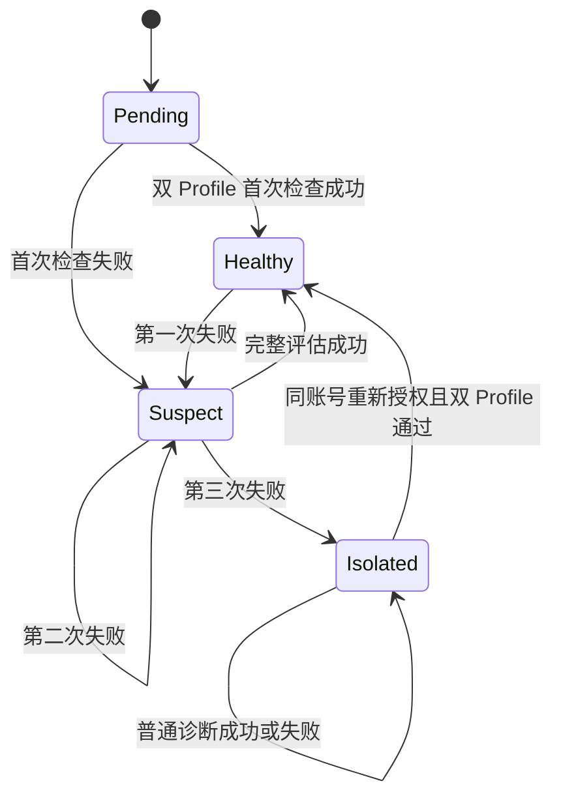
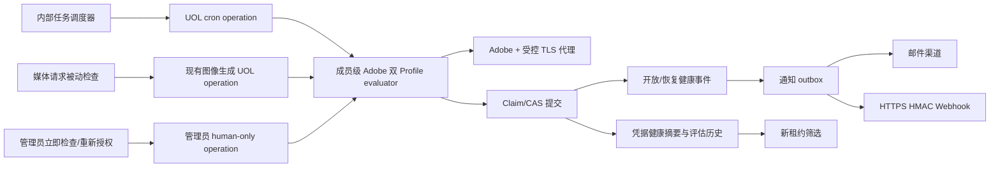
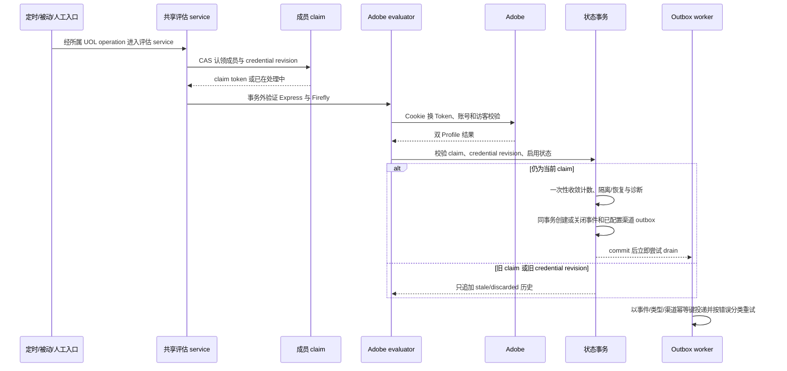
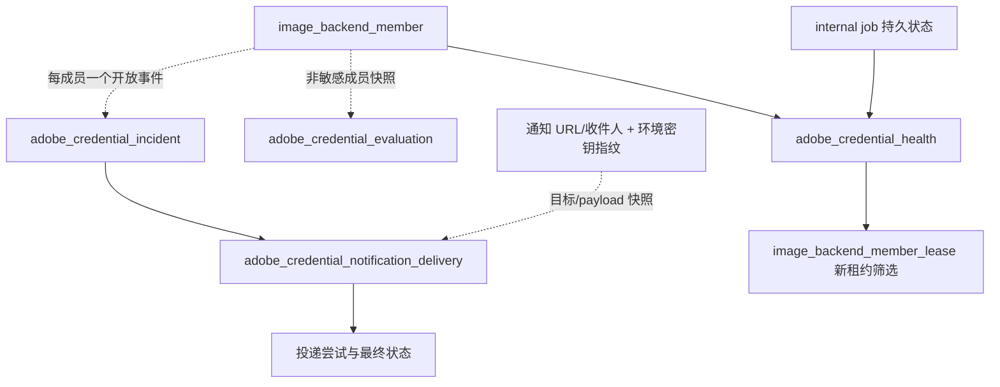

# Adobe Direct Credential Keepalive - Plan

## Goal Capsule

- **Objective:** 让管理员已启用的 Adobe direct 成员在长期没有生成请求时仍被持续验证，并在凭据不可恢复时立即隔离成员和主动告警。
- **Authority:** Product Contract 定义用户可见行为；Planning Contract 定义实现机制；现有管理员启停、号池租约和已接受视频任务恢复契约优先于本计划。
- **Execution profile:** 代码实现必须先注册 UOL operation。内部 cron operation 仅供指定系统任务调用；管理员操作使用管理员 access，并声明 `agentExposure: "human-only"`。本功能不增加 Agent、MCP 或 Agent 主动检查能力。
- **Stop conditions:** 不能保证 Adobe Cookie 永久有效；不得保存账号密码、自动浏览器登录或处理 MFA、验证码、设备验证和风控绕过。
- **Tail ownership:** 计划交给 `ce-work` 后，执行者负责按 U-ID 落地、验证和清理；本文件不记录执行进度。

---

## Product Contract

### Summary

系统主动验证每个管理员已启用 Adobe direct 成员的 Express 与 Firefly 两套凭据，并保留业务调用时的被动验证。
正常成员在上一轮评估完成 45 分钟后进入检查窗口；抖动、scanner tick、Adobe 双 Profile 请求和状态提交共享剩余 5 分钟预算，并必须在第 50 分钟前完成整轮评估。失败后分别在 5 分钟和 15 分钟后复检，连续第三次失败即进入独立的凭据隔离状态并立即提交已配置的告警渠道。
管理员重新导入同一 Adobe 账号且双 Profile 通过后，系统清除隔离并按管理员启用状态恢复调度。

### Problem Frame

现有 Adobe direct 凭据只在保存成员或业务请求需要 Token 时被验证和刷新。
当账号长期没有业务流量时，Cookie 可能已经失效，但运营人员通常要等到查看号池或下一次调用失败才发现，导致不可用成员长期静默存在。
Adobe 不向当前系统推送 Cookie 撤销事件，因此检测时效只能由主动心跳和业务调用时的被动检查共同保证。
Cookie 换短期 Token 可以维持部分会话活跃，但不是 Adobe 对网页 Cookie 生命周期的长期承诺，系统必须把重新授权作为最终恢复路径。

### Product Contract Preservation

本文件原地深化自 `docs/plans/2026-08-03-001-feat-adobe-direct-credential-keepalive-plan.md` 的 requirements-only 版本。
原有 R、A、F、AE 标识保留；新增条目只补充本轮已确认的时间、隔离、通知、脱敏、系统配置和 Agent 边界，不改变原始目标。
实现必须继续遵守 `docs/image-backend-pool-scheduling.md` 中的管理员启停、租约和已接受视频任务恢复语义。

### Key Decisions

- **验证 Express 与 Firefly 双 Profile。** (session-settled: user-approved — chosen over 只刷新 Express Token: 不同 Adobe 媒体链路依赖不同 Profile，单 Profile 成功不能证明成员完整可用。) Governs R1, R2, R4, R14。
- **连续三次失败才隔离成员。** (session-settled: user-directed — chosen over 任意单次失败即停用: 需要容忍网络、代理或 Adobe 的短暂故障。) Governs R5-R9。
- **隔离是独立凭据状态。** (session-settled: user-approved — chosen over 修改管理员 `isEnabled`: 运营侧需要区分人工停用和系统凭据故障，恢复凭据不能覆盖人工选择。) Governs R7, R16, R17, R31, R33, R34。
- **邮件与 Webhook 分渠道提交。** (session-settled: user-directed — chosen over 只使用单一告警渠道: 运营人员需要主动获知故障，单渠道故障不能阻止隔离或恢复。) Governs R10-R13, R23-R27。
- **通知配置完整才启用渠道。** (session-settled: user-approved — chosen over 部分配置也尝试投递: 缺少收件人、地址或部署密钥时应显示未配置，而不是制造虚假投递失败。) Governs R23, R24, R26。
- **告警创建后立即投递并由持久 outbox 重试。** (session-settled: user-approved — chosen over 仅由下一轮 cron 扫描: 故障通知不能等待下一次调度，同时必须跨进程保留失败投递。) Governs R10-R13, R26。
- **原始 Adobe 错误只在管理员号池页折叠展示。** (session-settled: user-approved — chosen over 仅展示抽象错误分类: 管理员需要定位问题，但下游、日志和通知不能接触未经清洗的响应。) Governs R12, R19, R28-R30。
- **不增加 Agent 逻辑。** (session-settled: user-directed — chosen over 暴露 Agent/MCP 健康操作: 本功能服务运营和内部调度，健康状态不成为 Agent 能力或下游接口。) Governs R20, R22。

### Actors

- A1. **内部任务调度器：** 在没有业务流量时周期性触发凭据健康评估，并保证多实例不会重复处理同一轮任务。
- A2. **媒体请求链路：** 在真实调用需要刷新凭据或被 Adobe 拒绝时执行被动健康评估，并复用同一故障计数与事件状态。
- A3. **管理员或运营人员：** 接收已配置的邮件与 Webhook 告警，查看脱敏故障信息，并在 Adobe 撤销会话后重新导入 Cookie。
- A4. **Adobe 与受控 TLS 代理：** 提供 Cookie 换取短期 Token、Profile 账号信息和上游错误；网络、代理或 Adobe 临时故障均可能造成一次评估失败。

### Requirements

**健康评估与调度**

- R1. 系统必须对每个由管理员启用且已配置 Adobe direct 凭据的成员验证 Express 与 Firefly 两个 Profile，任一 Profile 失败则本轮成员健康评估失败。
- R2. 主动心跳必须只执行 Cookie 换取 Token、访客状态、账号一致性及必要的凭据校验，不得提交真实图片、视频、上传素材或生成额度消耗。
- R3. 正常成员必须在上一轮评估完成 45 分钟后进入主动检查窗口；抖动、scanner tick、Adobe 双 Profile 请求和状态提交必须共同受 5 分钟总预算约束。调度器持续运行且无 backlog 时，本轮评估必须在上一轮完成后的第 50 分钟前提交；未完成即显示 overdue，不得伪造新的健康时间。
- R4. 媒体请求链路发现凭据需要刷新或被 Adobe 拒绝时，必须立即执行被动健康评估，并将结果纳入与主动心跳相同的成员健康状态。

**失败状态与隔离**

- R5. 每轮主动、被动或管理员手动健康评估最多为成员产生一次成功或失败结果；双 Profile 不得在同一轮累计两次。
- R6. 第一次评估失败后必须在 5 分钟后复检，第二次连续失败后必须在 15 分钟后复检；完整双 Profile 成功后连续失败计数归零。
- R7. 成员第三次连续健康评估失败时必须进入凭据故障隔离状态，停止获得新调度租约；隔离不得改写管理员启用选择，也不得把已接受任务切换到其他成员或重复提交。
- R8. 计入成员连续失败的原因包括 Adobe 拒绝 Cookie 或 Token、任一 Profile 失败、Adobe 超时、限流、临时错误以及已配置代理的网络或上游转发故障。
- R9. 代理未配置、数据库故障、调度器未运行、任务未认领等平台故障不得推进成员失败计数；这些情况必须显示为任务失败或探测失约。

**告警与可观测性**

- R10. 成员首次进入凭据故障隔离状态后，系统必须在该轮评估提交完成时立即尝试每个已配置的邮件和 Webhook 渠道，不等待下一次定时任务或管理页面访问。
- R11. 同一次未恢复的凭据故障只能产生一个开放告警事件和一组按渠道唯一的逻辑投递；后续心跳只更新诊断，不创建新的同类告警。物理投递采用至少一次语义，并携带稳定事件幂等标识供 Webhook/Resend 去重；SMTP 在远端已接受但本地未确认的崩溃窗口内可能重放同一逻辑事件。
- R12. 故障告警必须包含成员标识、受影响 Profile、连续失败次数、首次与最近失败时间、脱敏错误分类和重新授权入口，不得包含折叠原始错误、Cookie、Token、账号密码或未经清洗的上游响应。
- R13. 任一告警渠道失败不得阻止成员隔离或恢复；系统必须分别记录渠道配置状态、投递状态、重试次数和最终失败原因。

**重新授权与恢复**

- R14. 管理员重新导入 Cookie 时，Express 与 Firefly 必须分别返回非访客、正确 client ID 和稳定 Adobe subject/user ID；两个 ID 必须一致并等于成员已保存的不可变账号 ID。任一身份字段缺失、Profile 不可用或账号不一致时必须 fail-closed。
- R15. “重新授权”只能更新同一 Adobe 账号；换账号必须走明确的账号替换流程或新建成员，不能静默覆盖原账号。
- R16. 重新授权通过 R14 后，系统必须清除凭据故障隔离、连续失败计数和开放故障事件，并提交已配置渠道的恢复通知。
- R17. 系统只能在成员仍处于管理员启用状态时自动恢复新请求调度；管理员主动停用的成员在凭据恢复后仍保持停用。

**安全、接口与 Agent 边界**

- R18. 本功能不得接收、存储或转发 Adobe 账号密码，也不得自动处理 MFA、验证码、设备验证或其他登录挑战。
- R19. 心跳、被动检查、告警、管理读取、日志、审计和 DTO 必须保持凭据脱敏，不得扩大现有 Cookie 与 Token 的暴露范围。
- R20. Adobe 凭据健康能力必须先暴露为统一接口层 operation；内部 cron 和管理员手动入口只负责构造 Principal、调用 operation 和编码响应，媒体请求则在现有图像生成 operation 内复用同一领域评估服务，不嵌套调用 UOL 网关。
- R21. 内部定时任务必须具备跨实例互斥、持久化执行结果、成员级 claim 和探测失约可观测性；功能迁移后默认启用但继续受现有全局内部任务开关控制，任务未能按 R3 完成时不得把成员展示为刚刚健康。
- R22. 本功能不得新增 Agent、MCP operation 或 MCP transport，不向 Agent 暴露健康状态，不提供 Agent 主动检查。管理员触发的立即检查、重新授权和原始诊断读取只接受真实 `admin`/`super_admin` 用户 Principal，并声明 `agentExposure: "human-only"`；后台扫描与通知补偿只接受受信任的 job Principal。具体 operation 名称、合并或拆分方式由实施阶段结合现有绑定决定，但所有入口必须拒绝泛化 `system` Principal。

**通知配置、投递与保留**

- R23. 系统配置页必须提供通知模块，包含告警邮件收件人列表、Webhook 公网 HTTPS 地址、Webhook HMAC 部署密钥的已配置/未配置状态和每个渠道的整体配置状态；页面不得读取或写入 HMAC 密钥明文。
- R24. 邮件渠道仅在收件人列表和现有 SMTP/Resend 供应商配置完整时启用；Webhook 仅在公网 HTTPS 地址、部署环境 HMAC 密钥和 SSRF 校验均有效时启用。清空页面地址或移除部署密钥即停用渠道；首版不增加发送测试通知。
- R25. Webhook 必须验证公网 HTTPS、DNS 和私网地址并拒绝全部 3xx；使用版本化 HMAC-SHA256 协议签名稳定事件/投递 ID、UTC 时间戳与原始 UTF-8 请求体，接收方按时间窗口和 ID 拒绝重放；告警正文不得携带未经清洗的 Adobe 响应。
- R26. 通知投递必须使用持久 outbox、稳定幂等标识和分渠道投递；网络超时、限流和服务端临时错误最多重试 8 次，退避从 30 秒开始并封顶 15 分钟，明确配置或请求错误直接最终失败。
- R27. 已关闭的健康评估、故障事件和投递记录保留 90 天；未恢复的开放事件不被周期清理；成员存在期间当前健康摘要永久保留，成员删除后的非敏感历史按相同保留期处理。

**管理员界面与诊断**

- R28. 管理员号池页首屏必须突出管理员启用状态、独立凭据健康状态、隔离或 overdue 原因和当前首要动作；连续失败次数、失败 Profile、最近检查、最近成功和下次检查作为次级摘要；渠道配置、投递状态、重试记录和清洗后的 Adobe 错误放入可展开详情。页面必须提供重新授权入口和“立即检查”。
- R29. Adobe 原始错误只能在管理员号池配置页默认折叠展示；不得返回下游用户，不得进入普通 API、邮件、Webhook、日志或任务响应。
- R30. 原始错误进入管理页前必须移除 Cookie、Token、Authorization、签名密钥、代理密钥和疑似凭据，仅保留有限长度的状态码、Adobe 错误码、消息和请求标识等诊断字段。
- R31. 隔离成员仍按 45–50 分钟执行诊断探测并更新健康信息，但普通探测成功不得自动恢复，也不得创建新的故障事件或渠道投递行。
- R32. 新上线 direct 成员从“待首次检查、连续失败 0 次”开始；重新授权前发起的旧 credential revision 检查只记录 discarded 历史，不得污染当前诊断、计数、事件或新 claim。
- R33. 管理员在检查中途停用成员时，本轮只记录 discarded 历史诊断，不更新当前摘要、不推进失败计数、不隔离且不发送故障或恢复通知。
- R34. 获取新租约时必须排除凭据隔离成员；已有租约的续租和 `takeoverLease` 恢复不受隔离影响。

### Credential Health Lifecycle

管理员启用状态与凭据健康状态相互独立；下图只描述凭据健康生命周期。

### Key Flows

- F1. **主动凭据心跳**
  - **Trigger:** 成员的下一次主动检查时间到达，或隔离成员的诊断探测到期。
  - **Actors:** A1, A4
  - **Steps:** 调度器领取成员 claim；系统在事务外验证两个 Profile；提交时校验 claim、credential revision 和管理员启用状态；按 R6-R9 收敛结果；进入隔离时创建单一开放事件并立即排入通知 outbox。
  - **Outcome:** 无业务流量时成员每 45–50 分钟重新确认，平台失约则明确显示 overdue。
  - **Covered by:** R1-R3, R5-R13, R20-R22, R31-R33
- F2. **业务调用被动发现**
  - **Trigger:** 媒体请求需要刷新 Token，或 Adobe 明确拒绝当前凭据。
  - **Actors:** A2, A4
  - **Steps:** 请求链路执行现有安全刷新与有限重试；调用同一成员级评估服务；与主动检查竞争同一 claim；若本轮触发第三次失败则立即隔离并告警。
  - **Outcome:** 业务调用先于下一次心跳发现故障时，不延迟到定时任务再处理。
  - **Covered by:** R4-R13, R20, R32-R34
- F3. **管理员立即检查**
  - **Trigger:** 管理员在号池页点击“立即检查”。
  - **Actors:** A3, A4
  - **Steps:** 入口构造管理员 Principal 并调用声明 `agentExposure: "human-only"` 的管理员 operation；与定时和被动检查竞争同一 claim；返回健康摘要和清洗后的诊断；管理员停用或旧 credential revision 时只追加 discarded 诊断历史。
  - **Outcome:** 手动检查不会重复累计失败，也不会绕过启停和脱敏边界。
  - **Covered by:** R5, R9, R20, R22, R28-R33
- F4. **管理员重新授权**
  - **Trigger:** 管理员收到隔离告警并导入 Cookie。
  - **Actors:** A3, A4
  - **Steps:** 验证双 Profile 稳定 Adobe ID、访客状态、client ID 和同一账号；在同一事务中更新 credential revision、清除隔离与计数、关闭开放事件并创建恢复 outbox；按管理员启用状态决定调度资格。
  - **Outcome:** 有效 Cookie 无需额外手动启用即可恢复原有调度资格，人工停用仍被尊重。
  - **Covered by:** R14-R19, R22, R27, R32-R34
- F5. **通知配置与投递**
  - **Trigger:** 管理员在系统配置页保存通知模块，或健康事件提交后需要发送。
  - **Actors:** A1, A3
  - **Steps:** 按渠道完整性计算已配置状态；事件与投递行在同一事务创建；提交后立即 best-effort drain；失败投递由周期 worker 按幂等键和退避重试。
  - **Outcome:** 未配置渠道不产生虚假失败，单渠道故障不影响成员状态，投递结果可追溯。
  - **Covered by:** R10-R13, R23-R27

### Acceptance Examples

- AE1. **Covers R1-R3, R23-R26.** Given 一个已启用且通知未配置的 Adobe direct 成员连续 45–50 分钟没有业务调用，when 心跳到期，then 系统完成 Express 与 Firefly 双 Profile 验证且不产生任何媒体任务。
- AE2. **Covers R5-R9, R19.** Given 成员第一次评估失败，when 结果提交，then 系统安排 5 分钟后复检并显示待确认故障，平台故障不会推进成员计数。
- AE3. **Covers R5-R9, R19.** Given 成员已有一次连续失败，when 第二轮仍因 Adobe 临时错误失败，then 系统安排 15 分钟后复检并保持新租约资格。
- AE4. **Covers R6-R13, R22, R26.** Given 成员已有两次连续失败，when 第三轮双 Profile 验证失败，then 成员停止获得新租约、创建一个开放事件并立即分别尝试每个已配置渠道。
- AE5. **Covers R4-R13, R31.** Given 成员已有两次连续失败且下一次心跳尚未开始，when 业务调用执行被动评估并失败，then 该调用触发第三次失败、成员隔离和即时告警，后续心跳不创建新的故障事件或渠道投递记录。
- AE6. **Covers R10-R13, R23-R26.** Given Webhook 地址校验失败或投递返回临时错误，when 成员进入隔离，then 成员仍被隔离，邮件独立提交，Webhook 按规则重试或最终失败并留下脱敏记录。
- AE7. **Covers R14-R17, R22, R27.** Given 系统隔离但管理员仍启用的成员，when 新 Cookie 的双 Profile 稳定 Adobe ID 均存在、一致且匹配原成员，then 系统清除故障、关闭开放事件、恢复调度资格并提交一次恢复通知。
- AE8. **Covers R14-R17.** Given 系统隔离且管理员已主动停用的成员，when 新 Cookie 通过双 Profile 验证，then 凭据恢复但成员仍不参与调度。
- AE9. **Covers R12, R18-R19, R29-R30.** Given 管理员查看号池、审计或告警记录，when 检查本次心跳产生的数据，then 只有管理员号池页折叠展示清洗后的原始错误，其他界面、日志、邮件和 Webhook 均不包含 Cookie、Token 或 Adobe 密码。
- AE10. **Covers R3, R9, R21, R31.** Given 心跳任务因调度器或数据库故障超过 50 分钟未完成，when 管理员查看运行状态或运维监控处理任务失约，then 系统显示 overdue，不把未检查成员展示为刚刚健康。
- AE11. **Covers R5, R20, R32.** Given 定时、被动和管理员检查同时触发同一成员，when 其中一个 claim 已提交结果，then 其他旧 claim 结果被丢弃且成员只累计一次。
- AE12. **Covers R14-R16, R32.** Given 旧 Cookie 检查在管理员重新授权后才返回，when 系统提交该旧结果，then 结果被标记为过期并不改变新凭据的健康状态。
- AE13. **Covers R22-R27.** Given 邮件收件人、Webhook 地址或部署环境 HMAC 密钥缺失，when 管理员查看或保存通知设置，then 对应渠道显示未配置且事件不会生成该渠道的失败投递。
- AE14. **Covers R22, R25-R26.** Given Webhook 为公网 HTTPS 且配置完整，when 告警投递，then 请求通过 DNS 与私网校验、拒绝重定向并使用版本、事件/投递 ID、时间戳和原始请求体的 HMAC-SHA256 签名；临时错误最多重试 8 次。

### Success Criteria

- 所有管理员已启用且有凭据的 Adobe direct 成员在没有业务流量时按 45–50 分钟窗口完成健康评估，或明确暴露任务失约。
- 凭据故障在第三次连续计入失败的评估提交时立即隔离，并为每个已配置渠道留下可追溯投递状态。
- 同一未恢复故障只产生一个开放事件；重新授权成功后关闭该事件并提交一次恢复通知。
- 保活流程不产生图片、视频、上传素材或 Adobe 生成额度消耗，也不引入账号密码托管、浏览器自动登录或 Agent 能力。

### Scope Boundaries

- 不保证 Adobe Cookie 永久有效；Adobe 主动撤销会话、要求重新登录或触发登录挑战时，由管理员重新授权。
- 不新增 Adobe 账号密码字段，不运行自动化浏览器，不绕过 MFA、验证码、设备验证或风控。
- 不使用真实图片或视频生成作为心跳探针，不改变媒体计费、积分账本或生成管线。
- 不改变管理员主动启停语义，不让隔离恢复覆盖人工停用选择。
- 不改变已接受 Adobe 视频任务绑定原成员、禁止切号重投的既有恢复规则。
- 不新增 Agent、MCP 工具、下游健康查询或 Agent 主动检查；系统内部 cron 仍可调用受限 operation。
- 原始 Adobe 错误不返回下游用户，不进入普通 API、邮件、Webhook、日志或任务响应。

#### Deferred for later

- 账号密码托管、自动浏览器登录、MFA/验证码/设备验证和风控流程。
- Adobe 官方 OAuth `authorization_code`/`offline_access` 集成或 Server-to-Server 替代方案；本期只记录其作为长期演进方向。

#### Deferred to Follow-Up Work

- 多区域调度、跨区域通知路由和通知渠道的管理员自助测试。
- 基于历史健康数据的预测性失效评分和自动更换账号建议。
- 细粒度的租约优先级重排；本期只在新租约选择处排除凭据隔离成员。

### Dependencies / Assumptions

- Cookie 换取短期 Token 能证明当前会话可恢复工作，但不等价于 Adobe 承诺延长 Cookie 生命周期。
- 邮件复用现有 SMTP/Resend 配置；通知模块只保存收件人列表和 Webhook 地址，HMAC 密钥仅存在 `.env.local` 或部署环境，不保存任何 Adobe 登录机密。
- Adobe direct 请求继续依赖现有受控 TLS 代理及其主机白名单、共享密钥和无会话转发边界。
- 多实例部署继续以数据库锁和持久化任务状态作为心跳去重与可追溯事实，不能只依赖进程内计时器。
- 数据库迁移 `0080` 采用手写幂等 SQL，并手动登记 `packages/database/drizzle/meta/_journal.json`。

### Outstanding Questions

**Resolved during planning**

- 心跳、复检、隔离、通知、恢复、原始错误展示和 Agent 边界均由本 Product Contract 定义，不再作为实现阻塞项。

**Deferred to implementation**

- 新表的最终列名、索引命名和 Drizzle 类型映射，以 `packages/database/src/schema.ts` 现有命名和实际迁移校验为准。
- Profile HTTP 客户端的超时、响应截断长度和 Adobe 错误码映射，以现有 Adobe transport 响应和测试夹具校准。
- 单次 cron 批量大小与 worker 并发度，以部署容量和数据库锁等待指标验证；不能改变 R3 的窗口。

### Sources / Research

- 本地：`tools/adobe-cookie-exporter/README.md`、`packages/shared/src/adobe/firefly-direct/auth.ts`、`apps/web/src/features/image-generation/adobe-direct.ts`、`apps/web/src/features/image-generation/adobe-auth-retry.ts`。
- 本地：`packages/database/src/schema.ts`、`apps/web/src/server/internal-job-scheduler.ts`、`apps/web/src/features/image-backend-pool/repository.ts`、`apps/web/src/features/image-generation/video-callback-delivery.ts`、`apps/web/src/features/external-api/safe-image-fetch.ts`。
- 本地：`packages/shared/src/mail/*`、`packages/shared/src/system-settings/*`、`packages/shared/src/uol/*`、`docs/image-backend-pool-scheduling.md`。
- Adobe User Authentication：<https://developer.adobe.com/developer-console/docs/guides/authentication/UserAuthentication/>。官方长期刷新依赖 OAuth authorization code、`offline_access` 和 refresh token；网页 Cookie 换 Token 不是稳定长期集成契约。
- Adobe Server-to-Server Authentication：<https://developer.adobe.com/developer-console/docs/guides/authentication/ServerToServerAuthentication/>。适用于应用或组织数据，不是当前个人网页会话的直接替代。
- AWS Transactional Outbox：<https://docs.aws.amazon.com/prescriptive-guidance/latest/cloud-design-patterns/transactional-outbox.html>。状态变更与事件同事务，投递按至少一次处理并要求幂等。
- OWASP SSRF Prevention：<https://cheatsheetseries.owasp.org/cheatsheets/Server_Side_Request_Forgery_Prevention_Cheat_Sheet.html>。Webhook 目标必须阻止私网、防 DNS rebinding，并禁止未受控重定向。
- RFC 2104：<https://www.rfc-editor.org/rfc/rfc2104.txt>。Webhook 签名使用 HMAC。
- Resend Idempotency Keys：<https://resend.com/docs/dashboard/emails/idempotency-keys.md>；Resend Rate Limits：<https://resend.com/docs/api-reference/rate-limit.md>。邮件投递需使用幂等键并处理 429/`Retry-After`。

---

## Planning Contract

### Key Technical Decisions

- KTD1. **增加 direct 凭据健康投影和权威 revision。** 在 `imageBackendMember.isEnabled`、现有运行时 `healthStatus` 和双 Profile 诊断字段之外，新增独立健康摘要、下一次检查、连续失败、隔离时间、credential revision 和 claim 字段。所有 Cookie、账号身份和 Adobe 模式写入口必须在同一事务中递增 revision：进入 direct 时建立或重置摘要，离开 direct 时失效 claim 并停止健康调度。这样系统隔离不会改写管理员选择，也不会让已切换为 gateway/API 的成员残留 direct 隔离。 (session-settled: user-approved — chosen over 复用 `healthStatus` 或双 Profile 失败字段: 现有字段粒度不足以表达成员级生命周期。)
- KTD2. **评估采用稳定 evaluation/claim ID + CAS。** 主动、被动和人工评估先认领成员，再在事务外调用 Adobe。接受结果时必须匹配当前 claim token、credential revision 和管理员启用状态，并在同一事务插入唯一评估历史、更新摘要、事件和 outbox；旧 claimant 不得清除新 claim。过期、旧 revision 或停用后的结果只写入带原因的 `stale`/`discarded` 历史，不修改当前诊断、计数或事件。
- KTD3. **所有入口复用一个领域评估器。** cron 和管理员入口通过各自 UOL operation 进入评估器；媒体请求在现有图像生成 operation 内直接复用评估 service。双 Profile 调用、失败分类、清洗和状态机集中在该 service，避免入口之间出现不同计数语义和嵌套 UOL 调用。
- KTD4. **迁移使用手写 `0080` 幂等 SQL和 fail-closed 形态校验。** 用成员健康摘要、评估历史、开放故障事件和通知 outbox/投递表承载生命周期；回填只覆盖 Adobe `direct` 配置。迁移参照 `0077_api_upstream_adapter_versions.sql` 的 `IF NOT EXISTS` 与半迁移形态校验，并单调登记 Drizzle journal。应用回滚保留 additive schema 和已产生数据；破坏性 down 只允许停机且确认无保留数据后执行。
- KTD5. **隔离与至少一次 outbox 在同一事务提交。** 第三次失败或恢复时，状态变更、开放/关闭事件和已配置渠道的投递行一起提交。数据库唯一约束与 `SKIP LOCKED` 只保证单次并发认领；提交后立即 best-effort drain，周期 worker 以稳定事件/渠道幂等标识恢复投递。Webhook 和 Resend 传递幂等键；SMTP 明确保留远端已接受但本地未确认时的重放风险。
- KTD6. **Webhook 复用网络校验但拒绝重定向。** 保存配置和每次发送都验证公网 HTTPS、DNS pin、IPv4/IPv6 保留地址和私网阻断；认证 POST 默认拒绝全部 3xx，避免把签名正文转发给第三方。签名协议固定版本、字段分隔、UTC 时间单位和原始 UTF-8 字节，覆盖事件 ID、投递 ID、时间戳与请求体；每次重试刷新时间戳，接收方在有限时间窗口内按稳定 ID 去重。
- KTD7. **权限按真实角色和 job 收口，但不冻结 operation 形态。** 管理员触发的检查、重新授权和原始诊断能力使用 `{ kind: "roles", roles: ["admin", "super_admin"] }`，并声明 `agentExposure: "human-only"`；后台扫描与通知补偿使用 job-scoped access。具体 operation 名称和拆分数量留给实施阶段，但两类 access 都拒绝 `observer_admin`、API key、任意 `system` Principal 和错误 job。`agentExposure` 只控制 Agent/MCP 投影，不能代替 `invokeOperation()` 的运行时鉴权；本功能不注册 MCP 工具。
- KTD8. **隔离只影响新租约。** 新租约查询排除凭据隔离成员，但已有 lease 的续租和 `takeoverLease` 恢复继续绑定原成员；这保持已接受视频任务不切号、不重投。
- KTD9. **在 Adobe transport/auth 边界生成 allowlist 诊断。** 完整响应、headers、`raw` token 数据、Error `message`/`cause` 和 stack 不得越过 transport/auth 边界；只构造严格 Zod allowlist 的状态码、Adobe 错误码、有限消息和可信 request ID。通用 `pool.getAdminPool` 不返回该诊断或本功能新增的健康摘要，并保留既有 Admin MCP 管理能力；管理员页面通过单独的管理员 access、`agentExposure: "human-only"` 详情 operation 获取健康摘要和有限长度的折叠诊断。日志、监控、MCP、通知和任务响应均不得接触上游原文。
- KTD10. **页面配置与部署密钥分离。** 邮件收件人列表和 Webhook URL 标记 `managedByDedicatedOperation`，只能由 super-admin、`agentExposure: "human-only"` 的专用 operation 原子校验和写入。HMAC 密钥只从 `.env.local` 或部署环境的 `ADOBE_CREDENTIAL_WEBHOOK_HMAC_SECRET` 读取，至少 256 bit；管理快照只返回配置状态。Webhook `configured` 由 URL、密钥和 SSRF 校验共同决定，未配置渠道不生成投递失败行；首版不提供测试通知入口。
- KTD11. **50 分钟约束整轮完成而非只约束开始。** 每个成员保存 `nextCheckAt`、`evaluationDeadlineAt`、`lastCheckAt` 和 `lastSuccessAt`。上一轮完成 45 分钟后进入检查窗口；scanner cadence、随机抖动、双 Profile 传输硬超时和数据库提交保护时间之和不得超过 5 分钟。实施时根据现有 15–30 秒 Adobe 单请求超时确定成员级评估预算，再把剩余时间分配给抖动；不得直接使用完整 5 分钟抖动。评估携带 deadline/AbortSignal，未在第 50 分钟前提交则显示 overdue，且不推进健康时间。隔离后继续探测诊断，但成功不自动恢复。
- KTD12. **当前摘要与可保留历史分离。** 当前健康摘要作为成员的一对一子表随成员删除；评估、事件和投递保存非敏感成员快照，不因成员删除级联丢失。已关闭历史和终态投递保留至少 90 天，开放事件、未终态 outbox 和当前摘要不被周期清理。成员删除事务把开放事件以管理删除原因关闭并取消未开始投递；清理按子记录到父记录的顺序批量、可重入执行。应用回滚保留新表，清理回滚只停 job，不恢复已删除历史。
- KTD13. **每条投递使用不可变 envelope。** outbox 固定保存目标快照、规范化 payload 或版本/哈希、事件/渠道幂等键和配置 revision；Webhook revision 包含 URL revision 与部署密钥的不可逆指纹，不保存密钥。通知配置变更只影响新事件；若当前 revision 与 pending delivery 不同，旧 pending 行进入 `configuration_superseded` 最终状态，不改投新目标。这样无需复制旧 HMAC 明文，也不会把历史事件发送给新接收方。

### High-Level Technical Design

以下图示表达本计划的权威组件关系、并发提交边界和持久数据关系。

#### Component flow

#### Concurrent evaluation and notification sequence

#### Persistent data relationship

提交不变量：Adobe 网络调用不在数据库事务内；每个 claim 最多接受一条评估；状态提交必须由 claim、credential revision 和管理员启用状态保护；每成员最多一个开放事件；每个事件的 `event type × channel` 最多一条投递；隔离/恢复与 outbox 在同一事务；租约选择只读健康隔离标志。

### Assumptions

- Adobe 两个 Profile 的现有客户端可以提供有限长度的状态码、错误码、消息和请求标识，且不要求真实媒体请求即可完成验证。
- 现有内部任务调度器可以承载一个成员扫描 job，并复用 advisory lock、持久 job 状态和 overdue 诊断。
- 现有邮件客户端可以在运行时读取 SMTP/Resend 配置；通知模块无需新增邮件供应商。
- 运营侧接受首次上线时所有成员从待首次检查状态重新建立健康摘要，不沿用旧 Profile 失败计数。

### Sequencing and Dependencies

执行顺序为 U1 → U2 → U3 → U4 → U5 → U6。
U1 建立数据和 UOL 契约；U2 建立可独立测试的状态机和评估器；U3 依赖健康事件并提供可靠通知；U4 接入所有检查入口和租约；U5 接入同账号恢复；U6 完成管理界面、系统配置和运维文档。

### System-Wide Impact

- **数据层：** 新增成员健康摘要、评估历史、单一开放事件和按渠道投递记录；当前摘要使用成员外键，历史表保留可选成员关联与非敏感成员快照，并建立时间索引和唯一幂等约束。
- **调度层：** 新 job 受现有全局内部任务开关控制；多实例使用数据库锁和成员 claim；调度关闭或失约时显示 overdue。
- **媒体层：** 被动评估嵌入现有 `runImageGenerationForUser` 汇入的 Adobe direct 路径；新租约排除隔离成员，续租和 takeover 不变。
- **权限层：** UOL 网关成为鉴权、能力、审计和错误映射的唯一入口；cron job 不能被普通 API、MCP 或 Agent 伪造。
- **通知层：** 领域状态和渠道投递解耦；邮件和 Webhook 各自配置、签名、重试和最终失败状态。
- **隐私层：** Adobe 上游错误先分类和清洗；管理页折叠摘要是唯一可见原始错误投影，其他下游和观测面不接触该字段。

### Risk Analysis and Mitigation

- **Cookie 生命周期不受系统控制。** 以“探测并快速发现”为承诺，不宣传永久保活；隔离告警引导管理员重新授权。
- **Adobe 外部契约变更。** 保留 Express/Firefly 客户端的错误码夹具、超时和失败分类测试；无法识别的响应默认归入可重试临时错误并保留有限诊断。
- **并发或旧凭据结果污染新状态。** 使用稳定 evaluation/claim ID、CAS、credential revision 和管理员启用状态校验；增加 claim 超时重领、晚到结果、定时/被动/人工并发和重新授权竞态测试。
- **通用成员编辑绕过 credential revision。** Cookie、账号身份、Adobe 配置删除和 direct/gateway/API 模式切换统一进入同一 revision 事务；离开 direct 立即失效旧 claim 和当前调度资格。
- **Webhook SSRF、DNS rebinding、重定向或重放。** 保存配置和发送时均做公网 HTTPS、DNS pin、IPv4/IPv6 私网与保留段阻断；认证 POST 拒绝全部 3xx。版本化 HMAC 覆盖稳定 ID、时间戳和原始字节，响应体、总时长和读取量均受限。
- **通知重复或丢失。** 事件与投递行同事务创建，使用稳定事件/渠道幂等键；即时 drain 失败由最多 8 次的持久重试补偿。Webhook 与 Resend 依赖幂等键去重；SMTP 的 ACK 崩溃窗口可能重放同一逻辑事件，运维界面必须显示同一事件标识和尝试记录。
- **迁移破坏既有号池。** 迁移只增加可空或带默认值的列和新表；旧成员显式初始化为待首次检查；在测试库和已有数据快照上验证回滚前置条件。
- **成员删除级联丢失 90 天历史。** 当前摘要随成员删除，历史表保存非敏感成员快照；删除事务关闭开放 incident 并取消未开始投递，周期清理再按终态时间和依赖顺序删除。
- **心跳规模导致上游限流。** 以成员级抖动、批量上限和持久 claim 控制并发；监控 Adobe 响应延迟、429、任务 backlog 和 overdue。
- **诊断泄露凭据。** 稳定错误字段与管理员折叠摘要分离；清洗器只输出严格字段 allowlist，并拒绝允许字段中命中疑似凭据模式的内容，同时限制字段长度。
- **通知配置部分更新或 HMAC 密钥泄露。** 收件人和 URL 设为专用管理项，只允许 super-admin human-only operation 原子写入；HMAC 只从 `.env.local` 或部署环境读取。数据库、备份、管理快照、审计和组件永不保存或返回密钥明文。

### Documentation and Operational Notes

- 新增 `docs/adobe-direct-credential-health.md`，记录状态含义、失败分类、通知配置完整性、重试策略、重新授权、overdue 排查和日志脱敏规则。
- 系统设置页新增通知模块；管理员号池页新增健康摘要、折叠 Adobe 错误、立即检查和重新授权入口。
- 上线迁移默认开启功能，但仍受现有全局内部任务调度开关控制；上线前确认邮件/Webhook 配置为空时不会产生失败告警。
- 运营监控至少记录健康评估成功率、隔离成员数、overdue 数、outbox backlog、每渠道最终失败数和 Adobe 429/超时数。
- 健康评估、关闭事件和投递历史的 90 天清理纳入现有维护任务；开放事件和当前摘要不可清理。

---

## Implementation Units

### U1. 建立健康域数据、迁移和 UOL 契约

- **Goal:** 为成员健康摘要、评估历史、故障事件、通知投递和受限 operation 建立可持久化且可追踪的契约。
- **Requirements:** R17, R20-R27, R32。
- **Technical decisions:** KTD1, KTD4, KTD7, KTD10, KTD12, KTD13。
- **Dependencies:** 无。
- **Files:**
  - `packages/database/src/schema.ts`
  - `packages/database/drizzle/0080_adobe_credential_health.sql`
  - `packages/database/drizzle/meta/_journal.json`
  - `packages/integration-tests/src/media-backend-pool-migration.test.ts`
  - `packages/shared/src/system-settings/definitions.ts`
  - `packages/shared/src/system-settings/defaults.test.ts`
  - `.env.example`
  - `.env.docker.example`
  - `deploy/.env.example`
  - `packages/shared/src/uol/access.ts`
  - `packages/shared/src/uol/tests/access.test.ts`
  - `packages/shared/src/uol/types.ts`
  - `packages/shared/src/uol/operations/adobe-credential-health.ts`
  - `packages/shared/src/uol/operations/adobe-credential-health.test.ts`
  - `packages/shared/src/uol/operations/image-backend-pool.ts`
  - `packages/shared/src/uol/operations/image-backend-pool.test.ts`
  - `packages/shared/src/uol/operations/index.ts`
- **Approach:**
  1. 增加 direct 成员健康摘要、评估历史、开放事件和按渠道投递的 Drizzle 表、枚举、索引和唯一约束；当前摘要随成员级联，历史保存非敏感成员快照。
  2. 为摘要保存 credential revision、当前 claim token/过期时间、检查时间、失败计数、失败 Profile、隔离时间和 overdue 所需时间戳；评估表以稳定 claim/evaluation ID 唯一，并记录 accepted、stale 或 discarded disposition。
  3. 为每成员开放 incident 建偏唯一索引；投递使用 `(incident, event type, channel)` 唯一约束，并保存不可变目标/payload/config revision envelope、尝试次数、下次尝试时间和最终错误分类。
  4. 参照 `0077_api_upstream_adapter_versions.sql` 手写可重入 `0080`，验证半迁移形态并手动登记 journal；只为既有 Adobe direct 配置初始化待首次检查、credential revision 和连续失败 0 次。
  5. 为后台扫描/通知补偿、管理员立即检查/重新授权和 browser-only 诊断读取注册必要的 UOL 输入输出契约；operation 可按现有绑定合并或拆分，不在计划中冻结名称。job access 限制受信任任务，管理员写入和原始诊断只接受 `admin`/`super_admin` 真实用户并声明 `agentExposure: "human-only"`，所有操作拒绝泛化 `system` Principal，且不注册 MCP 工具或传输。
  6. 增加邮件收件人和 Webhook URL 设置键，标记 `managedByDedicatedOperation` 并由专用 super-admin operation 原子写入；HMAC 密钥只定义环境变量契约和最小强度，不写 `system_setting`，读取 DTO 只返回配置状态。
  7. 从通用 `pool.getAdminPool` 输出移除现有 Adobe refresh error 以及本功能新增的全部凭据健康摘要和诊断字段；管理员页面只通过 `agentExposure: "human-only"` 的详情 operation 获取健康摘要与折叠诊断，既有 Admin MCP 的其他号池能力保持不变。
- **Patterns to follow:** `packages/database/drizzle/0077_api_upstream_adapter_versions.sql` 的 `IF NOT EXISTS`、半迁移形态校验和 journal；`packages/integration-tests/src/media-backend-pool-migration.test.ts` 的真实 PostgreSQL 迁移验证；`packages/shared/src/uol/operations/image-backend-pool.ts` 的契约与 late binding；`packages/shared/src/system-settings/definitions.ts` 的设置定义。
- **Test scenarios:**
  - 空库和混合 API、Adobe gateway、Adobe direct 成员数据执行迁移后，只为 direct 成员建立待首次检查摘要，且所有原 Cookie/Profile 字段逐值不变。
  - 完整重复执行迁移 SQL 后 schema 等价；故意缺少列、索引或约束的半迁移库 fail-closed，不以不完整形态继续启动。
  - journal 从 `0079` 单调追加 `0080`；应用版本回滚后旧代码仍能忽略 additive schema 并正常运行，不执行破坏性 down。
  - 注册表拒绝重复 operation 名称；cron operation 拒绝未匹配 job 和任意 `system` Principal；管理员 operation 拒绝 `observer_admin`、API key、cron、system 和普通用户，并保持 `agentExposure: "human-only"`。
  - 通知设置只接受合法收件人列表和 HTTPS URL；数据库、备份样例、管理快照、审计和 DTO 均不出现 HMAC 明文。
  - HMAC 部署密钥缺失或弱于 256 bit 时 Webhook 显示未配置；页面空输入不能覆盖部署密钥，移除环境变量具有明确停用语义。
  - 并发第三次失败最多创建一个开放 incident；故障和恢复允许同渠道各一条投递，但相同 `(incident, event type, channel)` 冲突回读权威行。
  - 同一 claim 重放只产生一条评估历史；旧 claimant 不能清除或覆盖新 claim。
- **Verification:** schema 类型、迁移 journal、UOL registry/access 测试能在无运行时网络的情况下通过；数据库约束可在空库和已有成员数据上重复应用。

### U2. 实现成员级状态机与双 Profile 评估器

- **Goal:** 在事务外完成 Express/Firefly 验证，并以确定性的失败分类、claim/CAS 和版本校验收敛成员状态。
- **Requirements:** R1-R9, R14-R16, R19, R27, R31-R33。
- **Technical decisions:** KTD1-KTD3, KTD9, KTD11。
- **Dependencies:** U1。
- **Files:**
  - `apps/web/src/features/image-generation/adobe-credential-health.ts`
  - `apps/web/src/features/image-generation/adobe-credential-health-policy.ts`
  - `apps/web/src/features/image-generation/adobe-credential-health.test.ts`
  - `apps/web/src/features/image-generation/adobe-credential-health-policy.test.ts`
  - `apps/web/src/features/image-generation/adobe-direct.ts`
  - `apps/web/src/features/image-generation/adobe-auth-retry.ts`
  - `packages/shared/src/adobe/firefly-direct/transport.ts`
  - `packages/shared/src/adobe/firefly-direct/transport.test.ts`
  - `packages/shared/src/adobe/firefly-direct/auth.ts`
  - `packages/shared/src/adobe/firefly-direct/auth.test.ts`
  - `packages/shared/src/adobe/firefly-direct/errors.ts`
  - `packages/shared/src/adobe/firefly-direct/errors.test.ts`
- **Execution note:** 先为失败分类、计数和状态转移补纯函数测试，再接入 Adobe 客户端和数据库提交，以便并发规则有独立复现样例。
- **Approach:**
  1. 抽取成员级评估输入、Profile 结果、失败分类、严格 allowlist 诊断和评估来源类型；transport/auth 在构造 Error、日志或领域结果前丢弃完整响应与 token-bearing `raw` 数据。
  2. 将第一次失败安排 5 分钟复检、第二次失败安排 15 分钟复检；第三次失败进入隔离，普通周期回到 45–50 分钟。
  3. 只将 R8 的成员故障分类计入连续失败；平台故障返回任务失败或探测失约，不修改成员计数。
  4. 通过稳定 evaluation/claim ID、credential revision 和 CAS 提交保证同一轮最多一次 accepted 结果；stale/discarded 结果只追加有限历史，不能更新当前诊断、释放新 claim、推进计数或创建事件。
  5. 把隔离状态与 `isEnabled`、运行时 `healthStatus` 分开；隔离后的普通探测只更新诊断，不自动恢复。
  6. 把双 Profile 稳定 Adobe subject ID、client ID、访客状态和短期 Token 检查复用现有 `adobe-direct.ts` 与 `adobe-auth-retry.ts` 的客户端边界，不发起真实媒体请求；email/displayName 只用于展示，不能证明账号一致性。
- **Patterns to follow:** `apps/web/src/features/image-generation/adobe-direct.ts` 的按 Profile 刷新与账号一致性；`apps/web/src/features/image-generation/adobe-auth-retry.ts` 的有限重试；现有 repository 的事务和 CAS 更新风格。
- **Test scenarios:**
  - Express 和 Firefly 都成功时返回一次健康成功，失败 Profile 列表为空且计数归零。
  - 任一 Profile 失败时整轮只增加一次成员失败；两 Profile 同时失败不会增加两次。
  - 第一次、第二次、第三次失败分别产生 5 分钟、15 分钟复检和隔离结果；完整成功清零计数。
  - Adobe 拒绝、超时、限流、临时错误和已配置代理故障计入失败；未配置代理、数据库故障、未认领任务不计入失败。
  - 定时、被动和人工评估并发竞争同一成员时，只有一个 claim 能提交 accepted 结果，同 claim 请求重放只产生一条历史。
  - claim 超时后 B 重认领并先提交时，晚到的 A 只写 stale 历史，不能清除 B 的 claim 或覆盖当前摘要。
  - credential revision 在外部调用期间变化时，旧结果只写 discarded 历史；管理员停用在提交前发生时只保留历史诊断，不计数、不隔离、不通知。
  - 接受结果的事务在插入评估、更新摘要、事件或 outbox 任一步失败时全部回滚，claim 可按过期策略安全恢复。
  - 隔离成员的普通探测成功不恢复、不创建恢复事件，且仍更新最近检查和失败 Profile 诊断。
  - 新成员以待首次检查和失败计数 0 开始，不沿用旧 Profile 失败字段。
  - 恶意上游把 Cookie、Bearer Token、代理/HMAC 密钥放入正文、header、嵌套 JSON、编码文本或 Error cause 时，数据库、Pino/Axiom、Sentry/console、DTO、邮件、Webhook 和任务响应均无泄露。
  - 输出 schema 拒绝额外 `raw`、token、cookie、authorization 字段；未知上游响应只保留稳定分类、状态码和可信 request ID。
- **Verification:** policy 测试覆盖所有状态转移和分类；评估器测试证明外部调用在事务外、提交受 evaluation/claim ID、credential revision 和 CAS 保护，并只返回 allowlist 管理诊断 DTO。

### U3. 实现故障事件、邮件/Webhook outbox 与安全投递

- **Goal:** 将隔离/恢复事件与分渠道通知可靠、幂等且可安全投递，并提供脱敏的最终状态。
- **Requirements:** R10-R13, R19, R22-R27, R29-R30。
- **Technical decisions:** KTD5, KTD6, KTD9, KTD10, KTD12, KTD13。
- **Dependencies:** U1, U2。
- **Files:**
  - `apps/web/src/features/image-generation/adobe-credential-notifications.ts`
  - `apps/web/src/features/image-generation/adobe-credential-notifications.test.ts`
  - `apps/web/src/features/image-generation/adobe-credential-webhook.ts`
  - `apps/web/src/features/image-generation/adobe-credential-webhook.test.ts`
  - `apps/web/src/features/image-generation/adobe-credential-retention.ts`
  - `apps/web/src/features/image-generation/adobe-credential-retention.test.ts`
  - `apps/web/src/features/external-api/safe-image-fetch.ts`
  - `apps/web/src/features/external-api/safe-image-fetch.test.ts`
  - `packages/shared/src/mail/client.ts`
  - `packages/shared/src/mail/client.test.ts`
- **Approach:**
  1. 第三次失败时创建或复用单一开放 incident，恢复时关闭同一 incident；两种状态变更都只为该 incident 按 `(event type, channel)` 创建对应 outbox 投递行，不创建第二个恢复 incident。投递使用稳定幂等键，并固化目标、规范化 payload 版本/哈希和配置 revision。
  2. commit 后立即执行 best-effort drain；worker 以 `SKIP LOCKED` 单次认领到期投递，按临时错误、限流和明确配置错误分类。投递语义为至少一次，Webhook/Resend 传递稳定幂等键，SMTP 保留同一事件重放记录。
  3. 临时错误最多重试 8 次，退避从 30 秒开始并封顶 15 分钟；最终失败不回滚成员隔离或恢复。
  4. 邮件复用现有 SMTP/Resend 动态客户端和幂等能力；未配置收件人不生成投递行。
  5. Webhook 保存和发送时均验证公网 HTTPS、DNS 和私网阻断，认证请求默认拒绝全部 3xx；以版本、事件 ID、投递 ID、UTC 时间戳和原始 UTF-8 请求体的无歧义串计算 HMAC-SHA256，每次尝试刷新时间戳并保持事件/投递 ID 稳定。
  6. 通知 payload 只使用稳定错误分类和清洗字段；原始 Adobe 错误不进入邮件、Webhook、日志或任务响应。
  7. 提供批量、可重入的 90 天历史清理 service；只删除已关闭且过期的评估、事件和投递，保留开放事件、其必要投递和当前成员摘要。
- **Patterns to follow:** `apps/web/src/features/image-generation/video-callback-delivery.ts` 的 claim TTL、`SKIP LOCKED`、稳定幂等键和至少一次有限重试；`apps/web/src/features/external-api/safe-image-fetch.ts` 的公网 HTTPS、DNS pin 和私网阻断，Webhook POST 在此基础上采用更严格的禁止重定向；`packages/shared/src/mail/*` 的 SMTP/Resend 动态配置。
- **Test scenarios:**
  - 隔离事务只创建一个开放事件，并为邮件/Webhook 各生成至多一条逻辑投递行；重复提交返回同一幂等结果。
  - 邮件未配置、Webhook 未配置和单渠道配置时，未配置渠道显示未配置且不产生该渠道失败记录。
  - 邮件或 Webhook 临时超时、429、`Retry-After` 和服务端错误按 30 秒起步、15 分钟封顶且最多 8 次重试；明确配置错误直接最终失败。
  - 邮件投递失败时成员仍隔离，Webhook 独立成功；Webhook 失败不阻止邮件和恢复事务。
  - Webhook 拒绝非 HTTPS、私网 IP、解析到私网的域名、DNS rebinding 和未复检的重定向；公网目标收到可验证的 HMAC-SHA256 签名。
  - Webhook 3xx 不转发签名头或正文；过期时间戳、错误协议版本、正文单字节变化和错误密钥均无法验签，接收方按事件/投递 ID 幂等收敛重放。
  - Webhook 巨大响应或不结束的响应在固定上限终止并释放资源；重试使用新时间戳但保持同一事件/投递 ID。
  - 通知和投递日志不包含 Cookie、Token、Authorization、密码、签名密钥、代理密钥或未经清洗的 Adobe 响应。
  - Webhook/Resend 重试始终携带相同事件/渠道幂等键；模拟“远端接受后进程崩溃”时只允许重放同一逻辑事件，不承诺 SMTP 物理去重。
  - 恢复事件只提交一次；未恢复开放事件的后续诊断不创建新的告警事件或渠道投递行。
  - 重试期间修改收件人、Webhook URL、轮换/清空密钥时，既有 envelope 不改投新目标；配置 revision 不匹配的 pending Webhook 进入 `configuration_superseded`，相同幂等键绑定不同目标或 payload 时 fail-closed。
  - 90 天清理删除过期且已关闭的评估、事件和投递，保留开放事件及其必要投递和当前摘要；重复执行、分批执行和多实例认领均得到相同结果。
- **Verification:** outbox 约束、至少一次投递 worker、SSRF/HMAC、渠道隔离和保留策略测试通过；故障注入能证明通知失败不会回滚健康状态，且所有重放可由稳定事件标识追踪。

### U4. 接入 cron、被动/人工检查和新租约隔离

- **Goal:** 让内部调度、媒体调用和管理员立即检查共享评估器，并使凭据隔离只影响新租约。
- **Requirements:** R3-R11, R17, R20-R22, R28, R31, R33-R34。
- **Technical decisions:** KTD2, KTD3, KTD7, KTD8, KTD11, KTD12。
- **Dependencies:** U1, U2, U3。
- **Files:**
  - `apps/web/src/server/internal-job-scheduler.ts`
  - `apps/web/src/server/internal-job-scheduler.test.ts`
  - `apps/web/src/server/scheduled-jobs.ts`
  - `apps/web/src/server/scheduled-jobs.test.ts`
  - `apps/web/src/server/uol-bindings/adobe-credential-health.ts`
  - `apps/web/src/server/uol-bindings/adobe-credential-health.test.ts`
  - `apps/web/src/server/uol-bindings.ts`
  - `packages/shared/src/uol/operations/adobe-credential-health.ts`
  - `packages/shared/src/uol/operations/adobe-credential-health.test.ts`
  - `packages/shared/src/uol/access.ts`
  - `packages/shared/src/mcp/tool-factory.test.ts`
  - `apps/web/src/app/api/mcp/admin/route.test.ts`
  - `apps/web/src/features/image-generation/adobe-direct.ts`
  - `apps/web/src/features/image-generation/adobe-auth-retry.ts`
  - `apps/web/src/features/image-generation/adobe-auth-retry.test.ts`
  - `apps/web/src/features/image-backend-pool/repository.ts`
  - `apps/web/src/features/image-backend-pool/repository.test.ts`
  - `apps/web/src/server/uol-bindings/image-backend-pool.ts`
  - `apps/web/src/server/uol-bindings/image-backend-pool.test.ts`
- **Approach:**
  1. 在内部任务调度器注册 Adobe health scanner，复用 advisory lock、持久 job 状态、批量 claim 和全局内部任务开关；scanner cadence、抖动、成员级评估硬超时和提交保护时间共同受 5 分钟预算约束，保证无 backlog 时在第 50 分钟前提交整轮结果。
  2. 调度器只构造 job-scoped cron Principal 并调用 operation；job 失约时写入 overdue，不伪装成员健康。
  3. 在媒体请求的现有 Token 刷新/拒绝分支直接复用同一领域评估 service，保持单一图像生成 operation、单一图像管线和失败重试边界。
  4. 在管理员号池 action 绑定只接受真实 `admin`/`super_admin` 且声明 `agentExposure: "human-only"` 的“立即检查”，响应只包含健康摘要和清洗诊断。
  5. 新租约选择排除凭据隔离成员；续租和 `takeoverLease` 不增加隔离过滤，保持已接受视频任务绑定原成员。
  6. 为隔离成员保留 45–50 分钟诊断探测，为管理员页提供下次检查和 overdue 状态。
  7. 在现有维护 job 接入 U3 的 90 天批量清理 service；先清终态投递，再清已关闭 incident/evaluation，开放事件、未终态 outbox、当前摘要和未过期 claim 不进入清理集合。
- **Patterns to follow:** `apps/web/src/server/internal-job-scheduler.ts` 的 advisory lock 和 job 状态；`apps/web/src/server/scheduled-jobs.ts` 的维护任务聚合；`packages/shared/src/uol/operations/image-backend-pool.ts` 与 `apps/web/src/server/uol-bindings/image-backend-pool.ts` 的 late binding；`apps/web/src/features/image-backend-pool/repository.ts` 的 lease/takeover 语义；`docs/image-backend-pool-scheduling.md` 的视频恢复约束。
- **Test scenarios:**
  - 多实例同时触发 Adobe health job 时只有一个实例获得 job 锁；已认领成员不会被另一入口重复处理。
  - 假时钟覆盖抖动预算上下界、最坏 tick 对齐、双 Profile 最长允许执行、提交保护时间和 backlog；无 backlog 时整轮结果在第 50 分钟前提交，超出时只显示 overdue 而不伪造成功时间。
  - 调度器关闭、数据库异常、任务未认领和 job 超过 50 分钟未完成时，job 失败或 overdue 可见且成员计数不变。
  - 被动检查在 Adobe 拒绝后立即进入同一状态机；已有两次失败时调用可直接触发隔离和通知。
  - 管理员立即检查只接受真实 `admin`/`super_admin` Principal；`observer_admin`、普通用户、API key、任意 `system`、Admin/User MCP 和错误 cron job 标识均被拒绝。
  - 凭据隔离成员不出现在新租约候选中；已有 lease 的续租和 `takeoverLease` 仍返回原成员。
  - 隔离成员周期探测成功更新诊断但不恢复、不新建告警事件或投递行；管理员停用中途返回只保留 discarded 历史。
  - UOL operation 不出现在 Admin/User MCP `tools/list`；伪造直接 `tools/call` 同样被拒绝，且通用号池 DTO 不包含原始 Adobe 诊断。
  - 维护 job 只清理超过 90 天的终态历史；开放 incident、未终态 delivery、当前摘要和未过期 claim 在重复、分批和多实例执行后保持不变。
- **Verification:** 调度器、UOL binding、被动调用和租约 repository 的集成测试证明三种入口共享同一领域服务，权限和租约不变量在多实例竞态下保持。

### U5. 实现同账号重新授权和恢复事务

- **Goal:** 提供管理员安全的同账号 Cookie 重新授权，令凭据恢复、事件关闭、计数清零和调度资格更新具备版本和幂等保证。
- **Requirements:** R12-R19, R22, R27, R32-R34。
- **Technical decisions:** KTD1-KTD3, KTD5, KTD8, KTD9, KTD12, KTD13。
- **Dependencies:** U1, U2, U3, U4。
- **Files:**
  - `apps/web/src/features/image-generation/adobe-direct-reauthorization.ts`
  - `apps/web/src/features/image-generation/adobe-direct-reauthorization.test.ts`
  - `apps/web/src/features/image-backend-pool/member-service.ts`
  - `apps/web/src/features/image-backend-pool/member-service.test.ts`
  - `apps/web/src/features/image-backend-pool/actions.ts`
  - `apps/web/src/features/image-backend-pool/actions.test.ts`
  - `packages/shared/src/uol/operations/adobe-credential-health.ts`
  - `packages/shared/src/uol/operations/adobe-credential-health.test.ts`
  - `apps/web/src/server/uol-bindings/adobe-credential-health.ts`
  - `apps/web/src/server/uol-bindings/adobe-credential-health.test.ts`
  - `apps/web/src/server/uol-bindings/image-backend-pool.ts`
  - `apps/web/src/server/uol-bindings/image-backend-pool.test.ts`
- **Approach:**
  1. 将重新授权限定为现有成员的同一 Adobe 账号，先在事务外验证 Express、Firefly 各自稳定 Adobe subject/user ID、访客状态、client ID 和账号一致性；缺少稳定 ID 时 fail-closed。
  2. 账号替换单独走明确替换/新建流程；普通重新授权拒绝静默换号，并保持旧凭据直到新凭据完整通过。
  3. 通过后在一个事务中递增 credential revision、更新双 Profile 凭据、清除隔离和计数、关闭开放事件并创建已配置渠道的恢复 outbox。
  4. 恢复事务使用稳定 source reference 保证重复提交不重复关闭事件或创建恢复投递行。
  5. 重新授权契约和事务由 `adobe-credential-health` operation 及其 Web late binding 所有；管理员 action 只调用该 operation。现有 `image-backend-pool` binding 只负责通用成员保存时的 revision 边界，不承载重新授权业务规则。
  6. 复用成员通用保存入口的同一 revision 写入边界：Cookie、账号身份、删除 Adobe 配置或 direct/gateway/API 模式变化都必须递增 revision 并使旧 claim 失效。
  7. 管理员主动停用优先于恢复；恢复凭据不能自动设置 `isEnabled`。成员删除时在同一事务关闭开放 incident、取消未开始投递并保留历史快照，避免删除操作丢失可追溯记录。
- **Patterns to follow:** `apps/web/src/features/image-backend-pool/member-service.ts` 的成员归属与管理员校验；现有 Adobe 保存/刷新逻辑；UOL operation 的幂等和审计装饰。
- **Test scenarios:**
  - Express/Firefly 任一缺少稳定 subject ID、JWT subject 缺失、HTTP 200 但身份字段缺失、Guest、client ID 错误、两个 Profile ID 不同或新旧账号 ID 不同时均拒绝，旧凭据和隔离状态保持不变。
  - 新 Cookie 账号与成员账号不一致时，重新授权拒绝并要求账号替换或新建成员。
  - 隔离且启用成员恢复后，计数归零、事件关闭、credential revision 递增、调度资格恢复并只生成一组按渠道唯一的逻辑恢复投递。
  - 隔离但已停用成员恢复后，凭据状态健康但新租约仍被禁止。
  - 旧 Cookie 评估与重新授权并发返回时，旧结果不会覆盖新摘要、计数、事件或通知。
  - 通用成员编辑更换 Cookie、删除 Adobe 配置、direct 切换到 gateway/API 和成员删除时都递增 credential revision，并使并发旧评估失效。
  - 重复提交同一 source reference 时，事务幂等且不创建新的恢复事件或渠道投递行。
  - 重新授权请求和错误响应不包含账号密码、Cookie、Token 或未经清洗的 Adobe 响应。
  - 成员在第 30 天删除、开放 incident 存在、90 天边界和清理中途失败时，历史快照与清理顺序保持可重入。
- **Verification:** reauthorization service/action/UOL binding 测试覆盖同账号、换账号、稳定身份缺失、停用优先、旧版本失效、通用保存路径和重复提交；管理员响应只返回可展示的健康摘要。

### U6. 完成通知设置、管理员号池界面和运维文档

- **Goal:** 让运营侧可以配置通知、查看健康状态和清洗后的折叠错误，并具备上线与失约排查说明。
- **Requirements:** R10-R13, R18-R19, R22-R31。
- **Technical decisions:** KTD7, KTD9, KTD10, KTD12, KTD13。
- **Dependencies:** U1, U3, U4, U5。
- **Files:**
  - `packages/shared/src/system-settings/definitions.ts`
  - `packages/shared/src/system-settings/components/system-settings-panel.tsx`
  - `packages/shared/src/system-settings/index.test.ts`
  - `packages/shared/src/system-settings/defaults.test.ts`
  - `packages/shared/src/uol/operations/system-settings.ts`
  - `packages/shared/src/uol/operations/system-settings.test.ts`
  - `apps/web/src/server/notification-settings-binding.ts`
  - `apps/web/src/server/notification-settings-binding.test.ts`
  - `apps/web/src/server/uol-bindings.ts`
  - `apps/web/src/features/image-backend-pool/admin-panel.tsx`
  - `apps/web/src/features/image-backend-pool/member-form.tsx`
  - `apps/web/src/features/image-backend-pool/actions.ts`
  - `apps/web/src/features/image-backend-pool/adobe-credential-health-view.ts`
  - `apps/web/src/features/image-backend-pool/adobe-credential-health-view.test.ts`
  - `docs/adobe-direct-credential-health.md`
- **Approach:**
  1. 在现有系统设置面板增加“通知模块”，按邮件和 Webhook 分区展示收件人、URL、部署密钥状态、渠道完整性和脱敏投递状态；通过专用 super-admin UOL operation 原子保存非密钥字段，复用 SMTP/Resend 配置，不提供测试通知按钮。
  2. shared operation 只声明严格输入输出和权限；Web late binding 负责公网 HTTPS/DNS pin 校验、配置 revision 计算和原子持久化，并在 `apps/web/src/server/uol-bindings.ts` 注册，避免把网络边界校验塞进 UI 或通用设置写入口。
  3. 管理员号池页首屏突出启用状态、凭据健康状态、隔离或 overdue 原因和首要动作；连续失败、失败 Profile 及检查时间作为次级摘要；渠道投递、重试记录和清洗后的 Adobe 错误放入可展开详情，并保留重新授权/立即检查入口。
  4. Adobe 错误摘要默认折叠，只由 browser-only 详情 operation 的严格 Zod allowlist DTO 构建并以转义纯文本渲染；通用号池 DTO、普通 API、任务响应、邮件、Webhook、日志和 MCP 均无该字段。
  5. 复用现有 UI 组件和管理员 action/UOL binding，不在页面重复实现鉴权或状态机。
  6. 编写运维文档，说明 45–50 分钟窗口、5/15 分钟复检、隔离与恢复、通知重试、配置未启用、overdue 和 90 天保留策略。
- **Patterns to follow:** `packages/shared/src/system-settings/components/system-settings-panel.tsx` 的设置卡片；`apps/web/src/features/image-backend-pool/admin-panel.tsx` 与 `member-form.tsx` 的管理员 UI；`packages/ui` 的 shadcn/ui 折叠和状态组件。
- **Test scenarios:**
  - 完整邮件配置、完整 Webhook 配置、部分配置和清空配置分别显示正确的已配置/未配置状态；通用设置写入口拒绝这些专用键。
  - HMAC 部署密钥存在时快照只返回 `configured` 状态；数据库、审计、错误和组件 props 均不含密钥明文或可逆派生值。
  - Webhook 非公网 HTTPS、部署密钥缺失/过弱或清洗后的错误返回时，渠道保持未配置且不泄露机密。
  - 号池页准确展示健康、待确认故障、已隔离和 overdue；首屏状态、首要动作、次级计数/Profile/时间戳以及折叠渠道投递与诊断详情遵守 R28 的信息层级。
  - Adobe 错误摘要默认折叠；展开时只以转义纯文本显示 allowlist 字段和有限长度，通用号池 DTO、普通 API、邮件、Webhook、日志和 MCP 快照不含敏感值。
  - “立即检查”与“重新授权”按钮分别调用声明 `agentExposure: "human-only"` 的管理员 operation；无权限角色不能读取或修改受限成员。
  - 文档中的配置、重试、隔离、恢复和保留语义与 Product Contract 一致，且不引入 Agent/MCP 使用方式。
- **Verification:** 系统设置、管理员 UI、敏感字段回归和文档一致性测试通过；页面在没有任何通知渠道配置时仍能查看健康状态和 overdue。

---

## Verification Contract

### Required quality gates

| Gate | Applicability | Success signal |
| --- | --- | --- |
| TypeScript | 全部 U1-U6 | 全部 package 的类型检查通过，strict 类型和无 `any` 违规。 |
| Biome lint | 全部 U1-U6 | 全仓 lint 无 error；新增文件职责和函数边界符合项目规范。 |
| Vitest | 全部 feature-bearing units | 全仓测试通过，覆盖状态机、迁移契约、UOL 权限、并发、通知安全、租约和 UI。 |
| Migration safety | U1 | `packages/integration-tests/src/media-backend-pool-migration.test.ts` 覆盖空库、混合成员、半迁移 fail-closed、完整重跑和旧代码回滚兼容；journal 与 schema 一致。 |
| Scheduler smoke | U4 | 在内部任务开关开启时可触发一次成员扫描；关闭或失约会产生可观测 overdue，不伪装健康。 |
| Notification smoke | U3/U6 | 完整配置时邮件/Webhook 各自可提交，未配置渠道不投递，临时错误可重试，敏感字段扫描无命中。 |
| Admin browser smoke | U6 | 系统通知模块和号池健康详情可用；原始错误默认折叠并转义，普通 DTO 与 MCP 不含诊断字段。 |

### Required behavior proof

- 双 Profile 同轮只计数一次；成功清零，失败按 5/15/第三次隔离转移。
- 定时、被动和人工检查共享 claim；并发和旧 Cookie 结果不会污染当前摘要。
- 隔离只排除新租约；续租和 `takeoverLease` 继续绑定已接受任务。
- 事件和逻辑投递行幂等；物理发送为至少一次并保持稳定事件/投递 ID，单渠道失败不影响健康状态，未配置渠道不算投递失败。
- Webhook SSRF、HMAC、禁止重定向、DNS rebinding、响应资源上限和敏感字段清洗均有失败路径证明。
- Agent/MCP operation 列表、直接 tools/call、通用号池 DTO 和下游响应均无本功能健康能力或 Adobe 诊断字段。

### Test inventory

- `packages/shared/src/uol/operations/adobe-credential-health.test.ts`
- `packages/shared/src/uol/tests/access.test.ts`
- `packages/shared/src/uol/operations/image-backend-pool.test.ts`
- `packages/shared/src/mcp/tool-factory.test.ts`
- `packages/integration-tests/src/media-backend-pool-migration.test.ts`
- `packages/shared/src/adobe/firefly-direct/transport.test.ts`
- `packages/shared/src/adobe/firefly-direct/auth.test.ts`
- `packages/shared/src/adobe/firefly-direct/errors.test.ts`
- `apps/web/src/features/image-generation/adobe-credential-health-policy.test.ts`
- `apps/web/src/features/image-generation/adobe-credential-health.test.ts`
- `apps/web/src/features/image-generation/adobe-credential-notifications.test.ts`
- `apps/web/src/features/image-generation/adobe-credential-webhook.test.ts`
- `apps/web/src/features/image-generation/adobe-credential-retention.test.ts`
- `apps/web/src/features/external-api/safe-image-fetch.test.ts`
- `packages/shared/src/mail/client.test.ts`
- `apps/web/src/features/image-generation/adobe-direct-reauthorization.test.ts`
- `apps/web/src/features/image-generation/adobe-auth-retry.test.ts`
- `apps/web/src/features/image-backend-pool/repository.test.ts`
- `apps/web/src/features/image-backend-pool/member-service.test.ts`
- `apps/web/src/features/image-backend-pool/actions.test.ts`
- `apps/web/src/features/image-backend-pool/adobe-credential-health-view.test.ts`
- `apps/web/src/server/internal-job-scheduler.test.ts`
- `apps/web/src/server/scheduled-jobs.test.ts`
- `apps/web/src/server/uol-bindings/adobe-credential-health.test.ts`
- `apps/web/src/server/uol-bindings/image-backend-pool.test.ts`
- `apps/web/src/server/notification-settings-binding.test.ts`
- `apps/web/src/app/api/mcp/admin/route.test.ts`
- `packages/shared/src/uol/operations/system-settings.test.ts`
- `packages/shared/src/system-settings/defaults.test.ts`
- `packages/shared/src/system-settings/index.test.ts`

---

## Definition of Done

### Global

- Product Contract 的 R1-R34、F1-F5 和 AE1-AE14 均有至少一个 U-ID、测试场景或 Verification Contract 追踪；没有未标记的产品阻塞问题。
- `artifact_readiness` 保持 `implementation-ready`，U1-U6 按依赖顺序实现，所有新增文件包含职责注释，函数注释说明边界和失败模式。
- Adobe 心跳从不发起真实媒体/上传/额度消耗请求，不保存账号密码，不自动登录，不处理 MFA/验证码/风控，不增加 Agent/MCP 能力。
- 成员隔离、恢复、租约、事件和投递状态在并发、重试、重复请求和旧版本结果下保持幂等。
- 所有敏感输出通过清洗器；管理员折叠原始错误是唯一允许的诊断展示面。
- 数据库迁移、journal、设置默认值和现有 `AGENTS.md`/`CLAUDE.md` 镜像约束不被破坏；无关 dirty 文件不被改写或提交。
- 所有 Required quality gates 和 Required behavior proof 通过；失败尝试产生的死代码、实验文件和临时调试输出已清理。

### Per-unit completion

- U1：schema、`0080`、journal、设置键和 UOL 权限/契约已完成，迁移和 registry/access 测试通过。
- U2：双 Profile evaluator、失败分类、状态机和 claim/CAS 测试通过，外部调用与事务边界清晰。
- U3：事件、outbox、邮件/Webhook 投递、HMAC、SSRF、重试和敏感字段测试通过。
- U4：cron、被动、人工入口和新租约筛选已绑定；调度失约、并发 claim、takeover 和 Agent/MCP 边界测试通过。
- U5：同账号重新授权、恢复事务、停用优先、旧版本失效和恢复通知幂等测试通过。
- U6：系统设置通知模块、号池健康 UI、折叠错误、按钮权限、运维文档和一致性测试通过。
