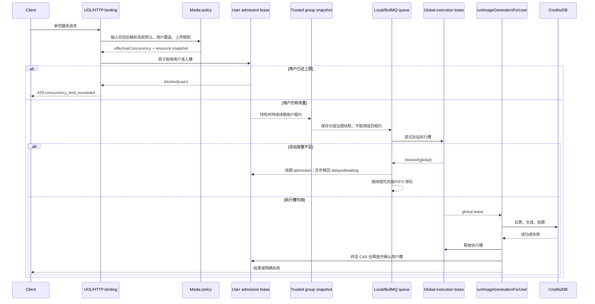
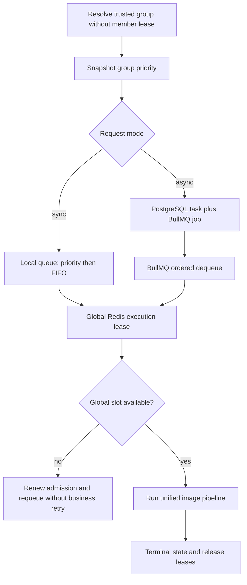
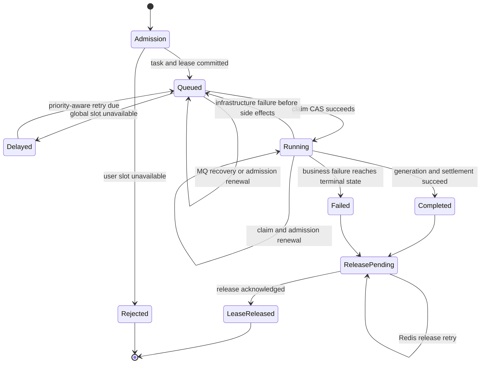

# 订阅退役与按量计费收敛 - Plan

## Goal Capsule

- Objective：移除 FluxMedia 的订阅产品、周期履约和套餐权限分层，使钱包、支付、媒体请求和管理后台统一按预付积分按次计费。
- Product authority：Product Contract 固定用户可见行为和财务不变量；Planning Contract 固定实现机制；Implementation Units 只能在两者约束内落地。
- Execution profile：Deep、高风险、跨支付、数据库、UOL、MCP、媒体队列和管理配置的分阶段重构。
- Stop conditions：发布预检发现活跃订阅、待履约状态、非终态旧异步任务或多项异步输入时停止；数据库或 Redis 无法安全证明幂等与租约状态时不得继续删除结构。
- Tail ownership：完成后的代码执行、测试、迁移和发布由 `ce-work` 或等价执行器负责；本文件不包含实现代码。

## Product Contract

### Summary

FluxMedia 将一次性退役订阅作为购买、履约和权限概念。钱包只提供预付充值，普通用户不再因套餐等级获得不同的媒体能力。生图并发改为系统默认加用户覆盖，单文件大小、单次上传总量和编辑参考图数改为系统配置，队列优先级改为分组配置，批量生图及其数量限制不再存在。

### Problem Frame

当前钱包同时承载按量充值和订阅购买，支付层包含 Creem 与 Epay 的订阅结账和周期积分履约，数据库保留订阅表及订阅积分来源，统一接口层按用户或 API Key 的套餐执行能力门禁。

产品已经没有真实订阅业务。继续保留这些路径会让用户界面、支付回调、积分来源、套餐矩阵和权限判断维持一条不再使用的商业分支。现有套餐限制中仍有实际的媒体运营价值，但这些限制应由平台、用户或分组配置负责，而不是由订阅等级负责。

### Key Decisions

- 一次性彻底退役订阅。(session-settled: user-directed — chosen over 分阶段冻结并保留兼容层: 当前不存在真实订阅，兼容层只会增加维护成本。) Governs R1-R4、R10-R12。
- 移除套餐能力门槛。(session-settled: user-directed — chosen over 全局套餐策略或管理员分配等级: 普通用户只应受余额、鉴权和必要的管理员权限约束。) Governs R5、R8-R9。
- 保留预付钱包的非订阅来源。(session-settled: user-directed — chosen over 严格充值制或后付费: 现有赠送、管理员发放和退款仍是有效业务。) Governs R3-R4。
- 资源限制改由运营配置承载。(session-settled: user-directed — chosen over 删除所有资源限制: 媒体资源上限仍有运营价值，但不应绑定用户套餐。) Governs R6-R7、R14。
- 生图并发使用系统默认值 20 加用户覆盖。(session-settled: user-directed — chosen over 默认值 2、每个用户都必须单独配置或只设系统硬上限: 系统需要较高的统一默认值，同时允许管理员为特定用户调整上限。) Governs R6、R14。
- 已准入请求占用用户并发，超限立即拒绝。(session-settled: user-directed — chosen over 只统计正在执行的任务: 等待全站槽位的同步和异步请求也必须占用用户并发，防止单个用户积压无界队列。) Governs R14。
- 保留全站执行上限和成员并发，不增加分组并发。(session-settled: user-directed — chosen over 删除全站上限或新增分组总并发: 全站共享容量和号池成员容量已经形成两级执行保护。) Governs R7、R14。
- 队列优先级归属分组。(session-settled: user-directed — chosen over 系统全局或用户套餐优先级: 调度优先级是分组运营规则，不是计费权益。) Governs R7、R13。
- 队列优先级不要求同步多副本严格全局排序。(session-settled: user-directed — chosen over 把全部同步请求迁入中央队列: 同步请求保留单实例优先级和 FIFO，异步请求使用 BullMQ，全站 Redis 只统一执行槽位。) Governs R7。
- 删除批量生图。(session-settled: user-directed — chosen over 保留批量数量配置: 当前产品没有批量生图功能，继续保留数量限制会产生无效配置。) Governs R8、R12。
- 历史订阅回调验签后静默退役。(session-settled: user-directed — chosen over 返回 `4xx` 拒绝: 通过验签的历史事件返回 `2xx` 并记录“已忽略”，可避免支付平台持续重试，同时不得产生数据库副作用；验签失败仍必须拒绝。) Governs R2、R10。

### How This Work Fits Together

本计划只负责订阅退役及其引发的计费、权限和资源配置收敛，不重新设计钱包财务核心或媒体后端供应商适配。

- Supersedes：`docs/plans/2026-07-22-001-feat-wallet-usage-log-plan.md` 中关于订阅购买 Tab、订阅结账和订阅履约复用的现行假设。
- Shares：与钱包、积分账本和单一图像管线共享充值、扣费、赠送、退款、审核、存储和幂等不变量。
- Enables：后续规划可以删除套餐矩阵、用户套餐解析和订阅专用支付分支，不需要再保留套餐兼容层。
- Can proceed independently of：媒体后端号池和模型供应商适配改造；相关规划若继续使用分组队列优先级，必须引用 R7 和 R13。

### Actors

- A1. 普通用户：充值积分并提交单项图片或视频请求，不选择订阅套餐或用户等级。
- A2. 平台管理员：维护系统媒体参数、单个用户并发覆盖、分组队列优先级和必要的运营权限。
- A3. 支付与履约系统：处理一次性充值、积分发放、扣费、赠送和退款；不再创建订阅状态或周期积分。
- A4. 媒体服务：在余额和权限通过后执行单项媒体请求，并应用系统资源限制与分组调度规则。

### Requirements

**订阅产品与支付退场**

- R1. 钱包和所有购买入口必须只展示一次性充值，不得展示订阅套餐、订阅 Tab、周期价格、续费入口或订阅状态。
- R2. 系统不得创建订阅结账、续费、取消、订阅状态同步或周期积分发放的新业务路径。历史订阅回调必须先按既有安全边界完成验签：验签成功时返回 `2xx`、记录“已忽略”且不产生任何数据库副作用，验签失败时仍拒绝请求。
- R3. 一次性充值、单次扣费、赠送、管理员发放和退款必须继续可用，并保持现有幂等和账本语义；订阅不再成为新的积分来源。
- R4. 既有积分交易和使用记录不得因退役而删除或改写；若环境中存在历史订阅来源，只能作为只读历史分类，不得触发新的履约或权益判断。

**用户权限与资源配置**

- R5. 普通用户和 API Key 不得因订阅套餐或套餐等级获得媒体能力差异。媒体操作只依赖有效身份、必要的 API 权限和可用积分，管理员专属操作继续由管理员权限控制。
- R6. 系统配置页必须提供默认值为 20 的每用户生图并发，以及单文件大小、单次上传总量和编辑参考图数。用户管理页必须允许覆盖单个用户的生图并发，清空覆盖值时恢复系统默认值，站内和外部媒体请求必须使用同一套有效值。
- R7. 分组现有 `priority` 必须改为任务队列优先级并停止承担列表排序或兜底选组。同步请求在单实例内按分组优先级和 FIFO 排序，异步请求由 BullMQ 统一排序，多同步副本之间不承诺严格全局优先顺序。
- R8. 批量生图及批量数量限制必须从用户入口、外部 API、统一接口、配置、权限、文案和测试中移除，不得保留隐藏或休眠兼容路径。
- R9. 模型或后端的实际可用性仍可由后端声明、健康状态、内容审核和管理员配置决定，但这些条件不得重新引入商业套餐门槛。

**代码、数据与运营表面**

- R10. 订阅专用的产品页面、Action、operation、binding、支付类型、周期价格配置、状态类型、Webhook 履约、系统设置行、i18n 文案和测试必须同步退役。
- R11. 用户套餐解析、套餐能力矩阵及其外部 API 能力门禁必须从运行时权威路径移除。资源限制由 R6 的系统参数承载，队列优先级由 R7 的分组配置承载。
- R12. 后台配置页和公开文档必须只描述按量充值、媒体能力、系统资源限制和分组调度，不得推广订阅、套餐积分、月度额度或批量生图。
- R13. 资源参数和分组队列优先级的修改必须对后续新请求生效，已有请求不因配置修改被重新计费、迁移或重复提交。
- R14. 已准入的同步和异步生图请求必须从接收开始到成功、失败或超时终态持续占用用户并发。用户达到有效上限时，系统必须立即返回 `429` 和明确的超限信息；用户仍有余量但全站总并发槽不足时，请求继续排队。

### Key Flows

- F1. 普通用户按量充值并创作
  - **Trigger:** A1 打开钱包或提交媒体请求。
  - **Actors:** A1、A3、A4。
  - **Steps:** A1 只能选择一次性充值；充值成功后，A4 在身份、权限和余额通过时执行单项请求，并使用用户有效并发、系统级媒体限制和目标分组队列优先级。
  - **Outcome:** 用户看不到订阅或套餐选择，扣费与结果记录继续沿用现有财务闭环。
  - **Covered by:** R1、R3、R5-R7、R13-R14。
- F2. 管理员维护资源与分组调度
  - **Trigger:** A2 修改系统配置或分组配置。
  - **Actors:** A2、A4。
  - **Steps:** A2 调整默认每用户并发、三项全局媒体限制、单个用户的并发覆盖或目标分组队列优先级；后续请求读取新规则，已有请求保持已保存的处理上下文。
  - **Outcome:** 运营可以调整容量和调度，不需要创建套餐或订阅。
  - **Covered by:** R6、R7、R13。
- F3. 支付事件和积分来源处理
  - **Trigger:** A3 收到一次性充值、赠送、管理员发放、退款或历史订阅事件。
  - **Actors:** A3。
  - **Steps:** 一次性充值及其他保留来源继续按现有规则处理；订阅事件不得创建新订阅权益或新订阅积分批次，历史记录保持只读。
  - **Outcome:** 退役不会破坏现有财务真相，也不会重新激活订阅逻辑。
  - **Covered by:** R2-R4。
- F4. 单项媒体请求
  - **Trigger:** A1 或外部调用方提交单项图片或视频请求。
  - **Actors:** A1、A4。
  - **Steps:** 系统不再暴露批量生图入口；单项请求继续经过余额、权限、审核、系统资源限制和分组调度。
  - **Outcome:** 产品不再承诺批量生图或批量数量上限。
  - **Covered by:** R5、R8-R9。
- F5. 生图并发准入与全站排队
  - **Trigger:** A1 提交单项生图请求。
  - **Actors:** A1、A4。
  - **Steps:** A4 先按用户覆盖或系统默认解析有效并发上限并为请求占用用户槽位；用户已达到上限时立即拒绝，否则请求持有用户槽位进入全站并发调度并在总槽位不足时等待。
  - **Outcome:** 用户超限得到明确响应，全站瞬时拥塞继续由共享队列吸收。
  - **Covered by:** R6、R14。

### Acceptance Examples

- AE1. **Covers R1、R10、R12.** Given 普通用户打开钱包，when 购买区加载完成，then 只出现一次性充值，不出现订阅套餐、周期价格、套餐积分或订阅状态。
- AE2. **Covers R2-R4.** Given 收到订阅相关回调或重复投递，when 验签成功，then 系统返回 `2xx`、记录“已忽略”且不产生数据库副作用；when 验签失败，then 系统拒绝请求；既有交易与使用记录保持不变，一次性充值、赠送、管理员发放和退款仍可正常记账。
- AE3. **Covers R5、R9.** Given 两个普通用户或 API Key 具备有效身份、必要权限和足够余额，when 请求同一可用媒体能力，then 不因套餐字段或订阅状态产生不同的能力结果。
- AE4. **Covers R6、R13.** Given 管理员调整默认每用户并发或三项系统级媒体限制，when 新请求到达，then 新请求统一使用新参数，已有请求不被迁移、重复提交或重新计费。
- AE5. **Covers R7、R13.** Given 两个分组配置了不同队列优先级，when 请求分别进入同一同步实例或异步 BullMQ 队列，then 高优先级请求先于后入队的低优先级请求，且同优先级保持 FIFO；不同同步实例之间不要求严格全局排序。
- AE6. **Covers R8、R12.** Given 用户或外部调用方查找批量生图，when 访问页面、API、operation、设置或文档，then 不存在可用入口、配置或宣传；单项图片和视频请求仍可用。
- AE7. **Covers R3、R4.** Given 账本存在积分交易或历史来源记录，when 订阅代码退役，then 账本记录仍可查询且不会被重写，新的业务只产生保留来源。
- AE8. **Covers R6、R14.** Given 用户已有 20 个已准入请求或已达到对应覆盖值，且其中部分请求仍在等待全站槽位，when 用户继续提交生图，then 新请求立即收到 `429` 和并发超限信息；已有等待请求继续持有用户槽位直到终态。

### Success Criteria

- 钱包、支付、Webhook、统一接口、系统配置和文档中不再有面向用户或运营的订阅购买与套餐分层路径。
- 默认每用户并发、单用户并发覆盖、三项全局媒体限制和分组队列优先级均有明确的配置入口、校验规则和新请求生效语义。
- 用户并发超限和全站容量不足形成两个可验证的独立分支：前者立即返回 `429`，后者继续排队。
- 批量生图及其数量限制从所有产品表面和运行时路径退场。
- 一次性充值、扣费、赠送、管理员发放、退款、审核、存储和媒体生成的既有财务与幂等行为保持可验证。

### Scope Boundaries

- 本计划包含订阅产品、支付履约、套餐权限、套餐配置、批量生图和相关文案、测试、文档及持久化模型的退役，并包含系统默认与用户覆盖的并发限制。
- 本计划保留钱包充值、积分账本、按次扣费、赠送、管理员发放、退款、媒体历史、审核、存储和单项图片/视频生成。
- 本计划不引入后付费、月结、用户等级、套餐替代品或批量生图的兼容实现。
- 本计划不新增分组总并发，不把 `MEDIA_IMAGE_WORKER_CONCURRENCY` 当作全站权威容量，也不重构完整 Agent runtime 或中央角色投影。

### Dependencies / Assumptions

- 当前没有需要迁移、退款或保留权益的真实订阅用户。
- 财务真相继续位于 `credits_transaction`；现有充值、扣费、赠送和退款幂等约束继续有效。
- 单一图像管线 `runImageGenerationForUser` 继续覆盖图片生成入口，退役工作不得建立平行管线。
- 默认每用户并发与三项系统资源参数成为站内创作和外部媒体 API 共同读取的唯一运营配置；用户并发覆盖只在用户维度维护；分组队列优先级成为对应调度的唯一优先级来源。
- 现有全站总并发继续作为独立共享容量限制，不被用户有效并发上限替代；默认值保持 `500`。
- 号池成员 `concurrency` 继续限制真实后端执行，不增加分组总并发参数。
- 历史订阅来源枚举和交易分类继续可读；新的订阅来源只能通过业务写入收敛和发布门禁被阻断，不通过改写历史行实现清理。

### Sources / Research

- `apps/web/src/features/wallet/wallet-page-data.ts`、`apps/web/src/features/wallet/components/wallet-purchase-section.tsx`：钱包同时加载充值和订阅购买区。
- `apps/web/src/features/payment/subscription-checkout.ts`、`apps/web/src/features/payment/subscription-upgrade.ts`、`apps/web/src/features/payment/epay-fulfillment.ts`：订阅结账、升级和周期积分履约。
- `apps/web/src/app/api/webhooks/creem/route.ts`：Creem 验签、订阅事件和积分发放的同一路由。
- `packages/database/src/schema.ts`：`user`、`subscription`、`credits_batch`、`credits_transaction` 和 `image_async_task` 的现有结构。
- `apps/web/src/features/image-generation/queue.ts`、`apps/web/src/features/image-generation/redis-image-generation-slots.ts`：现有 Redis 全站与用户槽位、进程内优先级队列和租约 TTL。
- `apps/web/src/features/image-backend-pool/group-service.ts`、`apps/web/src/features/image-backend-pool/runtime-service.ts`：分组 `priority`、默认分组和套餐门槛的现有使用位置。
- `apps/web/src/server/uol-bindings/image-async-task.ts`、`apps/web/src/features/image-generation/image-async-task-repository.ts`、`apps/web/src/server/media-task-workers.ts`：异步任务批次输入、claim 状态机和 BullMQ Worker。
- `apps/web/src/server/media-task-recovery-repository.ts`、`apps/web/src/server/scheduled-jobs.ts`：现有恢复扫描的批次上限、旧 priority 丢失和到期任务查询形状。
- `apps/web/src/features/image-generation/media-input-loader.ts`、`apps/web/src/features/image-generation/video-input-storage.ts`：媒体载荷在队列前的读取与 storage-only manifest 模式。
- `packages/shared/src/subscription/services/plan-capabilities.ts`、`packages/shared/src/config/subscription-plan.ts`、`packages/shared/src/uol/invoke.ts`：套餐矩阵和 UOL 套餐能力门禁。
- `packages/shared/src/uol/access.ts`、`packages/shared/src/uol/principal.ts`、`apps/web/src/app/api/mcp/user/route.ts`：真实 Principal、system-only 内部调用和 MCP 错误传输外壳。
- `packages/shared/src/credits/core.ts`、`packages/shared/src/payment/epay.ts`、`apps/web/src/features/payment/epay-fulfillment.ts`：历史 FIFO 更新、新积分写入和 Epay 订阅订单履约状态。
- `packages/shared/src/moderation/policy-service.ts`、`packages/shared/src/uol/operations/moderation.ts`：用户覆盖、管理员审计和 human-only UOL 操作模式。
- `packages/database/scripts/release-governance-gate.mjs`、`.github/workflows/deploy-production.yml`：只读发布预检、迁移顺序、postcheck 和维护窗口脚手架。
- `docs/memory/system-settings-runtime-cache.md`、`docs/memory/credit-payment-result-flow.md`：系统设置缓存和财务结果流的项目约束。

---

## Planning Contract

### Product Contract Preservation

Product Contract unchanged during technical enrichment. The callback behavior and migration strategy were confirmed in the session before this plan was deepened; no R/A/F/AE meaning was broadened or weakened.

### Key Technical Decisions

- KTD1. **以独立媒体策略服务作为限制唯一来源。** 将四个系统参数、用户可空覆盖、硬上限、默认值和生效值解析集中到 `image-generation` 策略服务；页面、HTTP、UOL、站内管线和外部 API 只调用该服务，不复制套餐矩阵解析。这样可以同时满足 R6、R13 和 UOL/HTTP/MCP 一致性。
- KTD2. **用户准入槽与全站执行槽分离并持续续期。** UOL 输入校验完成后、媒体载荷解析或外部拉取开始前立即占用用户槽；全站槽仅在实际开始执行时占用。同步排队器和异步恢复器都必须在等待及执行期间以 token CAS 续期 admission lease，失去租约时失败关闭；两者不能继续使用一个同时获取的 Lua 操作。这样全站满载的等待请求仍会计入用户并发，用户超限可以立即返回，符合 R14。
- KTD3. **把可信分组解析与成员租约拆开并保存请求快照。** admission lease 内先通过无成员租约副作用的 `resolveTrustedGroupSnapshot` 解析分组 ID、priority 及必要治理上下文，再把同步快照放入轻量队列项、把异步快照写入数据库；只有取得 global lease 后才按固定分组快照创建成员 session。配置更新只影响后续准入，不重新计费或迁移既有任务，符合 R13。
- KTD4. **分组优先级采用现有数字语义。** `image_backend_group.priority` 保持 `0..10000`，数值越小表示队列优先级越高；`0` 映射为 BullMQ 的最高优先级，管理列表改用稳定的创建时间和 ID 顺序。`isDefault` 是无显式目标时的唯一默认组依据，不再使用 priority 兜底选组。
- KTD5. **异步任务单项化并以 generation 身份形成端到端幂等。** `image.enqueueAsync` 改为接受一个 `generationInput`，任务保存唯一 generation ID、输入摘要、分组快照和用户准入租约。Worker 执行前必须按 `generationId + userId` 对账：既有终态直接投影，既有非终态进入受控恢复，归属或输入不一致返回幂等冲突；claim CAS 不能替代上游、存储和财务副作用的幂等。迁移预检拒绝无法安全单项化或 generation ID 重复的历史任务，不把临时数组兼容保留到 Phase B 之后，符合 R8。
- KTD6. **异步 admission 使用 task-scoped 可重入身份和可恢复释放协议。** Redis 以用户与 `taskId` 派生的稳定、不含原始标识的摘要 lease member 原子裁决：同任务并发重放返回同一租约且不重复计数，不同输入仍由数据库唯一行和输入摘要判定 `idempotency_conflict`。任务持久化 opaque token、Redis 服务端 expiry 和释放确认状态；token/member 不进入客户端响应或常规日志。非终态由到期扫描或 Worker 续期，终态 CAS 保留 token，只有 Redis 已删除或确认过期后才标记 released。续期不得用盲目 `ZADD` 复活丢失 token，Redis 故障失败关闭。
- KTD7. **内部 Worker 使用 task-scoped 执行授权和 fencing，不伪造外部 Principal。** `image.processAsyncTask` 保持 system-only，由 apps/web 内部授权对象携带 task、owner、claim 和 admission 身份调用唯一图像管线；该对象不能进入 operation input、MCP schema 或通用 callbacks。API Key 任务执行前重新确认凭据仍有效。Worker 在等待 global lease 和执行期间续期 claim，失去 claim 的执行者不得再开始后续外呼、存储、结算或终态写入；所有副作用继续受 generation/sourceRef 幂等约束。
- KTD8. **历史订阅分类只读保留，新的写入入口在 Phase A 双层收敛。** `credits_batch_source.subscription`、`credits_transaction.monthly_grant` 及历史 FIFO 排序和展示继续存在；新的 credits operation、Webhook、管理员 Action 和支付服务不得生成这些来源。0081 安装 `BEFORE INSERT` 守门触发器，只拒绝这两种新分类，不拦截历史批次的 remaining/status/expiration 更新、消费或退款关联；U8 只验证守门仍启用。
- KTD9. **媒体能力改为身份、余额和运营可用性判断。** 删除 `PLAN_CAPABILITY_MATRIX` 的运行时权威作用及 Principal 中的套餐字段；文本优化、图片/视频、流式、模型列表、API Key 管理、分组选择和审核行为不再因套餐分级而拒绝。审核拦截继续由全站审核策略、分组安全配置和成员能力决定；历史“审核失败只结算审核积分”采用现行免费默认语义，不新增套餐替代配置。
- KTD10. **并发超限使用稳定领域错误并按传输编码。** 新增 `concurrency_limit_exceeded` 错误码，details 至少包含 `limit`、`effectiveSource` 和 `scope=user`。REST/Next HTTP 适配器映射为 `429`；MCP 沿用 HTTP 200 的 JSON-RPC/tool-error 外壳并在错误体返回同一 code/details。全站容量不足不使用该错误码，继续在队列等待并按既有超时错误返回。
- KTD11. **管理写入沿用 human-only 审计模式。** 用户并发覆盖使用真实管理员 `Principal`、目标角色护栏、原因和 `admin_audit_log`，`NULL` 表示继承系统默认；不把伪造 MCP actor 或中央 roles 投影重构带入本计划。
- KTD12. **两阶段破坏性迁移。** (session-settled: user-directed — chosen over 单次发布直接删除: 先新增/回填并切换消费者，待预检通过后在维护窗口删除订阅结构，可控制遗留数据和回滚风险。) Phase A 对旧 NOT NULL 数组/plan 列临时双写，新消费者以单项列为权威，旧字段不得参与权限或调度；旧 Worker 排空并完成观察后，U8 才停止双写并 DROP。Phase A 可回滚到兼容旧列的应用；Phase B 开始后只能保持维护并前向修复或恢复指定备份，不能启动旧 schema 镜像。
- KTD13. **BullMQ 全站满载采用延迟重排而非占用 Worker。** 异步 Worker 取不到 global lease 时必须在无业务副作用的前提下把任务移回 delayed/waiting，并保持 admission lease，不消耗业务失败重试次数；恢复投递必须携带持久 priority。这样 Worker concurrency 表示可执行吞吐，不会让先取出的低优先级任务长期占住 active 槽位。
- KTD14. **恢复与本地调度必须有有界复杂度和独立到期游标。** MQ 补投、claim 恢复、admission 续期和终态租约清理分别持久化 due time，以 partial index、keyset/claim 批次和批量 Redis 脚本推进；同步队列的入队、取队头和取消为 `O(log n)` 或更好，不在轮询中全量重排。执行上限 `500` 不被误当成可用容量保证，实际吞吐还受成员、Worker、数据库与供应商容量约束。

### High-Level Technical Design

#### 请求准入、双层槽位与终态释放

同步路径在输入 schema 通过后、媒体解码或远程拉取前取得用户槽，通过轻量分组解析器生成可信快照，再将只含引用和快照的任务放入进程内优先级队列；不得把已解码大 `Buffer` 或完整执行 session 长期保存在等待队列。异步路径以 task-scoped lease member 可重入地取得用户槽，并把 token、服务端 expiry、释放状态和单项输入 manifest 持久化。同步排队器与异步恢复器都必须在等待和执行期间续期。

用户槽释放是可恢复的两步协议：先由任务或同步请求的终态获胜者执行 Redis release，再记录 release ack；进程在两步之间崩溃时，恢复扫描用保留的 token 重试。Redis 已确认不存在等价于释放成功，但续期时发现 token 不存在必须重新通过容量裁决，不能盲目复活。已结算结果不会因释放告警被改写为失败。

#### 同步与异步排序

同步队列以 `groupPriority asc, localSequence asc` 排序。它只在一个进程内提供严格顺序，多副本之间只共享全站容量租约。异步请求在入队时将分组 priority 转成 BullMQ priority，并把 `groupPriority` 和 `groupIdSnapshot` 持久化；Worker 的并发数只表示消费吞吐，不表示全站容量。

#### 异步任务生命周期

#### 两阶段数据与发布门禁

Phase A 先增加用户覆盖、异步单项字段、输入摘要、租约快照/释放状态和独立 reconcile due time，安装历史 credits 分类的 INSERT-only 守门，并回填严格可证明的历史终态单项行。兼容窗口内 writer 双写旧 NOT NULL 字段与新单项字段，新 reader 以新字段为权威；切换消费者、停止新订阅写入并排空旧 Worker 后再观察。

Phase B 在维护窗口先执行外部只读预检，再由 0082 在同一 DDL 事务和 advisory/table lock 窗口内重跑阻断查询，确认没有活跃订阅、待履约 Epay 订单、非终态旧任务、非法单项映射或 generation ID 冲突后才停止双写并删除订阅运行时结构和旧异步数组列。任一计数非零、锁超时或账本摘要漂移时整体回滚并保持维护状态，不启动不兼容应用。

### Assumptions and Deferred Implementation Notes

- 系统设置默认值采用当前安全运营口径：用户并发 `20`、单文件 `5 MB`、单次上传总量 `75 MB`、编辑参考图 `16`；硬上限分别为 `10000`、`200 MB`、`512 MB`、`256`。实现时必须通过定义文件的范围校验收敛非法输入。
- 新增系统设置键使用 `IMAGE_GENERATION_DEFAULT_USER_CONCURRENCY`、`MEDIA_MAX_FILE_SIZE_MB`、`MEDIA_MAX_UPLOAD_SIZE_MB` 和 `IMAGE_EDIT_MAX_REFERENCE_IMAGES`。如果现有配置命名约定要求不同，只允许等价重命名并同步所有消费者和文档。
- 用户覆盖字段建议命名为 `user.imageGenerationConcurrencyOverride`，数据库列为 `image_generation_concurrency_override`，允许 `NULL` 并校验 `1..10000`。
- admission/claim 租约 TTL、续期间隔和恢复扫描的最终数值应沿用现有图片 claim/Redis TTL 的安全窗口，并在实现时通过时钟注入测试边界；同步与异步都必须续期，不得用永久 Redis 计数器替代有界租约。Lua acquire/renew 必须返回 Redis 服务端 expiry，renew 只能延长仍存在且 token 匹配的成员。
- 异步输入中的大媒体载荷只保留 storage manifest 或第一方引用，等待队列不持有完整 `Buffer`；manifest 的写入、失败清理和最小保留期沿用现有 storage 幂等/清理约束。该约束不新增全站准入拒绝码，仍由既有请求超时和基础设施反压处理无法接受的请求。
- 同步本地队列必须保留轻量引用而非解码后媒体对象；入队、取队头和取消应为 `O(log n)` 或更好。全站 `500` 是 global execution 上限，不等于供应商、成员、数据库或 Worker 的可用吞吐。
- 分组快照不建立阻塞历史删除的外键；它是任务审计和恢复所需的可信快照，不是当前可用分组的实时引用。

### Sequencing and Delivery Phases

1. Additive schema、INSERT-only 财务守门、策略服务、用户覆盖、分组快照、两级租约和 reconcile due 字段先完成并通过 DB-free 与集成测试。
2. 兼容窗口双写旧异步列与新单项列；切换新 reader、无套餐 UOL/MCP 和按量支付，排空旧 Worker 后观察 lease lag、队列 age、priority 等待、429 比例和一次性充值结果。
3. 维护窗口在同一受控锁事务中执行订阅/Epay/旧数组/generation 冲突预检和 DROP 迁移；postcheck 验证历史账本摘要、运行时设置和 Registry 残留均符合目标。
4. 文档、i18n、环境变量和公开 API 合同的残留审计必须在 Phase B 后再次执行，避免旧文案或旧 schema 被重新生成。

### System-Wide Impact

- 数据：`user`、`image_async_task`、订阅表、积分来源枚举、系统设置和管理员审计日志发生结构或语义变化。
- 运行时：站内图片、外部 v1 图片/视频 API、异步 Worker、BullMQ、Redis 槽位、号池成员并发和单一图像管线共享新的策略快照。
- 接口：UOL Registry、HTTP 错误编码、MCP tools/list、外部 API JSON schema 和异步任务状态输出同时变化。
- 运维：部署必须继续执行停服、备份、只读预检、迁移、postcheck 和健康检查；两阶段迁移不能被合并为一次自动 DROP。
- Agent parity：本计划只确保新增媒体限制 operation、UOL、HTTP 和 MCP 的身份、领域错误和资源限制一致；HTTP 使用 429、MCP 保持 JSON-RPC/tool-error 外壳，不扩展完整 Agent runtime 或中央权限投影重构。根级 `AGENTS.md` 与 `CLAUDE.md` 的接口层约束必须同步删除已退役的商业 `plan-capabilities` 依赖。

### Risks and Mitigations

- Redis 用户租约在任务长时间排队时过期：持久任务保存 token 和过期时间，恢复扫描与 Worker 续期，终态和过期补偿释放；续期失败时停止重复执行并记录可定位事件。
- 用户准入与数据库插入不是单事务：task-scoped lease member 让相同 `taskId` 并发重放不重复计数，数据库唯一行和输入摘要负责最终收敛；失败路径不得释放由竞争获胜任务持有的同一 token。恢复扫描清理数据库已终态但 Redis 未确认释放的 token。
- 配置更新造成旧任务行为漂移：把有效并发、分组 ID、队列 priority 写入同步任务对象或异步任务行，执行阶段只使用快照。
- 分组被禁用或删除后旧异步任务无法执行：快照用于排序和审计，执行阶段仍重新检查当前成员可用性；不可用时任务以明确业务失败终态结束并释放用户槽。
- 用户槽释放在终态 DB CAS 与 Redis release 之间崩溃：保留 token、expiry、release state，恢复扫描重试并以 Redis 已不存在作为成功；partial unique token 约束防止一对多释放。
- Worker claim 过期后旧实例继续外呼或结算：claim heartbeat 与执行 fencing 在每个副作用边界前校验 token；generation 唯一归属、sourceRef 幂等和终态 CAS 共同阻断重复生成与扣费。
- 异步全站满载占住 Worker：取不到 global lease 时只把任务放回 delayed/waiting，保留 admission lease，不消耗业务重试次数，并从数据库恢复持久 priority。
- 恢复扫描头部重复或续期吞吐不足：MQ 补投、claim 恢复、admission 续期和终态 release 分离 due 游标，使用 partial index、keyset/claim 批次和批量 Redis 脚本；以非终态任务数/续期窗口的至少两倍吞吐做压测门槛。
- 同步队列保留大媒体载荷并全量排序：准入前避免外部媒体解码，队列只保存 storage manifest/引用；调度使用有序结构，压测 100/1,000/10,000 项时不得出现 `O(n²)` 删除或全量重排。
- `500` global execution slot 不是实际吞吐保证：按 `min(500, 可用成员 concurrency、Worker 吞吐、DB/供应商容量)` 观测有效容量，成员获租的锁清理和指标写入不得成为热路径瓶颈。
- 历史多项或 malformed 异步输入无法无损单项化：迁移前必须校验 JSON 类型、长度恰为 1、输入/ID/operation 一致、ID 非空且跨任务唯一；任一异常 fail-closed，不通过截断数组或伪造 generation ID 回填。
- 历史账本误被清理或阻断：DROP 只作用于订阅专用结构；`credits_batch_source.subscription` 和 `credits_transaction.monthly_grant` 枚举、查询、FIFO 消费和只读文案保留，Phase A 安装的 INSERT-only trigger 与应用门禁共同阻止新写入，历史 UPDATE 放行。
- Phase A 忽略回调时仍有待履约 Epay 订阅订单：preflight 同时检查 `epay_order` 的订阅业务类型、pending/fulfilling 和未知状态；非零只报告并保持旧履约路径，不自动标失败。
- 第三方持续重试历史订阅回调：验签成功分支固定返回 `2xx` 并记录忽略事件；验签失败仍使用现有拒绝响应，且忽略分支不得调用数据库履约函数。
- Phase B preflight 与 DROP 之间发生 TOCTOU：0082 在 advisory/table lock 下重新执行全部 blocker 查询，校验历史账本摘要；锁超时、阻断计数或摘要漂移则事务回滚并保持维护，恢复使用固定备份 manifest 或前向修复，不启动旧镜像。
- 外部 API/MCP 残留套餐字段：UOL Principal、访问类型、operation capabilities、MCP 工具过滤和 route binding 统一修改，并以残留搜索和合同测试作为发布门禁。

### Deferred to Follow-Up Work

- 完整 Agent runtime、中央角色投影和 MCP admin 的既有伪造 actor 问题。
- 按量计费价格模型、折扣、账单报表或后付费能力的重新设计。
- 分组总并发、租户级容量、跨多副本的严格同步队列排序。
- 将历史订阅财务分类改名或重写为新业务分类。

---

## Implementation Units

### U1. Additive 数据基础与发布预检

**Goal:** 增加用户并发覆盖、异步单项任务和租约/分组快照所需的兼容字段，并把订阅退役和旧任务状态纳入只读发布门禁。

**Requirements:** R2-R4、R6、R10、R13-R14；F3、F5；AE2、AE4、AE7、AE8；KTD3、KTD5-KTD6、KTD8、KTD12、KTD14。

**Dependencies:** 无；U2、U4、U5、U8 依赖本单元的字段和预检契约。

**Files:**

- `packages/database/src/schema.ts`
- `packages/database/drizzle/0081_add_media_usage_governance.sql`
- `packages/database/drizzle/meta/_journal.json`
- `packages/database/scripts/release-governance-gate.mjs`
- `packages/integration-tests/src/release-governance-gate.test.ts`

**Approach:**

1. 在 `user` 增加可空并发覆盖及 `1..10000` 检查。
2. 在 `image_async_task` 增加单项输入/manifest、输入摘要、唯一 generation ID、有效用户并发、分组 ID、队列 priority、用户租约 token/服务端 expiry/releasedAt，以及 MQ 补投、claim 恢复、admission 续期和终态释放各自的 due time；token 使用非空 partial unique，token/expiry/release state 使用成对 CHECK，非终态 due 查询使用 partial index。
3. Phase A writer 双写旧 NOT NULL 数组/plan 与新单项列，旧 plan 只作 rollback 兼容快照；新 reader 以单项列为权威。只对 JSON 类型为数组、输入和 ID 数组长度都恰为 1、输入 ID/数组 ID/operation 一致、ID 非空、可过新 schema 且跨任务 generation ID 唯一的历史终态任务回填；任一不满足或非终态旧任务都输出阻断证据，不截断数据。
4. 在 0081 增加两个 `BEFORE INSERT` trigger，分别拒绝新的 `credits_batch.source_type=subscription` 和 `credits_transaction.type=monthly_grant`，明确放行历史行 UPDATE；应用写入类型同步收窄但历史读取类型保留。
5. 扩展 release gate 的 `preflight-early`/`preflight`/`postcheck`，覆盖活跃/仍有效订阅、Epay subscription pending/fulfilling/未知状态、非法旧任务映射、generation ID 冲突、新字段完整性和历史账本稳定摘要；输出只含非敏感计数、金额、remaining/status 分桶和稳定 digest。
6. 手写 SQL 并登记 journal；不运行 `drizzle-kit generate`。

**Patterns to follow:** `packages/database/drizzle/0079_image_async_task_mq.sql` 的幂等建表/索引写法；`packages/database/scripts/release-governance-gate.mjs` 的只读事务、非敏感计数和 fail-closed 输出。

**Test scenarios:**

- Additive migration 在空库、重复执行和已有终态单项任务上幂等，并保留现有账本行；新旧 writer/reader 组合在 Phase A 双写窗口都可读。
- Given 存在 active/trialing/past_due 或仍在有效期的 canceled subscription，preflight 返回非零证据并失败。
- Given Epay 订阅订单为 pending、fulfilling、过期 fulfilling lease 或未知状态，preflight 失败且不自动改写；success/failed 历史订单可继续。
- Given 存在 queued/running 的旧异步任务，preflight 返回非零证据并失败。
- Given 旧输入为非数组、空数组、多项、ID/operation 不一致、空 ID、新 schema 不通过或 generation ID 跨任务重复，preflight 分别返回非零证据并失败，不写入截断或猜测后的输入。
- Given 终态单项任务，回填后的 generation ID、输入和身份快照可被新仓储读取。
- 新 INSERT subscription batch 或 monthly_grant transaction 被 trigger 拒绝并回滚；历史 subscription batch 的 remaining/status/expiration、FIFO 消费和退款关联 UPDATE 继续成功。
- postcheck 确认 additive 字段、partial unique/index/CHECK/trigger 存在，且历史 `credits_batch`/`credits_transaction` 的计数、金额、remaining/status 分桶和 digest 未改变。

**Verification:** 集成发布门禁能够在 PostgreSQL 测试库中区分可发布和必须停止的状态，且迁移 journal 与 schema 保持一致。

### U2. 媒体限制策略、系统设置、用户覆盖和 UOL

**Goal:** 把四项资源限制和用户并发覆盖沉淀为一个可校验、可审计、可被 UOL/HTTP/MCP 共用的策略服务。

**Requirements:** R5-R6、R9、R11、R13-R14；F2、F5；AE3、AE4、AE8；KTD1、KTD10、KTD11。

**Dependencies:** U1。

**Files:**

- `packages/shared/src/image-generation/media-limit-policy.ts`
- `packages/shared/src/image-generation/media-limit-policy.test.ts`
- `packages/shared/src/image-generation/media-limit-service.ts`
- `packages/shared/src/image-generation/media-limit-service.test.ts`
- `packages/shared/src/image-generation/media-contract.ts`
- `packages/shared/src/image-generation/media-contract.test.ts`
- `packages/shared/src/system-settings/definitions.ts`
- `packages/shared/src/system-settings/defaults.test.ts`
- `packages/shared/src/system-settings/index.test.ts`
- `packages/shared/src/system-settings/components/system-settings-panel.tsx`
- `packages/shared/src/uol/operations/media-limits.ts`
- `packages/shared/src/uol/operations/media-limits.test.ts`
- `packages/shared/src/uol/operations/index.ts`
- `packages/shared/src/uol/errors.ts`
- `packages/shared/src/support/actions/admin-users.ts`
- `packages/shared/src/support/components/admin-users/admin-users-management.tsx`
- `packages/shared/src/support/actions/admin-users.test.ts`
- `packages/database/src/schema.ts`

**Approach:**

1. 通过纯函数解析默认值、可空覆盖、硬上限和来源，拒绝 `NaN`、零、负数、超硬上限和非整数并保留 DB-free 单测。
2. 将 `IMAGE_GENERATION_DEFAULT_USER_CONCURRENCY=20`、`MEDIA_MAX_FILE_SIZE_MB=5`、`MEDIA_MAX_UPLOAD_SIZE_MB=75` 和 `IMAGE_EDIT_MAX_REFERENCE_IMAGES=16` 注册到系统配置页；定义文件同时声明硬上限和运行时回退。
3. 增加读取生效值的媒体策略 operation，以及管理员设置/清空用户并发覆盖的 human-only operation；用户 ID 只取 Principal 或已校验的目标字段，写入沿用管理员角色护栏、原因和审计。
4. 在 `image-generation/media-contract.ts` 和所有上传/编辑入口只消费策略服务，不再按用户套餐读取限制。
5. 将 `concurrency_limit_exceeded` 映射为 `429`，details 不包含凭据、提示词或 Redis key。

**Patterns to follow:** `packages/shared/src/moderation/policy-service.ts` 的可替换仓储、事务内审计和 `NULL` 继承语义；`packages/shared/src/uol/operations/moderation.ts` 的 human-only 管理 operation；`packages/shared/src/system-settings/definitions.ts` 的范围校验。

**Test scenarios:**

- 缺失系统设置时返回四个默认值，默认用户并发为 `20`。
- 系统设置取边界值成功，零、负数、非整数和超过硬上限的值被拒绝或安全回退。
- 用户覆盖为合法 `1..10000` 时覆盖系统默认；覆盖为 `NULL` 时恢复默认；非法覆盖不能落库。
- 两个普通用户和 API Key 读取同一生效策略时结果一致，结果不包含套餐字段。
- 真实管理员可以设置和清空低权限目标用户覆盖，审计 before/after/reason/requestId 完整；无权角色、平级或更高目标被拒绝。
- 用户并发超限抛出 `concurrency_limit_exceeded`，HTTP 状态为 `429`，details 包含限制值和来源。
- UOL 与直接服务调用返回相同的单文件、总上传和编辑参考图限制。

**Verification:** 系统设置面板能保存并显示四项参数，用户详情面板能显示生效值和覆盖来源；所有媒体入口只剩一个策略读取路径。

### U3. 分组队列优先级与默认组语义

**Goal:** 让 `image_backend_group.priority` 只承担媒体任务队列优先级，删除套餐门槛、列表排序和兜底选组职责。

**Requirements:** R5、R7、R9、R11、R13；F1-F2、F5；AE3、AE5；KTD3-KTD4、KTD9、KTD14。

**Dependencies:** U1、U2。

**Files:**

- `packages/shared/src/image-backend/group-contract.ts`
- `packages/shared/src/image-backend/group-contract.test.ts`
- `apps/web/src/features/image-backend-pool/group-service.ts`
- `apps/web/src/features/image-backend-pool/group-service.test.ts`
- `apps/web/src/features/image-backend-pool/runtime-group-selection.ts`
- `apps/web/src/features/image-backend-pool/runtime-service.ts`
- `apps/web/src/features/image-backend-pool/runtime-service.test.ts`
- `apps/web/src/features/image-backend-pool/catalog-service.ts`
- `apps/web/src/features/image-backend-pool/catalog-service.test.ts`
- `apps/web/src/features/image-backend-pool/group-form.tsx`
- `apps/web/src/features/image-backend-pool/admin-group-list.tsx`
- `apps/web/src/features/external-api/models.ts`
- `apps/web/src/features/external-api/platform-model-catalog.ts`
- `apps/web/src/features/external-api/platform-model-catalog-service.ts`
- `apps/web/src/features/external-api/platform-model-catalog.test.ts`
- `apps/web/src/features/external-api/platform-model-catalog-service.test.ts`
- `apps/web/src/features/image-generation/operations.ts`
- `apps/web/src/features/image-generation/queue.ts`
- `apps/web/src/features/image-generation/queue.test.ts`
- `packages/database/src/schema.ts`
- `packages/database/drizzle/0082_group_queue_priority_contract.sql`
- `packages/database/drizzle/meta/_journal.json`
- `packages/shared/src/uol/operations/image-backend-pool.ts`
- `packages/shared/src/uol/operations/image-backend-pool.test.ts`
- `apps/web/src/server/uol-bindings/image-backend-pool.ts`
- `apps/web/src/server/uol-bindings/image-backend-pool.test.ts`

**Approach:**

1. 从分组 metadata、契约和 runtime 选择中删除 `minPlan` 读取与套餐能力判断；保留 `isEnabled`、`isDefault`、`isUserSelectable`、内容安全和计费覆盖。
2. 保持 priority 数值范围 `0..10000`，数值越小越优先；管理列表和分组选项改为稳定创建时间/ID 顺序，不能再把 priority 当排序或无默认组 fallback。
3. 从完整 `RuntimeBackendSession` 拆出无成员租约副作用的 `resolveTrustedGroupSnapshot`；在用户 admission lease 内解析可信目标分组并生成 `groupIdSnapshot`、`groupPrioritySnapshot` 和必要治理快照，取得 global lease 后才创建成员 session，后续配置修改只影响新请求。
4. 目标分组禁用、不可选择、无成员或当前模型不可用时继续返回现有可用性错误，不伪造套餐错误；快照解析失败必须释放用户租约且不能占用全站槽。

**Patterns to follow:** `group-service.ts` 的默认组事务锁和拓扑校验；`runtime-service.ts` 的可信 API Key 分组绑定和成员租约；`packages/shared/src/image-backend/scheduling-policy.ts` 的稳定 priority/FIFO 排序。

**Test scenarios:**

- 新旧分组 metadata 解析不再产生套餐门槛，坏 metadata 按安全默认处理。
- 数值 priority `0`、中间值和 `10000` 按从小到大排序；同值按创建时间/ID 稳定排序。
- 无显式目标时只选择 `isDefault=true` 的启用分组；不存在默认组时返回无可用分组，不按 priority 兜底。
- 普通用户、API Key 和 MCP 对同一 `isUserSelectable` 分组得到一致的选择结果，不因套餐字段不同而变化。
- 修改分组 priority 后，新请求使用新快照，已入队同步/异步任务仍使用旧快照。
- 禁用或删除关联分组不会破坏旧任务快照读取，当前新请求得到明确不可用错误。
- 分组解析不会取得成员租约、写成员指标或创建不可序列化 session；成员选择只发生在 global lease 之后并固定使用已保存的分组快照。

**Verification:** 管理页面的 priority 文案说明“任务队列优先级”，列表顺序与 priority 解耦；运行时和 UOL 不再读取 `minPlan` 或套餐能力矩阵。

### U4. 用户准入并发、全站执行槽和统一错误映射

**Goal:** 将同步和异步媒体请求接入同一套用户准入租约、全站执行租约、优先级队列和终态释放机制。

**Requirements:** R6-R7、R9、R13-R14；F1、F4-F5；AE3-AE5、AE8；KTD2-KTD4、KTD6-KTD7、KTD10、KTD14。

**Dependencies:** U2、U3。

**Files:**

- `apps/web/src/features/image-generation/queue.ts`
- `apps/web/src/features/image-generation/queue.test.ts`
- `apps/web/src/features/image-generation/indexed-priority-queue.ts`
- `apps/web/src/features/image-generation/indexed-priority-queue.test.ts`
- `apps/web/src/features/image-generation/redis-image-generation-slots.ts`
- `apps/web/src/features/image-generation/redis-image-generation-slots.test.ts`
- `apps/web/src/features/image-generation/operations.ts`
- `apps/web/src/features/image-generation/media-input-loader.ts`
- `apps/web/src/features/image-generation/image-input-storage.ts`
- `apps/web/src/features/image-generation/image-input-storage.test.ts`
- `apps/web/src/server/uol-bindings/image-generation.ts`
- `apps/web/src/server/uol-bindings/image-generation.test.ts`
- `apps/web/src/features/external-api/images.ts`
- `apps/web/src/features/external-api/handlers/image-generations.ts`
- `apps/web/src/features/external-api/handlers/image-edits.ts`
- `apps/web/src/app/api/images/generate/route.ts`
- `apps/web/src/app/api/images/edit/route.ts`
- `apps/web/src/features/external-api/images.test.ts`
- `packages/shared/src/uol/errors.ts`
- `packages/shared/src/uol/tests/invoke.test.ts`

**Approach:**

1. 把现有 Redis Lua 拆成用户 admission lease 和 global execution lease 两个可重入的最小接口；admission acquire/renew/release 以 token CAS 裁决并返回 Redis 服务端 expiry，renew 只延长现有成员。两种租约使用不同 key/token，释放均幂等，非法返回或连接故障失败关闭。
2. UOL schema 校验后、`loadMediaInputs` 或远程媒体拉取前解析有效并发并取得用户租约；在租约内解析轻量可信分组快照，并把 data/storage/remote 输入归一为 storage-only manifest 或第一方引用后再进入等待队列。媒体加载、转存、分组解析或入队失败都释放用户租约且不占 global lease。
3. `withImageGenerationQueue` 接收有效并发、分组快照、请求模式和可选内部 admission authorization；同步模式在等待和执行期间续期用户租约，再等待全站租约；Worker 模式复用持久 task authorization，只取得全站执行租约。失去 admission 或 claim 时，在尚未开始副作用的阶段失败关闭。
4. 同步队列使用有序堆/平衡结构与索引句柄，使入队、取队头、取消和超时删除为 `O(log n)` 或更好；队列项只保存输入引用、策略和分组快照，不保留已解码媒体 `Buffer` 或完整成员 session。
5. 用户槽不足时在准入阶段立即抛出 `concurrency_limit_exceeded`；全站槽不足时任务保持 queued。REST/Next 映射 429，MCP 使用 JSON-RPC tool error 内的同一 code/details，不改变 MCP HTTP 200 外壳。
6. 成功、业务失败、基础设施超时和取消都经过同一终态释放路径；同步请求在 release `finally` 中幂等释放，异步任务遵循终态 CAS、Redis release、release ack 三步收敛。迟到取得的 global lease 必须立即归还，释放失败告警并由 TTL/恢复扫描补偿。
7. 删除所有基于 `getPlanQueueSettings`/`imageGenerationConcurrency` 的读取，HTTP、Server Action、UOL 和外部 API 只消费媒体策略快照。

**Execution note:** 先为 Redis 双层脚本、准入拒绝、全站排队和终态释放补 characterization coverage，再修改统一管线；错误映射必须从 UOL 到每个 HTTP 适配器完整走通。

**Patterns to follow:** 现有 `redis-image-generation-slots.ts` 的 Lua 原子校验、散列用户 key、失败关闭和 TTL 回收；现有 `queue.ts` 的本地 priority/FIFO 和迟到租约补偿。

**Test scenarios:**

- 同一用户达到有效并发时，新的同步请求在进入本地队列前立即返回 `429`，生成管线未执行。
- 用户仍有余量但全站槽为零时，请求继续排队，不返回用户并发超限；全站槽释放后按分组 priority 和 FIFO 执行。
- 同用户的等待全站槽任务仍占用用户 admission lease，直到成功、失败或超时终态。
- 同步请求跨越一个 admission TTL，在等待 global lease 与实际执行期间持续续期；续期失败、迟到续期和终态释放竞争不会超卖用户槽或进入媒体外呼。
- 不同用户不互相消耗用户槽；同一用户的系统默认 `20` 和合法覆盖值分别生效。
- 生成成功、上游失败、扣费失败、Redis 释放失败和队列超时都只释放一次用户/全站租约。
- 媒体加载、远程拉取、分组快照解析和本地入队分别失败时均释放 admission lease，且 global/member lease 从未取得。
- 同步任务在等待队列中只保留 storage manifest/引用；最大媒体载荷和 20 个用户并发不会把已解码 `Buffer` 保留在进程队列中，孤儿对象在超时、取消和失败路径可清理。
- Redis 返回非法脚本结果或连接故障时 fail-closed，不回退进程内计数，不执行媒体外呼。
- 同一分组 priority 的同步任务保持 FIFO；高优先级任务先于后入队低优先级任务；多同步副本不作严格全局顺序断言。
- 外部 API、站内路由和 UOL 对用户并发超限返回同一 code/details，HTTP 状态为 429；MCP 在 HTTP 200 JSON-RPC 响应的 tool error 中返回同一 code/details。
- 100、1,000、10,000 个本地等待任务的入队/取消/调度压测记录 event-loop lag、堆/堆外内存和 Redis EVAL 次数，证明无每轮全量排序和 `O(n²)` 删除。

**Verification:** 统一图像管线只存在一个排队/准入入口；全站 `500`、用户有效上限和号池成员 `concurrency` 在日志和测试中是三个独立维度。

### U5. 异步任务单项化、快照恢复与租约续期

**Goal:** 删除异步批次模型，把任务变成单项、可幂等、可恢复且持有用户准入租约直到终态的持久状态机。

**Requirements:** R6-R8、R13-R14；F4-F5；AE5-AE8；KTD3、KTD5-KTD7、KTD13-KTD14。

**Dependencies:** U1、U3、U4。

**Files:**

- `packages/shared/src/uol/operations/image-generation.ts`
- `packages/shared/src/uol/operations/image-async-task.test.ts`
- `apps/web/src/features/image-generation/image-async-task-repository.ts`
- `apps/web/src/features/image-generation/image-async-task-repository.test.ts`
- `apps/web/src/server/uol-bindings/image-async-task.ts`
- `apps/web/src/server/uol-bindings/image-async-task.test.ts`
- `apps/web/src/server/media-task-workers.ts`
- `apps/web/src/server/media-task-queues.ts`
- `apps/web/src/server/media-task-queues.test.ts`
- `apps/web/src/server/media-task-recovery-repository.ts`
- `apps/web/src/server/media-task-recovery-repository.test.ts`
- `apps/web/src/server/scheduled-jobs.ts`
- `apps/web/src/server/scheduled-jobs.test.ts`
- `apps/web/src/features/external-api/image-async-task-response.ts`
- `apps/web/src/features/external-api/image-async-task-response.test.ts`
- `apps/web/src/features/external-api/handlers/image-tasks.ts`
- `apps/web/src/features/external-api/handlers/image-tasks.test.ts`
- `apps/web/src/features/image-generation/batch-runner.ts`
- `apps/web/src/features/image-generation/batch-runner.test.ts`
- `apps/web/src/features/image-generation/components/gallery-client.tsx`

**Approach:**

1. 将 `image.enqueueAsync` 输入从 `generationInputs[]` 改为单个 `generationInput`，输出从 ID 数组改为单个 `generationId`；`count`、批次数量和批量能力从 schema、binding、response 和文档删除。
2. 在创建任务时执行幂等查询、策略解析和可信分组解析，以 `userId + taskId` 的稳定 member 可重入取得用户租约，再用数据库唯一 task 行和输入/回调摘要收敛竞争；同 taskId、同输入重放返回原任务且只占一个槽，输入、owner 或回调不一致返回 `idempotency_conflict`，竞争失败方不能释放获胜任务持有的相同 token。
3. Phase A writer 同时写新单项列和旧 NOT NULL 数组/plan 列，后者只为旧 reader/rollback 服务；大媒体输入先写入幂等 storage manifest，任务行和 BullMQ 只携带第一方引用，失败创建清理孤儿 manifest。Phase B 排空旧 Worker 后删除双写。
4. `image.processAsyncTask` 保持 system-only。Worker 从任务行构造 apps/web 内部、限定 task/owner/claim/admission 的执行授权，不伪造成已认证 `apiKey` Principal，也不把 token 放入 input、MCP 或通用 callback；API Key 任务在执行前重新确认 key 和 owner 仍有效。
5. Worker 在取得 global lease 前先按 `generationId + userId + inputDigest` 对账：既有 completed/failed generation 投影任务终态，既有 pending 进入受控恢复，归属或摘要不一致返回幂等冲突。统一管线结果使用可辨识 success/failure 契约，业务失败返回值不得被当作 fulfilled Promise 后误写 completed。claim heartbeat 覆盖等待与执行，每个外呼、存储、扣费/结算和终态边界都校验 fencing token；旧 Worker 失去 claim 后不得继续副作用。
6. 取不到 global lease 时，Worker 释放 claim、把任务保持 queued 并按持久 priority 移回 BullMQ delayed/waiting，不释放 admission lease、不增加业务失败重试次数；取得 global lease 后才创建固定分组的成员 session。
7. MQ 补投、claim 恢复、admission 续期和终态 release 分别使用 due time 与 partial index，以 keyset/claim 批次推进；补投从 PostgreSQL 携带原始 priority，批量 renew 的持续吞吐至少达到 `非终态任务数 / 续期窗口` 的两倍，不能反复扫描头部 100 行饿死后续任务。
8. 业务成功或失败由终态 CAS 获胜者发起 Redis release；token 保留到 release 成功或确认已不存在后再写 release ack。回调在 generation/财务终态和 release 尝试之后投递，回调失败不回滚生成、财务或租约终态。

**Test scenarios:**

- 输入包含两个 generation input、`count > 1` 或旧批量字段时被 schema 拒绝；单项 generate、edit 和 mask 图片任务仍能创建。
- 同 taskId、同单项输入和同回调目标重复创建返回同一任务且不重复扣用户槽；输入/回调改变返回幂等冲突。
- 用户上限为 1 时两个相同 taskId 并发创建仍返回同一任务而不是 429；相同 taskId、不同输入并发时恰有一方创建，另一方返回幂等冲突，用户槽计数保持 1。
- 用户槽取得成功但数据库插入失败时租约被释放；插入竞争失败时只保留一个任务和一个 admission lease。
- BullMQ 消息丢失后恢复扫描按原 priority 重新投递同一 taskId；配置已变化仍使用持久快照，重复消息遇到 completed/failed 任务不重复生成或扣费。
- 任务在全站槽位不足时保持 queued 并续期用户租约；用户达到上限时新的 enqueue 立即返回 429。
- 全站槽位不足时 job 返回 delayed/waiting 且 Worker active 槽释放；高优先级任务不会被已 active 的低优先级等待任务阻塞。
- claim 过期后新 Worker 可以接管；旧 Worker 不能用旧 token 外呼、存储、结算、完成、失败或释放新 claim。双 Worker、时钟跳跃和进程暂停场景只产生一次上游调用和一次有效结算。
- generation 已 pending/completed/failed，以及 generation 插入、扣费、上游完成、任务终态前分别崩溃的恢复矩阵，不产生第二条 generation、credits transaction 或 storage 结果。
- DB 终态提交后 Redis release 前崩溃、Redis release 后 ack 前崩溃、重复 release、token 丢失和 Redis 重启均由恢复扫描最终收敛；续期不得盲目复活已丢失 token。
- API Key 入队后被撤销时任务以明确业务失败终态结束并释放用户槽；HTTP/MCP 无法注入 task authorization 或 lease 字段。
- 生成成功、业务失败、基础设施异常和回调异常分别产生正确状态、租约释放和错误日志。
- 任务输出只包含单个 generation ID、状态和时间，不暴露提示词、凭据、批数组或套餐字段。
- 100 万/1,000 万终态行和 1 万/10 万非终态行数据集上的 due 查询使用 partial index，记录扫描行数、批次耗时和索引大小；终态保留/归档策略不在本计划擅自新增，若容量不满足则作为后续数据生命周期工作阻断上线。

**Verification:** PostgreSQL 任务行、BullMQ 消息和 Redis lease 在重启、重复投递、长时间等待和终态竞争下保持单项幂等；`batch-runner` 不再被任何生产入口引用并从代码中删除。

### U6. UOL、Principal、MCP 和外部媒体能力清零

**Goal:** 删除运行时套餐解析与能力矩阵门禁，使站内、外部 API 和 User MCP 共享身份、余额、必要 API 权限和运营可用性判断。

**Requirements:** R5、R8-R11；F1、F4-F5；AE3、AE6；KTD1、KTD7、KTD9-KTD10。

**Dependencies:** U2-U5。

**Files:**

- `packages/shared/src/uol/principal.ts`
- `packages/shared/src/uol/types.ts`
- `packages/shared/src/uol/invoke.ts`
- `packages/shared/src/uol/access.ts`
- `packages/shared/src/uol/operations/index.ts`
- `packages/shared/src/uol/operations/image-generation.ts`
- `packages/shared/src/uol/operations/video-generation.ts`
- `packages/shared/src/uol/operations/subscription.ts`
- `packages/shared/src/uol/operations/image-generation-principal.test.ts`
- `packages/shared/src/uol/tests/invoke-capabilities.test.ts`
- `packages/shared/src/uol/tests/registry.test.ts`
- `packages/shared/src/mcp/user-tool-factory.ts`
- `packages/shared/src/mcp/user-tool-factory.test.ts`
- `packages/shared/src/mcp/user-auth.ts`
- `apps/web/src/app/api/mcp/user/route.ts`
- `apps/web/src/app/api/mcp/user/route.test.ts`
- `apps/web/src/features/external-api/auth.ts`
- `apps/web/src/features/external-api/handlers/image-generations.ts`
- `apps/web/src/features/external-api/handlers/image-edits.ts`
- `apps/web/src/features/external-api/handlers/video-generations.ts`
- `apps/web/src/features/external-api/handlers/video-capabilities.ts`
- `apps/web/src/features/external-api/handlers/models.ts`
- `apps/web/src/features/external-api/key-management-service.ts`
- `apps/web/src/features/external-api/platform-model-catalog.ts`
- `apps/web/src/features/external-api/platform-model-catalog-service.ts`
- `apps/web/src/features/external-api/handlers/*.test.ts`
- `apps/web/src/server/uol-bindings.ts`
- `apps/web/src/server/uol-bindings/image-generation.ts`
- `apps/web/src/server/uol-bindings/image-async-task.ts`

**Approach:**

1. 从 API Key Principal、异步任务快照、UOL access 和 invoke gateway 删除套餐字段、`planCapability` 和 operation `capabilities` 分支；保留 userId、apiKeyId、credentialKind、角色和系统身份。访问要求继续通过 `AccessRequirement`、owner、roles 和 human-only 声明，不把商业套餐能力改名后继续存在。
2. 删除 `subscription.*` Registry、binding、导入和 MCP 工具投影；旧 operation 名称统一变为 `not_found`，而不是保留返回空数据的兼容 operation。
3. 删除 image/video/external API operation 的 capability derive；保留必要的 user/API Key 身份和 ownership 校验，流式、模型列表、图片/视频、编辑和 API Key 管理不再因套餐拒绝。
4. 外部平台模型目录改按启用分组、成员模型、健康/安全和运营配置计算可用性，不再构造 reachable plans 集合。
5. MCP User `tools/list` 和调用路径使用同一 Registry 与 Principal；Admin MCP 只接受真实管理员 roles/human-only 规则，不在此单元扩展中央角色投影。MCP operation 错误保持 JSON-RPC/tool error 协议，领域 code/details 与 HTTP 共用，HTTP 状态不强行对齐。
6. 异步 Worker 不再从任务快照构造外部 `apiKey` Principal；system-only process operation 只接受内部 task authorization，并在 apps/web 执行边界重新验证 owner/API Key 状态。

**Test scenarios:**

- user、external API Key 和 User MCP Key 构造的 Principal 不再包含 `plan`，且仍能完成 ownership 和 credential-kind 校验。
- 任何已删除 `subscription.*` operation 查询都返回 `not_found`，不出现在 Registry、MCP tools/list 或 binding 表中。
- 普通 user、API Key 和 MCP Key 在同一可用模型、视频能力、流式和模型目录上得到一致的能力结果。
- 禁用分组、无健康成员、内容安全不满足或管理员关闭能力时仍正确拒绝；套餐字段不再影响结果。
- 外部 API 发送旧批量字段被 schema 拒绝；单项生成和编辑继续返回标准结果。
- MCP tools/list 不包含订阅、套餐查询、订阅结账和批量生图工具；新媒体策略 operation 的输入输出与 HTTP 适配一致。
- invoke gateway 不再动态加载套餐能力服务，纯契约测试在无数据库环境中保持可运行。
- 同一 `concurrency_limit_exceeded` 在 REST 中映射 429，在 MCP 中映射 HTTP 200 内 `isError` tool result；两者 code/details 一致且不泄露租约 token。
- 已撤销 API Key、伪造任务 owner、普通进程内调用和 MCP 输入都不能构造内部 task authorization；合法 system Worker 仍复用唯一图像管线。

**Verification:** Registry、Principal、HTTP、MCP 的残留扫描只允许历史财务分类和墓碑回调识别词，不允许运行时套餐门禁、购买 operation 或批量 schema。

### U7. 钱包、支付、积分、管理员 UI 和文档表面退役

**Goal:** 删除订阅购买、升级、周期履约和套餐展示，同时保留一次性充值、按次扣费、赠送、管理员发放、退款和历史财务只读展示。

**Requirements:** R1-R4、R8、R10-R12；F1、F3-F4；AE1-AE2、AE6-AE7；KTD8-KTD9、KTD11。

**Dependencies:** U1、U2、U6；U1 的 Epay/credits 门禁必须先上线，U8 负责最终 DROP，但本单元必须停止所有新订阅写入。

**Files:**

- `apps/web/src/features/wallet/wallet-page-data.ts`
- `apps/web/src/features/wallet/components/wallet-purchase-section.tsx`
- `apps/web/src/features/wallet/components/purchase-layout.ts`
- `apps/web/src/features/wallet/components/wallet-copy.ts`
- `apps/web/src/features/wallet/*.test.ts`
- `apps/web/src/features/billing/billing-page-data.ts`
- `apps/web/src/features/billing/image-pricing-card-data.ts`
- `apps/web/src/features/billing/*.test.ts`
- `apps/web/src/features/payment/actions.ts`
- `apps/web/src/features/payment/creem.ts`
- `apps/web/src/features/payment/epay-fulfillment.ts`
- `apps/web/src/features/payment/types.ts`
- `apps/web/src/features/payment/credit-top-up.ts`
- `apps/web/src/app/api/webhooks/creem/route.ts`
- `packages/shared/src/payment/types.ts`
- `packages/shared/src/payment/creem.ts`
- `packages/shared/src/payment/epay.ts`
- `packages/shared/src/payment/provider-policy.ts`
- `packages/shared/src/config/payment.ts`
- `packages/shared/src/config/payment-runtime.ts`
- `packages/shared/src/credits/actions.ts`
- `packages/shared/src/credits/config.ts`
- `packages/shared/src/credits/core.ts`
- `packages/shared/src/credits/packages.ts`
- `packages/shared/src/credits/components/credit-usage-section.tsx`
- `packages/shared/src/credits/components/transaction-history.tsx`
- `packages/shared/src/uol/operations/credits.ts`
- `packages/shared/src/support/actions/admin-users.ts`
- `packages/shared/src/support/components/admin-users/admin-users-management.tsx`
- `packages/shared/src/mail/actions.ts`
- `packages/shared/src/logger/index.ts`
- `packages/shared/src/system-settings/definitions.ts`
- `packages/shared/src/system-settings/components/system-settings-panel.tsx`
- `packages/shared/src/config/subscription-plan.ts`
- `packages/shared/src/subscription/`
- `apps/web/src/features/payment/subscription-checkout.ts`
- `apps/web/src/features/payment/subscription-upgrade.ts`
- `apps/web/src/features/payment/subscription-purchase-options.ts`
- `apps/web/src/features/payment/components/subscription-plan-card.tsx`
- `apps/web/src/features/payment/components/subscription-plan-card-logic.ts`
- `apps/web/messages/zh.json`
- `apps/web/messages/en.json`
- `messages/zh.json`
- `messages/en.json`
- `.env.example`

**Approach:**

1. 钱包只加载一次性充值配置；支付 runtime/types/config 只保留 one-time top-up 和既有退款/赠送相关类型。
2. 只有 Phase A preflight 证明不存在 Epay subscription pending/fulfilling/未知待履约状态后，Creem/Epay 才切换回调行为；保留验签和一次性充值履约，已验签订阅事件进入无数据库副作用的“已忽略”分支，禁止调用 subscription 表、订单 claim、credits grant 或 payment side effect。ignored 结构化日志只保留 provider、事件类型、脱敏事件 ID 和 requestId，不记录原始 payload、签名、用户凭据或支付敏感字段。
3. credits package、admin grant、refund 和 FIFO 消费保留；移除 `requiresPlan`、套餐筛选、升级撤销和周期发放写入，并从所有新写入 TypeScript union 排除 `subscription`/`monthly_grant`。历史两类只保留独立窄读模型和文案，不依赖待删除的 subscription service。
4. 管理用户列表/详情删除套餐、订阅状态筛选和套餐编辑，加入用户并发覆盖及生效值入口；管理员写入复用 U2 operation，不直接改表绕过审计。
5. 删除订阅文件、套餐 badge、月度额度、周期价格和相关 i18n/公开文档；法律文档和系统文档只描述按量充值、单项媒体和运营限制。

**Execution note:** 先写一次性充值、历史账本读取和已验签订阅回调的回归测试，再删除生产代码；回调忽略分支必须用 mock 证明没有 DB insert/update。

**Test scenarios:**

- 钱包购买区只返回一次性充值，页面、SEO、i18n 和 Server Action 不包含订阅 Tab、周期价格或订阅状态。
- Creem/Epay 一次性充值、赠送、管理员发放和退款仍通过原有幂等 sourceRef 记账；重复 webhook 不双发积分。
- 合法订阅回调验签后返回 `2xx`、记录不含 payload/签名/PII 的结构化 ignored 事件，DB 查询计数保持不变；验签失败返回原拒绝状态且不进入 ignored 分支。
- 存在 Epay subscription pending、fulfilling 或未知订单时不能启用 ignored 分支；门禁只报告并保留旧履约代码，不自动标记订单失败。
- `credits.grant`、支付订单和管理员 Action 不能创建新的 subscription batch 或 monthly_grant transaction；历史 batch 仍可查询、按 FIFO 消费和显示。
- 管理员清空用户并发覆盖后页面显示系统默认 `20`，历史审计记录保留 before/after。
- 已删除订阅页面、Action、operation、plan badge、周期价格、月度积分和升级入口在路由、文案、公开文档和测试中均不存在。
- 现有积分余额、历史交易、退款和媒体生成结果在代码退役后仍可读，数量和来源分类不被重写。

**Verification:** 站内钱包 smoke、支付回调合同测试、credits core 测试和管理员用户管理测试均证明按量业务可用且订阅新副作用为零。

### U8. 破坏性迁移、发布门禁、文档和残留审计

**Goal:** 在 Phase A 代码已切换且维护窗口预检通过后，删除订阅专用持久结构和旧异步数组字段，并完成全仓残留审计。

**Requirements:** R2-R4、R8、R10-R12；F3-F4；AE1-AE2、AE6-AE7；KTD8、KTD12。

**Dependencies:** U1-U7；必须先完成 additive release、消费者切换和可观测性观察，不得与 U1 合并成一次自动 DROP。

**Files:**

- `packages/database/drizzle/0082_drop_subscription_runtime.sql`
- `packages/database/drizzle/meta/_journal.json`
- `packages/database/src/schema.ts`
- `packages/database/scripts/release-governance-gate.mjs`
- `.github/workflows/deploy-production.yml`
- `packages/integration-tests/src/release-governance-gate.test.ts`
- `packages/integration-tests/src/media-task-mq.test.ts`
- `docs/CI-CD.md`
- `docs/plan/2026-05-31-agent-integration-architecture.md`
- `docs/plan/2026-05-31-feature-interface-inventory.md`
- `AGENTS.md`
- `CLAUDE.md`
- `.env.example`
- `apps/web/src/content/legal/en/privacy.mdx`
- `apps/web/src/content/legal/en/terms.mdx`
- `apps/web/src/features/docs/system-docs.tsx`
- `apps/web/src/app/[locale]/(marketing)/demo/plan-badges/page.tsx`
- `apps/web/src/app/[locale]/(dashboard)/dashboard/admin/status/page.tsx`
- `turbo.json`

**Approach:**

1. Phase B 必须由显式授权门启动；维护窗口先运行 drain、preflight-early、备份、记录 artifact/SHA-256 和外部只读 preflight。任何活跃/仍有效订阅、Epay 待履约或未知订单、非终态旧任务、非法单项映射、generation ID 冲突、字段回填缺失或旧 Worker/连接未排空都让发布失败并保持维护状态。
2. 0082 在单一 DDL 事务中设置有界 lock timeout，取得全局 migration advisory lock 和相关表锁后重跑同一 blocker 查询；任一非零或锁失败整体回滚。通过后停止双写，DROP 订阅表、订阅专用索引/列、旧异步 `plan`/数组列和已不再被消费者引用的旧设置；不要 DROP 历史 credits source enum 或交易类型。
3. 验证 0081 安装的 INSERT-only credits triggers 仍存在且启用，历史批次 UPDATE 继续放行；U8 不用 CHECK 或 enum 删除替代守门。
4. postcheck 验证订阅表和旧列不存在、运行时设置无套餐矩阵、Registry 无 subscription operation、单项异步任务约束完整，并把历史账本计数、金额、remaining/status 分桶和 digest 与备份前基线比较。
5. 扫描生产源码、测试、环境样例、i18n、公开文档、架构约束和计划引用；`AGENTS.md`/`CLAUDE.md` 同步删除“新功能复用 plan-capabilities”和“订阅核心逻辑”过期约束并逐字镜像。历史 migration SQL 可保留作为不可变审计，不得把旧 migration 文本当作运行时残留。
6. Phase B 失败后保持维护：只允许前向修复或按固定 manifest 恢复迁移前备份，再启动 Phase A 兼容镜像；不得在 DROP 后直接启动旧 schema 应用。

**Test scenarios:**

- preflight 每个阻断条件单独非零失败，且部署脚本不会在失败后启动新 Web 或执行 DROP。
- 0082 迁移在重复执行、空订阅表和历史 credits 行存在时幂等；DROP 不删除或修改 credits history。
- 新插入 subscription batch 或 monthly_grant transaction 被拒绝，历史 subscription batch 的 FIFO remaining 更新仍成功。
- 外部 preflight 后并发插入 blocker 时，0082 的锁内查询仍拒绝 DROP；lock timeout 或 DDL 中途错误使整个事务回滚。
- postcheck 在结构完整时通过；缺少字段、残留 subscription operation、旧设置或历史账本摘要漂移时失败。
- 部署顺序证明 Phase A 可以回滚到仍存在旧表的 schema，Phase B 只有在明确 preflight 证据后才执行 DROP。
- 备份 manifest、SHA-256 和一次恢复演练证明 Phase B 失败后能恢复到 Phase A；迁移开始后旧镜像不会被自动启动。
- 全仓残留审计允许历史财务分类、历史 migration 和 ignored webhook 事件名，拒绝新的购买、履约、套餐门禁、批量 schema 和文案。

**Verification:** 发布脚本和集成测试形成“预检非零即停、postcheck 不通过不启动”的闭环；数据库 schema、journal、类型、文档镜像和公开文档彼此一致。

---

## Verification Contract

### Required quality gates

- `pnpm turbo typecheck`：验证数据库 schema、UOL Principal、operation output、HTTP/MCP binding 和管理 UI 的类型收敛。
- `pnpm turbo lint`：验证 Biome、未使用订阅导入、注释和文档代码风格。
- `pnpm turbo test`：验证 credits、支付、媒体策略、队列、异步状态机、UOL/MCP、钱包和管理操作的 DB-free 单测。
- `pnpm --filter @repo/database db:migrate`：在专用 PostgreSQL 测试库验证 0081/0082 手写迁移与 journal 顺序。
- `pnpm --filter @repo/integration-tests test:release-governance`：验证 drain、preflight、postcheck、历史账本保护和订阅退役门禁。
- `pnpm --filter @repo/integration-tests test:media-task-mq`：验证 BullMQ 单项任务、重复投递、恢复和队列优先级。
- `pnpm --filter @repo/integration-tests test:image-backend-pool`：验证分组、成员并发、健康状态和 priority 选择不重新引入套餐门槛。
- `pnpm --filter @repo/web exec fumadocs-mdx`：确认公开文档生成后不包含订阅、套餐积分和批量生图说明。
- `diff -q CLAUDE.md AGENTS.md`：确认项目镜像约束未被文档清理破坏。

### Behavioral verification matrix

| Gate | Proof | Failure action |
| --- | --- | --- |
| 计费 | 一次性充值、扣费、赠送、管理员发放、退款和历史 FIFO 账本测试 | 阻止发布，不接受通过删除历史分类制造绿灯 |
| 回调 | Creem/Epay 验签成功 ignored 与验签失败拒绝测试 | 检查 ignored 分支无数据库副作用 |
| 准入 | 用户超限领域错误、REST 429、MCP tool error、全站满载排队、同步/异步续期、终态 release ack 和 Redis 故障关闭测试 | 阻止媒体发布，检查是否出现用户槽泄漏、超卖或本地降级 |
| 排序 | 同实例 priority/FIFO、BullMQ priority、跨副本不强求全局排序测试 | 修正快照/排序逻辑，不增加分组总并发 |
| 异步 | 单项 schema、同 task 并发幂等、generation 恢复、claim fencing、租约续期/release、延迟重排、回调和 priority 恢复测试 | 阻止迁移，不能截断旧批次或以终态 CAS 代替副作用幂等 |
| 接口 parity | UOL、HTTP、User MCP 同错误码/限制；订阅 operation 不在 Registry | 阻止发布并做残留审计 |
| 迁移 | additive 双写、Epay/旧任务 blocker、锁内 destructive preflight、postcheck 和历史账本 digest 不变 | 保持维护状态，禁止 DROP 后再补数据 |
| 容量 | global 500 满载、2 倍突发、最大媒体载荷、跨 TTL soak、混合 priority、Redis/Worker 崩溃和大历史表查询计划 | 不以调低断言或新增未确认拒绝语义制造通过；修复热路径或阻断上线 |

### Deferred implementation-time checks

- BullMQ priority 的实际数值转换和 Redis Lua 返回字段名应在实现时以现有 `media-task-queues`、Redis/BullMQ 版本为准，但不能改变 KTD2-KTD7、KTD13-KTD14 的排序、租约和 delayed requeue 语义。
- reconcile 的最终批次大小和间隔由压测决定，但持续吞吐必须至少为 `非终态任务数 / admission 续期窗口` 的两倍，且 keyset/due 扫描不能连续两轮饿死同一到期任务。
- 容量验收至少记录 admission p95/p99、Redis Lua p99/ops、ZSET member/过期残留、renew lag/失败率、同步队列长度/引用字节、BullMQ waiting/active/delayed/stalled/oldest age、分 priority 等待 p99、DB lock wait 和成员利用率；阈值由当前生产基线与发布环境压测在 U4 开工前固化，不能在测试后反向放宽。
- 若部署数据库包含计划外的订阅历史或旧多项任务，执行器必须返回阻塞报告并让用户选择数据处置，不得自行删除或截断。

---

## Definition of Done

### Global

- Product Contract 的 R1-R14、F1-F5 和 AE1-AE8 都能在至少一个 Implementation Unit、测试场景或 Verification Gate 中追溯。
- `artifact_readiness` 保持 `implementation-ready`，没有未解决的产品或架构阻塞问题；执行时未知事项已明确列在 Deferred implementation-time checks。
- 钱包、支付、Webhook、UOL、HTTP、MCP、系统设置、用户管理、异步 Worker 和文档不再暴露订阅购买、套餐能力、周期积分或批量生图。
- 默认每用户并发为 `20`，用户覆盖可审计且可清空；用户超限立即 `429`，全站满载继续排队，所有终态释放用户槽。
- 全站 `500`、号池成员并发和用户有效并发保持独立；不存在分组总并发或本地 Redis 故障降级。
- 全站满载的异步任务回到 priority-aware delayed/waiting，不长期占用 Worker active；同步队列只持有轻量引用并具备有界调度复杂度。
- 历史 credits 分类、交易、余额、FIFO 消费、退款关联和只读展示未被删除或改写；新的订阅来源写入被阻断。
- additive release 与 destructive release 可分别验证；任何 preflight 非零都不会执行 DROP 或启动不兼容消费者。
- `AGENTS.md` 与 `CLAUDE.md` 逐字一致，UOL 能力约束不再要求已删除的商业套餐矩阵。
- 所有废弃尝试、临时兼容代码、旧批量 runner、注释掉的分支和死导出均已删除，不留墓碑代码。

### Per-unit completion

- U1：0081 additive 迁移、Phase A 双写字段、generation/token 约束、credits INSERT-only trigger、Epay/旧任务 preflight 和账本 digest postcheck 集成测试通过。
- U2：四项系统参数、用户覆盖、UOL operation、审计、范围校验和 `concurrency_limit_exceeded` 测试通过。
- U3：分组 priority 只参与队列，`isDefault` 唯一决定默认组，套餐门槛和列表/兜底排序测试通过。
- U4：同步/异步共享双层槽位语义，准入前置、同步跨 TTL 续期、REST 429/MCP tool error、全站排队、终态释放和 Redis fail-closed 测试通过。
- U5：异步任务单项化、并发重放幂等、generation 恢复、claim fencing、delayed requeue、priority/release 恢复、回调和无批量输出测试通过。
- U6：Principal、UOL Registry、MCP tools/list、外部 API 和视频/图片能力不再读取套餐，parity 测试通过。
- U7：一次性支付链路和历史账本保留，订阅回调验签后 ignored 且无 DB 副作用，钱包/管理员/i18n/文档清理测试通过。
- U8：显式 Phase B 授权、锁内 preflight、0082 DROP、历史 source 守门验证、账本 digest postcheck、备份恢复、部署 workflow 和残留审计测试通过。

### Cleanup criterion

任何未采用的迁移方案、Phase A 临时双写/兼容字段读取、批量 runner、订阅 operation stub、套餐 capability fallback、调试日志和注释代码都必须在 Phase B 最终 diff 中删除；只有历史 migration SQL、历史财务分类和本计划的决策记录可以保留。
