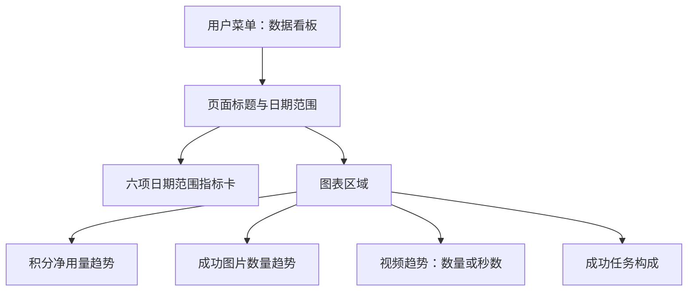
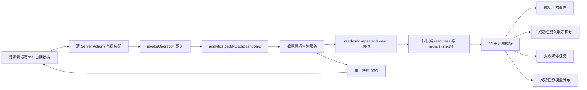
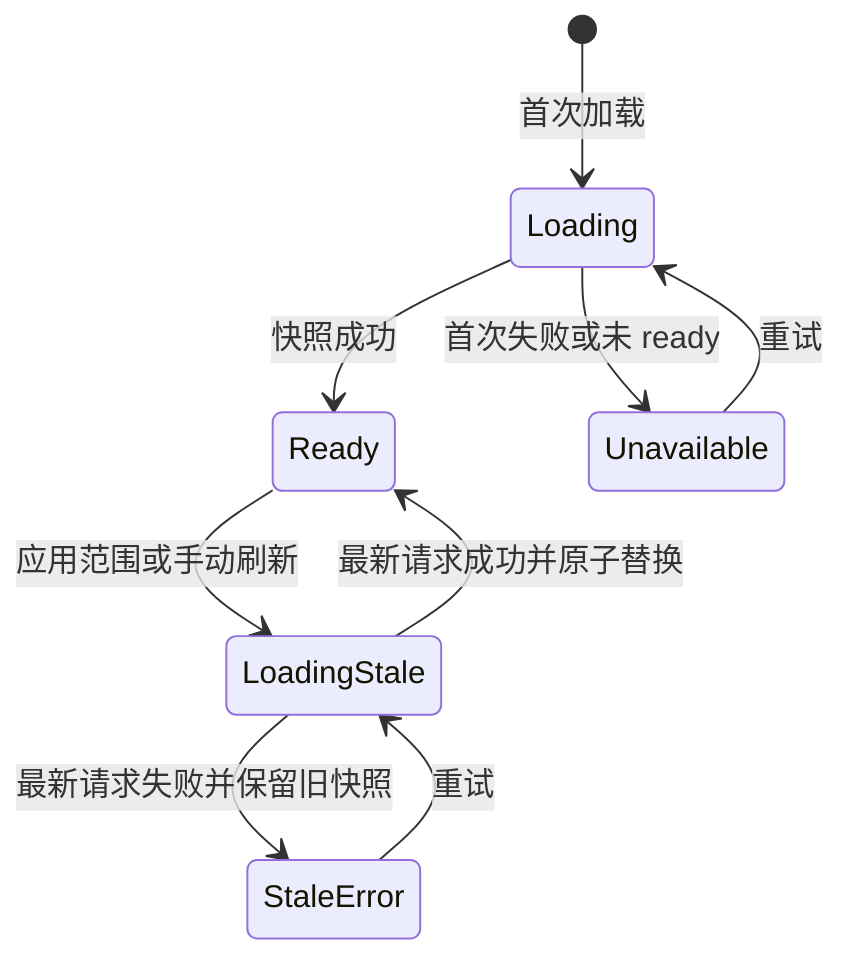

# 用户数据看板 - Plan

## Goal Capsule

- **Objective:** 为所有已登录用户新增独立的数据看板菜单页，让用户按日期范围查看本人成功产出、净积分消耗和使用趋势。
- **Product authority:** 本文固定用户侧菜单边界、日期口径、六项指标、图表分区、成功统计口径、空状态与首版非目标。
- **Technical authority:** Planning Contract 固定统一接口、范围解析、聚合查询、页面状态机、`lieflat-charts` 模板迁移、Agent 暴露边界与验证门槛；Product Contract 的产品口径优先于实现便利性。
- **Execution profile:** 按 U1-U6 的依赖顺序小步实施；先固定共享契约和聚合查询，再接入 Web 页面与图表，最后完成跨层验证。
- **Stop conditions:** 本人权限隔离失败、成功率或积分口径无法与权威事实对齐、最大范围图表在移动端不可读、读模型未 ready 或范围查询出现无界扫描时停止交付，不得在 UI 层伪造或补偿。
- **Tail ownership:** 实施者负责聚焦测试、性能取证、浏览器验收、完整质量门和接口盘点同步；计划文件不记录执行进度。
- **Open blockers:** 无。

---

## Product Contract

### Summary

新增独立的用户数据看板菜单页，采用报告式指标网格展示六项日期范围指标、三张独立趋势图和成功任务构成图。
页面默认按账号有效时区统计今天加前 6 个自然日，所有指标与图表始终使用同一个日期范围。

### Problem Frame

当前用户菜单只有控制台首页，没有独立的数据看板入口。
控制台首页已有固定近 24 小时与累计摘要、模型分布和近期创作，但无法作为按日期范围查看多类用户数据的通用分析页面。
用户需要一个稳定入口，在不混用累计值和周期值的前提下查看成功产出、积分消耗和每日变化。

### Key Decisions

- KTD1. **采用报告式指标网格。** (session-settled: user-directed — chosen over trend-first and balanced dual-chart layouts: a general-purpose dashboard should lead with scannable metrics.) Governs R3, R8, R18-R19。
- KTD2. **默认使用日历近 7 天。** (session-settled: user-directed — chosen over a rolling 168-hour window: users understand today plus the previous six calendar days as a date range.) Governs R4-R7。
- KTD3. **所有指标和图表共享日期范围。** (session-settled: user-directed — chosen over filtering charts only: metric cards must not mix lifetime values with selected-period charts.) Governs R5-R8, R11-R16。
- KTD4. **不同单位使用独立趋势图。** (session-settled: user-directed — chosen over one combined metric chart: image counts, video measures, and credits should not share a misleading axis.) Governs R11-R15。
- KTD5. **只按成功产出统计业务量。** (session-settled: user-directed — chosen over submitted-request counts: the dashboard should describe completed value rather than attempts.) Governs R8-R10, R12-R16。
- KTD6. **图表实现遵循 `lieflat-charts`。** (session-settled: user-directed — chosen over a generic chart-library theme: the user explicitly requires the dashboard charts to preserve audited Lieflat template geometry and visual rules.) 规划阶段必须先审计模板，再锁定每张图的真实模板和统一色彩系统。Governs R21。
- KTD7. **自然日使用账号有效时区。** (session-settled: user-approved — chosen over a fixed application-wide day boundary: the new page should stay consistent with existing per-user analytics while falling back to the application time zone.) 用户设置优先，应用时区兜底；浏览器本地时区不参与统计。Governs R4-R7, R11-R17。
- KTD8. **首版最多查询 30 个自然日。** (session-settled: user-approved — chosen over 90 or 366 daily points: the selected `lieflat-charts` daily templates must remain readable on mobile without downsampling or dishonest aggregation.) 默认和自定义范围都不得超过 30 个首尾包含的自然日。Governs R7, R20-R21。
- KTD9. **成功率只比较成功媒体任务与失败媒体任务。** (session-settled: user-approved — chosen over all submitted requests or a zero-valued empty denominator: processing tasks and completed text-only records do not describe media-generation success.) 成功数来自成功产物事件，失败数来自失败图片或视频媒体任务；无终态媒体任务时成功率为无数据。Governs R12, R18-R19。

<!-- ce-section: work-relationships -->
### How This Work Fits Together

本计划只拥有独立用户数据看板的菜单、页面和日期范围分析行为，当前理解不是对整个控制台的重做路线图。

- **Shares:** 与现有用户统计能力共享成功产出、积分净消耗、应用时区和本人数据隔离口径，不建立第二套互相冲突的统计真相。
- **Can proceed independently of:** 现有 `/dashboard` 首页继续保留当前近 24 小时与累计概览，本计划不要求先改造首页。
- **Can proceed independently of:** 使用记录页继续承担明细核对；从图表下钻到明细属于后续候选，不是当前依赖。
- **Resolved:** Planning Contract 的 `lieflat-charts` Template Audit 已确定图片 F2、积分 F3、视频 L3 和任务构成 G4。

### Actors

- A1. **已登录用户：** 通过菜单进入本人数据看板，选择日期范围，查看指标和图表，并切换视频趋势单位。
- A2. **用户统计能力：** 按当前用户、账号有效时区和成功统计口径返回同一日期范围的数据，拒绝越权或非法范围。

### Requirements

**入口与页面边界**

- R1. 所有已登录用户必须能在用户侧导航中看到独立的“数据看板”菜单入口。
- R2. 数据看板必须只展示当前登录用户的数据，不得因管理员身份、菜单分组或请求参数读取其他用户数据。
- R3. 数据看板必须采用报告式网格组织页面，现有 `/dashboard` 首页内容和默认近 24 小时口径不因本功能被替换。

**日期范围**

- R4. 页面首次打开必须默认选择账号有效时区中的今天和前 6 个自然日，首尾日期均包含在统计范围内；用户未设置时区时回退应用时区。
- R5. 用户修改日期范围后，六项指标卡、三张趋势图和成功任务构成图必须切换到同一个新范围。
- R6. 趋势图必须按账号有效时区的自然日分桶，并为范围内没有成功产出的日期保留连续时间位置；浏览器本地时区不得改变桶边界。
- R7. 日期范围必须拒绝结束日期早于开始日期、未来日期或超过 30 个首尾包含自然日的输入，并保留当前有效数据和筛选值。

**指标卡**

- R8. 页面必须展示生成图片数、视频秒数、积分消耗、成功率、活跃天数和常用模型六项指标，全部按当前日期范围统计。
- R9. 生成图片数必须按成功完成的图片产物数量计算；视频秒数必须按成功完成的视频产物时长计算；一次操作产生多个图片产物时按实际产物数量累计。所有成功产出按源任务创建日期归入日期范围和自然日桶。
- R10. 积分消耗必须显示当前日期范围内成功产物关联扣费的非负净消耗，退款修正原消耗，不形成误导性的负用量；计费 operation 的业务创建时间必须与对应源任务创建时间使用同一归属日。
- R11. 活跃天数必须统计范围内至少有一个成功产物的任务创建自然日数量；常用模型必须按范围内成功媒体任务数确定，一次多图任务只计一次，数量并列时按规范模型 ID 升序稳定选择，无成功任务时显示无数据。
- R12. 成功率必须按任务创建日期归入当前范围，以成功媒体任务数除以成功与失败媒体任务数之和；进行中任务、未知状态和合法但无媒体产物的 completed 图片记录不得进入分母，分母为零时返回无数据。

**图表**

- R13. 积分净用量趋势必须使用独立图表，按自然日展示 R10 的净消耗变化。
- R14. 成功图片数量趋势必须使用独立图表，按自然日展示 R9 的图片产物数量变化。
- R15. 视频趋势必须使用独立图表，并允许在成功视频产物数量和成功视频秒数之间切换；切换不得改变日期范围或其他页面数据。
- R16. 成功任务构成图必须展示当前日期范围内成功图片任务和成功视频任务的构成，不得纳入失败、取消或进行中任务。
- R17. 图表必须明确标注当前指标、单位和日期范围，不得把图片、视频和积分放入同一混合纵轴，也不得在首版加入周期对比线。

**状态、适配与图表约束**

- R18. 当前日期范围没有可统计数据时，页面必须保留六项指标和全部图表区域，并明确区分数值 0、无数据和暂不可用。
- R19. 加载或刷新失败时，页面必须保留最近一次成功应用的日期范围和有效数据，标明失败或陈旧状态，不得把失败结果静默替换为 0；首次加载失败没有旧快照时必须显示可恢复的不可用状态。
- R20. 页面必须在常见桌面和移动宽度下保持指标顺序、图表单位和筛选上下文可读，并为键盘、触摸和屏幕阅读器提供等价的筛选状态、逐日数据和错误反馈。
- R21. 图表实现必须遵循 `lieflat-charts` skill 的模板优先、单图单结论、统一色彩系统和单位诚实规则，不得退回图表库默认样式或未经模板审计的新造图型。

### Layout Shape

### Key Flows

- F1. **首次查看数据看板**
  - **Trigger:** A1 从用户菜单进入数据看板。
  - **Actors:** A1、A2。
  - **Steps:** 页面初始化为账号有效时区中的今天和前 6 个自然日，并加载同一范围的六项指标、三张趋势图和任务构成图。
  - **Outcome:** 用户无需操作即可看到一致的近 7 个自然日数据。
  - **Covered by:** R1-R6, R8-R18。
- F2. **修改日期范围**
  - **Trigger:** A1 选择新的开始日期和结束日期。
  - **Actors:** A1、A2。
  - **Steps:** 系统验证日期范围并重新加载所有指标和图表；非法、超出 30 天或查询失败的范围不替换当前有效视图。
  - **Outcome:** 页面不存在部分区块仍显示旧范围或累计值的混合状态。
  - **Covered by:** R5-R7, R8-R19。
- F3. **切换视频趋势单位**
  - **Trigger:** A1 在视频趋势图中切换“视频数量”或“视频秒数”。
  - **Actors:** A1。
  - **Steps:** 视频图表使用同一日期范围切换单位，其他指标卡和图表保持不变。
  - **Outcome:** 用户能分别理解视频产物数量和时长变化，不产生混合单位。
  - **Covered by:** R15, R17。
- F4. **查看空数据或失败状态**
  - **Trigger:** 所选范围没有成功产出，或统计查询暂时失败。
  - **Actors:** A1、A2。
  - **Steps:** 无数据时保留完整页面结构并说明无数据；刷新失败时保留已应用范围和最近一次有效结果，首次失败时提供可重试的不可用状态。
  - **Outcome:** 用户不会把无数据、真实零值和服务故障误认为同一种状态。
  - **Covered by:** R18-R19。

### Acceptance Examples

- AE1. **Covers R4-R6.** 给定用户有效时区为 Asia/Shanghai 且当前日期为 2026-08-09，当用户首次进入数据看板时，所有指标和图表统计 2026-08-03 至 2026-08-09；今天的数据统一截止同一次查询捕获的 `asOf`。
- AE2. **Covers R5, R8-R17.** 给定用户把范围改为 2026-07-02 至 2026-07-31，当查询完成时，六项指标、三张趋势图和任务构成图全部只反映该范围，不保留累计值或前一范围数据。
- AE3. **Covers R9-R12.** 给定范围内有一次成功生图操作产出 4 张图片、一条成功 5 秒视频和一条失败媒体任务，当页面加载时，图片数增加 4、视频秒数增加 5、成功任务数增加 2、失败任务数增加 1，成功率为三分之二，失败任务不增加产出量。
- AE4. **Covers R10, R13.** 给定成功产物扣除 100 积分后关联退款 40，当页面加载对应日期时，积分指标和积分趋势均显示 60 的净消耗，不显示 100 或负数。
- AE5. **Covers R15, R17.** 给定视频趋势当前显示成功视频数量，当用户切换到视频秒数时，图表纵轴和数据切换为秒，日期范围、图片趋势和积分趋势不变。
- AE6. **Covers R16, R18.** 给定所选范围只有失败或取消任务，当页面加载时，成功任务构成图显示无成功任务，不能把失败任务计入图片或视频构成。
- AE7. **Covers R2, R7, R19.** 给定用户提交非法日期范围或尝试指定其他用户身份，当请求被拒绝时，页面保留当前有效范围和数据，并且不展示任何其他用户信息。
- AE8. **Covers R20-R21.** 给定页面在桌面和移动宽度展示，当用户查看六项指标和四个图表区域时，单位、范围和视频切换仍可读，图表保持 `lieflat-charts` 选定模板的核心数据编码。
- AE9. **Covers R12, R18.** 给定范围内没有成功或失败媒体任务，成功率显示无数据；给定只有失败媒体任务，成功率显示 0%，其余成功产出指标保持真实 0。
- AE10. **Covers R7, R20-R21.** 给定用户在已有有效视图中选择 31 个自然日，系统拒绝该范围并保留当前已应用范围；给定用户首次打开超限深链，系统回退默认近 7 天并清理为无日期参数 URL；30 天范围在窄屏仍保留逐日位置和可读单位。

### Success Criteria

- 用户在一次页面浏览中能确认当前日期范围，并理解六项指标与全部图表都属于该范围。
- 图片、视频和积分使用独立且诚实的单位，页面不存在混合纵轴或请求数冒充成功产出量。
- 默认近 7 天、30 天上限、日期切换、视频单位切换、空数据和查询失败状态均有明确且一致的行为。
- 所有查询只返回当前用户数据，非法范围和身份输入不会改变已有有效视图。
- 每张图在规划阶段完成 `lieflat-charts` 候选审计、模板编号记录和统一色彩系统选择。

### Scope Boundaries

**Deferred for later**

- 与上一段等长日期范围的环比比较。
- 点击指标卡或图表下钻到使用记录明细。
- 数据导出、定时报表、共享链接和实时刷新。
- 将数据看板作为 User MCP 外部工具暴露；统一接口层首版保持可供站内 Agent 以用户 Principal 调用。
- 重新设计或替换现有 `/dashboard` 首页。

**Outside this work unit**

- 管理员全局统计和跨用户比较。
- 以提交请求数替代成功产出量的运营报表。
- 不经过 `lieflat-charts` 模板审计的自定义图表风格。

### Dependencies / Assumptions

- 现有用户统计能力能够提供或扩展为当前日期范围所需的成功图片数、视频数量、视频秒数、成功产物关联积分净消耗和模型分布。
- 财务统计继续以积分账本为真相；本计划不改变扣费、退款或账本幂等规则。
- 账号有效时区继续作为自然日边界的唯一权威：用户设置优先、应用时区兜底，浏览器本地时区不得改变同一用户请求的统计口径。
- `lieflat-charts` 是图表实现的强制约束；规划阶段必须按其流程比较候选模板并记录淘汰理由。

### Outstanding Questions

无。成功率、时区、最大日期跨度、图表模板和 User MCP 范围均已在 Planning Contract 中解决。

### Sources / Research

- `docs/plans/2026-07-21-001-feat-user-dashboard-analytics-plan.md`：既有用户控制台统计的产品口径和统一接口背景。
- `packages/shared/src/config/nav.ts`：当前用户导航没有独立数据看板入口。
- `apps/web/src/app/[locale]/(dashboard)/dashboard/page.tsx`：现有控制台首页固定近 24 小时和累计摘要的页面边界。
- `apps/web/src/features/dashboard/components/dashboard-analytics-panel.tsx`：现有摘要、模型分布、近期创作和刷新行为。
- `apps/web/src/features/dashboard/output-usage-read-model.ts`：成功产物事件每个源任务最多一行，且 `operation_created_at` 复制源图片或视频任务的 `createdAt`。
- `packages/shared/src/analytics/contracts.ts`：已有小时、按天、近 7 天和自定义范围契约。
- `packages/shared/src/analytics/range.ts`：已有应用时区、未来范围和最大跨度校验。
- `apps/web/src/server/uol-bindings.ts`：现有本人 analytics operation 使用账号有效时区并实施读模型 readiness 门禁。
- `packages/database/src/schema.ts`：现有成功产物事件、积分操作投影、图片和视频终态与用户时间索引。
- `apps/web/src/features/usage-log/repository.ts`：现有图片/视频媒体任务状态与图片模式分类模式。
- `lieflat-charts` catalog 与 bundled gallery templates：本次模板审计的外部研究输入。

---

## Planning Contract

Product Contract preservation: R1-R21、A1-A2、F1-F4 和 AE1-AE10 的稳定 ID 保持不变；本次最终确认将 KTD6-KTD18 标记为用户已确认决策，并原地解决时区、30 天上限、跨指标日期归属、成功率、图表模板、快照一致性、Web 限流和 User MCP 范围，没有删除或弱化既有产品要求。

### Deferred Question Resolutions

- 成功率固定为成功媒体任务数除以成功与失败媒体任务数之和。成功数来自 `user_output_usage_event` 事件行，失败数来自范围内 `generation.status = failed` 与 `video_generation.status = failed` 的媒体任务；图片一次产出多张仍只算一个成功任务，pending、running、未知状态和 completed 文本-only 图片记录不进入分母。
- 所有日期范围、任务归属、活跃天数和图表日桶沿用账号有效时区，即用户设置优先、应用时区兜底。范围包含今天时，查询统一截止一次调用捕获的 `asOf`，避免同一快照的子查询使用不同当前时刻。
- 首版范围上限为 30 个首尾包含自然日，快捷范围提供近 7 天、近 30 天和自定义；不继承 shared 趋势契约的 366 天上限。
- 所有成功产出、活跃天数、常用模型、成功任务构成和成功率统一按源任务创建日期归属；`user_output_usage_event.operation_created_at` 与 `credit_usage_operation.operation_created_at` 都是该业务操作的创建时间，退款只修正原归属日净消耗。
- 新能力注册为单个整页聚合 operation，现有近 24 小时摘要和单指标趋势 operation 保持兼容，不通过多次调用拼装新页面。
- User MCP 外部暴露延后；首版 operation 只接受真实 user Principal，不加入 User MCP 工具白名单，也不允许 external API key、system、cron、webhook 或 proxy Principal 绕过。

### Key Technical Decisions

- KTD10. **新增 `analytics.getMyDataDashboard` 聚合 operation。** (session-settled: user-approved — chosen over extending the existing summary/trends operations: one dedicated operation can return a single coherent dashboard snapshot without changing current callers.) operation 使用 strict 日级范围输入，不接受 `userId`，一次返回统一 `asOf`、账号有效时区、规范化范围、六项指标、逐日多指标桶和成功任务构成。它声明 `access: { kind: "user" }`、只读、非破坏性、天然幂等且无副作用；现有 `analytics.getMyUsageSummary` 与 `analytics.getMyUsageTrends` 不改语义。Governs R2, R4-R19。
- KTD11. **为数据看板建立专用范围契约而不改变既有趋势范围。** (session-settled: user-approved — chosen over reusing or narrowing the existing analytics range contract: the dashboard needs a strict 30-day daily contract while existing operations retain compatibility.) 新 resolver 只处理空输入默认近 7 天或成对的 `startDate`/`endDate`，按账号有效时区解析 UTC 半开区间，最多 30 桶；today 桶的有效结束使用同一 `asOf`，历史日期使用下一日零点。输入拒绝单边日期、非法 Gregorian 日期、反向、未来、超限和未知字段。Governs R4-R7, R17-R19。
- KTD12. **复用现有窄型读模型和用户时间索引，不新增迁移。** (session-settled: user-approved — chosen over adding a persistent dashboard read model now: existing immutable usage projections and indexed task tables can support a bounded 30-day first version, subject to measured performance gates.) 成功产出日桶按 `user_output_usage_event.operation_created_at` 聚合图片产物数、图片任务数、视频任务数、视频秒数和任务构成；该列来自源图片或视频任务的创建时间。活跃天数与产出总计从连续日桶派生。失败任务按源表 `created_at` 对当前用户和最多 30 天执行有界终态查询。Governs R8-R9, R11-R16。
- KTD13. **积分只统计成功产物关联的净消耗。** (session-settled: user-approved — chosen over summing all account consumption or reading historical generation fields: the dashboard should explain the credits attributable to successful media while preserving the ledger-backed net amount.) 成功事件按用户、任务 ID 和 output kind 对应的计费 operation type 关联 `credit_usage_operation`，按与源任务创建时间一致的 `operation_created_at` 归入原操作自然日并求和 `net_consumed`；免费成功任务允许没有计费 operation，存在 operation 但业务创建时间与成功事件不一致时视为读模型损坏并整体失败。失败但收费的任务、无成功产物的其他消费和退款发生日都不得改变该图表口径。积分字段使用有限非负小数 schema，不能复用整数趋势桶。Governs R10, R13。
- KTD14. **页面用原子快照状态机避免范围与数据错配。** (session-settled: user-approved — chosen over independently updating filters, metrics, and charts: an atomic applied range and snapshot prevents stale responses from creating mixed-period views.) 客户端区分日期草稿、已应用范围、最近有效快照和 idle/loading/stale/error 状态；只有最新请求成功后才原子替换全部指标与图表并更新 URL。失败保留旧快照及其范围，首次失败进入可重试不可用态；视频数量/秒数切换只读同一快照，不发请求。Governs R5, R7, R15, R18-R19。
- KTD15. **将 `lieflat-charts` 真实 SVG 编码移植为 React 组件。** (session-settled: user-approved — chosen over embedding gallery HTML or applying a custom theme to a generic chart library: typed React SVG preserves the selected templates while meeting application accessibility and security constraints.) 不嵌入 gallery HTML、iframe 或图表库默认主题；保留所选模板的逐日发丝线、点位、标签、比例单位和 reduced-motion 语义。四张图内联同一 Mono token ladder 到局部 chart CSS variables，不混入应用 `primary` 或其它色系；页面 chrome 可随主题变化，但图表数据编码保持统一 Mono。每张图提供持续可见的单位、摘要和可访问文本，不依赖 hover 才能理解。Governs R13-R21。
- KTD16. **首版 Agent 边界停在统一接口层。** (session-settled: user-approved — chosen over exposing a new User MCP tool immediately: the user-facing dashboard can ship without expanding the externally discoverable tool surface.) operation 不标记 human-only，站内 Agent 未来可用用户 Principal 直调；User MCP factory 与 route 继续拒绝该工具，Admin MCP 不暴露。Governs R2 and the deferred MCP scope boundary。
- KTD17. **上线门禁与整页数据属于同一数据库快照。** (session-settled: user-approved — chosen over checking readiness or capturing time before the aggregation transaction: one repeatable-read snapshot prevents readiness and metric queries from observing different database states.) 聚合服务开启 read-only repeatable-read 事务，第一条 SQL 同时读取 `output_usage`、`credit_usage` readiness 和 PostgreSQL `transaction_timestamp()`；任一读模型不是 version 1 ready 时立即返回 `not_ready`，否则以同一快照的 `asOf` 解析范围并读取全部数据。任一仓储查询、输出 invariant 或 schema 校验失败时整个 operation 失败，不返回部分数据或把异常归零。Governs R5, R18-R19。
- KTD18. **Web Server Action 使用现有 per-user 限流。** (session-settled: user-approved — chosen over relying only on the 30-day query bound or infrastructure throttling: each refresh fans out to several database aggregates and needs explicit per-account abuse protection.) 新 operation 在进入聚合事务前，以 `analytics-dashboard:<userId>` 作为隔离键复用现有 `global` 限流桶；Upstash 未配置时沿用进程内安全回退。限流失败返回 `rate_limited`，已有快照保持 stale，首次加载显示可重试状态。Governs R2, R18-R19。

### `lieflat-charts` Template Audit

每个目标先比较至少三个能承载同一数据本体的候选，再锁定真实 gallery 卡片和渲染块；Glance 只因本页明确是 dashboard 且需要三秒快读时进入构成图候选。

| Target | Candidate and real template | Decision |
|---|---|---|
| 成功图片数量趋势 | F2 Hairline Line · `templates/basics-gallery.html` · “Thirty days of sign-ups” | 选用；≤30 天逐日精确读数、整数点和峰值标注最符合图片产物数量 |
| 成功图片数量趋势 | F3 Hairline Area · `templates/basics-gallery.html` · “Concurrent users, filled with days” | 淘汰；更强调总体形态，面积会弱化离散图片数的逐日精确读取 |
| 成功图片数量趋势 | L3 Barcode Lollipop · `templates/lupi-gallery.html` · “Ninety days as a barcode” | 淘汰；可承载日序列，但更适合高密度长序列，默认 7 天图片图会显得过疏 |
| 成功图片数量趋势 | G1 Range Capsules · `templates/glance-gallery.html` · “Daily active range” | 淘汰；模板本体要求每天的 min-max 区间，本数据每天只有一个标量 |
| 积分净用量趋势 | F3 Hairline Area · `templates/basics-gallery.html` · “Concurrent users, filled with days” | 选用；逐日非负净消耗适合看总量形态，副标题明确 area = 当日积分而非累计余额 |
| 积分净用量趋势 | F2 Hairline Line · `templates/basics-gallery.html` · “Thirty days of sign-ups” | 淘汰；语义可用但已分配给更需要精确整数读数的图片趋势，同页模板不得重复 |
| 积分净用量趋势 | L3 Barcode Lollipop · `templates/lupi-gallery.html` · “Ninety days as a barcode” | 淘汰；积分默认范围较短，条码肌理不如面积形态直接，且模板留给视频切换 |
| 积分净用量趋势 | G1 Range Capsules · `templates/glance-gallery.html` · “Daily active range” | 淘汰；单日净消耗没有 min-max 区间，不能诚实使用范围胶囊 |
| 视频趋势 | L3 Barcode Lollipop · `templates/lupi-gallery.html` · “Ninety days as a barcode” | 选用；每根发丝对应一个真实自然日，可在数量与秒数之间切换而不混合单位；7 天时放宽间距并显示全部日期，30 天时保持条码密度 |
| 视频趋势 | F2 Hairline Line · `templates/basics-gallery.html` · “Thirty days of sign-ups” | 淘汰；数据语义适配但已分配给图片，同页复用会削弱图表区分度 |
| 视频趋势 | F3 Hairline Area · `templates/basics-gallery.html` · “Concurrent users, filled with days” | 淘汰；数量与秒数切换时面积视觉容易被误读为累计量，且模板已分配给积分 |
| 视频趋势 | G1 Range Capsules · `templates/glance-gallery.html` · “Daily active range” | 淘汰；两种模式都是单值序列，不具备模板要求的日内范围 |
| 成功任务构成 | G4 Dot Waffle · `templates/glance-gallery.html` · “Where sign-ups come from” | 选用；本页是 dashboard，两类 100% 构成需要快读；最大余数法分配 100 个百分比点并持续展示原始任务数 |
| 成功任务构成 | L14 Hundred Field · `templates/lupi-gallery.html` · “A hundred of us, four minds” | 淘汰；两类 dashboard 构成不需要慢读星群布局，且百分比点容易被误认成真实任务个体 |
| 成功任务构成 | F4 Tick Donut · `templates/basics-gallery.html` · “Where the traffic comes from” | 淘汰；移动端外围段标签和触摸阅读成本高于平面 Waffle |
| 成功任务构成 | F7 Stacked Rungs · `templates/basics-gallery.html` · “Where each region's revenue sits” | 淘汰；能编码占比但更适合多组堆叠比较，本页只有一个两类总体构成 |

四张图使用不重复模板和同一 Mono 色彩系统：局部 chart token 固定纸灰、炭黑和七级灰阶，重要性由明度表达；不混入 `primary`、品牌色或其它预设。Waffle 的一个点表示 1% 而非一个任务；构成为零时不生成比例点。所有核心 SVG 结构必须可追溯到表中指定的 gallery 卡片和同名渲染注释块。

---

## High-Level Technical Design

以下图示是方向性设计，用于固定边界与数据流，不是可复制的实现代码。

查询服务返回一组连续自然日桶，每桶同时包含 `imageCount`、`imageTaskCount`、`videoCount`、`videoSeconds` 和 `creditsConsumed`。指标总计、活跃天数和任务构成从同一桶集合派生；成功率与常用模型来自同一规范化范围内的额外有界聚合。输出 schema 校验桶数量、日期连续性、总计相等、图片产物数与任务数不混用、构成相等和成功率分母关系，防止跨查询漂移静默进入 UI。

---

## Implementation Units

### U1. Data Dashboard Contracts and Range Semantics

- **Goal:** 建立整页快照的 strict 输入输出、账号有效时区自然日范围、30 天上限和跨字段 invariant，作为 UOL、查询服务、页面状态和图表的唯一协议。
- **Requirements:** R2, R4-R7, R8-R19；F1-F3；AE1-AE5, AE7, AE9-AE10；KTD7-KTD11, KTD17。
- **Dependencies:** 无。
- **Files:**
  - `packages/shared/src/analytics/data-dashboard-contracts.ts`
  - `packages/shared/src/analytics/data-dashboard-contracts.test.ts`
  - `packages/shared/src/analytics/data-dashboard-range.ts`
  - `packages/shared/src/analytics/data-dashboard-range.test.ts`
  - `packages/shared/src/analytics/contracts.ts`
  - `packages/shared/src/uol/operations/analytics.ts`
  - `packages/shared/src/uol/operations/analytics.test.ts`
- **Approach:** 新建专用 schema，输入允许空对象或成对的 `startDate`/`endDate`，不复用带 metric 和 granularity 的旧趋势输入。输出包含 `asOf`、`timeZone`、本地 `today`、规范化日期与 UTC 边界、六项指标、连续日桶和任务构成；每个日桶分别保存 `imageCount` 与 `imageTaskCount`，成功率同时返回 succeeded、failed、terminal 与可空 rate，常用模型返回可空稳定项。resolver 显式接收 `timeZone` 与 `asOf`，复用 shared Gregorian 日期和 IANA 时区工具，绝不读取浏览器或运行时设置。Zod `superRefine` 校验日桶连续、各桶范围不重叠、桶和总计一致、构成使用图片/视频任务数且与成功任务一致、`terminal = succeeded + failed`，并限制最多 30 桶。
- **Patterns:** 参考 `packages/shared/src/analytics/contracts.ts`、`packages/shared/src/analytics/range.ts` 和 `packages/shared/src/analytics/series.ts` 的 DB-free 契约、UTC 半开范围与连续补零模式；保留旧导出以避免 `/dashboard` 首页和现有调用方回归。
- **Test scenarios:**
  1. 空输入在 Asia/Shanghai 的 2026-08-09 解析为 2026-08-03 至 2026-08-09，并以同一 `asOf` 截止今天桶。
  2. America/Los_Angeles 跨春季和秋季 DST 的 7 天、30 天范围仍产生正确数量的自然日桶，每桶使用真实 UTC 边界而不是固定 24 小时。
  3. 30 个首尾包含自然日通过，31 天、反向、未来、非法日期、只给一个边界和未知字段拒绝为稳定 validation error。
  4. strict schema 拒绝 `userId`、granularity、metric 和任意身份字段；输出拒绝非有限积分、负数、断裂日期、错误总计、把 `imageCount` 当作图片任务数和不一致构成。
  5. 成功率分母为零时只允许 `rate: null`；只有失败任务时允许 rate 为 0；成功与失败计数不匹配时拒绝输出。
  6. operation 元数据断言为 analytics domain、user-only、read-only、natural idempotency、无副作用且未标记 human-only。
- **Verification:** shared 测试证明模块不 import `@repo/database`、TypeScript strict 无 `any`；现有 usage summary/trends 契约测试保持不变。

### U2. Bounded Dashboard Aggregation Service

- **Goal:** 使用现有成功事件、积分投影和媒体任务表一次构造完整本人快照，覆盖六项指标、四组图表数据和 readiness 失败语义，不引入新表或回填。
- **Requirements:** R2, R5-R16, R18-R19；F1-F4；AE2-AE7, AE9；KTD9, KTD12-KTD13, KTD17。
- **Dependencies:** U1。
- **Files:**
  - `apps/web/src/features/data-dashboard/data-dashboard-service.ts`
  - `apps/web/src/features/data-dashboard/data-dashboard-service.test.ts`
  - `packages/integration-tests/src/data-dashboard-snapshot.test.ts`
  - `packages/integration-tests/package.json`
- **Approach:** 定义可注入的最小 repository，生产服务以 Drizzle `db.transaction` 开启 `isolationLevel: "repeatable read"`、`accessMode: "read only"` 的一致快照。事务第一条 SQL 同时读取两个 analytics readiness 行和 PostgreSQL `transaction_timestamp()`，缺行、版本错误或非 ready 时在执行聚合前失败；随后用 binding 提供的账号有效时区解析输入范围，并让同一 transaction handle 依次执行四类有界查询：成功事件按任务创建日聚合图片产物数、图片任务数、视频任务数和视频秒数；成功事件关联匹配的计费 operation 按同一任务创建日汇总净消耗；成功事件关联图片/视频源任务聚合模型；图片和视频源表按任务创建时间统计范围内失败媒体任务。失败聚合同时检查同一 output kind、source task 和 user 是否存在成功事件；发现成功/失败重叠时将其作为读模型损坏整体失败，不通过重复计数或静默偏向任一状态继续。服务使用 shared 连续日桶补零，派生总图片数、视频数、视频秒数、积分、活跃天数和构成；成功率的成功与失败任务都按源图片或视频任务创建时间落入规范化范围，分子取成功事件对应的唯一任务数，分母再增加失败媒体任务。模型按任务数降序、模型 ID 升序稳定选择，缺少源模型时沿用真实 `unknown` 分类。所有数值经安全整数或有限非负小数收窄；任一 readiness、repository、范围解析或输出 invariant 失败时回滚只读事务并整体拒绝，不返回部分 DTO。
- **Patterns:** 复用 `apps/web/src/features/dashboard/analytics-service.ts` 的 userId + `[start,end)` 谓词、自然日 bucket 表达式、仓储注入、聚合值防御校验和 readiness 读取；复用 `apps/web/src/features/usage-log/repository.ts` 的图片媒体模式与视频状态分类，不从 `generation.creditsConsumed` 推断财务数据。
- **Execution note:** 先以 DB-free repository 测试固定成功率和积分口径，再接生产 SQL；不要为了整页快照把既有 service 扩成更多职责，也不要在读取时扫描 `credits_transaction` 或解析账本 JSON。
- **Test scenarios:**
  1. 一次成功图片任务产出 4 张、一次成功视频任务产出 5 秒时，图片数为 4、图片任务数为 1、视频数量为 1、视频秒数为 5、成功任务构成为 1:1。
  2. 同日多个成功事件合并，缺失日期补零；活跃天数只统计至少一个成功事件的自然日，失败任务不增加活跃天数。
  3. 成功任务扣 100 后关联退款 40，指标和原操作日积分桶均为 60；退款发生日不出现负值。
  4. 失败但收费的任务、手工消费、Chat 文本消费和无成功事件的 operation 不进入数据看板积分；免费成功任务允许没有 operation，积分为 0 但仍计产出；存在匹配 operation 但 `operation_created_at` 与成功事件不一致时整页失败。
  5. 成功事件 2 条、失败媒体任务 1 条时成功率为三分之二；completed 文本-only 图片记录、pending 图片、running 视频和未知状态均不进入分母。
  6. 无终态任务返回 `rate: null`，只有失败任务返回 0%，常用模型为空；成功模型并列时按规范模型 ID 稳定选择，`unknown` 不被错误折叠为空态。
  7. repository 返回负值、非整数产出、非有限积分、范围外桶或相互矛盾任务数时服务显式失败，不生成部分 DTO。
  8. 生产查询都包含当前 userId 和最大 30 天半开范围；成功、积分、模型和失败查询没有 N+1、无界历史扫描或跨用户 join。
  9. 在 opt-in PostgreSQL integration test 中，于首条 readiness/`transaction_timestamp()` SQL 后从独立连接切换 readiness、提交新的成功事件或退款修正；后续查询仍只看到 repeatable-read 快照建立时的状态与数据，响应中的产出、积分、模型和成功率不得形成混合快照。
  10. 任务在范围内创建但跨日或跨范围完成时仍按创建日进入成功率；范围外创建但范围内完成的任务不进入成功率，成功与失败两端使用同一创建日期口径。
  11. 人为构造同一任务既有成功产物事件又处于 failed 状态时，repository 返回重叠计数并使整页查询失败，不把该任务同时加入成功和失败分母。
- **Verification:** 运行 DB-free service 聚焦测试和 `@repo/integration-tests` 的 PostgreSQL 快照测试；在代表性重度用户数据上检查最大范围查询计划使用现有用户时间索引，记录行数与响应体积上界，不以新增迁移掩盖查询问题。

### U3. UOL Binding, Web Adapter, and Agent Boundary

- **Goal:** 把聚合服务绑定到统一 operation，通过首屏装配和 Server Action 薄适配给 Web 使用，同时保持现有 analytics 调用方兼容并显式维持 User MCP 不暴露。
- **Requirements:** R2, R4-R7, R18-R19；F1-F2, F4；AE1, AE7, AE9-AE10；KTD10-KTD11, KTD14, KTD16-KTD18。
- **Dependencies:** U1、U2。
- **Files:**
  - `apps/web/src/server/uol-bindings/analytics.ts`
  - `apps/web/src/server/uol-bindings.ts`
  - `apps/web/src/server/uol-bindings/analytics.test.ts`
  - `apps/web/src/features/data-dashboard/data-dashboard-page-data.ts`
  - `apps/web/src/features/data-dashboard/data-dashboard-page-data.test.ts`
  - `apps/web/src/features/data-dashboard/actions.ts`
  - `apps/web/src/features/data-dashboard/actions.test.ts`
  - `packages/shared/src/mcp/tool-factory.test.ts`
  - `apps/web/src/app/api/mcp/user/route.test.ts`
  - `docs/plan/2026-05-31-feature-interface-inventory.md`
- **Approach:** 将现有 analytics binding 从聚合文件抽到专用模块，并绑定新 operation。binding 只接受 `principal.type = user`，获取账号有效时区，并以 `analytics-dashboard:<userId>` 复用现有 `global` per-user 限流桶，再把 strict 原始范围输入、userId 与时区交给 U2 服务；readiness、唯一 `asOf`、范围解析和全部数据读取由服务在同一个数据库快照内完成。binding 最后用 shared output schema 复核。RSC page-data 与 protected action 都只构造本人 Principal 并调用 `invokeOperation`，不直接访问 service 或 DB；action 返回可区分 validation、not_ready、rate_limited、timeout、unauthenticated 和 unavailable 的安全状态。同步接口盘点，但不把 operation 加入 User MCP allowlist；测试显式证明工具不可列举、不可直接调用，Admin MCP 也无此工具。
- **Patterns:** 参考现有 analytics bindings 的 readiness 与 `getUserTimeZone`，参考 `apps/web/src/features/dashboard/dashboard-data.ts` 的 session Principal 装配，以及 protected action 调用 UOL 的既有业务 action 模式。
- **Test scenarios:**
  1. 普通用户、管理员和观察管理员以 session user Principal 查询时都只能读取自己的 userId；输入伪造 `userId` 在 shared schema 处拒绝。
  2. external API key、MCP API key、system、cron、webhook、proxy 和匿名 Principal 均不能调用新 operation；binding 不从参数恢复身份。
  3. 固定同一时区与时钟时，首屏 page-data 和 action 对相同范围返回同一 DTO，且各自只调用一次 operation。
  4. output 或 credit read model 任一非 ready 时在同一事务首条 SQL 后不执行聚合查询并返回 not_ready；service 抛错不被转换为零快照。
  5. action 对反向、未来、31 天和畸形日期返回可定位 validation 结果，不修改服务器端身份或范围。
  6. User MCP `tools/list` 不出现新 operation，直接 `tools/call` 返回不可用且不触发 `invokeOperation`；既有唯一工具集合和 analytics 旧工具排除断言保持安全。
  7. 接口盘点记录 operation 输入、输出、权限、只读性、Web transport 和 User MCP deferred 状态，与 registry 元数据一致。
  8. 同一用户超过现有 `global` 桶阈值时返回 `rate_limited` 且不进入 U2 事务；不同用户使用隔离键互不影响，Upstash 未配置时进程内回退仍生效。
- **Verification:** 运行 registry、binding、page-data、action 和 MCP factory/route 聚焦测试；静态检查 Web 适配层不 import 数据库 schema 或查询 service。

### U4. Navigation, Route, Metrics, and Snapshot State

- **Goal:** 新增独立 `/dashboard/analytics` 页面、侧栏入口、日期选择器、六项指标和可恢复快照状态，在桌面与移动端保持同一范围语义且不改变现有 `/dashboard` 首页。
- **Requirements:** R1-R8, R11-R12, R15, R17-R20；F1-F4；AE1-AE3, AE5, AE7, AE9-AE10；KTD1-KTD3, KTD7-KTD9, KTD14, KTD18。
- **Dependencies:** U3。
- **Files:**
  - `packages/shared/src/config/nav.ts`
  - `apps/web/src/features/dashboard/components/sidebar.tsx`
  - `apps/web/src/features/dashboard/navigation-i18n-contract.test.ts`
  - `apps/web/messages/en.json`
  - `apps/web/messages/zh.json`
  - `apps/web/src/app/[locale]/(dashboard)/dashboard/analytics/page.tsx`
  - `apps/web/src/app/[locale]/(dashboard)/dashboard/analytics/loading.tsx`
  - `apps/web/src/features/data-dashboard/data-dashboard-panel.tsx`
  - `apps/web/src/features/data-dashboard/data-dashboard-panel.test.ts`
  - `apps/web/src/features/data-dashboard/data-dashboard-date-range-picker.tsx`
  - `apps/web/src/features/data-dashboard/data-dashboard-date-range-picker.test.ts`
  - `apps/web/src/features/data-dashboard/data-dashboard-query.ts`
  - `apps/web/src/features/data-dashboard/data-dashboard-query.test.ts`
  - `apps/web/src/features/data-dashboard/data-dashboard-metric-grid.tsx`
  - `apps/web/src/features/data-dashboard/data-dashboard-pending.tsx`
- **Approach:** 在 Dashboard 导航组中紧邻首页增加 Analytics/数据看板项，并补齐 sidebar title 映射与 i18n 契约。RSC 首屏读取 URL 中成对的 `startDate`/`endDate`；无参数使用动态默认范围，非法深链回退默认并显示一次范围提示，client hydration 后立即用 `router.replace` 清理为无日期参数的 canonical URL，避免刷新重复提示。标题区、日期触发器和 URL 始终展示 `appliedRange`，并提供持续可见的手动刷新按钮和当前快照 `asOf`；未应用或失败的 `draftRange` 只保留在日期弹层内并标记“尚未应用”，手动刷新始终查询 `appliedRange`。手动刷新和日期应用共享同一请求序号与“最新请求胜出”规则。client panel 持有 `draftRange`、`appliedRange`、`snapshot`、请求序号和状态，日期弹层沿用 shadcn Calendar/Popover/Button 模式，窄屏一月、桌面双月，提供近 7 天、近 30 天和自定义。只有最新 action 成功后才同时替换快照、应用范围并更新 URL：若成功范围等于该快照账号时区中的动态默认 7 天则移除日期参数，否则写入成对的 `startDate`/`endDate`；失败保持旧范围、URL 和 `asOf`。六项指标使用同一网格顺序，0、无数据和不可用分别显示；成功率默认一位小数但精确 0/100 不强制小数，常用模型长文本可换行。指标区提供键盘和触摸可达的“数据口径”入口，解释成功产出、净积分、成功率、活跃天数和常用模型的归属规则。日期应用、刷新和重试期间面板使用 `aria-busy`，成功、stale、validation、rate_limited、unauthenticated 与 unavailable 通过 live region 或 alert 播报；弹层关闭回到触发器，校验失败聚焦首个无效字段。
- **Patterns:** 复用 `apps/web/src/features/payment/admin/payment-overview-date-range-picker.tsx` 的日期草稿与响应式日历，复用现有 dashboard 整快照刷新和 pending/unavailable 错误分类；UI 优先使用 `@repo/ui` 组件与现有导航反馈机制。
- **Test scenarios:**
  1. 无 URL 参数首屏展示账号有效时区近 7 天；合法 URL 深链加载指定范围，刷新后仍保持该范围。
  2. 侧栏桌面与移动 Sheet 都显示“数据看板”，active 状态只匹配新路由；现有 Dashboard、Gallery 等导航顺序和文案不回归。
  3. 日历选择未完成或超过 30 天时不能应用；切换草稿不查询，点击应用才发起一次 action。
  4. 快速连续应用 A、B 两个范围且 A 后返回时，只允许 B 更新快照；视频本地切换、旧快照和其它图表不受过期响应影响。
  5. 合法范围查询失败时保留旧 applied range、旧数据和旧 `asOf`，显示 stale/error；下一次成功可恢复。首次 not_ready、timeout 或 unavailable 显示完整不可用区域和重试。
  6. 会话在页面打开后过期时保留已渲染数据，显示重新登录入口，不把 unauthenticated 伪装成普通空数据。
  7. 没有终态任务时成功率和常用模型显示无数据，数量/秒数/积分/活跃天数显示真实 0；只有失败任务时成功率显示 0%。
  8. 320px、375px 和桌面宽度下指标顺序、日期范围、时区、`asOf`、按钮和错误提示可读，日期弹层不横向溢出。
  9. 非法深链首屏回退默认范围、显示一次提示并 replace 为 canonical 无参数 URL；刷新 canonical URL 不重复提示。
  10. 手动刷新与快速范围应用并发时只有最后发起的请求可以提交快照；旧刷新结果、旧范围结果和失败响应都不能覆盖较新的成功结果。
  11. 触发器和标题始终显示已应用范围；失败草稿只在弹层内显示“尚未应用”，手动刷新只查询已应用范围且不修改 URL。
  12. 日期应用、刷新、重试、失败和恢复具备键盘路径、`aria-busy`、live region/alert 与确定焦点落点；`rate_limited` 显示可理解的稍后重试状态。
  13. “数据口径”入口可通过键盘和触摸打开，并准确解释所有六项指标，不依赖 hover tooltip。
  14. 成功应用当前动态默认 7 天时 URL 清理日期参数；成功应用其它范围时 URL 同时包含 `startDate` 和 `endDate`，失败、刷新和仅修改草稿都不改变 URL。
- **Verification:** 运行导航、query、date-picker 和 panel 测试；确认 `/dashboard` 首页快照、近 24 小时标签和现有组件不被修改或替换。

### U5. Lieflat Chart Components and Responsive Report Grid

- **Goal:** 依据审计结果实现四张不重复模板的生产级 React SVG 图表，保持单图单结论、统一色彩、单位诚实、空态和触摸可读性。
- **Requirements:** R5-R6, R13-R21；F1-F4；AE2, AE4-AE6, AE8-AE10；KTD4-KTD6, KTD8, KTD15。
- **Dependencies:** U1、U4 的 DTO 和页面状态。
- **Files:**
  - `apps/web/src/features/data-dashboard/charts/chart-frame.tsx`
  - `apps/web/src/features/data-dashboard/charts/chart-data-table.tsx`
  - `apps/web/src/features/data-dashboard/charts/chart-tokens.ts`
  - `apps/web/src/features/data-dashboard/charts/chart-tokens.test.ts`
  - `apps/web/src/features/data-dashboard/charts/image-hairline-line.tsx`
  - `apps/web/src/features/data-dashboard/charts/credits-hairline-area.tsx`
  - `apps/web/src/features/data-dashboard/charts/video-barcode-lollipop.tsx`
  - `apps/web/src/features/data-dashboard/charts/task-dot-waffle.tsx`
  - `apps/web/src/features/data-dashboard/charts/chart-geometry.ts`
  - `apps/web/src/features/data-dashboard/charts/chart-geometry.test.ts`
  - `apps/web/src/features/data-dashboard/charts/data-dashboard-charts.tsx`
  - `apps/web/src/features/data-dashboard/charts/data-dashboard-charts-lazy.tsx`
  - `apps/web/src/features/data-dashboard/charts/data-dashboard-charts.test.ts`
- **Approach:** 从 bundled gallery 的 F2、F3、L3、G4 渲染块迁移核心几何、发丝线、点位、峰值、标签和单位编码，重写为 typed React SVG 与纯几何 helper，不复制 HTML shell 或全局脚本。图片图显示逐日整数点与峰值；积分图逐日发丝从基线到非负小数值，不暗示余额；视频图在 count/seconds 两套已返回序列间本地切换并同步标题、单位、可访问摘要；Waffle 用最大余数法把两类任务占比分配为 100 个百分比点，旁边持续展示原始任务数。30 天内保持每个自然日位置，标签按容器宽度选择少量锚点但不丢数据；每个图表提供可键盘展开的“查看数据”语义表格，逐日列出日期、数值和单位，视频切换同步表格，构成图表格列出原始任务数与百分比。无数据时保留 chart frame、连续日期上下文和空表说明，不画伪比例。动画只用于首次可见的轻量 draw/pop，并在 `prefers-reduced-motion` 下关闭；图表模块沿用现有动态加载边界避免扩大首屏客户端包。React 只通过 JSX 输出数值和受控文本，不使用 `dangerouslySetInnerHTML`、内联事件属性、`javascript:` URI 或外部 SVG reference。
- **Patterns:** 复用现有 `dashboard-analytics-charts-lazy.tsx` 的 dynamic import 与稳定 skeleton 模式；把 `lieflat-charts` Mono token 内联为 chart scope 下的局部 CSS variables，页面明暗主题不改变其数据色彩系统；不依赖外部 Google Fonts、CDN ECharts/Chart.js 或 Recharts 默认样式。
- **Test scenarios:**
  1. 四张图分别渲染 F2、F3、L3、G4 的稳定 template 标识，同页没有重复模板，颜色只来自统一 Mono token 集合且不出现应用 `primary` 或其它色系。
  2. 7 天和 30 天输入均保留等量日位置；零值日仍有发丝或基线位置，日期标签稀疏不改变数据点数量。
  3. 图片图多图任务显示产物数而非任务数；积分图正确格式化 0、整数和两位小数，纵轴或摘要明确单位为积分。
  4. 视频默认显示数量，切换秒数后 SVG 数据、标题、单位和辅助文本同步变化，日期范围与其它图表保持不变且不触发 action。
  5. 任务构成为 1:1、1:2 和极端 1:99 时 Waffle 恰好 100 点，分配和原始任务数一致；总任务为零时不创建比例点。
  6. 所有图表有可访问标题、描述和非 hover 摘要；键盘可操作视频切换，触摸设备无需 tooltip，reduced-motion 环境没有动画 class 或持续 motion。
  7. 320px、375px 和桌面容器下长日期、长模型名和较大数值不遮挡单位或切换控件，SVG 不越过卡片边界。
  8. 四张图的“查看数据”可键盘展开并使用语义化表格提供等价日期、数值、单位、任务数和百分比；视频模式切换同时更新 SVG、摘要与表格。
  9. 渲染输出不包含 `dangerouslySetInnerHTML`、内联 SVG 事件、`javascript:` URI、外部 `<use>`/image reference 或未经 React 转义的模型文本。
- **Verification:** 运行 geometry 与 chart component 测试；浏览器逐图对照选定 gallery 模板的核心编码，确认没有 iframe、远程字体、外部 CDN、外部 SVG reference 或默认图表库视觉泄漏。

### U6. Cross-Layer Verification, Performance Evidence, and Delivery

- **Goal:** 证明产品合同、权限、查询边界、模板实现和失败状态在完整应用中一致，并同步持久接口文档后完成质量门。
- **Requirements:** R1-R21；F1-F4；AE1-AE10；KTD1-KTD18。
- **Dependencies:** U1-U5。
- **Files:**
  - `apps/web/src/features/data-dashboard/data-dashboard.integration.test.ts`
  - `apps/web/src/features/dashboard/navigation-i18n-contract.test.ts`
  - `packages/shared/src/uol/operations/analytics.test.ts`
  - `packages/shared/src/mcp/tool-factory.test.ts`
  - `apps/web/src/app/api/mcp/user/route.test.ts`
  - `packages/integration-tests/src/data-dashboard-performance.test.ts`
  - `packages/integration-tests/package.json`
  - `docs/plan/2026-05-31-feature-interface-inventory.md`
- **Approach:** 增加跨层合同测试，把 shared range、operation、binding、action、client state 与 chart DTO 串成同一组固定时钟场景；验证现有首页和两个旧 analytics operation 不回归。性能夹具使用生产观测得到的 p99 用户 30 天基数与合成下限中的较大值，只复制数量分布、不复制用户原始内容；合成下限为同一用户 100,000 条成功事件、100,000 条计费 operation 和 100,000 条终态媒体任务，并加入至少 10 倍范围外历史行与其它用户行以证明索引选择性。每组预热 10 次，在并发 5 下采样至少 100 次；本地 PostgreSQL 负责 `EXPLAIN (ANALYZE, BUFFERS)`、基础表扫描放大和 DTO 体积，与生产同配置的隔离 Neon 验收环境负责事务内聚合 SQL 总阶段、UOL 和 page-action 延迟。30 天事务内聚合 SQL 总阶段 p95 必须不高于 500ms、UOL p95 不高于 800ms、页面 action p95 不高于 1.5s、序列化 DTO 不高于 64KiB。扫描门槛按每个基础表的叶子 scan 节点计算：把 `(actual rows + rows removed by filter + rows removed by index recheck) × actual loops` 求和，并与夹具中该表预期的 30 天候选行比较，不得超过 `1.25 × expected + 100`；参数化主键或唯一索引 lookup 另要求 `actual loops ≤ 1.25 × expected lookups + 100`，避免零行返回掩盖大量重复探测。不得把多表 join 的所有节点与单一用户总行数粗略比较。用户/时间条件必须进入 `Index Cond` 或等价有界 join，核心表不得出现随全历史增长的 Seq Scan。若超限，先收敛查询而不是放宽范围或增加前端采样。用浏览器覆盖侧栏进入、深链、日期应用、视频切换、手动刷新、空态、首次失败、刷新失败、窄屏和 reduced motion。接口盘点记录新 operation 与 MCP deferred；若实施产生可复用的日期、图表或快照状态经验，再由后续 compound 流程沉淀，不在本计划预写假学习。
- **Patterns:** 遵循项目现有 DB-free Vitest 边界、UOL parity tests、navigation i18n contract、Next production build 和浏览器验收方式；不通过 skip、弱化断言或测试专用分支制造绿灯。
- **Test scenarios:**
  1. 固定 Asia/Shanghai 时钟的默认范围从首屏 operation 到六项指标和四图完全一致，日期和 `asOf` 在所有层不漂移。
  2. DST 时区、自定义 30 天、31 天拒绝、非法深链回退、伪造身份和管理员本人查询覆盖完整入口。
  3. 多图片、视频数量/秒数、部分退款、失败收费、只有失败、完全空数据和模型并列覆盖产品口径矩阵。
  4. 并发范围请求、刷新失败、会话过期和 read-model not_ready 都保留或展示正确状态，不出现新范围标签配旧数据。
  5. `/dashboard` 首页仍使用原近 24 小时摘要；旧 analytics operation 输入输出、User MCP 可见工具和 Admin MCP 工具集合没有意外变化。
  6. 最大范围在固定重度用户夹具上使用有界索引查询，达到事务内聚合 SQL 总阶段/UOL/action p95、64KiB DTO 和逐基础表扫描放大门槛；响应只包含 30 个日桶且无 N+1 或逐任务读取。
  7. production build 证明新路由 Server/Client 边界合法，lazy 图表产生独立客户端 chunk，未引入 Node-only 模块到浏览器。
- **Verification:** 先运行各单元聚焦测试，再运行 monorepo `typecheck`、`lint`、`test` 和 production build；最后按桌面与移动矩阵执行浏览器验收并保存查询计划与关键页面取证。

---

## Alternative Approaches Considered

### Extend Existing Summary and Trends Operations

Rejected. 现有 summary 固定近 24 小时与累计值，trends 一次只返回图片数或视频秒数且没有积分、视频数量、成功率和活跃天数。用多次 operation 拼页会产生不同 `asOf`、部分成功和混合范围，也会破坏现有 `/dashboard` 调用方的稳定契约。

### Add a New Persistent Dashboard Read Model

Rejected for the first version. 当前成功事件、计费 operation、图片和视频用户时间索引已覆盖最多 30 天的有界聚合；新增表、双写、迁移和回填会显著扩大风险，却没有已取证的性能缺口。若 U6 的代表性查询计划不达标，再以实际瓶颈设计后续读模型，不提前复制统计真相。

### Allow 90 or 366 Daily Points

Rejected by user-approved scope. F2 的审计容量是最多 30 个逐日点；扩大范围需要水平滚动、降采样、周聚合或替换模板，都会改变移动端体验或 R6 的逐日连续语义。首版用 30 天边界换取可验证的图表诚实性。

### Expose the Operation through User MCP Now

Deferred by user-approved scope. UOL operation 已形成 Agent 可调用接口，但 User MCP 是独立外部传输与安全白名单；首版不扩大工具面，保留后续在响应体积、限流和工具命名单独评审后开放。

### Reuse Recharts with a Custom Theme

Rejected. 用户明确要求 `lieflat-charts`，而仅调整 Recharts 颜色不能证明使用了真实模板的几何和单位编码。计划选择 typed React SVG 移植，以满足模板优先和同页不重复要求。

---

## System-Wide Impact

- **Unified interface:** 新增一个 analytics domain 本人只读 operation；现有 summary/trends 保持兼容，接口盘点增加 Web transport、站内 Agent 可调用和 User MCP deferred 状态。
- **Authentication and authorization:** 页面、action 和 operation 都只使用 session user Principal；管理员角色不会获得跨用户能力，任何输入都没有 userId。
- **Database:** 无 schema 或 migration；只新增最多 30 天的用户有界聚合，继续以 `user_output_usage_event` 和 `credit_usage_operation` 为读模型，以账本为财务真相。
- **Existing dashboard:** `/dashboard` 首页、固定近 24 小时摘要、近期创作和现有图表代码不重做；新页面共享底层事实但拥有独立契约和 UI 状态。
- **Navigation and i18n:** 用户侧桌面与移动导航增加同一入口，英文和中文文案同步；Admin 导航不增加全局统计入口。
- **Client bundle:** 四个 SVG 图表进入独立 lazy chunk，不加载 gallery HTML、外部字体、CDN 或新的图表依赖。
- **External agents:** User MCP 与 Admin MCP 工具集合不变；未来开放只需要新增传输适配和安全测试，不需要绕过 registry 直连 service。

---

## Risk Analysis and Mitigation

| Risk | Failure mode | Mitigation / stop condition |
|---|---|---|
| 成功率的成功与失败事实不对称 | completed 文本记录进入成功率、失败任务漏计，或损坏数据让同一任务同时进入两端 | 成功只取产物事件，失败复用媒体任务分类并检测同任务成功/失败重叠；用只有失败、文本-only、pending/running、多图和冲突任务测试固定分母，重叠时整页失败 |
| 图片产物数与图片任务数混用 | 一次四图任务在构成图或成功率中被误算为四个成功任务 | 日桶同时保留 `imageCount` 和 `imageTaskCount`；趋势使用产物数，任务构成与成功率使用唯一任务数，输出 schema 校验两者不可互换 |
| 积分关联过宽或归属时间漂移 | 失败收费、Chat、手工消费混入“成功产物积分”，或匹配 operation 落在不同自然日 | 以成功事件为驱动关联 user/type/id，并校验 operation 创建时间与事件一致；免费任务允许无 operation，存在时间冲突则整页失败；账本只作真相来源，不直接扫描全部用户消费 |
| 时区和当前日不一致 | 页面标签是一个范围，子查询使用不同日界、不同数据库快照或不同 now | binding 只解析账号有效时区；服务在 repeatable-read 事务首条查询捕获 `transaction_timestamp()`，并让所有 repository 共用同一范围和 transaction handle；DST 用纯函数测试 |
| 并发请求覆盖 | 旧范围晚返回后覆盖最新选择，形成范围和数据错配 | 请求序号与原子 snapshot commit；失败不更新 applied range，浏览器测试延迟 Promise 竞态 |
| 图表模板在短/长范围失真 | 7 天过稀或 30 天标签重叠，移动端只能 hover 才读懂 | 限制 30 天、每日报点、标签锚点稀疏、持续单位/摘要、320px/375px 浏览器验收；失败则停止扩大范围 |
| 图表仅视觉可读或 SVG 引入不安全结构 | 读屏/触摸用户无法核对逐日值，或模板迁移带入事件属性与外部引用 | 每图提供键盘可达语义表格；只用 typed React SVG，不使用 HTML 注入、内联事件、危险 URI 或外部 reference，并做静态与渲染断言 |
| 读模型未就绪或漂移 | 页面把基础设施失败显示为 0 | operation readiness 门禁、output invariant、整页失败原子性和可恢复 unavailable/stale 状态 |
| 查询在重度用户下退化 | 原始任务或 join 产生顺序扫描与高延迟 | 最大范围查询计划取证；必须使用用户时间索引且无 N+1，否则在交付前优化或重新评估读模型 |
| 登录用户高频刷新放大数据库负载 | 单用户自动化重复触发多类聚合查询 | operation 前复用 per-user `global` 限流和进程内回退；30 天上限与索引查询限制单次成本，监控 `rate_limited` 和延迟，限流失败不进入事务 |
| 外部工具面意外扩大 | 新本人统计被 User/Admin MCP 自动发现 | user-only access、MCP allowlist 负向合同测试和 route 直接调用拒绝测试 |

---

## Documentation and Operational Notes

- 同步功能接口盘点，记录 operation 的权限、输入输出、Web 使用方、站内 Agent 可调用和 User MCP deferred；不新增面向外部 MCP 的文档。
- 部署前读取 `output_usage` 与 `credit_usage` readiness，确认两者均为 version 1 ready；没有迁移、回填或双写阶段。
- 页面不自动轮询。手动刷新与范围应用都读取当前快照，失败保留旧数据；晚到视频完成和退款修正会在下一次成功查询体现。
- Web action 在进入聚合事务前使用 `analytics-dashboard:<userId>` 的现有 `global` 限流桶；Upstash 缺失时必须验证进程内回退，不能因可选服务未配置而绕过保护。
- 上线后首要观察 operation validation/not_ready/rate_limited/unavailable 比例、最大范围事务内聚合 SQL 总阶段/UOL/action p95、DTO 体积与基础表扫描放大；日志只记录用户 ID、范围、错误分类和耗时，不记录 prompt、媒体、凭据或原始第三方响应。
- 性能压测只能在本地或与生产同配置的隔离 Neon 环境执行；生产只读取聚合后的 p99 数量基线和线上观测，不注入合成任务或运行高并发测试。
- 若未来把 operation 暴露给 User MCP，需单独评审工具命名、per-key/per-account 限流、最大响应体积和与 Web 的时区/错误 parity，不在本次顺带开放。

---

## Verification Contract

### Contract and Pure Logic Gates

- Shared tests 覆盖账号有效时区、默认 7 天、30 天边界、DST、闰日、非法/未来/反向输入、strict identity rejection 和输出 invariant。
- Registry tests 覆盖 operation name、domain、user-only access、read-only、natural idempotency、side effects、human-only 状态与旧 analytics 契约不变。
- 图表纯函数 tests 覆盖连续坐标、标签锚点、峰值、Waffle 最大余数分配、小数格式、Mono token 约束和 reduced-motion 选择。
- 日桶 schema tests 显式区分 `imageCount` 与 `imageTaskCount`，并验证图片趋势总数、成功任务构成和成功率分别读取正确字段。

### Service and Authorization Gates

- DB-free service tests 覆盖多图、视频数量/秒数、成功构成、活跃天数、部分退款、失败收费排除、成功率状态矩阵、模型并列和损坏数据拒绝。
- PostgreSQL integration tests 证明 readiness、`transaction_timestamp()`、范围解析、成功产出、积分、模型和失败任务都属于同一 repeatable-read 快照；并发切换 readiness 或提交新事件不得形成混合 DTO。
- Binding/action tests 覆盖 userId 只来自 Principal、管理员仍读本人、非 user Principal 全部拒绝、同一事务首条 SQL readiness 门禁、错误不归零、page-data/action parity，以及同用户限流阻断事务、不同用户隔离和 Upstash 缺失时回退。
- User/Admin MCP tests 保持新 operation 不可列举、不可直接调用，现有 allowlist 不回归。

### UI and Browser Gates

- Component tests 覆盖 draft/applied/snapshot 状态、最新请求胜出、失败保留旧快照、首次失败、会话过期、视频本地切换、空态、`aria-busy`、live region/alert、焦点恢复和 i18n。
- 浏览器验收覆盖桌面、375px、320px，包含侧栏进入、合法深链、非法深链、近 7 天、近 30 天、自定义、刷新、限流、失败恢复、视频切换、无数据、只有失败、dark/light theme 和 reduced motion。
- 每张图必须保留选定模板的核心编码、持续可见单位、可访问描述和等价语义数据表；不得依赖 hover、远程字体、CDN、iframe、外部 SVG reference 或危险内联属性。

### Performance and Build Gates

- 对默认 7 天和最大 30 天执行代表性重度用户查询计划检查：所有 SQL 必须限定 userId 与半开范围，使用现有索引，无 N+1 或无界历史扫描。
- 固定夹具至少包含当前用户各 100,000 条成功事件、计费 operation 和终态媒体任务，以及 10 倍范围外/其它用户数据；预热 10 次、并发 5、至少 100 次采样。
- 最大 30 天门槛为事务内聚合 SQL 总阶段 p95 ≤ 500ms、UOL p95 ≤ 800ms、页面 action p95 ≤ 1.5s、序列化 DTO ≤ 64KiB，且只返回 30 个日桶。
- 每个基础表叶子 scan 的 `(actual rows + rows removed by filter + rows removed by index recheck) × actual loops` 总和不得超过该表预期候选行的 `1.25 × expected + 100`；参数化主键或唯一索引 lookup 的 `actual loops` 不得超过 `1.25 × expected lookups + 100`，且不得用整条多表查询总行数代替逐表核对。
- 超过延迟、体积、扫描放大门槛或出现随全历史增长的 Seq Scan 时，不得通过前端采样或放宽门槛掩盖，返回 U2 优化并重新取证。
- Monorepo typecheck、lint、test、production build 全绿；Biome 无 error，TypeScript strict 无 `any`，Next build 无 Server/Client 边界或动态导入错误。

### Regression Gates

- 现有 `/dashboard` 首页继续展示近 24 小时与累计摘要，已有刷新、近期创作和图表测试保持通过。
- 现有 `analytics.getMyUsageSummary`、`analytics.getMyUsageTrends`、使用记录、积分账本与生成管线行为不变。
- 导航新增项不改变 Admin 导航、营销导航或既有用户入口的 locale 行为。

---

## Definition of Done

- [ ] 所有登录用户可从桌面和移动侧栏进入独立数据看板，未登录行为沿用 Dashboard layout；管理员只能查看本人。
- [ ] 空输入默认账号有效时区今天及前 6 个自然日，自定义范围最多 30 天，非法、未来、反向和身份字段在服务端拒绝。
- [ ] 六项指标、三张趋势图和成功任务构成来自同一 `asOf` 与规范化范围，连续日桶包含零活动日期。
- [ ] readiness、`transaction_timestamp()`、范围解析和全部聚合属于同一 read-only repeatable-read 快照，任一失败整体拒绝且不返回部分 DTO。
- [ ] 图片趋势按 `imageCount`、图片任务构成按 `imageTaskCount`、视频按成功任务数/秒数、积分按成功产物关联净消耗、活跃天数按成功事件、常用模型按成功任务、成功率按已确认分母计算。
- [ ] 成功率无分母显示无数据，只有失败显示 0%；0、无数据、首次不可用和 stale error 在 UI 中可区分。
- [ ] F2、F3、L3、G4 分别用于图片、积分、视频和构成，同页模板不重复、Mono token 统一且无其它色系、移动端可读、reduced motion 生效。
- [ ] 四张图均提供键盘可达的等价语义数据表，视频切换同步表格；筛选和刷新具备 `aria-busy`、状态播报与确定焦点恢复。
- [ ] 图表只通过 typed React SVG 输出，不包含 HTML 注入、内联事件、危险 URI、外部 SVG reference、远程字体或 CDN 依赖。
- [ ] 范围应用和刷新使用原子快照状态，旧响应不能覆盖新选择；查询失败保留最近有效范围、数据和 `asOf`。
- [ ] `analytics.getMyDataDashboard` 完整注册、绑定并记录在接口盘点，输入无 userId；User MCP 与 Admin MCP 均不暴露该工具。
- [ ] Web action 在聚合事务前执行按用户隔离的现有限流，Upstash 缺失时进程内回退有效；限流失败不进入查询且 UI 保留旧快照或显示可重试状态。
- [ ] 没有新增数据库迁移；最大范围达到事务内聚合 SQL 总阶段 p95 ≤ 500ms、UOL p95 ≤ 800ms、action p95 ≤ 1.5s、DTO ≤ 64KiB 和逐基础表扫描放大门槛，read model readiness 不满足时 UI 不启用伪数据。
- [ ] U1-U6 的正常、边界、失败、权限、竞态和集成测试通过，完整 typecheck、lint、test、build 与浏览器验收全绿。
- [ ] 现有 `/dashboard` 首页、旧 analytics operations、生成管线、积分账本和导航其它入口无回归，仓库中无死代码、占位式假完成标记、测试跳过或临时取证文件。
