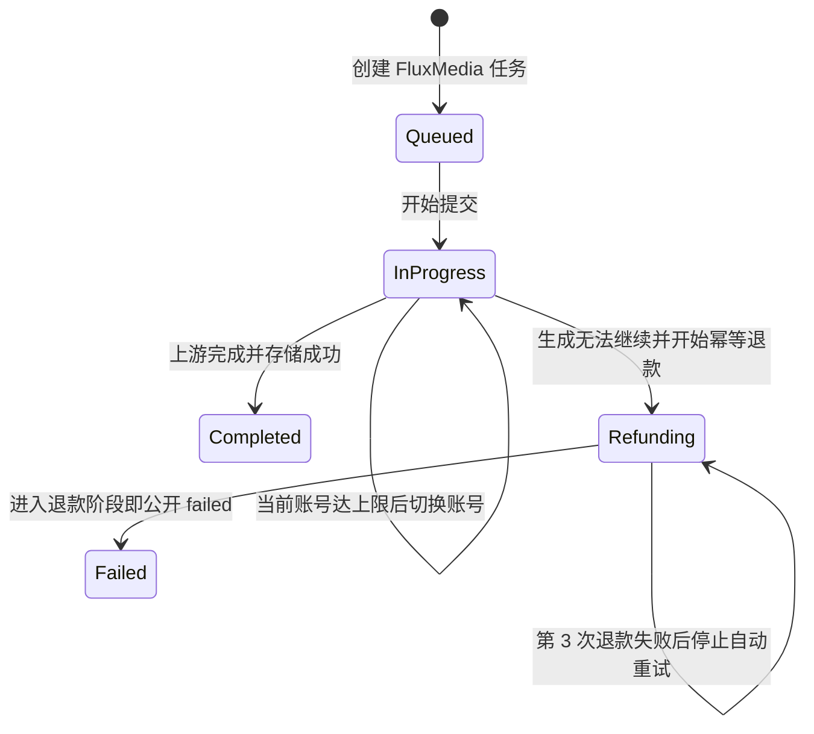
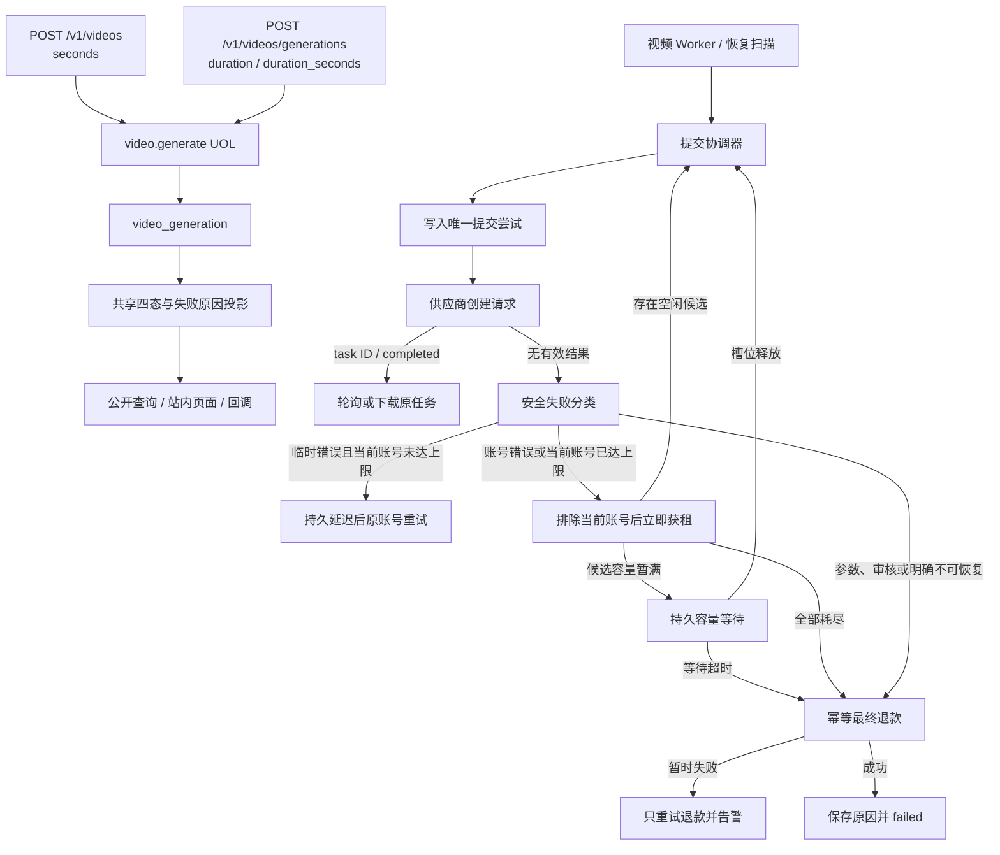

# OpenAI 视频接口兼容与自动失败恢复 - Plan

## Goal Capsule

- **Objective:** 为 FluxMedia 新增 OpenAI 风格的视频创建地址和请求侧 `seconds` 兼容参数，以已有查询地址为统一查询入口，并让新旧入口统一使用四态公开协议；对 API 供应商的上游创建请求未取得有效响应时完全自动重试，同一账号达到上限后自动切换账号，最终失败后幂等退款并返回、持久化和记录安全失败原因。
- **Product authority:** 本文固定视频公开协议迁移，以及 API 供应商创建失败自动重试、账号切换、最终退款、失败原因和日志契约；Adobe Direct 保持现有依赖 `pollUrl` 的恢复流程，不纳入本方案的提交重试、容量等待、切号或退款改造。其他 OpenAI 视频参数、完整 Video 对象和非视频媒体不属于本计划。
- **Open blockers:** 无。API 供应商账号新增“视频创建额外重试次数”配置，允许 `0-10`，默认 `2`；次数配置为 `0` 时不重试，实际创建请求上限始终为 `1 + 配置值`，因此单账号最多请求 11 次。系统设置新增同账号创建重试等待时间（`0-300` 秒，默认 `2`）、上游创建 HTTP 请求超时（`1-300` 秒，默认 `30`）和所有合格 API 账号容量暂满时的最长等待时间（`0-1800` 秒，默认 `120` 秒，`0` 表示立即退款），均可在系统配置页编辑。退款首次失败后固定每 `30` 秒重试一次，额外重试 `2` 次，因此最多执行 `3` 次退款尝试；耗尽后停止自动退款，仅输出一次高优先级错误日志，不新增退款耗尽状态、退款专用页面字段或管理员操作入口。任务开始后固定账号重试次数快照，不随账号后续修改漂移。
- **Execution profile:** Deep；涉及公开 API、持久状态机、数据库迁移、积分退款、跨账号调度、异步恢复和运维日志。
- **Stop conditions:** 任一 API 供应商实现要求恢复人工核对、再次向用户扣费、在最终退款完成前继续请求上游，或让同一账号超过提交上限时停止并回到产品决策；不得借此改写 Adobe Direct 既有恢复流程。
- **Tail ownership:** `ce-work` 或实现者按 U1-U6 的依赖顺序交付，完成 Verification Contract、Definition of Done 和计划内文档后再结束。

**Product Contract preservation:** changed: R1-R4, R30-R32 — 新地址、旧地址和三个时长请求字段均长期支持，只做统一逻辑与请求兼容，不再对接口地址或参数实施废弃治理。changed: R10-R29, F2-F4, AE3-AE9 — 用户推翻 API 供应商人工核对方案。删除 API 供应商的管理员人工窗口、异常任务页面、上游 task ID 填写和人工结论；API 创建请求无有效响应时改为自动重试、同账号达到上限后切号、最终失败后退款并记录原因。Adobe Direct 的既有 `pollUrl` 恢复流程不因本计划改变。

---

## Product Contract

### Summary

FluxMedia 新增 `POST /v1/videos`，并让新旧视频接口统一输出 OpenAI 的 `queued`、`in_progress`、`completed`、`failed` 四种状态。
API 供应商创建视频任务时，如果平台没有取得可确认任务已创建的有效响应，则本次提交直接视为失败，不进入人工核对。系统按供应商账号配置在同一账号自动重试；达到该账号的实际请求上限后切换尚未用尽的账号。所有候选账号均失败，或创建开始时没有合格 API 账号时，系统都先持久化任务、幂等退款并将任务标记为 `failed`，再返回包含 task ID、`failed` 状态和安全失败原因的任务对象。Adobe Direct 仍按现有 `pollUrl` 方式恢复，不使用本节的 API 提交流程。

### Problem Frame

现有视频公开接口使用 FluxMedia 自定义地址、`duration` 字段及 `pending`、`submitting`、`processing`、`needs_attention` 等状态，调用方无法直接按 OpenAI 视频协议接入。
现有 API 视频提交在超时、响应读取失败、响应非法或缺少上游 task ID 时进入 `submit_uncertain` 并停止自动处理，需要人工判断上游是否创建任务。新的产品决策不再为 API 供应商保留这类人工流程：未取得有效创建结果即按失败重试，失败原因必须安全持久化并可用于用户响应和运维告警。Adobe Direct 的动态 `pollUrl` 恢复不属于该失败语义，继续使用现有协议专属流程。

### Key Decisions

- **新旧接口本次统一四态。** (session-settled: user-directed — chosen over deprecating old public statuses for one release: both interfaces should expose the OpenAI state machine immediately.) Governs R5-R7.
- **只对齐已选协议面。** (session-settled: user-directed — chosen over full OpenAI request and response parity: only the route, duration field, and public statuses are required.) Governs R1-R4, R8-R9.
- **`seconds` 仅作为兼容别名新增。** (session-settled: user-directed — supersedes strict OpenAI duration-enum replacement: keep `duration` and `duration_seconds`, add `seconds`, normalize all three to the same FluxMedia duration capability, and do not reduce the existing model-specific duration set.) Governs R2-R4.
- **`seconds` 仅新增在请求侧。** (session-settled: user-directed — chosen over changing the response object: new and legacy responses keep the existing `duration` and `duration_seconds` fields and do not add `seconds`.) Governs R3-R4 and R30.
- **并存时长字段必须一致。** (session-settled: user-directed — chosen over precedence or silent fallback: normalize every supplied duration alias, reject conflicting values with HTTP `400`, and perform no task, financial, quota, lease, or submission side effect.) Governs R2-R2a.
- **`seconds` 同时兼容数字和整数字符串。** (session-settled: user-directed — accept a positive integer number or a decimal positive-integer string, normalize both to the same internal numeric duration, and reject fractional or non-decimal forms.) Governs R2.
- **新增别名不提供默认时长。** (session-settled: user-directed — when `seconds`, `duration`, and `duration_seconds` are all absent, preserve the existing HTTP `400` required-duration behavior rather than defaulting to 4 seconds.) Governs R2.
- **新旧创建地址都接受 `seconds`。** (session-settled: user-directed — expose the same additive request alias on every supported route; neither the routes nor `duration` and `duration_seconds` are deprecated.) Governs R2, R30.
- **新旧接口地址长期并存。** (session-settled: user-directed — supersedes route deprecation: retain every existing route without `Deprecation`, `Sunset`, successor headers, removal telemetry, or a removal condition; unify behavior behind the routes.) Governs R3-R4, R30-R31.
- **文档首选新地址但不降低旧地址支持级别。** (session-settled: user-directed — show `/v1/videos` in primary examples, list `/v1/videos/generations` as a supported compatibility address, and document `/api/v1/...` as equivalent deployment aliases without deprecation language.) Governs R30.
- **响应对象保持 FluxMedia 契约。** (session-settled: user-directed — chosen over full or partial OpenAI Video-object parity: retain existing response fields on every route and change only the public status values plus the already-approved safe failure reason behavior.) Governs R3, R5-R8.
- **遗留人工态在迁移窗口暂投影为 `in_progress`。** (session-settled: user-directed — before automatic migration claims the old API row, map legacy `needs_attention`/`submit_uncertain` to `in_progress`; mark this projection `@deprecated` and remove it next version only after the legacy-row count reaches zero.) Governs R6-R7, R22-R23.
- **OpenAI 路径保留等价 `/api` 别名。** (session-settled: user-directed — `/v1/videos` is the canonical documented route, while `/api/v1/videos` and their task-query forms remain behaviorally identical aliases rather than redirects.) Governs R1 and R9.
- **模型不支持请求时长时创建前拒绝。** (session-settled: user-directed — chosen over creating a doomed asynchronous task or silently changing duration: return HTTP `400` before task persistence, charging, quota reservation, scheduling, or supplier submission.) Governs R2a.
- **新接口继续只接受 JSON。** (session-settled: user-directed — chosen over adding OpenAI multipart compatibility: this migration aligns the selected route, request-side `seconds`, and statuses without expanding request encodings, response duration fields, or reference-input parameters.) Governs R1-R2 and R8.
- **提交失败不再人工核对。** (session-settled: user-directed — chosen over a bounded admin reconciliation window: a create request without a valid accepted result is treated as failed and recovered automatically.) Governs R10-R17.
- **同账号有限重试后自动切号。** (session-settled: user-directed — chosen over immediate manual intervention or indefinite same-account retry: retry to a maximum, then switch accounts.) Governs R12-R17.
- **重试次数由 API 账号配置控制。** (session-settled: user-directed — the account setting is additional retries, default `2`; `0` means no retry, and the task snapshots the value at start.) Governs R12-R17 and R25.
- **同账号重试等待时间由系统配置控制。** (session-settled: user-directed — the default delay is 2 seconds and administrators can edit it on the system settings page.) Governs R17 and R25.
- **上游明确错误按可恢复性分类。** (session-settled: user-directed — transient transport, rate-limit, capacity and upstream failures retry the same account; account authentication failures switch immediately; invalid input and moderation failures terminate and refund.) Governs R10-R18.
- **`Retry-After` 只能延长同账号等待。** (session-settled: user-directed — use the larger of the system delay and a valid upstream hint, cap the hint at 300 seconds, and never delay account switching.) Governs R17-R17b and R25.
- **创建 HTTP 请求超时由系统配置控制。** (session-settled: user-directed — wait 30 seconds by default, allow 1-300 seconds on the system settings page, and keep generation polling independent.) Governs R10 and R25.
- **创建响应正文不设置大小上限。** (session-settled: user-directed — chosen over a fixed or configurable response-byte cap: retain the existing response parsing path and treat read/parse failures as submission failures.) Governs R10, R17a and R25.
- **容量暂满时有限等待后退款。** (session-settled: user-directed — chosen over indefinite waiting or immediate refund: wait 120 seconds by default with a system-configurable limit, then refund and return a friendly failure message if no account slot becomes available.) Governs R15a-R18 and R24-R29.
- **没有合格 API 账号时立即失败退款。** (session-settled: user-directed — chosen over treating missing, disabled or capability-incompatible accounts as temporary capacity pressure: do not enter capacity waiting, use a friendly “当前没有可用生成服务” reason, and start idempotent refund.) Governs R15a-R20, F3a-F4 and AE5d-AE7.
- **立即失败仍使用异步创建响应。** (session-settled: user-directed — when FluxMedia has persisted the task, even `no_eligible_api_account` returns HTTP `202 Accepted` with the task ID, `failed` status and safe generation failure reason; transport acceptance does not imply generation success.) Governs R1, R9, R15c, F3b and AE5e.
- **最终失败后退款并返回原因。** (session-settled: user-directed — chosen over early refund or an unresolved nonterminal task: refund only after automatic recovery is exhausted, then expose a safe failure reason.) Governs R18-R23.
- **日志标识和失败原因是稳定运维契约。** (session-settled: user-directed — chosen over generic API logs or free-text stack matching: operators need deterministic event names, supplier names, and safe failure reasons.) Governs R24-R29.
- **自动恢复范围限定为 API 供应商。** (session-settled: user-directed — Adobe Direct keeps its existing `pollUrl` recovery; only API supplier creation failures enter this plan's retry, capacity wait, account switching and refund flow.) Governs R10-R29, F2-F4 and AE3-AE10.

### State and Recovery Flow

创建重试、切换账号、轮询和下载期间，公开接口返回 `in_progress`；进入退款阶段后立即返回 `failed`，查询和用户记录中的初始失败原因可包含“退款正在处理中”，并立即产生一次生成结果终态回调。该回调只携带最后一次生成失败的安全原因，不包含退款进度或结果。退款仍由后台继续执行；退款成功或重试耗尽后，查询和用户记录中的失败原因收敛为最终一次生成失败的安全原因，不再展示退款进度或退款结果，也不再产生第二次回调。通过持久的重试计数与耗尽时间阻止再次执行并保证错误日志只打印一次，不新增状态枚举。

### Actors

- A1. **API 调用方：** 通过新接口或保留的旧接口创建和查询视频任务，只消费统一四态和安全失败原因。
- A2. **视频生成用户：** API 供应商任务无需人工介入；系统自动重试和切号，最终无法生成时获得退款及可理解的失败原因。Adobe Direct 继续沿用现有恢复体验。
- A3. **视频恢复系统：** 对 API 供应商持久记录提交尝试、同账号重试、账号切换、退款和终局状态；对 Adobe Direct 继续执行现有协议专属恢复。
- A4. **管理员运营人员：** 在全局使用记录的视频详情中查看逐次提交失败的安全原因，但不人工恢复、修改状态或补填上游 task ID。
- A5. **日志采集与告警系统：** 按稳定事件标识、供应商名称和安全失败原因采集告警，不依赖敏感请求正文。

### Requirements

**OpenAI protocol compatibility**

- R1. 新创建接口必须以 `POST /v1/videos` 作为文档推荐的规范地址，同时提供行为完全一致的 `POST /api/v1/videos` 兼容别名；别名不得重定向。两条路径必须调用同一视频生成能力处理鉴权、扣费、幂等、调度和任务持久化，并返回相同 HTTP 状态和响应对象。
- R1a. 两条新创建路径仅接受 `application/json` 请求体，不实现 OpenAI 示例中的 `multipart/form-data`，也不因新地址而新增文件上传或 multipart 图片引用能力；根路径和 `/api` 别名对请求编码的接受与拒绝行为必须一致。
- R2. 新旧创建接口必须在现有 `duration`、`duration_seconds` 数值字段之外新增 `seconds` 兼容字段。`seconds` 接受正整数或只包含十进制正整数的字符串，归一化后与旧字段进入同一 FluxMedia 模型时长能力校验；不得截断小数、就近取值或把时长自动改成 OpenAI 的 4、8、12、16、20 秒集合。5、6、10、15 秒等现有模型支持值继续合法。本次不为 `seconds` 设置独立默认值；三个时长字段均未提供时仍按现有“时长必填”契约拒绝请求。任意两个或三个时长字段同时提供时，必须先归一化再比较；值不完全一致时返回 HTTP `400` 参数冲突，且不得产生任务、财务、配额或调度副作用。
- R2a. 任一时长字段完成格式归一化后，必须在创建任务前校验所选 FluxMedia 模型的有效能力。若该模型不支持请求时长，根路径和 `/api` 别名必须返回相同的 HTTP `400` 友好参数错误；不得创建或持久化视频任务、扣除积分、预留 API Key 配额、占用供应商并发槽、创建提交尝试或进入退款流程，也不得自动改成相邻时长。
- R3. 旧 `POST /v1/videos/generations` 必须继续接受并返回其现有非状态字段，以支持兼容迁移；新旧创建和查询响应继续只使用现有数值 `duration`、`duration_seconds` 字段，不新增响应字段 `seconds`。
- R4. 旧创建地址、`duration` 和 `duration_seconds` 均继续作为正式支持的接口契约，不标记废弃、不设置移除版本或 Sunset 条件。新增地址和 `seconds` 只扩展兼容面；新旧地址与三个时长字段必须进入同一参数归一化、能力校验、UOL、状态机和自动恢复逻辑。
- R5. 新旧创建与查询接口必须只公开 `queued`、`in_progress`、`completed`、`failed`，不得再返回 `pending`、`submitting`、`processing` 或 `needs_attention`。
- R6. 尚未开始执行的视频任务公开为 `queued`；API 供应商提交重试、切换账号、上游轮询和下载阶段，以及 Adobe Direct 既有轮询和下载阶段，公开为 `in_progress`；进入退款阶段后立即公开为 `failed`。升级前遗留 API `needs_attention` / `submit_uncertain` 在自动迁移取得处理权前临时公开为 `in_progress`，迁移后再按实际重试或退款阶段投影。查询与用户记录的失败原因可暂时说明“退款正在处理中”，但生成结果终态回调只携带最后一次生成失败原因，不携带退款信息。不得新增“生成失败”“退款失败”等公开或内部状态枚举。
- R7. API 供应商的新任务不得进入需要人工处理的公开或内部状态。旧 API `submit_uncertain` 只作为部署兼容输入，处理规则见 R22-R23；其临时 `in_progress` 投影必须在代码中使用 `@deprecated` 注释明确适用数据范围、升级窗口和零遗留删除条件。Adobe Direct 的既有协议专属恢复流程不因本计划改变。
- R8. 本计划不要求对齐 OpenAI 的其他请求参数、`multipart/form-data`、`input_reference`、完整 Video 对象、列表、删除、变体内容或所有模型枚举。新旧创建和查询地址继续返回 FluxMedia 现有响应对象字段，不新增或重命名为 OpenAI 的 `object`、`progress`、`created_at`、`size`、`quality` 等字段；本次响应契约只统一公开状态值，并按 R20-R21 增加安全失败原因语义。现有 FluxMedia JSON 参数除新增 `seconds` 兼容别名外继续沿用当前契约。
- R9. `GET /v1/videos/{taskId}` 必须作为文档推荐的规范查询地址，同时保留行为完全一致且不重定向的 `GET /api/v1/videos/{taskId}` 别名；两者以及新旧创建接口必须继续返回同一个 FluxMedia task ID，以便创建、查询、API 供应商自动重试和跨供应商恢复围绕同一任务收敛。两套查询路径必须返回相同 HTTP 状态和公开视频对象；Adobe Direct 继续使用其既有受信恢复身份。

**Automatic submission retry and account switching**

- R10. API 供应商创建 HTTP 请求必须读取系统设置 `VIDEO_SUBMISSION_HTTP_TIMEOUT_SECONDS`，允许 `1-300` 的整数秒并默认 `30` 秒；每次实际请求发出前固定本次生效值，超时后中止本次 HTTP 等待。创建响应正文不设置固定或可配置的业务层大小上限，不新增响应大小系统设置；仍按现有响应解析链路读取和解析。创建请求超时、网络异常、响应读取失败、响应不是合法 JSON，或成功响应缺少可确认任务已创建的 task ID/产物时，必须把本次 API 提交视为创建失败并按同账号可重试错误处理，不得进入人工核对或等待管理员填写上游 task ID。该设置不得用于已取得 task ID 后的视频生成轮询、媒体下载或回调投递，也不适用于 Adobe Direct 的既有 `pollUrl` 恢复。
- R11. 已取得有效上游 task ID 或同步产物的 API 任务不得按“创建无响应”规则重提；后续轮询错误必须恢复同一个上游任务，避免重复生成。Adobe Direct 继续按其既有 `pollUrl` 规则恢复。
- R12. 对 API 供应商的 R10 失败，系统必须优先使用同一供应商账号自动重试。API 账号必须提供取值 `0-10` 的整数“视频创建额外重试次数”配置，默认值为 `2`；配置为 `0` 时只执行首次创建请求，不执行重试；某账号最多执行 `1 + videoSubmissionRetryCount` 次实际创建请求，绝对上限为 11 次。Adobe Direct 不读取此配置。
- R13. 只有实际发出上游创建请求才增加该账号的提交次数；排队、容量不足、获租失败、数据库冲突或请求脚本在发送前失败不得消耗次数。
- R14. 每次实际提交必须使用唯一尝试身份并持久记录账号、账号内序号、全局序号、任务固定的重试配置快照、该次生效的最大请求次数、供应商安全快照、协议、开始/结束时间、结果和安全失败原因，防止并发或进程重启突破上限。
- R15. 当前账号达到其快照中的 `1 + videoSubmissionRetryCount` 请求上限后，系统必须选择一个本任务尚未用尽提交次数的合格账号；不得再次选择已经耗尽次数的账号。切换账号不使用 `VIDEO_SUBMISSION_RETRY_DELAY_SECONDS`，新账号的首次请求立即安排，但仍须经过持久任务、获租、尝试预留和并发保护。
- R15a. 如果仍存在合格且未达到提交上限的 API 账号，但所有这些账号当前都没有空闲并发槽，系统必须进入持久化的容量等待阶段，并读取系统配置 `VIDEO_SUBMISSION_CAPACITY_WAIT_TIMEOUT_SECONDS` 作为本次等待的最长时限，允许 `0-1800` 秒并默认 `120` 秒。配置为 `0` 时不进入等待，立即停止本次上游创建并退款；配置大于 `0` 时，容量等待期间公开状态保持 `in_progress`，不创建提交尝试、不消耗任何账号重试次数、不退款；任一账号释放槽位后按现有调度策略重新获租并立即安排创建。等待超过截止时间仍没有可用槽位时，停止本次上游创建，进入幂等退款并使用友好的容量超时失败原因。
- R15b. 容量等待超时只表示本任务在指定时间内无法获得供应商并发槽，不得把账号标记为耗尽、修改账号全局健康、冷却或启用状态，或影响其他任务选择；容量等待的失败代码必须与上游创建失败代码区分。
- R15c. 如果任务开始调度时不存在任何合格且可用于该模型、能力、分组和系统策略的 API 账号，系统不得进入容量等待，不得创建提交尝试，不得消耗任何账号重试次数，也不得修改账号全局状态；必须先持久化任务，再立即进入幂等退款和公开 `failed`，使用稳定失败代码 `no_eligible_api_account` 及友好失败原因“当前没有可用生成服务”。创建接口仍以 HTTP `202 Accepted` 返回包含 task ID、`failed` 状态和该失败原因的任务对象；`202` 只表示 FluxMedia 已接受并持久化异步任务，不表示生成成功。该分支只发送一次不含退款信息的生成结果终态回调。
- R16. 每次重试和切号继续使用原 FluxMedia task ID、原用户输入、创建时固定的执行契约和用户扣费事实，不得再次扣除用户积分或 API Key 配额。
- R17. 同账号重试、跨账号切换和延迟恢复必须由持久状态、数据库约束和 Worker/扫描补偿驱动，不得只依赖单进程循环或内存计数。同账号两次实际创建请求之间的基础等待时间必须读取系统设置 `VIDEO_SUBMISSION_RETRY_DELAY_SECONDS`，允许 `0-300` 的整数秒并默认 `2` 秒。上游可重试错误携带合法 `Retry-After` 时，最终等待秒数取 `max(系统配置秒数, Retry-After 秒数)`，其中上游提示最高按 `300` 秒处理；非法、负数或无法解析的提示忽略。最终等待为 `0` 时立即安排重试。系统必须持久化最终等待秒数和本次计划执行时间，进程重启后不得绕过大于零的等待；跨账号切换始终将计划时间设为当前时间并忽略 `Retry-After`。
- R17a. 创建请求的失败决策顺序必须固定为：已取得有效 task ID/同步产物则锁定原任务；否则先采用平台受控错误分类，再使用响应脚本的稳定 `category`、`code` 和 `retryable` 作为分类输入。超时、网络错误、HTTP `408`/`429`/`5xx`、`rate_limit`、`capacity`、`timeout`、`upstream` 及响应脚本标记可重试的非安全终止错误，必须走同账号重试；HTTP `401`/`403`、`authentication`、`permission` 等账号凭据或权限错误必须跳过同账号剩余次数并立即换号；`invalid_request`、`moderation` 等参数、内容审核或明确不可恢复的业务错误必须停止切号并进入最终退款。HTTP `409` 且没有有效 task ID 时默认属于不可恢复业务冲突并进入最终退款，只有供应商响应脚本明确返回受控的可重试分类时才允许改为同账号重试。
- R17b. 响应脚本的 `retryable: true` 不得覆盖内容审核等平台安全终止分类、已取得上游 task ID 的事实或账号鉴权失效分类，也不得突破次数上限；HTTP `409` 是唯一允许由供应商响应脚本通过受控分类从默认终止改为同账号重试的明确冲突状态。未知或矛盾分类必须 fail closed，不得仅凭自由文本猜测重试或切号。
- R17c. `Retry-After` 必须同时支持标准秒数和 HTTP-date 形式，统一换算为从当前服务器时间起的非负秒数；超过 300 秒按 300 秒处理。该值只影响已被 R17a 判定为 `retry_same_member` 的下一次等待，不得把终止错误改为重试，也不得延迟 `switch_member`。
- R17d. HTTP `401`/`403`、`authentication`、`permission` 等账号错误只在当前视频任务内排除该账号并立即切号；不得因此修改账号启用状态、健康分、冷却时间或其他账号池全局状态，其他新任务仍可按现有选择规则使用该账号。

**Final failure, refund, and failure reason**

- R18. 对 API 供应商而言，参数、内容审核等明确不可重试的业务失败，或所有合格账号均达到提交上限后，系统必须停止创建请求并进入幂等退款；不得循环使用已耗尽账号。Adobe Direct 不因本条进入本方案的退款流程。
- R19. 对 API 供应商的最终退款必须同时覆盖用户积分和外部 API Key 配额预留。进入退款阶段后立即公开 `failed`；查询与用户记录的失败原因可包含“退款正在处理中”，但生成结果终态回调只携带最后一次生成失败原因，不携带退款信息。不得继续请求上游。退款由后台每 `30` 秒按持久计划额外重试一次；允许额外重试 `2` 次，因此首次退款加两次重试最多执行 `3` 次退款尝试。第 `3` 次仍失败时停止自动退款重试，任务继续保持公开 `failed`，持久记录重试计数与耗尽时间，并仅输出一次高优先级错误日志；后续 Worker 或扫描不得重复执行退款或输出该错误日志。不得新增退款耗尽状态、退款专用页面字段、管理员手动重试退款或状态修改入口。Adobe Direct 不使用本条的退款策略。
- R20. API 供应商进入退款阶段后任务即可公开 `failed`。任务必须保存稳定 `failureCode` 和已脱敏、可展示的 `failureReason`；进入退款阶段时，用户侧的 `failureReason` 以最终一次实际提交尝试的安全失败原因为主体，可暂时附加“退款正在处理中”，现有 `error` 字段承载该用户可见原因，尝试账本和全局使用记录的视频详情保留每一次提交失败的安全原因。若本次任务没有发出任何上游创建请求而因容量等待超时，则使用容量等待超时原因，可暂时附加“退款正在处理中”。退款成功或重试耗尽后，用户侧的 `failureReason` 必须移除退款进度附加语，仅保留最终一次生成失败的安全原因；退款成功、失败或耗尽事实只保留在后台账本、任务记录和日志中，不改变公开状态。Adobe Direct 的错误原因和状态继续按现有协议流程处理。
- R21. API 供应商任务进入退款阶段并首次公开为 `failed` 时必须立即产生一次生成结果终态回调。回调只携带最终一次实际提交尝试的安全失败原因，不得携带“退款正在处理中”、退款成功、退款失败或退款耗尽等退款流程信息；若没有任何上游请求而因容量等待超时，则回调携带容量等待超时原因。退款成功或重试耗尽后不得产生第二次回调；新旧查询接口和用户视频记录改为只返回最终一次生成失败的安全原因，不展示退款结果。全局使用记录的视频详情必须可按尝试序号查看每一次上游提交失败原因，但不得增加退款耗尽状态或专用页面字段。不得返回上游原始正文、堆栈、凭据、URL 或内部数据库错误。Adobe Direct 不进入本条的自动退款和回调重试语义。
- R22. 部署前已存在且执行快照完整的 API `submit_uncertain` 任务按新规则进入自动重试；“完整”至少要求可验证的供应商、协议、已选账号、模型与能力、输入/输出存储、原任务扣费事实和有效恢复身份，且这些事实能重建一次与原任务等价的创建请求。历史完整快照若仅缺少本次新增的重试配置字段，必须按版本固定的默认值 `2` 补齐后再重试，不得读取当前账号配置。若缺少任一不可变事实，任务不得猜测当前配置或重新提交，必须幂等退款、进入 `failed`、保存稳定的历史快照无效失败原因，并输出一次专用兼容告警。Adobe Direct 历史任务不进入本条迁移。
- R23. R22 的 API 历史兼容分支及遗留 `needs_attention` / `submit_uncertain` 到公开 `in_progress` 的临时投影，必须以代码注释和 `@deprecated` 标记说明仅用于本次升级前遗留数据；下个版本发布前只有在查询证明遗留行数量为零时才一并移除，否则继续保留，禁止强制删除。缺少快照的历史任务只执行一次兼容终止和一次高优先级告警，不创建上游请求、不恢复人工入口，也不重复退款或重复告警。

**Logging and traceability**

- R24. 每次 API 提交失败、无合格 API 账号或 API 容量等待超时必须立即输出 `warn` 级稳定结构化事件；API 当前账号重试耗尽、账号切换、无合格账号、容量等待开始与超时、每次退款失败、退款重试耗尽和最终生成失败必须分别输出稳定事件标识。退款重试耗尽事件使用 `error` 级别并包含稳定失败代码，且每个 API 任务只能输出一次；后续扫描不重复打印该事件。Adobe Direct 继续使用既有事件语义。
- R25. API 供应商规范事件至少包括事件标识、FluxMedia task ID、服务端执行 request ID、供应商 ID、供应商名称、成员 ID、模型、协议、账号内尝试序号、配置的额外重试次数、该任务快照的最大请求次数、全局尝试序号、本次创建 HTTP 超时秒数、系统基础等待秒数、经上限处理的上游 `Retry-After` 秒数、最终等待秒数、下次计划时间、错误分类、失败代码和安全失败原因；Adobe Direct 事件不强制携带本条 API 提交字段。
- R26. `videoTaskId` 是整个任务生命周期的业务主链标识；每次 HTTP、Worker 或定时恢复使用服务端生成的 `requestId`；`attemptNumber` 标识每次上游提交。客户端 `X-Request-Id` 只能校验后作为非权威 `externalRequestId`，不得覆盖服务端 request ID。
- R27. API 日志、任务记录和尝试账本不得包含 prompt、完整请求或响应正文、API Key、Authorization、Cookie、媒体 URL、签名 URL、用户凭据、上游 task ID 或未脱敏上游载荷；Adobe Direct 继续遵守其现有敏感信息边界。
- R28. 失败原因必须经过稳定分类和脱敏。用户响应和用户历史只投影最终一次实际提交尝试的安全失败原因；一次性生成结果终态回调只投影同一安全失败原因，不附加任何退款信息，后续退款结果不再回调。运维日志和全局使用记录的视频详情保留逐次失败原因，并可包含比用户响应更具体的安全说明。每次尝试和终局记录必须共享稳定 `failureCode` 体系，以便从用户报错定位到任务和尝试记录。
- R29. `docs/video-submission-recovery-log-events.md` 是本功能日志事件名、字段、错误分类和建议告警规则的规范文档；旧的人工核对事件必须标记废弃并由自动重试事件替代，日志采集方获得迁移说明。

**Route coexistence and status migration**

- R30. 新旧创建地址及其 `/api` 别名必须长期并存并在 API 文档中同时列出。文档的主要请求示例使用 `/v1/videos`，`/v1/videos/generations` 作为“兼容地址”说明，`/api/v1/videos` 与 `/api/v1/videos/generations` 作为等价部署别名说明；“兼容”只表示文档主次，不表示支持级别降低。任何地址均不得发送 `Deprecation`、`Sunset` 或 successor `Link`，也不得建设面向下线的匿名调用计数或移除门槛。
- R31. 新旧地址必须复用同一传输处理与 UOL operation，除 URL 和新旧请求字段组合外，不得出现鉴权、校验、HTTP 状态、响应对象、扣费、调度、重试、退款或日志语义差异。
- R32. 旧公开状态不保留兼容周期，因为新旧接口在本次发布即统一为四态；发布说明必须把状态变更列为破坏性变更，但不得把接口地址或时长参数描述为废弃。

### Key Flows

- F1. **Create and query through either public route**
  - **Trigger:** A1 使用新接口或旧接口创建视频任务。
  - **Steps:** 新接口解析 `seconds`，旧接口解析兼容字段；传输校验完成后，统一能力先校验模型与时长组合，合法组合才创建任务并进入扣费和调度；查询、站内页面和回调统一映射内部阶段为四态。
  - **Outcome:** 调用方只看到四态、同一 task ID、现有响应时长字段，以及失败终态中的安全原因；请求侧 `seconds` 不扩展到响应对象。
  - **Covered by:** R1-R9, R20-R21, R30-R32
- F2. **Retry an API create request on the same account**
  - **Trigger:** API 创建请求没有取得有效上游 task ID 或同步产物。
  - **Steps:** 系统保存本次尝试和失败原因；账号未达到任务快照中的 `1 + videoSubmissionRetryCount` 次时，按系统配置的等待秒数持久安排同一账号重试，默认等待 2 秒。
  - **Outcome:** 任务保持 `in_progress`，用户无需介入且不重复扣费。
  - **Covered by:** R10-R14, R16-R17, R24-R28
- F3. **Switch API account after the per-account limit**
  - **Trigger:** 当前账号已达到任务快照中的 `1 + videoSubmissionRetryCount` 次创建请求仍未取得有效结果；配置为 `0` 时即首次请求失败。
  - **Steps:** 系统记录账号耗尽事件，排除已耗尽账号并选择下一合格账号，从账号内第 1 次立即安排提交，不应用同账号重试等待配置。
  - **Outcome:** 任务继续 `in_progress`，原 task ID 和用户扣费事实不变。
  - **Covered by:** R14-R17, R24-R28
- F3a. **Wait for an API slot, then refund on timeout**
  - **Trigger:** 仍有合格且未耗尽的 API 账号，但所有候选 API 账号的并发槽暂时已满。
  - **Steps:** 持久记录容量等待开始时间和截止时间；槽位释放前保持 `in_progress` 且不创建尝试，释放后按现有调度规则继续提交；截止时间到达仍无槽位时停止外呼，幂等退款并保存友好的容量超时原因。
  - **Outcome:** 可用容量及时恢复时任务继续生成；超过配置时限时用户收到退款和可理解的“当前生成服务繁忙，请稍后重试”提示。
  - **Covered by:** R13, R15a-R15b, R18-R21, R24-R29
- F3b. **Refund when no eligible API account exists**
  - **Trigger:** 任务开始调度时没有任何合格且可用于当前模型、能力、分组和系统策略的 API 账号。
  - **Steps:** 不进入容量等待，不创建提交尝试，不消耗重试次数，不修改账号全局状态；先持久化任务，再保存 `no_eligible_api_account` 和友好失败原因，公开 `failed`，发送一次只包含该生成失败原因的终态回调，并启动幂等退款。
  - **Outcome:** 创建接口仍以 HTTP `202 Accepted` 返回包含 task ID、`failed` 状态和“当前没有可用生成服务”的任务对象；用户不会等待一个不存在的候选账号，任务记录、日志和退款账本可追溯该终局原因。
  - **Covered by:** R15c, R18-R21, R24-R29
- F4. **Refund API failure in background and expose it immediately**
  - **Trigger:** API 供应商任务明确不可重试，或所有合格 API 账号均已耗尽。
  - **Steps:** 系统停止上游请求，立即公开 `failed` 并保存最终一次实际提交尝试的失败代码和用户安全原因；查询与用户记录可附加“退款正在处理中”，同时只发送一次不含退款信息的生成结果终态回调；管理端任务记录和尝试账本保留全部尝试原因；后台按退款策略继续执行幂等退款。
  - **Outcome:** 用户立即看到生成失败和退款处理中提示；退款最终成功或耗尽后任务仍为 `failed`，查询与历史中的失败原因移除退款进度附加语并只保留最后一次生成失败原因，不再发送更新回调；管理员可在任务记录中查看每次失败原因和退款结果事实。
  - **Covered by:** R18-R21, R24-R29

### Acceptance Examples

- AE1. **Covers R1-R9.** Given 调用方分别通过 `/v1/videos`、`/api/v1/videos` 和旧 generations 地址创建任务，并通过两套按 ID 查询路径读取任务，when 任务处于排队、提交、重试、切号、轮询、下载、退款和终态，then 根路径与 `/api` 别名不发生重定向且返回相同 HTTP 状态、FluxMedia 任务对象和四态；响应不因新地址新增 OpenAI `object`、`progress`、`created_at`、`size` 或 `quality` 字段，站内页面与回调使用同一状态投影，任务 ID 全程不变。
- AE2. **Covers R2-R4.** Given 所选模型支持 5 秒，when 新旧接口分别传入 `seconds: 5`、`seconds: "5"`、`duration: 5` 或 `duration_seconds: 5`，then 四种请求均归一为数值 5 并进入同一视频能力；零、负数、小数、空串和非十进制字符串被拒绝，三个字段均省略时继续返回时长必填错误。成功创建与后续查询响应继续返回 `duration: 5` 和 `duration_seconds: 5`，且不返回 `seconds`；任一合法时长字段均不触发废弃提示。
- AE2a. **Covers R2a.** Given `seconds: 20` 格式合法但所选模型只支持 4、8、12 秒，when 调用 `/v1/videos` 或 `/api/v1/videos`，then 两条路径均返回相同 HTTP `400` 和友好参数错误，不创建 task ID、不扣积分或预留配额、不获租账号、不写提交尝试、不退款，也不把时长改成 12 秒。
- AE2c. **Covers R2-R2a.** Given 请求同时携带 `seconds: "5"` 与 `duration: 6`，when 任一新旧创建路径解析请求，then 归一化比较发现冲突并返回 HTTP `400`，不得以任一字段优先，也不创建任务、扣积分、预留配额、获租账号、写提交尝试或触发退款；若两者分别为 `"5"` 与 `5`，则视为一致并继续能力校验。
- AE2b. **Covers R1a and R8.** Given 相同的合法视频创建参数分别以 JSON 和 `multipart/form-data` 提交，when 调用任一新创建别名，then JSON 请求进入统一能力，multipart 请求在传输层被一致拒绝，且不产生任务、财务或调度副作用。
- AE3. **Covers R10-R14.** Given 创建 HTTP 超时使用默认 `30` 秒且账号 A 的 `videoSubmissionRetryCount` 使用默认值 `2`，when 创建请求连续超时或返回缺少 task ID 的非法成功响应，then 每次请求最多等待 30 秒，实际请求次数依次达到 1、2、3 并写入独立尝试记录，前两次失败后仍使用 A，第三次失败后不再使用 A，且全程无人工状态。
- AE4. **Covers R13-R17.** Given A 暂时没有容量或 Worker 在外呼前崩溃，when 任务恢复，then 不增加 A 的提交次数；只有实际发出的请求计数，并发 Worker 不能创建相同尝试序号。
- AE4a. **Covers R17, R17c, R25.** Given 同账号创建失败且系统重试等待时间为默认 `2` 秒，when 上游没有合法 `Retry-After`，then 下一次请求安排在失败后 2 秒。Given 上游分别返回 `Retry-After: 1`、`120`、`999` 和合法 HTTP-date，then 最终等待分别为 2 秒、120 秒、300 秒和该日期换算后封顶 300 秒的结果；日志记录基础等待、上游提示、最终等待和下次计划时间。Worker 或扫描不得在计划时间前发送请求，进程重启后仍遵守已持久化计划。Given 系统等待为 `0` 且提示非法，then 系统将下次计划时间设为当前时间并允许 Worker 立即继续，但仍经过持久任务、尝试预留和并发保护，不在同一未受控内存循环中直接外呼。
- AE5. **Covers R12, R15-R17.** Given A 的 `videoSubmissionRetryCount` 为 `0`、系统同账号等待为 `300` 秒且 B 可用，when A 的首次创建请求失败，then 系统不再使用 A，也不等待 300 秒，立即安排 B 的首次请求；B 成功取得上游 task ID 后，原 FluxMedia task ID 进入轮询，用户积分和 API Key 配额只保留首次扣费。
- AE5d. **Covers R13, R15a-R15b, R18-R21.** Given A 和 B 都是本任务合格且未耗尽的 API 账号，但两者并发槽均已满，且容量等待使用默认 `120` 秒，when 任务进入容量等待，then 系统持久化 120 秒后的等待截止时间，公开状态保持 `in_progress`，不写入提交尝试且不消耗重试次数；任一槽位在截止时间前释放时按现有调度策略选择可用账号并继续创建。若截止时间到达仍无空闲槽位，系统停止外呼，幂等退还积分和 API Key 配额，记录独立容量超时 `failureCode`，并向用户返回友好提示“当前生成服务繁忙，请稍后重试”。容量等待不修改 A/B 的全局健康、冷却或启用状态，其他任务仍可使用它们。
- AE5e. **Covers R15c, R18-R21.** Given 任务开始调度时没有任何合格 API 账号，when 调度器评估候选集合，then 先持久化任务，再不进入容量等待、不写提交尝试、不消耗重试次数、不修改账号全局状态，立即记录 `no_eligible_api_account`，公开 `failed`，发送一次只包含“当前没有可用生成服务”失败原因的终态回调，并启动幂等退款；创建接口返回 HTTP `202 Accepted` 以及包含 task ID、`failed` 状态和该失败原因的任务对象。
- AE5a. **Covers R17a-R18.** Given 创建请求分别返回 `429`、`503`、`401`、`409`、`invalid_request` 和 `moderation` 且均没有 task ID，when 分类器决策，then `429` 与 `503` 在当前账号未耗尽时按系统等待重试同账号，`401` 只在当前任务内立即排除该账号并换号，账号的全局启用、健康和冷却状态不变，其他新任务仍可选中该账号；`409`、`invalid_request` 与 `moderation` 不再重试或换号而进入最终退款。
- AE5b. **Covers R17a-R17b.** Given 响应脚本对 `rate_limit` 返回 `retryable: true`，when 当前账号未耗尽，then 同账号重试；given 响应脚本对 `moderation` 或已经取得 task ID 的结果返回 `retryable: true`，then 平台拒绝重提并分别进入最终退款或继续查询原任务。
- AE5c. **Covers R11, R17a-R17b.** Given HTTP `409` 响应分别为“包含有效 task ID”、“没有 task ID 但脚本返回受控可重试分类”和“没有 task ID 且无脚本覆盖”，when 分类器决策，then 分别继续查询原任务、按同账号规则重试和直接进入最终退款。
- AE6. **Covers R11.** Given 任一账号已经返回有效上游 task ID，when 后续查询超时或临时失败，then 系统只重试原上游任务查询，不重新执行创建请求或切换账号生成。
- AE6a. **Covers R10-R11.** Given 管理员把 `VIDEO_SUBMISSION_HTTP_TIMEOUT_SECONDS` 从 `30` 改为 `60`，when 一个创建请求已按 30 秒配置发出而下一次尚未发出，then 已发出的请求仍以 30 秒超时，下一次实际创建请求使用 60 秒；已取得 task ID 的查询超时策略不受此配置影响。
- AE7. **Covers R18-R21.** Given A、B、C 均达到上限且各次最后失败分别为 `timeout`、`authentication_failed`、`upstream_unavailable`，when 任务进入退款阶段，then 立即公开 `failed` 并发送一次生成结果终态回调，用户积分退款在后台处理，回调只返回 C 的最后一次安全失败原因且不包含退款信息，首次 API 和历史可在该原因后附加“退款正在处理中”，管理端任务记录和尝试账本保留 A、B、C 的全部失败原因与尝试序号；若没有任何上游请求而容量等待超时，则回调只携带容量等待超时原因，API 和历史可附加“退款正在处理中”。退款成功或重试耗尽后任务仍为 `failed`，查询和历史中的用户失败原因移除退款进度附加语，只保留 C 的最后一次安全失败原因或容量等待超时原因，且不再发送回调。
- AE8. **Covers R19-R21.** Given 进入退款阶段，when Worker 重放，then 公开状态立即为 `failed`，不向任何供应商发送请求，首次退款失败后每 30 秒额外重试一次，最多重试 2 次、共执行 3 次退款尝试，并逐次输出退款失败事件；任一次退款成功后任务仍为 `failed`，只更新退款成功事实并把用户失败原因收敛为最后一次生成失败原因。第 3 次仍失败时任务继续为 `failed`，自动重试停止，持久保存耗尽事实、移除用户失败原因中的退款进度附加语并仅输出一次高优先级退款重试耗尽事件；后续 Worker 或扫描不重复退款或打印该错误，且任何管理或用户页面都不增加专用状态或操作。
- AE9. **Covers R22-R23.** Given 历史 API `submit_uncertain` 任务缺少供应商、协议、账号、能力、存储或有效恢复身份等不可变执行快照，when 部署后扫描发现，then 系统不重提、不恢复人工入口，幂等退款后公开 `failed`，保存稳定的历史快照无效失败原因并只输出一次兼容告警；兼容分支带废弃注释且仅在遗留数为零时移除。Adobe Direct 历史任务不进入该分支。
- AE9a. **Covers R6-R7, R22-R23.** Given 升级前遗留 API `needs_attention` / `submit_uncertain` 尚未被迁移 Worker 取得处理权，when 客户端查询，then 只返回 `in_progress`，不得泄露旧状态；迁移取得处理权后按自动重试阶段继续返回 `in_progress`，或在进入退款阶段后返回 `failed`。临时投影带 `@deprecated` 和零遗留删除条件，下个版本只有在遗留查询为零后才移除。
- AE10. **Covers R24-R29.** Given 任一提交尝试失败，when 日志被采集，then 可用事件名、供应商名称、任务 ID、服务端 request ID、尝试序号和失败代码定位问题，且不存在敏感正文或凭据。
- AE11. **Covers R30-R32.** Given 客户端分别使用“旧地址 + `seconds`”“新地址 + `duration`”“旧地址 + `duration`”，when 请求成功，then 三种请求均进入同一操作并返回一致业务结果，任何组合都不返回 `Deprecation`、`Sunset` 或 successor `Link`，也不写下线统计；API 文档首选 `/v1/videos`，同时明确其他三个创建地址长期等价支持；旧状态名称不再出现在任何新旧视频公开响应中。

### Success Criteria

- 新旧视频接口、站内页面、查询和回调的契约测试证明公开状态集合严格等于四态；Adobe Direct 的既有恢复流程也能投影到同一四态集合。
- API 供应商创建请求无有效响应时无需人工操作；每个 API 账号按 `0-10` 的配置执行额外重试，默认 `2`，`0` 表示不重试，达到 `1 + 配置值` 次实际提交后自动切换未耗尽账号。
- 同账号重试等待时间允许 `0-300` 秒并默认 `2` 秒，管理员可以在系统配置页修改；`0` 表示立即安排重试，等待计划可跨进程重启恢复，提前扫描不会提前发起请求。
- 上游创建 HTTP 请求超时允许 `1-300` 秒并默认 `30` 秒，管理员可以在系统配置页修改；它不控制视频生成完成等待、查询、下载或回调。
- 当前账号耗尽后立即安排下一个合格账号的首次请求，不应用同账号重试等待配置。
- 没有合格 API 账号时先持久化任务，再按 `no_eligible_api_account` 失败并幂等退款，以 HTTP `202 Accepted` 返回包含 task ID、`failed` 状态和“当前没有可用生成服务”原因的任务对象；只有存在合格但所有槽位暂满的 API 账号时才按系统配置进入容量等待，等待期间不消耗创建次数，超时后幂等退款并返回友好提示，容量等待不改变账号全局状态。
- API 供应商的临时传输、限流、容量和上游错误重试同账号；账号鉴权或权限失效只在当前任务内排除并立即换号，不影响其他新任务选择；参数与内容审核等明确业务错误直接进入最终退款。Adobe Direct 不使用这套分类。
- 并发、重复消息和进程重启测试证明不会突破账号上限、重复扣费或在最终退款阶段继续请求上游。
- 进入退款阶段时公开状态立即为 `failed` 并发送一次终态回调；退款成功或重试耗尽后，查询 API 和历史只返回最后一次生成失败的安全原因，不展示退款结果，也不再发送回调；管理端任务记录和尝试账本可查看每次失败原因及退款事实。
- 日志采集只依赖稳定事件名、供应商名称、任务 ID、尝试序号和失败代码即可配置告警。

### Scope Boundaries

- 不建设 API 供应商异常核对页面，不提供 API 供应商人工填写上游 task ID、确认已接受或确认未接受的操作；Adobe Direct 既有 `pollUrl` 恢复流程不在本次范围内。
- 不为 API 供应商保留默认 60 秒人工窗口，不新增相关系统设置、定时截止或管理员审计流程；不得借此删除 Adobe Direct 现有协议专属配置。
- 不全面复制 OpenAI Video 对象、模型枚举、内容变体、列表和删除接口；仅实现 R1-R9 指定的兼容面。
- 不在账号耗尽后循环使用历史账号，也不在自动恢复期间再次扣费。
- 不把日志采集平台或告警通知渠道绑定到某一家产品；规范文档提供稳定字段和通用规则。

### Dependencies and Assumptions

- 供应商账号池能够在模型和能力约束下选择账号，并允许排除本任务已耗尽提交次数的成员。
- API 账号当前没有可复用的创建重试配置；本计划新增的 `videoSubmissionRetryCount` 属于账号级不可变适配配置，并在任务第一次选中该账号时固定到执行快照。
- 当前积分账本和 API Key 配额具有幂等退款能力，API 供应商最终失败退款可复用既有财务真相；Adobe Direct 继续使用其现有结算和恢复规则。
- 同一 FluxMedia task ID 会继续作为上游可用的稳定客户端请求标识；供应商是否据此去重不作为正确性前提。
- 现有任务 `error` 可保存用户安全原因；新增尝试账本保存每次失败分类，不持久化原始响应正文。

### Sources

- `apps/web/src/features/image-generation/video-operations.ts`
- `apps/web/src/features/image-generation/video-recovery-policy.ts`
- `apps/web/src/features/image-generation/video-queue-schedule.ts`
- `apps/web/src/features/image-generation/api-video.ts`
- `apps/web/src/features/image-backend-pool/runtime-service.ts`
- `apps/web/src/server/uol-bindings/video-generation.ts`
- `packages/shared/src/uol/operations/video-generation.ts`
- `docs/video-submission-recovery-log-events.md`
- [OpenAI Video generation guide](https://developers.openai.com/api/docs/guides/video-generation)
- [OpenAI Create video reference](https://developers.openai.com/api/reference/resources/videos/methods/create)

---

## Planning Contract

### Key Technical Decisions

- KTD1. **公开状态只有一个共享投影。** 在共享视频领域层定义 `queued | in_progress | completed | failed` schema 和 DB-free 映射函数。UOL、外部 API、站内创建与查询、终态回调和用户视频历史都调用该投影；内部阶段保持细粒度执行语义。投影只替换状态值并附加已批准的安全失败原因，不把 FluxMedia 任务 DTO 重塑为完整 OpenAI Video 对象。
- KTD2. **新旧传输分别校验，统一调用 `video.generate`。** `POST /v1/videos` 是规范地址，`POST /api/v1/videos` 是不重定向的薄别名；两者只解析 JSON。新旧 schema 均在现有 `duration`、`duration_seconds` 上新增请求字段 `seconds`，接受正整数或十进制正整数字符串并归一为内部数值时长；字段冲突必须拒绝，三个字段均缺失时沿用时长必填错误。各传输完成校验后统一调用 UOL；UOL 在任何任务持久化、扣费、配额预留和调度之前校验模型能力，不支持的时长组合映射为 HTTP `400`。新旧创建以及根路径和 `/api` 查询别名继续通过现有公开视频对象投影返回数值 `duration`、`duration_seconds`，不增加响应字段 `seconds`。鉴权、扣费、幂等和调度继续只在 UOL 与单一视频管线执行。
- KTD3. **无有效创建结果进入受控分类恢复。** API 创建适配器不再产出需要人工解释的 `submissionUncertain` 终止路径。DB-free 分类器按固定优先级输出 `retry_same_member | switch_member | terminate_and_refund | accepted`：取得 task ID 或同步产物立即锁定为 `accepted`，包括 HTTP `409` 响应；否则超时、网络错误、HTTP `408`/`429`/`5xx`、响应读取/解析失败、缺少 task ID 及受控临时分类映射为同账号重试，HTTP `401`/`403` 和认证/权限分类映射为立即换号，HTTP `409`、参数与审核分类映射为终止退款。账号错误的排除范围仅限当前任务，不写入账号池健康、冷却或启用状态，其他新任务仍按现有规则选择该账号。供应商响应脚本只能在平台白名单内细化分类；允许把无 task ID 的 `409` 明确标记为受控同账号重试，但不能覆盖内容审核等安全终止或已接受事实。 *(session-settled: user-directed — chosen over global health degradation or permanent disabling: authentication and permission failures affect only the current task.)*
- KTD4. **账号配置快照与提交账本共同约束上限。** API 账号的不可变适配配置新增 `videoSubmissionRetryCount`，语义为额外重试次数，允许 `0-10`，默认 `2`，`0` 表示不重试。任务第一次选定某账号时，将该账号当时的配置值及 `1 + videoSubmissionRetryCount` 最大请求次数固定到提交账本；后续管理端修改只影响尚未首次选定该账号的新执行。手写 `0091` 迁移新增 `video_generation_submission_attempt`，每次真实外呼前写入任务、成员、账号内序号、全局序号、服务端 request ID、重试配置快照、供应商安全快照和固定执行身份；`(video_generation_id, backend_member_id, member_attempt_number)` 唯一约束阻止并发越界。
- KTD5. **API 供应商系统时限与持久恢复共同承载自动恢复。** 系统设置新增 `VIDEO_SUBMISSION_HTTP_TIMEOUT_SECONDS`（`1-300`，默认 `30`）、`VIDEO_SUBMISSION_RETRY_DELAY_SECONDS`（`0-300`，默认 `2`）和 `VIDEO_SUBMISSION_CAPACITY_WAIT_TIMEOUT_SECONDS`（容量等待最长时限，`0-1800` 秒，默认 `120`，`0` 表示立即退款），均在系统配置页展示。每次 API 创建请求发出前读取并固定 HTTP 超时，替换现有 20 分钟常量；该值不进入查询、下载或回调链，也不影响 Adobe Direct。现有受控 `Retry-After` 解析器负责秒数和 HTTP-date，解析结果封顶 300 秒；同账号最终等待取系统值与上游提示的较大值并持久化，结果为 `0` 时 `nextPollAt` 使用当前时间。API 创建失败从 `submitting` 进入 `retrying`：当前成员未达上限时保存基础等待、提示等待、最终等待和 `nextPollAt`；成员达到上限时将其加入排除集合、获租下一账号，并把新账号首次请求的 `nextPollAt` 设为当前时间。没有合格 API 账号时直接以 `no_eligible_api_account` 进入退款；只有存在合格但所有槽位暂满的 API 账号时才进入持久化容量等待，截止后转入退款。两类等待均保存截止时间并由 Worker 与 PostgreSQL 扫描恢复，不依赖进程内定时器。
- KTD6. **最终失败先公开、后台退款。** 明确不可重试或候选账号耗尽后进入既有 `refunding`，同时立即将公开状态投影为 `failed`，查询与用户记录可附加“退款正在处理中”，并发送一次只包含生成失败原因的终态回调。退款沿用用户积分和 API Key 配额幂等键；退款失败仅重试退款，不再创建上游任务，每 30 秒额外重试一次，最多额外重试 2 次、共执行 3 次退款尝试。全部失败后仍保留既有退款阶段，通过持久计数与耗尽时间停止再次执行，任务保持公开 `failed` 并仅输出一次高优错误日志；不新增退款耗尽状态、专用管理字段、手动重试退款、状态修正或退款结果回调。退款成功或重试耗尽后，查询和历史中的用户失败原因移除退款进度附加语，只更新退款账本事实，不改变任务公开状态。 *(session-settled: user-directed — chosen over mixing generation and refund notifications: expose `failed` immediately, send one generation-result callback containing only the last safe generation failure reason, and never send a refund-result callback.)*
- KTD7. **失败分类一处生成、多处投影。** DB-free 分类器把每次失败收敛为稳定低基数代码和安全原因；用户 API、历史和 `video_generation.error` 投影最终一次实际提交尝试的安全原因，一次性生成结果终态回调只投影该原因且不包含退款信息，管理端任务详情、尝试账本和日志保留每次失败的安全原因。容量等待超时在无上游尝试时作为特殊终局原因。所有投影共享 `failureCode` 体系，禁止原始正文穿透。
- KTD8. **日志直接输出，数据库记录负责持久真相。** 取得状态转换权的流程输出白名单 Pino 事件；任务行和尝试账本保存失败事实，不新增日志 outbox/drain 子系统。日志丢失不改变恢复正确性，运维可以从数据库事实补查。
- KTD9. **三层关联标识。** `videoTaskId` 贯穿任务生命周期；每次 HTTP、Worker 或扫描生成服务端 `requestId`；每次供应商外呼使用尝试序号。受限 `externalRequestId` 只做辅助关联，不能成为权威审计或日志主键。
- KTD10. **API 历史人工态仅作废弃兼容输入。** 旧 API `submit_uncertain` 若执行快照完整则迁移到 `retrying`；不完整则进入最终退款。迁移完成前，共享状态投影将遗留 `needs_attention` / `submit_uncertain` 临时映射为 `in_progress`。兼容函数和临时投影都必须带 `@deprecated`、适用数据范围与下版本零行删除门槛，新 API 任务绝不再写该阶段；Adobe Direct 历史状态不套用该兼容分支。
- KTD11. **路由长期共存且不建设废弃治理。** 新旧创建地址及 `/api` 别名都直接复用同一 handler 和 UOL operation；不新增废弃 header、Sunset、successor Link、旧地址调用聚合、下线扫描或移除门槛。测试只证明路由行为一致，而不维护迁移统计子系统。

### High-Level Technical Design

提交不变量：每次真实外呼有唯一尝试记录；每账号最多执行任务快照中的 `1 + videoSubmissionRetryCount` 次；获得上游 task ID 后不再创建；重试和切号不再次扣费；最终退款开始后不再请求上游并立即公开 `failed`；退款结束后用户侧只保留最后一次生成失败原因。

### Sequencing and Dependencies

U1 先统一四态和站内消费者；U2 建立尝试账本、失败分类和历史兼容迁移；U3 在其上实现同账号重试、切号和最终退款；U4 接入失败原因与日志；U5 可在 U1、U2 后并行接入长期共存的公开路由和参数兼容；U6 最后同步文档并执行全链路验证。

### System-Wide Impact

- **公开协议：** 新旧视频创建、查询、用户页面和回调统一四态；失败终态增加稳定代码和安全原因。管理端也不新增退款耗尽状态或专用列。
- **数据：** 新增提交尝试账本和最终失败代码；`video_generation.error` 继续保存用户安全原因。
- **财务：** 用户只在初始任务扣费一次；进入退款阶段即公开生成失败，退款在后台按幂等策略执行，退款完成或耗尽不改变公开 `failed` 状态。
- **调度：** `retrying` 与容量等待均由系统配置的等待时限、持久时间、Worker 和数据库扫描驱动；同账号次数与账号排除由任务快照中的账号级重试配置和账本计算。
- **运维：** 删除 API 供应商人工核对入口；结构化日志记录 API 每次失败、账号耗尽、切号、退款异常和最终原因，Adobe Direct 继续沿用既有运维记录。

### Risk Analysis and Mitigation

- **响应丢失但上游实际已创建，自动重试可能产生重复任务。** 这是用户明确接受的新语义；所有重试保持相同 FluxMedia task ID 作为客户端幂等标识，尝试账本完整记录每次外呼，但不假设所有供应商一定去重。
- **供应商返回超大响应可能造成运行时资源压力。** 本次产品决策不增加正文大小上限或配置项；实现必须继续使用现有响应读取、脚本许可和资源治理边界，读取或解析异常仍按创建失败恢复，不得把正文写入日志、任务记录或用户响应。
- **并发 Worker 突破同账号次数。** 每次外呼前以数据库唯一键创建尝试，冲突方不得发请求；真实 PostgreSQL 并发测试证明边界。
- **退款与重提竞态。** `retrying` 和 `refunding` 通过 `stage + stateVersion + claim` CAS 互斥；进入退款后任何提交协调器均拒绝外呼。
- **失败原因泄露供应商正文或凭据。** 分类器只接收受控错误类型，任务、账本、响应和日志使用白名单 DTO；敏感值注入测试验证所有投影均不泄露。
- **历史 API `submit_uncertain` 缺少执行快照。** 不猜测当前配置，不重提；使用稳定的“历史快照无效”失败原因幂等退款后公开 `failed`，只发出一次专用兼容告警，不恢复人工入口，兼容分支按 R23 管理移除。Adobe Direct 历史任务不走该分支。
- **管理员修改重试次数导致进行中任务行为漂移。** 每个任务在首次选择某账号时固定该账号的额外重试次数和最大请求次数；之后账号配置修改不回写历史尝试，也不改变该任务对该账号的上限。
- **管理员修改等待时间影响已排程任务。** 每次创建失败时读取当前系统配置并固定本次 `nextPollAt`；配置修改不追改已经排程的时间，只影响后续新安排的重试。
- **管理员修改 HTTP 超时影响正在外呼的请求。** 每次实际创建请求发出前读取并固定超时秒数，配置修改只影响后续尚未发出的请求，不替换正在等待响应的 `AbortSignal`。
- **账号容量暂时不足被误判为耗尽。** 容量不足不创建尝试、不消耗次数并进入有截止时间的持久等待；只有锁定选择事务证明所有非空合格候选都已达到各自任务快照中的请求上限才判定账号耗尽。容量等待超时使用独立失败代码、幂等退款和友好提示，不修改账号全局状态。

---

## Implementation Units

### U1. 建立共享四态并迁移所有视频消费者

- **Goal:** 新旧 API、站内创作页、查询、回调和历史视图只消费统一四态。
- **Requirements:** R5-R9, R20-R21；F1；AE1。
- **Dependencies:** 无。
- **Files:**
  - `packages/shared/src/uol/operations/video-generation.ts`
  - `packages/shared/src/uol/operations/video-generation.test.ts`
  - `apps/web/src/features/image-generation/video-public-status.ts`
  - `apps/web/src/features/image-generation/video-public-status.test.ts`
  - `apps/web/src/server/uol-bindings/video-generation.ts`
  - `apps/web/src/features/external-api/async-image-tasks.ts`
  - `apps/web/src/features/external-api/async-image-tasks.test.ts`
  - `apps/web/src/app/api/videos/generate/route.ts`
  - `apps/web/src/app/api/videos/generate/route.test.ts`
  - `apps/web/src/app/api/videos/[taskId]/route.ts`
  - `apps/web/src/features/image-generation/components/video-create-panel.tsx`
  - `apps/web/src/features/image-generation/components/video-create-panel.test.ts`
  - `apps/web/src/features/image-generation/components/history-client.tsx`
  - `apps/web/src/features/image-generation/components/history-video-dialog.tsx`
  - `apps/web/src/features/image-generation/components/history-filters.tsx`
  - `apps/web/src/features/image-generation/history-repository.ts`
  - `apps/web/src/features/image-generation/history-repository.test.ts`
- **Approach:**
  1. 定义唯一状态和失败投影；`created/charged` 为 `queued`，提交、重试、切号、轮询和下载为 `in_progress`，`refunding` 从进入时即公开为 `failed`，成功终态为 `completed`。
  2. UOL、外部响应、回调、历史查询和站内路由复用同一投影。
  3. 站内面板对 `queued/in_progress` 继续轮询，只把 `failed` 当失败终态并展示安全原因；管理端和个人历史都不新增退款重试耗尽状态或字段。
- **Test scenarios:** 新旧状态被所有视频响应拒绝；站内创建合法四态不再报响应格式无效；管理端和个人历史均不增加退款重试耗尽状态或字段；图片历史语义不受影响。
- **Verification:** 状态矩阵、UOL、站内路由、面板、回调和历史测试一致通过。

### U2. 建立提交尝试账本、失败分类和迁移

- **Goal:** 用关系数据约束每账号提交上限，并为每次失败保留安全事实。
- **Requirements:** API 供应商的 R10-R17、R20、R22-R28；F2-F3；AE3-AE4、AE9-AE10。Adobe Direct 不进入本单元的尝试账本、自动切号或退款迁移。
- **Dependencies:** U1。
- **Files:**
  - `packages/database/src/schema.ts`
  - `packages/database/drizzle/0091_video_submission_retry.sql`
  - `packages/database/drizzle/meta/_journal.json`
  - `packages/integration-tests/src/video-submission-retry-migration.test.ts`
  - `packages/shared/src/image-backend/api-upstream-adaptation.ts`
  - `packages/shared/src/image-backend/api-upstream-adaptation.test.ts`
  - `packages/shared/src/image-backend/member-contract.ts`
  - `packages/shared/src/image-backend/member-contract.test.ts`
  - `packages/shared/src/system-settings/definitions.ts`
  - `packages/shared/src/system-settings/defaults.test.ts`
  - `packages/shared/src/system-settings/components/system-settings-panel.tsx`
  - `apps/web/src/features/image-backend-pool/api-upstream-adapter-draft.ts`
  - `apps/web/src/features/image-backend-pool/member-form.tsx`
  - `apps/web/src/features/image-backend-pool/member-service.ts`
  - `apps/web/src/features/image-backend-pool/member-service.test.ts`
  - `apps/web/src/features/image-generation/video-submission-attempt-repository.ts`
  - `apps/web/src/features/image-generation/video-submission-attempt-repository.test.ts`
  - `apps/web/src/features/image-generation/video-submission-failure.ts`
  - `apps/web/src/features/image-generation/video-submission-failure.test.ts`
  - `apps/web/src/app/api/admin/videos/reconciliation/route.ts`
  - `apps/web/src/app/api/admin/videos/reconciliation/route.test.ts`
- **Approach:**
  1. 为 API 供应商新增 `retrying` 阶段、最终失败代码和尝试账本；账本不保存 prompt、URL、凭据、上游 task ID或原始正文。Adobe Direct 继续使用现有协议专属恢复记录。
  2. 在 API 账号配置契约和管理表单中新增 `videoSubmissionRetryCount`，取值为 `0-10` 的整数，默认 `2`，`0` 表示不重试；任务首次选定账号时将该值写入不可变执行快照。
  3. 在系统设置定义和配置面板新增 `VIDEO_SUBMISSION_RETRY_DELAY_SECONDS`（`0-300` 整数秒，默认 `2`）、`VIDEO_SUBMISSION_HTTP_TIMEOUT_SECONDS`（`1-300` 整数秒，默认 `30`）和 `VIDEO_SUBMISSION_CAPACITY_WAIT_TIMEOUT_SECONDS`（容量等待最长时限，`0-1800` 秒，默认 `120`，`0` 表示立即退款）；配置页明确区分重试次数、重试等待、创建 HTTP 超时和容量等待超时，并补默认初始化、写入校验和配置页同步测试。
  4. 提供“预留下一尝试”原子方法，在事务内计算账号内序号和全局序号；达到任务快照中的 `1 + videoSubmissionRetryCount` 或唯一键冲突时不允许外呼。
  5. 定义稳定失败代码、用户原因和运维原因；错误原因统一限制长度并拒绝控制字符。
  6. 历史完整 API 任务迁移为自动重试；迁移前必须验证供应商、协议、账号、模型能力、输入/输出存储、扣费事实和恢复身份均可重建原创建请求。缺少任一不可变恢复事实的 API 任务只执行一次幂等退款并输出一次历史快照无效告警；兼容函数写明 `@deprecated`、适用数据范围和零行删除条件；缺少新增重试字段的历史快照按版本默认 `2` 补齐；Adobe Direct 历史任务不进入该迁移。
  7. 删除 API 供应商的管理员核对 HTTP 适配器和 UOL 人工 operation，确保新任务无法再进入人工流；仅保留带 `@deprecated` 的遗留数据识别、四态投影和自动迁移分支。
- **Test scenarios:** 新账号缺省为额外重试 `2`；次数配置 `0` 与 `10` 合法，分别允许最多 1 次与 11 次实际请求；次数为负数、小数或大于 `10` 被拒绝；等待时间 `0`、`2`、`300` 合法，负数、小数和大于 `300` 被拒绝；创建 HTTP 超时 `1`、`30`、`300` 合法，`0`、负数、小数和大于 `300` 被拒绝；容量等待超时 `0`、`120`、`1800` 合法，负数、小数和大于 `1800` 被拒绝，`0` 立即退款；管理端保存、读取和重新编辑不丢失配置；分类矩阵覆盖 HTTP `408`/`429`/`5xx` 同账号重试、`401`/`403` 立即换号、无 task ID 的 `409` 默认退款但允许受控脚本改为同账号重试、有 task ID 的 `409` 锁定原任务、参数与审核终止退款及脚本 `retryable` 不得覆盖安全终止；并发预留只生成一个序号；默认配置下第四次被数据库策略拒绝；发送前失败不写尝试；修改账号配置不改变已固定快照；API 历史完整/快照缺失分流正确，快照缺失只退款和告警一次且不发起上游请求、不恢复人工入口、不重复退款；敏感值不进入账本。
- **Verification:** 真实数据库迁移和并发测试证明上限、唯一约束、历史兼容与失败分类有效。

### U3. 实现同账号重试、自动切号和最终退款

- **Goal:** API 供应商创建失败全自动恢复，并在所有 API 恢复路径耗尽或没有合格 API 账号时安全退款和失败收敛。
- **Requirements:** API 供应商的 R10-R23；F2-F4；AE3-AE9。Adobe Direct 只承接 R5-R9 的四态投影，不承接本单元的自动恢复。
- **Dependencies:** U2。
- **Files:**
  - `apps/web/src/features/image-generation/video-recovery-policy.ts`
  - `apps/web/src/features/image-generation/video-recovery-policy.test.ts`
  - `apps/web/src/features/image-generation/video-operations.ts`
  - `apps/web/src/features/image-generation/video-operations.test.ts`
  - `apps/web/src/features/image-generation/video-queue-schedule.ts`
  - `apps/web/src/features/image-generation/video-queue-schedule.test.ts`
  - `apps/web/src/features/image-backend-pool/runtime-service.ts`
  - `apps/web/src/features/image-backend-pool/runtime-service.test.ts`
  - `apps/web/src/features/image-backend-pool/repository.ts`
  - `apps/web/src/features/image-backend-pool/repository.test.ts`
  - `apps/web/src/features/image-generation/video-api-key-quota.ts`
  - `apps/web/src/features/image-generation/video-api-key-quota.test.ts`
  - `apps/web/src/server/media-task-workers.ts`
  - `apps/web/src/server/media-task-recovery-repository.ts`
- **Approach:**
  1. 每次 API 供应商实际创建请求发出前读取 `VIDEO_SUBMISSION_HTTP_TIMEOUT_SECONDS` 并构造本次专用 `AbortSignal`，替换 20 分钟常量；不新增响应正文大小配置或业务层硬上限，再将提交超时、读取/解析失败、缺少 task ID、HTTP 状态和响应脚本错误统一交给受控分类器，不再写新 `submit_uncertain`。临时错误重试同账号，认证/权限错误只在当前任务内排除并立即换号，不改变账号全局状态，参数/审核错误终止退款。Adobe Direct 不进入该分类器。
  2. 外呼前预留尝试；失败后进入 `retrying`。当前账号未达到任务快照中的 `1 + videoSubmissionRetryCount` 时读取 `VIDEO_SUBMISSION_RETRY_DELAY_SECONDS`，解析受控 `Retry-After` 并取两者较大值后持久化 `nextPollAt`；达到上限或鉴权失效时释放租约、排除该账号并选择下一成员，将新账号首次请求的 `nextPollAt` 设为当前时间，不应用同账号等待或 `Retry-After`。次数配置为 `0` 的账号首次失败后立即切换账号。
  3. API 供应商调度没有合格账号时，先持久化任务，再以 `no_eligible_api_account` 进入退款，并用 HTTP `202 Accepted` 返回带 task ID、`failed` 状态和“当前没有可用生成服务”原因的任务对象；只有仍有合格但所有槽位暂满的候选时，才读取 `VIDEO_SUBMISSION_CAPACITY_WAIT_TIMEOUT_SECONDS` 并持久化容量等待截止时间。等待期间不写提交尝试，槽位释放后立即恢复；截止后进入退款并返回友好容量提示。容量不足不计数，也不修改账号全局状态。Adobe Direct 不进入容量等待。
  4. API 供应商取得上游 task ID 后锁定原任务查询；明确不可重试或账号耗尽时进入幂等退款并立即公开 `failed`，查询与用户记录的初始失败原因可附加退款处理中提示，同时发送一次只包含最后生成失败原因的终态回调；退款成功或重试耗尽后移除查询与历史中的附加语，只保留生成失败代码和原因且不再回调。Adobe Direct 仍按现有 `pollUrl` 恢复。
- **Test scenarios:** 创建 HTTP 超时默认 30 秒，边界 1/300 秒生效，配置中途修改只影响下一次尚未发出的创建请求，查询/下载/回调仍用各自策略；响应正文不受新增字节上限或配置项约束，读取/解析异常仍进入受控失败分类；默认额外重试配置 `2` 时同账号第 1/2/3 次允许、第 4 次拒绝；系统等待 2 秒时 `Retry-After` 为 1/120/999 秒分别得到 2/120/300 秒，HTTP-date 正确换算，非法或过去日期回退系统值；次数配置 `0` 时首次失败后立即切 B；即使等待配置或 `Retry-After` 为 `300` 秒，A 耗尽或鉴权失效后 B 的首次请求也立即安排；没有合格 API 账号时立即记录 `no_eligible_api_account`、退款、返回“当前没有可用生成服务”、发送一次只含生成失败原因的终态回调且不写提交尝试；A、B 均未耗尽但容量暂满时任务持久等待且不写提交尝试，任一槽位释放后立即按策略继续，超过容量等待时限时只退款、返回友好容量提示、写独立失败代码并且不改变 A/B 全局状态；429/5xx 留在同账号，401/403 跳过当前任务剩余次数换号但不改变账号全局启用、健康或冷却状态，随后创建的其他任务仍可选中该账号；无 task ID 的 409 默认退款且受控脚本可以改为同账号重试，有 task ID 的 409 继续原任务，参数/审核失败不换号直接退款；退款阶段开始即公开 `failed`、发送一次终态回调且不再外呼，首次退款失败后每 30 秒额外重试一次，最多额外重试 2 次、共尝试 3 次；退款成功或第 3 次失败耗尽后仍保持 `failed`，移除查询和历史失败原因中的退款进度附加语，只保留最后一次生成失败原因且不再回调，耗尽时仅输出一次高优错误日志；自定义次数与等待时间分别按快照上限和持久计划验证；B 成功后不再创建；所有账号耗尽只启动一次退款流程；进程重启和重复 MQ 不突破任务快照上限或提前执行。
- **Verification:** 状态机、账号池、账本、积分和配额测试共同证明无人工停滞、无越界重试、无二扣和无双退。

### U4. 输出失败原因、结构化事件和关联标识

- **Goal:** API 供应商任务的用户能看到安全失败原因，管理员能按稳定日志定位每次 API 尝试。
- **Requirements:** API 供应商的 R20-R21、R24-R29；F4；AE7-AE10。Adobe Direct 仅保留四态回调投影和既有日志语义。
- **Dependencies:** U2, U3。
- **Files:**
  - `apps/web/src/features/image-generation/video-submission-recovery-events.ts`
  - `apps/web/src/features/image-generation/video-submission-recovery-events.test.ts`
  - `apps/web/src/features/image-generation/video-operations.ts`
  - `apps/web/src/features/image-generation/admin-history-repository.ts`
  - `apps/web/src/features/image-generation/admin-history-service.ts`
  - `apps/web/src/features/image-generation/components/history-client.tsx`
  - `apps/web/src/features/image-generation/components/history-video-dialog.tsx`
  - `apps/web/src/server/uol-bindings/video-generation.ts`
  - `packages/shared/src/uol/invoke.ts`
  - `packages/shared/src/uol/tests/invoke.test.ts`
  - `docs/video-submission-recovery-log-events.md`
- **Approach:**
  1. 定义 `video_submission_attempt_failed`、`video_submission_member_exhausted`、`video_submission_member_switched`、`video_generation_refund_failed` 和 `video_generation_failed` 等稳定事件及字段 schema。
  2. 服务端为每次执行生成权威 request ID；校验客户端 ID 后仅保存为可选 `externalRequestId`。事件用任务 ID、执行 ID和尝试序号关联。
  3. API、回调和用户历史只投影最终一次实际提交尝试的失败代码和用户安全原因；无合格 API 账号时投影 `no_eligible_api_account` 和“当前没有可用生成服务”。创建接口无论是提交失败还是无合格账号，都返回已持久化的任务对象和 task ID；全局使用记录的视频详情读取尝试账本并按尝试序号展示全部安全失败原因；日志逐次使用对应运维原因并包含供应商名称。
  4. 更新日志标识文档，将 API 供应商人工核对事件标记废弃并给出新事件的采集规则迁移表；Adobe Direct 既有事件保持原语义。
- **Test scenarios:** 每种事件字段完整；失败响应与任务记录一致；换行、超长值、prompt、凭据、URL、上游 task ID 和正文不进入日志或持久字段。
- **Verification:** 事件 schema、日志捕获、请求 ID 和文档同步测试通过。

### U5. 接入长期共存的公开视频路由与参数兼容

- **Goal:** 新增 OpenAI 地址和请求字段 `seconds`，同时长期保留旧路由与旧字段，并确保所有入口逻辑一致。
- **Requirements:** R1-R4, R30-R32；F1；AE1-AE2, AE11。
- **Dependencies:** U1, U2。
- **Files:**
  - `apps/web/src/features/external-api/handlers/video-generations.ts`
  - `apps/web/src/features/external-api/handlers/video-generations.test.ts`
  - `apps/web/src/features/external-api/handlers/video-tasks.ts`
  - `apps/web/src/features/external-api/handlers/video-tasks.test.ts`
  - `apps/web/src/app/v1/videos/route.ts`
  - `apps/web/src/app/api/v1/videos/route.ts`
  - `apps/web/src/app/v1/videos/generations/route.ts`
  - `apps/web/src/app/api/v1/videos/generations/route.ts`
- **Approach:** 新旧根路径及 `/api` 路径直接复用同一 handler 且不重定向。新旧 schema 均保留 `duration`、`duration_seconds` 并新增请求字段 `seconds` 兼容别名，统一归一为内部数值时长；各路径只调用一次 UOL，响应继续使用现有公开视频对象投影，不新增 `seconds`，也不增加任何废弃治理逻辑。
- **Test scenarios:** 新旧根路径与 `/api` 创建、查询入口均不重定向且响应完全一致；JSON 请求被接受，multipart 请求被新创建路径一致拒绝且无副作用；`seconds` 数值和十进制正整数字符串与两个旧字段分别合法，三个字段缺失、非法或值冲突时拒绝；5、6、10、15 秒等模型支持值不因新增别名失效；模型不支持的时长返回 `400`，且任务、积分、配额、租约、提交账本和退款均无副作用；新旧创建和查询响应继续返回 `duration`、`duration_seconds` 且不新增 `seconds`，也不补齐 OpenAI Video 对象字段；任何入口均不发送废弃或 Sunset 响应头、不写下线统计；新旧查询返回四态和失败原因。
- **Verification:** handler、全部路由入口、查询和参数兼容测试通过。

### U6. 同步文档、发布说明与全链路验证

- **Goal:** 让开发者和日志采集方获得与实现一致的协议、自动恢复及失败原因说明。
- **Requirements:** R4-R8, R20-R32；全部 Success Criteria。
- **Dependencies:** U1-U5。
- **Files:**
  - `apps/web/src/features/docs/api-integration-docs-data.ts`
  - `apps/web/src/features/docs/api-integration-docs-data.test.ts`
  - `apps/web/src/features/docs/system-docs.tsx`
  - `apps/web/src/features/docs/system-docs-video-contract.test.ts`
  - `docs/video-submission-recovery-log-events.md`
  - `docs/MEMORY.md`
  - `CHANGELOG.md`
- **Approach:**
  1. 文档以 `/v1/videos` 为首选示例，同时说明长期支持的 `/v1/videos/generations` 兼容地址与两套 `/api/v1/...` 等价别名，并说明请求侧 `seconds` 兼容参数、四态和失败原因；不承诺其他 OpenAI 参数对齐，`duration` 和 `duration_seconds` 继续支持。
  2. 删除 API 供应商人工核对、60 秒窗口和管理员填写 task ID 的运维说明，改为账号级额外重试次数（范围 `0-10`、默认 `2`、`0` 表示不重试）、系统级重试等待时间（范围 `0-300` 秒、默认 `2` 秒、`0` 表示立即重试）、自动切号、最终退款及日志事件；保留 Adobe Direct 既有 `pollUrl` 恢复说明。
  3. CHANGELOG 将四态列为破坏性变更，明确新旧地址与三个时长字段均长期支持，并说明 API 供应商人工核对事件已废弃。
  4. 运行 focused tests 后执行全仓质量门，逐条核对 R/F/AE。
- **Verification:** 文档契约、链接、日志事件同步和全仓质量门通过。

---

## Verification Contract

| Gate | Command | Proves |
| --- | --- | --- |
| Shared/UOL contract | `pnpm --filter @repo/shared exec vitest run src/uol/operations/video-generation.test.ts src/uol/tests/invoke.test.ts` | 四态、失败原因 schema 和服务端 request ID |
| Video retry domain | `pnpm --filter @repo/web exec vitest run src/features/image-generation/video-public-status.test.ts src/features/image-generation/video-submission-failure.test.ts src/features/image-generation/video-submission-attempt-repository.test.ts src/features/image-generation/video-recovery-policy.test.ts src/features/image-generation/video-operations.test.ts src/features/image-generation/video-queue-schedule.test.ts` | 账号级额外重试次数（范围 `0-10`、默认 `2`、`0` 不重试）、失败分类、自动切号、终局退款和历史兼容 |
| Account and system config, pool and worker | `pnpm --filter @repo/shared exec vitest run src/image-backend/api-upstream-adaptation.test.ts src/image-backend/member-contract.test.ts src/system-settings/defaults.test.ts && pnpm --filter @repo/web exec vitest run src/features/image-backend-pool/member-service.test.ts src/features/image-backend-pool/runtime-service.test.ts src/features/image-backend-pool/repository.test.ts src/server/media-task-workers.test.ts src/server/media-task-recovery-repository.test.ts` | 账号级额外重试配置 `0-10`；系统级等待 `0-300` 秒、默认 `2`；创建 HTTP 超时 `1-300` 秒、默认 `30`；配置面板、持久排程、排除耗尽账号和跨进程恢复 |
| Public API and internal UI | `pnpm --filter @repo/web exec vitest run src/features/external-api/handlers/video-generations.test.ts src/features/external-api/handlers/video-tasks.test.ts src/app/api/videos/generate/route.test.ts src/features/image-generation/components/video-create-panel.test.ts` | 长期共存的新旧 transport、参数兼容、四态、失败原因和站内轮询 |
| Migration | `pnpm --filter @repo/integration-tests exec vitest run src/video-submission-retry-migration.test.ts` | `0091` 可重入、尝试唯一约束、历史完整/不完整任务分流 |
| Logs and docs | `pnpm --filter @repo/web exec vitest run src/features/image-generation/video-submission-recovery-events.test.ts src/features/docs/api-integration-docs-data.test.ts src/features/docs/system-docs-video-contract.test.ts` | 供应商名称、失败原因、事件迁移和 API 文档一致 |
| Monorepo typecheck | `pnpm turbo typecheck` | TypeScript strict 与跨包公开类型一致 |
| Monorepo lint | `pnpm turbo lint` | Biome 无 error、禁止 `any`、注释和格式约束满足 |
| Monorepo tests | `pnpm turbo test` | 全仓回归，包括积分、配额、UOL、队列和文档契约 |

关键验证必须包含真实并发场景：两个 Worker 同时预留同一账号的下一序号；重试 Worker 与最终退款竞争；重复 MQ 在账号已达到任务快照上限后再次到达。顺序 mock 不能替代数据库唯一约束和 CAS 证明。

---

## Definition of Done

- U1-U6 的文件、行为、测试和文档均已交付；API 供应商没有管理员核对页面、人工操作或 60 秒窗口残留，创建阶段无合格 API 账号仍以 HTTP `202 Accepted` 返回已持久化任务对象，Adobe Direct 既有恢复流程未被误删。
- 新旧视频创建、查询、站内页面、回调和用户视频记录只公开 `queued`、`in_progress`、`completed`、`failed`。
- 新旧 API 继续返回现有 FluxMedia 任务对象；除四态和已确认的安全失败原因外，不新增或重命名为完整 OpenAI Video 对象字段。
- 新旧创建地址及其 `/api` 别名长期支持、不重定向，并复用同一逻辑；新旧创建路径均在保留 `duration`、`duration_seconds` 的基础上接受请求字段 `seconds`，响应继续只返回现有时长字段；任何地址或时长参数都不发送废弃、Sunset 或 successor 响应头，也不建设下线统计。
- 新创建路径只接受 JSON，不新增 multipart、文件上传或 `input_reference` 兼容面；两套新地址对不支持的编码一致拒绝且不产生副作用。
- 任一时长参数格式合法但不受所选模型支持时，创建路径在任何任务、财务或调度副作用前返回 HTTP `400`，不自动改写时长。
- 创建请求无有效响应时直接失败重试；按 API 账号 `0-10` 的配置执行额外重试，默认 `2`，`0` 表示不重试，达到 `1 + 配置值` 后自动切换未耗尽账号。
- 管理后台可以保存和读取账号级额外重试次数；进行中任务使用首次选择该账号时固定的配置快照，不受后续修改影响。
- 系统配置页可以保存和读取 `0-300` 的同账号重试等待秒数，默认值为 `2`，`0` 表示立即安排重试；已持久排程的重试不受后续修改影响。
- 系统配置页可以保存和读取 `1-300` 的创建 HTTP 请求超时秒数，默认值为 `30`；当前请求固定本次值，查询、下载和回调不使用该设置。
- 系统配置页可以保存和读取 `0-1800` 秒的 API 账号容量暂满最长等待时间，默认值为 `120`；`0` 立即退款，其他值让所有候选 API 账号容量暂满的任务持久等待，不消耗创建次数，超时后退款并返回友好提示，容量等待不改变账号全局状态。
- 账号达到请求上限后立即安排下一账号首次请求，系统等待时间只影响同账号重试。
- 合法 `Retry-After` 只会把同账号等待延长到 `max(系统值, 上游提示)`，上游提示封顶 300 秒；切号不受其影响。
- 数据库证明并发、重复消息和进程重启不会突破每账号上限；容量不足和发送前失败不消耗次数。
- 已取得上游 task ID 的任务只恢复原任务，不重新创建。
- API 供应商所有账号耗尽或明确终止后停止外呼，任务立即公开 `failed` 并在查询和用户记录原因中说明退款正在处理中；退款首次失败后固定每 30 秒额外重试一次，最多额外重试 2 次、共执行 3 次退款尝试，期间不再外呼；退款成功或次数耗尽后任务仍为 `failed`，仅持久记录退款事实，并在耗尽时输出一次高优错误日志，不新增退款耗尽状态、退款专用页面字段或管理员操作入口。Adobe Direct 不使用该退款流程。
- 进入退款阶段时立即发送一次只包含最后生成失败原因的终态回调；回调不包含退款进度或退款结果。退款成功或重试耗尽后，API 和历史只返回最后一次生成失败的安全原因，不发送退款结果回调；管理端任务记录和尝试账本记录每次安全失败原因，并保留对应尝试序号。
- 每个失败事件包含供应商名称、任务 ID、服务端 request ID、尝试序号、失败代码和安全原因，且无敏感内容。
- 历史 API `needs_attention` / `submit_uncertain` 在迁移前临时公开为 `in_progress`；完整任务自动重试，缺少不可变快照的任务只幂等退款并公开 `failed`，使用稳定历史快照无效原因并仅告警一次；兼容迁移与临时投影代码都带 `@deprecated`，下版本仅在零遗留行时移除。Adobe Direct 历史恢复不套用该迁移。
- 日志标识文档、API 文档、MEMORY 索引和 CHANGELOG 与实现一致。
- `pnpm turbo typecheck`、`pnpm turbo lint`、`pnpm turbo test` 全绿；未留下死代码、注释掉的实现或失效人工流程。
