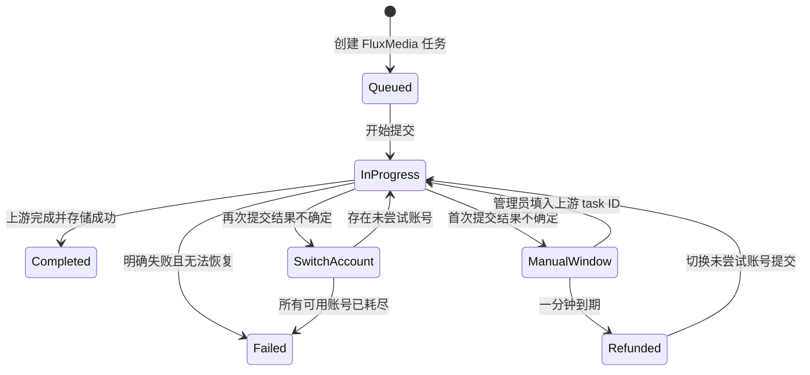

# OpenAI 视频接口兼容与异常恢复 - Plan

## Goal Capsule

- **Objective:** 让 FluxMedia 新旧视频接口统一使用选定的 OpenAI 视频创建地址、时长字段和四态公开协议，并为无法确认上游提交结果的 API 供应商任务提供可配置人工窗口、自动退款、跨账号重试和可告警日志。
- **Product authority:** 本文固定视频公开协议迁移、`needs_attention` 内部化、管理员人工恢复、超时退款与供应商账号切换、重试终局和日志告警契约；其他 OpenAI 视频参数、完整响应对象和非视频媒体不属于本计划。
- **Open blockers:** 无；公开状态本次直接替换，不保留旧状态兼容期。

---

## Product Contract

### Summary

FluxMedia 新增 `POST /v1/videos`，并让新旧视频接口统一输出 OpenAI 的 `queued`、`in_progress`、`completed`、`failed` 四种状态。
当 API 供应商提交结果无法确认时，系统在可配置的短暂人工窗口内允许管理员填入上游 task ID；窗口到期后先退款，再切换未尝试的供应商账号继续完成同一用户任务，并输出可直接配置采集告警的稳定结构化事件。

### Problem Frame

现有视频公开接口使用 FluxMedia 自定义地址、`duration` 字段及 `pending`、`submitting`、`processing`、`needs_attention` 等状态，调用方无法直接按 OpenAI 视频协议接入。
内部 `submit_uncertain` 会永久暂停自动投递和退款，底层虽有管理员核对 API，却没有管理页面、可运营处理时限或专用业务告警日志；API 供应商人工恢复还要求一个实际不会用于后续查询的 `pollUrl`。

### Key Decisions

- **新旧接口本次统一四态。** (session-settled: user-directed — chosen over deprecating old public statuses for one release: both interfaces should expose the OpenAI state machine immediately.) Governs R5-R7.
- **只对齐已选协议面。** (session-settled: user-directed — chosen over full OpenAI request and response parity: only the route, duration field, and public statuses are required.) Governs R1-R4, R8-R9.
- **首次异常保留一分钟人工窗口。** (session-settled: user-directed — chosen over indefinite manual reconciliation: user experience requires bounded intervention followed by automatic recovery.) Governs R10-R14.
- **退款后由平台承担后续生成成本。** (session-settled: user-directed — chosen over charging the user again after automatic recovery: uncertainty recovery is a platform responsibility.) Governs R15-R18.
- **每个账号只尝试一次。** (session-settled: user-directed — chosen over retrying the same account or cycling indefinitely: repeated uncertainty must switch suppliers and terminate after exhaustion.) Governs R16-R20.
- **日志标识是稳定运维契约。** (session-settled: user-directed — chosen over relying on generic API logs or free-text errors: administrators need deterministic collection and alert rules.) Governs R24-R29.

### State and Recovery Flow

图中的 `ManualWindow`、`Refunded` 和 `SwitchAccount` 只表示内部恢复阶段；公开接口在这些阶段均返回 `in_progress`。

### Actors

- A1. **API 调用方：** 通过新接口或保留的旧接口创建和查询视频任务，只消费统一的四态公开协议。
- A2. **视频生成用户：** 获得有界异常恢复；一旦触发自动恢复便收到退款，后续生成不再扣费。
- A3. **管理员：** 在管理页面查看首次待核对任务，并可在处理窗口内填写上游 task ID 恢复原供应商任务。
- A4. **视频恢复系统：** 管理人工窗口、幂等退款、供应商账号切换、尝试去重和终局收敛。
- A5. **日志采集与告警系统：** 按稳定事件标识和结构化字段提醒管理员，不依赖敏感请求内容。

### Requirements

**OpenAI protocol compatibility**

- R1. 新创建接口必须使用 `POST /v1/videos`，并继续由统一视频生成能力处理鉴权、扣费、幂等、调度和任务持久化。
- R2. 新接口必须使用 `seconds` 表示时长，同时接受数字和十进制数字字符串，并在进入统一视频能力前归一为正整数。
- R3. 旧 `POST /v1/videos/generations` 必须继续接受并返回其现有非状态字段，以支持兼容迁移。
- R4. 旧创建地址及旧时长字段必须在当前版本标记废弃，但不得因废弃标记拒绝仍合法的旧请求；移除日期按既定调用量和 Sunset 治理另行决定。
- R5. 新旧创建与查询接口必须只公开 `queued`、`in_progress`、`completed`、`failed`，不得再返回 `pending`、`submitting`、`processing` 或 `needs_attention`。
- R6. 尚未开始提交的任务公开为 `queued`；提交、首次人工窗口、退款后切换账号、上游轮询和下载阶段公开为 `in_progress`；终态分别公开为 `completed` 或 `failed`。
- R7. 内部可以保留 `submit_uncertain` 或等价恢复阶段，但任何外部 API、回调和用户状态视图都不得暴露 `needs_attention`。
- R8. 本计划不要求对齐 OpenAI 的其他请求参数、完整 Video 对象、列表、删除、变体内容或所有模型枚举。
- R9. 新旧接口必须继续返回同一个 FluxMedia task ID，以便创建、查询、管理员处理和跨供应商恢复围绕同一任务收敛。

**Manual reconciliation window**

- R10. API 供应商任务首次进入内部提交不确定阶段时，必须建立管理员处理截止时间；系统配置页可调整该时限，默认 60 秒。
- R11. 管理后台必须提供视频异常任务页面，展示 FluxMedia task ID、模型、供应商名称、供应商或成员标识、进入时间、截止时间、剩余时间、错误分类和当前处理状态。
- R12. 在首次处理窗口内，管理员确认上游已接受时必须填写 FluxMedia task ID 和上游 task ID；API 供应商不得再要求填写 `pollUrl`，系统使用任务固定的账号、模型、适配版本、当前凭据和可信来源恢复查询。
- R13. Adobe Direct 或其他确实依赖动态轮询地址的协议可以继续要求受信任的恢复地址，但管理页面必须按协议只展示必要字段。
- R14. 管理员恢复、管理员确认未接受和自动超时处理必须通过并发状态保护互斥；截止边界同时发生时只能有一个流程取得处理权。

**Refund and supplier switching**

- R15. 首次人工窗口到期且管理员未处理时，系统必须先对用户执行幂等退款，再开始自动重新提交；退款失败时不得提交新上游请求，并必须保持可恢复状态及输出错误告警。
- R16. 自动重新提交必须选择一个当前可用且本任务尚未尝试过的供应商账号，不得再次使用产生首次不确定结果的账号。
- R17. 自动重新提交成功后必须继续使用原 FluxMedia task ID，用户积分保持已退款状态，后续账号尝试不得再次扣费。
- R18. 退款后的供应商费用由平台承担；原供应商可能已创建但无法识别的孤儿任务不得阻止用户任务继续恢复。
- R19. 退款后的任一新账号再次产生提交不确定结果时，不再开启人工处理窗口，必须直接切换到下一个尚未尝试的可用账号。
- R20. 所有当时可用的合格供应商账号均尝试一次后仍无法确认提交结果时，系统必须停止重试、保持退款、把任务标记为 `failed`，并输出最高级别结构化告警。
- R21. 明确拒绝、认证失败、限流或其他既有可切换错误继续遵循账号池安全分类，但已经收到上游 task ID 的任务不得因普通轮询错误重新提交生成。
- R22. 每次尝试必须可追溯供应商及成员身份、尝试顺序和结果，以阻止同一任务在并发恢复或进程重启后重复使用账号。
- R23. 自动恢复必须可跨进程重启继续，不能依赖单进程计时器作为唯一的截止或尝试记录来源。

**Logging and alerts**

- R24. 首次进入内部提交不确定阶段时必须立即输出 `warn` 级稳定结构化事件，不能等到一分钟窗口结束后才通知管理员。
- R25. 人工恢复、人工确认未接受、窗口到期、退款结果、账号切换开始与结果、账号耗尽及自动恢复异常必须分别输出稳定事件标识。
- R26. 每个视频异常恢复事件必须包含事件标识、FluxMedia task ID、供应商 ID、供应商名称、成员或账号 ID、模型、协议、尝试序号、已尝试账号数、进入时间、截止时间、错误分类和 request ID；不适用的字段使用缺省值或省略，不得伪造。
- R27. 日志不得包含 prompt、完整请求或响应正文、API Key、Authorization、Cookie、媒体 URL、签名 URL、用户凭据或未脱敏上游载荷。
- R28. 管理员操作必须另有可审计记录，包含操作者、FluxMedia task ID、结论和时间；结构化运行日志和管理员审计不能互相替代。
- R29. `docs/video-submission-recovery-log-events.md` 是本功能日志事件名、字段、错误分类和建议告警规则的规范文档；实现改变任何稳定标识时必须同步更新文档并提供采集规则迁移说明。

**Deprecation governance**

- R30. 旧接口和旧时长字段的成功响应必须携带机器可读的废弃提示，并在文档中指向 `/v1/videos` 与 `seconds`；不得记录 prompt、媒体或请求体来统计迁移情况。
- R31. 旧接口和旧时长字段必须记录匿名调用计数；连续 30 天无调用后，才能至少提前 30 天发布明确 Sunset 日期。
- R32. 旧公开状态不进入上述兼容周期，因为新旧接口在本次发布即统一为四态；发布说明必须把这项状态变更列为破坏性变更。

### Key Flows

- F1. **Create and query through either public route**
  - **Trigger:** A1 使用新接口或旧接口创建视频任务。
  - **Actors:** A1, A4
  - **Steps:** 新接口解析 `seconds`，旧接口解析兼容字段，两者调用同一视频能力；查询和回调统一映射内部阶段为四态。
  - **Outcome:** 调用方只看到 `queued`、`in_progress`、`completed`、`failed`，并始终使用原 FluxMedia task ID。
  - **Covered by:** R1-R9, R30-R32
- F2. **Recover during the first manual window**
  - **Trigger:** 首个 API 供应商账号的提交结果无法确认。
  - **Actors:** A3, A4, A5
  - **Steps:** 系统持久化截止时间并立即告警；管理员在页面填入上游 task ID，系统校验原任务恢复身份并恢复查询。
  - **Outcome:** 任务继续 `in_progress`，不退款、不重复提交。
  - **Covered by:** R10-R14, R24-R29
- F3. **Expire the manual window and switch account**
  - **Trigger:** 首次处理窗口到期且没有管理员取得处理权。
  - **Actors:** A2, A4, A5
  - **Steps:** 系统取得超时处理权，幂等退款，选择未尝试账号并以同一 FluxMedia task ID 重新提交。
  - **Outcome:** 用户已退款，任务继续 `in_progress`，后续费用由平台承担。
  - **Covered by:** R14-R18, R22-R29
- F4. **Switch again or terminate after account exhaustion**
  - **Trigger:** 退款后的新账号再次产生提交不确定结果。
  - **Actors:** A4, A5
  - **Steps:** 系统跳过人工窗口并选择下一个未尝试账号；如果已无合格账号则停止重试并输出最高级别告警。
  - **Outcome:** 任务要么由另一个账号继续处理，要么保持退款并进入 `failed`。
  - **Covered by:** R19-R29

### Acceptance Examples

- AE1. **Covers R1-R9.** Given 调用方分别通过 `/v1/videos` 和 `/v1/videos/generations` 创建任务，when 任务处于排队、提交、人工窗口、轮询、下载和终态，then 两条接口及其查询和回调只返回对应的 OpenAI 四态，且任务 ID 不变。
- AE2. **Covers R2-R4.** Given 新接口分别传入 `seconds: 8` 与 `seconds: "8"`，when 请求通过校验，then 两者进入统一能力的时长均为整数 8；given 旧接口传入合法 `duration`，then 请求仍成功并收到废弃提示。
- AE3. **Covers R10-R13, R24-R29.** Given API 供应商首次进入提交不确定阶段，when 管理员在 60 秒内填写上游 task ID，then 系统不要求 `pollUrl`、恢复原账号任务查询，并输出进入异常及人工恢复事件。
- AE4. **Covers R14-R18.** Given 管理员提交恢复结论与 60 秒截止同时发生，when 两个流程竞争处理权，then 仅一个成功；若自动流程成功，则只退款一次、只选择一个新账号且不再扣费。
- AE5. **Covers R15, R25-R29.** Given 到期退款暂时失败，when 自动恢复执行，then 系统不向新账号提交，保持可恢复状态，并输出包含供应商名称和稳定错误分类的高优先级事件。
- AE6. **Covers R16-R20, R22-R23.** Given 任务依次在账号 A、B、C 出现提交不确定，when A 的人工窗口到期且 B、C 也不能确认，then A、B、C 各最多提交一次，任务保持退款并最终 `failed`，且产生账号耗尽最高级别告警。
- AE7. **Covers R17-R20.** Given 账号 B 在退款后成功返回上游 task ID，when 后续轮询完成，then 原 FluxMedia task ID 进入 `completed`，用户积分仍保持已退款，不创建第二次扣费。
- AE8. **Covers R21.** Given 某账号已经返回上游 task ID，when 后续查询出现可重试传输错误，then 系统重试原上游任务查询，不切换账号重新生成。
- AE9. **Covers R26-R29.** Given 任一异常恢复事件被采集，when 管理员按日志标识文档配置告警，then 可使用事件名、供应商名称、错误分类和任务 ID 定位问题，且日志中不存在 prompt、凭据、正文或媒体地址。
- AE10. **Covers R30-R32.** Given 客户端继续调用旧接口或旧时长字段，when 发布当前版本，then 请求仍兼容且可统计废弃调用；旧状态名称则不会再出现在任何新旧视频公开响应中。

### Success Criteria

- 新旧视频接口、查询和回调的契约测试证明公开状态集合严格等于 OpenAI 四态。
- 首次异常能够在进入状态时立即产生可采集告警，默认 60 秒后无需人工介入即可退款并切换账号。
- 并发、重复任务和进程重启测试证明每个账号最多尝试一次、退款最多一次、用户不会再次扣费。
- 日志采集可以只依赖稳定事件标识和错误分类完成告警，不需要匹配敏感正文或不稳定堆栈文本。

### Scope Boundaries

- 不全面复制 OpenAI Video 对象、模型枚举、内容变体、列表和删除接口；仅实现 R1-R9 指定的兼容面。
- 不为内部 `submit_uncertain` 更名或移除建立要求；公开隐藏和自动恢复行为才是本计划的产品契约。
- 不自动取消或删除无法识别的原供应商孤儿任务，因为平台没有可靠的上游 task ID。
- 不在供应商账号耗尽后循环使用历史账号，也不自动恢复用户扣费。
- 不把日志采集平台或告警通知渠道绑定到某一家产品；规范文档提供稳定字段和通用规则。

### Dependencies and Assumptions

- 供应商账号池能够识别可用账号、固定任务尝试历史，并在模型和能力约束下排除已尝试账号。
- 当前积分账本的幂等退款能力可作为用户退款真相，退款后的平台补偿生成无需再次消费用户积分。
- 视频恢复调度能够持久化截止时间和尝试进度，并在数据库与 Redis 可用时跨进程恢复。
- 供应商名称来自任务提交时的安全账号快照；日志只能读取该快照中的 ID 和名称字段。

### Sources

- `apps/web/src/app/api/admin/videos/reconciliation/route.ts`
- `apps/web/src/features/image-generation/video-operations.ts`
- `apps/web/src/features/image-generation/video-queue-schedule.ts`
- `apps/web/src/features/image-generation/api-video.ts`
- `apps/web/src/server/uol-bindings/video-generation.ts`
- `packages/shared/src/uol/operations/video-generation.ts`
- `packages/shared/src/system-settings/definitions.ts`
- `docs/api-upstream-adapter-admin.md`
- [OpenAI Video generation guide](https://developers.openai.com/api/docs/guides/video-generation)
- [OpenAI Create video reference](https://developers.openai.com/api/reference/resources/videos/methods/create)
