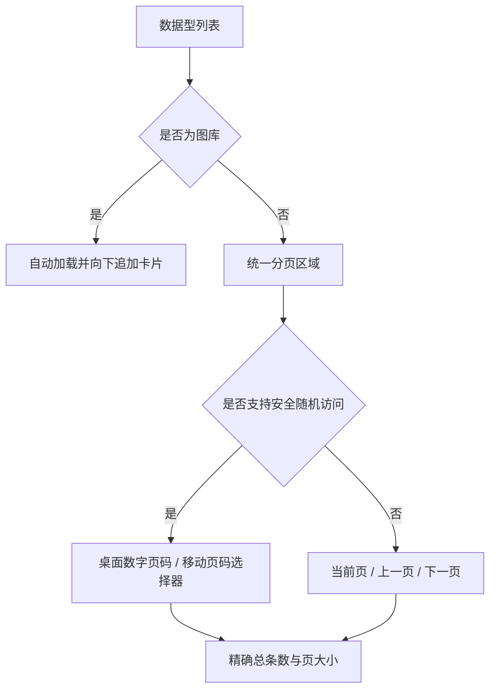
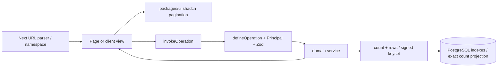
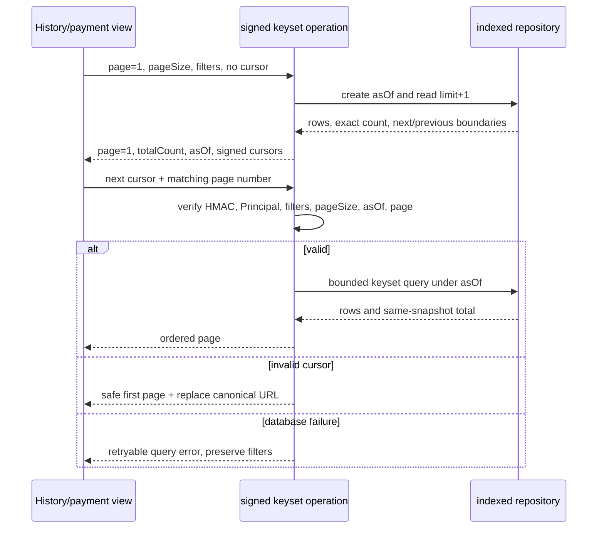
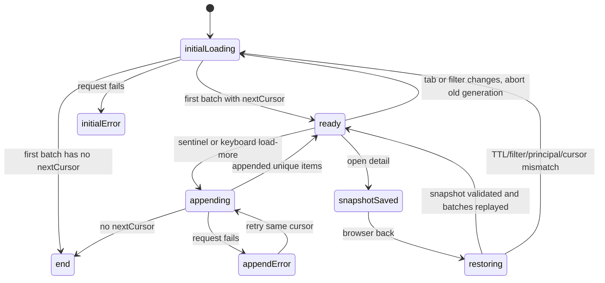

# 全站列表分页统一 - Plan

## Goal Capsule

- **Objective:** 一次性统一全站所有可增长数据型列表的分页体验，并将图库改为可恢复浏览进度的自动追加列表。
- **Product authority:** 本文固定列表纳入边界、分页能力分级、精确总数、URL 状态、响应式控件、越界修正、图库无限滚动和首批完整交付要求。
- **Authority hierarchy:** 用户已确认的 Product Contract（R1-R24、F1-F5、AE1-AE12）高于本计划的技术偏好；仓库约束和 UOL 安全不变量高于实现便利；本计划的 KTD 只决定 HOW，不改变 WHAT。
- **Execution profile:** Deep、跨页面、跨包、涉及数据库查询计划与客户端并发恢复；依赖边为 U1→U2、U2→U3/U4/U5、U3→U6/U7、U1-U7→U8，无依赖的单元可并行。
- **Stop conditions:** 任一 R1 清单项遗漏、精确计数只能靠近似或无界扫描、游标无法证明主体/筛选绑定、图库恢复会重复或越权、数据库性能门失败，或 MCP 工具集合出现未批准新增时停止发布。
- **Tail ownership:** U8 拥有发布尾部；只有逐页面验收、性能证据、a11y/i18n、UOL/MCP 回归和旧旁路清理全部完成后才可关闭本计划。
- **Open blockers:** 无；具体列表清单、能力分类、查询优化方案和验证门槛已在 Planning Contract 中解析完成。

---

## Product Contract

Product Contract unchanged。规划只将原先的 Deferred to Planning 三项落实为页面清单、能力分类和查询/索引方案，保留全部 R/F/AE/Key Decision 含义与 ID。

### Summary

全站可增长的数据型列表将采用一致的分页语言，并根据数据源能力提供数字跳页或稳定的顺序翻页。
图库不使用分页控件，改为下滑自动加载并在现有卡片后追加内容，同时保留详情返回后的浏览进度。

### Problem Frame

当前仓库同时存在数字页码、游标前后翻页、扩大查询范围的“加载更多”和无分页控件等多种列表行为。
本次改造由产品设计一致性驱动，不以既有用户投诉、绕过方式或量化痛点为前置条件。
统一体验必须覆盖用户侧和管理端，不能只替换已经存在的分页控件。

### Key Decisions

- **所有可增长数据型列表一次纳入。** (session-settled: user-directed — chosen over only changing existing paginated lists or staging selected surfaces: the product should establish one complete list behavior in a single rollout.) Governs R1-R3, R24。
- **统一外观并适配数据能力。** (session-settled: user-directed — chosen over forcing every list into random-access offset pagination: stable cursor lists must retain their performance characteristics.) Governs R6-R8。
- **总条数必须精确。** (session-settled: user-directed — chosen over lower bounds, cached totals, or approximate totals: every paginated list should state the exact authorized result count.) Governs R9-R10, R22。
- **分页与筛选状态进入 URL。** (session-settled: user-directed — chosen over component-memory-only state: refresh, sharing, and browser history should restore the same list view.) Governs R11-R14。
- **图库采用自动追加。** (session-settled: user-directed — chosen over conventional pagination or the current reload-style load-more behavior: browsing should continue downward without replacing loaded cards.) Governs R17-R21。
- **图库返回时恢复浏览进度。** (session-settled: user-directed — chosen over restarting from the first batch or preserving filters only: opening a work should not discard the browsing context.) Governs R20。
- **移动端使用页码选择器。** (session-settled: user-directed — chosen over compressed numeric buttons or removing random page selection: small screens should preserve page choice without horizontal crowding.) Governs R7。
- **单页仍保留总数和页大小。** (session-settled: user-directed — chosen over showing only the count or hiding the entire pagination region: list density remains controllable and the layout remains stable.) Governs R5, R15。
- **图库只显示过程状态。** (session-settled: user-directed — chosen over total-count or loaded-progress labels: the gallery should emphasize continuous browsing rather than inventory accounting.) Governs R19。
- **失效页收敛到最后一个有效页。** (session-settled: user-directed — chosen over always returning to page one or showing an empty invalid page: mutations and filter changes should retain the nearest useful context.) Governs R14。

### Requirements

**Coverage and shared behavior**

- R1. 本次改造必须覆盖用户侧和管理端所有可增长的数据型列表，包括表格、卡片列表、管理列表、历史记录和搜索结果。
- R2. 规划阶段必须形成逐页面列表清单，并把所有符合 R1 的现有分页、加载更多和无分页列表纳入同一发布验收。
- R3. 推荐作品、模型广场、导航菜单、下拉选项和固定摘要块不得因本次改造新增分页或无限滚动。
- R4. 分页列表必须使用统一的 shadcn/ui 分页语言，并在所有页面复用一致的当前页、上一页、下一页、禁用态和可感知名称。
- R5. 每个分页列表默认每页 20 条，并提供系统分页配置允许的页大小；当前默认候选为 10、20、50。

**Pagination capability and responsive layout**

- R6. 支持安全随机访问的列表必须在桌面端显示可选择的数字页码、上一页和下一页，并以省略标记收敛较长页码范围。
- R7. 支持安全随机访问的列表必须在移动端使用页码选择器，并保留上一页和下一页，不得依赖横向滚动完成分页。
- R8. 仅支持稳定游标导航的列表必须显示当前页序号、上一页和下一页，不得为了任意跳页退化为不稳定或无界的深页查询。
- R9. 每个分页列表必须展示当前权限和当前筛选条件下的精确总条数，不得使用估算、缓存近似或“至少 N 条”。
- R10. 精确总数、当前页数据和总页数必须使用相同的权限、筛选和可见性口径，不得通过总数泄露用户无权读取的记录。



**URL state and list transitions**

- R11. 除图库外，页码、页大小和全部有效筛选条件必须写入 URL，使刷新、分享链接以及浏览器前进或后退恢复同一列表视图。
- R12. 游标列表的 URL 必须同时携带恢复当前视图所需的不透明分页状态和可见页序号，并安全拒绝被篡改、过期或不匹配筛选条件的分页状态。
- R13. 更改页大小或任一筛选条件必须回到第一页并清除旧分页边界；仅切换页码时必须保留页大小和全部筛选条件。
- R14. 当删除、撤销、数据变化或筛选变化使当前页超出总页数时，系统必须导航到最后一个有效页；结果为零时必须规范化到第一页并显示对应空态。
- R15. 当结果为零或只有一页时，列表仍必须显示精确总条数和页大小选择器，但必须隐藏数字页码、当前页导航、上一页和下一页。
- R16. 翻页、筛选、页大小变化和分页区失败不得把查询失败伪装为空结果，并必须保留用户仍然有效的列表上下文和可恢复操作。

**Gallery infinite scroll**

- R17. 图库首次加载一批卡片后，用户接近列表底部时必须自动加载下一批，并把新卡片追加到现有卡片下方。
- R18. 图库追加不得替换、重复或重新排序已加载卡片，并必须阻止同一分页边界被并发重复请求。
- R19. 图库不得显示总条数或已加载数量，只能显示追加加载中、追加失败并可重试以及已到末尾三类过程状态。
- R20. 用户从图库打开作品详情后返回时，必须恢复筛选条件、已追加卡片、下一分页边界和滚动位置；恢复状态失效时必须安全回退到首批内容。
- R21. 图库的自动加载必须提供键盘和辅助技术可操作的等价加载入口，并在追加内容、失败和到达末尾时提供可感知反馈。

**Performance, robustness, and release completeness**

- R22. 精确计数和页面读取必须保持有界，并为高数据量列表提供查询计划与性能证据，不得以无界历史扫描换取精确总数或数字页码。
- R23. 非法页码、非法页大小、未知筛选值和无效游标必须在服务端校验，并回退到安全可解释的列表状态，不得导致越权、数据泄露或不可恢复错误。
- R24. 本次发布只有在 R1 边界内的全部列表完成改造并通过桌面、移动、键盘、浏览器历史和失败状态验收后才算完成，不接受只覆盖部分页面的首版。

### Key Flows

- F1. **打开或分享分页列表**
  - **Trigger:** 用户打开列表入口、刷新页面或访问带分页参数的分享链接。
  - **Steps:** 系统校验 URL 状态，按当前权限和筛选读取精确总数与当前页，并渲染与列表能力匹配的分页控件。
  - **Outcome:** 同一 URL 恢复同一有效列表视图，非法状态安全规范化。
  - **Covered by:** R4-R12, R15-R16, R22-R23。
- F2. **筛选、调整页大小或翻页**
  - **Trigger:** 用户修改筛选、选择页大小、选择页码或使用上一页和下一页。
  - **Steps:** 筛选和页大小变化重置分页边界，单纯翻页保留现有上下文，成功结果同步更新 URL 和分页区域。
  - **Outcome:** 总条数、总页数、列表内容和 URL 始终使用同一查询口径。
  - **Covered by:** R5-R16。
- F3. **写操作导致当前页失效**
  - **Trigger:** 用户删除或撤销记录，或并发数据变化使当前页越界。
  - **Steps:** 系统重新计算精确总数，将视图导航到最后一个有效页；没有结果时回到第一页空态。
  - **Outcome:** 用户不会停留在无效空页，也不会无条件丢失到第一页。
  - **Covered by:** R9-R10, R14-R16。
- F4. **持续浏览图库**
  - **Trigger:** 用户接近图库底部，或在追加失败后选择重试。
  - **Steps:** 系统只请求下一分页边界，将成功结果追加到底部，并公布加载中、失败或结束状态。
  - **Outcome:** 已加载卡片保持稳定，用户可以连续向下浏览。
  - **Covered by:** R17-R19, R21-R23。
- F5. **从作品详情返回图库**
  - **Trigger:** 用户从图库打开作品详情后通过浏览器返回。
  - **Steps:** 系统恢复筛选、卡片、下一分页边界和滚动位置；无效恢复状态回退到首批内容。
  - **Outcome:** 用户从离开位置继续浏览，且不会看到重复或错位卡片。
  - **Covered by:** R18, R20-R21, R23。

### Acceptance Examples

- AE1. **Covers R5-R10.** 给定桌面列表在当前筛选下有 246 条结果且页大小为 20，当用户打开第二页时，页面显示精确总数 246、总页数 13、当前页 2、数字页码、上一页、下一页和页大小选择器。
- AE2. **Covers R6-R8.** 给定同一随机访问列表在移动端打开，当用户查看分页区时，页面用页码选择器替代数字按钮并保留上一页和下一页；给定稳定游标列表，页面只提供当前页和顺序导航。
- AE3. **Covers R11-R13.** 给定用户在状态“失败”、类型“视频”、每页 50 条的第三页，当用户刷新、复制链接或前进后退时，页面恢复同一视图；修改任一筛选后回到第一页。
- AE4. **Covers R9-R10, R14.** 给定当前筛选共有 41 条且用户位于每页 20 条的第三页，当删除最后一条记录后，系统显示精确总数 40 并导航到第二页。
- AE5. **Covers R14-R16.** 给定筛选结果只有 8 条或没有结果，当页面加载时，分页区显示精确总数和页大小选择器，隐藏页码与前后导航；零结果同时显示列表空态且 URL 页码为 1。
- AE6. **Covers R9-R10, R23.** 给定当前用户只能读取本人记录，当列表计算总数或处理伪造筛选和游标时，响应不包含其他用户记录，精确总数也不透露其他用户记录数量。
- AE7. **Covers R17-R19, R21.** 给定图库已加载 20 张卡片，当用户接近底部时，下一批卡片追加在第 20 张之后；追加失败时原 20 张保持可见并提供重试，最后一批完成后显示已到末尾。
- AE8. **Covers R18, R20.** 给定用户已在图库加载三批并滚动到第三批中部，当打开作品详情后返回时，页面恢复三批卡片和原滚动位置，且没有重复卡片或重新排序。
- AE9. **Covers R20, R23.** 给定图库恢复状态中的分页边界已过期或与筛选不匹配，当用户返回时，页面安全加载首批内容并显示有效筛选，不渲染错位、重复或越权内容。
- AE10. **Covers R1-R3, R24.** 给定发布候选完成，当执行逐页面清单验收时，所有数据型表格、卡片列表、管理列表、历史记录和搜索结果均已纳入；推荐作品、模型广场和固定摘要块保持原行为。
- AE11. **Covers R16, R21, R24.** 给定用户只使用键盘或屏幕阅读器，当操作筛选、页大小、页码、上一页、下一页和图库等价加载入口时，所有状态和错误均可感知，焦点不会因结果更新而丢失到页面起点。
- AE12. **Covers R9, R22, R24.** 给定高数据量历史列表，当读取首屏、深游标页和精确总数时，查询计划没有无界扫描，性能证据满足规划阶段为该列表设定的预算。

### Success Criteria

- 逐页面清单证明 R1 范围内没有遗漏的数据型列表，且所有页面在同一发布中完成迁移。
- 用户能从任何分页列表识别精确总条数、当前页、页大小和可用导航，并通过 URL 恢复同一视图。
- 桌面端、移动端、键盘和辅助技术获得等价的分页能力，移动端不需要横向滚动。
- 图库连续追加稳定、失败可恢复、末尾可感知，并在详情返回时恢复浏览进度。
- 高数据量列表的精确计数与页面读取均有有界查询和性能取证，不以体验一致性破坏现有稳定分页约束。

### Scope Boundaries

**Outside this work unit**

- 推荐作品和模型广场的展示、筛选与加载行为。
- 导航菜单、下拉选项、固定摘要块和其他不会增长为多页结果的重复内容。
- 跨登录会话、跨设备或跨浏览器恢复图库浏览进度。
- 借本次改造重新设计列表字段、卡片内容、业务筛选口径或行级写操作。
- 缓存总数、近似总数和以“至少 N 条”替代精确计数的产品模式。

### Dependencies / Assumptions

- `packages/ui` 已提供共享 shadcn/ui 分页基础组件和通用页大小选择器；默认 20 与候选 10、20、50 由共享分页配置提供。
- 现有列表混合使用游标、offset、“加载更多”和无分页模式，规划阶段必须按 R6-R8 分类，而不是假定一种查询机制适合全部页面。
- 新增或改造的列表读取能力必须先通过统一接口层暴露，传输层只负责解析状态与调用 operation。
- 精确总数可能要求补充受权限和筛选约束的计数能力、索引或读模型，但不得弱化 R9-R10 的产品口径。
- 图库追加依赖稳定排序和不透明分页边界；刷新图库可以开启新的浏览会话，但详情返回必须遵守 R20。
- 量化用户痛点和现有绕过方式未知，且不是本次产品设计改造的交付前置条件。

### Outstanding Questions

**Resolve Before Planning**

- 无。

**Resolved During Planning**

- 具体页面、排除项和固定摘要已在 Planning Contract 的列表清单中冻结；所有新读取仍须先进入 UOL，并在页面级参数命名空间中接入。
- 随机访问 offset 适用于可由唯一排序键和有界 count+rows 查询支撑的列表；本人/管理员历史与管理支付订单保留签名双向 keyset，只提供当前页序号与顺序导航；图库独立使用无限滚动。
- 精确总数通过与 rows 共用 Principal、筛选和可见性 predicate 的数据库计数读取；generation、video_generation 与状态历史错误等高量表必须使用 KTD4 的事务一致精确计数投影，普通有界表使用适配索引的 index-only count。投影的写入、回填、幂等重建、漂移校验和查询读取必须在 U2 中定义并由 U8 取证；以 `EXPLAIN (ANALYZE, BUFFERS)` 与基准门证明不存在无界扫描。不得以“需要读模型时再决定”、缓存或近似计数解决 R22。

### Sources / Research

- `packages/ui/src/components/pagination.tsx`：共享 shadcn/ui 分页基础组件及页码、keyset 和加载更多导航语义。
- `packages/ui/src/components/page-size-select.tsx`：共享 shadcn/ui 页大小选择器。
- `packages/shared/src/pagination/config.ts`：默认页大小与候选页大小配置。
- `apps/web/src/features/pagination/server.ts`：站内读取系统分页配置的既有能力。
- `apps/web/src/features/pagination/url-page-size-select.tsx`：页大小变化驱动首屏 URL 的既有模式。
- `apps/web/src/features/payment/admin/payment-order-management.tsx`：现有游标前后翻页示例。
- `packages/shared/src/credits/components/transaction-history.tsx`：现有 offset 页码示例。
- `apps/web/src/app/[locale]/(dashboard)/dashboard/gallery/page.tsx`：图库当前通过扩大 limit 返回累计卡片的查询方式。
- `apps/web/src/features/image-generation/components/gallery-client.tsx`：图库当前“加载更多”链接行为。
- `docs/plans/2026-07-22-002-feat-unified-history-records-plan.md`：历史列表稳定有界分页与禁止无界总数扫描的约束。
- `docs/plans/2026-07-22-001-feat-wallet-usage-log-plan.md`：使用日志稳定分页、URL 筛选上下文和高数据量查询约束。

---

## Planning Contract

### Key Technical Decisions

- KTD1. **共享分页状态与 URL adapter 分层。** 在 `packages/shared/src/pagination/` 放置 DB-free 的 page/pageSize 解析、clamp、页码窗口和分页契约；在 `apps/web/src/features/pagination/` 放置 Next/next-intl 的 namespaced URL builder、push/replace 策略和响应式控件适配。业务页面不得复制页码窗口、白名单或 query-string 保留逻辑。该决策实现 R4-R16，继承产品 Key Decisions 对统一外观和 URL 状态的约束。
- KTD2. **offset 列表采用同口径 count+rows。** 服务端由读服务持有只读 `repeatable read` 事务，在同一 Principal、筛选 predicate 和读取窗口内先得到精确 `totalCount`，再 clamp 页码并读取 rows；调用方不得再包外层事务。共享分页信封固定为 `records/page/pageSize/totalCount/totalPages`，各 operation 可兼容保留既有业务集合字段，但不得再定义第二套分页元数据。所有排序补唯一 tie-breaker，避免同毫秒记录重复或遗漏。不得把 count 与 rows 分给不同权限层，也不得用缓存/近似值替代 R9-R10、R22。
- KTD3. **高量历史保留 signed bidirectional keyset。** 本人/管理员历史和管理支付订单继续使用 `(createdAt, kind/id)` 稳定排序；cursor 绑定 Principal scope、完整筛选、pageSize、asOf、方向、目标页序号和版本化签名。`asOf` 是跨请求固定的时间上界和浏览边界，不承诺跨请求冻结已删除或已更新行的历史数据库快照；每次请求仍在当前 Principal、筛选和该 `asOf` 上界内重新计算精确 `totalCount`，并在本次只读 repeatable-read 窗口内读取边界与 rows。cursor 只固定浏览边界与导航状态，不复用可能陈旧的首次总数；响应包含 `page/pageSize/totalCount/asOf/previousCursor/nextCursor`，不引入深页 offset。该决策满足 R8-R12、R22，并沿用 `docs/plans/2026-07-22-001-feat-wallet-usage-log-plan.md` 的快照化 keyset 约束。
- KTD4. **高量生成历史使用事务一致的精确计数投影。** 普通且受日期范围约束的表按筛选 predicate 做 index-only DB count；generation、video_generation 与状态历史错误使用按 `scopeKind/userId/visibility/type/status/model/utcDay` 维度维护的精确计数投影，并保留 owner/global 的 all-time rollup。投影随创建、状态、模型、可见性、归属、删除和自然日变化在同一数据库事务内增减，可幂等重建。用户日期按用户时区转换为 UTC 半开区间，管理员日期按部署级 `APP_TIME_ZONE` 转换；完整 UTC 日桶直接求和，首尾不完整日桶用带同一筛选 predicate 的索引边界查询补齐，确保 DST 和跨日边界精确。本人/管理员历史和状态页都从该投影组合相同筛选口径；每次 keyset 请求按当前权限、筛选和 cursor 的 `asOf` 重新计算 total。不得保留近似 count 或高量全历史 count scan 降级路径。
- KTD5. **每个页面读取先进入 UOL。** 新增或改造的列表 operation 使用明确 Zod input/output、Principal-derived scope、`readOnly` 与 `agentExposure: "human-only"`；页面/action 只解析 URL、构造 Principal、调用 `invokeOperation`。既有 `user.list`、`support.getMyTickets`、`support.getAllTickets`、历史和支付 operation 保留名称并做兼容扩展，避免 Agent 客户端破坏；MCP 白名单不新增。
- KTD6. **多列表页面使用独立 query namespace。** 管理设置至少使用 `model*`、`member*`、`group*`；管理员状态使用 `error*`。builder 必须保留同页其他 namespace；主动操作用 push，非法值、过期 cursor 和越界 canonicalization 用 replace。用户详情 Sheet 中既有固定数量预览保持摘要，不为其新增 URL 分页。对应 R3、R11-R16。
- KTD7. **图库使用卡片粒度 signed keyset 无限滚动。** 成品、上传图、视频分别返回 `items/nextCursor`，不返回总数；上传图的排序键必须表达 parent generation 与子卡片 index，避免一个 generation 展开多张上传图时跳项。客户端用 IntersectionObserver 加键盘等价按钮、请求锁、AbortController/世代令牌、ID 去重和 no-progress 保护。对应 R17-R21。
- KTD8. **图库恢复只保存有界元数据。** 详情返回使用版本化、TTL、有用户/筛选指纹的 sessionStorage 快照，仅保存 cursor 链、nextCursor、滚动锚点/scrollY 和版本，不保存无限 DTO 或长效签名 URL；返回时有界重放批次并重新签发资源地址。主体、筛选、版本、TTL、cursor 任一不匹配时回退首批，保留安全筛选。对应 R20、R23。
- KTD9. **统计摘要与分页明细解耦。** 推广关系保留 summary aggregate，关系明细单独分页；公告“进入页面即全部活跃公告已读”改为独立 set-based mutation，管理统计不从当前页数组推导。钱包最近 8 笔订单、dashboard/generate 最近项与管理员详情固定数量预览继续作为 R3 固定摘要，不升级为分页历史。
- KTD10. **旧旁路在交付尾部删除。** 图库现有 `page * 20` 累计查询、无界内存 slice、旧页面内手写分页和不可达 usage-log UI 不得继续作为第二实现；U8 验收后移除实验代码、旧徽标、无效重定向以外的旁路，并保留必要的安全 URL 兼容重定向。
- KTD11. **公开内容索引通过独立 content UOL 域。** 博客和 PSEO 完整索引注册到新增 `content` operation domain，使用 `public` access 与匿名页面的 system Principal 兼容；operation 只返回安全的分页内容摘要，页面通过 Web binding 调用，不把详情 related/FAQ 或站内搜索候选纳入分页。该决策使公开内容列表满足 R1/R4-R16，同时不改变模型广场、相关推荐和下拉候选的排除边界。

### Capability Inventory

| 页面/数据集合 | 能力 | 主入口与 owning files | URL namespace / 备注 |
|---|---|---|---|
| 用户生成历史 | signed keyset | `apps/web/src/app/[locale]/(dashboard)/dashboard/history/page.tsx`, `apps/web/src/features/image-generation/history-service.ts`, `apps/web/src/features/image-generation/components/history-query.ts` | `page/pageSize/cursor` 与既有 history filters；精确 count 同 asOf |
| 管理生成历史 | signed keyset | `apps/web/src/app/[locale]/(dashboard)/dashboard/admin/history/page.tsx`, `apps/web/src/features/image-generation/admin-history-service.ts` | 管理筛选绑定 actor、邮箱、模型、状态 |
| 管理支付订单 | signed keyset | `apps/web/src/app/[locale]/(dashboard)/dashboard/admin/payments/orders/page.tsx`, `apps/web/src/features/payment/admin/admin-payment-service.ts`, `apps/web/src/features/payment/admin/admin-payment-query.ts` | 既有 filter namespace，新增 page 与快照页序号 |
| 管理用户 | offset | `apps/web/src/app/[locale]/(dashboard)/dashboard/admin/users/page.tsx`, `packages/shared/src/support/components/admin-users/admin-users-management.tsx`, `packages/shared/src/support/actions/admin-users.ts` | 外层 `page/pageSize/search/status/creditsStatus`；详情 Sheet 拆 namespace |
| 用户/管理员工单 | offset | `apps/web/src/app/[locale]/(dashboard)/dashboard/support/page.tsx`, `packages/shared/src/uol/operations/support.ts`, `packages/shared/src/support/actions/ticket.ts` | 工单状态修正为真实枚举；total 与 rows 同 predicate |
| 工单详情消息历史 | offset | `apps/web/src/app/[locale]/(dashboard)/dashboard/support/[id]/page.tsx`, `packages/shared/src/support/actions/ticket.ts` | 消息 namespace 独立；已读写入与读取分离 |
| 用户/管理员公告 | offset | `apps/web/src/app/[locale]/(dashboard)/dashboard/announcements/page.tsx`, `apps/web/src/app/[locale]/(dashboard)/dashboard/admin/announcements/page.tsx`, `packages/shared/src/announcements/actions.ts`, `packages/shared/src/uol/operations/support.ts` | 管理筛选与全局 aggregate 独立；全部已读 set-based |
| 推广关系明细 | offset | `apps/web/src/app/[locale]/(dashboard)/dashboard/referrals/page.tsx`, `apps/web/src/features/referrals/referral-dashboard.tsx`, `packages/shared/src/uol/operations/referrals.ts` | summary cards 不分页，relationships 单独 namespace |
| 外部 API Key | offset | `apps/web/src/app/[locale]/(dashboard)/dashboard/external-api/page.tsx`, `apps/web/src/features/settings/components/external-api-key-section.tsx`, `packages/shared/src/uol/operations/external-api.ts` | `editableGroups` 保持辅助 options；human-only、敏感字段不进日志/MCP |
| 管理状态历史错误 | offset | `apps/web/src/app/[locale]/(dashboard)/dashboard/admin/status/page.tsx` | 保留 `error*` namespace；聚合/Top 错误摘要排除 |
| 模型配置管理 | offset | `apps/web/src/features/model-configuration/model-configuration-panel.tsx`, `apps/web/src/features/model-configuration/read-service.ts` | 管理设置中 `model*`；模型广场不处理 |
| 号池成员与分组 | 两个独立 offset | `apps/web/src/features/image-backend-pool/admin-panel.tsx`, `apps/web/src/features/image-backend-pool/admin-group-list.tsx`, `apps/web/src/features/image-backend-pool/repository.ts` | `member*` 与 `group*`；运行时全量快照 `pool.getAdminPool` 不被破坏 |
| 博客索引 | offset | `apps/web/src/app/[locale]/(marketing)/blog/page.tsx`, `apps/web/src/features/blog/` | 公开 Principal/UOL；详情相关推荐排除 |
| PSEO 索引 | offset | `apps/web/src/app/[locale]/(marketing)/pseo/page.tsx`, `apps/web/src/features/pseo/lib/pseo-data.ts` | 索引列表纳入；详情 FAQ/related 排除 |
| 图库成品/上传图/视频 | 无限滚动 keyset | `apps/web/src/app/[locale]/(dashboard)/dashboard/gallery/page.tsx`, `apps/web/src/features/image-generation/components/gallery-client.tsx` | tab/filter 独立 session；不显示 total/loaded |

已核查的明确排除：`/models` 与首页推荐作品；钱包最近 8 笔订单；dashboard/generate 最近项；管理员用户详情中的固定数量批次、交易、生成、API Key、审计预览；状态页聚合/Top 错误摘要；analytics 图表桶；PSEO 详情 related/FAQ；导航和下拉候选。仓库当前只有 Fumadocs 搜索下拉接口，没有独立数据型搜索结果页，因此 `apps/web/src/app/api/search/route.ts` 保持有界候选和管理员授权，不为下拉新增分页；未来新增完整搜索结果页必须直接复用 U1/U2 契约。已退役 usage-log 路由和未挂载旧积分历史组件不作为发布表面，并在 U8 清理确认无引用的死代码。

### High-Level Technical Design

共享组件、UOL、领域 service/repository、数据库和页面之间的关系如下：



普通 offset 列表的请求与越界收敛顺序：

```mermaid
sequenceDiagram
  participant B as Browser URL
  participant P as Page adapter
  participant O as UOL operation
  participant D as DB read model
  B->>P: parse page/pageSize/filter
  P->>O: invoke(input, Principal)
  O->>D: count with same predicate/read window
  D-->>O: totalCount
  O->>O: clamp page; zero results use page 1
  O->>D: read canonical page in same read window
  D-->>O: bounded rows
  O-->>P: canonical page, totalPages, records
  P-->>B: push active action / replace normalization
```

稳定 keyset 的页序号与同一快照绑定；数据库失败与 cursor 无效必须分开：



图库状态机与详情返回恢复：



能力分流规则：

| 判定 | 返回契约 | UI |
|---|---|---|
| 唯一排序键 + 有界精确 count | `records/page/pageSize/totalCount/totalPages` | 桌面数字页码与 ellipsis；移动页码选择器；上一页/下一页 |
| 只能稳定顺序读取 | `records/page/pageSize/totalCount/asOf/previousCursor/nextCursor` | 当前页序号；上一页/下一页 |
| 图库卡片追加 | `items/nextCursor` | 自动触底、键盘等价按钮、加载/重试/结束，不显示总数 |
| 固定摘要或展示型推荐 | 保持现有契约 | 不新增分页或无限滚动 |

### Planning Assumptions

- 系统分页配置继续由 `packages/shared/src/pagination/config.ts` 提供默认 20 与 `[10,20,50]`；运营修改白名单后，旧 URL 以安全默认值 replace 规范化。
- 页面级 query 参数只保存可公开的筛选、页码、页大小和签名 cursor；cursor、业务 ID、内部 SQL、API Key 和敏感筛选不进入日志、错误文本或 MCP description。
- 旧 usage-log 路由重定向和未挂载 `CreditUsageSection/TransactionHistory` 不作为发布表面；钱包最近订单、dashboard/generate 最近项和管理员详情固定数量预览保持摘要排除。
- Fumadocs 搜索仍只允许管理员；其现有搜索下拉属于候选选项而不是完整结果页，保持有界返回但不新增分页控件。

### Sequencing and Ownership

U1 先沉淀共享状态与 UI；U2 随后确定 UOL 契约、精确 count 读模型与索引；U3-U5 在 U2 后按数据域并行迁移；U6 与 U7 在 U3 完成后可并行处理排除项清理和图库状态机；U8 等待 U1-U7，承担跨面回归、性能证据和旧旁路清理。任何页面不得绕过 UOL 直接新增生产读取。U8 是唯一发布尾部 owner。

### System-Wide Impact

- **Data lifecycle:** offset 列表接受翻页期间 count 变化并重新 canonicalize；keyset 和图库以 `asOf` 固定浏览会话，刷新才看到新项；删除当前末页项目后重新读取最后有效页。
- **Authorization and privacy:** rows 与 total 共用 Principal scope；管理员与本人详情集合拆分资源归属；external API Key 列表继续 human-only，敏感字段不进入 MCP 或日志。
- **Agent parity:** 保留已存在且已接线的 Agent operation 名称与输入兼容；所有新 UI-only operation 标 `human-only`；回归测试同时检查 Admin/User `tools/list` 和 `tools/call`，证明没有未批准新增工具。
- **Performance:** 索引、精确计数投影和 query-plan 证据成为发布依赖；禁止以无限 offset、全量排序、逐行详情查询或内存 slice 伪造有界分页。
- **Observability and URL privacy:** URL 只保存恢复视图必需的状态；邮箱、订单号等搜索条件继续按产品要求入 URL 时，必须通过全局 `Referrer-Policy: same-origin`（或更严格）避免 query 泄露到外站，并禁止 analytics、日志、错误上报和高基数标签采集原始 query/cursor。服务端日志只记录 operation、稳定错误码、结果数与耗时；敏感 API Key/内部 ID 继续不入 URL。
- **Accessibility/i18n:** 分页控件使用共享 shadcn 语义；桌面/移动控件均可键盘操作，分页和图库状态经 `aria-live` 感知；中文/英文标签来自既有 i18n 体系。

### Risks & Dependencies

| 风险/依赖 | 影响 | 缓解与门槛 |
|---|---|---|
| 高量精确 count 退化为顺序扫描 | 首屏和深页延迟、数据库压力 | U2 补索引/精确投影；U8 保存 `EXPLAIN (ANALYZE, BUFFERS)`，无无界 Seq Scan/全量 Sort |
| keyset cursor 与筛选或主体错配 | 越权、重复、漏项 | HMAC 绑定 actor/filter/pageSize/asOf/page；篡改与过期 replace 回首屏，DB 错误单独呈现 |
| 多列表 query 参数互相覆盖 | 刷新/分享恢复错误 | U1 namespaced parser/builder contract tests；每页更新保留其他 namespace |
| 工单/公告旧 UOL stub 误扩大 MCP | Agent 能力面未经批准扩张 | 新读取标 `human-only`；registry/MCP 白名单快照测试；全部 operation 真实接线后才发布 |
| `pool.getAdminPool` 全量运行时快照被 UI 分页破坏 | 调度/运行时能力回归 | 保留原 operation；新增 human-only 管理分页读取或兼容扩展，运行时读取不分页 |
| 图库并发触底、慢响应、详情返回 | 卡片重复、滚动跳动、旧筛选污染 | 请求锁、Abort/世代 token、ID 去重、no-progress 停止、版本化 TTL 快照和有界重放 |
| 一个 generation 展开多张上传卡 | 游标按父行导致跳项 | cursor 排序键下沉到 `(parentCreatedAt,parentId,inputIndex/stableInputId)` |
| URL 中邮箱、订单号和 cursor 被日志或 Referrer 收集 | 个人数据或分页状态泄露 | 全局 same-origin referrer policy；analytics/logger/error reporter 清除原始 query；U8 以外站请求与日志 canary 验证 |
| 旧固定列表遗漏或误纳入 | R1/R3/R24 失败 | U8 逐页面 inventory 验收；固定摘要、推荐作品、模型广场、下拉候选显式对照 |

---

## Implementation Units

### U1. 建立共享分页状态、页码窗口与 URL/UI adapter

- **Goal:** 在 `packages/shared` 与 `packages/ui` 形成 offset/keyset 共用的状态、精确总数展示、桌面数字页码/ellipsis、移动页码选择器、上一页/下一页和页大小选择器；在 Web 提供 namespaced URL adapter、push/replace canonicalization 与焦点恢复。
- **Requirements:** R4-R8、R11-R16；F1-F3；AE1-AE5、AE11。
- **Files:** `packages/shared/src/pagination/config.ts`, `packages/shared/src/pagination/state.ts`, `packages/shared/src/pagination/state.test.ts`, `packages/ui/src/components/pagination.tsx`, `packages/ui/src/components/pagination-controls.tsx`, `packages/ui/src/components/page-size-select.tsx`, `apps/web/src/features/pagination/server.ts`, `apps/web/src/features/pagination/url-adapter.ts`, `apps/web/src/features/pagination/url-adapter.test.ts`, `apps/web/src/features/pagination/pagination-controls.tsx`, `apps/web/src/features/pagination/shadcn-pagination.test.ts`。
- **New files:** `packages/shared/src/pagination/state.ts`, `packages/shared/src/pagination/state.test.ts`, `packages/ui/src/components/pagination-controls.tsx`, `apps/web/src/features/pagination/url-adapter.ts`, `apps/web/src/features/pagination/url-adapter.test.ts`, `apps/web/src/features/pagination/pagination-controls.tsx` and `apps/web/src/features/pagination/shadcn-pagination.test.ts` are new; the remaining paths extend existing pagination primitives.
- **Approach:** 解析严格拒绝数组、负数、超大整数和下线 pageSize；统一计算 `totalPages=max(1,ceil(totalCount/pageSize))`、clamp、零结果第一页和数字窗口；adapter 接受 namespace/filter schema 并保留同页其他参数。分页失败返回显式 error/retry 状态，不重置成 empty。
- **Test Scenarios:** (1) total 为 0/1/20/21/41 时验证 totalPages、隐藏导航和页码窗口；(2) page/pageSize 数组值、负数、超大值、白名单变化被安全 canonicalize；(3) 更新 `model*` 不丢失 `member*`/`group*`，筛选或 pageSize 清 cursor 回 page 1；(4) desktop 数字页码、mobile select、previous/next 的 aria/current/focus 语义；(5) stale response 与 count/rows 任一失败保持错误态和有效筛选。
- **Verification:** DB-free Vitest 覆盖纯状态和 URL；服务端渲染测试验证共享 shadcn 组件无嵌套交互元素。
- **Depends on:** `packages/ui/src/components/pagination.tsx`、`packages/shared/src/pagination/config.ts`。

### U2. 固化 UOL 分页契约、signed keyset 精确计数与读模型索引

- **Goal:** 扩展共享 offset/keyset schema、接通 operation binding，并为高量历史/状态/支付集合建立精确、可证明有界的 count 与 rows 读路径。
- **Requirements:** R9-R10、R12、R22-R23；F1-F3；AE6、AE12。
- **Files:** `packages/shared/src/pagination/contracts.ts`, `packages/shared/src/pagination/contracts.test.ts`, `packages/shared/src/uol/operations/image-generation.ts`, `packages/shared/src/uol/operations/payment.ts`, `packages/shared/src/uol/operations/user-auth.ts`, `packages/shared/src/uol/operations/support.ts`, `packages/shared/src/uol/operations/external-api.ts`, `packages/shared/src/uol/operations/image-backend-pool.ts`, `apps/web/src/server/uol-bindings.ts`, `apps/web/src/server/uol-bindings/pagination.ts`, `apps/web/src/features/image-generation/operations.ts`, `apps/web/src/features/image-generation/video-operations.ts`, `apps/web/src/features/dashboard/output-usage-read-model.ts`, `apps/web/src/features/image-generation/generation-deletion-service.ts`, `apps/web/src/features/image-generation/video-recovery-repository.ts`, `packages/shared/src/generation-maintenance.ts`, `packages/shared/src/uol/tests/pagination-exposure.test.ts`, `packages/shared/src/mcp/tool-factory.test.ts`, `packages/shared/src/mcp/user-tool-factory.ts`, `packages/database/drizzle/0088_unified_list_pagination_indexes.sql`, `packages/database/drizzle/meta/_journal.json`, `packages/database/src/schema.ts`。
- **New files:** `packages/shared/src/pagination/contracts.ts`, its test, `apps/web/src/server/uol-bindings/pagination.ts`, `packages/shared/src/uol/tests/pagination-exposure.test.ts` and `packages/database/drizzle/0088_unified_list_pagination_indexes.sql` are new; all projection write-side paths listed above are existing files to extend.
- **Approach:**
  1. offset operation 输出 `records/page/pageSize/totalCount/totalPages`；keyset 输出同 `asOf` 的 `records/page/pageSize/totalCount/previousCursor/nextCursor`；cursor 版本化并绑定 Principal scope、全部筛选、pageSize、asOf、方向、目标页；初始 URL 固定 page=1 无 cursor，失效 cursor 安全回首屏但数据库异常独立抛出。既有 operation 的 `users/tickets/keys` 等集合字段只做兼容别名或同版本迁移，所有调用方最终消费同一分页信封；只有图库追加契约使用 `items/nextCursor`，其他分页列表禁止 `items`/`records` 并存为两种新契约。
  2. 手写 `0088_unified_list_pagination_indexes.sql` 并登记 journal：为 generation/video/payment/status/error/referral/ticket/announcement 等排序和过滤补唯一 tie-breaker 与覆盖索引；为 generation 与 video_generation 建立按 `scopeKind/userId/visibility/type/status/model/utcDay` 分桶并含 owner/global all-time rollup 的精确计数投影。状态历史错误是 generation 的 `failed` 投影视图，不另建一份可漂移的统计真相；用户日期按用户时区转 UTC 半开区间，管理员日期按部署 `APP_TIME_ZONE` 转 UTC，边界日用索引 predicate 补查。
  3. 投影维护采用数据库层单一事务机制，使任何现有或未来的写入路径都不能绕过：在 INSERT、DELETE 以及影响 user、可见性、type、status、model、createdAt 的 UPDATE 上按 OLD/NEW 维度做差量增减；无关字段更新必须零写放大，重复写同状态必须幂等。写侧覆盖图片创建与失败/完成、视频创建与 CAS 状态机、恢复认领、媒体墓碑删除及过期/留存维护；现有底层 service 自带事务的路径不得再嵌套外层事务。
  4. 同一迁移先建投影结构和维护机制，再以基表权威事实执行可重入回填；提供受限的 system-only 幂等重建与漂移校验入口。部署采用 expand/backfill/verify/switch：读侧只有在全量对账为零漂移后切换，回滚只回退读取，不停维护也不降级为全历史 scan；重建期间以隔离表或版本切换避免部分结果被读到。投影读取和边界补查均在同一只读 repeatable-read 窗口内完成，避免 count 与 rows 跨快照。
  5. U2 只交付已经选定的投影与索引方案，不把读模型是否采用留给实施阶段；U8 对投影一致性、重建结果和查询计划保存证据。
- **Test Scenarios:**
  1. cursor 篡改、跨用户、跨筛选、跨 pageSize、过期和未知版本均拒绝。
  2. 同毫秒记录按 id 稳定无重复漏项。
  3. count 与 rows 使用同 Principal/filter predicate，权限收窄不泄露 total。
  4. count 失败时不得读取 rows；count 成功后 rows 失败时返回同一类 retryable error。
  5. generation/video/status-error 计数投影在创建、状态、模型、可见性、归属和自然日变化、物理删除、重复重放、并发状态 CAS、回填及在线重建后与基表精确对账；用户时区 DST/首尾 UTC 边界与管理员 `APP_TIME_ZONE` 日期筛选分别核对，完整日桶求和与边界补查结果一致；无关 metadata/claim/quota 更新不改变计数，漂移时阻断发布而非降级为近似 count。
  6. MCP Admin/User 工具集合与批准快照一致，human-only operation 不可 `tools/list` 或 `tools/call`。
  7. migration journal、索引和精确计数投影可重建且不改变既有财务/调度事实。
- **Verification:** UOL registry/access/invoke、MCP contract tests；隔离 PostgreSQL 对目标查询、计数投影回填/重建和代表性高量场景保存 `EXPLAIN (ANALYZE, BUFFERS)` 与对账证据。不得因 `pool.getAdminPool` UI 分页改变运行时全量快照。
- **Depends on:** U1；`docs/plans/2026-07-22-001-feat-wallet-usage-log-plan.md` 的 keyset/索引约束。

### U3. 迁移历史、支付订单、用户与管理员状态错误列表

- **Goal:** 将高量本人/管理员历史和管理支付订单补精确总数、页序号与 pageSize，同时将管理用户和状态历史错误改成完整 offset 随机访问。
- **Requirements:** R1-R16、R22-R24；F1-F3；AE1-AE6、AE12。
- **Files:** `apps/web/src/features/image-generation/history-service.ts`, `apps/web/src/features/image-generation/admin-history-service.ts`, `apps/web/src/features/image-generation/history-repository.ts`, `apps/web/src/features/image-generation/admin-history-repository.ts`, `apps/web/src/features/image-generation/components/history-query.ts`, `apps/web/src/features/image-generation/components/history-client.tsx`, `apps/web/src/features/payment/admin/admin-payment-service.ts`, `apps/web/src/features/payment/admin/admin-payment-query.ts`, `apps/web/src/features/payment/admin/admin-payment-repository.ts`, `apps/web/src/features/payment/admin/payment-order-management.tsx`, `apps/web/src/app/[locale]/(dashboard)/dashboard/history/page.tsx`, `apps/web/src/app/[locale]/(dashboard)/dashboard/admin/history/page.tsx`, `apps/web/src/app/[locale]/(dashboard)/dashboard/admin/payments/orders/page.tsx`, `apps/web/src/app/[locale]/(dashboard)/dashboard/admin/users/page.tsx`, `packages/shared/src/support/components/admin-users/admin-users-management.tsx`, `packages/shared/src/support/actions/admin-users.ts`, `apps/web/src/app/[locale]/(dashboard)/dashboard/admin/status/page.tsx`, `apps/web/src/features/image-generation/history-service.test.ts`, `apps/web/src/features/image-generation/admin-history-service.test.ts`, `apps/web/src/features/payment/admin/admin-payment-service.test.ts`, `apps/web/src/features/payment/admin/admin-payment-query.test.ts`, `packages/shared/src/support/actions/admin-users.test.ts`, `apps/web/src/app/[locale]/(dashboard)/dashboard/admin/status/page.test.ts`。
- **New files:** `apps/web/src/app/[locale]/(dashboard)/dashboard/admin/status/page.test.ts` and any newly introduced pagination-specific repository tests are new; the listed services, pages and existing test files are modified in place.
- **Approach:** 历史与支付保留 bidirectional keyset；`asOf` 只固定创建时间上界，不把跨请求的删除/更新伪装成历史快照；每次请求在该上界、当前 Principal 和筛选下重新计算精确 totalCount，并在同一只读 repeatable-read 窗口内读取边界和记录，cursor 页号必须与 URL page 一致。管理员用户和 status error 使用 count-first offset，其中 status error 的高量计数走 KTD4 投影，越界重新查最后页。用户详情 Sheet 的五类固定数量集合保持摘要，外层用户列表翻页不触发额外全量详情读取。
- **Test Scenarios:** (1) 246 条历史/订单第 2 页显示 total 246、页号和前后导航；(2) keyset 深页、上一页反向查询和删除末页最后项收敛最后有效页；(3) 管理用户筛选/页大小进入 URL，打开详情 Sheet 不改变外层分页且固定摘要不出现分页控件；(4) 状态 error page=0、超大页、固定范围与自定义日期 canonicalize；(5) 高量首屏/深 cursor/count 走索引/精确投影且不执行深 offset 或全表排序；(6) 状态错误投影与基表在状态迁移、日期边界和回填后保持精确一致。
- **Verification:** UOL binding 输出 schema、页面桌面/mobile/keyboard/history 浏览器验收；高量基准达到 U8 的统一门槛。
- **Depends on:** U1、U2。

### U4. 接通工单、消息、公告、推广关系与 API Key 分页

- **Goal:** 将支持与账户管理列表从全量/内存 slice 迁移到真实 UOL 分页，保留已读和统计语义。
- **Requirements:** R1-R16、R23-R24；F1-F3；AE1-AE6、AE10-AE11。
- **Files:** `packages/shared/src/support/schemas/ticket.ts`, `packages/shared/src/support/actions/ticket.ts`, `packages/shared/src/support/actions/index.ts`, `packages/shared/src/uol/operations/support.ts`, `apps/web/src/app/[locale]/(dashboard)/dashboard/support/page.tsx`, `apps/web/src/app/[locale]/(dashboard)/dashboard/support/[id]/page.tsx`, `packages/shared/src/announcements/actions.ts`, `apps/web/src/app/[locale]/(dashboard)/dashboard/announcements/page.tsx`, `apps/web/src/app/[locale]/(dashboard)/dashboard/admin/announcements/page.tsx`, `apps/web/src/features/announcements/admin-announcements-management.tsx`, `apps/web/src/features/referrals/referral-dashboard.tsx`, `apps/web/src/features/referrals/actions.ts`, `packages/shared/src/uol/operations/referrals.ts`, `apps/web/src/app/[locale]/(dashboard)/dashboard/referrals/page.tsx`, `apps/web/src/features/settings/components/external-api-key-section.tsx`, `apps/web/src/features/settings/components/external-api-key-list-state.ts`, `packages/shared/src/uol/operations/external-api.ts`, `apps/web/src/server/uol-bindings.ts`, `packages/shared/src/uol/operations/support.test.ts`, `packages/shared/src/announcements/actions.test.ts`, `apps/web/src/features/referrals/referral-dashboard.test.tsx`, `apps/web/src/features/settings/components/external-api-key-list-state.test.ts`。
- **New files:** `packages/shared/src/announcements/actions.test.ts`, `apps/web/src/features/referrals/referral-dashboard.test.tsx` and `apps/web/src/features/settings/components/external-api-key-list-state.test.ts` are new where absent; the support, announcement, referral and API-key production paths are existing files to extend.
- **Approach:** 修正 operation 状态枚举为真实 `open/in_progress/resolved/closed`，补 category/priority/user/unread DTO；工单详情消息单独分页，查看详情的 set-based 已读 mutation 与消息读取分离。用户公告分页读取后仍由独立 operation 将全部活跃公告标已读；管理公告 total/统计由全局 aggregate 读取。推广 summary 与 relationships operation 分离；API Key 分页但 `editableGroups` 保留不分页，完整 Key 仅允许本人 human-only 响应用于复制，不得进入 MCP、日志或非本人响应。
- **Test Scenarios:** (1) 用户/管理员筛选返回正确可见 rows 与精确 total；(2) 打开工单详情只分页消息但能一次性标记全部应读消息；(3) 用户公告只请求当前页仍将全部活跃公告标读，管理员统计不随当前页变化；(4) 推广关系翻页不改变 summary；(5) API Key 本人响应仍可恢复和复制完整 Key，但 MCP、日志和非本人响应均不包含 secret，失败不伪装 empty；(6) operation 接线后 MCP 工具集合没有新增。
- **Verification:** DB-free service/contract tests 加页面浏览器验证；公告、工单和 API Key 日志检查不含业务 ID、cursor 和秘密值。
- **Depends on:** U1、U2。

### U5. 迁移模型配置、号池成员/分组、博客与 PSEO 索引

- **Goal:** 覆盖剩余管理设置和公开内容索引等可增长数据列表，同时保持运行时快照、相关推荐和搜索下拉候选排除。
- **Requirements:** R1-R5、R11-R16、R23-R24；F1-F2；AE1-AE5、AE10-AE11。
- **Files:** `packages/shared/src/uol/types.ts`, `packages/shared/src/uol/operations/content.ts`, `packages/shared/src/uol/operations/content.test.ts`, `packages/shared/src/uol/operations/index.ts`, `apps/web/src/server/uol-bindings/content.ts`, `apps/web/src/server/uol-bindings.ts`, `apps/web/src/features/model-configuration/model-configuration-panel.tsx`, `apps/web/src/features/model-configuration/model-configuration-table.tsx`, `apps/web/src/features/model-configuration/read-service.ts`, `apps/web/src/features/image-backend-pool/admin-panel.tsx`, `apps/web/src/features/image-backend-pool/admin-group-list.tsx`, `apps/web/src/features/image-backend-pool/repository.ts`, `apps/web/src/server/uol-bindings/image-backend-pool.ts`, `packages/shared/src/uol/operations/image-backend-pool.ts`, `apps/web/src/app/[locale]/(marketing)/blog/page.tsx`, `apps/web/src/lib/source.ts`, `apps/web/src/app/[locale]/(marketing)/pseo/page.tsx`, `apps/web/src/features/pseo/lib/pseo-data.ts`, `apps/web/src/features/model-configuration/read-service.test.ts`, `apps/web/src/features/image-backend-pool/repository.test.ts`, `apps/web/src/app/[locale]/(marketing)/blog/page.test.tsx`, `apps/web/src/features/pseo/lib/pseo-data.test.ts`。
- **New files:** `packages/shared/src/uol/operations/content.ts`, `packages/shared/src/uol/operations/content.test.ts`, `apps/web/src/server/uol-bindings/content.ts` and the blog page test are new; the remaining model, pool, content-source and PSEO paths are existing files to extend.
- **Approach:** model/member/group 分别使用 `model*`/`member*`/`group*` namespace；`pool.getAdminPool` 继续服务运行时全量快照，UI 新增 human-only 分页 operation 或兼容扩展。博客真实 Fumadocs 内容源与 PSEO JSON 索引通过 `content.listBlogPosts`/`content.listPseoPages` 两个 `public` operation 使用 offset 契约；页面通过 Web binding 消费 `records/page/pageSize/totalCount/totalPages`，详情 related/FAQ 和不分页 options 保留。Fumadocs 搜索下拉保持现有有界管理员接口，不加入分页 UI。
- **Test Scenarios:** (1) 三张管理设置列表独立翻页、筛选和浏览器历史恢复；(2) runtime pool snapshot 仍返回完整成员/分组而 UI 分页只影响展示；(3) 博客真实 Fumadocs 内容源和 PSEO JSON 公开索引按 locale 稳定排序，content operation 的匿名 Principal、page 越界和 totalCount 与页面一致，详情 related 不显示分页；(4) 搜索候选、导航和模型广场不出现分页控件；(5) 非管理员文档搜索仍 401/403，确认排除项没有被误改。
- **Verification:** 公开/管理员权限 contract tests、响应式页面验收和 i18n 快照。
- **Depends on:** U1、U2。

### U6. 完成摘要排除、退役列表清理与 UOL 口径回归

- **Goal:** 证明钱包最近订单、管理员详情预览、dashboard/generate 最近项、状态/analytics 摘要和退役 usage-log UI 均正确排除；清理未挂载的旧列表实现，避免它们成为第二套分页或 UOL 旁路。
- **Requirements:** R1-R3、R24；AE10。
- **Files:** `apps/web/src/app/[locale]/(dashboard)/dashboard/wallet/page.tsx`, `apps/web/src/features/wallet/components/wallet-recent-orders.tsx`, `apps/web/src/app/[locale]/(dashboard)/dashboard/generate/page.tsx`, `packages/shared/src/support/components/admin-users/admin-users-management.tsx`, `apps/web/src/app/[locale]/(dashboard)/dashboard/admin/status/page.tsx`, `apps/web/src/app/[locale]/(dashboard)/dashboard/usage-log/page.tsx`, `packages/shared/src/credits/components/transaction-history.tsx`, `apps/web/src/features/wallet/wallet-page-data.test.ts`, `apps/web/src/features/dashboard/dashboard-support-data.test.ts`。
- **Approach:** 为明确固定摘要保留现有有界 limit 和无分页 UI，记录其产品目的；核查退役路由/组件引用后彻底删除不可达旧列表代码，必要重定向继续指向统一历史。任何仍可由导航、路由或页面触达并会持续增长的集合必须回到 inventory，而不是以“摘要”名义规避分页。
- **Test Scenarios:** (1) 钱包只显示最近 8 笔、generate/dashboard 只显示固定最近项且无分页控件；(2) 管理员详情预览保持固定数量，外层用户表分页不受影响；(3) status/analytics 摘要与分页历史错误互不混用；(4) usage-log 旧入口只重定向，未挂载交易历史组件无残留入口或 UOL 旁路；(5) 推荐作品/模型广场/下拉候选无分页回归。
- **Verification:** 路由、导航和组件引用测试；支付/积分不变量保持全绿，未修改履约、余额或账本语义。
- **Depends on:** U1、U2、U3。

### U7. 重建图库 operation、自动追加与详情恢复状态机

- **Goal:** 将图库三页签从 `page * 20` 累计重查改为卡片粒度 signed keyset 自动追加，去除总数徽标并实现可验证的详情返回恢复。
- **Requirements:** R3、R17-R21、R23-R24；F4-F5；AE7-AE9、AE11。
- **Files:** `apps/web/src/app/[locale]/(dashboard)/dashboard/gallery/page.tsx`, `apps/web/src/features/image-generation/components/gallery-client.tsx`, `apps/web/src/features/image-generation/components/gallery-client.test.tsx`, `apps/web/src/features/image-generation/gallery-query.ts`, `apps/web/src/features/image-generation/gallery-query.test.ts`, `apps/web/src/features/image-generation/gallery-recovery.ts`, `apps/web/src/features/image-generation/gallery-recovery.test.ts`, `apps/web/src/features/image-generation/gallery-service.ts`, `apps/web/src/features/image-generation/gallery-service.test.ts`, `apps/web/src/server/uol-bindings/image-generation.ts`, `packages/shared/src/uol/operations/image-generation.ts`, `packages/shared/src/image-generation/gallery-contract.ts`, `packages/shared/src/image-generation/gallery-contract.test.ts`, `packages/database/drizzle/0089_gallery_card_cursor_indexes.sql`, `packages/database/drizzle/meta/_journal.json`。
- **New files:** the gallery query, recovery, service, contract and their tests, plus `packages/database/drizzle/0089_gallery_card_cursor_indexes.sql`, are new; existing gallery page, client and image-generation bindings are modified in place.
- **Approach:** operation 每批只返回安全 DTO、opaque `nextCursor`；三 tab 使用稳定唯一排序，uploads cursor 下沉到 parent/time/id/inputIndex。客户端状态为 initialLoading/initialError/ready/appending/appendError/end，触底与键盘按钮共用同一请求入口；锁、Abort/世代 token、ID 去重、重复 cursor/no-progress 保护乱序和死循环。tab/filter 变化先 abort、清空并开启新世代。lightbox 关闭保持原位，详情返回校验版本/TTL/user/filter/cursor 快照后有界重放并重新签发 URL，失效回首批；删除已加载项原位移除但不倒退 nextCursor。
- **Test Scenarios:** (1) 三 tab 首批/追加按卡片稳定排序且新卡追加在尾部，首批失败进入可重试且不伪装空态的 initialError；(2) 重复触底只发一个请求，慢响应后切 tab 的旧响应被丢弃；(3) append 失败保留旧卡并用同 cursor 重试；(4) 重复 cursor 或零新增项停止并可感知，不无限循环；(5) 详情返回恢复三批、scroll anchor 和 nextCursor，TTL/筛选/主体不匹配安全回首批；(6) 不渲染 total/loaded 或 tab 数量徽标，live region 和键盘入口可用；(7) uploads 一个 generation 多 input 卡片无跳项/重复。
- **Verification:** client/service DB-free tests、gallery UOL contract tests、desktop/mobile/keyboard/browser-back 浏览器验收；恢复快照不写入无限 DTO 或长效签名 URL。
- **Depends on:** U1、U2、U3。

### U8. 全范围性能、可访问性、i18n、UOL 回归与发布清理

- **Goal:** 对 Capability Inventory 逐项证明 R1/R3/R24，保存高量 query-plan 证据，完成浏览器矩阵和旧分页旁路清理。
- **Requirements:** R1-R24；F1-F5；AE1-AE12。
- **Files:** `apps/web/src/features/pagination/`, `packages/shared/src/pagination/`, `packages/shared/src/uol/tests/registry.test.ts`, `packages/shared/src/mcp/tool-factory.test.ts`, `packages/shared/src/mcp/user-tool-factory.ts`, `apps/web/src/features/image-generation/components/gallery-client.tsx`, `apps/web/src/app/[locale]/(dashboard)/dashboard/admin/status/page.tsx`, `apps/web/src/app/[locale]/(dashboard)/dashboard/usage-log/page.tsx`, `packages/shared/src/credits/components/transaction-history.tsx`, `apps/web/next.config.mjs`, `deploy/nginx/nginx.conf`, `deploy/nginx/url-privacy-canary.test.sh`, `docs/CI-CD.md`, `docs/plans/2026-08-12-001-refactor-unified-list-pagination-plan.md`。
- **New files:** `deploy/nginx/url-privacy-canary.test.sh` is new; the other listed runtime, test, deployment and documentation paths already exist.
- **Approach:** 以 inventory 为发布 checklist；在代表性高量数据集上覆盖 offset 首屏/深页/count、keyset 首屏/深 cursor/上一页、图库追加/恢复/失败；保存 `EXPLAIN (ANALYZE, BUFFERS)` 摘要，核对索引命中、无无界 Seq Scan/全量 Sort/逐行查询，并对计数投影执行基表对账、重建与漂移告警验证。性能预算沿用相关既有计划的高量基线：历史/支付 keyset 列表预热 p95 ≤ 250ms，普通 offset count+rows 预热 p95 ≤ 500ms，UOL p95 ≤ 800ms；若某列表缺少既有基线，U8 必须在代表性高量夹具上先记录基线并在同一发布门内固定，不得测试后反向放宽。Nginx 访问日志改为只记录 `$uri`、method 和协议版本，不记录完整 `$request` 或原始 `Referer`；应用响应设置 `Referrer-Policy: same-origin`（或更严格），analytics/logger/error reporter 清理 query/cursor。运行 desktop 1440px、mobile 390px、键盘/屏幕阅读器、前进后退、错误重试和 i18n 验收。删除 `page * 20`、内存全量 slice、图库 tab count badges、未挂载旧 usage-log UI 等实验/旧旁路；安全重定向只保留必要兼容入口。
- **Test Scenarios:**
  1. inventory 每行在目标 URL 看到正确能力，排除项无新控件。
  2. desktop/mobile/keyboard/screen-reader 通过所有分页与图库状态。
  3. push/replace/history、命名空间、越界和零结果与 AE3-AE5 一致。
  4. count/rows 失败、cursor 失败、慢响应、权限收窄均保持明确错误。
  5. Admin/User `tools/list` 与 `tools/call` 无未批准新 operation；human-only operation 不可见且不可调用。
  6. 高量夹具上的计数投影对账、重建、漂移检测和 keyset/offset query-plan 通过预算门；p95 证据未达到预算或出现无界扫描时阻断发布。
  7. 带邮箱、订单号和 cursor canary 的 URL 不出现在服务端日志、analytics/error reporter payload 或发往外站的 `Referer` 中；同源页面导航仍完整保留 URL 恢复能力。
- **Verification:** 运行 Verification Contract 全部命令及浏览器/数据库证据；任何失败保留可定位报告并不得宣布完成。
- **Depends on:** U1-U7。

---

## Verification Contract

### Automated quality gates

| Gate | Command / evidence | Applies to |
|---|---|---|
| Type safety | `turbo typecheck` | U1-U8 全部 TypeScript/schema/UOL 变更 |
| Lint/format | `turbo lint` | U1-U8；Bi​​ome 无 error，注释与代码同步 |
| Unit/integration tests | `turbo test` | U1-U8；DB-free 纯函数与 mock repository 必须覆盖 |
| Targeted UI contracts | `pnpm --filter @repo/web test -- src/features/pagination src/features/image-generation/components/gallery-client.test.tsx` | U1/U7/U8 |
| Targeted UOL/MCP contracts | `pnpm --filter @repo/shared test -- src/uol src/mcp` | U2/U4/U5/U8 |
| Database migration gate | `pnpm --filter @repo/database test` plus migration release governance | U2/U7/U8 |
| Query-plan evidence | 隔离 PostgreSQL 基准保存 `EXPLAIN (ANALYZE, BUFFERS)`；首屏、深页、最大筛选、同毫秒和 count 均无无界 Seq Scan/全量 Sort | U2/U3/U7/U8 |
| URL/privacy evidence | 浏览器对外链/第三方资源、Nginx/应用服务端 logger、analytics 与 error reporter 注入 query canary，证明原始筛选/cursor 不离开 same-origin 且不进入采集载荷 | U1/U3-U5/U8 |

### Behavioral acceptance

- **Desktop:** offset 多页显示数字页码与 ellipsis、上一页/下一页、精确总数、页大小；keyset 显示当前页序号与顺序导航；单页/零结果隐藏导航但保留 total/pageSize（R5-R10、AE1-AE5）。
- **Mobile:** 随机访问使用页码选择器，不依赖横向滚动；keyset 仍可顺序翻页（R6-R8、AE2）。
- **URL/history:** 刷新、分享、前进/后退恢复 page/pageSize/filter/cursor；筛选或 pageSize 清边界回第一页；非法/过期/越界用 replace，DB 失败不 canonicalize 成空（R11-R16、AE3-AE6）。
- **Accessibility/i18n:** 分页 nav、当前页、上一页/下一页、页大小、图库加载更多均有中文/英文可感知名称；动态追加/失败/结束经 live region；焦点在结果更新后留在列表或触发控件（R4、R7、R21、AE11）。
- **Gallery:** 自动追加只向下 append，去重、锁边界、失败同 cursor 重试、no-progress 停止、详情返回恢复卡片/scroll/nextCursor；不显示 total/loaded/tab 数量（R17-R21、AE7-AE9）。
- **Scope:** 完成 Capability Inventory 全部纳入项；推荐作品、模型广场、导航、下拉候选、固定摘要、analytics buckets、PSEO related/FAQ 保持原行为（R1-R3、AE10）。
- **Agent/UOL:** 新读取通过 `defineOperation`/`invokeOperation`；human-only 不进入 Admin/User MCP `tools/list`，直接 `tools/call` 也被拒绝；既有暴露 operation 名称和输入兼容（KTD5、AE6）。

### Failure and concurrency matrix

必须验证 count 失败时不读取 rows、count 成功后 rows 失败、数据库超时、权限在请求间收窄、pageSize 白名单下线、重复点击、乱序响应、同毫秒排序、删除末页、cursor 篡改/过期/跨主体、图库切 tab 中断、重复 cursor、零新增、快照 TTL 失效，以及 URL canary 的日志/遥测/Referrer 隔离；每种失败都保留可重试上下文，不伪装 empty（R12-R16、R18、R23）。

---

## Definition of Done

- R1 范围内所有表格、卡片列表、管理列表、历史记录和搜索结果均按 Capability Inventory 一次性交付；推荐作品、模型广场及 R3 排除项无新增分页/无限滚动。
- 每个 offset 列表均显示同权限/筛选口径的精确 totalCount、页大小和正确总页数；每个 keyset 列表均有同 asOf 的精确 totalCount、页序号、上一页/下一页；图库不显示 total/loaded，只显示加载、重试、结束。
- page/pageSize/filter/cursor URL 规则、namespace、push/replace、越界/零结果和错误态符合 R11-R16；浏览器刷新、分享、前进/后退与详情返回恢复通过。
- `packages/ui` shadcn 分页原语和 `apps/web/src/features/pagination` adapter 成为唯一分页语言；不存在业务页重复实现或旧分页旁路。
- 所有生产读取先注册并真实绑定 UOL；新 UI-only operation 标 `agentExposure: "human-only"`；MCP 工具集合回归证明没有未批准新增，敏感数据不进入 MCP/日志。
- 高量历史、状态、支付和图库查询有索引/读模型与 `EXPLAIN (ANALYZE, BUFFERS)` 证据，性能门通过；迁移手写 SQL 与 `meta/_journal.json` 一致且可重建。
- `turbo typecheck`、`turbo lint`、`turbo test`、目标测试、桌面/mobile/keyboard/a11y/i18n/browser-history/gallery 验收全部通过。
- 删除 `page * 20` 累计重查、内存全量 slice、图库数量徽标、旧未挂载 UI 和失败实验代码；不留注释掉的实现、TODO 假完成或死代码。
- 每个 U1-U8 的测试场景和验证证据可追溯到对应 R/F/AE/KTD；U8 完成后由其作为尾部 owner 关闭本计划。
