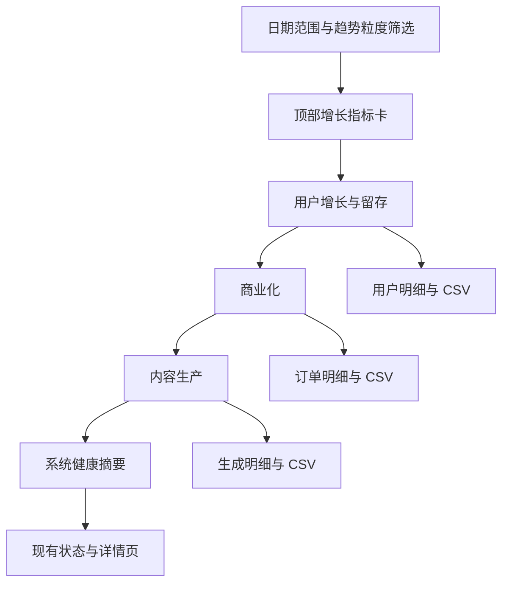
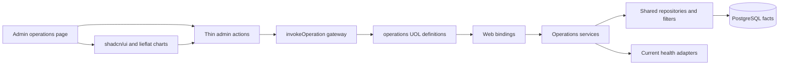
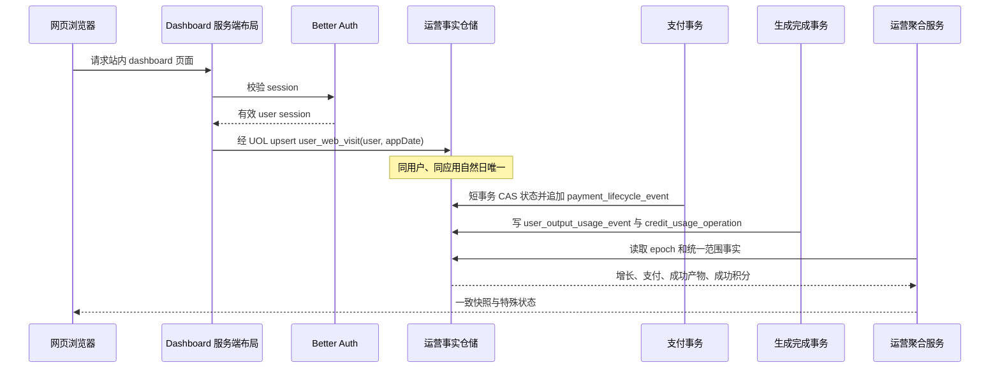
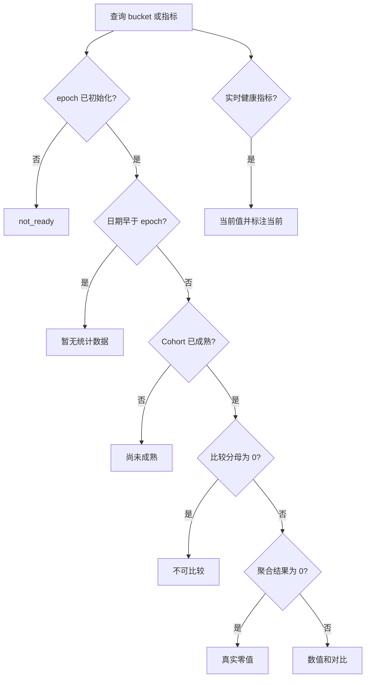
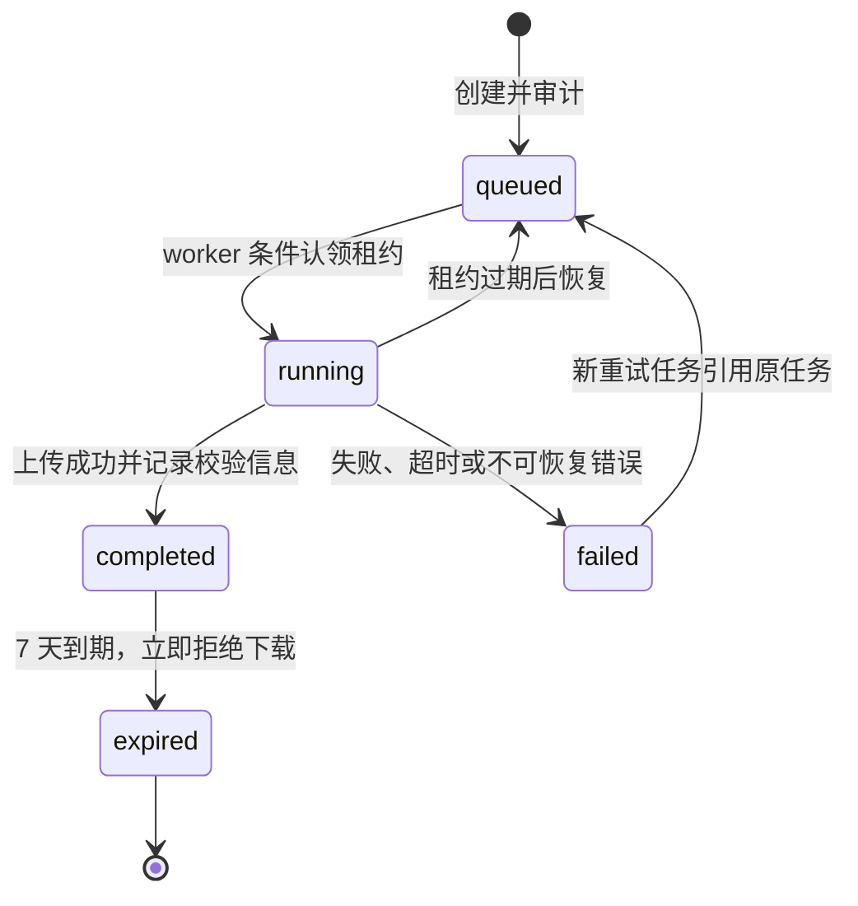
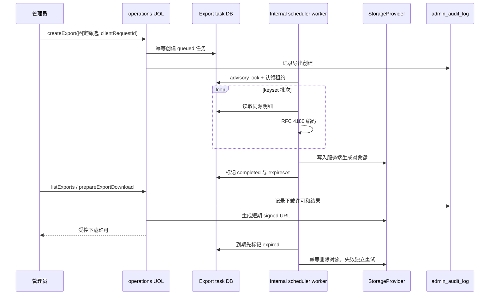

# 运营总览 - Plan

## Goal Capsule

- **Objective:** 为管理员提供一个增长优先的系统运营总览，用于在统一日期范围内核对用户增长、活跃、创作留存、商业化、内容生产和系统健康数据。
- **Product authority:** 本文的 Product Contract 固定运营总览的页面层级、指标口径、权限、核对方式、导出行为和范围边界；实现阶段不得自行补充未定义的用户行为。
- **Open blockers:** 无产品或工程规划阻塞项。生产统计起点、网页访问事实、长范围趋势压缩和异步导出均已在 Planning Contract 中形成可执行决策；正式发布仍须按本文的上线门禁初始化和核对。

## Product Contract

**Product Contract unchanged.** 本次深化只补充实现方法、依赖顺序与验证门禁，不改变 R1-R34、A1-A4、F1-F4、AE1-AE10 或任何已确认的产品决策。

### Summary

新增管理员专用的“运营总览”单页，路由为 `/dashboard/admin/operations`。
页面按“用户增长与留存 → 商业化 → 内容生产 → 系统健康”纵向展示，默认使用包含今天的近 30 个应用时区自然日，并支持不限跨度的日期范围与趋势粒度切换。

### Problem Frame

现有管理端已经分别提供生成数据看板、支付管理和系统状态信息，但管理员缺少一个按运营判断顺序组织的跨领域入口。
运营数据还需要能够与源记录和导出明细逐项核对，避免汇总结果与业务页面出现无法解释的差异。

### Key Decisions

- **增长优先的单页纵向结构。** 详情分析继续下钻到对应明细或现有管理页面（session-settled: user-directed — chosen over Tab 专题结构和紧凑跳转结构: 用户选择了增长优先的单页草图）。 Governs R9, R13, R17, R21, R24, R25, R28。
- **全站运营口径。** 页面不提供单用户筛选，用户级生成分析由既有生成看板承接（session-settled: user-directed — chosen over全局用户筛选和仅内容模块筛选: 运营总览用于全站判断）。 Governs R2.
- **上线后开始累积行为指标。** 既有账户只作为累计用户的初始基数，不为上线前补造新增、活跃或留存行为（session-settled: user-directed — chosen over尽可能回算和完整回算: 用户要求所有运营指标从上线后统计）。 Governs R4, R10, R11, R12, R13, R14, R15.
- **精确日创作留存。** Cohort 按注册日展示，D1、D7、D30 只认对应自然日当天的成功创作（session-settled: user-directed — chosen over累计留存和区间留存: 需要可精确核对）。 Governs R13, R14, R15, R34.
- **已履约充值收入而非财务净收入。** 生成失败后的积分退回不作为充值退款或运营异常（session-settled: user-directed — chosen over净收入和线下退款登记: 当前系统不记录线下退款）。 Governs R18, R19, R23.
- **精确核对优先。** 允许管理员从指标追到记录（session-settled: user-directed — chosen over抽样核对和允许误差: 用户要求数量与金额精确一致）。 Governs R17, R21, R24, R28, R29, R30, R31, R32, R33.
- **不做渠道来源统计。** 当前已有的是推广关系和首充奖励，不是广告投放或 UTM 归因；本功能不扩展广告或渠道采集（session-settled: user-directed — chosen over注册来源与邀请来源分析: 仓库没有广告/UTM 统计能力，用户明确暂不做）。

### Requirements

#### 页面访问与筛选

- R1. 运营总览只允许管理员和超级管理员访问，页面内容、下钻和 CSV 导出均继承该权限边界。
- R2. 页面提供全局日期范围筛选，不提供用户筛选；筛选器包含自定义范围和“本周、本月、本年”快捷选项。
- R3. 默认日期范围为包含今天的近 30 个应用时区自然日；自定义范围不设最大跨度。
- R4. 运营统计起始日为运营总览首次正式部署到生产环境的日期；起始日前的行为数据不得显示为真实零值。
- R5. 页面加载或手动刷新时查询近实时数据，不自动轮询，并显示最近更新时间；刷新保持当前日期范围和趋势粒度。
- R6. 趋势图提供日、周、月手动粒度切换，默认按日；切换粒度不改变日期范围和指标口径。
- R7. 不限跨度的趋势按当前粒度聚合并压缩在固定宽度内，精确值通过悬停浮窗查看，不启用横向滚动。

#### 用户增长与留存

- R8. 所有核心指标展示上一等长周期的对比；数量显示百分比变化，比率显示百分点变化，金额按币种分别比较，上期分母为 0 时显示“不可比较”。
- R9. 首屏顶部展示累计用户、新增用户、登录活跃用户、创作活跃用户及 D1、D7、D30 创作留存；商业化、内容生产和系统健康指标不放入顶部核心指标卡。
- R10. 累计用户包含上线时已有的全部账户，不因当前角色或封禁状态排除；新增用户按上线后的注册日期统计，既有账户不进入上线后的注册 Cohort。
- R11. 登录活跃用户按所选周期去重，定义为当天实际访问平台且访问时会话有效的用户；仅持有未过期会话但当天未访问不计入，API Key-only 创作不计入登录活跃。
- R12. 创作活跃用户按所选周期去重，定义为周期内至少一次成功生图或成功生视频的用户；API Key-only 的成功创作计入创作活跃。
- R13. 用户增长模块展示新增用户、登录活跃、创作活跃和付费活跃的趋势，趋势点按自然日或所选粒度去重；付费活跃用户指周期内成功充值用户，同一用户在周期内只计一次。
- R14. 注册 Cohort 矩阵按注册自然日逐行展示 D1、D7、D30；留存用户必须在注册后的第 1、7、30 个应用时区自然日当天成功生图或成功生视频。
- R15. 全局日期范围筛选注册 Cohort；留存后续行为可发生在范围结束后，只要查询时已达到对应成熟日即可统计；未成熟 Cohort 显示“尚未成熟”，不显示为 0。
- R16. 顶部留存率按所选范围内已成熟注册 Cohort 加权汇总；没有成熟 Cohort 时显示“尚未成熟”，并展示对应口径说明。
- R17. 用户增长模块提供保持当前日期筛选的明细下钻和 CSV 导出；CSV 包含用户 ID、名称、完整邮箱、业务时间和必要状态字段，不包含超出核对所需范围的敏感内容。

#### 商业化

- R18. 商业化模块展示订单漏斗，包括创建订单、支付成功和履约成功等状态数量；待支付和失败订单进入漏斗但不计入收入。
- R19. 收入仅统计已履约的充值订单，按币种分别展示，不合并不同币种，并在页面明确标注“不含线下退款”。
- R20. 付费转化同时展示“付费用户数 ÷ 创作活跃用户数”和“付费用户数 ÷ 登录活跃用户数”；周期内同一成功充值用户只计一次，分母为 0 时显示“不可比较”。
- R21. 商业化模块提供保持当前日期筛选的订单明细下钻和 CSV 导出；CSV 包含平台订单 ID、支付渠道交易号、用户 ID、币种、金额、订单状态、创建时间和履约时间。

#### 内容生产

- R22. 内容生产模块展示三张独立趋势图：成功生图数量、成功视频数量或成功视频秒数切换、成功积分净用量；所有成功产物按成功事件统计。
- R23. 积分净用量反映成功业务的实际净消耗；生成失败后的积分退回是正常业务逻辑，不进入商业化退款统计或单独异常卡片。
- R24. 内容生产模块提供保持当前日期筛选的生成明细下钻和 CSV 导出；CSV 包含任务 ID、用户 ID、模型、媒体类型、业务时间、状态、数量、视频秒数和积分字段，不包含提示词或媒体链接。

#### 系统健康

- R25. 系统健康模块只展示只读摘要，并链接到现有系统状态、生成数据看板和订单管理页面；看板内不配置告警或执行处置。
- R26. 任务成功率、处理耗时和支付履约失败按日期范围统计；队列积压和后端健康展示当前实时状态并标注“当前”。
- R27. 系统健康模块不提供 CSV 导出。

#### 核对、导出与保留

- R28. 每个用户增长、商业化和内容生产指标提供统计口径说明，并能在相同筛选条件下钻到对应明细页。
- R29. 页面汇总、趋势、下钻明细和 CSV 必须使用同一筛选范围与统计口径；数量和金额必须与源记录完全一致，比率仅允许显示精度造成的舍入差异。
- R30. CSV 大范围导出由后台生成完整文件，不设置行数上限、不截断；任务展示生成中、已完成和失败状态，失败可重试。
- R31. 导出完成后通过页面内通知提醒，并在运营总览提供导出记录入口；记录支持重新下载和按原筛选条件重新生成。
- R32. CSV 文件保留 7 天，过期后不可下载但导出记录保留过期状态。
- R33. 用户增长、商业化和内容生产的导出与下载记录导出人、筛选条件、时间、结果和下载行为审计；完整邮箱只向管理员和超级管理员导出。
- R34. Cohort 矩阵固定高度滚动，保留所选范围内全部注册自然日，不合并、不分页。

### Actors

- A1. 管理员：查看全站运营总览、刷新数据、查看口径、下钻明细、创建和下载核对 CSV。
- A2. 超级管理员：拥有 A1 的全部能力，并遵循相同的数据与审计边界。
- A3. 运营总览：根据筛选条件汇总用户、创作、订单和系统健康事实，标识上线前、未成熟和不可比较状态。
- A4. 既有详情页：承接用户增长、生成、订单和系统状态的记录级核对与进一步分析。

### Key Flows

- F1. **Trigger:** 管理员打开运营总览。
  - **Actors:** A1/A2, A3
  - **Steps:** 页面应用默认近 30 天范围 → 汇总顶部增长指标 → 依次展示用户增长与留存、商业化、内容生产和系统健康 → 显示最近更新时间。
  - **Outcome:** 管理员在单页内获得增长优先的全站运营快照。
  - **Covers:** R1, R3, R5, R9, R25
- F2. **Trigger:** 管理员选择快捷日期、自定义范围或日/周/月粒度。
  - **Actors:** A1/A2, A3
  - **Steps:** 页面保留全局筛选 → 重新计算所有周期指标和图表 → 对上线前日期显示“暂无统计数据” → 对未成熟留存显示“尚未成熟” → 对实时健康值标注“当前”。
  - **Outcome:** 所有模块在同一筛选上下文中更新，展示状态不会伪装成零值。
  - **Covers:** R2, R4, R6, R7, R15, R26, R34
- F3. **Trigger:** 管理员需要核对某个指标。
  - **Actors:** A1/A2, A4
  - **Steps:** 查看指标口径 → 使用当前筛选条件进入对应详情 → 按记录核对 → 按模块发起 CSV 导出。
  - **Outcome:** 汇总值可以追溯到源记录，并可进行离线逐笔复核。
  - **Covers:** R17, R21, R24, R28, R29
- F4. **Trigger:** 管理员发起大范围 CSV 导出。
  - **Actors:** A1/A2, A3
  - **Steps:** 创建导出任务 → 页面显示任务状态 → 后台生成完整文件 → 完成后页面通知 → 管理员从导出记录下载；失败时允许重试。
  - **Outcome:** 大范围核对不因页面停留或固定行数限制而丢失数据。
  - **Covers:** R30, R31, R32, R33

### Visual Structure

页面采用增长优先的单页纵向结构，作为实现时的布局验收基线：

### Acceptance Examples

- AE1. **Covers R3, R9, R10.** Given 系统已有账户且运营总览刚上线，when 管理员打开默认页面，then 累计用户包含已有账户，新增用户和注册 Cohort 只显示上线后的统计。
- AE2. **Covers R4, R7, R15.** Given 查询范围包含上线前日期，when 页面加载趋势和 Cohort，then 上线前时间点显示“暂无统计数据”，未成熟留存显示“尚未成熟”，两者都不显示为 0。
- AE3. **Covers R11, R12.** Given 用户当天只通过 API Key 成功创作且未访问网页，when 统计当天活跃，then 用户计入创作活跃而不计入登录活跃。
- AE4. **Covers R14, R15, R16.** Given 用户在注册后第 1 天成功生图、但第 7 天没有成功创作，when Cohort 达到 D7 成熟日，then 该用户计入 D1、不计入 D7；顶部 D7 按成熟 Cohort 加权汇总。
- AE5. **Covers R18, R19, R20.** Given 订单包含待支付、失败、已支付未履约和已履约状态，when 管理员查看商业化模块，then 漏斗保留各状态数量，收入只计已履约充值，币种分开，付费转化按两个已定义分母分别计算。
- AE6. **Covers R19, R23.** Given 生图失败触发积分退回且没有充值退款记录，when 管理员查看商业化和内容生产，then 该退回不作为收入退款或运营异常，成功内容和积分净用量按成功事实统计。
- AE7. **Covers R26.** Given 选择历史日期范围，when 管理员查看系统健康，then 成功率、耗时和履约失败按该范围统计，队列积压和后端健康显示当前并带“当前”标识。
- AE8. **Covers R30, R31, R32, R33.** Given 管理员导出多年范围的用户增长明细，when 任务完成，then 完整 CSV 可从导出记录下载 7 天，通知和下载审计均可追溯；失败任务可重试。
- AE9. **Covers R29.** Given 管理员将页面汇总与对应明细、CSV 逐项比对，when 统计范围和口径相同，then 数量和金额完全一致，比例只存在显示舍入差异。
- AE10. **Covers R34.** Given Cohort 包含大量注册日期，when 管理员查看矩阵，then 它在固定高度区域滚动并保留全部注册日，不合并、不分页。

### Success Criteria

- 管理员无需切换页面即可按既定纵向顺序完成一次全站运营核对，并能从任一指标进入对应明细。
- 对同一筛选条件，页面汇总、趋势、下钻和 CSV 的数量、金额及比率均可被源记录精确复算。
- 上线前、留存未成熟、分母为零和实时状态等特殊状态均不会被误读为零值或历史区间数据。
- 大范围导出不截断，导出任务、通知、下载、过期和审计状态均可追踪。

### Scope Boundaries

- 不包含广告投放管理、UTM 参数、站外来源域名、注册渠道或邀请来源统计。
- 不包含运营总览的用户筛选；既有生成看板的用户筛选能力保持独立。
- 不包含线下退款登记、财务净收入重算或充值退款率。
- 不包含告警配置、自动通知策略或看板内系统处置。
- 不包含系统健康 CSV 导出。
- 不包含提示词、媒体链接等内容敏感字段的 CSV 导出。

### Dependencies and Assumptions

- 首次正式生产部署日期必须可被产品和运维共同确认，并作为行为指标统计起点。
- 系统必须能可靠区分“当天实际访问网页且会话有效”和“仅持有有效会话”，否则登录活跃口径无法精确核对。
- 既有生成、支付、订单和系统状态详情页继续作为下钻核对目的地。
- 业务时区以应用时区为准；所有自然日、周、月和成熟日计算保持一致。
- CSV 任务生成与 7 天保留需要可选的后台任务和文件保留能力；具体实现方式留给规划阶段。

### Outstanding Questions

#### Deferred to Planning

- 选择不限跨度时，日/周/月聚合的最大可视点数、压缩交互和悬停数据承载方式。
- 首次正式生产部署日期的权威配置与迁移发布流程。
- 网页实际访问事件的权威记录方式及与现有会话数据的衔接。
- 大文件导出任务的执行、通知、下载鉴权、过期清理和审计持久化方式。
- 各模块明细 CSV 的具体字段格式、编码和时区显示格式。

### Sources / Research

- `packages/database/src/schema.ts`：用户、会话、推广关系、支付订单、媒体任务、积分和成功产物读模型。
- `apps/web/src/features/data-dashboard/data-dashboard-service.ts`：现有生成数据看板的日期范围和成功产物聚合能力。
- `packages/shared/src/uol/operations/analytics.ts`：现有管理员生成数据看板 operation 及权限边界。
- `apps/web/src/features/payment/admin/admin-payment-service.ts`：已履约收入按 `fulfilled_at` 统计、订单量按 `created_at` 统计的既有支付口径。
- `packages/shared/src/payment/admin-contract.ts`：支付概览和订单管理的日期与币种输出契约。
- `apps/web/src/app/[locale]/(dashboard)/dashboard/admin/status/page.tsx`：既有系统状态、生成成功率、耗时、队列和后端健康展示。
- `apps/web/src/features/dashboard/components/sidebar.tsx`：管理导航当前没有独立运营总览入口。
- `packages/shared/src/referrals/service.ts`、`packages/database/src/schema.ts`：现有推广关系只记录邀请关系和奖励，不提供广告或 UTM 渠道归因。

<!-- ce-section: work-relationships -->
## How This Work Fits Together

本计划只负责新增跨领域运营总览；现有详情能力作为核对和下钻目的地，不被复制为新的独立产品。

- **Depends on:** 既有用户、生成、支付和系统状态事实能够按统一应用时区查询。
- **Enables:** 管理员从单页增长判断进入记录级核对和模块详情。
- **Can proceed independently of:** 未来的广告渠道分析、线下退款登记和告警治理。
- **Still to decide:** 无；此前延后到规划阶段的问题均在下方 Deferred Question Resolutions 与 KTD 中关闭。

## Planning Contract

### Scope Synthesis

本实施计划完整覆盖 Product Contract，但只引入满足既定口径所需的最小新事实与基础设施：一个独立的 operations UOL 域入口、一个不可漂移的生产统计 epoch、按用户和应用自然日幂等的网页访问事实、不可变支付生命周期事件，以及三类共享状态机的异步 CSV 导出能力。现有 `/dashboard/admin/analytics`、用户生成看板及其最多 30 天契约均保持原状；运营总览不复用或扩大该契约，也不新增用户筛选。

查询与导出共享同一组经 Zod 校验的范围、粒度和明细筛选对象，并共享领域 repository 中的谓词构造。所有历史分桶都在服务端按 `APP_TIME_ZONE` 计算；不限跨度通过按选定日/周/月粒度聚合并在固定宽度内确定性降采样呈现，绝不改变源聚合值、日期范围或导出完整性。测试重点覆盖上线前、未成熟、不可比较、真实零值、当前状态、权限、事件幂等、导出生命周期及页面/明细/CSV 同源核对。

### Implementation Principles

- 新能力先以 `defineOperation()` 注册，Server Action、页面装配和内部任务仅做 Principal 构造、输入解析、operation 调用与响应编码。
- 聚合查询与 CSV 行游标读取共享 repository/filter 层；禁止在 React 组件、Action 或导出 worker 中复制统计 SQL。
- 数据库存储 UTC 瞬间；日期标签、周/月边界、比较周期和 Cohort 成熟日统一由应用时区纯函数计算，客户端只展示服务端返回的 bucket key 和标签。
- 当前数据库连接继续承担近实时聚合；不提前引入 OLAP、物化视图或缓存。用针对全站日期扫描的新索引和 `EXPLAIN` 验证，再以生产数据量决定后续读模型演进。
- 人工管理员可见的完整邮箱、CSV 创建/重试/下载许可均标记 `agentExposure: "human-only"`；定时 worker 使用 `cronJob` 或 `system` Principal，不绕开 UOL 网关。
- 所有新增文件、函数和组件遵循仓库文件级/函数级中文注释规则；TypeScript strict，不使用 `any`。

### Delivery Sequence

U1 和 U2 建立事实与统一语义；U3 形成增长与活跃读路径，U4 在其结果上完成商业化、内容和健康模块；U5 将其余能力注册并绑定 UOL；U6 复用相同读路径实现异步导出；U7、U8 完成页面与图表。每个单元完成后小步提交；只有 U1-U8 与全量验证均完成后才可发布。

## Deferred Question Resolutions

| 延后问题 | 实施决策 | 验收边界 |
| --- | --- | --- |
| 不限跨度的图表承载 | API 按用户选择的日/周/月返回完整聚合 bucket；UI 在固定画布内做确定性视觉降采样，tooltip 只落在真实返回点，表格、下钻和 CSV 不降采样。超密日粒度不自动改成周/月，而是提示可手动切换。 | 无横向滚动；首末点和极值保留；日期范围与总量不因降采样改变。 |
| 正式生产统计起点 | 新增单行 `operations_analytics_epoch`，迁移只建表，不把迁移时间当起点；正式部署通过显式环境输入调用幂等初始化命令写入应用时区日期、UTC 起点和初始化审计。数据库约束阻止第二个值，常规应用无更新 operation。 | 未初始化时总览返回 `not_ready`，不能回退为 `NOW()`；初始化后只读展示，变更必须走另一个经审批的迁移。 |
| 网页实际访问事实 | 在已鉴权 dashboard 布局的服务端请求路径中，session 验证成功后调用幂等记录服务；写入 `user_web_visit(user_id, app_date)`，唯一键去重，同日重复访问 `ON CONFLICT DO NOTHING`。API 路由、API Key 和静态资源不调用。 | 有效网页请求最多每天一行；持有 session 但无请求为零；写入失败记录 Pino 告警并令本次页面请求继续，避免可选统计阻断用户主流程。 |
| 支付漏斗事实 | 新增 append-only `payment_lifecycle_event`，唯一键覆盖订单、标准事件类型及来源事件/请求引用；在创建、支付确认、履约、失败/过期的既有状态事务内同事务插入。上线前不回造；收入仍由 `payment_order.status = fulfilled` 且 `fulfilled_at` 统计。 | webhook 重放不重复计数；订单状态改变而事件写入失败时整笔事务回滚；上线前阶段展示暂无统计数据。 |
| CSV 执行与保留 | 新增 `operations_export_task` 状态机和租约字段；内部 scheduler 用 advisory lock 启动批次，worker 以 keyset 分页流式构建 UTF-8 BOM CSV，写入 StorageProvider 专用前缀。完成、失败、重试、下载许可和清理都写审计；文件 7 天后删除，任务转 `expired`。 | 无行数上限和静默截断；进程退出后租约可回收；下载前实时复核任务所有者角色与未过期状态，并签发短期 URL。 |
| CSV 字段与时间格式 | 严格使用 R17、R21、R24 字段；表头本地化为简体中文，编码 UTF-8 BOM，逗号分隔并按 RFC 4180 转义；业务时间导出为带应用时区偏移的 ISO 8601。金额保留订单币种小数，积分保留数据库两位小数。 | 公式起始字符防注入转义；不含提示词、媒体 URL、Cookie、IP、User-Agent 或其它敏感字段。 |

## Key Technical Decisions

### KTD-1: 独立 operations UOL 与契约

- 新增 `operations.*` operations，不扩展 `analytics.getAdminDataDashboard`。后者支持 `userId` 且受最多 30 天限制，与 R2、R3 的全站不限跨度口径冲突。
- 新增独立 `operations` OperationDomain。最小操作集合为：`operations.recordWebVisit`、`operations.getOverview`、`operations.getDetail`、`operations.createExport`、`operations.listExports`、`operations.retryExport`、`operations.prepareExportDownload`，以及仅内部身份可调用的 `operations.ensureCurrentEpoch`、`operations.processExports`、`operations.expireExports`。
- `getOverview` 返回一个查询时刻的一致快照；模块失败使用带模块名的明确错误，不以部分旧数据伪装成功。`getDetail` 接受模块和受限明细种类联合类型，使用 keyset cursor。
- 为避免事实采集反向依赖读服务，`operations.recordWebVisit` 与 `operations.ensureCurrentEpoch` 的 operation 定义、binding 和最小测试随 U1 落地；U5 只补齐其余读取、导出和 worker operation。

### KTD-2: 时间与比较周期

- `from`、`to` 是闭区间应用自然日；服务端转换为 UTC `[startInclusive, endExclusive)`。默认范围是今天及前 29 个自然日，快捷项使用包含今天的当前自然周、自然月和自然年。
- 上一等长周期紧邻当前周期之前，按自然日数等长；百分比、百分点和按币种金额对比在纯函数中计算。上期分母为 0 返回显式 `not_comparable`，而非 `0`、`Infinity` 或空字符串。
- 周以应用的既有周首日约定为准并锁入测试；月按自然月。Cohort 的 D1/D7/D30 始终按自然日差计算，不受趋势粒度影响。

### KTD-3: 事实来源与同源核对

- 累计用户/新增用户取 `user`；登录活跃取 `user_web_visit`；创作活跃和成功内容取 `user_output_usage_event`；图片数量求 `image_count`，视频数量计 video 事件行，视频秒数求 `video_seconds`。
- 成功积分只将成功产物事件按稳定任务身份关联 `credit_usage_operation`，求 `net_consumed`；禁止把所有 completed generation 或全部积分消耗当作成功业务。若现有 operation identity 不能无歧义关联，U1 先补投影关系约束，不能使用时间近似关联。
- 支付漏斗取上线后的不可变生命周期事件；收入取已履约充值订单并按 `fulfilled_at`、币种分组。失败生成退款不进入商业化。
- 明细与 CSV 从同一事实查询生成。每个汇总指标声明其 reconciliation key，测试用相同明细逐行归并反算汇总。
- 运营总览的增长、商业化、内容、明细和 CSV 一律受 epoch 截断；上线前既有成功产物仅继续服务既有生成看板，不能在运营总览中把上线前 bucket 伪装成真实零值或历史统计。
- 支付事件枚举固定为 `order_created`、`checkout_ready`、`payment_confirmed`、`fulfillment_succeeded`、`checkout_failed`、`fulfillment_attempt_failed`、`fulfillment_failed_terminal` 和 `expired`；每条事件保存 `occurred_at`、`recorded_at` 与 `timestamp_source`。优先使用经验证的 provider 时间，缺失时统一降级为服务器接收时间并标注来源；R26 只统计履约失败事件。
- 支付写路径新增 transaction-aware 状态转换仓储：短事务内执行状态 CAS 与事件追加。积分发放保留自身事务，成功后再以独立短事务幂等写入 `fulfilled` 和成功事件；失败依靠既有发放幂等键与 webhook 重试补齐，禁止用外层事务包住 `grantCredits`。

### KTD-4: 异步导出状态与安全

- 状态为 `queued -> running -> completed | failed -> queued`，`completed -> expired`；重试创建新任务并保存 `retry_of_task_id`，保留原失败记录。租约使用 `lease_owner`、`lease_token`、`lease_expires_at` 和 attempt 计数，以条件更新认领；续租和终态写入必须匹配 fencing token，过期 worker 不得覆盖新 worker。
- 创建任务固化规范化筛选 JSON、应用时区、epoch、导出类型、schema version、数据库 `snapshot_at` 与各事实源稳定高水位；worker 不从用户当前页面状态重新推断，所有分页谓词同时受业务范围与高水位约束。成功积分按不可变账本贡献在该高水位重算，不读取导出期间仍可能变化的当前投影。
- 对象键由任务 ID、attempt 和本次不可预测 `lease_token` 构造且不可覆盖；只有 fencing token 匹配的 completed CAS 才提交该对象键和校验和，失败 CAS 的对象进入孤儿清理。
- `expires_at` 到达后任务先无条件转为 `expired` 并拒绝下载；物理对象删除独立幂等重试，删除失败只记录清理错误，不能延长下载权限。
- 单个获准导出仍不截断行数，但创建和重试受每管理员 queued/running 上限、创建频率与全局队列容量限制，超限返回可恢复错误并记录审计指标。
- 页面通知由导出记录的 `completed_at` 与客户端已见水位计算，不新建跨渠道通知系统。列表打开或刷新即可看到完成提醒；不自动轮询符合 R5。

### KTD-5: UI、图表与可访问性

- 页面、筛选、卡片、tooltip、表格、滚动区、空态和状态容器全部优先复用 `@repo/ui` 的 shadcn/ui 组件；图形可复用其 Recharts 封装，但必须按 `lieflat-charts` 模板视觉实现，不能采用库默认样式。
- 实施时每张图记录至少三个候选及淘汰理由，并优先普通用户熟悉的折线图、面积图、柱状图、漏斗/分阶段条形图。建议候选起点：生图 F2/常规折线/柱状，积分 F3/常规面积/柱状，视频 L3/折线/柱状，支付漏斗 L13/横向阶段条/标准漏斗；最终选择以可理解性和数据语义审计为准。
- 同页使用 Mono 单色体系；hover 只展示真实数据点。支持键盘焦点、屏幕阅读器摘要、颜色之外的标签和 `prefers-reduced-motion`。无数据、上线前、尚未成熟、不可比较和失败态不得共用一个空态。
- 高密序列采用双层机制：可见路径按确定性采样绘制，但 tooltip 命中、十字线、触摸点选和键盘前后移动始终基于完整 bucket；最近点选择保留首末边界，焦点有可见指示，并提供包含全部点的可访问数据表。

### Chart Candidate Record

| 信息任务 | 候选 | 最终选择与理由 | 编码与核对 |
| --- | --- | --- | --- |
| 新增、登录、创作、付费活跃趋势 | 多序列折线、小倍折线、分组柱 | 小倍折线；四类量级差异较大，分图共用时间轴比同轴混线更易读 | X 为日期 bucket，Y 为去重用户数；每图单序列、明确单位、完整 bucket tooltip/表格 |
| Cohort D1/D7/D30 | 热力矩阵、分组柱、三线趋势 | 热力矩阵；注册日逐行与成熟状态最适合矩阵，且保留全部 Cohort | 行为注册日、列为 D1/D7/D30；单元格显示分子/分母/比例或尚未成熟 |
| 支付阶段 | 标准漏斗、横向阶段条、桑基 | 横向阶段条；阶段并非严格逐层同一批订单，阶段条避免面积暗示 | Y 为阶段，X 为订单数；标签直接显示精确值，不用面积编码 |
| 生图数量 | F2、常规折线、柱状 | 常规折线；强调随时间变化且用户已熟悉，断档保持可见 | X 为日期 bucket，Y 为成功图片数量；单序列真实点 tooltip |
| 视频数量/秒数 | L3、双轴折线、切换折线 | 单序列切换折线；数量和秒数单位不同，不使用误导性的双轴 | 分段控件切换 count/seconds，范围不变，Y 轴单位随模式切换 |
| 成功积分净用量 | F3、面积、柱状 | 柱状；净用量是离散 bucket 总量，基线和小数值更易比较 | X 为日期 bucket，Y 为积分；tooltip 保留两位小数，不用累计面积暗示 |

所有图均使用 shadcn/ui `ChartContainer` 与 `ChartTooltipContent`，不使用默认 Recharts 样式；上线前、空数据、真实零值和不可比较分别渲染。多币种收入不混入单轴图，按币种稳定排序为数字列表和对比值。

### Drill-down Matrix

| 触发项 | 目的地 | 继承参数与附加过滤 | 返回与状态 |
| --- | --- | --- | --- |
| 六个顶部增长指标、增长小倍图点 | 同页右侧 Sheet 的用户增长明细 | `from/to/granularity`；按指标和 bucket 增加 activity kind/date | URL 写入 `detail` 与 `bucket` 便于分享；关闭恢复原 URL，含 loading/empty/error/keyset 更多 |
| Cohort 单元格 | 同一 Sheet 的 Cohort 用户明细 | 注册日、D1/D7/D30 目标日、成熟状态 | 未成熟单元格不可下钻；其余保持矩阵滚动位置 |
| 支付阶段、收入与转化 | 独立订单管理页 | 保留日期，增加 lifecycle stage/currency；粒度不改变明细 | 新页可分享，返回浏览器历史恢复运营筛选 |
| 生图、视频、积分图点 | 独立生成数据核对页 | 保留日期 bucket 与媒体/积分种类；不传用户条件 | 新页可分享；若目的页不支持长范围则使用 operations 独立明细路由，不裁剪日期 |
| 系统健康摘要 | 既有 status、analytics 或 payment 页面 | 仅传目标页明确支持的范围；当前指标不伪造历史参数 | 普通导航链接，不在运营页复制处置控件 |

筛选和刷新期间保留旧内容并设置 `aria-busy`，筛选控件进入 pending 且禁止重复提交；失败时保留 URL 和旧内容并显示原条件重试。导出创建、重试和下载分别按任务禁用重复动作并通过 live region/Toast 公告结果；通知已读水位以管理员 ID 保存在浏览器本地，首次看见 completed 时推进，刷新不重复提醒，导出记录始终保留。

响应式规则：桌面筛选同排、指标三列；平板两列；手机单列且日期、快捷项、粒度依次换行。图表在手机保持稳定高度并将图例置底；Cohort 与明细表使用粘性表头/首列和受控横向滚动，非关键列在手机收敛进详情。Sheet 桌面占不超过视口 2/3，手机全屏。交互目标至少 44px；触摸点按锁定最近真实 bucket，点外关闭，垂直滚动不触发点选。

## Technical Design

### Component and Data Flow

页面和传输层不直接读数据库。权限、Zod 输入输出校验、operation 审计和错误映射在 UOL 网关/绑定边界完成，领域服务只接收已规范化的应用时区范围。

### Fact Capture and Query Sequence

### Query-State Branches

### Export State Machine

### Export Lifecycle

## Implementation Units

### U1: 建立运营事实、epoch 与导出任务模型

**Goal**

建立不可歧义、可幂等采集且可恢复执行的数据库基础，不回造上线前行为。

**Requirements**

覆盖 R4、R10-R12、R18、R30-R33，以及 AE1-AE3、AE5、AE8。

**Dependencies**

无；本单元是 U2-U8 的数据前置。

**Files**

- 修改 `packages/database/src/schema.ts`。
- 新增 `packages/database/drizzle/0088_operations_dashboard.sql`，并手动登记 `packages/database/drizzle/meta/_journal.json`；若并行开发已占用 0088，实施时取下一个连续编号。
- 新增 `apps/web/src/features/operations-dashboard/operations-epoch-service.ts`、`web-visit-service.ts`、`payment-lifecycle-service.ts`、`export-task-repository.ts` 及对应测试，并新增显式生产初始化脚本。
- 修改 `apps/web/src/app/[locale]/(dashboard)/layout.tsx` 及其必要的客户端可见性记录器，以及所有改变 `payment_order.status` 的充值创建、webhook/履约路径。
- 新增 `packages/shared/src/uol/operations/operations-dashboard-facts.ts`、`apps/web/src/server/uol-bindings/operations-dashboard-facts.ts` 及测试，先注册并绑定访问与 epoch operation。
- 修改 `packages/shared/src/credits/purchase-orders.ts`、`apps/web/src/features/payment/credit-top-up.ts`、Creem webhook、易支付与支付宝履约写点，统一接入 transaction-aware 状态转换仓储。

**Approach**

1. 新增单行 epoch、`user_web_visit`、append-only 支付事件和导出任务表；为日期聚合、状态扫描、租约认领、过期清理与管理员列表建立针对性索引、检查约束和唯一键。
2. 提供显式生产初始化 operation 和薄命令入口，接收经 Zod 校验的应用日期和 UTC 起点；插入后重复相同值返回 unchanged，不同值失败并审计。迁移不自动写 epoch。
3. dashboard shell 在成功获得真实 session user 后调用 `operations.recordWebVisit`；首次渲染以及跨应用自然日后重新获得可见性时记录，布局内导航不重复膨胀。统计写失败只告警，不记录 IP、UA、session token 或 API Key。
4. 按 KTD-3 重构支付状态写点：创建、确认和终态失败在短事务内同时执行状态 CAS 与事件追加；积分发放保持自身事务，随后以可重试的独立短事务幂等写履约成功。以 provider event/request reference 防 webhook 重放，并用幂等过期扫描产生 `expired` 事件。
5. 若成功产物与积分 operation 缺少可证明的稳定连接键，在本迁移补最小投影引用和约束；运营总览所有事实、明细和 CSV 均受 epoch 截断，既有生成看板的历史统计保持原状。

**Patterns to follow**

- 手写幂等迁移与 journal 登记：`packages/database/drizzle/0087_admin_data_dashboard_index.sql`。
- 不可变成功事实和检查约束：`userOutputUsageEvent`、`creditUsageOperation`。
- 事务内审计：`packages/shared/src/moderation/policy-service.ts`。
- 条件认领和后台状态：现有图像异步任务/Adobe 通知投递表与 repository。

**Test scenarios**

- 相同 epoch 重试不产生第二行，不同 epoch 被拒绝；未初始化查询明确失败。
- 同用户同应用日跨 session、并发访问仅一行，翌日新增一行；API 路径不写访问事实。
- webhook 重放不重复生命周期事件；支付状态与事件任一失败时事务回滚。
- 导出状态非法跳转、重复 clientRequestId、双 worker 认领和陈旧租约均被约束或条件更新阻止。

**Verification**

- 执行数据库 schema/typecheck 与定向 Vitest。
- 在临时 PostgreSQL 执行迁移两次，核对约束、索引、`ON CONFLICT` 和回滚行为。
- 对日期、状态、租约查询运行 `EXPLAIN (ANALYZE, BUFFERS)`，确认无意外全表排序。

### U2: 统一运营契约、日期语义与比较纯函数

**Goal**

让页面、明细和导出共享一个无 30 天限制、无用户筛选的类型安全协议。

**Requirements**

覆盖 R2-R8、R14-R16、R26、R29、R34，以及 AE2、AE4、AE7、AE9、AE10。

**Dependencies**

依赖 U1 的 epoch schema 和事实类型。

**Files**

- 新增 `packages/shared/src/operations-dashboard/contracts.ts`、`range.ts`、`comparison.ts`、`series.ts` 及测试。
- 修改 `packages/shared/package.json`，为上述共享契约增加明确 exports，并由 Web 侧边界测试验证公开导入路径。
- 仅在确有复用价值时抽取现有 `packages/shared/src/analytics/range.ts` 的通用底层函数；不得改变旧 analytics 对外契约。

**Approach**

1. 用 Zod discriminated unions 定义粒度、模块、明细种类、导出种类、特殊状态和 cursor；范围接受任意合法 `from <= to`，不接受 `userId`。
2. 规范化默认近 30 日、本周、本月、本年、自定义闭区间，并输出 UTC 半开区间、bucket 列表、上一等长周期和 Cohort 成熟日期。
3. 金额使用按币种记录数组，积分允许小数；计数、百分比、百分点均用明确 schema，避免复用只接受整数的 series 契约。
4. 对超密 series 定义保首末/极值的确定性视觉采样函数；该函数只供图形坐标，不参与总量、tooltip 明细、下钻或导出。

**Patterns to follow**

- 现有 analytics contracts/range/series 的边界验证与时区处理模式。
- `next-safe-action` 输入 schema 与 UOL operation schema 同源模式。

**Test scenarios**

- DST 前后、月末、闰年、周/月/年边界与跨多年范围。
- 上线前 bucket、epoch 当天、未来 to、反向范围和非法日期。
- 上期为零、比率零分母、无成熟 Cohort、加权留存与积分小数。
- 降采样保留首末和极值，不改变原数组且结果稳定。

**Verification**

- 运行 shared 定向 Vitest、typecheck 和 Biome。
- 以固定时钟快照验证默认范围永远为“今天加前 29 个应用自然日”。

### U3: 实现用户增长、活跃、Cohort 与明细聚合

**Goal**

以可逐行反算的查询实现增长优先指标、趋势和精确创作留存。

**Requirements**

覆盖 R8-R17、R28-R29、R34，以及 AE1-AE4、AE9-AE10。

**Dependencies**

依赖 U1、U2。

**Files**

- 新增 `apps/web/src/features/operations-dashboard/growth-repository.ts`、`growth-service.ts`、`detail-repository.ts` 及测试。
- 视 `EXPLAIN` 结果在 U1 迁移补充 `user.created_at`、访问日、产物事件用户/日期和支付事件用户/日期索引。

**Approach**

1. 累计用户包含所有角色和封禁状态；累计值为 range end 当日结束时的账户数，上线已有账户纳入基数，新增与 Cohort 仅取 epoch 之后注册。
2. 登录、创作、付费活跃分别按访问事实、成功产物事实、成功支付事实在周期内 `COUNT(DISTINCT user_id)`；每个趋势 bucket 独立去重。
3. Cohort 以注册应用自然日分组，对 D1/D7/D30 目标日与成功产物存在性连接；范围末日不裁掉已到成熟日的后续行为。未成熟和上线前状态由服务显式返回。
4. 明细查询复用与汇总一致的 predicate builder，以 `(business_time, stable_id)` keyset 分页；完整邮箱仅由人工管理员受控接口返回。

**Patterns to follow**

- `apps/web/src/features/data-dashboard/data-dashboard-query.ts` 的参数化 SQL、应用时区 bucket 和 DB-free 纯函数拆分。
- `apps/web/src/features/payment/admin/admin-payment-query.ts` 的 keyset/筛选模式。

**Test scenarios**

- 上线既有账户只进入累计用户；被封禁和管理员账户不被排除。
- 同日多次网页访问/创作/充值只计一个活跃用户，但跨 bucket 分别计数。
- API Key-only 成功创作进入创作活跃，不进入登录活跃。
- D1 有成功、D7 无成功、D30 未成熟；跨筛选结束日行为仍正确计入成熟留存。
- 每个汇总从明细重新聚合完全一致。

**Verification**

- 运行 growth repository/service 定向 Vitest 和数据库集成测试。
- 使用构造 Cohort 数据核对 SQL 结果、成熟状态和 CSV 候选行。

### U4: 实现商业化、内容生产与系统健康聚合

**Goal**

实现其余三个模块，并严格区分支付生命周期、履约收入、成功内容/积分和当前健康状态。

**Requirements**

覆盖 R18-R29，以及 AE5-AE7、AE9。

**Dependencies**

依赖 U1-U3。

**Files**

- 新增 `apps/web/src/features/operations-dashboard/commercial-repository.ts`、`content-repository.ts`、`health-adapter.ts`、`operations-dashboard-service.ts` 及测试。
- 复用但不改变 `apps/web/src/features/payment/admin/admin-payment-repository.ts` 和现有 status 服务的公开语义；必要时抽取纯读 adapter。

**Approach**

1. 订单漏斗按事件发生时间统计创建、支付成功、履约成功、失败/待支付阶段；同一订单同一标准事件最多一次。收入只查已履约充值订单，以 `fulfilled_at` 落桶并按币种分开。
2. 两个付费转化分子均为周期内成功充值去重用户；分母分别调用 U3 的创作/登录活跃结果，并返回显式不可比较状态。
3. 内容查询直接取 `user_output_usage_event`，成功积分按 KTD-3 的稳定关联求 `net_consumed`。视频数量与秒数共享事件范围，在 UI 层切换展现但不改变筛选。
4. 范围型健康数据复用现有成功率/耗时/履约失败逻辑；队列积压和后端健康只在查询时读取并标记 `current`，绝不按历史 bucket 伪造。
5. 顶层 service 在一个明确查询时刻和一致连接/事务快照中装配结果，附 `generatedAt`、time zone、epoch 和口径版本。

**Patterns to follow**

- `admin-payment-service.ts` 的 fulfilled 收入口径与币种分组。
- `userOutputUsageEvent`/`creditUsageOperation` 的现有 analytics 聚合。
- 管理 status 页的健康读取函数；只链接而不复制处置逻辑。

**Test scenarios**

- pending、failed、paid-not-fulfilled、fulfilled 漏斗分层；重复事件不膨胀。
- 相同数值不同币种始终分开；失败生成退款不计收入退款。
- completed 但零产物的任务不计成功；图片、多段视频秒数和小数积分准确。
- 历史范围仍返回当前队列/后端状态并带 current；依赖不可用时显式降级状态。
- 页面指标与同源明细逐笔反算一致。

**Verification**

- 运行 commercial/content/health 定向 Vitest 和数据库集成测试。
- 对大范围聚合执行 EXPLAIN，并记录需要的索引或查询拆分。

### U5: 注册 operations UOL、绑定服务和薄传输

**Goal**

将所有读取、下钻、导出与内部维护能力先暴露为统一接口，再由页面和 worker 使用。

**Requirements**

覆盖 R1、R5、R17、R21、R24、R28-R33，以及 F1-F4。

**Dependencies**

依赖 U2-U4；导出操作的执行体在 U6 完成。

**Files**

- 新增 `packages/shared/src/uol/operations/operations-dashboard.ts` 及测试，并修改 `packages/shared/src/uol/operations/index.ts` 与 `packages/shared/src/uol/types.ts`；复用 U1 已注册的事实采集 operation。
- 新增 `apps/web/src/server/uol-bindings/operations-dashboard.ts` 及测试，并修改 `apps/web/src/server/uol-bindings.ts`。
- 新增 `apps/web/src/features/operations-dashboard/actions.ts` 及测试。

**Approach**

1. 按 KTD-1 注册剩余八个读取、导出和 worker operation；人工管理操作权限明确为 `roles: ["admin", "super_admin"]`，涉及邮箱/文件均 human-only。读取天然幂等；创建和重试要求 per-principal `clientRequestId`；worker 只接受明确 system/job Principal。访问与初始化 operation 已在 U1 注册和绑定。
2. binding 将 Principal、requestId、应用时区与服务依赖相连，统一映射 validation/not_ready/forbidden/conflict/internal 错误；不在 Action 重复权限和业务判断。
3. `adminAction` 只调用 `invokeOperation` 并返回可序列化结果；下载接口仅返回短期许可，不暴露存储配置或任意对象键。
4. overview、detail、CSV 都消费 U2 的同一 schema 和 U3/U4 的同一 repository filters。

**Patterns to follow**

- `packages/shared/src/uol/operations/analytics.ts`、`apps/web/src/server/uol-bindings/analytics.ts`。
- `apps/web/src/features/data-dashboard/admin-actions.ts` 的安全 Action 和测试。
- `packages/shared/src/uol/invoke.ts` 的权限、幂等与审计语义。

**Test scenarios**

- user、observer_admin、API Key、MCP 管理 key 都不能获取人工管理员数据；admin 与 super_admin 可访问。
- 非法范围、伪造 userId、未知模块、跨管理员任务 ID 和过期下载均被拒绝。
- operation metadata 的 readOnly、destructive、idempotency、sideEffects、agentExposure 与实际一致。
- binding 输出再次通过 Zod，底层错误不泄露 SQL、对象键或敏感行。

**Verification**

- 运行 UOL operation、binding 和 action 定向 Vitest。
- 枚举 registry 确认全部 operation 唯一注册且无未绑定 stub。

### U6: 实现完整异步 CSV、通知、重试、下载和清理

**Goal**

在不限跨度、无行数上限的前提下可靠生成三类完整 CSV，并保证 7 天生命周期可审计。

**Requirements**

覆盖 R17、R21、R24、R29-R33，以及 F3-F4、AE8-AE9。

**Dependencies**

依赖 U1-U5。

**Files**

- 新增 `apps/web/src/features/operations-dashboard/export-service.ts`、`export-worker.ts`、`csv-encoder.ts`、`export-storage.ts` 及测试。
- 修改 `packages/shared/src/storage/types.ts` 与 S3/local provider 及测试，补充后端流式写入能力，避免最终 CSV 必须成为单个内存 `Buffer`。
- 修改 `apps/web/src/server/internal-job-scheduler.ts` 及测试，注册生成和清理 job。
- 修改 `system-settings/definitions.ts`、默认值测试与 `system-settings-panel.tsx`，增加默认关闭的导出处理/清理独立开关、interval 和 batch 配置。
- 新增 `apps/web/src/app/api/admin/operations/exports/[taskId]/download/route.ts` 及测试；本地 provider 必须经该受控路由流式下载，S3 可返回短期签名 URL，两者都先调用 download operation。

**Approach**

1. 创建时固化模块、规范化范围、schema version、time zone、epoch、数据库 `snapshot_at`、各事实源高水位和创建者；唯一 `(created_by, client_request_id)` 保证页面重试不会重复排队，并同步写 `admin_audit_log`。create/retry 同时执行每管理员与全局队列配额、频率限制，不改变单个获准导出的完整性。
2. scheduler 由独立默认关闭的系统设置控制，处理与清理使用不同 advisory lock/job Principal；worker 使用 fencing token 条件认领并续租。使用 keyset 和高水位分批读取同源明细，通过 `putObjectStream` 写入；S3 走 multipart/可取消流，本地 provider 写受控临时文件后原子落位。对象键包含 lease token 且不可覆盖，completed CAS 失败的对象进入孤儿清理。
3. CSV 执行公式注入防护、RFC 4180 转义、UTF-8 BOM 与稳定列顺序；完成时保存行数、字节数、校验和、对象键、完成/过期时间。
4. 页面列表以 `completed_at` 水位显示站内完成通知；失败任务以新 clientRequestId 创建引用原任务的新记录。prepare download 复核角色和状态后，S3 生成短期 signed URL，本地 provider 返回受控下载许可；两者均记录许可/结果审计并流式传输。
5. 清理 job 在到达 `expires_at` 时先标记 expired 并拒绝下载，再独立删除对象；对象已不存在视为幂等成功，存储暂不可用则记录错误并下次重试。孤儿对象按任务/lease 前缀扫描清理。

**Patterns to follow**

- `apps/web/src/server/internal-job-scheduler.ts` 的常驻调度、advisory lock 和优雅关闭。
- `packages/shared/src/storage/types.ts` 及 S3/local provider。
- `apps/web/src/features/image-generation/adobe-credential-notifications.ts` 的租约、重试和清理模式。

**Test scenarios**

- 空导出、包含逗号/引号/换行/公式前缀、多币种、小数积分和跨 DST 时间。
- 多 worker 竞争、进程在上传前/后崩溃、租约过期恢复、存储失败、数据库完成写失败。
- 失败重试保留父记录；7 天边界前可下载、边界后拒绝；删除失败可重试。
- user 或另一管理员不能下载非本人任务；审计包含创建者、筛选、结果、重试来源和下载行为，但不落文件内容。
- CSV 行数与相同筛选的明细 count 及页面汇总反算完全一致。

**Verification**

- 运行 worker/storage/encoder/scheduler 定向 Vitest 和本地 provider 集成测试。
- 用跨年生成数据执行大文件演练，观察峰值内存、批次耗时、租约续期和对象校验和。

### U7: 建立管理页面、导航、筛选、下钻和导出记录

**Goal**

完成增长优先的单页信息架构和管理员核对工作流。

**Requirements**

覆盖 R1-R7、R9、R13、R17、R21、R24-R34，以及 F1-F4、AE1-AE10。

**Dependencies**

依赖 U5、U6；图表细化由 U8 完成。

**Files**

- 新增 `apps/web/src/app/[locale]/(dashboard)/dashboard/admin/operations/page.tsx`。
- 新增 `apps/web/src/features/operations-dashboard/operations-dashboard-page-data.ts`、`operations-dashboard-panel.tsx`、筛选器、指标卡、Cohort、明细抽屉/页面、导出记录组件及测试。
- 修改 `apps/web/src/features/dashboard/components/sidebar.tsx` 和对应 next-intl 消息文件。

**Approach**

1. Server Component 校验 session 和管理员角色，从 URL 白名单化 `from/to/granularity` 后通过 UOL 读取首屏；默认值由 U2 固定时钟函数生成。
2. 全局筛选一次更新所有模块；快捷项包含本周、本月、本年，刷新和粒度切换保留其它参数。页面展示最近更新时间且不自动轮询。
3. 顶部只放六个增长指标；依次呈现增长/Cohort、商业化、三张内容图、系统健康。Cohort 固定高度纵向滚动，保留全部注册日。
4. 每个指标提供口径、同筛选下钻和所属模块导出；导出记录展示 queued/running/completed/failed/expired、站内完成提示、重试、下载和按原条件重新生成。
5. 系统健康仅链接现有 status、analytics 和 payment 页面，不复制告警或处置控件；页面完全不出现用户选择器或渠道来源入口。

**Patterns to follow**

- 管理 analytics 页的 session/角色/URL 校验和首屏装配。
- `@repo/ui` 的 Card、Popover/Tooltip、Table、ScrollArea、Sheet/Dialog、Skeleton 和 Alert。
- 管理 payment 过滤器与日期选择器的可访问交互。

**Test scenarios**

- 未登录跳转登录，普通用户/observer_admin 被拒绝，管理员页面与所有 Action 可用。
- 默认近 30 日、三个快捷项、自定义跨多年、日周月切换、刷新参数保持。
- 五种特殊展示状态不混淆；Cohort 大量行只纵向滚动且不分页。
- 导出状态、完成通知、失败重试、过期下载拒绝和按原条件重建。
- 页面不存在用户筛选、渠道、线下退款、系统健康 CSV 或敏感导出字段。

**Verification**

- 运行组件和页面数据 Vitest。
- 使用 Playwright 在桌面和移动宽度完成权限、筛选、下钻、导出记录、键盘导航与视觉回归。

### U8: 完成 shadcn/ui + lieflat-charts 图表与发布核对

**Goal**

用普通管理员容易理解、可悬停核对且适配不限跨度的图表完成可视化，并执行端到端数据校验。

**Requirements**

覆盖 R6-R8、R13-R16、R18-R20、R22-R23、R26、R29、R34，以及全部 AE。

**Dependencies**

依赖 U7 和所有数据单元。

**Files**

- 新增 `apps/web/src/features/operations-dashboard/charts/` 下的增长、留存、漏斗、生图、视频、积分图和共享 chart card/config/tooltip/format 文件及测试。
- 仅当 `packages/ui` 缺失通用 shadcn chart wrapper 时，按既有 shadcn 模式补到 `packages/ui/src/components/`，不引入另一套 UI 库。
- 在本计划末尾的 Chart Candidate Record 或相邻实现文档记录逐图候选审计。

**Approach**

1. 对每张图至少比较三个 lieflat/熟悉图型候选，记录信息任务、淘汰理由、最终模板编号/普通图型和无障碍替代表格；易理解性优先于视觉新奇。
2. 生图和积分各为独立图；视频数量/秒数在同一独立图切换。增长趋势可用可辨识多序列折线或小倍图；订单阶段使用能准确读数的阶段条或经验证漏斗。
3. 所有真实点支持 hover/focus tooltip，展示 bucket、精确值、单位和特殊状态；视觉降采样点不得伪造 tooltip。同页使用统一 Mono 色阶、清晰图例和单位标签。
4. 关闭或简化 reduced-motion 动画；验证色彩对比、键盘焦点、屏幕阅读器摘要、窄屏换行和超长日期范围。
5. 建立种子核对数据集，分别从源事实、页面、下钻、CSV 计算结果，产出发布前对账记录；完成生产 epoch 初始化、首批访问/支付事件冒烟和回滚预案。

**Patterns to follow**

- 现有 `apps/web/src/features/data-dashboard/charts/` 的 lazy loading、shadcn Card、tooltip 与测试结构，但不照搬其产品口径。
- `lieflat-charts` 的 template-first、真实点 tooltip、Mono 和 reduced-motion 约束。

**Test scenarios**

- 单点、全零、断档、负向比较、极大数、小数积分、多币种和跨多年高密数据。
- hover 与键盘 focus 数值一致；屏幕阅读器可获得等价摘要；reduced motion 无必要动画。
- 视频数量/秒数切换保持日期范围；图表总量和明细/CSV 反算一致。
- 生产 epoch 前后、Cohort 未成熟与成熟、实时健康和上期零分母的视觉状态正确。

**Verification**

- 运行 chart 组件 Vitest、axe/可访问性检查与 Playwright 交互/截图验证。
- 执行 `turbo typecheck`、`turbo lint`、`turbo test` 全量质量门。
- 发布冒烟后按 Verification Contract 对账，无差异才开放导航入口。

## Alternatives Considered

### 扩展现有管理员生成看板

拒绝。`analytics.getAdminDataDashboard` 同时允许指定 `userId` 且最多查询 30 天；扩展会破坏现有产品边界，并把增长、支付、留存和系统健康耦合进生成领域。

### 用现有 session 过期时间推断登录活跃

拒绝。有效 session 只表示凭据仍可用，不证明用户当天实际访问，无法满足 R11 的可核对定义。

### 从当前 payment_order 状态回算完整漏斗

拒绝。订单缺少 paidAt 和状态历史，`updated_at` 也不能证明某个阶段的业务时间；上线后追加不可变事件才能抵抗 webhook 重放并准确落桶。

### 同步生成 CSV 或设置最大行数

拒绝。跨多年完整导出会超出请求时限或内存预算，截断则违反 R30。租约化后台任务允许完整生成、恢复和审计。

### 将不限跨度改成 90 天或自动改变粒度

拒绝。两者都改变已确认的 R3/R6。服务端保持用户范围与粒度，UI 仅压缩视觉点，并明确建议手动切换粒度。

### 立即引入 OLAP 或通用通知中心

暂不采用。当前仓库已有 PostgreSQL 聚合、internal scheduler 和对象存储能力；先以索引、参数化查询和页面内导出水位满足需求，性能证据再驱动专用读模型。

## System-Wide Impact

### Data and Migrations

- 新增运营 epoch、网页访问日、支付生命周期事件、导出任务及必要稳定关联；均有唯一键、检查约束、时间/状态索引和明确删除策略。
- 迁移只创建结构，不猜测生产 epoch，也不回填新增/活跃/留存/支付阶段事件。累计用户和已有不可变成功产物仍按 Product Contract 查询。
- 导出记录长期保留状态与审计；对象文件只保留 7 天。访问事实不含 IP/UA，账户删除时随用户级事实级联删除；长期分析只保留不可逆日级聚合，具体保留窗口在生产隐私基线中登记并由清理任务执行。

### APIs, Auth and Agent Boundary

- 所有新功能经 operations UOL；页面 Action 和 job adapter 保持薄。管理员读取和人工导出仅 admin/super_admin；系统任务只能使用指定 job/system Principal。
- `Now`：overview、detail、create/list/retry/prepare download、process/expire 均注册 operation。
- `Later`：若未来提供内置 Agent 或 MCP 运营分析，只复用去敏摘要和任务状态接口。
- `Never/human-only`：完整邮箱和实际文件下载不直接投影给 Agent；任何未来开放均需新的产品与安全评审。

### Performance and Concurrency

- 不限跨度可能扩大扫描；通过 UTC 半开范围、全站日期索引、聚合 SQL、keyset CSV、租约和 advisory lock 控制。禁止 offset 扫描和一次性加载全量导出。
- dashboard 同日访问写被唯一键合并；支付事件和导出创建均有业务幂等键。服务自带事务不得被外层 UOL 再包事务。
- overview 使用单个一致查询时刻；当前健康外部依赖设置独立超时和显式 unavailable 状态，不能拖垮历史模块。

### Observability and Operations

- Pino 结构化日志包含 operation name、requestId、范围天数、粒度、模块、查询耗时、返回 bucket/行数、exportTaskId、attempt 和租约状态；不记录邮箱、CSV 内容、对象签名 URL 或 provider payload。
- 建议指标：overview p50/p95、数据库查询耗时、导出 queued age、running lease age、成功/失败/过期数、生成行数/字节数和清理失败数。
- 告警保持在既有运维系统配置，不加入看板 UI；本功能只产生可观测信号。

### Documentation and Rollback

- 更新运营口径、生产初始化 runbook、导出恢复/清理 runbook 与 `docs/MEMORY.md` 索引；不在文档写入环境密钥。
- 回滚 UI/UOL 可停止新查询与导出；停止 scheduler 可阻止新任务处理。事实表和事件写入采用向后兼容新增，回滚时不删除数据。epoch 一旦生产初始化不可随应用回滚而漂移。

## Risks and Mitigations

| 风险 | 影响 | 缓解与验证 |
| --- | --- | --- |
| 生产 epoch 被错误初始化 | 所有上线后口径偏移且不可安全重算 | 部署显式输入、预演显示、双人核对、单行不可更新约束；正式写前记录应用日期与 UTC 边界。 |
| 网页事实写入位置覆盖不足或过度 | 登录活跃少计/多计 | 仅 dashboard 有效 session 布局写入；路由矩阵测试网页/API/API Key；生产首日抽样核对访问日志但不长期保存敏感字段。 |
| 支付某条路径漏写事件 | 漏斗阶段少计 | 枚举所有 `payment_order.status` 写点，事务测试和静态 rg 审计；上线冒烟覆盖每个 provider。 |
| 成功积分关联不稳定 | 内容积分与成功产物不一致 | U1 先验证稳定任务身份并加约束；无确定键时阻止发布，不用时间窗猜测。 |
| 跨多年查询拖慢主库 | 管理页影响业务请求 | EXPLAIN、索引、statement timeout、按模块查询预算、keyset 导出；达到阈值后另立读模型计划。 |
| 大 CSV 造成内存/磁盘压力 | worker OOM 或容器不稳定 | keyset 分批、分段缓冲/临时文件受控目录、对象直传可行性验证、任务并发上限和租约；压测记录峰值。 |
| 上传完成而 DB 未提交 | 孤儿对象泄漏或陈旧 worker 覆盖 | 每个 lease 写不可变对象键、仅 matching-token CAS 提交、周期性清理未提交 lease 前缀，禁止覆盖。 |
| signed URL 泄露 | 7 天文件被越权读取 | 短期 URL、下载前角色与任务归属复核、对象键不可预测、审计；不写日志或页面持久状态。 |
| 图表降采样误导 | 极值或事件断档不可见 | 保首末/极值、只对视觉坐标采样、tooltip 限真实点、提供同源明细；浏览器测试超密范围。 |
| 当前健康依赖故障 | 整页失败或把未知当零 | 独立超时和 unavailable 状态；历史运营模块继续明确展示，绝不缓存为零。 |

## Operational Notes

### Deployment Order

1. 部署向后兼容数据库结构；新空表索引随迁移创建。已有大表索引先以受审计脚本、独立连接和 `CREATE INDEX CONCURRENTLY IF NOT EXISTS` 预建，设置 lock/statement timeout，清理 invalid index 后可重跑；journal 迁移保留普通 `IF NOT EXISTS` 以服务空库，并验证约束与查询计划。
2. 部署事实写入、支付事件双写、UOL、worker，但保持运营导航隐藏且导出 worker 可配置关闭。
3. 用明确的 `APP_TIME_ZONE` 与批准的生产上线日期执行 epoch 初始化预演；核对 UTC 起止后幂等写入并保存审计 ID。
4. 开启 worker，创建三类小范围导出并验证存储、下载、审计和过期时间。
5. 完成页面/明细/CSV 对账及浏览器冒烟后开放 `/dashboard/admin/operations` 导航。

### Runtime Recovery

- `not_ready`：首先核对 epoch 是否初始化，禁止临时使用当前时间补值。
- 导出 queued age 异常：核对 scheduler 开关、advisory lock、租约和存储配置；恢复 worker 即可继续，不手工篡改 completed。
- failed：管理员通过 retry operation 新建关联任务；运维只处理根因，不删除原任务或审计。
- 清理失败：任务按时保持 expired，下载 operation 即使对象存在也必须拒绝；记录清理错误并重试物理删除。
- 支付事件缺口：停止开放漏斗，修复写路径；不得依据 `updated_at` 静默回填近似阶段时间。

### Data Reconciliation Runbook

选取包含真实零值、API Key-only 创作、多币种订单、支付失败、生成失败退款和成熟/未成熟 Cohort 的固定区间。分别保存源 SQL 行数/金额、overview JSON、detail 全部分页和 CSV 校验和；按 reconciliation key 重算并比较。数量和金额必须完全相等，比例只允许 UI 格式化舍入。任何差异均阻止发布。

## Verification Contract

### Automated Gates

- U1-U6 的 DB-free 纯函数 Vitest 与 PostgreSQL 集成测试全绿；迁移可在空库和现有库前滚，重复执行幂等片段安全。
- UOL registry、权限、Zod、幂等 metadata、binding、Action、worker、StorageProvider、scheduler、组件和页面测试全绿。
- Playwright 覆盖管理员权限、默认/快捷/自定义筛选、粒度、特殊状态、下钻、三类导出、重试、下载、过期、键盘与 reduced-motion。
- 根目录依次执行 `turbo typecheck`、`turbo lint`、`turbo test`，不使用 skip、弱化断言或 `--no-verify`。

### Exactness Gates

- 对每个 R9、R13、R14、R18-R20、R22、R26 的范围型指标，存在源事实到 overview、series、detail、CSV 的自动反算测试。
- 计数和金额逐值相等；积分按两位小数精确值比较；比率用未格式化分子/分母比较，UI 舍入单独测试。
- 页面和导出响应均回显相同 normalized range、granularity、timeZone、epoch 和 schema version。

### Performance and Reliability Gates

- 用接近生产规模和跨多年范围记录 overview 查询计划、p95 和数据库 buffers；不得出现无界内存增长或 offset 分页。
- 大 CSV 演练必须证明进程重启后陈旧租约恢复、重复执行不产生重复任务/事件、7 天边界和删除失败可恢复。
- 网页访问和支付事件并发测试证明唯一键与事务不变量；可选统计写失败不阻断普通 dashboard 请求。

### Manual Product Gates

- 产品逐项确认 R1-R34、AE1-AE10；特别核对无用户/渠道筛选、含今天近 30 日、不限跨度、默认日、本周/月/年、三张内容图和系统健康无 CSV。
- 每张图的三候选记录已评审，最终图型比候选更易理解；所有真实点可 hover/focus，特殊状态不伪装成零。
- 管理员和超级管理员可完成 F1-F4；普通用户、observer_admin、API Key 和 Agent 无法取得受限数据或下载许可。

## Definition of Done

- Product Contract 保持 unchanged，R1-R34、A1-A4、F1-F4、AE1-AE10 均有实现、测试和可追溯证据。
- operations epoch 已通过正式流程初始化且不可漂移；上线前、未成熟、不可比较、真实零值和当前状态均准确呈现。
- `user_web_visit` 和支付生命周期事件在线写入具备幂等、并发和事务保障；不回造上线前行为。
- overview、趋势、Cohort、明细和三类 CSV 使用同一事实与筛选，发布对账无数量或金额差异。
- 三类 CSV 无行数上限，任务可恢复、失败可重试、完成可通知、下载受控且审计完整，文件在 7 天后可靠删除并标记过期。
- `/dashboard/admin/operations`、导航、增长优先布局、筛选和全部模块通过桌面/窄屏、键盘、屏幕阅读器与 reduced-motion 验证。
- 图表使用 shadcn/ui 容器与 lieflat-charts 约束，每图至少三个候选、统一 Mono、真实点 tooltip、固定宽度无横向滚动。
- Pino 日志、运行指标、部署/恢复/核对文档完成且不含机密或个人敏感数据。
- `turbo typecheck`、`turbo lint`、`turbo test` 全绿；所有文件与函数注释、Biome 和 TypeScript strict 规则满足仓库门禁。

## Deferred Work

- 广告、UTM、站外来源、注册/邀请渠道分析。
- 运营总览用户筛选；用户级生成分析继续由现有管理员生成看板承担。
- 线下退款登记、充值净收入和退款率。
- 系统健康 CSV、告警配置、自动处置与跨渠道通知中心。
- 面向 MCP/内置 Agent 的运营分析和实际文件下载；未来只能基于新安全评审开放去敏能力。
- 只有当查询计划和生产指标证明 PostgreSQL 聚合不足时，另行设计物化读模型、缓存或 OLAP，不在本功能中预优化。

## Traceability Matrix

| 实施单元 | 主要需求 | 主要验收示例 | 交付证据 |
| --- | --- | --- | --- |
| U1 | R4, R10-R12, R18, R30-R33 | AE1-AE3, AE5, AE8 | 迁移、事实/幂等/事务测试 |
| U2 | R2-R8, R14-R16, R26, R29, R34 | AE2, AE4, AE7, AE9, AE10 | 契约、时区、比较纯函数测试 |
| U3 | R8-R17, R28-R29, R34 | AE1-AE4, AE9-AE10 | 增长/Cohort 聚合与反算测试 |
| U4 | R18-R29 | AE5-AE7, AE9 | 商业化/内容/健康聚合测试 |
| U5 | R1, R5, R17, R21, R24, R28-R33 | AE8-AE9 | UOL 权限、绑定、Action 测试 |
| U6 | R17, R21, R24, R29-R33 | AE8-AE9 | 导出状态机、恢复、存储与审计测试 |
| U7 | R1-R7, R9, R13, R17, R21, R24-R34 | AE1-AE10 | 页面、筛选、下钻、浏览器测试 |
| U8 | R6-R8, R13-R16, R18-R20, R22-R23, R26, R29, R34 | AE1-AE10 | 候选审计、图表、a11y、端到端对账 |
