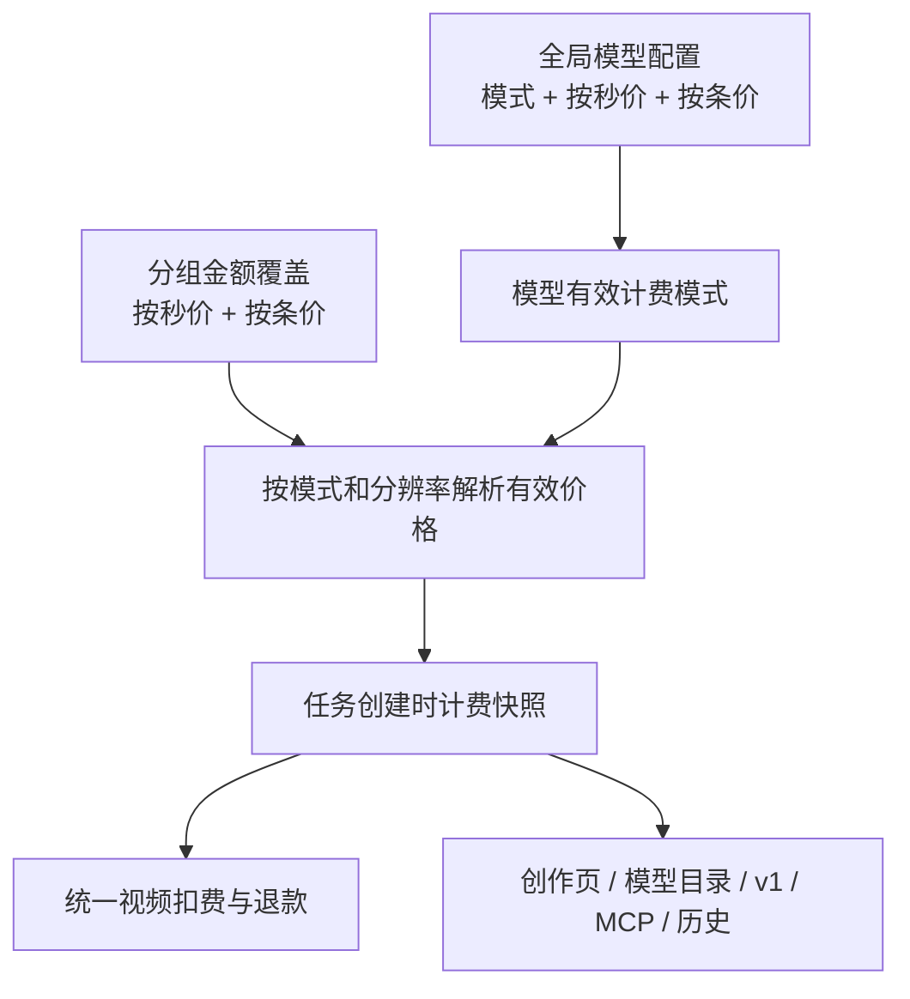
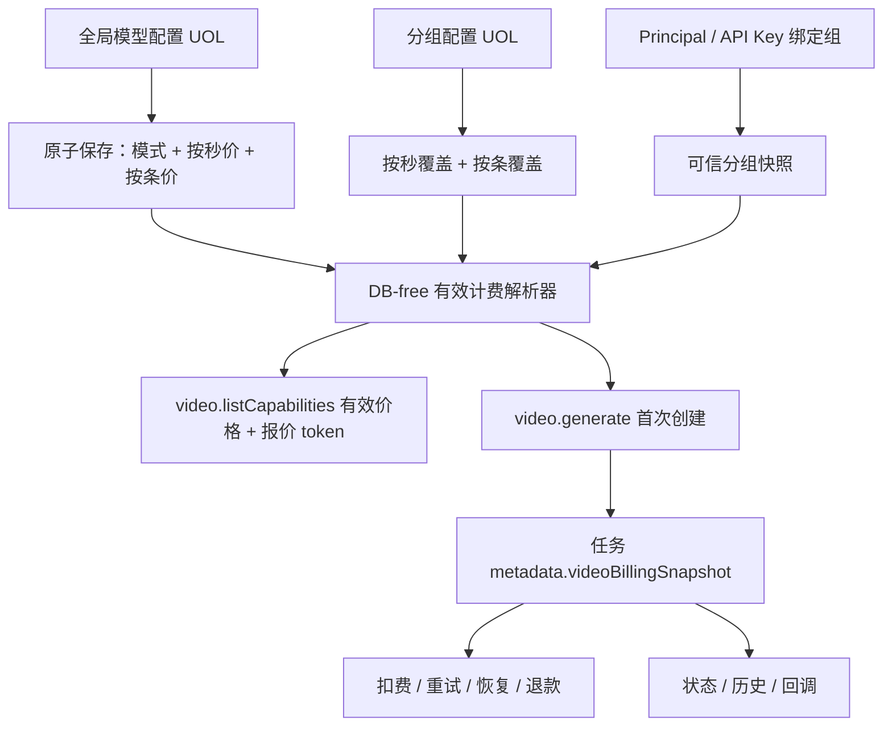
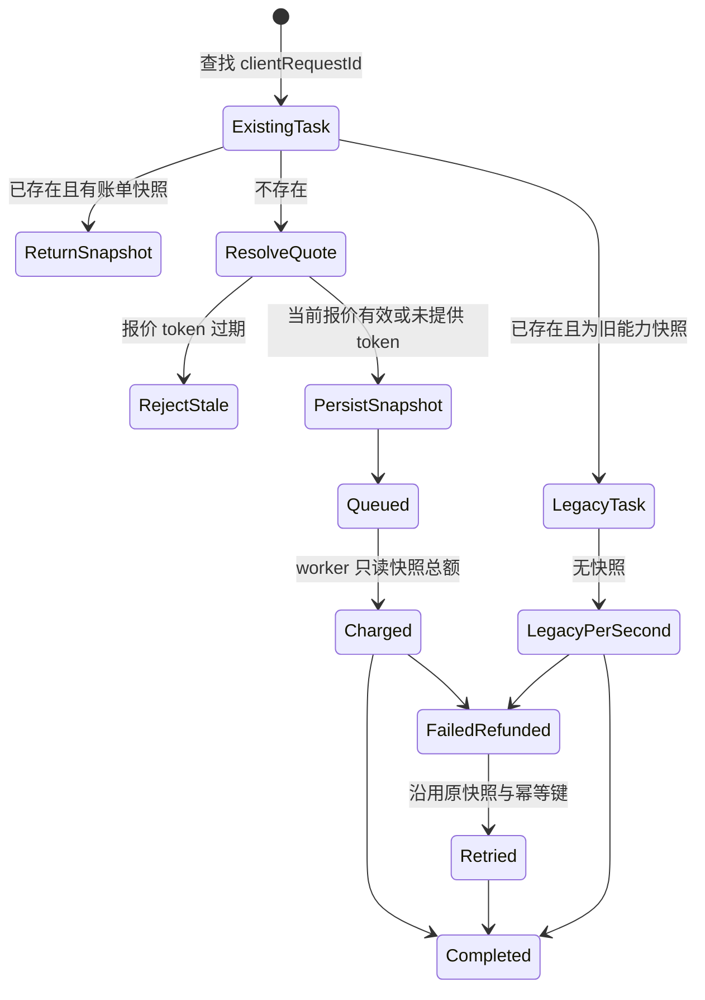

# 视频模型双计费模式 - Plan

## Goal Capsule

- **Objective:** 为视频模型增加可选的按条计费，同时保留现有按秒计费；全局模型配置决定模式，全局和分组维护两种模式的模型分辨率价格，并让所有视频入口、预估、扣费和历史记录使用同一计费事实。
- **Product authority:** 本文固定计费模式归属、价格维度、分组覆盖、默认值、配置切换、任务快照、展示单位和范围边界；实现阶段不得重新引入供应商账号计费配置或分组模式切换。
- **Product Contract preservation:** Product Contract unchanged；规划只确定实现机制，并将升级前无快照任务视为不具备历史锁价事实的 legacy 数据。
- **Execution profile:** Deep；财务快照、运行时兼容、UOL/MCP/v1 一致性和跨缓存实例生效均属于高风险验证面。
- **Stop conditions:** 若实现需要供应商账号价格、分组切换模式、修改积分账本幂等键，或无法证明新任务只按持久快照扣费，则停止执行并重新确认产品范围。
- **Tail ownership:** U8 负责跨包质量门、兼容门、文档和废弃代码清理；任何前序单元的未决验证不得留给上线后处理。

---

## Product Contract

### Summary

实现将扩展现有 DB-free 视频定价核心、模型配置 UOL、分组覆盖和统一视频任务管线。新任务在创建时把可信分组下的计费事实写入版本化任务 metadata；worker、状态、历史和退款只读取该快照。旧按秒设置和旧任务采用显式兼容路径，供应商账号与基础 `/v1/models` 契约保持不变。

### Problem Frame

当前视频价格只有按秒一套口径，分组也只能覆盖按秒金额；模型目录、创作页、公开接口和任务扣费都把单位固定为“每秒”。这无法表达上游成本或产品策略要求的固定单条价格，也会让新增计费方式在不同入口产生不一致的展示和结算。

当前任务在持久化创建后由执行阶段读取当时的全局与分组价格。若配置在任务等待期间发生变化，任务可能使用与提交时不同的价格；新需求要求新任务立即采用新模式，同时已创建任务继续使用创建时的模式和价格事实。

### Key Decisions

- KTD1. **模式按全局模型统一决定。** (session-settled: user-directed — chosen over 在分组或供应商账号上选择模式: 消除调度候选不同导致的预估不确定性。) Governs R1, R5, R6。
- KTD2. **两种价格共享现有模型分辨率维度。** (session-settled: user-directed — chosen over 每个模型一个固定按条价或按时长档位定价: 保留当前模型与分辨率价格能力，并使按条价不随时长变化。) Governs R2, R3, R7。
- KTD3. **分组只覆盖金额，供应商账号不增加计费配置。** (session-settled: user-directed — chosen over 为供应商账号增加模型级价格入口: 复用现有分组覆盖能力，避免扩大账号治理范围。) Governs R3, R4。
- KTD4. **配置变更与任务快照分离。** (session-settled: user-approved — chosen over 执行阶段动态读取最新价格: 新配置应立即影响新任务，但不能改变已创建任务的财务事实。) Governs R5, R7, R8。
- KTD5. **所有视频传输和展示复用同一计费结果。** (session-settled: user-directed — chosen over 只在后端增加按条扣费: 用户在提交前和历史中必须能看到实际使用的单位与价格。) Governs R9, R10。

### Billing Source of Truth

### Actors

- A1. **平台管理员：** 配置全局视频模型的计费模式与两套价格，并为分组配置两套金额覆盖。
- A2. **视频调用方：** 通过站内创作、v1 API 或 MCP/Agent 提交视频生成请求，查看提交前预估和任务历史。
- A3. **视频任务执行与财务系统：** 按任务快照扣费、退款并维持现有幂等账本事实。

### Requirements

#### Global Model Billing

- R1. 每个全局视频模型配置必须声明一个统一计费模式：按秒或按条；模式默认按秒，且模式粒度为模型而不是输出分辨率或任务时长。
- R2. 全局必须为每个视频模型及其支持的输出分辨率分别维护按秒价格和按条价格；按条价格的初始化全局默认值为 3 积分/条，现有按秒默认和已保存按秒价格保持不变。
- R3. 分组必须能按同一“模型 + 输出分辨率”维度分别覆盖按秒金额和按条金额；当前模型模式由全局配置决定，分组不能修改模式。
- R4. 供应商账号配置继续不包含视频计费模式或指定模型计费金额；账号支持模型、凭据和调度配置不因本计划改变。

#### Effective Pricing and Task Consistency

- R5. 新视频任务按全局模型当前模式选择价格单位，并在该单位下优先使用分组对应模型与分辨率的金额；分组缺少该模式的覆盖时继承全局同模式金额，按条最终使用全局 3 积分兜底。
- R6. 全局模型模式切换必须立即影响之后创建的新任务；切换不需要同步修改分组中另一模式已保存的金额。
- R7. 任务创建时必须固定本次使用的计费模式、价格单位、模型分辨率价格和可解释的预计扣费事实；任务进入执行、重试、成功、失败退款或恢复流程时不得因后续配置变化重算。
- R8. 扣费仍以 `credits_transaction` 为财务真相，继续使用现有 per-user 幂等键、扣费时点、退款和双重记账语义；按条只改变金额计算单位，不改变财务流程。

#### Surfaces and Compatibility

- R9. 站内创作、v1 API、MCP/Agent、模型目录和任务历史必须返回与有效模式匹配的单位和价格；按条模式显示积分/条，按秒模式显示积分/秒。
- R10. 创作页预估、公开价格、实际扣费和历史快照必须对同一模型、分辨率和任务使用同一有效价格；按条模式下时长变化不得改变单条价格。
- R11. 现有仅配置按秒价格的全局与分组数据必须继续按秒运行；新增按条价格缺失时不得错误回退到按秒价格，而应按 R5 继承全局按条默认。
- R12. 两套价格均须按当前模型支持的分辨率接受正数配置并拒绝不完整或无法解释的价格矩阵；分组稀疏覆盖仍可通过继承获得有效价格。

### Key Flows

- F1. **配置全局模型：** A1 为模型选择按秒或按条，并保存该模型全部支持分辨率的两套价格；系统保留另一套价格，模式只改变新任务采用哪一套。
- F2. **配置分组金额：** A1 在分组中编辑模型分辨率的按秒和按条覆盖；分组界面不提供模式切换，未填写的模式或分辨率继续继承全局。
- F3. **提交视频生成：** A2 选择模型与分辨率并提交请求；系统按当前全局模式和分组金额解析单位与价格，展示对应预估，并在任务创建时固定计费快照。
- F4. **执行与恢复：** A3 按任务快照扣费；配置在任务创建后改变时，执行、重试和退款仍使用原快照，新的配置只影响后续任务。
- F5. **跨入口查看：** A2 从站内、v1、MCP/Agent 或历史读取视频价格与用量时，所有入口使用同一模式、单位和快照口径。

### Acceptance Examples

- AE1. **Covers R1, R2, R11.** Given 既有模型只有按秒价格且未配置按条覆盖，when 模式仍为按秒，then 现有预估、扣费和展示不变；when 该模型切换为按条，then 使用全局默认 3 积分/条而不是按秒价。
- AE2. **Covers R2, R5, R10.** Given 同一模型的 720p 按条价为 3、1080p 按条价为 5，when 分别提交任意支持时长的两个分辨率任务，then 每条分别扣 3 和 5 积分，时长不改变单条价格。
- AE3. **Covers R3, R5.** Given 全局模型模式为按条、全局 1080p 按条价为 3、分组只覆盖 1080p 按条价为 5，when 该分组提交 1080p 视频，then 按条扣 5；该分组未覆盖的分辨率继承全局对应按条价。
- AE4. **Covers R3, R6.** Given 分组同时保存了按秒和按条金额，when 管理员把全局模型从按秒切换为按条，then 新任务立即使用分组按条金额；反向切换时新任务使用分组按秒金额，分组本身不需要修改模式。
- AE5. **Covers R7, R8.** Given 任务创建时模型为按条且有效单价为 5，when 管理员在任务执行前把模型切回按秒或修改分组价格，then 该任务及其重试、失败退款仍按创建时的按条单价 5 处理，且扣费与退款保持幂等。
- AE6. **Covers R9, R10.** Given 当前有效模式为按条，when 用户打开创作页、模型目录、v1 或 MCP 的模型/任务信息，then 所有响应显示积分/条和对应分辨率价格，不再把该模型标为积分/秒。
- AE7. **Covers R4.** Given 管理员编辑供应商账号，when 保存支持模型、凭据或调度字段，then 表单和保存结果不出现或接受视频计费金额配置。
- AE8. **Covers R12.** Given 管理员提交缺少受支持分辨率的全局价格矩阵或非正数金额，when 保存模型价格，then 保存被拒绝并保持上一版有效配置。

### Success Criteria

- 新旧模式下，创作页预估、公开价格、实际扣费与历史记录的单位和金额一致。
- 全局模式切换后，新任务使用新模式，已创建任务不发生财务重算。
- 现有按秒模型和分组覆盖无需改动即可继续工作，且未配置的按条价格稳定继承全局 3 积分默认。
- 所有视频入口共享同一模式解析和任务计费快照，不出现按入口分叉的价格口径。

### Scope Boundaries

- **本次包含：** 全局模型模式、全局双价格矩阵、分组双价格覆盖、按条默认值、任务计费快照、预估/目录/API/历史单位展示，以及对应的配置校验和财务回归。
- **本次不包含：** 供应商账号计费配置；分组或账号切换模型计费模式；按时长档位或按秒数阶梯的按条价格；同一模型不同分辨率使用不同计费模式；图像、聊天或其他非视频产品的计费改造。

### Dependencies and Assumptions

- 继续使用现有统一视频生成管线、`credits_transaction` 双重记账、扣费幂等键和失败退款语义。
- 价格矩阵沿用当前视频模型配置的模型与分辨率集合。当前内置模型的公开模型 ID 与 billing family 为一一对应；新模式和按条价格直接使用模型 ID，旧按秒 `family@resolution` 键只在兼容边界转换。若实施发现非一一映射，触发 Goal Capsule 的 stop condition，不得自行改变模型级模式行为。
- 分组的现有稀疏覆盖继续可用；未覆盖项不构成错误，只沿 R5 继承全局同模式金额。
- 本次需求未提供具体供应商成本样本；价值判断以用户明确的按条计费需求为产品依据，具体单价仍由管理员配置。

### Sources / Research

- `packages/shared/src/adobe/video-pricing.ts`：当前按模型族与分辨率解析每秒价格，并以时长相乘计算视频积分。
- `packages/shared/src/system-settings/definitions.ts`：全局视频每秒价格设置及模型配置入口。
- `packages/shared/src/image-backend/group-contract.ts`：分组视频价格覆盖契约。
- `apps/web/src/features/image-generation/video-operations.ts`：视频任务创建、执行阶段扣费、恢复和幂等退款。
- `apps/web/src/features/image-generation/components/video-create-panel.tsx`：当前按秒预估与单位展示。
- `packages/shared/src/model-marketplace/contracts.ts`：模型配置与公开目录当前固定 `per_second` 的视频价格契约。
- `apps/web/src/features/model-configuration/service-core.ts`：视频分辨率价格矩阵的管理校验与保存规则。
- `apps/web/src/features/image-backend-pool/member-contract.ts`、`apps/web/src/features/image-backend-pool/member-form.tsx`：供应商账号当前没有计费金额配置。

---

<!-- ce-section: work-relationships -->
## How This Work Fits Together

本计划只负责视频计费单位和金额来源的产品契约，依赖现有视频模型能力、统一生成管线和媒体后端分组治理。

- **Shares:** 与既有视频分辨率定价和视频模型配置共享模型、分辨率、分组覆盖和公开目录事实。
- **Depends on:** 现有视频任务恢复、积分账本、扣费幂等和退款不变量；本计划不替换这些基础能力。
- **Enables:** 后续若需要供应商账号级成本管理，可另行规划，不属于本计划的隐含范围。

---

## Planning Contract

### Key Technical Decisions

- KTD6. **保留现有按秒设置并增加两套独立设置。** (session-settled: user-approved — chosen over 用单一聚合配置替换旧按秒设置: 保留 `VIDEO_MODEL_CREDITS_PER_SECOND`，新增模型模式和 `VIDEO_MODEL_CREDITS_PER_ITEM`，可避免旧配置迁移破坏并支持独立回滚。) 三个设置由模型配置专用 UOL 在同一事务内写入；读取侧不假设跨行 collective revision，而以同一 PostgreSQL MVCC 快照和规范化报价 digest 作为一致性依据。Governs R1, R2, R6, R11。
- KTD7. **以公开模型 ID 作为新计费身份。** 模式和按条价格直接以模型 ID 与 `modelId@resolution` 为键；旧按秒 family 键只在兼容读取边界转换，不能继续成为新模式的身份来源。Governs R1, R2, R5。
- KTD8. **使用一个 DB-free 计费解析器。** 共享模块负责严格校验模式、两套全局矩阵、两套分组稀疏覆盖、分辨率、单价和总价，并返回判别联合；未知模型、非法矩阵和非正单价 fail closed。Governs R2, R3, R5, R10, R12。
- KTD9. **保留分组按秒字段并新增按条字段。** `videoCreditOverrides` 继续表示旧按秒稀疏覆盖，新增独立的按条稀疏覆盖；两者都支持模型级兼容键和 `modelId@resolution` 精确键，metadata 不包含模式。Governs R3, R4, R11。
- KTD10. **把版本化计费快照写入现有任务 metadata。** (session-settled: user-approved — chosen over 新增 `video_generation` 专用列: 复用现有能力快照模式并避免数据库迁移。) `videoBillingSnapshot` 是只能在 insert 时创建的保留命名空间，至少保存模型、分辨率、模式、单位、单位价格、时长、报价总额、内部计费分组标识、规范 SHA-256 digest 和快照版本。新能力快照与账单快照必须在同一次 insert 写入；后续数据库更新只能 merge 非财务字段，并验证快照规范等价。`creditsConsumed` 继续表达实际结算，不能替代不可变报价。Governs R7, R8, R9, R10。
- KTD11. **任务创建与可信分组解析形成一个财务边界。** 保留现有 `READ COMMITTED` 和用户 advisory lock 准入顺序；锁内幂等与活跃上限检查完成后，以一条 SQL/CTE 的 statement snapshot 权威读取 marketplace、能力覆盖、三套价格、API Key 绑定和选中组 metadata，再校验模型、分辨率与 revision，构造快照并插入任务。该 statement 是首次 admission 的计价线性化点，事务前读取只能用于 UX 早期校验。worker、恢复和切号只以 `pinnedGroupId: snapshot.billingGroupId` 调度，绑定漂移、组停用或删除时 fail closed，不重新选组或重新计价。底层已有事务不得被外层事务嵌套。Governs R5, R6, R7, R8。
- KTD12. **幂等重放先返回原任务快照。** 同一 `clientRequestId` 的重放不得因当前模式、价格或报价 token 变化而重新报价；首次创建仅在调用方提供 token 或属于 KTD15 的官方价格发现流程时校验 token，再写快照。token 是价格发现流程的 admission 前置条件，不属于领域请求身份，必须从业务请求指纹中显式排除；未价格发现的兼容请求不需要 token。消费账本 metadata 保存快照 digest、模式和报价总额；账本幂等回放若金额不等于快照总额则 fail closed。重试、恢复、扣费和退款继续使用现有任务 ID 派生的账本幂等键。Governs R7, R8, R10。
- KTD13. **旧无快照任务走显式 legacy 按秒分支。** (session-settled: user-approved — chosen over 按当前模型模式解释旧任务: 历史行没有创建时模式、单价或可信组事实，不能可靠回填。) legacy worker 继续按旧版按秒规则动态解析金额，但永不切为按条；状态和历史只声明 `legacy` 与按秒单位，不伪造未知单价或报价。Governs R7, R9, R11。
- KTD14. **UOL 是价格发现和任务账单的唯一公共契约。** 公共 billing DTO 是三类判别联合：能力使用 `current_quote`，每个分辨率行分别包含模式、单位、单位价格和自己的不透明 token；新任务、状态、历史与回调使用 `snapshot`，包含单位价格、报价总额和实际消费；旧任务使用 `legacy`，固定按秒且未知单价与报价为 `null`，实际消费独立返回。原有 `creditsPerSecond` 只在按秒分支作为 deprecated alias 保留，禁止在按条分支赋 0、3 或改变含义。v1、站内和 MCP 只做薄适配；内部计费分组、价格来源、revision、成员、凭据和容量不进入公共 DTO。全局模型和分组计费写操作保持 `human-only`。Governs R4, R9, R10。
- KTD15. **用乐观报价 token 处理预估与提交之间的改价。** 所有先通过能力接口展示价格再创建的官方站内、v1 和 MCP 流程必须回传所选分辨率行的 token。token 沿用现有 usage-log token 模式：使用有版本、长度上限和域隔离的 HMAC-SHA256，签名载荷只携带 Principal scope 与当前报价的规范 digest，不编码内部组信息；服务端先做格式和恒定时间签名校验，再以 KTD11 的权威读取重算 digest。digest 只绑定选中模型、分辨率、模式、单位价格、计费分组和必要 revision，不能使用整个能力目录 hash。当前报价失效时拒绝首次创建并返回刷新后的报价，调用方保留输入并要求用户确认后重新提交，不能自动按新价格扣费。无关模型改价不使本模型 token 失效，已有任务命中后不校验、不比较 token。未使用价格发现的旧客户端可以不带 token 创建，其创建响应是该客户端收到的首个权威报价。Governs R5, R6, R10。
- KTD16. **财务创建读取不依赖跨实例缓存失效。** 模型配置事务提交后统一失效系统设置与目录缓存；任务首次创建使用权威数据库聚合读取，因此 Redis 缺失或 epoch 失效失败不会让新任务继续采用旧模式。缓存只影响短暂展示，过期报价会由 KTD15 拦截。Governs R5, R6, R10。

### High-Level Technical Design

以下图只表达组件责任和数据流，具体函数拆分由各实施单元依据现有代码结构完成。

### Compatibility and Data Rules

- 三个全局设置的规范化器必须为所有内置模型和既有自定义视频模型补齐默认模式 `per_second`，并为每个支持分辨率补按条默认值 3；已有按秒数值原样保留。
- 模型配置写入必须同时锁定 marketplace、三套计费设置和能力覆盖，固定锁顺序并在提交后只触发一次缓存失效；幂等请求哈希包含模式和两套排序后的矩阵。
- 分组旧 metadata 不需要回填。缺少按条覆盖表示继承全局按条价；损坏的单个视频价格字段不得导致图像价格、子分组或其他 metadata 被整体清空。
- 新能力快照版本的任务缺少或含非法 `videoBillingSnapshot` 时 fail closed，不得退回当前配置；旧能力快照版本且没有账单快照的任务才进入 KTD13 的 legacy 分支。解析器同时支持旧能力快照，不能通过直接修改版本常量让在途任务失效。
- `videoBillingSnapshot` 只能由首次 insert 创建。租约 CAS、上游请求快照、回调、恢复和重试更新必须在数据库侧 merge 非财务字段，或在写前验证旧快照 digest 与新快照一致；任何删除、替换或降版本均 fail closed。
- 本人历史继续经 `image.listMyHistoryRecords`，管理员历史继续经 `image.listAdminHistoryRecords` 返回 KTD14 的 billing 联合。模型目录继续经 marketplace UOL 和 binding 投影，Web service 不成为第二套价格解析器。
- `video.listCapabilities` 必须覆盖 `video.generate` 实际接受的内置与自定义视频模型。匿名目录展示全局价，已登录目录按可信分组展示有效价。

### Agent-Native Boundary

- **Now:** User MCP 继续通过 `video.listCapabilities`、`video.generate`、`video.getStatus` 和本人历史获得与站内相同的价格发现、创建快照和生命周期状态。
- **Human-only:** 全局模型模式、两套全局价格和分组价格覆盖只能由现有管理员 UOL 修改；MCP 工具清单不得暴露这些写操作。
- **No new workflow tool:** 不新增 Agent 专用报价工具。报价 token、持久快照和实际消费都由现有原子 operation 返回。
- **Shared durable object:** UI、v1 和 Agent 读取同一个视频任务与同一个 `videoBillingSnapshot`，不维护传输层副本。

### System-Wide Impact

| 影响面 | 变化 | 保护措施 |
|---|---|---|
| 系统设置 | 新增模式和按条价格，保留旧按秒键 | 专用 UOL 原子写入、聚合读取、默认值同步测试 |
| 分组 metadata | 增加按条稀疏覆盖 | 兼容缺失字段，字段级解析失败隔离，不改账号契约 |
| 任务生命周期 | 创建时新增不可变计费快照 | 新能力与账单快照同 insert；worker、重试、恢复和退款只读快照；非法新快照 fail closed |
| 财务账本 | 金额来源从执行时配置改为任务报价 | 不改 `credits_transaction`、sourceRef、扣费时点与退款幂等 |
| 公共接口 | 价格单位从固定按秒扩为判别联合 | UOL 先行，v1/MCP/站内薄适配，旧按秒字段保持兼容 |
| 缓存与并发 | 配置保存后新任务须立即采用新模式 | admission 在同一 MVCC 快照读取全部报价依赖；缓存报价用 token 校验，提交后统一失效 |
| 历史与回调 | 同时表达不可变报价和实际结算 | 退款后保留报价，legacy 不伪造未知单价 |

### Risks and Mitigations

| 风险 | 影响 | 缓解与验证 |
|---|---|---|
| 报价依赖跨多个配置事实 | 能力、绑定、模式和金额来自不同时点 | transaction-aware repository 在同一 MVCC 快照读取并生成报价 digest |
| 预估后立即改价 | UI/API 预估与新任务不一致 | 报价 token 拒绝陈旧首次创建；幂等重放仍返回原快照 |
| metadata 被后续更新覆盖或新任务漏写快照 | worker 或历史丢失财务事实 | 保留命名空间只在 insert 创建；新能力版本强制账单快照；每个 metadata writer 后核对 digest |
| 报价 token 污染幂等身份 | 刷新报价后相同业务请求被判冲突 | 请求指纹显式排除 token，已有任务在 token 校验前回放 |
| 分组绑定在创建后变化 | worker 换组并重价或越过 API Key 绑定 | 只用服务端 `pinnedGroupId`；绑定漂移或组失效时 fail closed |
| 旧任务没有历史单价 | 无法证明原创建价 | 固定 legacy 按秒分支并返回未知价格，不做猜测性回填 |
| 自定义模型遗漏默认值 | 模式切换后无法报价 | 初始化结合 marketplace 自定义模型，能力与创建共享目录测试 |
| Redis 故障导致旧目录缓存 | 用户短暂看到旧展示价 | 创建读取数据库并校验指纹；记录缓存失效 warning，不影响实扣 |
| 公共 DTO 泄露内部组信息 | 越权或基础设施暴露 | 公共 schema 白名单，MCP/v1 契约测试断言敏感字段缺失 |

### Rollout and Rollback

- 首次发布沿用现有生产流程：停止旧 Web 后再启动新镜像，禁止新旧 worker 同时消费队列。部署期间所有模型保持 `per_second`，新 Web 健康检查和 snapshot-aware worker 验证通过后才能切换任一模型为 `per_item`。
- 新版本开始创建账单快照后，旧镜像不能安全处理新能力快照。回滚必须先把模型模式恢复为 `per_second` 以停止新增按条任务，再等待所有新能力快照任务到达终态，确认队列中不存在新版本任务后才能恢复旧镜像。
- 若无法排空新版本任务，选择前向修复。不得用旧 worker 执行、重写或删除新任务快照，也不得把按条任务降级为动态按秒计费。

### Research Basis

- 当前所有站内、v1 和 MCP 视频创建最终进入 `video.generate` 与统一任务管线，因此创建时快照可以覆盖全部入口。
- `video-operations.ts` 当前在 worker 获租后读取最新全局和分组价格；这是必须移除的动态重算点。
- `creditsConsumed` 在退款后会归零，因此它不能承担历史报价职责；任务 metadata 已有严格能力快照先例。
- 当前供应商账号契约没有指定模型价格字段。本计划保持该边界，不修改账号表单、DTO 或持久化。
- 仓库没有 `docs/solutions/` 或 `CONCEPTS.md`，没有可复用的机构学习文档；技术依据以当前代码、测试和架构约束为准。

---

## Implementation Units

### U1. 建立双模式计费与快照纯核心

- **Goal:** 提供所有配置、预估、创建和结算共享的严格 DB-free 计费契约。
- **Requirements:** R1, R2, R3, R5, R7, R10, R12；F3, F4；AE1, AE2, AE3, AE5, AE8；KTD7, KTD8, KTD10。
- **Files:** `packages/shared/src/adobe/video-pricing.ts`、`packages/shared/src/adobe/video-pricing.test.ts`、`packages/shared/src/video-generation/contracts.ts`、`packages/shared/src/video-generation/index.ts`、新增 `packages/shared/src/video-generation/video-billing-snapshot.ts`、新增 `packages/shared/src/video-generation/video-billing-snapshot.test.ts`。
- **Approach:** 将现有每秒解析器扩为按模型 ID 的判别联合，保留旧导出作为兼容薄层；集中实现全局完整矩阵、分组稀疏覆盖、费用舍入、快照构造与严格解析。
- **Test Scenarios:** 验证按秒费用随时长变化并保持当前向上取两位规则；按条费用在不同时长下恒定；分组分辨率覆盖优先于模型级覆盖和全局价；旧 family 与 `family@resolution` 按秒键只在兼容边界转换为当前模型 ID；非法模式、非正价格、缺少全局分辨率和篡改快照均被拒绝；新快照往返解析不丢字段；旧能力快照可进入 legacy，而新能力快照缺少账单快照时 fail closed。
- **Verification:** 纯函数测试不导入 `@repo/database`，并能用同一输入同时证明预估结果与快照报价相等。
- **Dependencies:** 无。

### U2. 增加全局模式、按条默认值与权威聚合读取

- **Goal:** 在不替换旧按秒设置的前提下，初始化并读取模型级模式和按条价格。
- **Requirements:** R1, R2, R5, R6, R11, R12；F1；AE1, AE2, AE4, AE8；KTD6, KTD7, KTD16。
- **Files:** `packages/shared/src/system-settings/definitions.ts`、`packages/shared/src/system-settings/index.ts`、`packages/shared/src/system-settings/defaults.test.ts`、`packages/shared/src/system-settings/cache.ts`、`packages/shared/src/system-settings/cache.test.ts`、`packages/shared/src/uol/operations/system-settings.ts`、`packages/shared/src/uol/operations/system-settings-model-pricing.test.ts`。
- **Approach:** 新设置标记为专用 operation 管理；规范化时保留全部旧按秒键，为内置和既有自定义模型补 `per_second` 模式与每个分辨率 3 积分按条价；增加三键聚合读取供目录与管理使用，首次任务 admission 的完整权威读取由 U5 在现有创建事务内完成。
- **Test Scenarios:** 空库初始化得到按秒模式和按条 3；旧 flat 按秒值原样保留；既有自定义模型获得完整默认矩阵；部分或非法新配置被修复或拒绝而不会回退到按秒金额；事务提交后 L1 与 Redis epoch 失效一次。
- **Verification:** 默认值同步测试覆盖新定义；通用系统设置面板无法绕过专用模型配置写入；创建用读取器可在缓存不可用时取得已提交数据库值。
- **Dependencies:** U1。

### U3. 扩展模型配置 UOL 与全局管理界面

- **Goal:** 让管理员原子编辑模型模式和两套完整分辨率价格，并保留切换前的另一套价格。
- **Requirements:** R1, R2, R6, R12；F1；AE2, AE4, AE8；KTD6, KTD12, KTD14。
- **Files:** `packages/shared/src/model-marketplace/contracts.ts`、`packages/shared/src/model-marketplace/contracts.test.ts`、`packages/shared/src/uol/operations/model-marketplace.ts`、`packages/shared/src/uol/operations/model-marketplace.test.ts`、`apps/web/src/features/model-configuration/catalog.ts`、`apps/web/src/features/model-configuration/catalog.test.ts`、`apps/web/src/features/model-configuration/service-core.ts`、`apps/web/src/features/model-configuration/service-core.test.ts`、`apps/web/src/features/model-configuration/repository.ts`、`apps/web/src/features/model-configuration/repository.test.ts`、`apps/web/src/features/model-configuration/service.ts`、`apps/web/src/features/model-configuration/service.test.ts`、`apps/web/src/features/model-configuration/model-configuration-draft.ts`、`apps/web/src/features/model-configuration/model-configuration-draft.test.ts`、`apps/web/src/features/model-configuration/model-configuration-dialog.tsx`、`apps/web/src/features/model-configuration/custom-model-configuration-dialog.tsx`、`apps/web/src/app/api/admin/model-configuration/route.ts`、`apps/web/src/app/api/admin/model-configuration/route.test.ts`。
- **Approach:** 扩展现有 `settings.updateModelConfigurationEntry`，沿用其 super-admin、事务、revision、幂等和管理员审计模式；固定锁顺序，保存展示、能力、模式及双矩阵；表单切换模式只改变生效分支，不清空另一分支。审计记录模式变化和规范价格摘要，不记录请求 token 或凭据。
- **Test Scenarios:** 内置和自定义视频模型均能保存两套完整矩阵；同一模型不能按分辨率混用模式；同一 `clientRequestId` 重放相同载荷成功、重放不同价格冲突；multipart 未知字段、缺分辨率、非正值被拒绝；模式切换提交后新读取立即可见；成功修改产生一条可追溯审计，失败或幂等重放不产生重复审计。
- **Verification:** UOL 是唯一写入口，route 只解析并调用 operation；`agentExposure` 保持 `human-only`；请求哈希包含模式和排序后的两套矩阵。
- **Dependencies:** U1, U2。

### U4. 增加分组双价格覆盖与分辨率编辑器

- **Goal:** 让分组分别覆盖按秒和按条金额，但不拥有模式。
- **Requirements:** R3, R4, R5, R11, R12；F2；AE3, AE4, AE7, AE8；KTD8, KTD9, KTD14。
- **Files:** `packages/shared/src/image-backend/group-contract.ts`、`packages/shared/src/image-backend/group-contract.test.ts`、`packages/shared/src/image-backend/group-image-pricing.ts`、`packages/shared/src/uol/operations/image-backend-pool.ts`、`packages/shared/src/uol/operations/image-backend-pool.test.ts`、`apps/web/src/features/image-backend-pool/group-service.ts`、`apps/web/src/features/image-backend-pool/group-service.test.ts`、`apps/web/src/features/image-backend-pool/group-form.tsx`、`apps/web/src/features/image-backend-pool/video-credit-pricing-editor.tsx`、新增 `apps/web/src/features/image-backend-pool/video-credit-pricing-editor.test.ts`、`apps/web/src/features/image-backend-pool/admin-panel.tsx`、`apps/web/src/features/image-backend-pool/admin-pool-components.test.ts`。
- **Approach:** 保持 `videoCreditOverrides` 兼容，增加按条稀疏 map；编辑器从模型配置快照取得支持分辨率、当前模式和真实继承价，并在一个表单中保留两套覆盖。
- **Test Scenarios:** 旧 metadata 解析为仅按秒覆盖；缺少按条覆盖继承全局 3；模型级与分辨率级覆盖顺序正确；损坏视频价格字段不清空其他 metadata；分组输入不能携带模式；供应商账号 DTO 和表单仍不接受价格字段。
- **Verification:** 保存继续经过 `pool.saveGroup`，管理员写 operation 明确保持 human-only；新增编辑器测试覆盖两种模式、全部分辨率和稀疏清空行为。
- **Dependencies:** U1, U2, U3。

### U5. 在任务创建时固化计费并改造完整财务生命周期

- **Goal:** 首次创建原子保存可信组和计费快照，后续执行不再读取最新价格。
- **Requirements:** R5, R6, R7, R8, R10, R11；F3, F4；AE1, AE4, AE5；KTD10, KTD11, KTD12, KTD13, KTD15, KTD16。
- **Files:** `apps/web/src/server/uol-bindings/video-generation.ts`、`apps/web/src/server/uol-bindings/video-generation.test.ts`、`apps/web/src/features/image-backend-pool/runtime-service.ts`、`apps/web/src/features/image-backend-pool/runtime-service.test.ts`、`apps/web/src/features/image-backend-pool/runtime-group-selection.ts`、`apps/web/src/features/image-generation/video-operations.ts`、`apps/web/src/features/image-generation/video-operations.test.ts`、`apps/web/src/features/image-generation/video-credit-consumption.ts`、`apps/web/src/features/image-generation/video-credit-consumption.test.ts`、`apps/web/src/features/image-generation/video-api-key-quota.ts`、`apps/web/src/features/image-generation/video-api-key-quota.test.ts`、`apps/web/src/features/image-generation/video-execution-contract.ts`、`apps/web/src/features/image-generation/video-execution-contract.test.ts`、`packages/integration-tests/src/video-generation-recovery.test.ts`。
- **Approach:** 在现有创建事务内增加 transaction-aware quote repository；保持 `READ COMMITTED` 和 advisory lock 准入顺序，用一条 SQL/CTE 取得权威报价 statement snapshot，再完成 `pinnedGroupId` 固定以及能力与账单快照的同 insert 写入。worker、配额预留、消费、恢复、重试和退款只读快照总额；所有 metadata writer 保持财务命名空间不变。缺少快照的升级前行单独进入 legacy 按秒路径。
- **Test Scenarios:** 创建后切换模式或修改任一价格，queued 任务仍按原报价扣费；两个不同 taskId 的同用户请求在 advisory lock 上竞争时仍严格执行活跃上限；管理员在报价读取期间改价时，任务只得到更新前或更新后的完整报价；相同请求的串行和并发重放只产生一个任务并返回同一快照；按条任务改变时长不改变费用；失败退款后报价仍存在而实际消费归零；重复 worker、重复退款和恢复不多扣多退；余额不足后补充余额重试仍用原报价；API Key 绑定、默认组变化、成员切号重试均不改变 `pinnedGroupId` 或价格；组停用、删除或绑定漂移时 fail closed；每个租约、回调、恢复和请求快照 writer 后账单 digest 不变；账本回放金额不等于快照时报错；非法或漏写的新快照阻止扣费；旧无快照任务永不切到按条。
- **Verification:** 集成恢复测试证明 `credits_transaction` 幂等键和退款批次语义未变；代码搜索确认新任务 worker 不再调用运行时价格设置或组覆盖解析器，也不存在整体替换含账单快照 metadata 的更新。
- **Dependencies:** U1, U2, U4。

### U6. 统一 UOL、站内、v1、MCP 与回调计费上下文

- **Goal:** 所有创建与查询入口使用同一价格发现和任务账单 DTO。
- **Requirements:** R5, R6, R9, R10；F3, F5；AE2, AE3, AE5, AE6；KTD12, KTD14, KTD15。
- **Files:** `packages/shared/src/uol/operations/video-generation.ts`、`packages/shared/src/uol/operations/video-generation.test.ts`、`packages/shared/src/mcp/user-tool-factory.ts`、`packages/shared/src/mcp/tool-factory.test.ts`、`apps/web/src/server/uol-bindings/video-generation-capabilities.ts`、`apps/web/src/server/uol-bindings/video-generation.test.ts`、`apps/web/src/server/uol-bindings/video-model-availability.test.ts`、`apps/web/src/features/image-generation/video-task-identity.ts`、`apps/web/src/features/image-generation/video-task-identity.test.ts`、`apps/web/src/features/image-generation/video-create-capabilities.ts`、`apps/web/src/features/image-generation/video-create-capabilities.test.ts`、`apps/web/src/features/image-generation/components/video-create-panel.tsx`、`apps/web/src/features/image-generation/components/video-create-panel.test.ts`、`apps/web/src/features/external-api/handlers/video-capabilities.ts`、`apps/web/src/features/external-api/handlers/video-capabilities.test.ts`、`apps/web/src/features/external-api/handlers/video-generations.ts`、`apps/web/src/features/external-api/handlers/video-generations.test.ts`、`apps/web/src/features/external-api/handlers/video-tasks.ts`、`apps/web/src/features/external-api/handlers/video-tasks.test.ts`、`apps/web/src/features/image-generation/video-callback-delivery.ts`、`apps/web/src/features/image-generation/video-callback-delivery.test.ts`。
- **Patterns:** 复用 `packages/shared/src/credits/usage-log-token.ts` 的版本化、域隔离 HMAC 和恒定时间验证模式，但保持视频报价 token 为独立领域模块。
- **Approach:** 先扩展 operation 的严格输入输出，再让各传输映射 `current_quote`、`snapshot` 和 `legacy` 联合；能力列表包含所有可生成的内置和自定义模型，首次生成可携带报价 token，状态和回调只投影持久快照。请求身份规范化显式删除 token，且 `/v1/models` 保持基础模型结构。
- **Test Scenarios:** 同一 Principal 经站内、v1 和 User MCP 得到相同有效价；每个分辨率行的 token 只校验本行报价；截断、超长、改写签名、跨用户、跨分辨率和跨模型 token 均被统一拒绝且不记录原 token；API Key 只能使用绑定组；首请求使用陈旧 token 被拒绝并返回新报价，站内保留表单输入、展示价格变化且不自动重提；创建后携带旧 token、新 token 或不带 token 均回放原快照；无关模型改价不使当前 token 失效；未先价格发现的兼容请求可以无 token 创建；自定义模型按条价格可发现；三类公共响应不含 group/member/credential/capacity；queued、completed、failed/refunded 状态返回同一报价且实际消费按状态变化。
- **Verification:** `pnpm --filter @repo/web test:video-api-compat` 保持通过；MCP 工具列表包含用户价格发现、生成和状态能力，但不包含全局或分组价格写操作。
- **Dependencies:** U3, U4, U5。

### U7. 更新模型目录、本人历史和管理员历史

- **Goal:** 目录展示当前有效价格，历史展示不可变报价与实际结算，并正确表达 legacy 记录。
- **Requirements:** R7, R9, R10, R11；F5；AE1, AE5, AE6；KTD10, KTD13, KTD14。
- **Files:** `packages/shared/src/model-marketplace/contracts.ts`、`packages/shared/src/model-marketplace/catalog.ts`、`packages/shared/src/uol/operations/model-marketplace.ts`、`packages/shared/src/image-generation/history-contract.ts`、`packages/shared/src/image-generation/history-contract.test.ts`、`packages/shared/src/uol/operations/image-generation.ts`、`packages/shared/src/uol/operations/image-generation-history.test.ts`、`apps/web/src/features/model-marketplace/catalog.ts`、`apps/web/src/features/model-marketplace/catalog.test.ts`、`apps/web/src/features/model-marketplace/service.ts`、`apps/web/src/features/model-marketplace/service.test.ts`、`apps/web/src/features/model-marketplace/model-card.tsx`、`apps/web/src/features/model-marketplace/model-detail-dialog.tsx`、`apps/web/src/server/model-marketplace-binding.ts`、`apps/web/src/server/model-marketplace-binding.test.ts`、`apps/web/src/features/image-generation/history-repository.ts`、`apps/web/src/features/image-generation/history-repository.test.ts`、`apps/web/src/features/image-generation/admin-history-repository.ts`、`apps/web/src/features/image-generation/admin-history-repository.test.ts`、`apps/web/src/features/image-generation/history-service.ts`、`apps/web/src/features/image-generation/history-service.test.ts`、`apps/web/src/features/image-generation/admin-history-service.ts`、`apps/web/src/features/image-generation/admin-history-service.test.ts`、`apps/web/src/features/image-generation/components/history-video-dialog.tsx`、`apps/web/src/features/image-generation/components/history-video-dialog.test.ts`、`apps/web/src/features/image-generation/components/history-client.tsx`、`apps/web/src/features/image-generation/components/history-client.test.ts`。
- **Approach:** 管理 DTO 保留两套矩阵，marketplace UOL 与 binding 只投影当前模式的有效矩阵；登录用户叠加可信分组覆盖，匿名用户使用全局价。本人和管理员历史 operation 从 metadata 窄投影快照，不用当前配置重建，也不新增绕过 UOL 的 endpoint。
- **Test Scenarios:** 目录在模式切换后显示正确单位；登录用户看到分组有效价而匿名用户看到全局价；按条详情不显示时长乘法；退款记录同时显示原报价和实际消费 0；legacy 历史显示按秒/未知单价，不伪造 3 或当前按秒价；非法 metadata 不泄漏原始对象。
- **Verification:** 模型目录、本人历史和管理员历史契约测试覆盖两个判别分支；站内文本不再对视频硬编码“积分/秒”。
- **Dependencies:** U5, U6。

### U8. 完成文案、操作说明与跨包质量门

- **Goal:** 收口双模式的中英文文案、兼容说明、验证证据和代码清理。
- **Requirements:** R1-R12；F1-F5；AE1-AE8；KTD6-KTD16。
- **Files:** `apps/web/messages/` 下相关中英文消息、`apps/web/src/features/model-marketplace/i18n-contract.test.ts`、受影响文件的文件级与函数级注释、现有视频 API 文档或 Fumadocs 页面、`docs/MEMORY.md` 与适用的 `docs/memory/` 记录。
- **Approach:** 更新所有固定按秒文案和示例；记录 legacy 行的可解释性边界、报价 token 冲突和管理员配置顺序；删除已被统一解析器取代的重复价格计算与死代码。
- **Test Scenarios:** i18n 合同覆盖按秒、按条、陈旧报价和 legacy 文案；文档示例与 UOL/v1 实际 DTO 一致；全仓搜索不再发现业务路径硬编码固定按秒单位或 worker 动态计价。
- **Verification:** 运行 Verification Contract 的全部门禁；审阅最终 diff，确保没有供应商账号价格字段、数据库 schema 变更、被注释代码或无主 TODO。
- **Dependencies:** U1-U7。

---

## Verification Contract

| 层级 | 命令或检查 | 证明内容 |
|---|---|---|
| Shared 定价与契约 | `pnpm --filter @repo/shared exec vitest run --config vitest.config.ts src/adobe/video-pricing.test.ts src/video-generation src/system-settings/defaults.test.ts src/system-settings/cache.test.ts src/model-marketplace/contracts.test.ts src/model-marketplace/catalog.test.ts src/image-backend/group-contract.test.ts src/image-generation/history-contract.test.ts src/uol/operations/video-generation.test.ts src/uol/operations/system-settings-model-pricing.test.ts src/uol/operations/image-backend-pool.test.ts src/uol/operations/image-generation-history.test.ts` | 双模式解析、默认值、分组继承、快照、目录/历史 DTO、UOL schema 和 human-only 边界 |
| Web 模型、分组与历史 | `pnpm --filter @repo/web exec vitest run src/features/model-configuration src/app/api/admin/model-configuration/route.test.ts src/features/image-backend-pool/group-service.test.ts src/features/image-backend-pool/actions.test.ts src/features/image-backend-pool/admin-pool-components.test.ts src/features/model-marketplace src/server/model-marketplace-binding.test.ts src/features/image-generation/history-repository.test.ts src/features/image-generation/admin-history-repository.test.ts src/features/image-generation/history-service.test.ts src/features/image-generation/admin-history-service.test.ts src/features/image-generation/components/history-video-dialog.test.ts src/features/image-generation/components/history-client.test.ts` | 原子模型保存、幂等哈希、分组矩阵、目录有效价及本人/管理员历史账单 |
| Web 任务财务 | `pnpm --filter @repo/web exec vitest run src/features/image-generation/video-operations.test.ts src/features/image-generation/video-credit-consumption.test.ts src/features/image-generation/video-api-key-quota.test.ts src/features/image-generation/video-execution-contract.test.ts` | 创建快照、worker 只读、扣费/退款/恢复、legacy 分支 |
| UOL 与传输 | `pnpm --filter @repo/web exec vitest run src/server/uol-bindings/video-generation.test.ts src/server/uol-bindings/video-model-availability.test.ts src/features/image-generation/video-create-capabilities.test.ts src/features/image-generation/components/video-create-panel.test.ts src/features/external-api/handlers/video-capabilities.test.ts src/features/external-api/handlers/video-generations.test.ts src/features/external-api/handlers/video-tasks.test.ts src/features/image-generation/video-callback-delivery.test.ts` | 站内、v1、能力、状态和回调使用同一账单事实 |
| API 兼容 | `pnpm --filter @repo/web test:video-api-compat` | additive v1 变化不破坏既有视频 API 契约，`/v1/models` 不扩展价格 |
| 恢复集成 | `pnpm --filter @repo/integration-tests test:video-generation-recovery` | 配置切换、重复 worker、失败退款与恢复保持财务幂等 |
| 包级质量门 | `pnpm typecheck`、`pnpm lint`、`pnpm test` | TypeScript strict、Biome 与全仓回归通过 |
| 人工契约核验 | 管理员切换模式、编辑分组双矩阵，再分别以站内用户、API Key 与 User MCP 查询和创建 | 有效价格、报价 token、任务快照、状态历史一致，且管理写操作不暴露给 Agent |

`release:validate` 不适用：本计划不修改数据库 schema、部署拓扑或外部依赖。若实现偏离 KTD10 而新增持久列，必须停止执行并重新规划迁移与发布门禁。

---

## Definition of Done

| 范围 | 完成条件 |
|---|---|
| U1 | 一个 DB-free 解析器覆盖按秒、按条、两级分组继承、严格快照和失败边界，纯单测通过 |
| U2 | 旧按秒值无损保留，所有既有视频模型默认按秒且各分辨率按条默认 3，权威聚合读取不依赖 Redis |
| U3 | 全局模型配置经 UOL 原子保存模式与双矩阵，幂等冲突、校验、缓存失效和 human-only 均有测试 |
| U4 | 分组可保存两套稀疏覆盖但不能保存模式，旧 metadata 与供应商账号契约保持兼容 |
| U5 | 新任务创建即持久化可信计费快照，worker/重试/退款不再动态重算，旧任务只走 legacy 按秒分支 |
| U6 | 站内、v1、MCP、回调和状态共享 UOL DTO；自定义模型、报价过期和敏感字段隔离均已验证 |
| U7 | 模型目录与历史按当前或快照单位展示，退款与 legacy 记录可解释且不伪造价格 |
| U8 | 文案、文档、注释和所有质量门完成；重复价格逻辑、实验代码、死代码、临时兼容层和无主 TODO 已清理 |

全局完成条件：AE1-AE8 均有自动化或明确人工证据；`credits_transaction` 仍是唯一财务真相；供应商账号没有新增计费字段；所有新功能先落在现有 UOL operation，再由站内、v1 和 MCP 薄适配；发布验证证明新旧 worker 不并行且回滚前可识别并排空新能力快照任务；最终 diff 不包含数据库迁移或 schema 修改。
