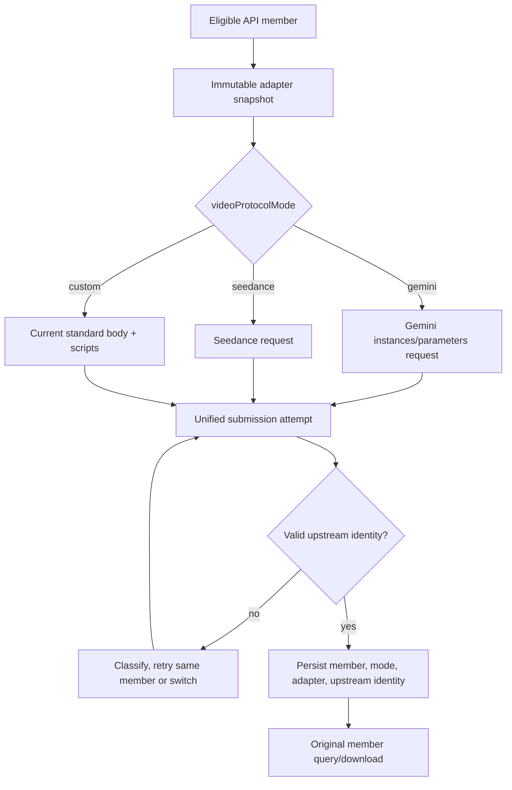
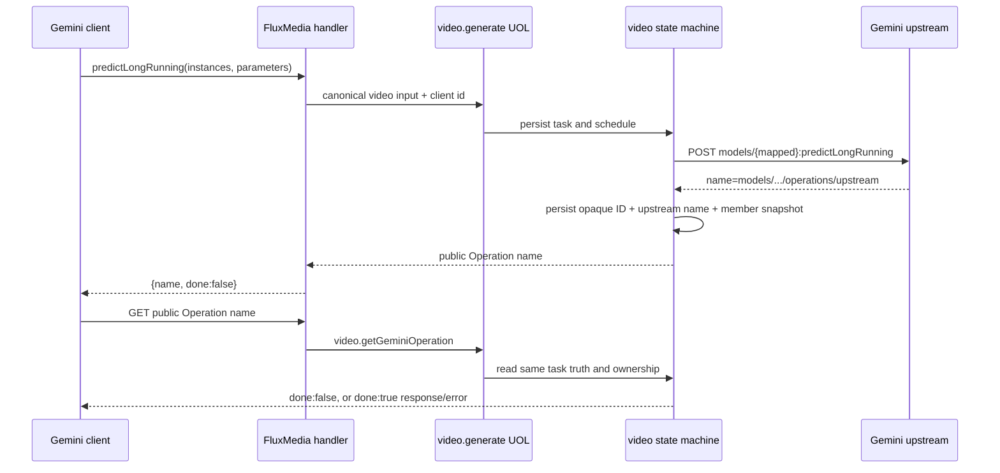
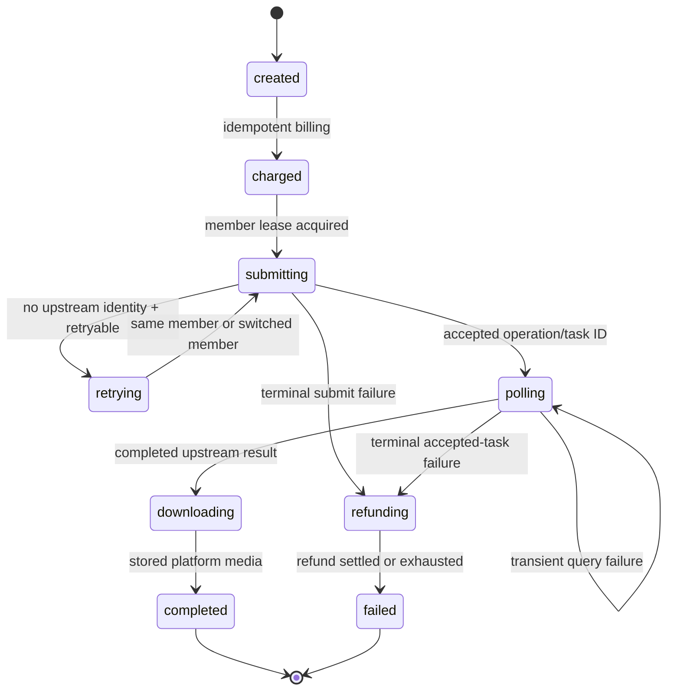

## Goal Capsule

- **Objective:** 保留现有 FluxMedia 视频协议，同时新增 Gemini 兼容入口，让外部客户端
  可以按各自协议接入，管理员则能为每个 API 后端成员明确选择上游协议，而不让模型
  名称决定供应商或请求格式。
- **Means:** 恢复 `POST /v1/videos/generations` 为现有协议的规范创建地址，下线
  `POST /v1/videos`；新增 Gemini `predictLongRunning` 入口与 Operation 查询，并在
  成员级提供 Gemini、Seedance 和 custom 三种视频上游模式。
- **Product authority:** 本文记录 2026-08-19 会话中确认的产品决策；现有 UOL、
  账号池调度、计费、幂等、内容审核、存储和异步任务恢复不变量继续生效。
- **Open blockers:** 无。实现冻结 Gemini 网关从路径参数读取公开模型，body 只接受
  `instances`/`parameters` 及本计划列出的官方字段；真实测试账号是否获得
  `predictLongRunning` 权限仍是发布门禁，不是可在代码中猜测或自动切换的协议决策。

Product Contract preservation: unchanged. The implementation sections below only define
how the confirmed contract is realized; they do not add a public protocol or change the
accepted route and mode decisions.

---

## Product Contract

### Summary

FluxMedia 保留现有视频协议，并将 `POST /v1/videos/generations` 恢复为规范创建地址；
`POST /v1/videos` 下线，不再承载创建兼容语义。平台另外提供
`/v1beta/models/{model}:predictLongRunning` 的 Gemini 兼容入口和 Operation 查询。
每个 API 后端成员独立选择 Gemini、Seedance 或 custom 上游模式。所有入口共享同一份
平台任务真相、计费、重试和恢复规则，外部客户端不会感知实际供应商、渠道或上游任务
身份。

### Official Gemini REST Contract Freeze

本次协议冻结以 Google AI for Developers 当前的 Veo REST 示例和 Models API
Reference 为准，而不是以 SDK 对象名或页面顶部的产品提示推测。核验日期为
2026-08-19，官方资料如下：

- [Veo 视频指南](https://ai.google.dev/gemini-api/docs/veo)：REST 示例调用
  `POST https://generativelanguage.googleapis.com/v1beta/models/{model}:predictLongRunning`，
  请求根对象为 `instances[]` 与可选 `parameters`，创建响应读取 `.name`。
- [Models API Reference](https://ai.google.dev/api/models)：
  `models.predictLongRunning` 的端点、`instances[]`、`parameters` 和 LRO 响应定义。
- [Operation 资源定义](https://ai.google.dev/api/file-search/file-search-stores)：
  `done=false` 表示处理中；`done=true` 时只能有 `response` 或 `error` 之一。

官方 Veo 页面同时出现“此功能目前仅适用于 `generateContent` API”的提示，而同页
可执行 REST 示例和 Models API Reference 又明确给出
`models/{model}:predictLongRunning`。这是 Google 文档当前的支持范围歧义：本计划把
端点级 REST 示例与 API Reference 作为实现契约证据，但把“线上账号是否已获得该方法
权限”列为发布前必须用真实测试账号验证的外部条件；实现不得因为该提示而偷偷切换
到 `generateContent`，也不得因为一次 404 就自动尝试另一种协议。

本计划还区分两个层次，避免“Gemini 格式”与“原生 Gemini 客户端兼容”混称：

1. **现有 FluxMedia 视频协议：**
   `/v1/videos/generations` 保留当前请求体、`video.task` 创建响应和
   `/v1/videos/{taskId}` 查询语义；`POST /v1/videos` 下线，不再作为创建入口。
2. **Gemini 兼容入口：**
   `/v1beta/models/{model}:predictLongRunning` 接受 Gemini 风格请求并返回 Gemini
   Operation；查询使用完整 `operation.name`。该入口使用 FluxMedia 的 API Key 映射，
   不是把客户端凭据转发到 Google。
3. **Google 原生入口边界：** Google 原生客户端还要求 Google 主机名和
   `x-goog-api-key`。若产品要求 SDK 零改造直连 Google 语义，平台必须额外设计认证映射
   和 Operation name 形状；不能把 FluxMedia 自有域名误称为 Google 官方服务。

官方 REST 视频响应与当前 FluxMedia 内置适配**不是同一协议**。当前适配发送
snake_case 平面 body，并从 `task_id`、`status`、`video_url` 等通用字段猜测任务和结果；
Gemini REST 使用模型路径、`instances/parameters` 包裹和 Google LRO 结果结构。两者
必须使用两个明确的内置解析分支，不能继续让 Gemini 响应落入当前通用 task ID/status
解析器。

Gemini 内置模式的官方字段映射边界如下：

| 语义 | Gemini REST | 当前平台规范输入 | 处理 |
| --- | --- | --- | --- |
| 上游认证 | 官方 REST 示例使用 `x-goog-api-key` | 成员凭据由适配器持有 | Gemini 内置模式按成员认证配置生成上游认证 Header；绝不转发客户端 `Authorization` |
| 模型 | URL 中的 `models/{model}` | `model` | 由成员的模型映射得到上游模型，不由模型名选择协议 |
| 提示词 | `instances[0].prompt` | `prompt` | 直接映射 |
| 首帧 | `instances[0].image` | `firstFrame` | 转成官方媒体对象，不转发平台令牌或内部 URL 字符串 |
| 尾帧 | `instances[0].lastFrame` | `lastFrame` | 仅在有首帧时映射 |
| 参考图 | `instances[0].referenceImages[]`，每项含 `image` 与 `referenceType` | `referenceImages[]` | 最多三张按 Veo 官方能力校验；不复用 Seedance 的十张上限 |
| 输入视频 | `instances[0].video` | 当前 UOL 暂无对应输入 | 本期明确拒绝，不静默丢弃；视频扩展另立能力与计费设计 |
| 比例 | `parameters.aspectRatio` | `aspectRatio` | 只在目标成员能力允许时映射 |
| 分辨率 | `parameters.resolution` | `resolution` | 只在目标成员能力允许时映射 |
| 时长 | `parameters.durationSeconds` | `duration` | 只接受上游能力允许的值；Veo 3.1 官方为 4、6、8 秒 |
| 音频 | Veo 3.1 原生始终生成音频，无 `generateAudio` 请求字段 | 当前 UOL 有可选 `generateAudio` | Gemini 模式不发送该字段；若平台请求明确要求关闭音频，必须在校验阶段拒绝而非忽略 |
| 负向提示 | 官方 Veo REST 请求没有 `negativePrompt` | 当前 UOL 有可选 `negativePrompt` | Gemini 模式拒绝该能力或由管理员明确配置转换；本期不伪造官方字段 |
| 幂等 | 官方 Veo body 没有 `client_request_id` | 当前 UOL `clientRequestId` | 改由平台请求头 `Idempotency-Key`（或 `x-request-id`）承载；缺失时生成平台 ID，并在响应中不回显为供应商字段 |
| 创建响应 | `Operation`，初始至少有 `name` | 当前返回 `video.task`、`id`、`task_id` | Gemini 模式单独解析，不接受当前平面任务字段作为官方响应 |
| 完成响应 | `done:true` 且 `response.generateVideoResponse.generatedSamples[].video.uri` | 当前接受 `video_url`、`url`、`output_url` | 只按官方 Gemini 路径读取；平台再替换为自己的受控产物 URL |
| 失败响应 | `done:true` 且 Google `Status` 风格 `error` | 当前接受 `status/state` 与 `error_message/error_code` | 映射为平台内部失败分类和脱敏 Operation error，不把错误正文当任务 ID |

Gemini 创建成功后返回标准 Operation 身份；官方示例轮询
`GET https://generativelanguage.googleapis.com/v1beta/{operation.name}`。完成响应的
视频结果位于 `response.generateVideoResponse.generatedSamples[].video.uri`，失败结果
位于 `error`（Google `Status`）。平台对外返回自己的不透明 Operation name，并将同一
结构中的 `video.uri` 替换为平台受控的视频地址；真实上游 operation name、模型路径、
账号和凭据永不外泄。

### Problem Frame

当前视频创建入口采用 OpenAI 风格，代码主地址是 `/v1/videos`，而
`/v1/videos/generations` 仍作为废弃兼容地址存在。本次将后者恢复为规范地址并下线前者。
API 后端成员已经具备模型映射、
认证、生成与查询路径、自定义请求脚本和响应脚本，但没有明确的上游视频协议模式。

模型身份不能承担协议选择职责。平台模型 `seedance2` 既可能由官方 Seedance 渠道
承载，也可能由只接受 Gemini 格式或私有格式的第三方渠道承载。若根据模型名称推断
协议，调度结果会决定错误的请求格式，并让同一模型无法安全接入多个渠道。

本次改造同时需要保护现有适配投资。已有 custom 脚本必须继续收到当前标准化输入，
无脚本成员也必须继续使用当前内置参数；公共协议切换不能迫使存量成员改写上游协议。

### Key Decisions

- KD1. **保留现有 FluxMedia 视频协议，并新增 Gemini 兼容协议。**
  (session-settled: user-directed — chosen over replacing the current protocol: existing
  clients should remain usable while Gemini compatibility is added separately.) Governs
  R1-R8.
- KD2. **创建主地址恢复为 `POST /v1/videos/generations`，下线 `POST /v1/videos`。**
  (session-settled: user-directed — chosen over keeping `/v1/videos` as the canonical
  creation route: the previously deprecated generations address becomes the stable
  current-protocol address.) Governs R2-R4.
- KD3. **上游协议是后端成员的传输能力。**
  (session-settled: user-directed — chosen over model- or group-based routing:
  the same model may be served by channels using different protocols.) Governs
  R10-R13.
- KD4. **custom 保留现有脚本输入契约。**
  (session-settled: user-approved — chosen over exposing the raw public Gemini
  body to scripts: existing scripts and no-script behavior must remain valid.)
  Governs R16-R17.
- KD5. **保留两种公共任务查询入口。**
  (session-settled: user-directed — chosen over a single query surface: current
  taskId callers and Gemini Operation clients both need a supported path.)
  Governs R3-R8.
- KD6. **三种模式共用提交重试与账号切换规则。**
  (session-settled: user-approved — chosen over protocol-specific recovery:
  retryability depends on failure stage and category, not request format.)
  Governs R18-R22.

### Actors

- **外部 API 客户端：** 使用现有 FluxMedia 或新增 Gemini 格式提交视频请求，并通过
  对应查询入口读取任务结果。
- **管理员：** 配置后端成员、上游认证、模型映射、视频协议模式及 custom 脚本。
- **平台调度与任务系统：** 校验规范输入，选择合格成员，执行有限重试、切号、轮询、
  下载、存储、计费、退款和结果通知。
- **上游渠道：** 接收由成员模式生成的 Gemini、Seedance 或自定义请求，并返回同步
  结果或异步任务身份。

### Requirements

**公共协议与地址**

- R1. 现有 FluxMedia 视频协议必须继续支持当前请求体、HTTP 202、`video.task` 创建
  响应和状态字段；它不因新增 Gemini 入口而改成 Operation，也不得混入 Gemini 专属
  `instances`/`parameters` 包裹。
- R2. 现有协议的规范创建地址必须恢复为 `POST /v1/videos/generations`，并提供行为
  完全一致的 `POST /api/v1/videos/generations` 别名；两者继续调用同一个 UOL 操作。
- R3. `POST /v1/videos` 与 `POST /api/v1/videos` 直接下线，不再创建任务、不再回退到
  `/v1/videos/generations`，并返回稳定的废弃/不存在错误；本次只废弃创建接口，现有
  `GET /v1/videos/{taskId}` 查询地址按 R4 保留。
- R4. 现有 `GET /v1/videos/{taskId}` 与 `GET /api/v1/videos/{taskId}` 必须继续可用，
  返回当前 FluxMedia taskId 投影；它不是 Gemini Operation 查询入口。
- R5. 新增 Gemini 创建地址必须是
  `POST /v1beta/models/{model}:predictLongRunning`，并提供等价的 `/api/v1beta` 部署
  别名（如启用该别名）；模型路径参数负责选择平台公开模型，不得根据模型名称推断
  上游协议。
- R6. Gemini 创建必须返回 Operation 形状的响应，平台生成的不透明 `name` 应保持
  `models/{model}/operations/{opaqueId}` 形式，以便客户端按完整 name 查询；不得泄露
  真实上游 operation name、task ID、账号或凭据。
- R7. Gemini Operation 查询必须使用完整 `operation.name` 对应的
  `GET /v1beta/models/{model}/operations/{opaqueId}`（及 `/api/v1beta` 别名），并与
  taskId 查询读取同一任务真相、执行相同的 API Key 归属校验；不得维护第二套状态机。
- R8. Gemini Operation 必须将平台非终态投影为 `done: false`，将成功终态投影为
  `done: true` 与 `response.generateVideoResponse.generatedSamples[].video.uri`，将失败
  终态投影为 `done: true` 与脱敏 Google `Status` 风格 `error`；不得暴露内部阶段、
  退款实现、存储身份或供应商原始响应。

**规范输入与成员级协议模式**

- R9. 两种公共请求都必须先解析成现有 `video.generate` UOL 的传输无关规范输入，再
  进入能力校验、调度、计费和上游适配；传输层不得直接调用供应商服务。
- R10. 每个支持视频的 API 后端成员必须具有明确的视频协议模式，允许值为 `gemini`、
  `seedance` 和 `custom`；协议模式不得从平台模型 ID、上游模型 ID、成员名称或分组
  推断。
- R11. 同一平台模型必须允许由不同协议模式的多个成员承载；成员是否合格仍由模型、
  分组、能力、内容安全、启用状态、优先级和并发等现有条件共同决定。
- R12. 新建或编辑成员时，管理员必须能查看并明确选择协议模式；界面必须解释该模式
  只决定上游请求格式，不改变平台模型身份或公共 Gemini 协议。
- R13. 任务第一次向上游提交前必须固定成员、协议模式、模型映射和适配版本；管理员
  后续改动只影响新任务，已接受任务继续按其快照查询和下载。

```mermaid
flowchart TB
  Existing[FluxMedia /v1/videos/generations] --> UOL[UOL 规范视频输入]
  Gemini[Gemini /v1beta/models/{model}:predictLongRunning] --> UOL
  UOL --> Scheduler[账号池选择后端成员]
  Scheduler --> Mode{成员视频协议模式}
  Mode -->|gemini| GeminiUpstream[Gemini 内置上游适配]
  Mode -->|seedance| Seedance[Seedance 内置上游适配]
  Mode -->|custom| Custom[现有标准请求与自定义脚本]
  GeminiUpstream --> Task[统一平台任务真相]
  Seedance --> Task
  Custom --> Task
  Task --> Operation[Gemini Operation 查询]
  Task --> TaskId[既有 taskId 查询]
```

**内置模式与 custom 兼容**

- R14. Gemini 模式必须把 UOL 规范输入转换为 Gemini Developer API REST
  `models/{model}:predictLongRunning` 上游请求，并将其 Google LRO 状态、
  `generateVideoResponse.generatedSamples[].video.uri` 结果和 Google `Status` 错误
  归一为平台任务；必须单独保存和轮询上游 `operation.name`，不得复用当前
  `/videos/{task_id}` 路径或通用 `status`/`video_url`/`task_id` 猜测解析，也不得混入
  Vertex AI 或 SDK 专属字段。
- R15. Seedance 模式必须把同一 UOL 规范输入转换为 Seedance/火山方舟的视频任务
  请求，并将其任务状态、结果和错误归一为平台任务；选择该模式必须只依赖成员配置。
- R16. custom 请求脚本必须继续收到当前上游适配器的标准化 `query`、可选 `body` 和
  脱敏 context；视频生成 body 继续使用当前 snake_case 平台字段和受保护媒体令牌，
  响应脚本继续输出现有统一任务结果。
- R17. `custom` 模式省略脚本时必须使用当前内置视频路径、请求参数和响应解析；所有
  存量 API 视频成员必须迁移为 `custom`，并原样保留已有路径和脚本，不得自动改发
  Gemini 或 Seedance 请求。
- R17a. Gemini 模式对官方尚未被 UOL 建模的输入能力（当前为视频扩展/输入视频、
  `personGeneration`、`seed` 等）必须明确拒绝或先完成独立能力建模；不得接收后静默
  丢弃。支持的官方字段必须以 Gemini 的大小写和嵌套结构对外呈现，custom 模式则继续
  使用现有 snake_case 标准 body。

**提交恢复与任务粘性**

- R18. Gemini、Seedance 和 custom 三种模式的提交必须共用现有成员级有限重试预算；
  每次真实提交都必须受同一平台任务和幂等身份约束。
- R19. 网络失败、超时、限流、响应读取或解析失败以及上游暂时不可用，必须在当前
  成员剩余预算内有限重试；当前成员预算耗尽后，必须排除该成员并立即选择下一个合格
  成员。
- R20. 鉴权或权限错误必须按现有规则直接排除当前成员并切换；参数错误、内容审核
  拒绝和其他明确不可重试错误必须终止提交并进入现有失败与退款流程。
- R21. 一旦 Gemini operation name、Seedance task ID、custom 标准结果 task ID 或同步
  产物确认任务已被接受，平台必须固定原成员、协议模式和适配版本；后续查询失败不得
  重新提交或切换成员。
- R22. 协议转换、重试、切号、进程恢复和重复队列执行不得产生重复上游任务、重复
  扣费、多次退款、重复存储或重复终态通知。

**安全与既有不变量**

- R23. 平台不得向任何上游转发客户端 `Authorization`、Cookie 或其他客户端凭据；
  上游认证只能使用当前成员自己的受控凭据。
- R24. 所有公共请求、成员配置、脚本输出和上游响应必须经过严格校验；错误必须映射为
  稳定、脱敏、可定位的公共错误，不得回显供应商正文、脚本、媒体令牌或密钥。
- R25. custom 脚本必须继续在现有隔离、资源限制、保留 Header、媒体令牌和脱敏上下文
  边界内运行；协议模式不得扩大脚本读取用户、账号或凭据数据的权限。
- R26. 现有内容审核 fail-closed、模型能力校验、积分与 API Key 配额幂等、对象存储、
  callback URL 安全校验和终态投递规则必须保持不变；成员配置不能替换平台 callback
  目标。

### Key Flows

- F1. 现有协议创建
  - **Trigger:** 外部客户端向 `/v1/videos/generations` 提交当前 FluxMedia 视频请求。
  - **Actors:** 外部 API 客户端、平台调度与任务系统、上游渠道。
  - **Steps:** API Key 鉴权并解析当前请求体；UOL 校验规范输入；账号池选择合格成员；
    成员模式生成上游请求；平台返回现有 `video.task`。
  - **Outcome:** 现有客户端行为保持不变，并可通过 `/v1/videos/{taskId}` 查询。
  - **Covers:** R1-R4, R9-R17, R23-R26.
- F2. Gemini 兼容创建
  - **Trigger:** 外部客户端向 `/v1beta/models/{model}:predictLongRunning` 提交 Gemini
    风格请求。
  - **Actors:** 外部 API 客户端、平台调度与任务系统、上游渠道。
  - **Steps:** API Key 鉴权并解析 Gemini `instances/parameters` 请求；UOL 校验规范输入；
    账号池选择合格成员；成员模式生成上游请求；平台返回不透明 Gemini Operation。
  - **Outcome:** Gemini 客户端按 Operation 语义查询同一平台任务。
  - **Covers:** R5-R15, R17a, R23-R26.
- F3. custom 成员执行
  - **Trigger:** 调度器选择 `custom` 模式成员。
  - **Actors:** 管理员、平台调度与任务系统、上游渠道。
  - **Steps:** 平台构造当前标准化上游请求；存在脚本时按现有顺序执行请求和响应脚本；
    不存在脚本时使用当前内置路径与解析。
  - **Outcome:** 任一公共协议请求都可以通过现有 custom 契约接入任意第三方协议。
  - **Covers:** R16-R17, R23-R25.
- F4. 提交失败恢复
  - **Trigger:** 上游尚未确认创建任务时提交失败。
  - **Actors:** 平台调度与任务系统、多个合格上游成员。
  - **Steps:** 平台按稳定错误分类决定同成员重试、直接切换或终止；同成员预算耗尽时
    排除该成员并选择下一成员；所有尝试保持同一平台任务和幂等身份。
  - **Outcome:** 可恢复故障自动收敛，明确业务拒绝不会被盲目重试。
  - **Covers:** R18-R20, R22.
- F5. 已接受任务查询
  - **Trigger:** 任一上游返回有效任务身份或同步产物。
  - **Actors:** 平台调度与任务系统、原上游成员、外部 API 客户端。
  - **Steps:** 平台保存成员和适配快照；只通过原成员轮询、下载并收敛终态；两个公共
    查询入口分别投影同一任务。
  - **Outcome:** 配置变更或查询故障不会造成换号重提，两个查询视图最终一致。
  - **Covers:** R3-R8, R13, R21-R22.
- F6. 存量成员迁移
  - **Trigger:** 新版本首次读取或迁移现有 API 后端成员。
  - **Actors:** 管理员、平台配置与任务系统。
  - **Steps:** 系统保留现有路径、脚本和无脚本行为；成员不会按模型名称改选协议；
    管理员之后可显式改为 Gemini 或 Seedance 模式。
  - **Outcome:** 升级不改变存量上游请求，协议切换成为可审计的管理员动作。
  - **Covers:** R10-R13, R16-R17.

### Acceptance Examples

- AE1. **Covers R1-R4.** Given 客户端向 `/v1/videos/generations` 提交当前合法请求，
  when 平台接受任务，then 返回现有 `video.task` 和 HTTP 202，并可用
  `/v1/videos/{taskId}` 查询；given 客户端向已下线的 `/v1/videos` 提交，then 不执行
  任务、不回退到 generations 地址。
- AE2. **Covers R5-R8.** Given 客户端向
  `/v1beta/models/veo-3.1-generate-preview:predictLongRunning` 提交合法 Gemini 请求，
  when 平台接受任务，then 返回 `models/.../operations/...` Operation；查询时处理中
  返回 `done:false`，成功返回 `response.generateVideoResponse.generatedSamples[].video.uri`，
  失败返回脱敏 `error`；同一任务仍可通过 taskId 查询。
- AE3. **Covers R10-R11, R15.** Given 两个成员都声明支持 `seedance2`，其中一个配置为
  Gemini 模式、另一个配置为 Seedance 模式，when 调度器先后选择它们，then 请求格式
  分别由成员模式决定，而不是由 `seedance2` 字符串决定。
- AE4. **Covers R16-R17.** Given 存量 custom 成员已有视频脚本，when 公共协议升级，
  then 脚本仍收到当前标准化 body、媒体令牌和脱敏 context；given 存量成员没有脚本，
  then 仍按当前内置路径、参数和解析调用上游。
- AE4a. **Covers R5-R8, R14, R17a.** Given Gemini 成员返回官方初始
  `{ "name": "models/.../operations/..." }`，when 平台轮询到官方完成响应，then 只从
  `response.generateVideoResponse.generatedSamples[].video.uri` 取结果；given 返回
  `done:true,error`，then 不把它当作普通任务失败字段猜测，也不重提已接受任务；given
  请求带 `generateAudio` 或 `negativePrompt` 等未建模字段，then 明确 4xx 拒绝。
- AE5. **Covers R18-R19, R22.** Given 当前成员连续发生可重试提交失败，when 其有限
  预算尚未耗尽，then 平台只重试该成员；when 预算耗尽，then 排除该成员并切换到下一
  合格成员，且平台任务、幂等身份和扣费事实不变。
- AE6. **Covers R20.** Given 当前成员返回鉴权失败，when 分类器处理结果，then 平台
  直接切换成员；given 上游明确拒绝参数或内容审核，then 平台终止提交并进入现有失败
  与退款流程，不继续尝试其他成员。
- AE7. **Covers R13, R21-R22.** Given 上游已返回有效任务身份，when 管理员修改成员
  模式或轮询暂时失败，then 任务继续按提交快照查询原成员，不重新提交、不切号，也不
  读取新配置改变协议。
- AE8. **Covers R23-R26.** Given 客户端请求含 API Key 和 callback URL，when 任一模式
  调用上游并最终完成，then 上游只收到成员凭据，callback 仍由平台安全投递到客户端
  指定地址，任何响应和日志都不暴露客户端凭据或上游原始身份。

### Success Criteria

- Gemini 客户端可通过平台创建地址获得 Operation，并通过 Gemini Operation 查询完成
  全流程；现有 taskId 查询仍能读取同一任务。
- 在发布 Gemini 内置模式前，使用受控测试账号完成一次真实 REST 冒烟：创建响应能
  读取完整 `name`，按完整资源名轮询，完成响应能读取官方 `video.uri`，并能携带成员
  凭据下载；若账号返回方法不可用，发布必须阻断，不能自动切换到
  `generateContent` 或其他协议。
- 同一平台模型可在不同协议模式的成员之间正常调度，任何路径都不依赖模型名称选择
  请求格式。
- 存量 custom 脚本和无脚本成员升级后保持原上游请求行为，管理员显式切换模式后才
  使用新的内置适配。
- 三种协议模式均通过相同的有限重试、耗尽切号和已接受任务粘性验收，且财务、存储、
  callback 与内容审核不变量无回归。

### Scope Boundaries

- 本次只改造视频公共创建与查询协议、API 后端成员的视频协议模式、内置视频上游适配
  和相关迁移、文档与验证；图片公共协议和图片上游行为不在范围内。
- 不新增 OpenAI 视频兼容入口；现有 FluxMedia 协议字段仅在
  `/v1/videos/generations` 保留，Gemini 字段仅在 Gemini 兼容入口接受。
- 不支持 Vertex AI 传输、Gemini SDK 私有字段或客户端直连真实 Gemini operation；如需
  原生 Gemini SDK 零改造接入，另立原生入口需求，不把平台语义网关冒充原生入口。
- 不增加按模型、供应商名称或失败响应自动猜测协议，也不在同一成员内自动尝试多种
  请求格式。
- 不重设计计费、配额、审核、存储、callback、账号池选择策略或视频公开能力目录；
  这些系统只做支持新协议模式所需的契约适配并保持现有不变量。
- 既有视频恢复实现中的提交重试、切号、退款和任务恢复规则继续有效；其中的公共协议、
  创建地址和兼容期决策由本文取代。

## Planning Contract

### Key Technical Decisions

- KTD1. **协议模式进入 API 适配版本快照。** 在 `apiUpstreamAdapterDraftSchema` 中增加
  `videoProtocolMode: "gemini" | "seedance" | "custom"`，并把它与模型映射、路径、
  脚本和重试配置一起写入不可变适配版本。旧版本缺少该字段时只在读取迁移时补为
  `custom`，不从模型名或供应商名推断。(session-settled: user-directed — chosen over
  model-based routing: one platform model may be served by unrelated third-party channels.)
- KTD2. **Gemini 网关使用路径模型和不透明 Operation 映射。** 公共路径参数是平台公开
  模型；创建请求只解析 Gemini 官方根对象。平台为每个任务生成独立随机的
  `models/{model}/operations/{opaqueId}`，数据库保存 opaque ID 与真实任务的唯一映射，
  上游完整 operation name 只保存于受保护的任务快照。这样不会把 task ID、成员、模型
  账号或上游 operation 泄露给客户端。(session-settled: user-approved — chosen over
  exposing the real upstream operation: clients need Gemini shape, not supplier identity.)
- KTD3. **UOL 是唯一任务真相。** 新的 Gemini create/get handlers 只负责认证、解析、
  规范化和响应投影；它们调用既有 `video.generate`/`video.getStatus` 以及新增的
  `video.getGeminiOperation` 注册项。Operation 查询在执行层先解析 opaque ID，再调用
  同一个任务状态读取器和归属校验，不建立第二套状态机。
- KTD4. **内置适配器采用显式策略，而不是猜测。** `gemini` 和 `seedance` 使用独立的
  请求构造、响应解析和查询路径；`custom` 保留现有脚本 envelope、媒体令牌、脱敏
  context 和无脚本内置行为。模式选择只来自第一次提交时固定的成员适配快照。
- KTD5. **提交阶段和已接受阶段使用不同的恢复边界。** 只有未取得有效上游身份时才
  应用有限重试、认证错误切号和终止分类；一旦取得 Gemini operation name、Seedance
  task ID、custom task ID 或同步产物，立即持久化 accepted 身份并固定成员，查询失败
  只能恢复原任务。重试分类复用现有 `video-submission-failure` 和尝试账本，不由协议
  适配器自由决定是否重提。(session-settled: user-approved — chosen over retrying every
  upstream error: accepted tasks must never create duplicates.)
- KTD6. **数据库先扩展再接线。** 协议模式只存在于不可变适配版本的 configuration
  JSON 和任务执行快照，不新增可被当前配置回推的 live mode 列。迁移先增加公开 Gemini
  operation opaque ID 唯一列和真实上游 operation name 列，并为历史行设置安全
  null/default；随后再发布路由和 worker。迁移脚本手写并同步 `_journal.json`，不运行
  `drizzle-kit generate`，以避免快照漂移进入交互模式。
- KTD7. **外部凭据边界保持原样。** Gemini 上游只允许成员自己的 API key 按认证模式
  生成 `x-goog-api-key` 或受控 Header；公共请求的 Authorization、Cookie、callback
  凭据和平台媒体令牌不会进入上游 Header、脚本 context、日志或 Operation 响应。

### High-Level Technical Design

#### Public transport and UOL flow

```mermaid
flowchart LR
  Legacy[POST /v1/videos/generations] --> LSchema[FluxMedia schema]
  Gemini[POST /v1beta/models/{model}:predictLongRunning] --> GSchema[Gemini schema]
  LSchema --> Canonical[video.generate UOL input]
  GSchema --> Canonical
  Canonical --> Registry[Operation Registry]
  Registry --> Truth[video_generation task truth]
  Truth --> TaskView[GET /v1/videos/{taskId}]
  Truth --> OperationView[GET /v1beta/models/{model}/operations/{opaqueId}]
```

The Gemini handler maps the path model into the existing platform model field and rejects
unknown or unmodeled Gemini fields before media staging, billing, or scheduling. The existing
handler remains the only owner of FluxMedia snake_case/camelCase aliases. `/v1/videos` create
routes return the stable deprecated/not-found response and never call the generation handler.

#### Member strategy and upstream flow



The strategy boundary returns a protocol-neutral `pending | completed` result or a classified
submission error. It does not own billing, leases, task stages, callback delivery, or member
selection.

#### Gemini Operation lifecycle



Only the accepted Gemini operation is polled. The platform replaces the upstream video URI
with a controlled storage URL after download and never returns the upstream resource name.

#### Shared task state machine



### Assumptions and Deferred Questions

- The existing API member table can continue to hold protocol mode inside the immutable adapter
  configuration JSON; no live member row is read by accepted tasks after snapshotting. The
  current database migration head is `0094`, so this change must use the next available
  hand-written migration number rather than the illustrative number in an earlier draft.
- The Gemini public model path is authoritative; a body-level `model` field is not accepted in
  this release. This removes the prior model-source ambiguity without changing UOL's canonical
  `model` field.
- Gemini API documentation's `generateContent` notice remains an external release gate. The
  implementation must fail the smoke test on a real account rather than add an automatic fallback
  protocol.
- A follow-up may add more official Gemini fields after a new UOL capability, billing, and media
  contract. Until then, `video`, `negativePrompt`, and an explicit audio-disable request are
  rejected rather than silently dropped.

### Implementation Sequencing

1. Add shared mode, Operation, request/response schemas and DB migration without changing the
   active worker behavior; land DB-free tests first.
2. Add Gemini and Seedance strategy adapters behind the existing API video executor, preserving
   custom/no-script behavior and adding adapter-level contract tests.
3. Wire task snapshot fields, accepted-operation polling, retry classification, and recovery
   persistence; run state-machine and repository tests before exposing public routes.
4. Add the generations route restoration, `/v1/videos` create shutdown, Gemini handlers and
   Operation projection; verify `/api` aliases call identical UOL operations.
5. Add admin mode selection and redacted read models; run migration preflight and UI/service
   tests.
6. Run real Gemini smoke validation, then the repository quality gates. Release is blocked if
   the smoke test cannot create, poll, and download an operation with a controlled test account.

## Implementation Units

### Unit Index

| U-ID | Title | Primary files | Depends on |
| --- | --- | --- | --- |
| U1 | Shared protocol and Operation contracts | `packages/shared/src/image-backend/*`, `packages/shared/src/uol/operations/video-generation.ts` | — |
| U2 | Persist protocol and Operation snapshots | `packages/database/src/schema.ts`, `packages/database/drizzle/0095_gemini_video_operation.sql` | U1 |
| U3 | Gemini upstream strategy | `apps/web/src/features/image-generation/gemini-video.ts` | U1, U2 |
| U4 | Seedance/custom strategy dispatch | `apps/web/src/features/image-generation/api-video.ts`, `apps/web/src/features/image-generation/video-operations.ts` | U1, U2 |
| U5 | Accepted-task recovery and retry integration | `apps/web/src/features/image-generation/video-operations.ts`, `video-submission-failure.ts`, `video-recovery-repository.ts` | U2-U4 |
| U6 | UOL bindings and public route projections | `apps/web/src/server/uol-bindings/video-generation.ts`, `apps/web/src/features/external-api/handlers/*`, `apps/web/src/app/*` | U1-U5 |
| U7 | Admin member mode configuration | `apps/web/src/features/image-backend-pool/*`, `packages/shared/src/image-backend/member-contract.ts` | U1, U2 |
| U8 | End-to-end verification and release documentation | `apps/web/src/features/external-api/*.test.ts`, `apps/web/src/features/image-generation/*.test.ts`, `docs/*` | U3-U7 |

### U1. Define explicit protocol modes and Gemini Operation contracts

- **Goal:** Give each API member and each public Gemini request a strict, transport-neutral
  contract that cannot infer protocol from model names.
- **Requirements:** R5-R12, R14, R16-R17a, R23-R25; KD3-KD4.
- **Files:** `packages/shared/src/image-backend/api-upstream-adaptation.ts`,
  `packages/shared/src/image-backend/api-upstream-script-contract.ts`,
  `packages/shared/src/image-backend/member-contract.ts`,
  `packages/shared/src/uol/operations/video-generation.ts`,
  `packages/shared/src/uol/operations/video-generation.test.ts`,
  `packages/shared/src/image-backend/member-contract.test.ts`,
  `packages/shared/src/image-backend/api-upstream-adaptation.test.ts`.
- **Approach:** Add a discriminated mode schema and a stable default of `custom` only for
  legacy adapter snapshots. Define Gemini path/request/Operation schemas, strict official field
  allowlists, opaque-name grammar, and a DB-free projection contract. Keep custom script input
  schemas unchanged. Register `video.getGeminiOperation` with owner access and a separate output
  schema; its execution remains unbound until UOL bindings are ready.
- **Test scenarios:**
  - Parse all three modes and reject unknown values, mode inference fields, or credentials in
    the mode object.
  - Accept official `instances`/`parameters` fields and reject `model` in the body, `video`,
    `negativePrompt`, and an explicit audio-disable request with stable validation issues.
  - Accept only `models/{model}/operations/{opaqueId}` public names and reject names containing
    task IDs, URLs, credentials, or extra path segments.
  - Verify `video.getGeminiOperation` is owner-scoped, read-only, and registered once.
- **Verification:** Run the shared package Vitest files and `pnpm --filter @repo/shared typecheck`.

### U2. Persist immutable protocol and Operation identities

- **Goal:** Make public opaque Operations and accepted upstream operation names durable across
  workers, configuration edits, and member deletion.
- **Requirements:** R6-R8, R13, R18-R22, R26; KD2, KD6.
- **Files:** `packages/database/src/schema.ts`,
  `packages/database/drizzle/0095_gemini_video_operation.sql`,
  `packages/database/drizzle/meta/_journal.json`,
  `apps/web/src/features/image-generation/video-operations.ts`,
  `apps/web/src/features/image-generation/video-recovery-repository.ts`,
  `apps/web/src/features/image-generation/video-recovery-repository.test.ts`,
  `apps/web/src/features/image-generation/video-task-identity.ts`.
- **Approach:** Add nullable `publicOperationId` with a unique index and nullable
  `upstreamOperationName` to `video_generation`; retain `upstreamJobId` for Seedance/custom.
  Store mode in the immutable adapter configuration and copy it into the task metadata snapshot
  used by recovery. Add pair/format checks, safe legacy defaults, and repository projections that
  never return the upstream name to public handlers. Use a hand-written idempotent SQL migration
  with the repository's journal convention.
- **Test scenarios:**
  - Migration SQL adds columns/indexes without dropping existing task or adapter data and is
    rejected when the public operation format or adapter pair is incomplete.
  - Concurrent Operation creation for one task yields one opaque ID and no duplicate unique row.
  - Reloading an accepted Gemini task after member config deletion still returns the fixed mode,
    member snapshot, and upstream operation name to the worker.
  - Legacy tasks with no mode remain custom only when their adapter snapshot is valid; malformed
    pairs fail closed and do not guess Gemini.
- **Verification:** Run migration preflight tests, schema typecheck, and repository SQL tests;
  inspect `git diff --check` and the hand-written journal entry.

### U3. Implement the Gemini upstream strategy and LRO parser

- **Goal:** Send official Gemini REST requests and normalize Operation responses without using
  the current generic task/status parser.
- **Requirements:** R14, R17a, R18-R25; KD2, KD4, KD7.
- **Files:** `apps/web/src/features/image-generation/gemini-video.ts`,
  `apps/web/src/features/image-generation/gemini-video.test.ts`,
  `apps/web/src/features/image-generation/api-video-error.ts`,
  `apps/web/src/features/image-backend-pool/api-upstream-auth.ts`,
  `apps/web/src/features/image-backend-pool/api-upstream-executor.ts`,
  `apps/web/src/features/image-backend-pool/media-upstream-fetch.ts`.
- **Approach:** Build `instances[0]` and `parameters` from the canonical UOL input, map media
  references to bounded inline/storage-backed Gemini media objects, and use the member's mapped
  upstream model in the URL. Add strict parsers for initial `{name}`, pending `done:false`,
  completed `generateVideoResponse.generatedSamples[].video.uri`, and Google `Status` errors.
  Preserve trusted-origin checks and member authentication while rejecting client credentials.
  Treat malformed or missing names as submission-stage classified failures; never infer a task ID
  from arbitrary fields.
- **Test scenarios:**
  - Build exact request JSON for prompt, first/last frame, up to three references, ratio,
    resolution, and the allowed durations; verify no snake_case or unsupported fields leak.
  - Add headers from member authentication only and assert client Authorization/Cookie are absent.
  - Parse initial, pending, successful, and failed official Operation fixtures; reject wrong
    nesting, empty samples, non-HTTPS media URI, and oversized response bodies.
  - Verify retry classification for timeout, network, 429/5xx, 401/403, malformed JSON, and
    missing operation name; verify accepted Operation errors never trigger resubmission.
- **Verification:** Run Gemini adapter tests, upstream executor tests, media URL security tests,
  and `pnpm --filter @repo/web typecheck`.

### U4. Dispatch Seedance and preserve custom/no-script behavior

- **Goal:** Make Seedance an explicit built-in strategy while keeping existing custom scripts
  and no-script API members behaviorally identical.
- **Requirements:** R10-R17, R21-R22, R25; KD1, KD3, KD4.
- **Files:** `apps/web/src/features/image-generation/api-video.ts`,
  `apps/web/src/features/image-generation/api-video.test.ts`,
  `apps/web/src/features/image-backend-pool/api-upstream-executor.ts`,
  `apps/web/src/features/image-backend-pool/api-upstream-executor.test.ts`,
  `packages/shared/src/image-backend/api-upstream-script-contract.ts`.
- **Approach:** Route each `videos.generate`/`videos.query` operation through the mode in the
  pinned adapter snapshot. Reuse the existing Seedance request/response contract for the built-in
  branch, and call the current script envelope unchanged for custom. If custom scripts are empty,
  keep current built-in paths, snake_case body, and parser. Do not fall back from one mode to
  another after an upstream error.
- **Test scenarios:**
  - Two members supporting the same model emit different request formats solely from their mode.
  - Existing request and response scripts receive the same query/body/context and protected
    media tokens as before.
  - Empty custom scripts use `/videos/generations` and `/videos/{task_id}` with the old parser.
  - A mode change after task acceptance does not change the query path or parser for that task.
- **Verification:** Run all API upstream executor/script contract tests and API video fixtures;
  compare serialized custom requests against characterization fixtures from the previous behavior.

### U5. Integrate accepted identity, retries, switching, and polling

- **Goal:** Extend the existing video state machine so Gemini, Seedance, and custom share the
  same finite submit retry and sticky accepted-task recovery rules.
- **Requirements:** R13, R18-R22, R26; KD3, KD5, KD6, KD7.
- **Files:** `apps/web/src/features/image-generation/video-operations.ts`,
  `apps/web/src/features/image-generation/video-submission-failure.ts`,
  `apps/web/src/features/image-generation/video-submission-attempt-repository.ts`,
  `apps/web/src/features/image-generation/video-submission-retry-selection.ts`,
  `apps/web/src/features/image-generation/video-queue-schedule.ts`,
  `apps/web/src/features/image-generation/video-recovery-repository.ts`,
  `apps/web/src/features/image-generation/video-operations.test.ts`,
  `apps/web/src/features/image-generation/video-submission-failure.test.ts`,
  `apps/web/src/features/image-generation/video-submission-retry-selection.test.ts`.
- **Approach:** Persist protocol and adapter snapshots before the first external submit. On a
  valid Gemini operation name, Seedance task ID, custom task ID, or synchronous media result,
  transition once to accepted/polling and release account switching. Before acceptance, reuse
  the existing attempt ledger, retry budget, Retry-After schedule, capacity wait, and refund
  semantics. Make poll/download calls consume the pinned strategy and upstream identity. Ensure
  repeated queue claims and CAS races cannot create a second submission or charge/refund twice.
- **Test scenarios:**
  - Retry the same member for network/timeout/429/5xx, switch on 401/403, and terminate on
    invalid request/moderation; verify attempt counters and exclusions are persistent.
  - Accept a Gemini name, restart the worker, and verify polling uses the original member and
    name even after admin mode/key changes.
  - Return malformed Gemini success, missing URI, or a terminal Operation error and verify the
    task fails without resubmission after acceptance.
  - Run concurrent claims and duplicate client requests; verify one task, one billing fact, one
    opaque Operation, one callback, and no post-refund upstream call.
- **Verification:** Run the video state-machine, recovery, billing, callback, and repository
  test suites; run targeted PostgreSQL integration tests where configured.

### U6. Restore generations and expose Gemini public routes

- **Goal:** Expose both public protocols through thin UOL adapters with identical authentication,
  ownership, and callback boundaries.
- **Requirements:** R1-R9, R23-R26; KD1, KD2, KD3, KD5.
- **Files:** `apps/web/src/features/external-api/handlers/video-generations.ts`,
  `apps/web/src/features/external-api/handlers/video-tasks.ts`,
  `apps/web/src/features/external-api/handlers/gemini-video.ts`,
  `apps/web/src/features/external-api/handlers/gemini-operations.ts`,
  `apps/web/src/app/v1/videos/generations/route.ts`,
  `apps/web/src/app/api/v1/videos/generations/route.ts`,
  `apps/web/src/app/v1/videos/route.ts`,
  `apps/web/src/app/api/v1/videos/route.ts`,
  `apps/web/src/app/v1beta/models/[model]:predictLongRunning/route.ts`,
  `apps/web/src/app/api/v1beta/models/[model]:predictLongRunning/route.ts`,
  `apps/web/src/app/v1beta/models/[model]/operations/[operationId]/route.ts`,
  `apps/web/src/app/api/v1beta/models/[model]/operations/[operationId]/route.ts`,
  `apps/web/src/features/external-api/handlers/video-generations.test.ts`,
  `apps/web/src/features/external-api/handlers/gemini-video.test.ts`.
- **Approach:** Keep `/v1/videos/generations` and `/api/v1/videos/generations` wired to the
  existing FluxMedia handler and `video.generate`; make `/v1/videos` and its `/api` mirror return
  a stable 410/404-style deprecation response without invoking UOL. Parse Gemini path/model and
  `instances`/`parameters`, map callback only through `OperationContext`, and return an Operation
  name with `done:false`. Query handlers parse the complete public name, enforce model and API-key
  ownership, and project the shared task state to Gemini response/error shapes. Keep taskId query
  routes unchanged. Before adding the colon-suffixed Next route, verify the framework route
  matcher; if a literal colon segment is not compiled, use a narrow catch-all route that accepts
  only the exact `:predictLongRunning` suffix and rejects every other action.
- **Test scenarios:**
  - Generations root and `/api` alias return identical 202 task objects and call the same UOL
    operation; `/v1/videos` never creates a task.
  - Gemini creation accepts official JSON, returns an opaque full name, and rejects body model,
    unsupported fields, malformed instances, and invalid callback URLs before side effects.
  - Gemini query returns `done:false`, official success samples with platform URLs, or a sanitized
    `Status` error; wrong model, operation ID, API key, or task owner returns the same not-found
    behavior.
  - CORS preflight and no-store headers match existing external API routes for both deployments.
- **Verification:** Run external handler/route tests, API key auth and callback security tests,
  then `pnpm --filter @repo/web typecheck`.

### U7. Add administrator protocol-mode controls and migration compatibility

- **Goal:** Let administrators choose Gemini, Seedance, or custom per API member and see the
  selected mode in a redacted summary without exposing secrets.
- **Requirements:** R10-R13, R16-R17, R24-R25; KD1, KD3, KD4.
- **Files:** `apps/web/src/features/image-backend-pool/member-form.tsx`,
  `apps/web/src/features/image-backend-pool/member-service.ts`,
  `apps/web/src/features/image-backend-pool/repository.ts`,
  `apps/web/src/features/image-backend-pool/admin-member-card.tsx`,
  `apps/web/src/features/image-backend-pool/member-model-options.ts`,
  `apps/web/src/features/image-backend-pool/member-service.test.ts`,
  `apps/web/src/features/image-backend-pool/admin-pool-view-model.test.ts`,
  `packages/shared/src/image-backend/member-contract.ts`,
  `packages/shared/src/image-backend/member-contract.test.ts`.
- **Approach:** Add a required mode selector for new API members and show the pinned mode in
  list/detail views. Preserve existing adapter scripts and paths on edit; an omitted legacy mode
  reads as custom and is written explicitly on the next save. Validate that only API members can
  choose video modes, that mode changes create a new adapter revision, and that redacted DTOs
  contain no API key, script source, operation name, or media URL.
- **Test scenarios:**
  - Create/edit each mode and assert strict schema, revision conflict behavior, and model mapping
    validation.
  - Load a pre-mode member and verify custom default plus unchanged operations/scripts; no model
    prefix changes the mode.
  - Verify UI labels explain that mode selects upstream format, not platform model/vendor, and
    editing an accepted task cannot mutate its snapshot.
  - Verify admin list/detail payloads include mode but never secrets or script bodies.
- **Verification:** Run member service, repository, admin form/view-model, and UOL pool tests;
  run the migration preflight before enabling the selector.

### U8. Complete observability, smoke validation, and release documentation

- **Goal:** Prove protocol parity, recovery safety, and the external Gemini contract before
  release, with actionable operator documentation.
- **Requirements:** R18-R26 and all Success Criteria; KD5-KD7.
- **Files:** `apps/web/src/features/image-generation/video-submission-recovery-events.ts`,
  `apps/web/src/features/image-generation/video-submission-recovery-events.test.ts`,
  `apps/web/src/features/image-generation/video-status-url.ts`,
  `apps/web/src/features/docs/api-integration-docs-data.ts`,
  `apps/web/src/features/docs/system-docs.tsx`,
  `apps/web/src/features/docs/api-integration-docs-data.test.ts`,
  `apps/web/src/features/docs/system-docs-video-contract.test.ts`,
  `apps/web/src/rate-limit-routing.test.ts`,
  `docs/api/video-generation.md`, `docs/api/gemini-video.md`,
  `docs/MEMORY.md`,
  `docs/plans/2026-08-19-1634-refactor-gemini-video-protocol-plan.md`.
- **Approach:** Extend stable structured events with protocol/mode and opaque-operation-safe
  fields while retaining redaction. Document both public protocols, the Gemini official request
  and Operation examples, mode selection, custom script input contract, retry/switch rules, and
  the fact that the Gemini endpoint is a FluxMedia compatibility gateway. Add a release checklist
  requiring a real controlled Gemini account to create, poll to done, and download a video; a
  404/permission result blocks release and never triggers protocol fallback.
- **Test scenarios:**
  - Assert logs contain task/request/member attempt identifiers and mode but no Authorization,
    Cookie, API key, prompt media token, upstream operation name, or raw response.
  - Replay a complete success and each terminal failure through taskId and Gemini Operation
    projections and verify the two views converge.
  - Execute the real smoke test against a controlled account and verify create, full-name poll,
    URI download, storage re-host, and callback behavior.
- **Verification:** Run `turbo typecheck`, `turbo lint`, and `turbo test`; run the documented
  Gemini smoke test and record the account-independent result without storing credentials or raw
  video URLs.

## Verification Contract

| Gate | Command or evidence | Units |
| --- | --- | --- |
| Shared contracts | `pnpm --filter @repo/shared test` and `pnpm --filter @repo/shared typecheck` | U1, U2 |
| Web unit/integration | `pnpm --filter @repo/web test` and `pnpm --filter @repo/web typecheck` | U3-U7 |
| Formatting and lint | `turbo lint` plus `git diff --check` | U1-U8 |
| Database safety | Migration preflight tests and a disposable PostgreSQL migration run | U2, U5, U7 |
| Full quality gate | `turbo typecheck`, `turbo lint`, `turbo test` | U1-U8 |
| External contract | Controlled Gemini create → Operation poll → download smoke test; a method 404 or
  permission failure is a release blocker and must not trigger protocol fallback | U3, U6, U8 |

The implementation is not complete if any public route bypasses UOL, any accepted task can switch
members or resubmit, custom characterization tests change, or any quality gate remains red.

## Definition of Done

- Product Contract routes and modes are implemented exactly: generations is the current
  FluxMedia create address, `/v1/videos` create is inactive, Gemini LRO routes are additive, and
  taskId/Operation queries project one task truth.
- API members explicitly persist `gemini`, `seedance`, or `custom`; legacy members are custom
  without inferred protocol changes; accepted tasks retain their mode and adapter snapshots.
- Gemini request, Operation response, error, media, authentication, and redaction contracts are
  covered by DB-free tests and the controlled smoke test.
- Seedance and custom/no-script paths keep their existing request/response behavior and share the
  same bounded submit retry, switch, billing, callback, storage, and recovery invariants.
- The database migration is hand-written, journaled, idempotent, preserves existing data, and
  passes preflight and disposable-database verification.
- All feature-bearing units' test scenarios pass; `turbo typecheck`, `turbo lint`, and `turbo test`
  are green; no client credentials or upstream identities appear in logs, responses, scripts, or
  committed fixtures.
- Documentation includes the exact public routes, an official Gemini JSON example, the custom
  script input contract, mode-selection rules, retry semantics, and the external smoke-test gate.
- No abandoned fallback code, dead route aliases, commented-out implementation, or experimental
  parser remains in the final diff.
