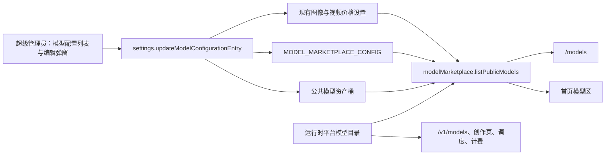

# 模型广场与模型配置设计

状态：Task 1–11 已实现；Task 12 收尾中，真实环境构建与浏览器验收待补
日期：2026-07-26
范围：`apps/web`、`packages/shared`，复用现有 `system_setting` 与存储 Provider

## 1. 实施前背景

实施前，管理后台只有独立“模型计费”页签，统一管理图像模型四档固定积分与视频模型族每秒积分；官网首页已有基于运行时事实构建的公开模型目录，但没有完整模型广场、模型展示配置、封面和详情。

本设计把“模型计费”升级为“模型配置”，在同一管理界面内管理价格和公开展示信息，同时保持财务契约与展示元数据在底层严格分离。新增公开 `/models` 模型广场，首页与模型广场共用同一展示目录；展示开关不影响外部 API、创作页、调度、权限或计费。

## 2. 目标

1. 将管理后台“模型计费”页签改为“模型配置”。
2. 以列表展示图像模型、视频模型族和图像价格兜底项；点击“编辑”后在弹窗中修改单个条目。
3. 为真实图像、视频模型配置：
   - 是否展示在模型广场；
   - 最多 200 字的简介；
   - 可上传、替换或移除的模型广场封面；
   - 现有全局价格。
4. 新增公开 `/models` 页面，展示运行时真实可达且管理员已开启的模型。
5. 模型卡展示封面、类型、真实品牌图标、模型 ID、模型 ID 复制按钮和最低价格。
6. 点击“查看详情”后使用弹窗展示简介、完整价格、支持参数与“立即使用”入口。
7. 首页公开模型区与 `/models` 使用相同的展示开关结果。

## 3. 非目标

- 不改变 `/v1/models` 的用户可调用模型列表。
- 不改变创作页模型目录、后端池调度、套餐能力或实际扣费。
- 不支持对话模型；对话模型由另一项工作移除，本设计不保留兼容字段。
- 不支持外部封面 URL、富文本简介、管理员上传品牌图标或自定义模型 ID。
- 不新增模型详情独立路由；详情使用当前页面弹窗。
- 不在第一期提供封面裁剪位置编辑、拖拽排序或模型置顶。

## 4. 已确认的产品规则

### 4.1 展示范围

- 模型广场仅包含图像模型与视频模型族。
- 管理员关闭开关后，模型从 `/models` 与首页公开模型区隐藏。
- 展示开关不影响 `/v1/models`、创作页、调用、调度与计费。
- 现有与后续新模型默认开启展示；图像模型还必须先显式配置完整四档价格。
- `default` 模型与价格兜底已删除，未知或自定义图像模型未定价时 fail-closed。

### 4.2 视频聚合

视频运行时目录会把同一模型族展开为多个“时长 × 比例 × 分辨率”完整 ID。模型广场每个视频模型族只展示一张卡片，避免 Veo、Sora、Kling 产生大量重复卡片。

每张视频卡只提供视频定价配置中的单一模型 ID，例如：

```text
veo31
```

复制按钮复制该模型 ID。组合路由 ID 不进入模型广场；支持的时长、比例和分辨率在详情
弹窗中分别展示。

### 4.3 价格展示

- 图像卡片最低价格为四个固定价格档位的最小值，单位为 `Credits / 张起`。
- 运行时额外图像模型没有显式价格时标记为“未配置价格”，管理员填写完整四档并保存前
  不能计费，也不会进入公开模型目录。
- 视频卡片展示该模型族每秒积分，单位为 `Credits / 秒`。
- 图像详情弹窗展示 1024×1024、1K、2K、4K 四档价格。
- 视频详情弹窗展示每秒积分，以及支持的时长、比例与分辨率。
- 最低价格由完整价格实时计算，不单独持久化。

### 4.4 封面与简介

- 简介为纯文本，最多 200 字。
- 封面仅允许超级管理员上传 JPEG、PNG 或 WebP，原文件最大 5 MB。
- 服务端验证真实图片内容、限制像素、自动旋转、去除元数据、按 3:2 裁切，并统一输出 WebP。
- 未上传自定义封面或主动移除封面时，使用项目内置的本地默认封面。
- 不接受外部 URL，避免外链失效、隐私泄漏、SSRF 与存储型 XSS 风险。

### 4.5 视觉约束

已确认的视觉草图只定义布局、信息层级、空间关系和交互，不定义最终视觉皮肤。正式实现必须：

- 复用当前营销 Header、Footer 与页面节奏；
- 复用 `@repo/ui` 的 Button、Dialog、Tooltip、Input、Textarea、Switch 等组件；
- 使用当前系统的语义颜色、字体、间距、圆角、边框和阴影 token；
- 不照搬参考图或草图的配色、字体和装饰风格。
- 已知模型族使用项目内置、来源与许可可追溯的真实品牌图标；无法可靠识别品牌的
  自定义模型使用系统中性模型图标，禁止冒用其他品牌。

## 5. 架构



核心边界：

1. 价格仍由现有严格财务 schema 负责。
2. 展示开关、简介和封面引用进入独立展示配置。
3. 管理端通过 UOL 修改单个模型，服务端在事务内合并回完整价格矩阵并再次校验。
4. 公开模型广场是“运行时真实可达模型”和“展示配置”的交集，展示配置不能凭空新增不可调用模型。
5. `/v1/models`、创作页和调度继续直接读取其原有事实源，不读取展示配置。

## 6. 数据契约

### 6.1 价格

继续使用：

- `IMAGE_MODEL_CREDIT_PRICES`
- `VIDEO_MODEL_CREDITS_PER_SECOND`

不向 `imageCreditPricingSchema` 或视频 `Record<string, number>` 中加入布尔值、简介或封面字段，避免污染财务契约和分组覆盖结构。

### 6.2 展示配置

新增专用系统设置键 `MODEL_MARKETPLACE_CONFIG`，`managedByDedicatedOperation: true`。逻辑结构：

```ts
type ModelMarketplaceCoverRef = {
  bucket: string;
  key: string;
};

type ModelMarketplaceWriteReceipt = {
  requestHash: string;
  category: "image" | "video";
  configKey: string;
  resultingRevision: number;
  completedAt: string;
};

type ModelMarketplaceEntry = {
  revision: number;
  visible: boolean;
  description: string;
  cover: ModelMarketplaceCoverRef | null;
};

type ModelMarketplaceConfig = {
  version: 2;
  imageByModel: Record<string, ModelMarketplaceEntry>;
  videoByFamily: Record<string, ModelMarketplaceEntry>;
  writeReceipts: Record<string, ModelMarketplaceWriteReceipt>;
};
```

约束：

- `revision` 是非负安全整数，用于单条目乐观并发控制。
- 模型键经现有图像规范化或视频 family 解析规则处理，长度不超过 120。
- `description` 去除首尾空白，最大 200 字。
- `bucket` 和 `key` 只由服务端生成；管理端输入 schema 不接受这两个字段。
- `default` 不是模型配置键，也不进入价格、展示配置或新写回执。
- `writeReceipts` 的键是稳定 JSON 数组编码后的 `actorUserId` 与 `clientRequestId` 的服务端哈希，
  不直接保存用户 ID 或原始请求键；回执只保存重放所需的载荷哈希与最小结果。
- 写回执最多保留 256 条且最长保留 24 小时，每次成功保存时在同一事务内按
  `completedAt` 清理过期和超量项；回执过期后的旧请求会因 revision 不匹配而拒绝，
  不会再次执行替换或移除。
- 历史数据库缺少此键时，解析器返回版本 2 默认配置；合法 v1 JSON 会在读取时迁移，
  丢弃旧 fallback revision 与 fallback/default 写回执，不需要数据库表迁移。
- 新模型缺少显式条目时，解析为 `revision: 0`、`visible: true`、空简介和空封面，
  再由内置简介与默认封面补齐展示；缺少 `writeReceipts` 时解析为空记录。

### 6.3 模型清单

管理端模型清单是以下事实的稳定并集：

1. 内置图像模型与视频模型族；
2. 已持久化的额外图像价格键与视频价格键；
3. 当前运行时公开目录中可规范化为图像模型或视频 family 的条目。

运行时目录暂不可用时，管理端仍可编辑内置和已持久化模型，并显示运行时清单暂不可用提示；公开模型广场按失败策略进入“暂不可用”。

## 7. UOL 设计

### 7.1 管理读取

`settings.getModelConfiguration`

- 权限：管理员可读，写入口仍仅超级管理员。
- Agent 暴露：`human-only`。
- 只读、自然幂等、无副作用。
- 返回已经规范化的模型列表 DTO，不向客户端暴露存储 bucket/key：
  - `canEdit`，只对真实 super_admin 为 true；
  - `runtimeCatalogStatus`，区分 ready 与 unavailable 降级清单；
  - category；
  - configKey；
  - displayName；
  - iconKey；
  - revision；
  - 图像 `pricingSource` 为 `explicit` 或 `unconfigured`；
  - visible；
  - description；
  - coverUrl 与是否使用默认封面；
  - 已定价图像的完整价格与 minimumCredits；
  - 未定价图像的 `pricingSource: "unconfigured"`，不伪造价格或 minimumCredits。

### 7.2 单模型保存

`settings.updateModelConfigurationEntry`

- 权限：`{ kind: "roles", roles: ["super_admin"] }`，只允许真实
  `super_admin` 用户 Principal，不允许 system Principal 代写；`human-only`。
- 写操作；保守声明为破坏性，因为同一操作可替换或移除旧封面。
- 幂等声明为
  `{ kind: "required", keyField: "clientRequestId", scope: "per-user" }`；
  `clientRequestId` 负责网络重试，条目 revision 只负责防止并发覆盖，两者职责分离。
- `readOnly: false`、`destructive: true`、
  `sideEffects: ["storage", "cache", "audit"]`；数据库配置更新由 execute 负责，
  不伪造 UOL 中不存在的副作用标签。
- 输入：`clientRequestId`、category、configKey、expectedRevision、visible、description，
  以及图像完整四档价格或视频每秒价格；`clientRequestId` 必须为 UUID。
- 封面变更使用严格联合：`keep`、`remove` 或 `replace`；只有 `replace` 接受 multipart 适配器解析出的图片字节。
- `default` 在共享输入 schema 与 Route 中均被拒绝。

执行步骤：

1. 校验模型属于当前可配置清单，拒绝任意未知 ID。
2. `replace` 时先在内存中安全处理图片、生成最终 WebP 与内容哈希；此时不写存储。
  服务端对除 `clientRequestId` 外的全部规范化输入与最终图片哈希计算稳定的
  `requestHash`，其中包含 expectedRevision，避免同一请求键被复用于不同基线。
3. 在数据库事务内按固定顺序锁定展示设置行与目标价格设置行。
4. 用稳定 JSON 数组编码当前用户与 `clientRequestId` 后计算回执键并查找写回执，避免
   裸字符串拼接歧义；载荷哈希相同则直接返回已记录的
   category、configKey 与 resultingRevision，即使 expectedRevision 已变化也不重复副作用；
   请求键相同但载荷不同则返回 `idempotency_conflict`。
5. 首次请求对比目标条目 revision；不一致时返回可定位的并发冲突，不覆盖新值。
6. `replace` 在锁内把已处理图片写入内容哈希对象；`keep` 和 `remove` 不写新对象。
7. 只替换目标模型价格、展示文本、开关和请求指定的封面状态，保留其他模型。
8. 对合并后的完整图像或视频价格再次执行现有全局财务 schema，并递增目标 revision。
9. 原子写入对应价格键、`MODEL_MARKETPLACE_CONFIG` 和写回执，并清理过期回执；
   提交后统一失效设置缓存。
10. `remove` 遇到已有自定义封面时，先在配置锁内确认旧对象可读取或已明确不存在；
    存储基础设施错误回滚并保留旧引用，数据库提交后再 best-effort 删除旧对象。
11. 数据库失败后的新对象清理，以及提交后的旧对象清理，都在短清理事务中重新锁定
    展示配置行、复核全局引用，并在删除期间保持该锁，防止并发保存刚引用同一内容哈希
    后被误删。

底层 service 自行开启事务，调用方不得再包外层事务。

封面处理约束：

- 调用方不得指定 bucket、key、URL 或输出 Content-Type。
- 在触达存储前校验权限、模型、字节数和图片内容。
- 用 Sharp 限制解码像素、自动旋转、裁为 3:2、去元数据并输出 WebP。
- 对 category、规范模型键和最终内容分别取哈希，生成不可路径穿越且内容不可变的对象键。
- 提交成功后，仅在锁内确认旧对象没有被任何模型引用时删除旧对象。
- 旧对象清理失败时记录结构化日志并保留新引用，不回滚成断图状态。

传输层使用超级管理员 multipart API 薄适配器：只解析字段和文件字节、构造真实 Principal、调用该 UOL 并编码响应，不包含价格、存储、并发或错误映射业务逻辑。没有新封面时也可使用同一适配器，避免两条保存语义漂移。

### 7.3 公开读取

`modelMarketplace.listPublicModels`

- 权限：system Principal 进程内调用；`human-only`。
- 只读、自然幂等。
- 由 `apps/web` late binding 注入真实目录、价格、设置与 URL 构造逻辑。
- 只返回公开 DTO，不返回 bucket、key、内部组、后端成员、凭据或健康错误详情。

输出项包含：

- category；
- config key；
- modelId；视频与定价配置键一致；
- displayName；
- iconKey；
- description；
- coverUrl；
- minimumCredits 与价格单位；
- 图像完整价格或视频每秒价格；
- 视频支持的时长、比例和分辨率；
- 视频组合路由 ID 不进入模型广场，页面不自行推断完整 ID。

## 8. 存储设计

新增公共模型资产桶设置，例如 `MODEL_MARKETPLACE_ASSETS_BUCKET_NAME`，默认 `model-marketplace`。对象本身仍通过当前 Local/S3 Provider 读写；公开只表示第一方读取路由允许匿名获取该专用桶中的对象，不要求 S3 桶开放公共 ACL。

模型资产 bucket 必须非空且与 avatars、generations bucket 互不相同。写入服务和读取路由
每次使用运行时设置交叉校验；冲突或非法配置时 fail-closed，不写对象、不把匿名模型资产
规则应用到任何 bucket，尤其不能扩大 generations 私有访问。

读取路由增加该桶白名单，并使用内容哈希键对应的长期 immutable 缓存。该桶只接受
`category/configHash/contentHash.webp` 形式的内容哈希键，不与 generations 私有桶或
avatars 用户资产混用。

内置资产与公开 DTO 同步落地：默认图像/视频封面是项目拥有或已获许可的 3:2 WebP；
品牌 iconKey 固定为 `openai | google | kling | xai | generic` 并映射到本地 SVG。已知模型
按真实厂商映射，未知自定义模型只使用 generic。所有来源、版本和许可记录到
`docs/model-marketplace-assets.md`，不使用第三方 CDN。

如果模型资产存储未配置或不可用：

- 上传、替换，以及移除时的存储可用性预检返回友好、可定位的错误；
- 预检失败时已保存封面引用不被清空；提交后的物理删除失败只留下无引用孤儿并记录
  结构化告警，不把已切换到默认封面的配置回滚成断图引用；
- 没有自定义封面的模型继续使用本地默认封面；
- 公开模型目录仍可展示默认封面。

## 9. 管理端交互

### 9.1 列表

页签名称改为“模型配置”。主界面使用列表，列为：

- 封面缩略图；
- 品牌图标与模型 ID；
- 类型；
- 模型广场状态；
- 最低价格；
- 编辑操作。

列表支持按 ID 搜索和按图像、视频筛选。未定价图像显示“未配置价格”，完整填写四档
价格并保存前不能计费或进入模型广场。真实 super_admin 显示“编辑”；其他可读管理员
显示“查看”。

### 9.2 编辑弹窗

点击“编辑”打开 Dialog：

- 只读品牌图标和模型 ID；
- 封面预览、选择图片、移除自定义封面；
- 是否展示开关；
- 简介输入与字符计数；
- 图像四档价格或视频每秒价格；
- 取消与保存。

弹窗将文件保留为本地预览，点击保存后统一调用
`settings.updateModelConfigurationEntry`。一次保存只修改一个模型；一次用户保存动作生成
一个 UUID `clientRequestId`，自动重试复用该值，用户修改草稿或再次主动保存时生成新值。
保存冲突时保留用户草稿，提示配置已被他人更新并允许重新加载。

未定价图像弹窗显示空的四档价格输入，并继续提供该真实模型的简介、封面和展示开关。

管理读取返回 canEdit=false 时 Dialog 全部只读，不显示保存、上传或移除操作，避免普通管理员
在提交后才发现无权限。

## 10. 模型广场交互

### 10.1 页面

新增公开营销路由 `/models`：

- 营销主导航的 Models 从首页锚点改为 `/models`；
- 页面使用现有营销 Header、Footer 和本地化路由；
- Server Component 通过 UOL 读取公开 DTO；
- 页面强制动态渲染，禁止 Full Route Cache 固化运行时目录或展示开关；
- 客户端组件只处理搜索、类型筛选、复制反馈和详情弹窗。

页面 metadata 提供中英文 canonical 与 alternates；中英文 `ModelMarketplace` key 树必须
一致。普通 Footer、首页 Footer 与 sitemap 同步增加 `/models`，站内 Footer 链接使用
i18n routing 的 Link。

桌面为筛选侧栏加三列卡片；中等宽度收为两列；移动端为单列，筛选收进现有 Sheet 模式。

### 10.2 卡片

卡片布局顺序：

1. 3:2 封面；
2. IMAGE 或 VIDEO 类型标签；
3. 真实品牌图标、模型 ID、紧随 ID 的仅图标复制按钮；
4. 最低价格；
5. 整行“查看详情”操作。

长 ID 使用文本省略；Tooltip 展示完整 ID。复制按钮始终复制完整 ID，拥有可读的 `aria-label`，成功后短暂切换确认图标并用 toast 与屏幕阅读器播报。复制按钮不触发卡片详情操作。

封面容器固定为 3:2；自定义封面 404 或解码失败时只回退一次对应类别的本地默认封面，
不修改持久化配置、不无限重试。

### 10.3 详情弹窗

Dialog 展示：

- 封面；
- 品牌图标和展示名称；
- 完整 ID 与仅图标复制按钮；
- 简介；
- 图像完整四档价格或视频每秒价格；
- 支持参数；
- “立即使用此模型”。

移动端使用全屏 Sheet 或等价的项目现有响应式 Dialog 形态。打开后转移并限制焦点，Esc 可关闭，关闭后焦点回到来源卡片。

“立即使用”进入现有创作页并携带 category 和模型预选参数。图像创作页必须根据当前用户
套餐与授权目录重新校验；视频页先校验静态支持目录，最终调用仍由服务端重新执行用户、
后端和模型校验。禁止把营销目录当作授权来源；预选模型不可用时给出友好提示并回退安全
默认值。category/model 只消费一次，移除它们时保留 ref、mode 等其他查询参数。

未登录用户访问受保护创作 URL 时，proxy 把 pathname 与 query 一起放进 callbackUrl。
登录和注册页只接受无 locale 或当前 locale 前缀下 `/dashboard` 开头的站内路径，并统一
输出带当前 locale 前缀的路径；拒绝绝对 URL、协议相对 URL、错误 locale、反斜杠、控制
字符和其他路径。邮箱与 Google 流程以及登录/注册互链都保留同一安全 callback，非法值
统一回退当前 locale 的 dashboard。

## 11. 首页集成

首页改为使用 `modelMarketplace.listPublicModels` 的图像投影，不再直接把未过滤运行时目录作为公开展示结果。首页保持其现有布局，不复制模型广场卡片。

首页与模型广场共享：

- visible 过滤；
- 运行时可达性交集；
- 配置失败状态；
- 空目录语义。

`/v1/models` 继续使用当前用户、套餐和 API Key 语义，不调用模型广场 UOL。

## 12. 状态与失败处理

### 12.1 默认与兼容

- 缺少 `MODEL_MARKETPLACE_CONFIG`：使用版本 2 默认配置。
- 新增模型没有显式展示条目：默认开启展示、使用内置简介和默认封面、revision 0；新增
  图像还必须先配置完整四档价格，未定价时不公开。
- 历史额外价格模型：保留价格并出现在管理清单；如果运行时不可达，不出现在公开模型广场。
- 配置 JSON 存在但无法通过严格 schema：公开模型广场与首页模型区进入 unavailable，不绕过管理员意图；管理端显示可定位错误，不静默覆盖脏值。

### 12.2 公开状态

- `ready` 且有模型：展示列表。
- `ready` 且无模型：展示正常空状态，说明当前暂无公开模型。
- `unavailable`：展示依赖暂不可用状态，允许稍后重试。

空状态与 unavailable 必须保持不同，不能用空数组掩盖依赖故障。

### 12.3 封面失败

- 自定义封面请求 404 或解码失败：客户端回退本地默认封面并避免无限重试。
- 存储写失败：不修改数据库引用。
- 数据库更新失败：删除本次新对象并上抛。
- 旧对象删除失败：记录稳定结构化字段，保留新引用。

## 13. 安全

- 所有管理输入使用 Zod；文件内容额外由 Sharp 实际解码验证。
- multipart 路由在读取正文前完成可信 Origin 和真实 `super_admin` 预检；对真实流式正文
  逐块累计并执行 6 MiB 总上限，再对有界副本调用 `formData()`，不能只信任
  `Content-Length` 或先无界缓冲。
- 拒绝 SVG、GIF、HTML、伪 MIME、损坏图、超限文件与像素炸弹。
- category、configKey 必须属于服务端构建的可配置模型清单。
- 客户端永远不能提交 bucket、key、URL、任意路径或 Content-Type 作为存储真相。
- 对象键使用哈希，不包含未经处理的模型 ID、文件名或路径片段。
- 封面公开输出只包含第一方安全 URL。
- UOL 输出使用严格 schema，避免泄漏存储引用、后端组、成员、凭据或错误详情。
- 替换、移除写入管理员审计，日志不包含图片字节或原始异常对象。
- `/v1/models` 和创作页继续执行各自权限与套餐校验，展示开关不能提升权限。

## 14. 可访问性与响应式

- 复制、编辑、关闭、保存、筛选与详情按钮均为原生可聚焦控件。
- 仅图标按钮必须有 `aria-label` 与 Tooltip。
- 状态不只用颜色表达，必须同时显示“已展示”“已隐藏”等文本。
- Dialog 管理打开、关闭、错误后的焦点；上传错误与复制成功使用可播报区域。
- 图片提供描述模型与用途的 alt；装饰性默认封面按实际用途决定空 alt。
- 验证 320、768、1024、1440 像素宽度。
- 尊重当前系统的 reduced motion 规则。

## 15. 测试计划

### 15.1 Shared 纯逻辑

- 展示配置 schema、缺键默认、严格脏值拒绝。
- 图像与视频模型键规范化。
- 新模型默认展示、显式 false 隐藏。
- 图像最低价格与视频每秒价格。
- 视频 family 聚合、定价模型 ID 与组合路由 ID 的隔离。
- `default` 永不进入公开目录。

### 15.2 UOL 与服务

- operation 名称、权限、`human-only`、readOnly/destructive、sideEffects、幂等声明。
- 管理读取不暴露 bucket/key。
- 用户、普通管理员、system Principal 不能执行真实超级管理员封面写操作。
- 单模型保存合并完整矩阵并重新通过财务 schema。
- `clientRequestId` 缺失或非法时拒绝；同用户、同请求键、同载荷返回已记录结果且
  不重复存储、数据库或审计副作用。
- 同用户复用请求键但载荷不同返回 `idempotency_conflict`；新请求使用旧 revision 时
  返回并发冲突且不覆盖。
- 写回执随成功保存原子落库并按 24 小时、256 条上限清理；回执过期后的旧请求
  仍由 revision 阻止重复副作用。
- 图像和视频单条更新不修改其他模型。
- 通用 settings 更新入口继续拒绝专用配置键。

### 15.3 上传与存储

- JPEG、PNG、WebP 成功并统一输出 WebP。
- 伪 MIME、SVG、GIF、损坏图、超 5 MB、超像素限制全部拒绝且不写存储。
- 对象键不包含原模型 ID、文件名或路径控制字符。
- Local 与 S3 Provider 都通过 server-side `putObject` 工作。
- put 失败不改配置；配置失败在配置锁内清理无引用新对象；旧对象删除失败记录日志并
  保持新的配置真相。
- 替换与移除的并发 revision 测试。
- 共享封面引用只有在持有展示配置锁且确认无其他引用时删除。
- multipart 覆盖缺失或非法长度、伪造偏小长度、chunked 输入及总正文超限。
- 公共读取路由只开放专用模型资产桶，不扩大 generations 私有桶访问。
- 模型资产 bucket 与 avatars/generations 冲突时写入和匿名读取都 fail-closed。

### 15.4 公开目录

- 只输出运行时可达且 visible 的模型。
- true 配置不能凭空新增运行时不存在的模型。
- 图像、视频字段投影正确，视频变体归并为一个 family。
- 封面、简介、价格和参数正确；无自定义封面使用默认资源。
- 配置缺失使用默认；配置脏值或依赖失败返回 unavailable；全部关闭返回 ready-empty。
- 输出严格拒绝任何额外内部字段。
- `/v1/models` 与创作页目录不受 visible 影响。

### 15.5 UI

- 管理列表搜索、类型筛选、状态与最低价格。
- 编辑弹窗加载、草稿、字符限制、价格校验、封面预览、移除、取消和保存。
- 保存失败保留草稿与旧封面；冲突提示可重新加载。
- 模型卡搜索、分类筛选、长 ID 省略与 Tooltip。
- 复制按钮复制公开模型 ID，成功/失败反馈正确且不打开详情。
- 详情弹窗焦点、Esc、移动端形态、完整价格与支持参数。
- “立即使用”携带预选参数，创作页重新校验不可用模型。
- 首页隐藏同步、空状态与 unavailable。

### 15.6 质量门

- `turbo typecheck`
- `turbo lint`
- `turbo test`
- 管理页与 `/models` 的桌面、平板、移动端浏览器验证
- 键盘导航、屏幕阅读器语义与控制台错误检查

## 16. 文档与运维

- 将管理员文档中的“模型计费”更新为“模型配置”。
- 记录模型资产桶配置、Local/S3 行为、允许格式、尺寸、缓存和故障回退。
- 现行 UOL、存储与故障边界记录在
  [model-marketplace-operations.md](../../model-marketplace-operations.md)。
- 默认封面和品牌图标的来源、完整性与许可记录在
  [model-marketplace-assets.md](../../model-marketplace-assets.md)。
- 同步中英文消息与导航测试。
- 新增品牌 SVG 时保存在本地静态资产目录，并记录来源、版本与许可；运行时不得依赖第三方 CDN。
- `.superpowers/brainstorm/` 视觉草图只作为本地设计过程参考，不加入产品提交。

## 17. 验收标准

1. 超级管理员能在列表中找到每个图像模型和视频模型族；未定价图像明确显示“未配置价格”。
2. 点击编辑能保存单模型价格、简介、展示开关和封面；并发冲突不会静默覆盖。
3. `/models` 只展示运行时可达、已开启且已显式定价的图像模型，首页遵循相同规则。
4. 卡片采用已确认布局并贴合当前系统主题，复制按钮为紧跟模型 ID 的仅图标按钮。
5. 卡片只展示最低价格，详情弹窗展示完整价格、简介、参数和立即使用入口。
6. 视频每个 family 只展示一张卡片，复制的是定价配置中的单一模型 ID；时长、比例和
   分辨率只在详情中展示。
7. 封面上传安全、可替换、可移除，失败不会产生断图引用；缺失时使用本地默认封面。
8. `/v1/models`、创作页、调度和套餐权限保持不变；未显式定价的图像模型拒绝计费。
9. 中英文、响应式、无障碍和全量质量门通过。
